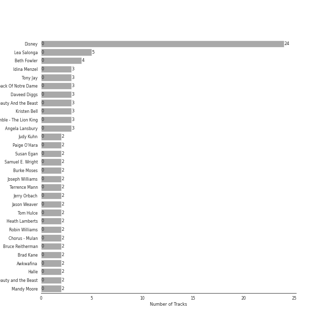
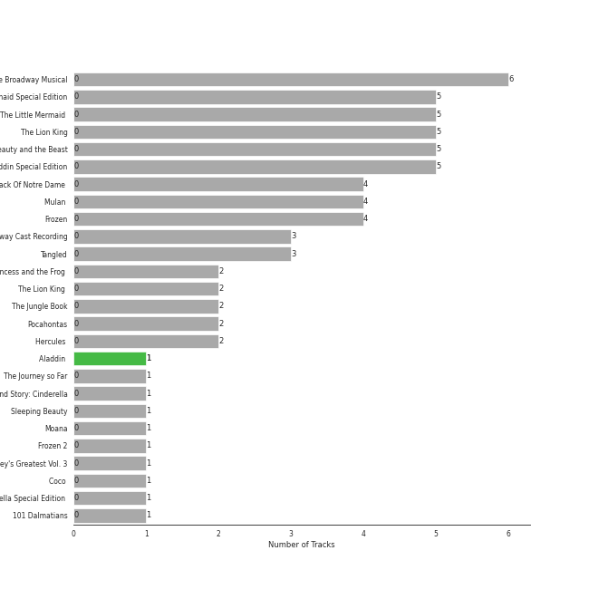
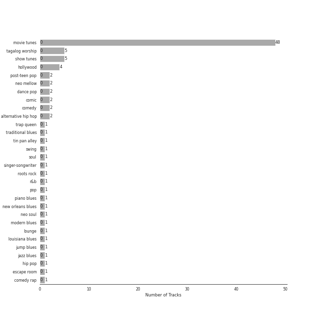
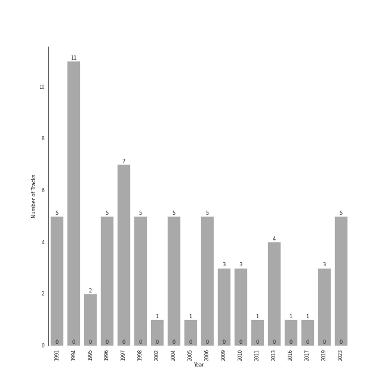

# Disney

[69 tracks (1 liked) 🔗](https://open.spotify.com/playlist/6OHUelObHhiWFkbH4cwFMg)

## Top Artists

| Art | Rank | Tracks | 💚 | Artist | 🔗 |
|:---|---:|---:|---:|:---|:---|
|  | 449 | 1 | 1 | Naomi Scott | [🔗](https://open.spotify.com/artist/2Zi3RrdQqk63Xj0914STkS) |
|  | 449 | 25 | 0 | Disney | [🔗](https://open.spotify.com/artist/3xvaSlT4xsyk6lY1ESOspO) |
|  | 252 | 5 | 0 | Lea Salonga | [🔗](https://open.spotify.com/artist/1GlMjIezcLwV3OFlX0uXOv) |
| | 449 | 4 | 0 | Beth Fowler | [🔗](https://open.spotify.com/artist/7KNW6OwcA260MsaEtnvhxV) |
|  | 356 | 3 | 0 | Idina Menzel | [🔗](https://open.spotify.com/artist/73Np75Wv2tju61Eo9Zw4IR) |
|  | 449 | 3 | 0 | Tony Jay | [🔗](https://open.spotify.com/artist/5qQpn0ZokyamZjyKtkKUYD) |
| | 449 | 3 | 0 | Chorus - The Hunchback Of Notre Dame | [🔗](https://open.spotify.com/artist/5oHSxqr1uDloCbJJPNBd6T) |
|  | 449 | 3 | 0 | Daveed Diggs | [🔗](https://open.spotify.com/artist/3twuAojvYNrlWZpMkxLm3P) |
| | 449 | 3 | 0 | Chorus - Beauty And the Beast | [🔗](https://open.spotify.com/artist/3kWWBtNzJFtKA222gZz39d) |
|  | 297 | 3 | 0 | Kristen Bell | [🔗](https://open.spotify.com/artist/2kHxkdiKCSnHMkhIgFBZaI) |

See top 100 artists

| Art | Rank | Tracks | 💚 | Artist | 🔗 |
|:---|---:|---:|---:|:---|:---|
| | 449 | 3 | 0 | Ensemble - The Lion King | [🔗](https://open.spotify.com/artist/0s0Hfb6ckk9qTjDeUOZXJp) |
|  | 449 | 3 | 0 | Angela Lansbury | [🔗](https://open.spotify.com/artist/0LtVJXnPR8msCJiE2DjHxy) |
|  | 449 | 2 | 0 | Judy Kuhn | [🔗](https://open.spotify.com/artist/7tHd518aPjJYUgyv9bidBz) |
|  | 449 | 2 | 0 | Paige O'Hara | [🔗](https://open.spotify.com/artist/7oavKrnYbTZPAPq7zCuipM) |
|  | 449 | 2 | 0 | Susan Egan | [🔗](https://open.spotify.com/artist/7CckquWatDQSr3PFKkjM8M) |
| | 449 | 2 | 0 | Samuel E. Wright | [🔗](https://open.spotify.com/artist/6Id8rcDNyBXPcgKQVfQ8rX) |
| | 449 | 2 | 0 | Burke Moses | [🔗](https://open.spotify.com/artist/64BC8AWWTaiOhej6ZYAXzv) |
|  | 449 | 2 | 0 | Joseph Williams | [🔗](https://open.spotify.com/artist/5xk0kRuXn1zToTHpHAqpui) |
| | 449 | 2 | 0 | Terrence Mann | [🔗](https://open.spotify.com/artist/5uBIsYz9WatgoViLG6pVj2) |
|  | 449 | 2 | 0 | Jerry Orbach | [🔗](https://open.spotify.com/artist/5i2OpmeVKsmViqoETxuOvO) |
|  | 449 | 2 | 0 | Jason Weaver | [🔗](https://open.spotify.com/artist/5UdPkKWd8YNR5xGcmqH9QJ) |
| | 449 | 2 | 0 | Tom Hulce | [🔗](https://open.spotify.com/artist/4wd5K3s3ekf0czSh2qGjTD) |
| | 449 | 2 | 0 | Heath Lamberts | [🔗](https://open.spotify.com/artist/4YYb7AZfDDAmEHSdNCtQfL) |
|  | 449 | 2 | 0 | Robin Williams | [🔗](https://open.spotify.com/artist/4OrieSJUghNfNx5UuPCgxF) |
| | 449 | 2 | 0 | Chorus - Mulan | [🔗](https://open.spotify.com/artist/4KpdqBDU2C5gB3vhdojuqA) |
|  | 449 | 2 | 0 | Bruce Reitherman | [🔗](https://open.spotify.com/artist/43HPW60tz4BMYMRnmXMagJ) |
|  | 449 | 2 | 0 | Brad Kane | [🔗](https://open.spotify.com/artist/3dAzSJ9lQnJSq5Z0OgDBep) |
|  | 449 | 2 | 0 | Awkwafina | [🔗](https://open.spotify.com/artist/3SmyWs7ou3udD8gtM0Z6Vx) |
|  | 449 | 2 | 0 | Halle | [🔗](https://open.spotify.com/artist/3HsVtnnjOUToyJThxaoBfx) |
| | 449 | 2 | 0 | Broadway Cast of Beauty and the Beast | [🔗](https://open.spotify.com/artist/31gtcs2n8ILyd09TvlSwJt) |
|  | 449 | 2 | 0 | Mandy Moore | [🔗](https://open.spotify.com/artist/2LJxr7Pt3JnP60eLxwbDOu) |
|  | 449 | 2 | 0 | Phil Harris | [🔗](https://open.spotify.com/artist/2ISMfPtVzHc9jDDVPUEHDa) |
|  | 449 | 2 | 0 | Kenny Raskin | [🔗](https://open.spotify.com/artist/28OYna1pjzLUp2TrXnkK6p) |
| | 449 | 2 | 0 | Sarah Solie Shannon | [🔗](https://open.spotify.com/artist/1A2F6sucjT7YDTJtVtB9Oz) |
|  | 449 | 2 | 0 | Lebo M. | [🔗](https://open.spotify.com/artist/0zp9qNDSeYi3QEodhcKAAA) |
|  | 449 | 2 | 0 | Richard White | [🔗](https://open.spotify.com/artist/0jWqALm6pl5CHj5N0eO68G) |
| | 449 | 2 | 0 | Linda Talcott | [🔗](https://open.spotify.com/artist/0XmsLZGAfaW5GvksORVlXJ) |
| | 449 | 2 | 0 | Ernie Sabella | [🔗](https://open.spotify.com/artist/0RH6EMxqfzCEB7QCSKQ4xr) |
|  | 449 | 2 | 0 | Nathan Lane | [🔗](https://open.spotify.com/artist/0P0do9GwiSgweSF6Ui3mrv) |
| | 449 | 2 | 0 | Gary Beach | [🔗](https://open.spotify.com/artist/0OckhIDFyA68SQXxyefMcH) |
|  | 449 | 2 | 0 | David Ogden Stiers | [🔗](https://open.spotify.com/artist/0N0dbr5s2y20PAo2cDAeVP) |
| | 449 | 2 | 0 | Paige Price | [🔗](https://open.spotify.com/artist/0GzTqQj6pGeI2iW6cA0uSR) |
|  | 449 | 1 | 0 | Brian Press | [🔗](https://open.spotify.com/artist/7ytM1slwsB4EJ8JYhMtBmf) |
|  | 449 | 1 | 0 | Seth Rogen | [🔗](https://open.spotify.com/artist/7xX39IyguhWsTIg4eU2reH) |
| | 449 | 1 | 0 | Jason Raize | [🔗](https://open.spotify.com/artist/7wtyPvLmy8LAf2CO0Xwy4p) |
|  | 449 | 1 | 0 | Sally Dworsky | [🔗](https://open.spotify.com/artist/7vK6xoR5zT4DypEu0blUku) |
|  | 449 | 1 | 0 | Verna Felton | [🔗](https://open.spotify.com/artist/7aU90hxXexP47nEeMee6xM) |
| | 449 | 1 | 0 | Billy Bletcher | [🔗](https://open.spotify.com/artist/7MCVs8C2nykvXVyTyrUoVd) |
|  | 449 | 1 | 0 | Harvey Fierstein | [🔗](https://open.spotify.com/artist/7G6zawIBBtDX1WvuT97Ei9) |
|  | 449 | 1 | 0 | Vaneese Thomas | [🔗](https://open.spotify.com/artist/79cmm0PKrLWIrqp80GpJtK) |
|  | 449 | 1 | 0 | Childish Gambino | [🔗](https://open.spotify.com/artist/73sIBHcqh3Z3NyqHKZ7FOL) |
|  | 449 | 1 | 0 | Laura Williams | [🔗](https://open.spotify.com/artist/6wIj7GdxBjFtw6ySpzazwo) |
|  | 142 | 1 | 0 | [Beyoncé](../../artists/beyoncé/overview.md) | [🔗](https://open.spotify.com/artist/6vWDO969PvNqNYHIOW5v0m) |
| | 449 | 1 | 0 | Agatha Lee Monn | [🔗](https://open.spotify.com/artist/6kHu5ICQRBZdsAHjAjQlmp) |
| | 449 | 1 | 0 | Max Casella | [🔗](https://open.spotify.com/artist/6ZpL3BxODab84CTGSL7UO8) |
|  | 449 | 1 | 0 | Jeremy Irons | [🔗](https://open.spotify.com/artist/6QRb3jE2lCfMU1iUuVQMaV) |
|  | 449 | 1 | 0 | Carmen Twillie | [🔗](https://open.spotify.com/artist/6O3ZB5Cz5CNT3wQWouKcNJ) |
|  | 449 | 1 | 0 | Paul Kandel | [🔗](https://open.spotify.com/artist/6M3XR163Q68THc9IFMwfAH) |
|  | 449 | 1 | 0 | Cheech Marin | [🔗](https://open.spotify.com/artist/68TP2Pr8i7dvyFHU0p748r) |
|  | 449 | 1 | 0 | Bruce Adler | [🔗](https://open.spotify.com/artist/66oKiXdIQP7MwN0gPUY0FD) |
| | 449 | 1 | 0 | Roz Ryan | [🔗](https://open.spotify.com/artist/66mvEj9XSF89tUj87Y3HDu) |
| | 449 | 1 | 0 | Rene Auberjonois | [🔗](https://open.spotify.com/artist/5vLv7RBpAmIPypST2zhKUw) |
|  | 449 | 1 | 0 | Auli'i Cravalho | [🔗](https://open.spotify.com/artist/5mnS9jJdKQQcRSqFu5YPVe) |
|  | 449 | 1 | 0 | Donny Osmond | [🔗](https://open.spotify.com/artist/5ZEAzHE2TzAwUcOj6jMIgf) |
|  | 449 | 1 | 0 | Rowan Atkinson | [🔗](https://open.spotify.com/artist/5U4QDnlOlmZx9MHV45EoDE) |
|  | 449 | 1 | 0 | Lillias White | [🔗](https://open.spotify.com/artist/5TKKPpY9zr2qrz3JM3Vawq) |
| | 449 | 1 | 0 | Katie Lopez | [🔗](https://open.spotify.com/artist/5Kkhk21siwbW3BfZUwpykJ) |
|  | 449 | 1 | 0 | Donna Murphy | [🔗](https://open.spotify.com/artist/5BuTOT6mPoNZ5EmaPheBI9) |
| | 449 | 1 | 0 | Jesse Corti | [🔗](https://open.spotify.com/artist/53vhGhGRoi9ARM7kr3jrz5) |
|  | 449 | 1 | 0 | Louis Prima | [🔗](https://open.spotify.com/artist/52lBOxCxbJg0ttXEW9CQpW) |
| | 449 | 1 | 0 | Kristle Edwards | [🔗](https://open.spotify.com/artist/4y5d67UxD0QON2vRZOjXZ6) |
| | 449 | 1 | 0 | Roger Bart | [🔗](https://open.spotify.com/artist/4sZw3BLoQ9SniX4mcoh80b) |
|  | 449 | 1 | 0 | Jodi Benson | [🔗](https://open.spotify.com/artist/4mmMtabvFCKA6HfmVmitNH) |
| | 449 | 1 | 0 | Pinto Colvig | [🔗](https://open.spotify.com/artist/4X8LTt7CXvrqzfS4G4ONUX) |
|  | 449 | 1 | 0 | Ilene Woods | [🔗](https://open.spotify.com/artist/4DovRSplr3yJIeE3r0RtHj) |
|  | 449 | 1 | 0 | Santino Fontana | [🔗](https://open.spotify.com/artist/47NluEnhJda2gsnjuvcoob) |
|  | 449 | 1 | 0 | Tsidii Le Loka | [🔗](https://open.spotify.com/artist/478Cvh1XjJiURpkqbM23SV) |
|  | 449 | 1 | 0 | Faca Kulu | [🔗](https://open.spotify.com/artist/43YEHQb9ZzZBBgTMKtgJmG) |
|  | 449 | 1 | 0 | Cast - The Little Mermaid | [🔗](https://open.spotify.com/artist/433fI3xZoJp1D1dizEkJ3R) |
| | 449 | 1 | 0 | LaChanze | [🔗](https://open.spotify.com/artist/3zT7dcLl9wbSXsVh3VQx3A) |
| | 449 | 1 | 0 | Jerry Tondo | [🔗](https://open.spotify.com/artist/3wUpOiaLjwAZNregbC7CxO) |
|  | 449 | 1 | 0 | Shahadi Wright Joseph | [🔗](https://open.spotify.com/artist/3qBrg0c1loxePyWQxp6F75) |
| | 449 | 1 | 0 | Mice Chorus | [🔗](https://open.spotify.com/artist/3gcnVAcMBdtYbril7EqBz6) |
|  | 449 | 1 | 0 | Matthew Wilder | [🔗](https://open.spotify.com/artist/3bmFPbLMiLxtR9tFrTcKcP) |
| | 449 | 1 | 0 | Zachary Levi | [🔗](https://open.spotify.com/artist/3XSyTI9ct70ZheMESAv2st) |
| | 449 | 1 | 0 | Ensemble - The Little Mermaid | [🔗](https://open.spotify.com/artist/3WoPXSBmNV9DJnxZgnU224) |
|  | 449 | 1 | 0 | Bill Lee | [🔗](https://open.spotify.com/artist/3UcnwnNwP6egaBs7DAgRdJ) |
| | 449 | 1 | 0 | Barbara Marineau | [🔗](https://open.spotify.com/artist/3UHGebThLKTMzANl7f83P9) |
|  | 449 | 1 | 0 | Robby Benson | [🔗](https://open.spotify.com/artist/3QcGV278a6mmLRTOK29WBP) |
|  | 449 | 1 | 0 | Jim Cummings | [🔗](https://open.spotify.com/artist/3OIPwMAZipDCLQwHmxS5EG) |
|  | 449 | 1 | 0 | Cheryl Freeman | [🔗](https://open.spotify.com/artist/3E0MPcbZSjfJ1HsnJKXkqd) |
|  | 449 | 1 | 0 | Dr. John | [🔗](https://open.spotify.com/artist/320TrJub4arztwXRm7kqVO) |
|  | 449 | 1 | 0 | Heather Headley | [🔗](https://open.spotify.com/artist/2xDc4cU0Rj6YG8SrmAHIy0) |
|  | 449 | 1 | 0 | JayDon | [🔗](https://open.spotify.com/artist/2wrxoZjEVKfJZhxCiqK0ju) |
| | 449 | 1 | 0 | Chorus - Hercules | [🔗](https://open.spotify.com/artist/2pLvZNFSNqj5ggB8cPK7ki) |
|  | 449 | 1 | 0 | Marni Nixon | [🔗](https://open.spotify.com/artist/2Npf96k0QoY8YYwqnELDmQ) |
| | 449 | 1 | 0 | Stacey Logan | [🔗](https://open.spotify.com/artist/2HCcvZjqbz0BWWBLG5Yzgu) |
| | 449 | 1 | 0 | Heidi Mollenhauer | [🔗](https://open.spotify.com/artist/2FmXrymxv6kNBnA66HpoPt) |
|  | 449 | 1 | 0 | Tawatha Agee | [🔗](https://open.spotify.com/artist/26j9y8Rq679tININ1Mt4ZV) |
| | 449 | 1 | 0 | Tom Alan Robbins | [🔗](https://open.spotify.com/artist/25X8ispTOFwbyfJEpkGh50) |

## Top Tracks

Most and least listened tracks

| Rank | ​ | Most listened tracks | Rank | ​​ | Least listened tracks |
|---:|:---|:---|---:|:---|:---|
| 1053 |  | When Will My Life Begin? - From "Tangled" / Soundtrack Version | 1053 |  | Poor Unfortunate Souls |
| 1053 |  | Les Poissons | 1053 |  | Can You Feel The Love Tonight |
| 1053 |  | Beauty and the Beast | 1053 |  | Part of Your World |
| 1053 |  | Go the Distance | 1053 |  | The Bare Necessities |
| 1053 |  | Circle of Life | 1053 |  | Out There |
| 1053 |  | Belle | 1053 |  | Under the Sea |
| 1053 |  | Speechless (Full) | 1053 |  | Honor To Us All |
| 1053 |  | Let It Go - From "Frozen"/Soundtrack Version | 1053 |  | Belle |
| 1053 |  | I Just Can't Wait to Be King | 1053 |  | For the First Time in Forever - From "Frozen"/Soundtrack Version |
| 1053 |  | Gaston | 1053 |  | Be Our Guest |

## Top Albums

| Art | Rank | Tracks | 💚 | Album | Release Date | 🔗 |
|:---|---:|---:|---:|:---|:---|:---|
|  | 692 | 6 | 0 | Beauty And The Beast: The Broadway Musical | 2006-06-06 | [🔗](https://open.spotify.com/album/3Pzoe4ffuNsxdgTHGaFJmo) |
|  | 692 | 5 | 0 | The Little Mermaid Special Edition | 2006-01-01 | [🔗](https://open.spotify.com/album/4aAwvCRNJIqiUGVEjieWv6) |
|  | 692 | 5 | 0 | The Little Mermaid (Original Motion Picture Soundtrack) | 2023-05-19 | [🔗](https://open.spotify.com/album/40tsP3taBOC9HqNaLCZZKP) |
|  | 692 | 5 | 0 | The Lion King | 1994-01-01 | [🔗](https://open.spotify.com/album/3YA5DdB3wSz4pdfEXoMyRd) |
|  | 692 | 5 | 0 | Beauty and the Beast | 1991-01-01 | [🔗](https://open.spotify.com/album/3O5p9VNddbwvqWTdYKEqV5) |
|  | 692 | 5 | 0 | Aladdin Special Edition | 2004-01-01 | [🔗](https://open.spotify.com/album/7bt2aty3lUo6Q1Ud8pthRz) |
|  | 692 | 4 | 0 | The Hunchback Of Notre Dame (Original Motion Picture Soundtrack) | 1996-05-28 | [🔗](https://open.spotify.com/album/7btQeUDTIIfnh2iCQ8Pfhq) |
|  | 692 | 4 | 0 | Mulan (Original Soundtrack) | 1998-01-01 | [🔗](https://open.spotify.com/album/3Ohs7Jo6GM6mydUOL0m5aC) |
|  | 692 | 4 | 0 | Frozen (Original Motion Picture Soundtrack / Deluxe Edition) | 2013-01-01 | [🔗](https://open.spotify.com/album/7lZs5r4oQV2nutddffLrg0) |
|  | 692 | 3 | 0 | The Lion King: Original Broadway Cast Recording | 1997-01-01 | [🔗](https://open.spotify.com/album/1y6p6tINBthUWsQVQJmiYK) |

See all 26 albums

| Art | Rank | Tracks | 💚 | Album | Release Date | 🔗 |
|:---|---:|---:|---:|:---|:---|:---|
|  | 692 | 3 | 0 | Tangled | 2010-01-01 | [🔗](https://open.spotify.com/album/1l0aFrH24oPrQSqGtfeFyE) |
|  | 692 | 2 | 0 | The Princess and the Frog (Original Motion Picture Soundtrack) | 2009-11-23 | [🔗](https://open.spotify.com/album/0CcL28OkH89kjgKpNZC8sW) |
|  | 692 | 2 | 0 | The Lion King (Original Motion Picture Soundtrack) | 2019-07-11 | [🔗](https://open.spotify.com/album/7e8y48Z2fkJNGBOKSECCeS) |
|  | 692 | 2 | 0 | The Jungle Book | 1997-01-01 | [🔗](https://open.spotify.com/album/7zdZNXoapFcOW663zgLdOE) |
|  | 692 | 2 | 0 | Pocahontas | 1995-01-01 | [🔗](https://open.spotify.com/album/7L6kEZVkWh7OEI71b1JHZd) |
|  | 692 | 2 | 0 | Hercules (Original Motion Picture Soundtrack) | 1997-01-01 | [🔗](https://open.spotify.com/album/1wbY6VUchNsZLaDi22eD3J) |
|  | 692 | 1 | 1 | Aladdin (Original Motion Picture Soundtrack) | 2019-05-22 | [🔗](https://open.spotify.com/album/4WGcPCflN9FNccSu7tE9iS) |
|  | 692 | 1 | 0 | The Journey so Far | 2011-08-09 | [🔗](https://open.spotify.com/album/3zr8JDmixklHY1sOURyfoK) |
|  | 692 | 1 | 0 | Songs and Story: Cinderella | 2009-01-01 | [🔗](https://open.spotify.com/album/1d4rBfCtXPqkphzbvjokLa) |
|  | 692 | 1 | 0 | Sleeping Beauty | 1996-01-01 | [🔗](https://open.spotify.com/album/3U3I9TY7on88tPvM1guh54) |
|  | 692 | 1 | 0 | Moana (Original Motion Picture Soundtrack/Deluxe Edition) | 2016-11-18 | [🔗](https://open.spotify.com/album/6pZj4nvx6lV3ulIK3BSjvs) |
|  | 692 | 1 | 0 | Frozen 2 (Original Motion Picture Soundtrack/Deluxe Edition) | 2019-11-15 | [🔗](https://open.spotify.com/album/4M07HWIlZr7zoXoxDHR5mz) |
|  | 692 | 1 | 0 | Disney's Greatest Vol. 3 | 2002-08-20 | [🔗](https://open.spotify.com/album/6UuNvv5UFJG5bQkYzQIarh) |
|  | 692 | 1 | 0 | Coco (Original Motion Picture Soundtrack) | 2017-11-10 | [🔗](https://open.spotify.com/album/7nMexBA71PdwPnfqS5Yji5) |
|  | 692 | 1 | 0 | Cinderella Special Edition (Original Motion Picture Soundtrack/Japanese Version) | 2005-10-19 | [🔗](https://open.spotify.com/album/3QAxBLpXRLVMh1dRtuQa0q) |
|  | 692 | 1 | 0 | 101 Dalmatians | 1998-01-01 | [🔗](https://open.spotify.com/album/6hcQqEfqHDkQZl1bdgr4Vr) |

## Top Record Labels

| Tracks | 💚 | Label |
|---:|---:|:---|
| 68 | 1 | [Walt Disney Records](../../labels/walt_disney_records/overview.md) |
| 1 | 0 | LML Music |

## Genres

| Tracks | 💚 | Genre |
|---:|---:|:---|
| 49 | 1 | [movie tunes](../../genres/movie_tunes/overview.md) |
| 3 | 1 | [post-teen pop](../../genres/post-teen_pop/overview.md) |
| 1 | 1 | vapor pop |
| 5 | 0 | tagalog worship |
| 5 | 0 | [show tunes](../../genres/show_tunes/overview.md) |
| 4 | 0 | hollywood |
| 2 | 0 | [neo mellow](../../genres/neo_mellow/overview.md) |
| 2 | 0 | [dance pop](../../genres/dance_pop/overview.md) |
| 2 | 0 | comic |
| 2 | 0 | comedy |

See all 35 genres

| Tracks | 💚 | Genre |
|---:|---:|:---|
| 2 | 0 | alternative hip hop |
| 1 | 0 | trap queen |
| 1 | 0 | traditional blues |
| 1 | 0 | swing |
| 1 | 0 | [soul](../../genres/soul/overview.md) |
| 1 | 0 | [singer-songwriter](../../genres/singer-songwriter/overview.md) |
| 1 | 0 | roots rock |
| 1 | 0 | [r&b](../../genres/r_b/overview.md) |
| 1 | 0 | [pop](../../genres/pop/overview.md) |
| 1 | 0 | piano blues |
| 1 | 0 | new orleans blues |
| 1 | 0 | [neo soul](../../genres/neo_soul/overview.md) |
| 1 | 0 | modern blues |
| 1 | 0 | [lounge](../../genres/lounge/overview.md) |
| 1 | 0 | louisiana blues |
| 1 | 0 | jump blues |
| 1 | 0 | jazz blues |
| 1 | 0 | hip pop |
| 1 | 0 | escape room |
| 1 | 0 | comedy rap |
| 1 | 0 | bubblegum pop |
| 1 | 0 | blues |
| 1 | 0 | asian american hip hop |
| 1 | 0 | [adult standards](../../genres/adult_standards/overview.md) |
| 1 | 0 | acoustic blues |

## Years

| ​ | 10 newest albums | ​​ | 10 oldest albums |
|:---|:---|:---|:---|
|  | The Little Mermaid (Original Motion Picture Soundtrack) (2023-05-19) |  | Beauty and the Beast (1991-01-01) |
|  | Frozen 2 (Original Motion Picture Soundtrack/Deluxe Edition) (2019-11-15) |  | The Lion King (1994-01-01) |
|  | The Lion King (Original Motion Picture Soundtrack) (2019-07-11) |  | Pocahontas (1995-01-01) |
|  | Aladdin (Original Motion Picture Soundtrack) (2019-05-22) |  | Sleeping Beauty (1996-01-01) |
|  | Coco (Original Motion Picture Soundtrack) (2017-11-10) |  | The Hunchback Of Notre Dame (Original Motion Picture Soundtrack) (1996-05-28) |
|  | Moana (Original Motion Picture Soundtrack/Deluxe Edition) (2016-11-18) |  | The Jungle Book (1997-01-01) |
|  | Frozen (Original Motion Picture Soundtrack / Deluxe Edition) (2013-01-01) |  | Hercules (Original Motion Picture Soundtrack) (1997-01-01) |
|  | The Journey so Far (2011-08-09) |  | The Lion King: Original Broadway Cast Recording (1997-01-01) |
|  | Tangled (2010-01-01) |  | Mulan (Original Soundtrack) (1998-01-01) |
|  | The Princess and the Frog (Original Motion Picture Soundtrack) (2009-11-23) |  | 101 Dalmatians (1998-01-01) |