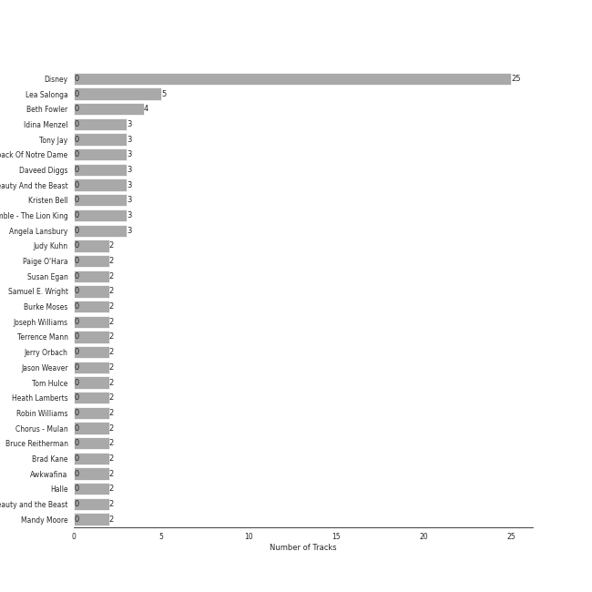

# Disney

[50 songs (0 liked)](tracks.md)

[See Audio Features](audio_features.md)

## Top Artists

| Art | Tracks | 💚 | Artist | 🔗 |
|:---|---:|---:|:---|:---|
|  | 19 | 0 | Disney | [🔗](https://open.spotify.com/artist/3xvaSlT4xsyk6lY1ESOspO) |
|  | 5 | 0 | Lea Salonga | [🔗](https://open.spotify.com/artist/1GlMjIezcLwV3OFlX0uXOv) |
|  | 3 | 0 | Idina Menzel | [🔗](https://open.spotify.com/artist/73Np75Wv2tju61Eo9Zw4IR) |
|  | 3 | 0 | Tony Jay | [🔗](https://open.spotify.com/artist/5qQpn0ZokyamZjyKtkKUYD) |
|  | 3 | 0 | Chorus - The Hunchback Of Notre Dame | [🔗](https://open.spotify.com/artist/5oHSxqr1uDloCbJJPNBd6T) |
|  | 3 | 0 | Chorus - Beauty And the Beast | [🔗](https://open.spotify.com/artist/3kWWBtNzJFtKA222gZz39d) |
|  | 3 | 0 | Kristen Bell | [🔗](https://open.spotify.com/artist/2kHxkdiKCSnHMkhIgFBZaI) |
|  | 3 | 0 | Angela Lansbury | [🔗](https://open.spotify.com/artist/0LtVJXnPR8msCJiE2DjHxy) |
|  | 2 | 0 | Judy Kuhn | [🔗](https://open.spotify.com/artist/7tHd518aPjJYUgyv9bidBz) |
|  | 2 | 0 | Paige O'Hara | [🔗](https://open.spotify.com/artist/7oavKrnYbTZPAPq7zCuipM) |

See all 74 artists

| Art | Tracks | 💚 | Artist | 🔗 |
|:---|---:|---:|:---|:---|
|  | 2 | 0 | Samuel E. Wright | [🔗](https://open.spotify.com/artist/6Id8rcDNyBXPcgKQVfQ8rX) |
|  | 2 | 0 | Joseph Williams | [🔗](https://open.spotify.com/artist/5xk0kRuXn1zToTHpHAqpui) |
|  | 2 | 0 | Jerry Orbach | [🔗](https://open.spotify.com/artist/5i2OpmeVKsmViqoETxuOvO) |
|  | 2 | 0 | Jason Weaver | [🔗](https://open.spotify.com/artist/5UdPkKWd8YNR5xGcmqH9QJ) |
|  | 2 | 0 | Tom Hulce | [🔗](https://open.spotify.com/artist/4wd5K3s3ekf0czSh2qGjTD) |
|  | 2 | 0 | Robin Williams | [🔗](https://open.spotify.com/artist/4OrieSJUghNfNx5UuPCgxF) |
|  | 2 | 0 | Chorus - Mulan | [🔗](https://open.spotify.com/artist/4KpdqBDU2C5gB3vhdojuqA) |
|  | 2 | 0 | Bruce Reitherman | [🔗](https://open.spotify.com/artist/43HPW60tz4BMYMRnmXMagJ) |
|  | 2 | 0 | Brad Kane | [🔗](https://open.spotify.com/artist/3dAzSJ9lQnJSq5Z0OgDBep) |
|  | 2 | 0 | Mandy Moore | [🔗](https://open.spotify.com/artist/2LJxr7Pt3JnP60eLxwbDOu) |
|  | 2 | 0 | Phil Harris | [🔗](https://open.spotify.com/artist/2ISMfPtVzHc9jDDVPUEHDa) |
|  | 2 | 0 | Richard White | [🔗](https://open.spotify.com/artist/0jWqALm6pl5CHj5N0eO68G) |
|  | 2 | 0 | Ernie Sabella | [🔗](https://open.spotify.com/artist/0RH6EMxqfzCEB7QCSKQ4xr) |
|  | 2 | 0 | Nathan Lane | [🔗](https://open.spotify.com/artist/0P0do9GwiSgweSF6Ui3mrv) |
|  | 2 | 0 | David Ogden Stiers | [🔗](https://open.spotify.com/artist/0N0dbr5s2y20PAo2cDAeVP) |
|  | 1 | 0 | Sally Dworsky | [🔗](https://open.spotify.com/artist/7vK6xoR5zT4DypEu0blUku) |
|  | 1 | 0 | Verna Felton | [🔗](https://open.spotify.com/artist/7aU90hxXexP47nEeMee6xM) |
|  | 1 | 0 | Billy Bletcher | [🔗](https://open.spotify.com/artist/7MCVs8C2nykvXVyTyrUoVd) |
|  | 1 | 0 | Beth Fowler | [🔗](https://open.spotify.com/artist/7KNW6OwcA260MsaEtnvhxV) |
|  | 1 | 0 | Harvey Fierstein | [🔗](https://open.spotify.com/artist/7G6zawIBBtDX1WvuT97Ei9) |
|  | 1 | 0 | Laura Williams | [🔗](https://open.spotify.com/artist/6wIj7GdxBjFtw6ySpzazwo) |
|  | 1 | 0 | Agatha Lee Monn | [🔗](https://open.spotify.com/artist/6kHu5ICQRBZdsAHjAjQlmp) |
|  | 1 | 0 | Jeremy Irons | [🔗](https://open.spotify.com/artist/6QRb3jE2lCfMU1iUuVQMaV) |
|  | 1 | 0 | Carmen Twillie | [🔗](https://open.spotify.com/artist/6O3ZB5Cz5CNT3wQWouKcNJ) |
|  | 1 | 0 | Paul Kandel | [🔗](https://open.spotify.com/artist/6M3XR163Q68THc9IFMwfAH) |
|  | 1 | 0 | Cheech Marin | [🔗](https://open.spotify.com/artist/68TP2Pr8i7dvyFHU0p748r) |
|  | 1 | 0 | Bruce Adler | [🔗](https://open.spotify.com/artist/66oKiXdIQP7MwN0gPUY0FD) |
|  | 1 | 0 | Rene Auberjonois | [🔗](https://open.spotify.com/artist/5vLv7RBpAmIPypST2zhKUw) |
|  | 1 | 0 | Auli'i Cravalho | [🔗](https://open.spotify.com/artist/5mnS9jJdKQQcRSqFu5YPVe) |
|  | 1 | 0 | Donny Osmond | [🔗](https://open.spotify.com/artist/5ZEAzHE2TzAwUcOj6jMIgf) |
|  | 1 | 0 | Rowan Atkinson | [🔗](https://open.spotify.com/artist/5U4QDnlOlmZx9MHV45EoDE) |
|  | 1 | 0 | Katie Lopez | [🔗](https://open.spotify.com/artist/5Kkhk21siwbW3BfZUwpykJ) |
|  | 1 | 0 | Donna Murphy | [🔗](https://open.spotify.com/artist/5BuTOT6mPoNZ5EmaPheBI9) |
|  | 1 | 0 | Jesse Corti | [🔗](https://open.spotify.com/artist/53vhGhGRoi9ARM7kr3jrz5) |
|  | 1 | 0 | Louis Prima | [🔗](https://open.spotify.com/artist/52lBOxCxbJg0ttXEW9CQpW) |
|  | 1 | 0 | Kristle Edwards | [🔗](https://open.spotify.com/artist/4y5d67UxD0QON2vRZOjXZ6) |
|  | 1 | 0 | Jodi Benson | [🔗](https://open.spotify.com/artist/4mmMtabvFCKA6HfmVmitNH) |
|  | 1 | 0 | Pinto Colvig | [🔗](https://open.spotify.com/artist/4X8LTt7CXvrqzfS4G4ONUX) |
|  | 1 | 0 | Ilene Woods | [🔗](https://open.spotify.com/artist/4DovRSplr3yJIeE3r0RtHj) |
|  | 1 | 0 | Santino Fontana | [🔗](https://open.spotify.com/artist/47NluEnhJda2gsnjuvcoob) |
|  | 1 | 0 | Jerry Tondo | [🔗](https://open.spotify.com/artist/3wUpOiaLjwAZNregbC7CxO) |
|  | 1 | 0 | Mice Chorus | [🔗](https://open.spotify.com/artist/3gcnVAcMBdtYbril7EqBz6) |
|  | 1 | 0 | Matthew Wilder | [🔗](https://open.spotify.com/artist/3bmFPbLMiLxtR9tFrTcKcP) |
|  | 1 | 0 | Zachary Levi | [🔗](https://open.spotify.com/artist/3XSyTI9ct70ZheMESAv2st) |
|  | 1 | 0 | Bill Lee | [🔗](https://open.spotify.com/artist/3UcnwnNwP6egaBs7DAgRdJ) |
|  | 1 | 0 | Robby Benson | [🔗](https://open.spotify.com/artist/3QcGV278a6mmLRTOK29WBP) |
|  | 1 | 0 | Jim Cummings | [🔗](https://open.spotify.com/artist/3OIPwMAZipDCLQwHmxS5EG) |
|  | 1 | 0 | Dr. John | [🔗](https://open.spotify.com/artist/320TrJub4arztwXRm7kqVO) |
|  | 1 | 0 | Marni Nixon | [🔗](https://open.spotify.com/artist/2Npf96k0QoY8YYwqnELDmQ) |
|  | 1 | 0 | Heidi Mollenhauer | [🔗](https://open.spotify.com/artist/2FmXrymxv6kNBnA66HpoPt) |
|  | 1 | 0 | Bill Shirley | [🔗](https://open.spotify.com/artist/259T26oxdhM7losfoXOXOl) |
|  | 1 | 0 | Mary Costa | [🔗](https://open.spotify.com/artist/1qeo0u3hwxCBcYsn3a4kyo) |
|  | 1 | 0 | Libertad García Fonzi | [🔗](https://open.spotify.com/artist/1jQ4JIz6HwngSsLWnzgPxA) |
|  | 1 | 0 | Chorus - Sleeping Beauty | [🔗](https://open.spotify.com/artist/1c4ltuRXEIo20Y9UOPxiA0) |
|  | 1 | 0 | Whoopi Goldberg | [🔗](https://open.spotify.com/artist/1ZsoHNxHMKTgliJcxSRlb5) |
|  | 1 | 0 | AURORA | [🔗](https://open.spotify.com/artist/1WgXqy2Dd70QQOU7Ay074N) |
|  | 1 | 0 | Keith David | [🔗](https://open.spotify.com/artist/1LPgqTHt7RmHwYtS9KQTMY) |
|  | 1 | 0 | Lebo M. | [🔗](https://open.spotify.com/artist/0zp9qNDSeYi3QEodhcKAAA) |
|  | 1 | 0 | Dorothy Compton | [🔗](https://open.spotify.com/artist/0humNRtJZUnSFh10d8Vnou) |
|  | 1 | 0 | Pat Carroll | [🔗](https://open.spotify.com/artist/0Yy9u86cq66Se2pB9fYaiW) |
|  | 1 | 0 | Gabriella Flores | [🔗](https://open.spotify.com/artist/0IFKI1ya1XM9LGVktNS2cS) |
|  | 1 | 0 | Gael Garcia Bernal | [🔗](https://open.spotify.com/artist/09oR0uKhqwScsKa2eUK97p) |
|  | 1 | 0 | Mary Moder | [🔗](https://open.spotify.com/artist/00ud2vhOOcbrUyGGYPSTYh) |
|  | 1 | 0 | James Hong | [🔗](https://open.spotify.com/artist/00erTY7OuCOdNTN36srPNN) |

## Top Albums

| Art | Tracks | 💚 | Album | Release Date | 🔗 |
|:---|---:|---:|:---|:---|:---|
|  | 5 | 0 | The Little Mermaid Special Edition | 2006-01-01 | [🔗](https://open.spotify.com/album/4aAwvCRNJIqiUGVEjieWv6) |
|  | 5 | 0 | The Lion King | 1994-01-01 | [🔗](https://open.spotify.com/album/3YA5DdB3wSz4pdfEXoMyRd) |
|  | 5 | 0 | Beauty and the Beast | 1991-01-01 | [🔗](https://open.spotify.com/album/3O5p9VNddbwvqWTdYKEqV5) |
|  | 5 | 0 | Aladdin Special Edition | 2004-01-01 | [🔗](https://open.spotify.com/album/7bt2aty3lUo6Q1Ud8pthRz) |
|  | 4 | 0 | The Hunchback Of Notre Dame (Original Motion Picture Soundtrack) | 1996-05-28 | [🔗](https://open.spotify.com/album/7btQeUDTIIfnh2iCQ8Pfhq) |
|  | 4 | 0 | Mulan (Original Soundtrack) | 1998-01-01 | [🔗](https://open.spotify.com/album/3Ohs7Jo6GM6mydUOL0m5aC) |
|  | 4 | 0 | Frozen (Original Motion Picture Soundtrack / Deluxe Edition) | 2013-01-01 | [🔗](https://open.spotify.com/album/7lZs5r4oQV2nutddffLrg0) |
|  | 3 | 0 | Tangled | 2010-01-01 | [🔗](https://open.spotify.com/album/1l0aFrH24oPrQSqGtfeFyE) |
|  | 2 | 0 | The Princess and the Frog (Original Motion Picture Soundtrack) | 2009-11-23 | [🔗](https://open.spotify.com/album/0CcL28OkH89kjgKpNZC8sW) |
|  | 2 | 0 | The Jungle Book | 1997-01-01 | [🔗](https://open.spotify.com/album/7zdZNXoapFcOW663zgLdOE) |

See all 20 albums

| Art | Tracks | 💚 | Album | Release Date | 🔗 |
|:---|---:|---:|:---|:---|:---|
|  | 2 | 0 | Pocahontas | 1995-01-01 | [🔗](https://open.spotify.com/album/7L6kEZVkWh7OEI71b1JHZd) |
|  | 1 | 0 | The Journey so Far | 2011-08-09 | [🔗](https://open.spotify.com/album/3zr8JDmixklHY1sOURyfoK) |
|  | 1 | 0 | Songs and Story: Cinderella | 2009-01-01 | [🔗](https://open.spotify.com/album/1d4rBfCtXPqkphzbvjokLa) |
|  | 1 | 0 | Sleeping Beauty | 1996-01-01 | [🔗](https://open.spotify.com/album/3U3I9TY7on88tPvM1guh54) |
|  | 1 | 0 | Moana (Original Motion Picture Soundtrack/Deluxe Edition) | 2016-11-18 | [🔗](https://open.spotify.com/album/6pZj4nvx6lV3ulIK3BSjvs) |
|  | 1 | 0 | Frozen 2 (Original Motion Picture Soundtrack/Deluxe Edition) | 2019-11-15 | [🔗](https://open.spotify.com/album/4M07HWIlZr7zoXoxDHR5mz) |
|  | 1 | 0 | Disney's Greatest Vol. 3 | 2002-08-20 | [🔗](https://open.spotify.com/album/6UuNvv5UFJG5bQkYzQIarh) |
|  | 1 | 0 | Coco (Original Motion Picture Soundtrack) | 2017-11-10 | [🔗](https://open.spotify.com/album/7nMexBA71PdwPnfqS5Yji5) |
|  | 1 | 0 | Cinderella Special Edition (Original Motion Picture Soundtrack/Japanese Version) | 2005-10-19 | [🔗](https://open.spotify.com/album/3QAxBLpXRLVMh1dRtuQa0q) |
|  | 1 | 0 | 101 Dalmatians | 1998-01-01 | [🔗](https://open.spotify.com/album/6hcQqEfqHDkQZl1bdgr4Vr) |

## Top Record Labels

| Tracks | 💚 | Label |
|---:|---:|:---|
| 49 | 0 | [Walt Disney Records](../../labels/walt_disney_records/overview.md) |
| 1 | 0 | LML Music |

## Genres

| Tracks | 💚 | Genre |
|---:|---:|:---|
| 43 | 0 | movie tunes |
| 5 | 0 | tagalog worship |
| 2 | 0 | show tunes |
| 2 | 0 | [post-teen pop](../../genres/post_teen_pop/overview.md) |
| 2 | 0 | [neo mellow](../../genres/neo_mellow/overview.md) |
| 2 | 0 | hollywood |
| 2 | 0 | [dance pop](../../genres/dance_pop/overview.md) |
| 2 | 0 | comic |
| 2 | 0 | comedy |
| 2 | 0 | [broadway](../../genres/broadway/overview.md) |

See all 27 genres

| Tracks | 💚 | Genre |
|---:|---:|:---|
| 1 | 0 | traditional blues |
| 1 | 0 | tin pan alley |
| 1 | 0 | swing |
| 1 | 0 | soul |
| 1 | 0 | roots rock |
| 1 | 0 | piano blues |
| 1 | 0 | new orleans blues |
| 1 | 0 | modern blues |
| 1 | 0 | lounge |
| 1 | 0 | louisiana blues |
| 1 | 0 | jump blues |
| 1 | 0 | jazz blues |
| 1 | 0 | funk |
| 1 | 0 | bubblegum pop |
| 1 | 0 | blues |
| 1 | 0 | [adult standards](../../genres/adult_standards/overview.md) |
| 1 | 0 | acoustic blues |

## Years

| ​ | 10 newest albums | ​​ | 10 oldest albums |
|:---|:---|:---|:---|
|  | Frozen 2 (Original Motion Picture Soundtrack/Deluxe Edition) (2019-11-15) |  | Beauty and the Beast (1991-01-01) |
|  | Coco (Original Motion Picture Soundtrack) (2017-11-10) |  | The Lion King (1994-01-01) |
|  | Moana (Original Motion Picture Soundtrack/Deluxe Edition) (2016-11-18) |  | Pocahontas (1995-01-01) |
|  | Frozen (Original Motion Picture Soundtrack / Deluxe Edition) (2013-01-01) |  | Sleeping Beauty (1996-01-01) |
|  | The Journey so Far (2011-08-09) |  | The Hunchback Of Notre Dame (Original Motion Picture Soundtrack) (1996-05-28) |
|  | Tangled (2010-01-01) |  | The Jungle Book (1997-01-01) |
|  | The Princess and the Frog (Original Motion Picture Soundtrack) (2009-11-23) |  | Mulan (Original Soundtrack) (1998-01-01) |
|  | Songs and Story: Cinderella (2009-01-01) |  | 101 Dalmatians (1998-01-01) |
|  | The Little Mermaid Special Edition (2006-01-01) |  | Disney's Greatest Vol. 3 (2002-08-20) |
|  | Cinderella Special Edition (Original Motion Picture Soundtrack/Japanese Version) (2005-10-19) |  | Aladdin Special Edition (2004-01-01) |