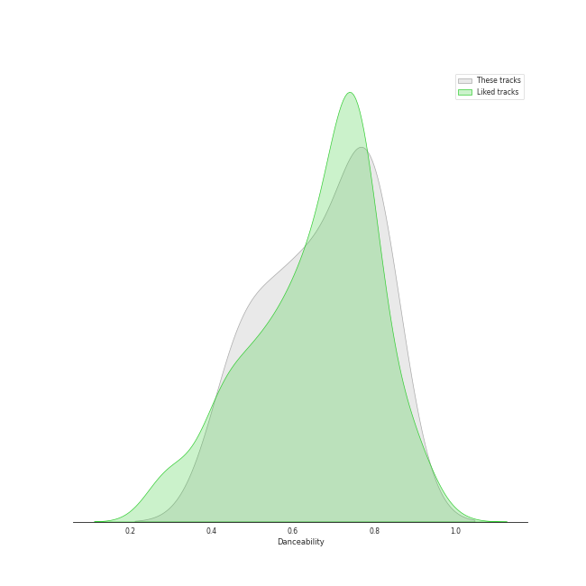
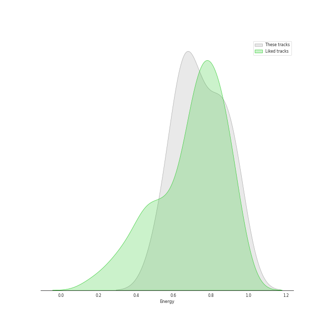
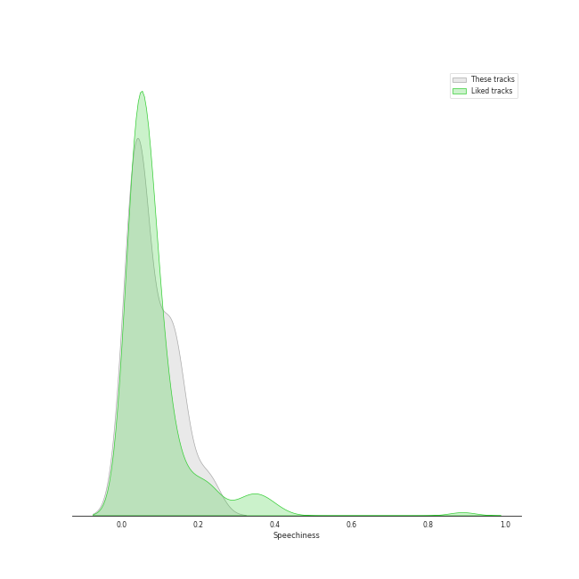
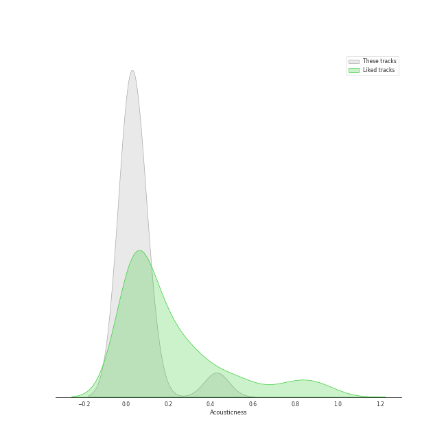
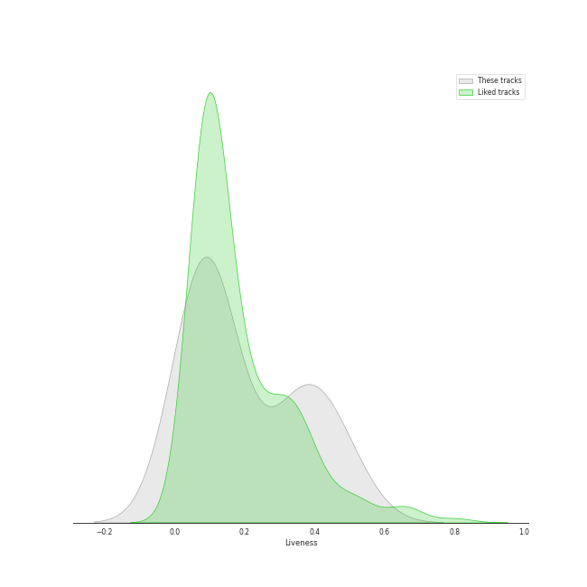
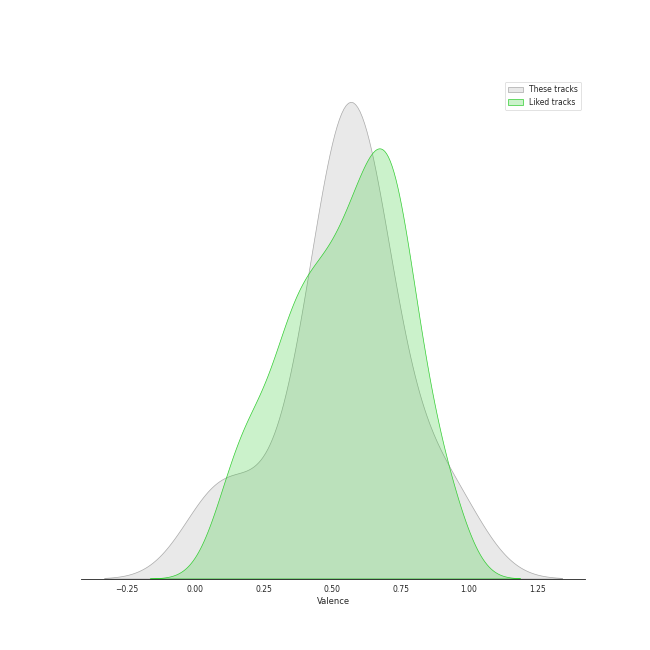

# Track Features for Electronic

## Danceability

| ​ | 10 most Danceable tracks | ​​ | 10 least Danceable tracks |
|:---|:---|:---|:---|
|  | Harder, Better, Faster, Stronger (0.817) |  | Crystallize (0.44) |
|  | Technologic (0.812) |  | Song of the Caged Bird (0.476) |
|  | Get Lucky (feat. Pharrell Williams and Nile Rodgers) (0.81) |  | Shatter Me Featuring Lzzy Hale (0.483) |
|  | Pocket Calculator / Dentaku (0.785) |  | Underground (0.521) |
|  | Instant Crush (feat. Julian Casablancas) (0.775) |  | Badster (0.6) |
|  | I Feel It Coming (0.773) |  | One More Time (0.613) |
|  | Electric Shock (0.757) |  | XS (0.635) |
|  | Comme Des Garçons (Like The Boys) (0.724) |  | Digital Love (0.644) |
|  | Digital Love (0.644) |  | Comme Des Garçons (Like The Boys) (0.724) |
|  | XS (0.635) |  | Electric Shock (0.757) |

## Energy

| ​ | 10 most Energetic tracks | ​​ | 10 least Energetic tracks |
|:---|:---|:---|:---|
|  | Shatter Me Featuring Lzzy Hale (0.947) |  | Technologic (0.516) |
|  | XS (0.929) |  | Instant Crush (feat. Julian Casablancas) (0.585) |
|  | Electric Shock (0.898) |  | Crystallize (0.623) |
|  | Badster (0.864) |  | Song of the Caged Bird (0.643) |
|  | Underground (0.842) |  | Pocket Calculator / Dentaku (0.647) |
|  | I Feel It Coming (0.819) |  | Digital Love (0.664) |
|  | Get Lucky (feat. Pharrell Williams and Nile Rodgers) (0.793) |  | One More Time (0.697) |
|  | Harder, Better, Faster, Stronger (0.716) |  | Comme Des Garçons (Like The Boys) (0.715) |
|  | Comme Des Garçons (Like The Boys) (0.715) |  | Harder, Better, Faster, Stronger (0.716) |
|  | One More Time (0.697) |  | Get Lucky (feat. Pharrell Williams and Nile Rodgers) (0.793) |

## Speechiness

| ​ | 10 most Speechy tracks | ​​ | 10 least Speechy tracks |
|:---|:---|:---|:---|
|  | Technologic (0.224) |  | Instant Crush (feat. Julian Casablancas) (0.0271) |
|  | XS (0.146) |  | Crystallize (0.0316) |
|  | Harder, Better, Faster, Stronger (0.144) |  | Electric Shock (0.0327) |
|  | One More Time (0.133) |  | Digital Love (0.0332) |
|  | I Feel It Coming (0.118) |  | Song of the Caged Bird (0.0345) |
|  | Comme Des Garçons (Like The Boys) (0.116) |  | Get Lucky (feat. Pharrell Williams and Nile Rodgers) (0.0403) |
|  | Shatter Me Featuring Lzzy Hale (0.0594) |  | Underground (0.0472) |
|  | Badster (0.0537) |  | Pocket Calculator / Dentaku (0.0494) |
|  | Pocket Calculator / Dentaku (0.0494) |  | Badster (0.0537) |
|  | Underground (0.0472) |  | Shatter Me Featuring Lzzy Hale (0.0594) |

## Acousticness

| ​ | 10 most Acoustic tracks | ​​ | 10 least Acoustic tracks |
|:---|:---|:---|:---|
|  | I Feel It Coming (0.428) |  | Technologic (0.000369) |
|  | Electric Shock (0.0927) |  | Shatter Me Featuring Lzzy Hale (0.000742) |
|  | XS (0.0854) |  | Crystallize (0.000856) |
|  | Digital Love (0.048) |  | Underground (0.000891) |
|  | Pocket Calculator / Dentaku (0.0456) |  | Badster (0.000924) |
|  | Harder, Better, Faster, Stronger (0.0427) |  | One More Time (0.0194) |
|  | Instant Crush (feat. Julian Casablancas) (0.0422) |  | Comme Des Garçons (Like The Boys) (0.0246) |
|  | Get Lucky (feat. Pharrell Williams and Nile Rodgers) (0.0378) |  | Song of the Caged Bird (0.0265) |
|  | Song of the Caged Bird (0.0265) |  | Get Lucky (feat. Pharrell Williams and Nile Rodgers) (0.0378) |
|  | Comme Des Garçons (Like The Boys) (0.0246) |  | Instant Crush (feat. Julian Casablancas) (0.0422) |

## Instrumentalness

| ​ | 10 most Instrumental tracks | ​​ | 10 least Instrumental tracks |
|:---|:---|:---|:---|
|  | Digital Love (0.867) |  | One More Time (0.0) |
|  | Instant Crush (feat. Julian Casablancas) (0.619) |  | Shatter Me Featuring Lzzy Hale (0.0) |
|  | Pocket Calculator / Dentaku (0.34) |  | I Feel It Coming (0.0) |
|  | Crystallize (0.0586) |  | XS (1.14e-06) |
|  | Badster (0.0444) |  | Get Lucky (feat. Pharrell Williams and Nile Rodgers) (1.77e-06) |
|  | Underground (0.0234) |  | Song of the Caged Bird (5.75e-06) |
|  | Comme Des Garçons (Like The Boys) (0.00276) |  | Electric Shock (7.85e-06) |
|  | Harder, Better, Faster, Stronger (0.00263) |  | Technologic (1.09e-05) |
|  | Technologic (1.09e-05) |  | Harder, Better, Faster, Stronger (0.00263) |
|  | Electric Shock (7.85e-06) |  | Comme Des Garçons (Like The Boys) (0.00276) |

## Liveness

| ​ | 10 most Live tracks | ​​ | 10 least Live tracks |
|:---|:---|:---|:---|
|  | Electric Shock (0.493) |  | Underground (0.0445) |
|  | Comme Des Garçons (Like The Boys) (0.441) |  | I Feel It Coming (0.0679) |
|  | Badster (0.412) |  | Get Lucky (feat. Pharrell Williams and Nile Rodgers) (0.072) |
|  | Harder, Better, Faster, Stronger (0.358) |  | Instant Crush (feat. Julian Casablancas) (0.077) |
|  | Digital Love (0.342) |  | XS (0.0822) |
|  | One More Time (0.332) |  | Technologic (0.0991) |
|  | Shatter Me Featuring Lzzy Hale (0.14) |  | Pocket Calculator / Dentaku (0.0999) |
|  | Song of the Caged Bird (0.109) |  | Crystallize (0.103) |
|  | Crystallize (0.103) |  | Song of the Caged Bird (0.109) |
|  | Pocket Calculator / Dentaku (0.0999) |  | Shatter Me Featuring Lzzy Hale (0.14) |

## Valence

| ​ | 10 most Happy tracks | ​​ | 10 least Happy tracks |
|:---|:---|:---|:---|
|  | Pocket Calculator / Dentaku (0.951) |  | Crystallize (0.0563) |
|  | Get Lucky (feat. Pharrell Williams and Nile Rodgers) (0.863) |  | Underground (0.142) |
|  | Harder, Better, Faster, Stronger (0.692) |  | Shatter Me Featuring Lzzy Hale (0.347) |
|  | Comme Des Garçons (Like The Boys) (0.645) |  | One More Time (0.476) |
|  | Technologic (0.633) |  | Song of the Caged Bird (0.488) |
|  | Badster (0.61) |  | Instant Crush (feat. Julian Casablancas) (0.518) |
|  | XS (0.59) |  | Digital Love (0.53) |
|  | I Feel It Coming (0.585) |  | Electric Shock (0.537) |
|  | Electric Shock (0.537) |  | I Feel It Coming (0.585) |
|  | Digital Love (0.53) |  | XS (0.59) |

## Tempo

| ​ | 10 most Fast tracks | ​​ | 10 least Fast tracks |
|:---|:---|:---|:---|
|  | Shatter Me Featuring Lzzy Hale (144.948) |  | Song of the Caged Bird (86.505) |
|  | Crystallize (140.006) |  | I Feel It Coming (92.987) |
|  | Badster (138.026) |  | Underground (93.984) |
|  | Pocket Calculator / Dentaku (135.013) |  | Instant Crush (feat. Julian Casablancas) (109.942) |
|  | Technologic (127.498) |  | Get Lucky (feat. Pharrell Williams and Nile Rodgers) (116.05) |
|  | Electric Shock (125.029) |  | XS (117.039) |
|  | Digital Love (124.726) |  | Comme Des Garçons (Like The Boys) (119.162) |
|  | Harder, Better, Faster, Stronger (123.474) |  | One More Time (122.746) |
|  | One More Time (122.746) |  | Harder, Better, Faster, Stronger (123.474) |
|  | Comme Des Garçons (Like The Boys) (119.162) |  | Digital Love (124.726) |
