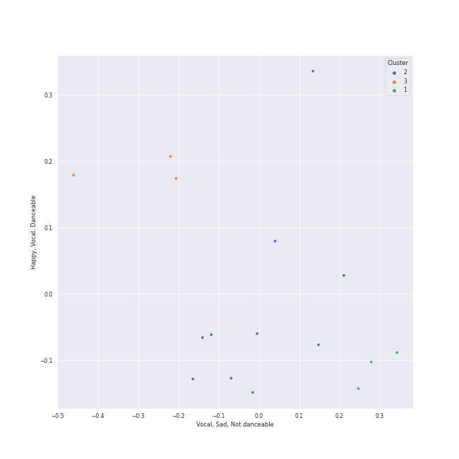

# Clusters in Electronic

## Cluster #1

3 tracks

| Art | Track | Album | Artists | Label | Rank | 💚 | 🔗 |
|:---|:---|:---|:---|:---|---:|:---|:---|
|  | Crystallize | Lindsey Stirling | [Lindsey Stirling](../../../../artists/lindsey_stirling/overview.md) | Lindseystomp Records | nan | 💚 | [🔗](https://open.spotify.com/track/5JFkuKQsPps2ZaZzaLx63d) |
|  | Shatter Me Featuring Lzzy Hale | Shatter Me | [Lindsey Stirling](../../../../artists/lindsey_stirling/overview.md) | Lindseystomp Records | nan | 💚 | [🔗](https://open.spotify.com/track/2K7j4xrQENCi5r3Hii4cVe) |
|  | Underground | Artemis | [Lindsey Stirling](../../../../artists/lindsey_stirling/overview.md) | BMG Rights Management (US) LLC | nan | | [🔗](https://open.spotify.com/track/2vcEiEb8cTgyeb0biKChCY) |
## Cluster #2

10 tracks

| Art | Track | Album | Artists | Label | Rank | 💚 | 🔗 |
|:---|:---|:---|:---|:---|---:|:---|:---|
|  | One More Time | Discovery | [Daft Punk](../../../../artists/daft_punk/overview.md) | Daft Life Ltd./ADA France | nan | | [🔗](https://open.spotify.com/track/0DiWol3AO6WpXZgp0goxAV) |
|  | Harder, Better, Faster, Stronger | Discovery | [Daft Punk](../../../../artists/daft_punk/overview.md) | Daft Life Ltd./ADA France | nan | 💚 | [🔗](https://open.spotify.com/track/5W3cjX2J3tjhG8zb6u0qHn) |
|  | Technologic | Human After All | [Daft Punk](../../../../artists/daft_punk/overview.md) | Daft Life Ltd./ADA France | nan | 💚 | [🔗](https://open.spotify.com/track/0LSLM0zuWRkEYemF7JcfEE) |
|  | Get Lucky (feat. Pharrell Williams and Nile Rodgers) | Random Access Memories | [Daft Punk](../../../../artists/daft_punk/overview.md), Pharrell Williams, Nile Rodgers | [Columbia](../../../../labels/columbia) | 336 | 💚 | [🔗](https://open.spotify.com/track/69kOkLUCkxIZYexIgSG8rq) |
|  | I Feel It Coming | Starboy | The Weeknd, [Daft Punk](../../../../artists/daft_punk/overview.md) | Universal Republic Records | nan | | [🔗](https://open.spotify.com/track/3dhjNA0jGA8vHBQ1VdD6vV) |
|  | XS | SAWAYAMA | Rina Sawayama | Dirty Hit | nan | | [🔗](https://open.spotify.com/track/1TWNKyNQOBfNUkWWs7FooF) |
|  | Comme Des Garçons (Like The Boys) | SAWAYAMA | Rina Sawayama | Dirty Hit | nan | 💚 | [🔗](https://open.spotify.com/track/43bYs8QkPdCdy5esfnmU1T) |
|  | Song of the Caged Bird | Lindsey Stirling | [Lindsey Stirling](../../../../artists/lindsey_stirling/overview.md) | Lindseystomp Records | nan | 💚 | [🔗](https://open.spotify.com/track/1rmCtRmkQXWKRhBi91NX3z) |
|  | Electric Shock | Electric Shock - The 2nd Mini Album | [f(x)](../../../../artists/f(x)/overview.md) | [SM Entertainment](../../../../labels/sm_entertainment) | nan | 💚 | [🔗](https://open.spotify.com/track/7tMN6iGJMulMFpSCeU7pmU) |
|  | Badster | Badster | HYO | [SM Entertainment](../../../../labels/sm_entertainment) | nan | | [🔗](https://open.spotify.com/track/7sjzOysoro4EunDYC9M6Vx) |
## Cluster #3

3 tracks

| Art | Track | Album | Artists | Label | Rank | 💚 | 🔗 |
|:---|:---|:---|:---|:---|---:|:---|:---|
|  | Digital Love | Discovery | [Daft Punk](../../../../artists/daft_punk/overview.md) | Daft Life Ltd./ADA France | nan | 💚 | [🔗](https://open.spotify.com/track/2VEZx7NWsZ1D0eJ4uv5Fym) |
|  | Instant Crush (feat. Julian Casablancas) | Random Access Memories | [Daft Punk](../../../../artists/daft_punk/overview.md), Julian Casablancas | [Columbia](../../../../labels/columbia) | nan | 💚 | [🔗](https://open.spotify.com/track/2cGxRwrMyEAp8dEbuZaVv6) |
|  | Pocket Calculator / Dentaku | 3-D The Catalogue | Kraftwerk | [Parlophone UK](../../../../labels/parlophone_uk) | nan | 💚 | [🔗](https://open.spotify.com/track/2j4HbXODKGeJ33QTWRTfbS) |