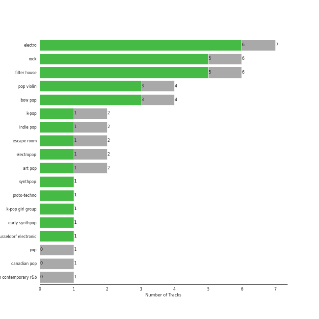

# Electronic

[11 songs](tracks.md)

## Top Artists

See all 6 artists

| Number of Tracks | Art | Artist | 🔗 |
|---:|:---|:---|:---|
| 6 |  | Daft Punk | [🔗](https://open.spotify.com/artist/4tZwfgrHOc3mvqYlEYSvVi) |
| 4 |  | Lindsey Stirling | [🔗](https://open.spotify.com/artist/378dH6EszOLFShpRzAQkVM) |
| 1 |  | Nile Rodgers | [🔗](https://open.spotify.com/artist/3yDIp0kaq9EFKe07X1X2rz) |
| 1 |  | HYO | [🔗](https://open.spotify.com/artist/3U7bOaJLuFkrmDQ1C1OqKl) |
| 1 |  | Pharrell Williams | [🔗](https://open.spotify.com/artist/2RdwBSPQiwcmiDo9kixcl8) |
| 1 |  | Julian Casablancas | [🔗](https://open.spotify.com/artist/1rAv1GhTQ2rmG94p9lU3rB) |

## Top Albums

See all 7 albums

| Number of Tracks | Art | Album | Release Date | 🔗 |
|---:|:---|:---|:---|:---|
| 3 |  | Discovery | 2001-03-12 | [🔗](https://open.spotify.com/album/2noRn2Aes5aoNVsU6iWThc) |
| 2 |  | Random Access Memories | 2013-05-17 | [🔗](https://open.spotify.com/album/4m2880jivSbbyEGAKfITCa) |
| 2 |  | Lindsey Stirling | 2012 | [🔗](https://open.spotify.com/album/3YTWAm90osBvLNWCdF8Nq2) |
| 1 |  | Shatter Me | 2014-04-29 | [🔗](https://open.spotify.com/album/2spbck4ETZz1aLq5Fi5phC) |
| 1 |  | Human After All | 2005-03-14 | [🔗](https://open.spotify.com/album/1A2GTWGtFfWp7KSQTwWOyo) |
| 1 |  | Badster | 2019-07-20 | [🔗](https://open.spotify.com/album/4GA4vqEeOzVM8ib6HHy6Ij) |
| 1 |  | Artemis | 2019-09-06 | [🔗](https://open.spotify.com/album/4YAtGpNUwcHesLlyYUIxur) |

## Top Record Labels

See all 6 labels

| Number of Tracks | Label |
|---:|:---|
| 4 | Daft Life Ltd. |
| 4 | ADA France |
| 3 | Lindseystomp Records |
| 2 | [Columbia](../../labels/columbia.md) |
| 1 | [SM Entertainment](../../labels/sm_entertainment.md) |
| 1 | BMG Rights Management (US) LLC |

## Genres

See all 5 genres

| Number of Tracks | Genre |
|---:|:---|
| 6 | filter house |
| 6 | electro |
| 4 | pop violin |
| 4 | bow pop |
| 1 | [k-pop](../../genres/k_pop.md) |

## Years

| 10 newest albums | 10 oldest albums |
|:---|:---|
| 
 Artemis (2019-09-06)
 | 
 Discovery (2001-03-12)
 |
| 
 Badster (2019-07-20)
 | 
 Human After All (2005-03-14)
 |
| 
 Shatter Me (2014-04-29)
 | 
 Lindsey Stirling (2012)
 |
| 
 Random Access Memories (2013-05-17)
 | 
 Random Access Memories (2013-05-17)
 |
| 
 Lindsey Stirling (2012)
 | 
 Shatter Me (2014-04-29)
 |
| 
 Human After All (2005-03-14)
 | 
 Badster (2019-07-20)
 |
| 
 Discovery (2001-03-12)
 | 
 Artemis (2019-09-06)
 |
## Audio Features

| 10 most Danceable tracks | 10 least Danceable tracks |
|:---|:---|
| Harder, Better, Faster, Stronger | Crystallize |
| Technologic | Song of the Caged Bird |
| Get Lucky (feat. Pharrell Williams & Nile Rodgers) | Shatter Me Featuring Lzzy Hale |
| Instant Crush (feat. Julian Casablancas) | Underground |
| Digital Love | Badster |
| One More Time | One More Time |
| Badster | Digital Love |
| Underground | Instant Crush (feat. Julian Casablancas) |
| Shatter Me Featuring Lzzy Hale | Get Lucky (feat. Pharrell Williams & Nile Rodgers) |
| Song of the Caged Bird | Technologic |

| 10 most Energetic tracks | 10 least Energetic tracks |
|:---|:---|
| Shatter Me Featuring Lzzy Hale | Technologic |
| Badster | Instant Crush (feat. Julian Casablancas) |
| Underground | Crystallize |
| Get Lucky (feat. Pharrell Williams & Nile Rodgers) | Song of the Caged Bird |
| Harder, Better, Faster, Stronger | Digital Love |
| One More Time | One More Time |
| Digital Love | Harder, Better, Faster, Stronger |
| Song of the Caged Bird | Get Lucky (feat. Pharrell Williams & Nile Rodgers) |
| Crystallize | Underground |
| Instant Crush (feat. Julian Casablancas) | Badster |

| 10 most Speechy tracks | 10 least Speechy tracks |
|:---|:---|
| Technologic | Instant Crush (feat. Julian Casablancas) |
| Harder, Better, Faster, Stronger | Crystallize |
| One More Time | Digital Love |
| Shatter Me Featuring Lzzy Hale | Song of the Caged Bird |
| Badster | Get Lucky (feat. Pharrell Williams & Nile Rodgers) |
| Underground | Underground |
| Get Lucky (feat. Pharrell Williams & Nile Rodgers) | Badster |
| Song of the Caged Bird | Shatter Me Featuring Lzzy Hale |
| Digital Love | One More Time |
| Crystallize | Harder, Better, Faster, Stronger |

| 10 most Acoustic tracks | 10 least Acoustic tracks |
|:---|:---|
| Digital Love | Technologic |
| Harder, Better, Faster, Stronger | Shatter Me Featuring Lzzy Hale |
| Instant Crush (feat. Julian Casablancas) | Crystallize |
| Get Lucky (feat. Pharrell Williams & Nile Rodgers) | Underground |
| Song of the Caged Bird | Badster |
| One More Time | One More Time |
| Badster | Song of the Caged Bird |
| Underground | Get Lucky (feat. Pharrell Williams & Nile Rodgers) |
| Crystallize | Instant Crush (feat. Julian Casablancas) |
| Shatter Me Featuring Lzzy Hale | Harder, Better, Faster, Stronger |

| 10 most Instrumental tracks | 10 least Instrumental tracks |
|:---|:---|
| Digital Love | One More Time |
| Instant Crush (feat. Julian Casablancas) | Shatter Me Featuring Lzzy Hale |
| Crystallize | Get Lucky (feat. Pharrell Williams & Nile Rodgers) |
| Badster | Song of the Caged Bird |
| Underground | Technologic |
| Harder, Better, Faster, Stronger | Harder, Better, Faster, Stronger |
| Technologic | Underground |
| Song of the Caged Bird | Badster |
| Get Lucky (feat. Pharrell Williams & Nile Rodgers) | Crystallize |
| One More Time | Instant Crush (feat. Julian Casablancas) |

| 10 most Live tracks | 10 least Live tracks |
|:---|:---|
| Badster | Underground |
| Harder, Better, Faster, Stronger | Get Lucky (feat. Pharrell Williams & Nile Rodgers) |
| Digital Love | Instant Crush (feat. Julian Casablancas) |
| One More Time | Technologic |
| Shatter Me Featuring Lzzy Hale | Crystallize |
| Song of the Caged Bird | Song of the Caged Bird |
| Crystallize | Shatter Me Featuring Lzzy Hale |
| Technologic | One More Time |
| Instant Crush (feat. Julian Casablancas) | Digital Love |
| Get Lucky (feat. Pharrell Williams & Nile Rodgers) | Harder, Better, Faster, Stronger |

| 10 most Happy tracks | 10 least Happy tracks |
|:---|:---|
| Get Lucky (feat. Pharrell Williams & Nile Rodgers) | Crystallize |
| Harder, Better, Faster, Stronger | Underground |
| Technologic | Shatter Me Featuring Lzzy Hale |
| Badster | One More Time |
| Digital Love | Song of the Caged Bird |
| Instant Crush (feat. Julian Casablancas) | Instant Crush (feat. Julian Casablancas) |
| Song of the Caged Bird | Digital Love |
| One More Time | Badster |
| Shatter Me Featuring Lzzy Hale | Technologic |
| Underground | Harder, Better, Faster, Stronger |
