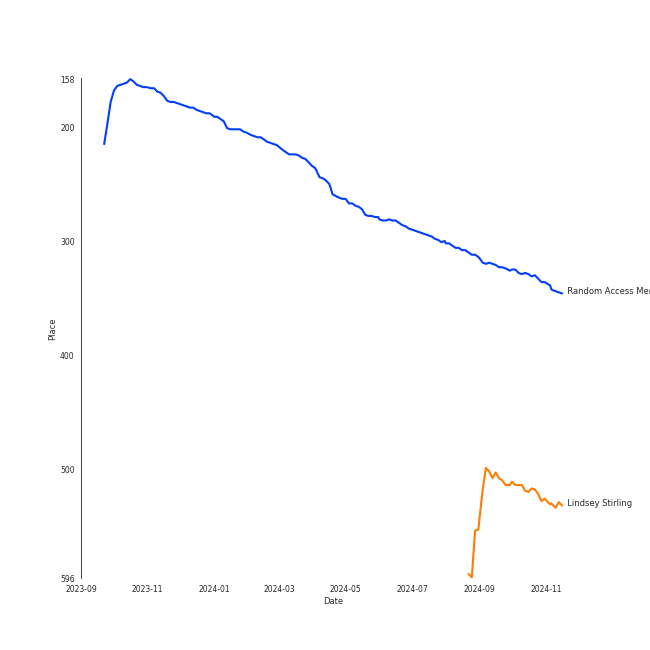
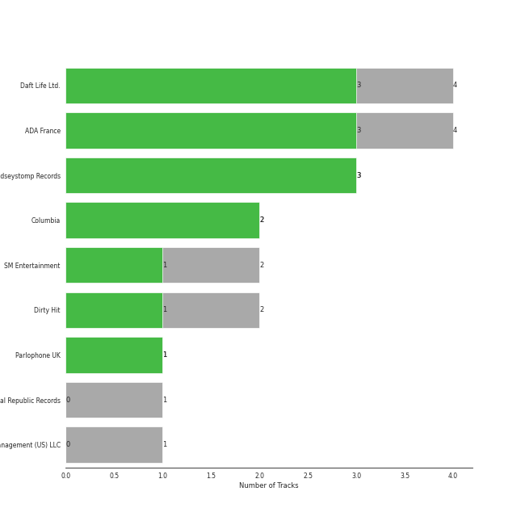
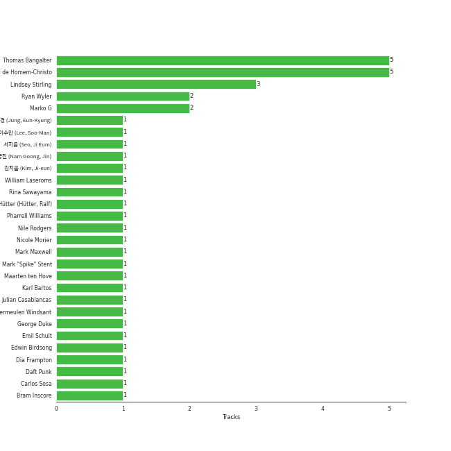

# Electronic

[16 tracks (11 liked) 🔗](https://open.spotify.com/playlist/3cWXIQgqhOUB6slIr3oglt)

[See Track Features](audio_features.md)

[See Clusters](clusters/overview.md)

## Top Artists

| Art | Rank | Tracks | 💚 | Artist | 🔗 |
|:---|---:|---:|---:|:---|:---|
|  | 263 | 7 | 5 | [Daft Punk](../../artists/daft_punk/overview.md) | [🔗](https://open.spotify.com/artist/4tZwfgrHOc3mvqYlEYSvVi) |
|  | 362 | 4 | 3 | [Lindsey Stirling](../../artists/lindsey_stirling/overview.md) | [🔗](https://open.spotify.com/artist/378dH6EszOLFShpRzAQkVM) |
|  | 431 | 2 | 1 | Rina Sawayama | [🔗](https://open.spotify.com/artist/2KEqzdPS7M5YwGmiuPTdr5) |
|  | 99 | 1 | 1 | Nile Rodgers | [🔗](https://open.spotify.com/artist/3yDIp0kaq9EFKe07X1X2rz) |
|  | 169 | 1 | 1 | [f(x)](../../artists/f(x)/overview.md) | [🔗](https://open.spotify.com/artist/3wRA5UYoo08BBKJnzyKkpF) |
|  | 262 | 1 | 1 | Pharrell Williams | [🔗](https://open.spotify.com/artist/2RdwBSPQiwcmiDo9kixcl8) |
|  | 431 | 1 | 1 | Julian Casablancas | [🔗](https://open.spotify.com/artist/1rAv1GhTQ2rmG94p9lU3rB) |
|  | 431 | 1 | 1 | Kraftwerk | [🔗](https://open.spotify.com/artist/0dmPX6ovclgOy8WWJaFEUU) |
|  | 57 | 1 | 0 | HYO | [🔗](https://open.spotify.com/artist/3U7bOaJLuFkrmDQ1C1OqKl) |
|  | 351 | 1 | 0 | The Weeknd | [🔗](https://open.spotify.com/artist/1Xyo4u8uXC1ZmMpatF05PJ) |

## Top Tracks

Most and least listened tracks

| Rank | ​ | Most listened tracks | Rank | ​​ | Least listened tracks |
|---:|:---|:---|---:|:---|:---|
| 464 |  | [Get Lucky (feat. Pharrell Williams and Nile Rodgers)](../../artists/daft_punk/overview.md) | 976 |  | [Electric Shock](../../artists/f(x)/overview.md) |
| 769 |  | [Song of the Caged Bird](../../artists/lindsey_stirling/overview.md) | 976 |  | Badster |
| 976 |  | [One More Time](../../artists/daft_punk/overview.md) | 976 |  | [Harder, Better, Faster, Stronger](../../artists/daft_punk/overview.md) |
| 976 |  | [Technologic](../../artists/daft_punk/overview.md) | 976 |  | [Crystallize](../../artists/lindsey_stirling/overview.md) |
| 976 |  | XS | 976 |  | Comme Des Garçons (Like The Boys) |
| 976 |  | [Shatter Me Featuring Lzzy Hale](../../artists/lindsey_stirling/overview.md) | 976 |  | I Feel It Coming |
| 976 |  | [Digital Love](../../artists/daft_punk/overview.md) | 976 |  | [Underground](../../artists/lindsey_stirling/overview.md) |
| 976 |  | [Instant Crush (feat. Julian Casablancas)](../../artists/daft_punk/overview.md) | 976 |  | Pocket Calculator / Dentaku |
| 976 |  | Pocket Calculator / Dentaku | 976 |  | [Instant Crush (feat. Julian Casablancas)](../../artists/daft_punk/overview.md) |
| 976 |  | [Underground](../../artists/lindsey_stirling/overview.md) | 976 |  | [Digital Love](../../artists/daft_punk/overview.md) |

## Top Albums

| Art | Rank | Tracks | 💚 | Album | Release Date | 🔗 |
|:---|---:|---:|---:|:---|:---|:---|
|  | 644 | 3 | 2 | Discovery | 2001-03-12 | [🔗](https://open.spotify.com/album/2noRn2Aes5aoNVsU6iWThc) |
|  | 327 | 2 | 2 | Random Access Memories | 2013-05-20 | [🔗](https://open.spotify.com/album/4m2880jivSbbyEGAKfITCa) |
|  | 513 | 2 | 2 | Lindsey Stirling | 2012 | [🔗](https://open.spotify.com/album/3YTWAm90osBvLNWCdF8Nq2) |
|  | 644 | 2 | 1 | SAWAYAMA | 2020-04-17 | [🔗](https://open.spotify.com/album/3stadz88XVpHcXnVYMHc4J) |
|  | 644 | 1 | 1 | Shatter Me | 2014-05-05 | [🔗](https://open.spotify.com/album/2spbck4ETZz1aLq5Fi5phC) |
|  | 644 | 1 | 1 | Human After All | 2005-03-14 | [🔗](https://open.spotify.com/album/1A2GTWGtFfWp7KSQTwWOyo) |
|  | 644 | 1 | 1 | Electric Shock - The 2nd Mini Album | 2012-06-10 | [🔗](https://open.spotify.com/album/7LVMjDwcyhVhDTHddKPjIs) |
|  | 644 | 1 | 1 | 3-D The Catalogue | 2017-05-26 | [🔗](https://open.spotify.com/album/6nnO5r6I1JtSZ8eTwwIiIF) |
|  | 644 | 1 | 0 | Starboy | 2016-11-25 | [🔗](https://open.spotify.com/album/2ODvWsOgouMbaA5xf0RkJe) |
|  | 644 | 1 | 0 | Badster | 2019-07-20 | [🔗](https://open.spotify.com/album/4GA4vqEeOzVM8ib6HHy6Ij) |

See all 11 albums

| Art | Rank | Tracks | 💚 | Album | Release Date | 🔗 |
|:---|---:|---:|---:|:---|:---|:---|
|  | 644 | 1 | 0 | Artemis | 2019-09-06 | [🔗](https://open.spotify.com/album/4YAtGpNUwcHesLlyYUIxur) |

## Top Record Labels

| Tracks | 💚 | Label |
|---:|---:|:---|
| 4 | 3 | Daft Life Ltd. |
| 4 | 3 | ADA France |
| 3 | 3 | Lindseystomp Records |
| 2 | 2 | [Columbia](../../labels/columbia/overview.md) |
| 2 | 1 | [SM Entertainment](../../labels/sm_entertainment/overview.md) |
| 2 | 1 | Dirty Hit |
| 1 | 1 | [Parlophone UK](../../labels/parlophone_uk/overview.md) |
| 1 | 0 | Universal Republic Records |
| 1 | 0 | BMG Rights Management (US) LLC |

## Genres

| Tracks | 💚 | Genre |
|---:|---:|:---|
| 7 | 6 | electro |
| 6 | 5 | [rock](../../genres/rock/overview.md) |
| 6 | 5 | filter house |
| 4 | 3 | pop violin |
| 4 | 3 | bow pop |
| 2 | 1 | [k-pop](../../genres/k-pop/overview.md) |
| 2 | 1 | indie pop |
| 2 | 1 | escape room |
| 2 | 1 | electropop |
| 2 | 1 | [art pop](../../genres/art_pop/overview.md) |

See all 18 genres

| Tracks | 💚 | Genre |
|---:|---:|:---|
| 1 | 1 | synthpop |
| 1 | 1 | proto-techno |
| 1 | 1 | [k-pop girl group](../../genres/k-pop_girl_group/overview.md) |
| 1 | 1 | early synthpop |
| 1 | 1 | dusseldorf electronic |
| 1 | 0 | [pop](../../genres/pop/overview.md) |
| 1 | 0 | [canadian pop](../../genres/canadian_pop/overview.md) |
| 1 | 0 | canadian contemporary r&b |

## Top Producers

| Art | Producer | Tracks | Credit Types |
|:---|:---|---:|:---|
| | Guy-Manuel de Homem-Christo | 5 | Producer, Songwriter |
| | Thomas Bangalter | 5 | Producer, Songwriter |
|  | [Lindsey Stirling](../../artists/lindsey_stirling/overview.md) | 3 | Producer, Songwriter |
| | Marko G | 2 | Producer, Songwriter |
| | Ryan Wyler | 2 | Producer |
|  | [Daft Punk](../../artists/daft_punk/overview.md) | 1 | Producer |
| | [서지음 (Seo, Ji Eum)](../../producers/서지음_(seo,_ji_eum)/overview.md) | 1 | Lyricist |
|  | Julian Casablancas | 1 | Producer, Songwriter |
|  | Nile Rodgers | 1 | Songwriter |
| | 남궁진 (Nam Goong, Jin) | 1 | Producer |

View all

| Art | Producer | Tracks | Credit Types |
|:---|:---|---:|:---|
| | Bram Inscore | 1 | Producer, Songwriter |
| | [정은경 (Jung, Eun-Kyung)](../../producers/정은경_(jung,_eun-kyung)/overview.md) | 1 | Producer |
| | Ralf Hütter (Hütter, Ralf) | 1 | Lyricist, Songwriter |
| | Emil Schult | 1 | Lyricist |
| | Carlos Sosa | 1 | Songwriter |
| | George Duke | 1 | Songwriter |
| | Nicole Morier | 1 | Songwriter |
| | William Laseroms | 1 | Arranger |
| | Joachim Vermeulen Windsant | 1 | Arranger |
| | 김지은 (Kim, Ji-eun) | 1 | Producer |
| | Mark Maxwell | 1 | Producer, Songwriter |
| | Maarten ten Hove | 1 | Arranger |
|  | Rina Sawayama | 1 | Songwriter |
| | [이수만 (Lee, Soo-Man)](../../producers/이수만_(lee,_soo-man)/overview.md) | 1 | Producer |
| | Edwin Birdsong | 1 | Songwriter |
| | Karl Bartos | 1 | Songwriter |
|  | Pharrell Williams | 1 | Songwriter |
| | [Mark "Spike" Stent](../../producers/mark__spike__stent/overview.md) | 1 | Producer |
| | Dia Frampton | 1 | Songwriter |

## Years

| ​ | 10 newest albums | ​​ | 10 oldest albums |
|:---|:---|:---|:---|
|  | SAWAYAMA (2020-04-17) |  | Discovery (2001-03-12) |
|  | Artemis (2019-09-06) |  | Human After All (2005-03-14) |
|  | Badster (2019-07-20) |  | Lindsey Stirling (2012) |
|  | 3-D The Catalogue (2017-05-26) |  | Electric Shock - The 2nd Mini Album (2012-06-10) |
|  | Starboy (2016-11-25) |  | Random Access Memories (2013-05-20) |
|  | Shatter Me (2014-05-05) |  | Shatter Me (2014-05-05) |
|  | Random Access Memories (2013-05-20) |  | Starboy (2016-11-25) |
|  | Electric Shock - The 2nd Mini Album (2012-06-10) |  | 3-D The Catalogue (2017-05-26) |
|  | Lindsey Stirling (2012) |  | Badster (2019-07-20) |
|  | Human After All (2005-03-14) |  | Artemis (2019-09-06) |