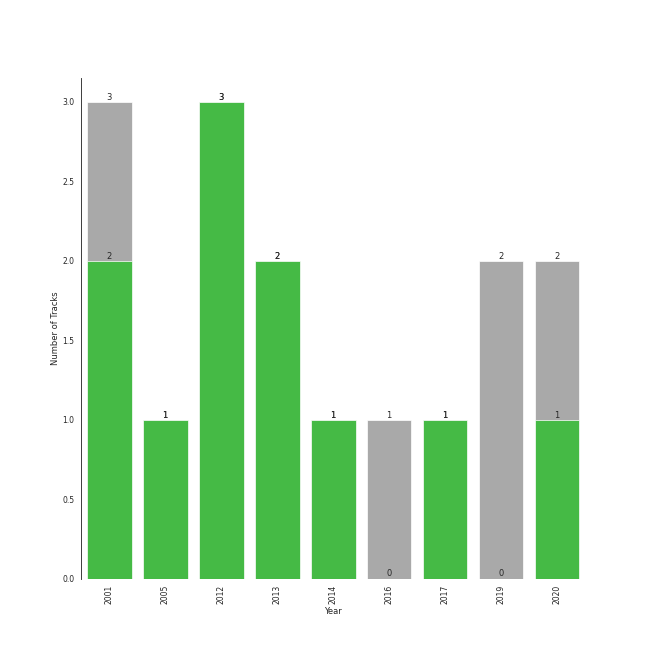

# Electronic

[12 tracks (9 liked) 🔗](https://open.spotify.com/playlist/3cWXIQgqhOUB6slIr3oglt)

[See Track Features](audio_features.md)

[See Clusters](clusters/overview.md)

## Top Artists

| Art | Tracks | 💚 | Artist | 🔗 |
|:---|---:|---:|:---|:---|
|  | 7 | 6 | [Daft Punk](../../artists/daft_punk/overview.md) | [🔗](https://open.spotify.com/artist/4tZwfgrHOc3mvqYlEYSvVi) |
|  | 4 | 3 | [Lindsey Stirling](../../artists/lindsey_stirling/overview.md) | [🔗](https://open.spotify.com/artist/378dH6EszOLFShpRzAQkVM) |
|  | 1 | 1 | Nile Rodgers | [🔗](https://open.spotify.com/artist/3yDIp0kaq9EFKe07X1X2rz) |
|  | 1 | 1 | Pharrell Williams | [🔗](https://open.spotify.com/artist/2RdwBSPQiwcmiDo9kixcl8) |
|  | 1 | 1 | Julian Casablancas | [🔗](https://open.spotify.com/artist/1rAv1GhTQ2rmG94p9lU3rB) |
|  | 1 | 0 | HYO | [🔗](https://open.spotify.com/artist/3U7bOaJLuFkrmDQ1C1OqKl) |
|  | 1 | 0 | The Weeknd | [🔗](https://open.spotify.com/artist/1Xyo4u8uXC1ZmMpatF05PJ) |

## Top Albums

| Art | Tracks | 💚 | Album | Release Date | 🔗 |
|:---|---:|---:|:---|:---|:---|
|  | 3 | 3 | Discovery | 2001-03-12 | [🔗](https://open.spotify.com/album/2noRn2Aes5aoNVsU6iWThc) |
|  | 2 | 2 | Random Access Memories | 2013-05-20 | [🔗](https://open.spotify.com/album/4m2880jivSbbyEGAKfITCa) |
|  | 2 | 2 | Lindsey Stirling | 2012 | [🔗](https://open.spotify.com/album/3YTWAm90osBvLNWCdF8Nq2) |
|  | 1 | 1 | Shatter Me | 2014-04-29 | [🔗](https://open.spotify.com/album/2spbck4ETZz1aLq5Fi5phC) |
|  | 1 | 1 | Human After All | 2005-03-14 | [🔗](https://open.spotify.com/album/1A2GTWGtFfWp7KSQTwWOyo) |
|  | 1 | 0 | Starboy | 2016-11-25 | [🔗](https://open.spotify.com/album/2ODvWsOgouMbaA5xf0RkJe) |
|  | 1 | 0 | Badster | 2019-07-20 | [🔗](https://open.spotify.com/album/4GA4vqEeOzVM8ib6HHy6Ij) |
|  | 1 | 0 | Artemis | 2019-09-06 | [🔗](https://open.spotify.com/album/4YAtGpNUwcHesLlyYUIxur) |

## Top Record Labels

| Tracks | 💚 | Label |
|---:|---:|:---|
| 4 | 4 | Daft Life Ltd. |
| 4 | 4 | ADA France |
| 3 | 3 | Lindseystomp Records |
| 2 | 2 | [Columbia](../../labels/columbia/overview.md) |
| 1 | 0 | Universal Republic Records |
| 1 | 0 | [SM Entertainment](../../labels/sm_entertainment/overview.md) |
| 1 | 0 | BMG Rights Management (US) LLC |

## Genres

| Tracks | 💚 | Genre |
|---:|---:|:---|
| 6 | 6 | [rock](../../genres/rock/overview.md) |
| 6 | 6 | filter house |
| 6 | 6 | electro |
| 4 | 3 | pop violin |
| 4 | 3 | bow pop |
| 1 | 0 | [pop](../../genres/pop/overview.md) |
| 1 | 0 | [k-pop](../../genres/k_pop/overview.md) |
| 1 | 0 | [canadian pop](../../genres/canadian_pop/overview.md) |
| 1 | 0 | canadian contemporary r&b |

## Years

| ​ | 10 newest albums | ​​ | 10 oldest albums |
|:---|:---|:---|:---|
|  | Artemis (2019-09-06) |  | Discovery (2001-03-12) |
|  | Badster (2019-07-20) |  | Human After All (2005-03-14) |
|  | Starboy (2016-11-25) |  | Lindsey Stirling (2012) |
|  | Shatter Me (2014-04-29) |  | Random Access Memories (2013-05-20) |
|  | Random Access Memories (2013-05-20) |  | Shatter Me (2014-04-29) |
|  | Lindsey Stirling (2012) |  | Starboy (2016-11-25) |
|  | Human After All (2005-03-14) |  | Badster (2019-07-20) |
|  | Discovery (2001-03-12) |  | Artemis (2019-09-06) |