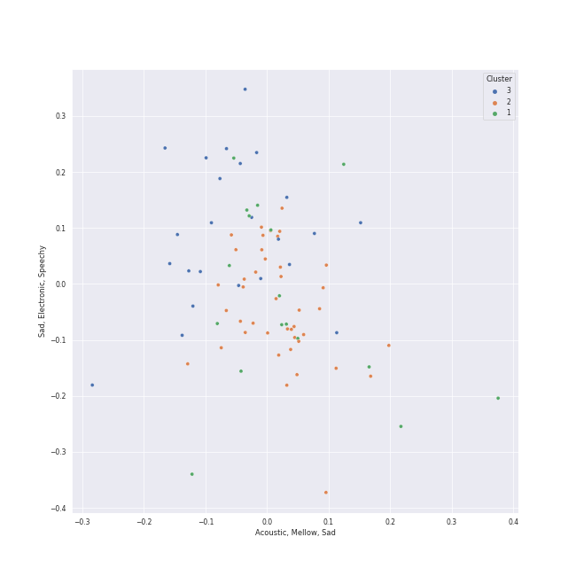

# Clusters in Fun Toddler Songs 

## Cluster #1

17 tracks

| Art | Track | Album | Artists | Label | Rank | 💚 | 🔗 |
|:---|:---|:---|:---|:---|---:|:---|:---|
|  | Letter Sounds (apple apple aaa) | Sounds Like Fun by Barbara Milne | Barbara Milne | Barbara Milne | 1010 | | [🔗](https://open.spotify.com/track/0mSs7n2iFEfoONUCWoZfDl) |
|  | The Alphabet Song | 11 Nursery Rhymes and Songs | Nursery Rhymes 123 | Sky At Night Records | 1010 | | [🔗](https://open.spotify.com/track/3AKptVSm0UdJvzALA4ioAn) |
|  | Skinnamarink | If You're Happy and You Know It | Sing n Play | Sing N Play | 1010 | | [🔗](https://open.spotify.com/track/3qZjcQSjTL1sXvCghKeLb2) |
|  | Old MacDonald Had a Farm | Fun Songs for Kids | The Countdown Kids | Madacy Kids | 1010 | | [🔗](https://open.spotify.com/track/2tGgIA04KdLTRRGY5Ndw5w) |
|  | Months of the Year | Nursery Rhymes: Hooplakidz, Vol. 1 | Anuradha Javeri | Yoboho Music | 1010 | | [🔗](https://open.spotify.com/track/29xVFbFlteivgkDHG15BpO) |
|  | Three Blind Mice | Kids Hits Collection | Kids Hits Project | Barnens Skivbolag | 1010 | | [🔗](https://open.spotify.com/track/30KpWHztqavXKbJYnusL9u) |
|  | Open Shut Them | Twinkle Twinkle Little Star & More Kids Songs | Super Simple Songs | Skyship Entertainment | 1010 | | [🔗](https://open.spotify.com/track/2NtrTPwgjK6nLefb8icrue) |
|  | A Tooty Ta (Tootie Ta) | A Tooty Ta (Tootie Ta) | Ray Remesch | eFlashApps, LLC | 1010 | | [🔗](https://open.spotify.com/track/40aF8upN1GeHQCcNFlDT9J) |
|  | 10 Little Numbers | Nursery Rhymes | Belle and the Nursery Rhymes Band | My Digital Touch | 1010 | | [🔗](https://open.spotify.com/track/4ESxsb4EVn7xGmJPsEN7wr) |
|  | Going On A Bear Hunt | Musicplay Grade 1 Greatest Hits (Part 2) | Denise Gagne | Themes & Variations | 1010 | | [🔗](https://open.spotify.com/track/4bhX85fxOd0E2UtOJcg7TN) |
## Cluster #2

42 tracks

| Art | Track | Album | Artists | Label | Rank | 💚 | 🔗 |
|:---|:---|:---|:---|:---|---:|:---|:---|
|  | We Are The Dinosaurs | The Best of The Laurie Berkner Band | The Laurie Berkner Band | Two Tomatoes | 1010 | | [🔗](https://open.spotify.com/track/1FmJtqPzqoh9FydgLvFcXR) |
|  | I'm A Little Teapot | 30 Children's Playgroup Favourites | The Paul O'Brien All Stars Band | Vex | 1010 | | [🔗](https://open.spotify.com/track/09e9gkRHVf8xQHy3dQ1fO8) |
|  | Three Little Birds | You Are My Little Bird | Elizabeth Mitchell | Smithsonian Folkways Recordings | 1010 | | [🔗](https://open.spotify.com/track/4Rs7nQW8DxBlyBpetWdkyI) |
|  | This Old Man | If You're Happy and You Know It | Sing n Play | Sing N Play | 1010 | | [🔗](https://open.spotify.com/track/4oU7XJPdXtVfNvWrIdRRoT) |
|  | The Farmer In The Dell | Kidsongs: The 50 Greatest Animal Songs | Kidsongs | Together Again Video Productions, Inc. | 1010 | | [🔗](https://open.spotify.com/track/1srbiAU0RloE9PtSGGXmTQ) |
|  | Abc Phonics Song | Abc Phonics Song | The Learning Station | Hug-a-Chug Records | 1010 | | [🔗](https://open.spotify.com/track/6C0KJ9MMjL4G3FkkpUSQph) |
|  | If All Of The Raindrops | Songs for Wiggleworms | Old Town School of Folk Music | The Orchard | 1010 | | [🔗](https://open.spotify.com/track/5POM2lseA6sONqP0O9pxWC) |
|  | Baby Bumblebee | Toddler Action Songs | Cedarmont Kids | Benson | 1010 | | [🔗](https://open.spotify.com/track/5nyiCpT9umyu8ChSDofeVg) |
|  | Hello Song | Music Together Family Favorites | Music Together | Music Together® | 1010 | | [🔗](https://open.spotify.com/track/5tchXfzE9ktj1bSxmgPlDG) |
|  | Row Row Your Boat (Merrily) | Children's Favourites | Children's Music | Barnens Skivbolag | 1010 | | [🔗](https://open.spotify.com/track/6rup3MnFORKLyVwn10k2uO) |
## Cluster #3

24 tracks

| Art | Track | Album | Artists | Label | Rank | 💚 | 🔗 |
|:---|:---|:---|:---|:---|---:|:---|:---|
|  | Bumblebee (Buzz Buzz) | The Best of The Laurie Berkner Band | The Laurie Berkner Band | Two Tomatoes | 1010 | | [🔗](https://open.spotify.com/track/7wmLqSbHSmUzhqXRVqADnq) |
|  | Drivin' in My Car | Ralph's World | Ralph's World | Waterdog Records | 1010 | | [🔗](https://open.spotify.com/track/0oFzsGRIzjGaHfTZTSCBlW) |
|  | Head, Shoulders, Knees and Toes | Mother Goose Club Sings Nursery Rhymes Vol. 4: Row, Row, Row Your Rhyme | Mother Goose Club | Sockeye Media LLC | 1010 | | [🔗](https://open.spotify.com/track/2qKrxtkIuCOyE66TAunMXx) |
|  | Choo Choo Train | Wiggle It! | Patty Shukla | 568073 Records DK2 | 1010 | | [🔗](https://open.spotify.com/track/1V04M7wFRFxzDlcjChlLsh) |
|  | Shake Your Sillies Out | Yummy Yummy (Classic Wiggles) | The Wiggles | [Australian Broadcasting Corp (ABC)](../../../../labels/australian_broadcasting_corp_(abc)) | 1010 | | [🔗](https://open.spotify.com/track/2p5ChL6v6XQKg1taVNd6aB) |
|  | Hot Potato | Yummy Yummy (Classic Wiggles) | The Wiggles | [Australian Broadcasting Corp (ABC)](../../../../labels/australian_broadcasting_corp_(abc)) | 1010 | | [🔗](https://open.spotify.com/track/6YfgINyGYB76E8dZygu4XO) |
|  | Watermelon | Little Day Out | Justine Clarke | [Australian Broadcasting Corp (ABC)](../../../../labels/australian_broadcasting_corp_(abc)) | 1010 | | [🔗](https://open.spotify.com/track/4zR7Vs5v3AmgBrO9fEoSs2) |
|  | Baby Shark | Pinkfong Animal Songs | Pinkfong | Smart Study Co., Ltd. | 1010 | | [🔗](https://open.spotify.com/track/5ygDXis42ncn6kYG14lEVG) |
|  | Happy - From "Despicable Me 2" | G I R L | Pharrell Williams | [Columbia](../../../../labels/columbia) | 1010 | | [🔗](https://open.spotify.com/track/60nZcImufyMA1MKQY3dcCH) |
|  | Daddy Finger (The Finger Family) | More Songs for Kids: Classic Children's Music | Toddler Tunes | Lindstein Music | 1010 | | [🔗](https://open.spotify.com/track/7ps7z3HNmjHWNS9kzNjle2) |