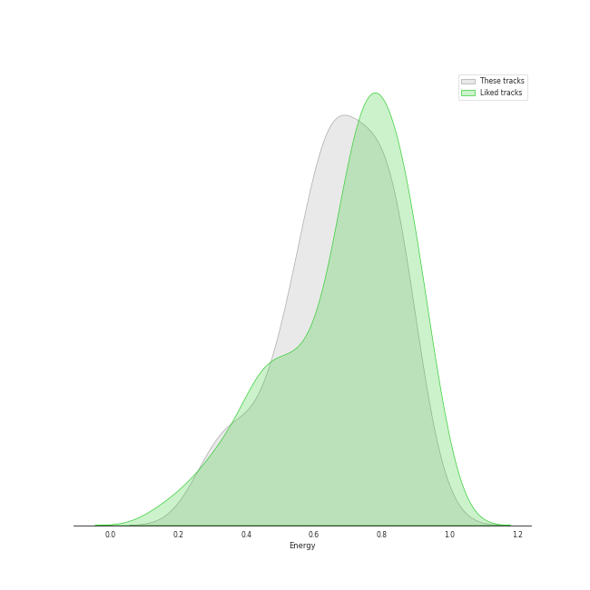
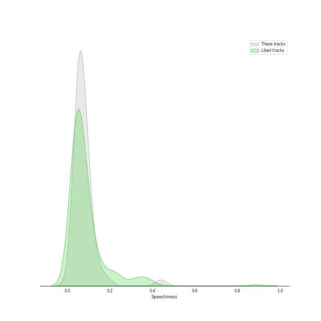

# Track Features for Funk

## Danceability

| ​ | 10 most Danceable tracks | ​​ | 10 least Danceable tracks |
|:---|:---|:---|:---|
|  | Dangerous (0.888) |  | I Want You Back (0.469) |
|  | Think About Things (0.871) |  | I'll Be There (0.51) |
|  | Gagnamagnið (0.869) |  | For Once In My Life (0.524) |
|  | Endurtaka Mig (0.847) |  | Funny Thing (0.586) |
|  | Dreadlock Holiday (0.837) |  | Nate Smith Is the Ace of Aces (0.6) |
|  | TOUCHIN&MOVIN (0.756) |  | I Got You (I Feel Good) (0.613) |
|  | Good Morning Judge (0.737) |  | Superstition - Single Version (0.633) |
|  | Ace of Aces (0.721) |  | Them Changes (0.657) |
|  | Signed, Sealed, Delivered (I'm Yours) (0.675) |  | Signed, Sealed, Delivered (I'm Yours) (0.675) |
|  | Them Changes (0.657) |  | Ace of Aces (0.721) |

## Energy

| ​ | 10 most Energetic tracks | ​​ | 10 least Energetic tracks |
|:---|:---|:---|:---|
|  | Funny Thing (0.893) |  | Gagnamagnið (0.303) |
|  | Ace of Aces (0.848) |  | Think About Things (0.341) |
|  | TOUCHIN&MOVIN (0.833) |  | Dreadlock Holiday (0.38) |
|  | Nate Smith Is the Ace of Aces (0.823) |  | I Got You (I Feel Good) (0.487) |
|  | Endurtaka Mig (0.748) |  | I'll Be There (0.515) |
|  | Dangerous (0.652) |  | For Once In My Life (0.519) |
|  | Good Morning Judge (0.642) |  | I Want You Back (0.538) |
|  | Superstition - Single Version (0.634) |  | Them Changes (0.562) |
|  | Signed, Sealed, Delivered (I'm Yours) (0.597) |  | Signed, Sealed, Delivered (I'm Yours) (0.597) |
|  | Them Changes (0.562) |  | Superstition - Single Version (0.634) |

## Speechiness

| ​ | 10 most Speechy tracks | ​​ | 10 least Speechy tracks |
|:---|:---|:---|:---|
|  | Funny Thing (0.439) |  | I'll Be There (0.0253) |
|  | TOUCHIN&MOVIN (0.145) |  | Signed, Sealed, Delivered (I'm Yours) (0.0337) |
|  | I Got You (I Feel Good) (0.0935) |  | For Once In My Life (0.043) |
|  | Gagnamagnið (0.0919) |  | Endurtaka Mig (0.0531) |
|  | Good Morning Judge (0.0916) |  | I Want You Back (0.0571) |
|  | Dangerous (0.0906) |  | Think About Things (0.0576) |
|  | Superstition - Single Version (0.0725) |  | Them Changes (0.0601) |
|  | Ace of Aces (0.0648) |  | Nate Smith Is the Ace of Aces (0.0618) |
|  | Dreadlock Holiday (0.064) |  | Dreadlock Holiday (0.064) |
|  | Nate Smith Is the Ace of Aces (0.0618) |  | Ace of Aces (0.0648) |

## Acousticness

| ​ | 10 most Acoustic tracks | ​​ | 10 least Acoustic tracks |
|:---|:---|:---|:---|
|  | Funny Thing (0.827) |  | Nate Smith Is the Ace of Aces (0.00926) |
|  | I'll Be There (0.593) |  | Good Morning Judge (0.0185) |
|  | Dreadlock Holiday (0.541) |  | TOUCHIN&MOVIN (0.0191) |
|  | Them Changes (0.54) |  | Endurtaka Mig (0.022) |
|  | I Got You (I Feel Good) (0.412) |  | Gagnamagnið (0.0275) |
|  | I Want You Back (0.305) |  | Think About Things (0.0311) |
|  | Dangerous (0.272) |  | Superstition - Single Version (0.038) |
|  | For Once In My Life (0.195) |  | Ace of Aces (0.0426) |
|  | Signed, Sealed, Delivered (I'm Yours) (0.0534) |  | Signed, Sealed, Delivered (I'm Yours) (0.0534) |
|  | Ace of Aces (0.0426) |  | For Once In My Life (0.195) |

## Instrumentalness

| ​ | 10 most Instrumental tracks | ​​ | 10 least Instrumental tracks |
|:---|:---|:---|:---|
|  | Ace of Aces (0.95) |  | Signed, Sealed, Delivered (I'm Yours) (0.0) |
|  | Nate Smith Is the Ace of Aces (0.893) |  | TOUCHIN&MOVIN (0.0) |
|  | Funny Thing (0.642) |  | For Once In My Life (0.0) |
|  | Dreadlock Holiday (0.00789) |  | Dangerous (0.0) |
|  | Superstition - Single Version (0.0064) |  | I'll Be There (1.24e-06) |
|  | Good Morning Judge (0.00415) |  | Gagnamagnið (7.08e-06) |
|  | Them Changes (0.00143) |  | I Got You (I Feel Good) (1.02e-05) |
|  | Endurtaka Mig (0.00119) |  | I Want You Back (0.00012) |
|  | Think About Things (0.000124) |  | Think About Things (0.000124) |
|  | I Want You Back (0.00012) |  | Endurtaka Mig (0.00119) |

## Liveness

| ​ | 10 most Live tracks | ​​ | 10 least Live tracks |
|:---|:---|:---|:---|
|  | I'll Be There (0.654) |  | Superstition - Single Version (0.0385) |
|  | Nate Smith Is the Ace of Aces (0.547) |  | Gagnamagnið (0.0696) |
|  | For Once In My Life (0.523) |  | Good Morning Judge (0.0726) |
|  | I Want You Back (0.37) |  | Think About Things (0.0838) |
|  | Endurtaka Mig (0.358) |  | Dangerous (0.0932) |
|  | I Got You (I Feel Good) (0.286) |  | TOUCHIN&MOVIN (0.0955) |
|  | Funny Thing (0.212) |  | Signed, Sealed, Delivered (I'm Yours) (0.0986) |
|  | Dreadlock Holiday (0.198) |  | Them Changes (0.101) |
|  | Ace of Aces (0.15) |  | Ace of Aces (0.15) |
|  | Them Changes (0.101) |  | Dreadlock Holiday (0.198) |

## Valence

| ​ | 10 most Happy tracks | ​​ | 10 least Happy tracks |
|:---|:---|:---|:---|
|  | Dangerous (0.905) |  | I'll Be There (0.331) |
|  | Ace of Aces (0.896) |  | Endurtaka Mig (0.355) |
|  | Dreadlock Holiday (0.892) |  | Good Morning Judge (0.467) |
|  | I Want You Back (0.886) |  | Gagnamagnið (0.543) |
|  | Nate Smith Is the Ace of Aces (0.874) |  | Think About Things (0.612) |
|  | Superstition - Single Version (0.872) |  | Funny Thing (0.65) |
|  | For Once In My Life (0.847) |  | TOUCHIN&MOVIN (0.675) |
|  | Signed, Sealed, Delivered (I'm Yours) (0.828) |  | I Got You (I Feel Good) (0.699) |
|  | Them Changes (0.704) |  | Them Changes (0.704) |
|  | I Got You (I Feel Good) (0.699) |  | Signed, Sealed, Delivered (I'm Yours) (0.828) |

## Tempo

| ​ | 10 most Fast tracks | ​​ | 10 least Fast tracks |
|:---|:---|:---|:---|
|  | I Want You Back (196.605) |  | Them Changes (81.657) |
|  | I Got You (I Feel Good) (143.332) |  | I'll Be There (93.212) |
|  | Endurtaka Mig (140.071) |  | Superstition - Single Version (100.499) |
|  | Funny Thing (140.023) |  | Dreadlock Holiday (104.995) |
|  | Gagnamagnið (127.044) |  | Ace of Aces (105.605) |
|  | Think About Things (127.001) |  | Nate Smith Is the Ace of Aces (105.849) |
|  | TOUCHIN&MOVIN (113.056) |  | Good Morning Judge (106.742) |
|  | Dangerous (111.962) |  | Signed, Sealed, Delivered (I'm Yours) (108.875) |
|  | For Once In My Life (110.121) |  | For Once In My Life (110.121) |
|  | Signed, Sealed, Delivered (I'm Yours) (108.875) |  | Dangerous (111.962) |
