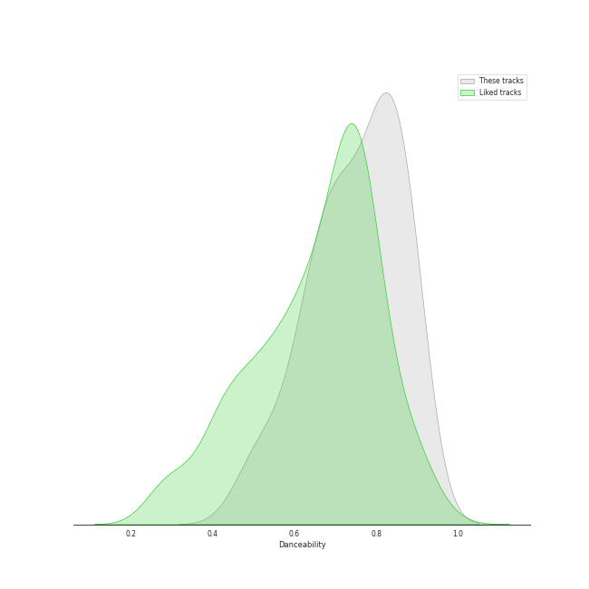
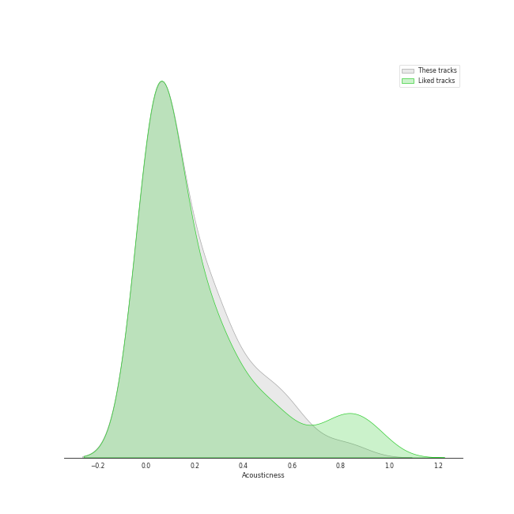
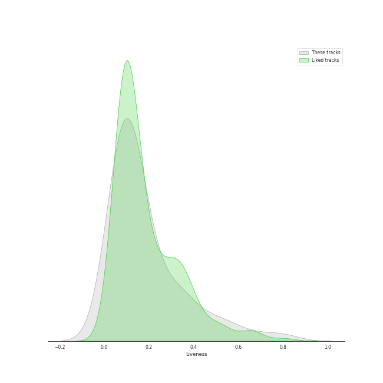
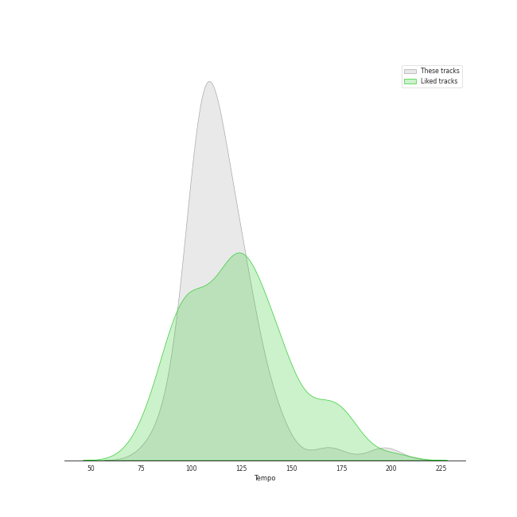

# Track Features for Funk

## Danceability

| ​ | 10 most Danceable tracks | ​​ | 10 least Danceable tracks |
|:---|:---|:---|:---|
|  | Thank You (Falettinme Be Mice Elf Agin) - Single Version (0.9) |  | I Want You Back (0.469) |
|  | Scandal (0.898) |  | I'll Be There (0.51) |
|  | In My Bones (feat. Kimbra & Tank and The Bangas) (0.897) |  | For Once In My Life (0.524) |
|  | Funkytown (0.894) |  | Let's Get It On (0.541) |
|  | Dangerous (0.888) |  | Funny Thing (0.586) |
|  | Don't Stop 'Til You Get Enough (0.878) |  | Nate Smith Is the Ace of Aces (0.6) |
|  | Think About Things (0.871) |  | I Got You (I Feel Good) (0.613) |
|  | Gagnamagnið (0.869) |  | Lady Marmalade (0.631) |
|  | PULL UP (0.853) |  | Superstition - Single Version (0.633) |
|  | Endurtaka Mig (0.847) |  | Nobody Knows (0.655) |

## Energy

| ​ | 10 most Energetic tracks | ​​ | 10 least Energetic tracks |
|:---|:---|:---|:---|
|  | Red Lipstick (feat. Yoonmirae) (0.941) |  | Gagnamagnið (0.303) |
|  | Funny Thing (0.893) |  | Think About Things (0.341) |
|  | Scandal (0.873) |  | I Heard It Through The Grapevine (0.362) |
|  | One Nation Under a Groove (0.852) |  | Dreadlock Holiday (0.38) |
|  | Jungle Boogie (0.85) |  | Funkytown (0.423) |
|  | Higher Ground (0.85) |  | Let's Hear It for the Boy - From "Footloose" Original Soundtrack (0.485) |
|  | Ace of Aces (0.848) |  | I Got You (I Feel Good) (0.487) |
|  | LUPIN (0.838) |  | I'll Be There (0.515) |
|  | TOUCHIN&MOVIN (0.833) |  | For Once In My Life (0.519) |
|  | Nate Smith Is the Ace of Aces (0.823) |  | I Want You Back (0.538) |

## Speechiness

| ​ | 10 most Speechy tracks | ​​ | 10 least Speechy tracks |
|:---|:---|:---|:---|
|  | Funny Thing (0.439) |  | I'll Be There (0.0253) |
|  | In My Bones (feat. Kimbra & Tank and The Bangas) (0.189) |  | Ain't No Mountain High Enough (0.032) |
|  | TOUCHIN&MOVIN (0.145) |  | Signed, Sealed, Delivered (I'm Yours) (0.0337) |
|  | nevertheless (0.144) |  | I Heard It Through The Grapevine (0.0381) |
|  | Nobody Knows (0.116) |  | One Nation Under a Groove (0.0419) |
|  | PULL UP (0.113) |  | Higher Ground (0.0426) |
|  | Fly As Me (0.102) |  | Sweet Venom (0.0427) |
|  | NAKKA (with IU) (0.101) |  | For Once In My Life (0.043) |
|  | I Got You (I Feel Good) (0.0935) |  | Lucid Dream (0.0441) |
|  | Gagnamagnið (0.0919) |  | Flash Light (0.0465) |

## Acousticness

| ​ | 10 most Acoustic tracks | ​​ | 10 least Acoustic tracks |
|:---|:---|:---|:---|
|  | Funny Thing (0.827) |  | Funkytown (0.00239) |
|  | Shining Star (0.668) |  | Fly As Me (0.00756) |
|  | I'll Be There (0.593) |  | Nate Smith Is the Ace of Aces (0.00926) |
|  | Dreadlock Holiday (0.541) |  | Good Morning Judge (0.0185) |
|  | Them Changes (0.54) |  | TOUCHIN&MOVIN (0.0191) |
|  | You Sexy Thing (0.523) |  | Endurtaka Mig (0.022) |
|  | Ain't No Mountain High Enough (0.43) |  | Gagnamagnið (0.0275) |
|  | One Nation Under a Groove (0.416) |  | Think About Things (0.0311) |
|  | I Got You (I Feel Good) (0.412) |  | Superstition - Single Version (0.038) |
|  | Lady Marmalade (0.398) |  | Scandal (0.0397) |

## Instrumentalness

| ​ | 10 most Instrumental tracks | ​​ | 10 least Instrumental tracks |
|:---|:---|:---|:---|
|  | Ace of Aces (0.95) |  | enchanted night ~ white night (0.0) |
|  | Nate Smith Is the Ace of Aces (0.893) |  | Lady Marmalade (0.0) |
|  | Funny Thing (0.642) |  | I Heard It Through The Grapevine (0.0) |
|  | Funkytown (0.446) |  | nevertheless (0.0) |
|  | Flash Light (0.117) |  | Sweet Venom (0.0) |
|  | Don't Stop 'Til You Get Enough (0.0461) |  | Super Freak (0.0) |
|  | Brick House (0.0171) |  | Signed, Sealed, Delivered (I'm Yours) (0.0) |
|  | Shining Star (0.00915) |  | TOUCHIN&MOVIN (0.0) |
|  | Dreadlock Holiday (0.00789) |  | Fly As Me (0.0) |
|  | Superstition - Single Version (0.0064) |  | PULL UP (0.0) |

## Liveness

| ​ | 10 most Live tracks | ​​ | 10 least Live tracks |
|:---|:---|:---|:---|
|  | Red Lipstick (feat. Yoonmirae) (0.792) |  | Brick House (0.032) |
|  | I'll Be There (0.654) |  | Superstition - Single Version (0.0385) |
|  | Nate Smith Is the Ace of Aces (0.547) |  | Let's Hear It for the Boy - From "Footloose" Original Soundtrack (0.0477) |
|  | For Once In My Life (0.523) |  | Super Freak (0.0575) |
|  | Flash Light (0.474) |  | Let's Get It On (0.0576) |
|  | LUPIN (0.417) |  | Fly As Me (0.0606) |
|  | I Want You Back (0.37) |  | Play That Funky Music (0.061) |
|  | Endurtaka Mig (0.358) |  | PULL UP (0.0693) |
|  | In My Bones (feat. Kimbra & Tank and The Bangas) (0.331) |  | Gagnamagnið (0.0696) |
|  | Give Up The Funk (Tear The Roof Off The Sucker) (0.326) |  | Lucid Dream (0.072) |

## Valence

| ​ | 10 most Happy tracks | ​​ | 10 least Happy tracks |
|:---|:---|:---|:---|
|  | You Sexy Thing (0.962) |  | Lucid Dream (0.146) |
|  | Super Freak (0.962) |  | I'll Be There (0.331) |
|  | Don't Stop 'Til You Get Enough (0.947) |  | Endurtaka Mig (0.355) |
|  | Lady Marmalade (0.947) |  | Funkytown (0.462) |
|  | Play That Funky Music (0.933) |  | Good Morning Judge (0.467) |
|  | Nobody Knows (0.927) |  | Fly As Me (0.48) |
|  | Papa's Got A Brand New Bag (0.925) |  | NAKKA (with IU) (0.499) |
|  | Sweet Venom (0.911) |  | Gagnamagnið (0.543) |
|  | Dangerous (0.905) |  | enchanted night ~ white night (0.586) |
|  | Thank You (Falettinme Be Mice Elf Agin) - Single Version (0.897) |  | Think About Things (0.612) |

## Tempo

| ​ | 10 most Fast tracks | ​​ | 10 least Fast tracks |
|:---|:---|:---|:---|
|  | I Want You Back (196.605) |  | Them Changes (81.657) |
|  | Let's Get It On (168.809) |  | Nobody Knows (90.055) |
|  | I Got You (I Feel Good) (143.332) |  | I'll Be There (93.212) |
|  | Endurtaka Mig (140.071) |  | Lucid Dream (97.998) |
|  | Funny Thing (140.023) |  | nevertheless (99.942) |
|  | Super Freak (132.446) |  | Fly As Me (100.025) |
|  | Ain't No Mountain High Enough (129.991) |  | Superstition - Single Version (100.499) |
|  | In My Bones (feat. Kimbra & Tank and The Bangas) (129.056) |  | NAKKA (with IU) (100.923) |
|  | Papa's Got A Brand New Bag (127.942) |  | Shining Star (102.516) |
|  | Gagnamagnið (127.044) |  | Dreadlock Holiday (104.995) |
