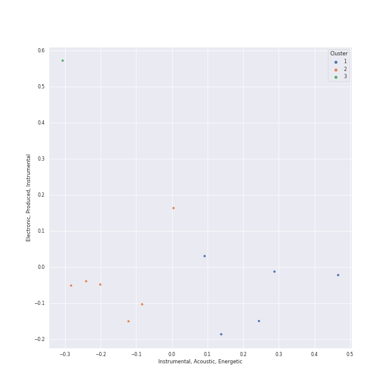

# Clusters in Funk

## Cluster #1

23 tracks

| Art | Track | Album | Artists | Label | Rank | 💚 | 🔗 |
|:---|:---|:---|:---|:---|---:|:---|:---|
|  | NAKKA (with IU) | NEXT EPISODE | [AKMU](../../../../artists/akmu/overview.md), [IU](../../../../artists/iu/overview.md) | [YG Entertainment](../../../../labels/yg_entertainment) | 691 | 💚 | [🔗](https://open.spotify.com/track/4t2FIqZJORKZGSKg30SShr) |
|  | enchanted night ~ white night | the Billage of perception: chapter three | [Billlie](../../../../artists/billlie/overview.md) | [MYSTIC STORY](../../../../labels/mystic_story) | 97 | 💚 | [🔗](https://open.spotify.com/track/0rTXn4ovXalJGkJMx5hsnX) |
|  | Good Morning Judge | Deceptive Bends | 10cc | [EMI](../../../../labels/emi) | nan | 💚 | [🔗](https://open.spotify.com/track/1fMGRxKRtIKNyaMMGrzInM) |
|  | Them Changes | Drunk | Thundercat | Brainfeeder | nan | | [🔗](https://open.spotify.com/track/7CH99b2i1TXS5P8UUyWtnM) |
|  | I Heard It Through The Grapevine | In The Groove | Marvin Gaye | [Motown](../../../../labels/motown) | nan | | [🔗](https://open.spotify.com/track/1tqT6DhmsrtQgyCKUwotiw) |
|  | Let's Get It On | Let's Get It On | Marvin Gaye | [Motown](../../../../labels/motown) | nan | | [🔗](https://open.spotify.com/track/627teoJpK7qZOxRRY8TNnv) |
|  | Ain't No Mountain High Enough | United | Marvin Gaye, Tammi Terrell | [MOTOWN](../../../../labels/motown), [UNI](../../../../labels/uni) | nan | | [🔗](https://open.spotify.com/track/7tqhbajSfrz2F7E1Z75ASX) |
|  | Flash Light | Funkentelechy Vs. The Placebo Syndrome | Parliament | Mercury Records | nan | | [🔗](https://open.spotify.com/track/1v1PV2wERHiMPesMWX0qmO) |
|  | LUPIN | LUPIN | DKZ | ㈜ 동요엔터테인먼트 | nan | 💚 | [🔗](https://open.spotify.com/track/4wWXrCe0z1rrNbgjOBxHvF) |
|  | I Got You (I Feel Good) | I Got You (I Feel Good) | James Brown & The Famous Flames | [Universal Records](../../../../labels/universal_music_llc) | nan | | [🔗](https://open.spotify.com/track/5haXbSJqjjM0TCJ5XkfEaC) |
## Cluster #2

23 tracks

| Art | Track | Album | Artists | Label | Rank | 💚 | 🔗 |
|:---|:---|:---|:---|:---|---:|:---|:---|
|  | Get Up (I Feel Like Being A) Sex Machine | Star Time | James Brown | [Universal/Island Def Jam](../../../../labels/universal_music_llc) | nan | 💚 | [🔗](https://open.spotify.com/track/2ivdsb1RcEJjIs5tuHkUC9) |
|  | Dangerous | TEN - The 1st Mini Album | [TEN](../../../../artists/ten/overview.md) | [SM Entertainment](../../../../labels/sm_entertainment) | 283 | 💚 | [🔗](https://open.spotify.com/track/56vA4AoGec8ae9nmdprBBI) |
|  | Sweet Venom | ORANGE BLOOD | [ENHYPEN](../../../../artists/enhypen/overview.md) | [BELIFT LAB](../../../../labels/belift_lab) | 74 | 💚 | [🔗](https://open.spotify.com/track/2YmfV4lAjrAQvuggKCUX6m) |
|  | Higher Ground | Innervisions | Stevie Wonder | [Motown](../../../../labels/motown) | nan | 💚 | [🔗](https://open.spotify.com/track/0dMd4rilfd6gPbXaLpNYhu) |
|  | Signed, Sealed, Delivered (I'm Yours) | Signed, Sealed And Delivered | Stevie Wonder | [MOTOWN](../../../../labels/motown), [UNI](../../../../labels/uni) | nan | 💚 | [🔗](https://open.spotify.com/track/2eF8pWbiivYsYRpbntYsnc) |
|  | nevertheless | the Billage of perception: chapter three | [Billlie](../../../../artists/billlie/overview.md) | [MYSTIC STORY](../../../../labels/mystic_story) | 501 | 💚 | [🔗](https://open.spotify.com/track/26fVl2CYeXXxD4yEqmhrpM) |
|  | Give Up The Funk (Tear The Roof Off The Sucker) | Mothership Connection | Parliament | Def Jam West | nan | 💚 | [🔗](https://open.spotify.com/track/4XRkQloZFcRrCONN7ZQ49Y) |
|  | Super Freak | Street Songs (Deluxe Edition) | Rick James | [Motown](../../../../labels/motown) | nan | 💚 | [🔗](https://open.spotify.com/track/2dCmGcEOQrMQhMMS8Vj7Ca) |
|  | Play That Funky Music | Wild Cherry | Wild Cherry | [Epic](../../../../labels/epic) | nan | 💚 | [🔗](https://open.spotify.com/track/5uuJruktM9fMdN9Va0DUMl) |
|  | Thank You (Falettinme Be Mice Elf Agin) - Single Version | Greatest Hits | Sly & The Family Stone | [Epic](../../../../labels/epic), [Legacy](../../../../labels/legacy) | nan | 💚 | [🔗](https://open.spotify.com/track/74iQ3gahRTOGc19bYadBE3) |
## Cluster #3

2 tracks

| Art | Track | Album | Artists | Label | Rank | 💚 | 🔗 |
|:---|:---|:---|:---|:---|---:|:---|:---|
|  | Ace of Aces | The Fearless Flyers | The Fearless Flyers | Vulf Records | nan | | [🔗](https://open.spotify.com/track/1SlkhRMOEJp97Ho0BaIOkj) |
|  | Nate Smith Is the Ace of Aces | Tailwinds | The Fearless Flyers | Vulf Records | 642 | 💚 | [🔗](https://open.spotify.com/track/3p8Gxhqy3pzCU7BRfqhqPE) |