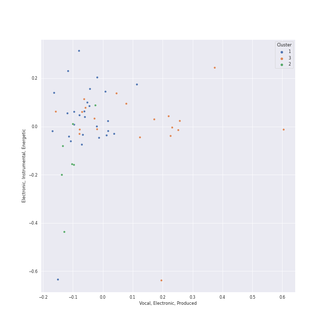

# Clusters in Funk

## Cluster #1

13 tracks

| Art | Track | Album | Artists | Label | Rank | 💚 | 🔗 |
|:---|:---|:---|:---|:---|---:|:---|:---|
|  | Fly As Me | An Evening With Silk Sonic | [Bruno Mars](../../../../artists/bruno_mars/overview.md), Anderson .Paak, Silk Sonic | [Aftermath Entertainment/Atlantic](../../../../labels/atlantic_records) | nan | 💚 | [🔗](https://open.spotify.com/track/3a6FcTyvSf0ED3VXeH3PJ5) |
|  | NAKKA (with IU) | NEXT EPISODE | [AKMU](../../../../artists/akmu/overview.md), [IU](../../../../artists/iu/overview.md) | [YG Entertainment](../../../../labels/yg_entertainment) | 719 | 💚 | [🔗](https://open.spotify.com/track/4t2FIqZJORKZGSKg30SShr) |
|  | enchanted night ~ white night | the Billage of perception: chapter three | [Billlie](../../../../artists/billlie/overview.md) | [MYSTIC STORY](../../../../labels/mystic_story) | 85 | 💚 | [🔗](https://open.spotify.com/track/0rTXn4ovXalJGkJMx5hsnX) |
|  | Think About Things | Think About Things | Daði Freyr | Samlist | nan | 💚 | [🔗](https://open.spotify.com/track/2iRniYXjMHKmwXqA2jYXP7) |
|  | Gagnamagnið | Söngvakeppnin 2020 | Daði Freyr | Ríkisútvarpið - Exclusively distributed by Alda Music | nan | 💚 | [🔗](https://open.spotify.com/track/5GU7W29lPxlMrS2PW7ZvQ0) |
|  | Good Morning Judge | Deceptive Bends | 10cc | [EMI](../../../../labels/emi) | nan | 💚 | [🔗](https://open.spotify.com/track/1fMGRxKRtIKNyaMMGrzInM) |
|  | I Heard It Through The Grapevine | In The Groove | Marvin Gaye | [Motown](../../../../labels/motown) | nan | | [🔗](https://open.spotify.com/track/1tqT6DhmsrtQgyCKUwotiw) |
|  | Let's Get It On | Let's Get It On | Marvin Gaye | [Motown](../../../../labels/motown) | nan | | [🔗](https://open.spotify.com/track/627teoJpK7qZOxRRY8TNnv) |
|  | Let's Hear It for the Boy - From "Footloose" Original Soundtrack | Let's Hear It for the Boy (Expanded Edition) | Deniece Williams | [Columbia](../../../../labels/columbia), [Legacy](../../../../labels/legacy) | nan | | [🔗](https://open.spotify.com/track/4VyU9Tg4drTj2mOUZHSK2u) |
|  | I Got You (I Feel Good) | I Got You (I Feel Good) | James Brown & The Famous Flames | [Universal Records](../../../../labels/universal_music_llc) | nan | | [🔗](https://open.spotify.com/track/5haXbSJqjjM0TCJ5XkfEaC) |
## Cluster #2

27 tracks

| Art | Track | Album | Artists | Label | Rank | 💚 | 🔗 |
|:---|:---|:---|:---|:---|---:|:---|:---|
|  | Get Up (I Feel Like Being A) Sex Machine | Star Time | James Brown | [Universal/Island Def Jam](../../../../labels/universal_music_llc) | nan | 💚 | [🔗](https://open.spotify.com/track/2ivdsb1RcEJjIs5tuHkUC9) |
|  | Dangerous | TEN - The 1st Mini Album | [TEN](../../../../artists/ten/overview.md) | [SM Entertainment](../../../../labels/sm_entertainment) | 160 | 💚 | [🔗](https://open.spotify.com/track/56vA4AoGec8ae9nmdprBBI) |
|  | Sweet Venom | ORANGE BLOOD | [ENHYPEN](../../../../artists/enhypen/overview.md) | [BELIFT LAB](../../../../labels/belift_lab) | 67 | 💚 | [🔗](https://open.spotify.com/track/2YmfV4lAjrAQvuggKCUX6m) |
|  | Nobody Knows | Born to be XX | [KISS OF LIFE](../../../../artists/kiss_of_life/overview.md) | [S2 ENTERTAINMENT INC.](../../../../labels/s2_entertainment_inc_) | 114 | 💚 | [🔗](https://open.spotify.com/track/70efTlnBNM8BvfhfPiqOBN) |
|  | Undo | Undo | [HEIZE](../../../../artists/heize/overview.md) | [Genie Music Corporation](../../../../labels/genie_music_corporation), [Stone Music Entertainment](../../../../labels/stone_music_entertainment) | 200 | 💚 | [🔗](https://open.spotify.com/track/6z1pJ3KUmQagUpMVqL62sa) |
|  | PULL UP | The 3rd Mini Album 'VarioUS' | [VIVIZ](../../../../artists/viviz/overview.md) | BIGPLANETMADE, SWING ENTERTAINMENT | nan | 💚 | [🔗](https://open.spotify.com/track/4Jmrkz9hytD3jaLDkZ7Qvc) |
|  | nevertheless | the Billage of perception: chapter three | [Billlie](../../../../artists/billlie/overview.md) | [MYSTIC STORY](../../../../labels/mystic_story) | 534 | 💚 | [🔗](https://open.spotify.com/track/26fVl2CYeXXxD4yEqmhrpM) |
|  | Super Freak | Street Songs (Deluxe Edition) | Rick James | [Motown](../../../../labels/motown) | nan | 💚 | [🔗](https://open.spotify.com/track/2dCmGcEOQrMQhMMS8Vj7Ca) |
|  | Play That Funky Music | Wild Cherry | Wild Cherry | [Epic](../../../../labels/epic) | nan | 💚 | [🔗](https://open.spotify.com/track/5uuJruktM9fMdN9Va0DUMl) |
|  | Thank You (Falettinme Be Mice Elf Agin) - Single Version | Greatest Hits | Sly & The Family Stone | [Epic](../../../../labels/epic), [Legacy](../../../../labels/legacy) | nan | 💚 | [🔗](https://open.spotify.com/track/74iQ3gahRTOGc19bYadBE3) |
## Cluster #3

10 tracks

| Art | Track | Album | Artists | Label | Rank | 💚 | 🔗 |
|:---|:---|:---|:---|:---|---:|:---|:---|
|  | In My Bones (feat. Kimbra & Tank and The Bangas) | Djesse Vol. 3 | [Jacob Collier](../../../../artists/jacob_collier/overview.md), [Kimbra](../../../../artists/kimbra/overview.md), Tank and The Bangas | [Decca (UMO)](../../../../labels/decca_(umo)) | 490 | 💚 | [🔗](https://open.spotify.com/track/06PNiDGtPIMOq9VU2ftVCk) |
|  | Red Lipstick (feat. Yoonmirae) | 4 ONLY | [LeeHi](../../../../artists/leehi/overview.md), YOON MIRAE | [Genie Music Corporation](../../../../labels/genie_music_corporation), [Stone Music Entertainment](../../../../labels/stone_music_entertainment) | nan | 💚 | [🔗](https://open.spotify.com/track/7nJc2Oxfn7xRX3eF4hltyl) |
|  | For Once In My Life | For Once In My Life | Stevie Wonder | [Motown](../../../../labels/motown) | nan | | [🔗](https://open.spotify.com/track/4kP69y3GKHi9tXckfgp4bK) |
|  | I'll Be There | Third Album | The Jackson 5 | [MOTOWN](../../../../labels/motown), [UNI](../../../../labels/uni) | nan | | [🔗](https://open.spotify.com/track/5RdhBLmB4DyFHLglRrfx63) |
|  | Endurtaka Mig | & Co. | Daði Freyr, Blær | Samlist | nan | 💚 | [🔗](https://open.spotify.com/track/1HZoHnORADtuEfe9O4ldQH) |
|  | Nate Smith Is the Ace of Aces | Tailwinds | The Fearless Flyers | Vulf Records | 672 | 💚 | [🔗](https://open.spotify.com/track/3p8Gxhqy3pzCU7BRfqhqPE) |
|  | Flash Light | Funkentelechy Vs. The Placebo Syndrome | Parliament | Mercury Records | nan | | [🔗](https://open.spotify.com/track/1v1PV2wERHiMPesMWX0qmO) |
|  | Give Up The Funk (Tear The Roof Off The Sucker) | Mothership Connection | Parliament | Def Jam West | nan | 💚 | [🔗](https://open.spotify.com/track/4XRkQloZFcRrCONN7ZQ49Y) |
|  | Jungle Boogie | Wild And Peaceful | Kool & The Gang | Island Mercury | nan | | [🔗](https://open.spotify.com/track/3K0SJUQNbOkUprTFcwwAKN) |
|  | LUPIN | LUPIN | DKZ | ㈜ 동요엔터테인먼트 | nan | 💚 | [🔗](https://open.spotify.com/track/4wWXrCe0z1rrNbgjOBxHvF) |