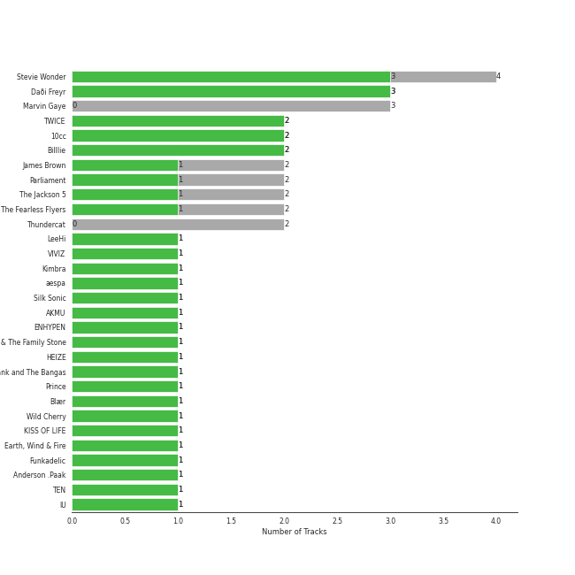
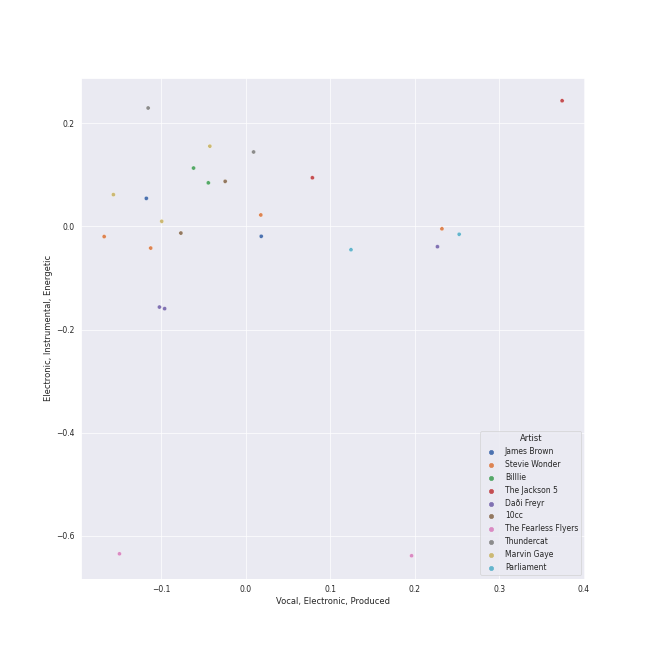
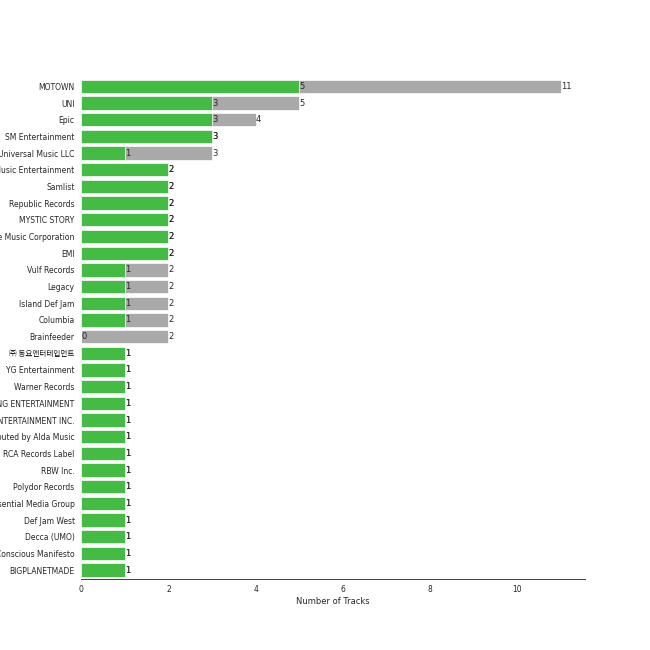
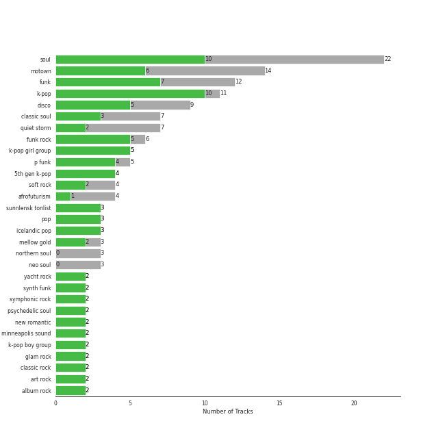

# Funk

[17 tracks (11 liked) 🔗](https://open.spotify.com/playlist/0SL2KHDmNlkSmEgOBPeJCJ)

[See Track Features](audio_features.md)

[See Clusters](clusters/overview.md)

## Top Artists

| Art | Tracks | 💚 | Artist | 🔗 |
|:---|---:|---:|:---|:---|
|  | 3 | 3 | Daði Freyr | [🔗](https://open.spotify.com/artist/3Hb64DQZIhDCgyHKrzBXOL) |
|  | 3 | 2 | Stevie Wonder | [🔗](https://open.spotify.com/artist/7guDJrEfX3qb6FEbdPA5qi) |
|  | 2 | 2 | 10cc | [🔗](https://open.spotify.com/artist/6i6WlGzQtXtz7GcC5H5st5) |
|  | 2 | 1 | The Jackson 5 | [🔗](https://open.spotify.com/artist/2iE18Oxc8YSumAU232n4rW) |
|  | 2 | 1 | The Fearless Flyers | [🔗](https://open.spotify.com/artist/1JyLSGXC3aWzjY6ZdxvIXh) |
| | 1 | 1 | Blær | [🔗](https://open.spotify.com/artist/5W6FVpHHiRfqUU4d9FfXWZ) |
|  | 1 | 1 | [TEN](../../artists/ten/overview.md) | [🔗](https://open.spotify.com/artist/3Q5Qep7ytrjVleNnMnntgQ) |
|  | 1 | 1 | Moon Byul | [🔗](https://open.spotify.com/artist/1eTft3tXynrKdo6XD7QHLL) |
|  | 2 | 0 | Thundercat | [🔗](https://open.spotify.com/artist/4frXpPxQQZwbCu3eTGnZEw) |
|  | 1 | 0 | James Brown & The Famous Flames | [🔗](https://open.spotify.com/artist/32r72WOqqRO1DtSznId7Lr) |

## Top Albums

| Art | Tracks | 💚 | Album | Release Date | 🔗 |
|:---|---:|---:|:---|:---|:---|
|  | 1 | 1 | Think About Things | 2020-04-09 | [🔗](https://open.spotify.com/album/5gEUjiNfaVse6oloI0c6Vt) |
|  | 1 | 1 | The Definitive Collection | 2002-10-29 | [🔗](https://open.spotify.com/album/4E1itnJOhTMRSATNaxh0Sq) |
|  | 1 | 1 | Tailwinds | 2020-07-24 | [🔗](https://open.spotify.com/album/6qPLq4JNIUi0BEj1OHwEkg) |
|  | 1 | 1 | TEN - The 1st Mini Album | 2024-02-13 | [🔗](https://open.spotify.com/album/50Zo1vf3YCQtXLUZr2oBiQ) |
|  | 1 | 1 | Söngvakeppnin 2020 | 2020-01-18 | [🔗](https://open.spotify.com/album/32ypMgv8eQ7ACVd2uBaPG7) |
|  | 1 | 1 | Starlit of Muse | 2024-02-20 | [🔗](https://open.spotify.com/album/1YtCxUGiarZVukgAm2x5RZ) |
|  | 1 | 1 | Signed, Sealed And Delivered | 1970-08-07 | [🔗](https://open.spotify.com/album/54ootLtDyMZFr9obtWQvvO) |
|  | 1 | 1 | Diana Ross Presents The Jackson 5 | 1969-12-18 | [🔗](https://open.spotify.com/album/51uoKRa8vT5SULrlF8s2t1) |
|  | 1 | 1 | Deceptive Bends | 1977 | [🔗](https://open.spotify.com/album/6D3RQD5AQZ4P2aDzsZmBI4) |
|  | 1 | 1 | Bloody Tourists | 1978 | [🔗](https://open.spotify.com/album/3MecVG0PeBObAhjwEAczFG) |

See all 17 albums

| Art | Tracks | 💚 | Album | Release Date | 🔗 |
|:---|---:|---:|:---|:---|:---|
|  | 1 | 1 | & Co. | 2019-06-12 | [🔗](https://open.spotify.com/album/4pS7NXSZNbvREVxKkOge3I) |
|  | 1 | 0 | Third Album | 1970-09-08 | [🔗](https://open.spotify.com/album/5d6X8oegJmu9XKn9UBAswG) |
|  | 1 | 0 | The Fearless Flyers | 2018-03-30 | [🔗](https://open.spotify.com/album/2GEQWuTviG5lXO66aiOYqt) |
|  | 1 | 0 | It Is What It Is | 2020-04-03 | [🔗](https://open.spotify.com/album/59GRmAvlGs7KjLizFnV7Y9) |
|  | 1 | 0 | I Got You (I Feel Good) | 1966-02-01 | [🔗](https://open.spotify.com/album/5UqTOjkfRMzkORwpeOWtt3) |
|  | 1 | 0 | For Once In My Life | 1968-12-01 | [🔗](https://open.spotify.com/album/3pPBbp1Nl9n1AM9xFpdKtZ) |
|  | 1 | 0 | Drunk | 2017-02-24 | [🔗](https://open.spotify.com/album/7vHBQDqwzB7uDvoE5bncMM) |

## Top Record Labels

| Tracks | 💚 | Label |
|---:|---:|:---|
| 5 | 3 | [MOTOWN](../../labels/motown/overview.md) |
| 4 | 3 | [UNI](../../labels/uni/overview.md) |
| 2 | 2 | Samlist |
| 2 | 2 | EMI |
| 2 | 1 | Vulf Records |
| 1 | 1 | [SM Entertainment](../../labels/sm_entertainment/overview.md) |
| 1 | 1 | Ríkisútvarpið - Exclusively distributed by Alda Music |
| 1 | 1 | [RBW Inc.](../../labels/rbw_inc_/overview.md) |
| 2 | 0 | Brainfeeder |
| 1 | 0 | [Universal Music LLC](../../labels/universal_music_llc/overview.md) |

## Genres

| Tracks | 💚 | Genre |
|---:|---:|:---|
| 6 | 3 | [soul](../../genres/soul/overview.md) |
| 5 | 3 | motown |
| 3 | 3 | sunnlensk tonlist |
| 3 | 3 | icelandic pop |
| 2 | 2 | yacht rock |
| 2 | 2 | symphonic rock |
| 2 | 2 | [soft rock](../../genres/soft_rock/overview.md) |
| 2 | 2 | new romantic |
| 2 | 2 | [mellow gold](../../genres/mellow_gold/overview.md) |
| 2 | 2 | [k-pop](../../genres/k-pop/overview.md) |

See all 17 genres

| Tracks | 💚 | Genre |
|---:|---:|:---|
| 2 | 2 | glam rock |
| 2 | 2 | [classic rock](../../genres/classic_rock/overview.md) |
| 2 | 2 | [art rock](../../genres/art_rock/overview.md) |
| 2 | 2 | [album rock](../../genres/album_rock/overview.md) |
| 2 | 1 | instrumental funk |
| 2 | 0 | indie soul |
| 2 | 0 | afrofuturism |

## Top Producers

| Art | Producer | Tracks | Credit Types |
|:---|:---|---:|:---|
|  | Stevie Wonder | 2 | Lyricist, Songwriter |
|  | Daði Freyr | 2 | Lyricist, Songwriter |
| | Berry Gordy | 2 | Songwriter |
| | Graham Gouldman | 2 | Producer, Songwriter |
| | Eric Stewart | 2 | Producer, Songwriter |
| | The Corporation | 1 | Producer |
| | Bob West | 1 | Songwriter |
| | Deke Richards | 1 | Songwriter |
| | Willie Hutch | 1 | Songwriter |
| | Hal Davis | 1 | Songwriter |

View all

| Art | Producer | Tracks | Credit Types |
|:---|:---|---:|:---|
|  | 10cc | 1 | Producer |
| | Freddie Perren | 1 | Songwriter |
| | Fonce Mizell | 1 | Songwriter |

## Years

| ​ | 10 newest albums | ​​ | 10 oldest albums |
|:---|:---|:---|:---|
|  | Starlit of Muse (2024-02-20) |  | I Got You (I Feel Good) (1966-02-01) |
|  | TEN - The 1st Mini Album (2024-02-13) |  | For Once In My Life (1968-12-01) |
|  | Tailwinds (2020-07-24) |  | Diana Ross Presents The Jackson 5 (1969-12-18) |
|  | Think About Things (2020-04-09) |  | Signed, Sealed And Delivered (1970-08-07) |
|  | It Is What It Is (2020-04-03) |  | Third Album (1970-09-08) |
|  | Söngvakeppnin 2020 (2020-01-18) |  | Deceptive Bends (1977) |
|  | & Co. (2019-06-12) |  | Bloody Tourists (1978) |
|  | The Fearless Flyers (2018-03-30) |  | The Definitive Collection (2002-10-29) |
|  | Drunk (2017-02-24) |  | Drunk (2017-02-24) |
|  | The Definitive Collection (2002-10-29) |  | The Fearless Flyers (2018-03-30) |