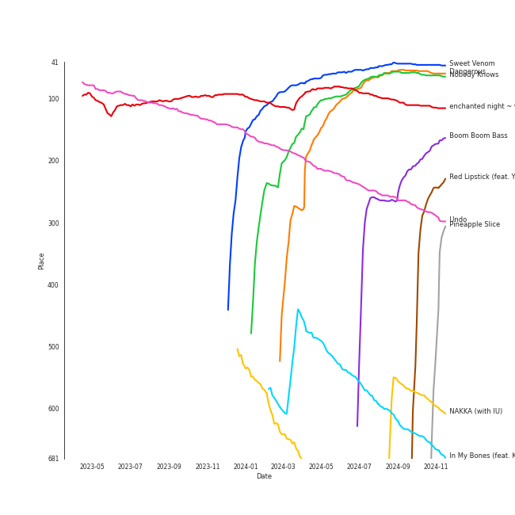
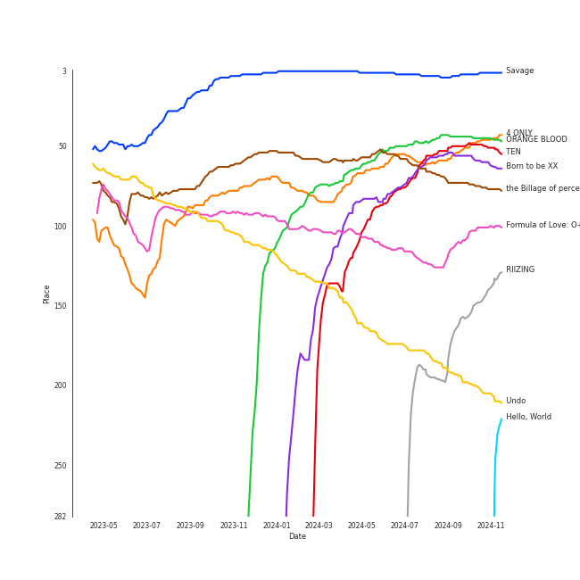
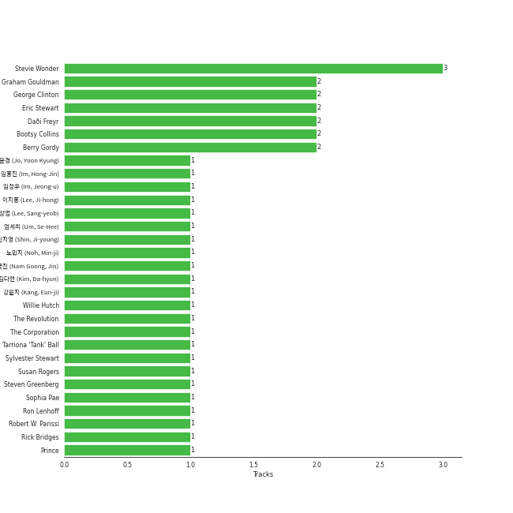

# Funk

[52 tracks (36 liked) 🔗](https://open.spotify.com/playlist/0SL2KHDmNlkSmEgOBPeJCJ)

[See Track Features](audio_features.md)

[See Clusters](clusters/overview.md)

## Top Artists

| Art | Rank | Tracks | 💚 | Artist | 🔗 |
|:---|---:|---:|---:|:---|:---|
|  | 146 | 4 | 3 | Stevie Wonder | [🔗](https://open.spotify.com/artist/7guDJrEfX3qb6FEbdPA5qi) |
|  | 405 | 3 | 3 | Daði Freyr | [🔗](https://open.spotify.com/artist/3Hb64DQZIhDCgyHKrzBXOL) |
|  | 266 | 2 | 2 | 10cc | [🔗](https://open.spotify.com/artist/6i6WlGzQtXtz7GcC5H5st5) |
|  | 20 | 2 | 2 | [Billlie](../../artists/billlie/overview.md) | [🔗](https://open.spotify.com/artist/2GQxKDojobwBjZMPf7aoh0) |
|  | 405 | 2 | 1 | James Brown | [🔗](https://open.spotify.com/artist/7GaxyUddsPok8BuhxN6OUW) |
|  | 405 | 2 | 1 | Parliament | [🔗](https://open.spotify.com/artist/5SMVzTJyKFJ7TUb46DglcH) |
|  | 172 | 2 | 1 | The Jackson 5 | [🔗](https://open.spotify.com/artist/2iE18Oxc8YSumAU232n4rW) |
|  | 366 | 2 | 1 | The Fearless Flyers | [🔗](https://open.spotify.com/artist/1JyLSGXC3aWzjY6ZdxvIXh) |
|  | 9 | 1 | 1 | [TWICE](../../artists/twice/overview.md) | [🔗](https://open.spotify.com/artist/7n2Ycct7Beij7Dj7meI4X0) |
|  | 11 | 1 | 1 | [LeeHi](../../artists/leehi/overview.md) | [🔗](https://open.spotify.com/artist/7cVZApDoQZpS447nHTsNqu) |

See all 46 artists

| Art | Rank | Tracks | 💚 | Artist | 🔗 |
|:---|---:|---:|---:|:---|:---|
|  | 181 | 1 | 1 | [VIVIZ](../../artists/viviz/overview.md) | [🔗](https://open.spotify.com/artist/7Lq3yAtwi0Z7zpxEwbQQNZ) |
|  | 86 | 1 | 1 | [Kimbra](../../artists/kimbra/overview.md) | [🔗](https://open.spotify.com/artist/6hk7Yq1DU9QcCCrz9uc0Ti) |
|  | 1 | 1 | 1 | [aespa](../../artists/aespa/overview.md) | [🔗](https://open.spotify.com/artist/6YVMFz59CuY7ngCxTxjpxE) |
|  | 405 | 1 | 1 | Silk Sonic | [🔗](https://open.spotify.com/artist/6PvvGcCY2XtUcSRld1Wilr) |
|  | 65 | 1 | 1 | [AKMU](../../artists/akmu/overview.md) | [🔗](https://open.spotify.com/artist/6OwKE9Ez6ALxpTaKcT5ayv) |
|  | 7 | 1 | 1 | [ENHYPEN](../../artists/enhypen/overview.md) | [🔗](https://open.spotify.com/artist/5t5FqBwTcgKTaWmfEbwQY9) |
|  | 405 | 1 | 1 | Sly & The Family Stone | [🔗](https://open.spotify.com/artist/5m8H6zSadhu1j9Yi04VLqD) |
|  | 37 | 1 | 1 | [HEIZE](../../artists/heize/overview.md) | [🔗](https://open.spotify.com/artist/5dCvSnVduaFleCnyy98JMo) |
|  | 306 | 1 | 1 | Tank and The Bangas | [🔗](https://open.spotify.com/artist/5cAtakaadWHJLxmGKrKcX7) |
|  | 174 | 1 | 1 | Prince | [🔗](https://open.spotify.com/artist/5a2EaR3hamoenG9rDuVn8j) |
| | 405 | 1 | 1 | Blær | [🔗](https://open.spotify.com/artist/5W6FVpHHiRfqUU4d9FfXWZ) |
|  | 405 | 1 | 1 | Wild Cherry | [🔗](https://open.spotify.com/artist/4apX9tIeHb85yPyy4F6FJG) |
|  | 56 | 1 | 1 | [KISS OF LIFE](../../artists/kiss_of_life/overview.md) | [🔗](https://open.spotify.com/artist/4TEK9tIkcoxib4GxT3O4ky) |
|  | 405 | 1 | 1 | Earth, Wind & Fire | [🔗](https://open.spotify.com/artist/4QQgXkCYTt3BlENzhyNETg) |
|  | 405 | 1 | 1 | Funkadelic | [🔗](https://open.spotify.com/artist/450o9jw6AtiQlQkHCdH6Ru) |
|  | 405 | 1 | 1 | Anderson .Paak | [🔗](https://open.spotify.com/artist/3jK9MiCrA42lLAdMGUZpwa) |
|  | 50 | 1 | 1 | [TEN](../../artists/ten/overview.md) | [🔗](https://open.spotify.com/artist/3Q5Qep7ytrjVleNnMnntgQ) |
|  | 4 | 1 | 1 | [IU](../../artists/iu/overview.md) | [🔗](https://open.spotify.com/artist/3HqSLMAZ3g3d5poNaI7GOU) |
|  | 405 | 1 | 1 | LaBelle | [🔗](https://open.spotify.com/artist/3DznKagEU8yMQZR9z33Da5) |
|  | 405 | 1 | 1 | DKZ | [🔗](https://open.spotify.com/artist/31eyTcfjAke5hFX3az3nRE) |
|  | 88 | 1 | 1 | RIIZE | [🔗](https://open.spotify.com/artist/2jOm3cYujQx6o1dxuiuqaX) |
|  | 164 | 1 | 1 | Moon Byul | [🔗](https://open.spotify.com/artist/1eTft3tXynrKdo6XD7QHLL) |
|  | 223 | 1 | 1 | YOON MIRAE | [🔗](https://open.spotify.com/artist/1Do4bSzfUl0KWL9r1fITu0) |
|  | 405 | 1 | 1 | Lipps Inc. | [🔗](https://open.spotify.com/artist/0lwRI7lvmlRY5DiA5Xa6wQ) |
|  | 90 | 1 | 1 | [Bruno Mars](../../artists/bruno_mars/overview.md) | [🔗](https://open.spotify.com/artist/0du5cEVh5yTK9QJze8zA0C) |
|  | 43 | 1 | 1 | [Jacob Collier](../../artists/jacob_collier/overview.md) | [🔗](https://open.spotify.com/artist/0QWrMNukfcVOmgEU0FEDyD) |
|  | 405 | 1 | 1 | Rick James | [🔗](https://open.spotify.com/artist/0FrpdcVlJQqibaz5HfBUrL) |
|  | 291 | 3 | 0 | Marvin Gaye | [🔗](https://open.spotify.com/artist/3koiLjNrgRTNbOwViDipeA) |
|  | 286 | 2 | 0 | Thundercat | [🔗](https://open.spotify.com/artist/4frXpPxQQZwbCu3eTGnZEw) |
|  | 405 | 1 | 0 | Tammi Terrell | [🔗](https://open.spotify.com/artist/75jNCko3SnEMI5gwGqrbb8) |
|  | 405 | 1 | 0 | Hot Chocolate | [🔗](https://open.spotify.com/artist/72VzFto8DYvKHocaHYNWSi) |
|  | 405 | 1 | 0 | Commodores | [🔗](https://open.spotify.com/artist/6twIAGnYuIT1pncMAsXnEm) |
|  | 405 | 1 | 0 | Deniece Williams | [🔗](https://open.spotify.com/artist/5jNGQ7VOU87x5402JjhTtd) |
|  | 163 | 1 | 0 | [Michael Jackson](../../artists/michael_jackson/overview.md) | [🔗](https://open.spotify.com/artist/3fMbdgg4jU18AjLCKBhRSm) |
|  | 405 | 1 | 0 | Kool & The Gang | [🔗](https://open.spotify.com/artist/3VNITwohbvU5Wuy5PC6dsI) |
|  | 405 | 1 | 0 | James Brown & The Famous Flames | [🔗](https://open.spotify.com/artist/32r72WOqqRO1DtSznId7Lr) |

## Top Tracks

Most and least listened tracks

| Rank | ​ | Most listened tracks | Rank | ​​ | Least listened tracks |
|---:|:---|:---|---:|:---|:---|
| 53 |  | [Sweet Venom](../../artists/enhypen/overview.md) | 874 |  | Ain't No Mountain High Enough |
| 80 |  | [Nobody Knows](../../artists/kiss_of_life/overview.md) | 874 |  | [Red Lipstick (feat. Yoonmirae)](../../artists/leehi/overview.md) |
| 83 |  | [Dangerous](../../artists/ten/overview.md) | 874 |  | Them Changes |
| 92 |  | [enchanted night ~ white night](../../artists/billlie/overview.md) | 874 |  | Thank You (Falettinme Be Mice Elf Agin) - Single Version |
| 223 |  | [Undo](../../artists/heize/overview.md) | 874 |  | You Sexy Thing |
| 437 |  | Boom Boom Bass | 874 |  | Kiss |
| 563 |  | [In My Bones (feat. Kimbra & Tank and The Bangas)](../../artists/jacob_collier/overview.md) | 874 |  | Let's Get It On |
| 615 |  | [nevertheless](../../artists/billlie/overview.md) | 874 |  | Play That Funky Music |
| 693 |  | TOUCHIN&MOVIN | 874 |  | I Got You (I Feel Good) |
| 762 |  | Nate Smith Is the Ace of Aces | 874 |  | Brick House |

## Top Albums

| Art | Rank | Tracks | 💚 | Album | Release Date | 🔗 |
|:---|---:|---:|---:|:---|:---|:---|
|  | 59 | 2 | 2 | the Billage of perception: chapter three | 2023-03-28 | [🔗](https://open.spotify.com/album/5bt0sTLia4il2rIlpqUo5g) |
|  | 586 | 2 | 1 | Star Time | 1991-01-01 | [🔗](https://open.spotify.com/album/2yuTyv0L51qvYuI5RIktlA) |
|  | 586 | 1 | 1 | Young Soul Rebels (Original Soundtrack) [Digitally Remastered] | 2015-05-05 | [🔗](https://open.spotify.com/album/68VvPqFOLXUtnn8NfrQpIe) |
|  | 586 | 1 | 1 | Wild Cherry | 1976 | [🔗](https://open.spotify.com/album/27ompw8zlrCkWMacS21ysX) |
|  | 164 | 1 | 1 | Undo | 2022-06-30 | [🔗](https://open.spotify.com/album/2xR7YEyRweqClzs50bbW3J) |
|  | 586 | 1 | 1 | Think About Things | 2020-04-09 | [🔗](https://open.spotify.com/album/5gEUjiNfaVse6oloI0c6Vt) |
|  | 586 | 1 | 1 | The Definitive Collection | 2002-10-29 | [🔗](https://open.spotify.com/album/4E1itnJOhTMRSATNaxh0Sq) |
|  | 586 | 1 | 1 | The 3rd Mini Album 'VarioUS' | 2023-01-31 | [🔗](https://open.spotify.com/album/2XZJWoPAW0Ah1msTIFXFSt) |
|  | 586 | 1 | 1 | That's The Way Of The World | 1975-03-15 | [🔗](https://open.spotify.com/album/5tXZfxvr2VaWibD74nw8VL) |
|  | 284 | 1 | 1 | Taste of Love | 2021-06-11 | [🔗](https://open.spotify.com/album/00vb6sViDbJLmLLchfbRh4) |

See all 50 albums

| Art | Rank | Tracks | 💚 | Album | Release Date | 🔗 |
|:---|---:|---:|---:|:---|:---|:---|
|  | 513 | 1 | 1 | Tailwinds | 2020-07-24 | [🔗](https://open.spotify.com/album/6qPLq4JNIUi0BEj1OHwEkg) |
|  | 75 | 1 | 1 | TEN - The 1st Mini Album | 2024-02-13 | [🔗](https://open.spotify.com/album/50Zo1vf3YCQtXLUZr2oBiQ) |
|  | 586 | 1 | 1 | Söngvakeppnin 2020 | 2020-01-18 | [🔗](https://open.spotify.com/album/32ypMgv8eQ7ACVd2uBaPG7) |
|  | 586 | 1 | 1 | Street Songs (Deluxe Edition) | 1981-04-07 | [🔗](https://open.spotify.com/album/2DBFUBBqJQvfXpodPi2WP5) |
|  | 466 | 1 | 1 | Starlit of Muse | 2024-02-20 | [🔗](https://open.spotify.com/album/1YtCxUGiarZVukgAm2x5RZ) |
|  | 586 | 1 | 1 | Signed, Sealed And Delivered | 1970-08-07 | [🔗](https://open.spotify.com/album/54ootLtDyMZFr9obtWQvvO) |
|  | 5 | 1 | 1 | Savage - The 1st Mini Album | 2021-10-05 | [🔗](https://open.spotify.com/album/3vyyDkvYWC36DwgZCYd3Wu) |
|  | 314 | 1 | 1 | RIIZING - The 1st Mini Album | 2024-06-17 | [🔗](https://open.spotify.com/album/23TA2tnqYnphv1MKkiS6x2) |
|  | 586 | 1 | 1 | Parade - Music from the Motion Picture Under the Cherry Moon | 1986-03-31 | [🔗](https://open.spotify.com/album/54DjkEN3wdCQgfCTZ9WjdB) |
|  | 50 | 1 | 1 | ORANGE BLOOD | 2023-11-17 | [🔗](https://open.spotify.com/album/7dsAlxH9cMgyREm8OLdWWT) |
|  | 586 | 1 | 1 | Nightbirds | 1974-09-13 | [🔗](https://open.spotify.com/album/5Zx4eUC5dTg6aufiSLQ6uo) |
|  | 549 | 1 | 1 | NEXT EPISODE | 2021-07-26 | [🔗](https://open.spotify.com/album/0Pt0eGpyNO5dDN8PORypSy) |
|  | 586 | 1 | 1 | Mouth To Mouth | 1979-11-01 | [🔗](https://open.spotify.com/album/1SMBOCE8CFqxr2EB92Asqh) |
|  | 586 | 1 | 1 | Mothership Connection | 1975-12-15 | [🔗](https://open.spotify.com/album/4q1HNSka8CzuLvC8ydcsD2) |
|  | 586 | 1 | 1 | LUPIN | 2020-03-15 | [🔗](https://open.spotify.com/album/361AnnYEYLl0Z7zF7Xo0Dq) |
|  | 586 | 1 | 1 | Innervisions | 1973-08-03 | [🔗](https://open.spotify.com/album/5jgI8Eminx9MmLBontDWq8) |
|  | 586 | 1 | 1 | Greatest Hits | 1970-11-21 | [🔗](https://open.spotify.com/album/0UM9SydcBtsklCTFgGLvcT) |
|  | 228 | 1 | 1 | Djesse Vol. 3 | 2020-08-14 | [🔗](https://open.spotify.com/album/33cj3kzLqVOg9zvy69Wrc8) |
|  | 586 | 1 | 1 | Diana Ross Presents The Jackson 5 | 1969-12-18 | [🔗](https://open.spotify.com/album/51uoKRa8vT5SULrlF8s2t1) |
|  | 586 | 1 | 1 | Deceptive Bends | 1977 | [🔗](https://open.spotify.com/album/6D3RQD5AQZ4P2aDzsZmBI4) |
|  | 76 | 1 | 1 | Born to be XX | 2023-11-08 | [🔗](https://open.spotify.com/album/6yDtQxvq1XRC7Y5qtS03Xx) |
|  | 586 | 1 | 1 | Bloody Tourists | 1978 | [🔗](https://open.spotify.com/album/3MecVG0PeBObAhjwEAczFG) |
|  | 586 | 1 | 1 | An Evening With Silk Sonic | 2021-11-11 | [🔗](https://open.spotify.com/album/1YgekJJTEueWDaMr7BYqPk) |
|  | 54 | 1 | 1 | 4 ONLY | 2021-09-09 | [🔗](https://open.spotify.com/album/1DKgZeAYrjslAPZVMe6EFt) |
|  | 586 | 1 | 1 | & Co. | 2019-06-12 | [🔗](https://open.spotify.com/album/4pS7NXSZNbvREVxKkOge3I) |
|  | 586 | 1 | 0 | Wild And Peaceful | 1973-09 | [🔗](https://open.spotify.com/album/3MRgojA0LfPka4RG7aRjsI) |
|  | 586 | 1 | 0 | United | 1967-08-29 | [🔗](https://open.spotify.com/album/5LqviduT0g0J0ypFrFSwCE) |
|  | 586 | 1 | 0 | Third Album | 1970-09-08 | [🔗](https://open.spotify.com/album/5d6X8oegJmu9XKn9UBAswG) |
|  | 586 | 1 | 0 | The Fearless Flyers | 2018-03-30 | [🔗](https://open.spotify.com/album/2GEQWuTviG5lXO66aiOYqt) |
|  | 586 | 1 | 0 | Off the Wall | 1979-08-10 | [🔗](https://open.spotify.com/album/2ZytN2cY4Zjrr9ukb2rqTP) |
|  | 586 | 1 | 0 | Let's Hear It for the Boy (Expanded Edition) | 1984-04-16 | [🔗](https://open.spotify.com/album/5SQ28k8Esr8yY55ZKvgC5u) |
|  | 586 | 1 | 0 | Let's Get It On | 1973-08-28 | [🔗](https://open.spotify.com/album/1oIICL75sMuInkEhX8jj3b) |
|  | 586 | 1 | 0 | It Is What It Is | 2020-04-03 | [🔗](https://open.spotify.com/album/59GRmAvlGs7KjLizFnV7Y9) |
|  | 586 | 1 | 0 | In The Groove | 1968-08-26 | [🔗](https://open.spotify.com/album/36VMWZPLjg9rucvMxdA2Pz) |
|  | 586 | 1 | 0 | I Got You (I Feel Good) | 1966-02-01 | [🔗](https://open.spotify.com/album/5UqTOjkfRMzkORwpeOWtt3) |
|  | 586 | 1 | 0 | Hot Chocolate | 1975 | [🔗](https://open.spotify.com/album/10oMdAuUD0Tcc4BowCWUni) |
|  | 586 | 1 | 0 | Funkentelechy Vs. The Placebo Syndrome | 1977-11-28 | [🔗](https://open.spotify.com/album/7Kv0H0XMdIyRs41a6USzrd) |
|  | 586 | 1 | 0 | For Once In My Life | 1968-12-01 | [🔗](https://open.spotify.com/album/3pPBbp1Nl9n1AM9xFpdKtZ) |
|  | 586 | 1 | 0 | Drunk | 2017-02-24 | [🔗](https://open.spotify.com/album/7vHBQDqwzB7uDvoE5bncMM) |
|  | 586 | 1 | 0 | Commodores | 1977-01-01 | [🔗](https://open.spotify.com/album/2tzbNCAUTmW4MIM2Ulvrwl) |

## Top Record Labels

| Tracks | 💚 | Label |
|---:|---:|:---|
| 11 | 5 | [MOTOWN](../../labels/motown/overview.md) |
| 5 | 3 | [UNI](../../labels/uni/overview.md) |
| 4 | 3 | [Epic](../../labels/epic/overview.md) |
| 3 | 3 | [SM Entertainment](../../labels/sm_entertainment/overview.md) |
| 2 | 2 | [Stone Music Entertainment](../../labels/stone_music_entertainment/overview.md) |
| 2 | 2 | Samlist |
| 2 | 2 | [MYSTIC STORY](../../labels/mystic_story/overview.md) |
| 2 | 2 | [Genie Music Corporation](../../labels/genie_music_corporation/overview.md) |
| 2 | 2 | [EMI](../../labels/emi/overview.md) |
| 3 | 1 | [Universal Music LLC](../../labels/universal_music_llc/overview.md) |

See all 36 labels

| Tracks | 💚 | Label |
|---:|---:|:---|
| 2 | 1 | Vulf Records |
| 2 | 1 | [Legacy](../../labels/legacy/overview.md) |
| 2 | 1 | Island Def Jam |
| 2 | 1 | [Columbia](../../labels/columbia/overview.md) |
| 1 | 1 | ㈜ 동요엔터테인먼트 |
| 1 | 1 | [YG Entertainment](../../labels/yg_entertainment/overview.md) |
| 1 | 1 | [Warner Records](../../labels/warner_records/overview.md) |
| 1 | 1 | SWING ENTERTAINMENT |
| 1 | 1 | [S2 ENTERTAINMENT INC.](../../labels/s2_entertainment_inc_/overview.md) |
| 1 | 1 | Ríkisútvarpið - Exclusively distributed by Alda Music |
| 1 | 1 | [Republic Records](../../labels/republic_records/overview.md) |
| 1 | 1 | [RCA Records Label](../../labels/rca_records_label/overview.md) |
| 1 | 1 | [RBW Inc.](../../labels/rbw_inc_/overview.md) |
| 1 | 1 | [Polydor Records](../../labels/polydor_records/overview.md) |
| 1 | 1 | Essential Media Group |
| 1 | 1 | Def Jam West |
| 1 | 1 | [Decca (UMO)](../../labels/decca_(umo)/overview.md) |
| 1 | 1 | Conscious Manifesto |
| 1 | 1 | BIGPLANETMADE |
| 1 | 1 | [BELIFT LAB](../../labels/belift_lab/overview.md) |
| 1 | 1 | [Atlantic Records](../../labels/atlantic_records/overview.md) |
| 1 | 1 | Aftermath Entertainment |
| 2 | 0 | Brainfeeder |
| 1 | 0 | [Parlophone UK](../../labels/parlophone_uk/overview.md) |
| 1 | 0 | Mercury Records |
| 1 | 0 | Island Mercury |

## Genres

| Tracks | 💚 | Genre |
|---:|---:|:---|
| 22 | 10 | [soul](../../genres/soul/overview.md) |
| 9 | 9 | [k-pop](../../genres/k-pop/overview.md) |
| 16 | 7 | motown |
| 12 | 7 | funk |
| 9 | 5 | disco |
| 6 | 5 | funk rock |
| 5 | 4 | p funk |
| 4 | 4 | [k-pop girl group](../../genres/k-pop_girl_group/overview.md) |
| 7 | 3 | classic soul |
| 3 | 3 | sunnlensk tonlist |

See all 46 genres

| Tracks | 💚 | Genre |
|---:|---:|:---|
| 3 | 3 | icelandic pop |
| 7 | 2 | quiet storm |
| 4 | 2 | [soft rock](../../genres/soft_rock/overview.md) |
| 3 | 2 | [mellow gold](../../genres/mellow_gold/overview.md) |
| 2 | 2 | yacht rock |
| 2 | 2 | synth funk |
| 2 | 2 | psychedelic soul |
| 2 | 2 | [pop](../../genres/pop/overview.md) |
| 2 | 2 | new romantic |
| 2 | 2 | minneapolis sound |
| 2 | 2 | [k-pop boy group](../../genres/k-pop_boy_group/overview.md) |
| 2 | 2 | glam rock |
| 2 | 2 | [classic rock](../../genres/classic_rock/overview.md) |
| 2 | 2 | [art rock](../../genres/art_rock/overview.md) |
| 2 | 2 | [album rock](../../genres/album_rock/overview.md) |
| 2 | 2 | [5th gen k-pop](../../genres/5th_gen_k-pop/overview.md) |
| 4 | 1 | afrofuturism |
| 2 | 1 | [vocal jazz](../../genres/vocal_jazz/overview.md) |
| 2 | 1 | instrumental funk |
| 1 | 1 | [uk alternative pop](../../genres/uk_alternative_pop/overview.md) |
| 1 | 1 | synthpop |
| 1 | 1 | southern soul |
| 1 | 1 | [rock](../../genres/rock/overview.md) |
| 1 | 1 | [korean r&b](../../genres/korean_r_b/overview.md) |
| 1 | 1 | [korean pop](../../genres/korean_pop/overview.md) |
| 1 | 1 | jazz funk |
| 1 | 1 | [dance pop](../../genres/dance_pop/overview.md) |
| 1 | 1 | [anime](../../genres/anime/overview.md) |
| 3 | 0 | northern soul |
| 3 | 0 | neo soul |
| 2 | 0 | indie soul |
| 1 | 0 | [urban contemporary](../../genres/urban_contemporary/overview.md) |
| 1 | 0 | [r&b](../../genres/r_b/overview.md) |
| 1 | 0 | post-disco |
| 1 | 0 | contemporary r&b |
| 1 | 0 | [adult standards](../../genres/adult_standards/overview.md) |

## Top Producers

| Art | Producer | Tracks | Credit Types |
|:---|:---|---:|:---|
|  | Stevie Wonder | 3 | Arranger, Lyricist, Producer, Songwriter |
| | Eric Stewart | 2 | Producer, Songwriter |
|  | Daði Freyr | 2 | Lyricist, Songwriter |
| | Graham Gouldman | 2 | Producer, Songwriter |
|  | Bootsy Collins | 2 | Songwriter |
| | George Clinton | 2 | Songwriter, Producer |
| | Berry Gordy | 2 | Songwriter |
|  | Prince | 1 | Lyricist, Producer, Songwriter |
| | Adam von Mentzer | 1 | Songwriter |
| | Bob Crewe | 1 | Songwriter |

View all

| Art | Producer | Tracks | Credit Types |
|:---|:---|---:|:---|
| | 남궁진 (Nam Goong, Jin) | 1 | Producer |
| | Jerome Brailey | 1 | Songwriter |
| | Peggy McCreary | 1 | Producer |
| | David Leonard | 1 | Producer |
| | Coke Johnson | 1 | Producer |
| | Steven Greenberg | 1 | Lyricist, Songwriter |
|  | Marvin Gaye | 1 | Producer, Songwriter |
|  | [Bruno Mars](../../artists/bruno_mars/overview.md) | 1 | Producer, Songwriter |
| | 노민지 (Noh, Min-ji) | 1 | Producer |
| | David Dahlquist | 1 | Arranger, Songwriter |
| | Robert W. Parissi | 1 | Lyricist, Songwriter |
| | Tarriona 'Tank' Ball | 1 | Songwriter |
| | Hal Davis | 1 | Songwriter |
| | Rick Bridges | 1 | Lyricist |
| | Fonce Mizell | 1 | Songwriter |
|  | [Kimbra](../../artists/kimbra/overview.md) | 1 | Songwriter |
| | Freddie Perren | 1 | Songwriter |
| | Philip Bailey | 1 | Songwriter |
|  | 10cc | 1 | Producer |
| | Bobby Byrd | 1 | Songwriter |
| | Patrick Morrissey | 1 | Arranger, Songwriter |
| | IMLAY | 1 | Arranger |
| | Allen Toussaint | 1 | Arranger, Producer |
| | Paul Phamous | 1 | Songwriter |
| | Bernie Worrell | 1 | Songwriter |
| | Maurice White | 1 | Producer, Songwriter |
| | PAPRIKAA | 1 | Arranger, Songwriter |
| | Leo Sacks | 1 | Producer |
| | Big Sean | 1 | Songwriter |
| | Susan Rogers | 1 | Producer |
| | The Revolution | 1 | Producer |
|  | [Jacob Collier](../../artists/jacob_collier/overview.md) | 1 | Arranger, Producer, Songwriter |
|  | James Brown | 1 | Producer, Songwriter |
| | Boo Mitchell | 1 | Producer |
| | David Z. | 1 | Arranger, Producer |
| | The Corporation | 1 | Producer |
| | Marcus Lomax | 1 | Songwriter |
| | Ben Bloomberg | 1 | Producer |
| | Ron Lenhoff | 1 | Songwriter |
| | Hayley Kiyoko | 1 | Songwriter |
| | Sylvester Stewart | 1 | Lyricist, Songwriter |
| | 이지홍 (Lee, Ji-hong) | 1 | Producer |
| | Kenny Nolan | 1 | Songwriter |
| | Ed Townsend | 1 | Producer, Songwriter |
| | James Fauntleroy | 1 | Songwriter |
| | David Tickle | 1 | Producer |
| | Julie Han | 1 | Lyricist |
| | D'Mile | 1 | Producer, Songwriter |
| | Paul Klingberg | 1 | Producer |
| | 강은지 (Kang, Eun-ji) | 1 | Producer |
| | Bob West | 1 | Songwriter |
| | 임정우 (Im, Jeong-u) | 1 | Songwriter |
| | Brandon Paak Anderson | 1 | Songwriter |
| | Deke Richards | 1 | Songwriter |
|  | ADORA | 1 | Songwriter |
| | [조윤경 (Jo, Yoon Kyung)](../../producers/조윤경_(jo,_yoon_kyung)/overview.md) | 1 | Lyricist |
| | Willie Hutch | 1 | Songwriter |
| | Jim Vitti | 1 | Producer |
| | Larry Dunn | 1 | Songwriter |
| | Ellie Suh | 1 | Lyricist |

## Years

| ​ | 10 newest albums | ​​ | 10 oldest albums |
|:---|:---|:---|:---|
|  | RIIZING - The 1st Mini Album (2024-06-17) |  | I Got You (I Feel Good) (1966-02-01) |
|  | Starlit of Muse (2024-02-20) |  | United (1967-08-29) |
|  | TEN - The 1st Mini Album (2024-02-13) |  | In The Groove (1968-08-26) |
|  | ORANGE BLOOD (2023-11-17) |  | For Once In My Life (1968-12-01) |
|  | Born to be XX (2023-11-08) |  | Diana Ross Presents The Jackson 5 (1969-12-18) |
|  | the Billage of perception: chapter three (2023-03-28) |  | Signed, Sealed And Delivered (1970-08-07) |
|  | The 3rd Mini Album 'VarioUS' (2023-01-31) |  | Third Album (1970-09-08) |
|  | Undo (2022-06-30) |  | Greatest Hits (1970-11-21) |
|  | An Evening With Silk Sonic (2021-11-11) |  | Innervisions (1973-08-03) |
|  | Savage - The 1st Mini Album (2021-10-05) |  | Let's Get It On (1973-08-28) |