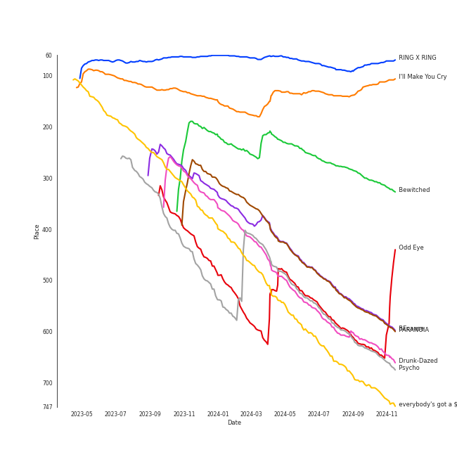

# Tracks in Halloween from 2021

## Artists

| Art | Rank | Tracks | 💚 | Artist | 🔗 |
|:---|---:|---:|---:|:---|:---|
|  | 137 | 3 | 2 | PIXY | [🔗](https://open.spotify.com/artist/0CJkEzffVZLgav03xXeC9s) |
|  | 218 | 2 | 2 | PinkFantasy | [🔗](https://open.spotify.com/artist/5syu5kN4a5f4rgMCRGlnZp) |
|  | 28 | 2 | 2 | [Dreamcatcher](../../../artists/dreamcatcher/overview.md) | [🔗](https://open.spotify.com/artist/5V1qsQHdXNm4ZEZHWvFnqQ) |
|  | 22 | 2 | 2 | [Billlie](../../../artists/billlie/overview.md) | [🔗](https://open.spotify.com/artist/2GQxKDojobwBjZMPf7aoh0) |
|  | 30 | 1 | 1 | [NCT 127](../../../artists/nct_127/overview.md) | [🔗](https://open.spotify.com/artist/7f4ignuCJhLXfZ9giKT7rH) |
|  | 1 | 1 | 1 | [aespa](../../../artists/aespa/overview.md) | [🔗](https://open.spotify.com/artist/6YVMFz59CuY7ngCxTxjpxE) |
|  | 29 | 1 | 1 | [JEON SOYEON](../../../artists/jeon_soyeon/overview.md) | [🔗](https://open.spotify.com/artist/6Xg22wJOAcnvPUfk5WvODH) |
|  | 306 | 1 | 1 | KANGDANIEL | [🔗](https://open.spotify.com/artist/5vGoWnZO65NBgiZYBmi3iW) |
|  | 7 | 1 | 1 | [ENHYPEN](../../../artists/enhypen/overview.md) | [🔗](https://open.spotify.com/artist/5t5FqBwTcgKTaWmfEbwQY9) |
|  | 435 | 1 | 1 | EUNHA | [🔗](https://open.spotify.com/artist/4MLK9Hhz7UhxAzU2awoLxk) |

View all

| Art | Rank | Tracks | 💚 | Artist | 🔗 |
|:---|---:|---:|---:|:---|:---|
|  | 435 | 1 | 1 | ADORA | [🔗](https://open.spotify.com/artist/3M1kgHOpPruu1uBymBHF3r) |
|  | 435 | 1 | 0 | HOSHI | [🔗](https://open.spotify.com/artist/6nWKAdMv1BDq1zHfZzkdbR) |
|  | 45 | 1 | 0 | [ATEEZ](../../../artists/ateez/overview.md) | [🔗](https://open.spotify.com/artist/68KmkJeZGfwe1OUaivBa2L) |
|  | 52 | 1 | 0 | [PURPLE KISS](../../../artists/purple_kiss/overview.md) | [🔗](https://open.spotify.com/artist/62T5PGHWJ9sxP2SJq20IHq) |
|  | 435 | 1 | 0 | GWSN | [🔗](https://open.spotify.com/artist/5fI4xffqGRGQvICSlJreMF) |
|  | 435 | 1 | 0 | E'LAST | [🔗](https://open.spotify.com/artist/0NztgA9b1KEJLjLVqMwd9y) |

## Albums

| Art | Rank | Tracks | 💚 | Album | Release Date | 🔗 |
|:---|---:|---:|---:|:---|:---|:---|
|  | 68 | 2 | 2 | the Billage of perception : chapter one | 2021-11-10 | [🔗](https://open.spotify.com/album/1kp4txZsSpDNR4EoDFi2LD) |
|  | 235 | 2 | 1 | Fairyforest : Temptation | 2021-10-07 | [🔗](https://open.spotify.com/album/3999VmQrZOafu4NjYkc0rj) |
|  | 667 | 1 | 1 | 기기괴괴 | 2021-10-31 | [🔗](https://open.spotify.com/album/296fyWl3wGRk4pB7sbaAwx) |
|  | 404 | 1 | 1 | [Summer Holiday] | 2021-07-30 | [🔗](https://open.spotify.com/album/3dD0qCBPe7eYeaftyIKwa5) |
|  | 329 | 1 | 1 | [Dystopia : Road to Utopia] | 2021-01-26 | [🔗](https://open.spotify.com/album/1EyLcB9R1KfUV45AxtRR3V) |
|  | 667 | 1 | 1 | Wings | 2021-02-24 | [🔗](https://open.spotify.com/album/4knaQg3CtzHlA2m99NS7xW) |
|  | 28 | 1 | 1 | Windy | 2021-07-05 | [🔗](https://open.spotify.com/album/1lv92CIVZbB2BsHmIx7qJf) |
|  | 4 | 1 | 1 | Savage - The 1st Mini Album | 2021-10-05 | [🔗](https://open.spotify.com/album/3vyyDkvYWC36DwgZCYd3Wu) |
|  | 406 | 1 | 1 | PARANOIA | 2021-02-16 | [🔗](https://open.spotify.com/album/6vxwhImvm7xkbIMk0e1LVv) |
|  | 667 | 1 | 1 | MAKE U DANCE | 2021-11-05 | [🔗](https://open.spotify.com/album/1UoyICgBwsGpylrHLj5zep) |

View all

| Art | Rank | Tracks | 💚 | Album | Release Date | 🔗 |
|:---|---:|---:|---:|:---|:---|:---|
|  | 667 | 1 | 1 | Favorite - The 3rd Album Repackage | 2021-10-25 | [🔗](https://open.spotify.com/album/5LbnQtyHBfJUCigA08llHX) |
|  | 175 | 1 | 1 | BORDER : CARNIVAL | 2021-04-26 | [🔗](https://open.spotify.com/album/4LGYBcRsteiXjcPD4QQvxv) |
|  | 667 | 1 | 1 | Alice in Wonderland | 2021-06-21 | [🔗](https://open.spotify.com/album/0KFsCn3mxiaKMpobo3BRQM) |
|  | 667 | 1 | 0 | THE OTHER SIDE OF THE MOON | 2021-05-26 | [🔗](https://open.spotify.com/album/4W9vkO9c1K2oVvLTNsjWv7) |
|  | 667 | 1 | 0 | Spider | 2021-04-02 | [🔗](https://open.spotify.com/album/3PtE3yizKf8e2MzCtXU8K9) |
|  | 667 | 1 | 0 | Season Songs | 2021-08-16 | [🔗](https://open.spotify.com/album/7o5jeWeyGW3Nb77WhmVPwJ) |
|  | 667 | 1 | 0 | HIDE & SEEK | 2021-09-08 | [🔗](https://open.spotify.com/album/1Oh6STLhW6dxRAkvOUBHl8) |
|  | 667 | 1 | 0 | Dark Dream | 2021-09-29 | [🔗](https://open.spotify.com/album/3cBmKpT5vAFoND3DZidjIT) |

## Tracks

| Art | Track | Album | Artists | Label | Rank | 💚 | 🔗 |
|:---|:---|:---|:---|:---|---:|:---|:---|
|  | RING X RING | the Billage of perception : chapter one | [Billlie](../../../artists/billlie/overview.md) | [MYSTIC STORY](../../../labels/mystic_story) | 71 | 💚 | [🔗](https://open.spotify.com/track/4hfF0FOFcaiOtwY3NP5hnv) |
|  | I'll Make You Cry | Savage - The 1st Mini Album | [aespa](../../../artists/aespa/overview.md) | [SM Entertainment](../../../labels/sm_entertainment) | 108 | 💚 | [🔗](https://open.spotify.com/track/6l1dTAhX7P6EKvA11NLNuW) |
|  | Bewitched | Fairyforest : Temptation | PIXY | 올라트엔터테인먼트, 해피트라이브엔터테인먼트 | 325 | 💚 | [🔗](https://open.spotify.com/track/3iCW396ZgMwoAzi1uglI9r) |
|  | Odd Eye | [Dystopia : Road to Utopia] | [Dreamcatcher](../../../artists/dreamcatcher/overview.md) | [DREAMCATCHER COMPANY](../../../labels/dreamcatcher_company) | 465 | 💚 | [🔗](https://open.spotify.com/track/1RtlbxsPpDBsHHmGTb7ah2) |
|  | BEcause | [Summer Holiday] | [Dreamcatcher](../../../artists/dreamcatcher/overview.md) | [DREAMCATCHER COMPANY](../../../labels/dreamcatcher_company) | 597 | 💚 | [🔗](https://open.spotify.com/track/0ufYP4HLjzVSLUsGKCIQJH) |
|  | PARANOIA | PARANOIA | KANGDANIEL | KONNECT Ent. | 599 | 💚 | [🔗](https://open.spotify.com/track/1Q6lzzQHM5dvtTCwcfeKDy) |
|  | Drunk-Dazed | BORDER : CARNIVAL | [ENHYPEN](../../../artists/enhypen/overview.md) | [BELIFT LAB](../../../labels/belift_lab) | 659 | 💚 | [🔗](https://open.spotify.com/track/1wcr8DjnN59Awev8nnKpQ4) |
|  | Psycho | Windy | [JEON SOYEON](../../../artists/jeon_soyeon/overview.md) | [Universal Music LLC](../../../labels/universal_music_llc) | 673 | 💚 | [🔗](https://open.spotify.com/track/57LioO1gSll1wvPDAjiET3) |
|  | everybody's got a $ECRET | the Billage of perception : chapter one | [Billlie](../../../artists/billlie/overview.md) | [MYSTIC STORY](../../../labels/mystic_story) | 748 | 💚 | [🔗](https://open.spotify.com/track/490hT7WcJnqR69Tgb7uY2U) |
|  | Wings | Wings | PIXY | [Genie Music Corporation](../../../labels/genie_music_corporation), [Stone Music Entertainment](../../../labels/stone_music_entertainment) | 1018 | 💚 | [🔗](https://open.spotify.com/track/12jfNawkTUb40C0iQ46u3W) |

View all

| Art | Track | Album | Artists | Label | Rank | 💚 | 🔗 |
|:---|:---|:---|:---|:---|---:|:---|:---|
|  | Spider | Spider | HOSHI | [PLEDIS Entertainment](../../../labels/pledis_entertainment) | 1018 | | [🔗](https://open.spotify.com/track/2TwB7aK39tnZBQjBPgcbCj) |
|  | I Can't Breathe | THE OTHER SIDE OF THE MOON | GWSN | The WAVE MUSIC | 1018 | | [🔗](https://open.spotify.com/track/6RIYWSUxJGpcz8nnzitiwK) |
|  | Poison | Alice in Wonderland | PinkFantasy | Mydoll Ent. | 1018 | 💚 | [🔗](https://open.spotify.com/track/3nNW8DrIdNyLzNWyqfQoWw) |
|  | The Black Cat Nero | Season Songs | [ATEEZ](../../../artists/ateez/overview.md) | [KQ Entertainment, TURBO JK Company](../../../labels/kq_entertainment) | 1018 | | [🔗](https://open.spotify.com/track/5GCkHlq2lxmtSlAhiLpnjq) |
|  | Zombie | HIDE & SEEK | [PURPLE KISS](../../../artists/purple_kiss/overview.md) | [RBW Inc.](../../../labels/rbw_inc_) | 1018 | | [🔗](https://open.spotify.com/track/5zTp64MsWOTdAWWXK7zEPK) |
|  | Dark Dream | Dark Dream | E'LAST | Quarter Music | 1018 | | [🔗](https://open.spotify.com/track/6CWGueLHg5lmG43fy27oJQ) |
|  | Addicted | Fairyforest : Temptation | PIXY | 올라트엔터테인먼트, 해피트라이브엔터테인먼트 | 1018 | | [🔗](https://open.spotify.com/track/2ffVhWaUuu5IRaoogJOGFz) |
|  | Favorite (Vampire) | Favorite - The 3rd Album Repackage | [NCT 127](../../../artists/nct_127/overview.md) | [SM Entertainment](../../../labels/sm_entertainment) | 1018 | 💚 | [🔗](https://open.spotify.com/track/2R8MZR1RCP4cIJITHDPRbY) |
|  | 기기괴괴 | 기기괴괴 | PinkFantasy | 마이돌엔터테인먼트 | 1018 | 💚 | [🔗](https://open.spotify.com/track/6ZERrx4VYGplqKlydGcLMi) |
|  | MAKE U DANCE (feat. EUNHA) | MAKE U DANCE | ADORA, EUNHA | 딩고뮤직, 주식회사 오라 | 1018 | 💚 | [🔗](https://open.spotify.com/track/1vozwNInCvxQaBrc5a66eo) |

