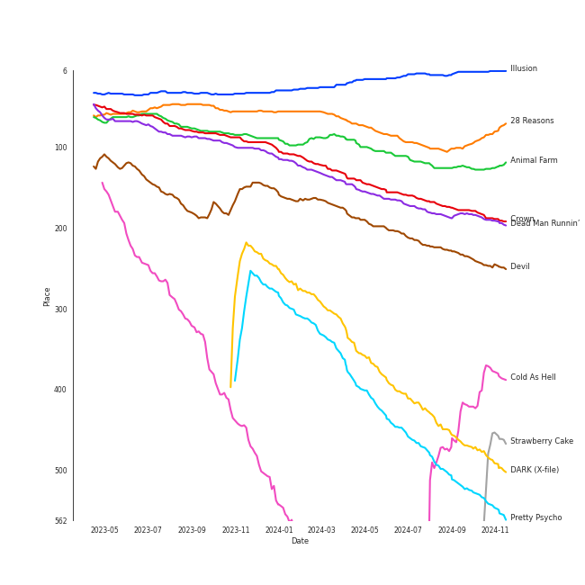

# Tracks in Halloween from 2022

## Artists

| Art | Rank | Tracks | 💚 | Artist | 🔗 |
|:---|---:|---:|---:|:---|:---|
|  | 10 | 3 | 3 | [Stray Kids](../../../artists/stray_kids/overview.md) | [🔗](https://open.spotify.com/artist/2dIgFjalVxs4ThymZ67YCE) |
|  | 35 | 3 | 3 | [SEULGI](../../../artists/seulgi/overview.md) | [🔗](https://open.spotify.com/artist/2QM5S4yO6xHgnNvF0nbZZq) |
|  | 69 | 2 | 2 | [BIBI](../../../artists/bibi/overview.md) | [🔗](https://open.spotify.com/artist/6UbmqUEgjLA6jAcXwbM1Z9) |
|  | 6 | 2 | 2 | [(G)I-DLE](../../../artists/(g)i-dle/overview.md) | [🔗](https://open.spotify.com/artist/2AfmfGFbe0A0WsTYm0SDTx) |
|  | 17 | 2 | 2 | [Girls' Generation](../../../artists/girls__generation/overview.md) | [🔗](https://open.spotify.com/artist/0Sadg1vgvaPqGTOjxu0N6c) |
|  | 126 | 2 | 1 | PIXY | [🔗](https://open.spotify.com/artist/0CJkEzffVZLgav03xXeC9s) |
|  | 92 | 1 | 1 | MAX CHANGMIN | [🔗](https://open.spotify.com/artist/7FiAkNWMb6ZBYI8tbQLuIS) |
|  | 1 | 1 | 1 | [aespa](../../../artists/aespa/overview.md) | [🔗](https://open.spotify.com/artist/6YVMFz59CuY7ngCxTxjpxE) |
|  | 208 | 1 | 1 | PinkFantasy | [🔗](https://open.spotify.com/artist/5syu5kN4a5f4rgMCRGlnZp) |
|  | 8 | 1 | 1 | [TAEYEON](../../../artists/taeyeon/overview.md) | [🔗](https://open.spotify.com/artist/3qNVuliS40BLgXGxhdBdqu) |

View all

| Art | Rank | Tracks | 💚 | Artist | 🔗 |
|:---|---:|---:|---:|:---|:---|
|  | 117 | 1 | 1 | Kim Petras | [🔗](https://open.spotify.com/artist/3Xt3RrJMFv5SZkCfUE8C1J) |
|  | 53 | 1 | 1 | HYO | [🔗](https://open.spotify.com/artist/3U7bOaJLuFkrmDQ1C1OqKl) |
|  | 409 | 1 | 1 | CRAXY | [🔗](https://open.spotify.com/artist/3C13AlJZ4QWHSruAWe9VPI) |
|  | 409 | 1 | 1 | Sam Smith | [🔗](https://open.spotify.com/artist/2wY79sveU1sp5g7SokKOiI) |
|  | 394 | 1 | 1 | Seori | [🔗](https://open.spotify.com/artist/2bWTIIQP9zaVc55RaMGu7e) |
|  | 2 | 1 | 1 | [Red Velvet](../../../artists/red_velvet/overview.md) | [🔗](https://open.spotify.com/artist/1z4g3DjTBBZKhvAroFlhOM) |
|  | 375 | 1 | 1 | Xdinary Heroes | [🔗](https://open.spotify.com/artist/1khChLj7REGqjM043PlYyn) |
|  | 60 | 1 | 0 | [PURPLE KISS](../../../artists/purple_kiss/overview.md) | [🔗](https://open.spotify.com/artist/62T5PGHWJ9sxP2SJq20IHq) |
|  | 409 | 1 | 0 | BVNDIT | [🔗](https://open.spotify.com/artist/5dEBuZjTtE68uDgCs23Kuv) |

## Albums

| Art | Rank | Tracks | 💚 | Album | Release Date | 🔗 |
|:---|---:|---:|---:|:---|:---|:---|
|  | 63 | 3 | 3 | 28 Reasons - The 1st Mini Album | 2022-10-04 | [🔗](https://open.spotify.com/album/1t5a29WYbJj83iy3RNICHw) |
|  | 331 | 2 | 2 | ODDINARY | 2022-03-18 | [🔗](https://open.spotify.com/album/0Gmf4pfe0POEQq2FgGAj2q) |
|  | 94 | 2 | 2 | Lowlife Princess: Noir | 2022-11-18 | [🔗](https://open.spotify.com/album/0AwCgoJKJUOgLp1imhnxuH) |
|  | 597 | 2 | 2 | FOREVER 1 - The 7th Album | 2022-08-05 | [🔗](https://open.spotify.com/album/3CcgnUkTrUaPTt4Ms1MkoP) |
|  | 597 | 2 | 1 | REBORN | 2022-06-15 | [🔗](https://open.spotify.com/album/6kp9dsLnll5WEiBlBUwBME) |
|  | 597 | 1 | 1 | Unholy (feat. Kim Petras) | 2022-09-22 | [🔗](https://open.spotify.com/album/0gX9tkL5njRax8ymWcXARi) |
|  | 148 | 1 | 1 | SKZ-REPLAY | 2022-12-21 | [🔗](https://open.spotify.com/album/3UXrliH0JUQvcaLnBD8Txz) |
|  | 572 | 1 | 1 | Remarriage and Desires (Original Soundtrack from The Netflix Series) | 2022-07-15 | [🔗](https://open.spotify.com/album/2YM9Oahck5kVuWGiFQK1dg) |
|  | 597 | 1 | 1 | Poison Rose | 2022-11-10 | [🔗](https://open.spotify.com/album/7MfxSqUuOU0JfoafaA2L3H) |
|  | 38 | 1 | 1 | INVU - The 3rd Album | 2022-02-14 | [🔗](https://open.spotify.com/album/7i2YLTVQ0dyngRuUqtGmr9) |

View all

| Art | Rank | Tracks | 💚 | Album | Release Date | 🔗 |
|:---|---:|---:|---:|:---|:---|:---|
|  | 90 | 1 | 1 | I love | 2022-10-17 | [🔗](https://open.spotify.com/album/2Hyuin3i1cSZ1FlQFeCPZH) |
|  | 149 | 1 | 1 | I NEVER DIE | 2022-03-14 | [🔗](https://open.spotify.com/album/1T2W9vDajFreUuycPDjUXk) |
|  | 597 | 1 | 1 | Hello, world! | 2022-07-20 | [🔗](https://open.spotify.com/album/5zjnlpEemkmaN6iv16vmDm) |
|  | 13 | 1 | 1 | Girls - The 2nd Mini Album | 2022-07-08 | [🔗](https://open.spotify.com/album/4w1dbvUy1crv0knXQvcSeY) |
|  | 159 | 1 | 1 | Devil - The 2nd Mini Album | 2022-01-13 | [🔗](https://open.spotify.com/album/6bG2rY8NzT7dIzUNADDNCR) |
|  | 597 | 1 | 1 | DEEP - The 1st Mini Album | 2022-05-16 | [🔗](https://open.spotify.com/album/2qa6E3bEJ5OqwVgbfWOeF4) |
|  | 330 | 1 | 1 | Bloom | 2022-04-06 | [🔗](https://open.spotify.com/album/4ualu7nMAcmoAqp47YaA95) |
|  | 379 | 1 | 1 | Bizarre Story | 2022-10-24 | [🔗](https://open.spotify.com/album/2a63YUr9pcvyfxxNKtw5HO) |
|  | 329 | 1 | 0 | memeM | 2022-03-29 | [🔗](https://open.spotify.com/album/4nhtnBY8owIQnOsnGQGqW9) |
|  | 597 | 1 | 0 | Re-Original | 2022-05-25 | [🔗](https://open.spotify.com/album/4vb8wQPnaNgnmUrrmnISOU) |

## Tracks

| Art | Track | Album | Artists | Label | Rank | 💚 | 🔗 |
|:---|:---|:---|:---|:---|---:|:---|:---|
|  | Illusion | Girls - The 2nd Mini Album | [aespa](../../../artists/aespa/overview.md) | [SM Entertainment](../../../labels/sm_entertainment), [Warner Records](../../../labels/warner_records) | 10 | 💚 | [🔗](https://open.spotify.com/track/396FqjKmViUZ92Wmm4rx3i) |
|  | 28 Reasons | 28 Reasons - The 1st Mini Album | [SEULGI](../../../artists/seulgi/overview.md) | [SM Entertainment](../../../labels/sm_entertainment) | 95 | 💚 | [🔗](https://open.spotify.com/track/1dfsPqH09vnzUWEOsN98Ex) |
|  | Animal Farm | Lowlife Princess: Noir | [BIBI](../../../artists/bibi/overview.md) | [Feel Ghood Music/88risingMusic](../../../labels/88rising_music) | 117 | 💚 | [🔗](https://open.spotify.com/track/4g6ZT8vgKNq4iyEbezr3yI) |
|  | Crown | 28 Reasons - The 1st Mini Album | [SEULGI](../../../artists/seulgi/overview.md) | [SM Entertainment](../../../labels/sm_entertainment) | 159 | 💚 | [🔗](https://open.spotify.com/track/4Y0EawuG8OtyYNyJulWnDu) |
|  | Dead Man Runnin’ | 28 Reasons - The 1st Mini Album | [SEULGI](../../../artists/seulgi/overview.md) | [SM Entertainment](../../../labels/sm_entertainment) | 172 | 💚 | [🔗](https://open.spotify.com/track/5eFGkCXi83auDi0bcDBEKD) |
|  | Devil | Devil - The 2nd Mini Album | MAX CHANGMIN | [SM Entertainment](../../../labels/sm_entertainment) | 215 | 💚 | [🔗](https://open.spotify.com/track/14jjsKr5HwNhZ18MJR5hYn) |
|  | DARK (X-file) | I love | [(G)I-DLE](../../../artists/(g)i-dle/overview.md) | [Cube Entertainment](../../../labels/cube_entertainment) | 419 | 💚 | [🔗](https://open.spotify.com/track/4xc3JpkI8kxLwk1SJafjzh) |
|  | Pretty Psycho | memeM | [PURPLE KISS](../../../artists/purple_kiss/overview.md) | [RBW Inc.](../../../labels/rbw_inc_) | 467 | | [🔗](https://open.spotify.com/track/26YMXkyHGrOQQUl2E4upkv) |
|  | Marionette | Bloom | [Red Velvet](../../../artists/red_velvet/overview.md) | [avex trax](../../../labels/avex_trax) | 468 | 💚 | [🔗](https://open.spotify.com/track/3KvMgB5V1FvQTCvvHz5aiO) |
|  | 기괴한 이야기 : Get Out | Bizarre Story | PinkFantasy | 마이돌엔터테인먼트 | 558 | 💚 | [🔗](https://open.spotify.com/track/27SBSNDFapgMmwvJTMZCYD) |

View all

| Art | Track | Album | Artists | Label | Rank | 💚 | 🔗 |
|:---|:---|:---|:---|:---|---:|:---|:---|
|  | VENOM | ODDINARY | [Stray Kids](../../../artists/stray_kids/overview.md) | [Republic Records](../../../labels/republic_records) | 564 | 💚 | [🔗](https://open.spotify.com/track/4b3rGL8LDSkbARUUA20136) |
|  | VILLAIN DIES | I NEVER DIE | [(G)I-DLE](../../../artists/(g)i-dle/overview.md) | [Cube Entertainment](../../../labels/cube_entertainment) | 591 | 💚 | [🔗](https://open.spotify.com/track/6adPuBjUw3Zh6wK27d8Rgv) |
|  | MANIAC | ODDINARY | [Stray Kids](../../../artists/stray_kids/overview.md) | [Republic Records](../../../labels/republic_records) | 606 | 💚 | [🔗](https://open.spotify.com/track/63irPUP3xB74fHdw1Aw9zR) |
|  | Cold As Hell | INVU - The 3rd Album | [TAEYEON](../../../artists/taeyeon/overview.md) | [SM Entertainment](../../../labels/sm_entertainment) | 839 | 💚 | [🔗](https://open.spotify.com/track/7gosH4fL73GpiJBd5GK2rC) |
|  | Wicked | Remarriage and Desires (Original Soundtrack from The Netflix Series) | Seori | [Genie Music Corporation](../../../labels/genie_music_corporation), [Stone Music Entertainment](../../../labels/stone_music_entertainment) | 851 | 💚 | [🔗](https://open.spotify.com/track/3B4u3uZGm7PCfhc18oTi1J) |
|  | DEEP | DEEP - The 1st Mini Album | HYO | [SM Entertainment](../../../labels/sm_entertainment) | 888 | 💚 | [🔗](https://open.spotify.com/track/2afNmSvxjRvXw3Fqm9qWfK) |
|  | VENOM | Re-Original | BVNDIT | [Genie Music Corporation](../../../labels/genie_music_corporation), [Stone Music Entertainment](../../../labels/stone_music_entertainment) | 888 | | [🔗](https://open.spotify.com/track/0TJDSJ7PTKaLEqgShUzaU0) |
|  | Breath | REBORN | PIXY | ALLART ENTERTAINMENT, HAPPYTRIBE ENTERTAINMENT | 888 | | [🔗](https://open.spotify.com/track/13keNi72zBeON2uvTCHInF) |
|  | Villain | REBORN | PIXY | ALLART ENTERTAINMENT, HAPPYTRIBE ENTERTAINMENT | 888 | 💚 | [🔗](https://open.spotify.com/track/5Doeu3aSa5tBHayCx0EbHa) |
|  | Strawberry Cake | Hello, world! | Xdinary Heroes | [Republic Records](../../../labels/republic_records) | 888 | 💚 | [🔗](https://open.spotify.com/track/4Bl1Hlu6CHjYocr6TqyW5d) |
|  | Villain | FOREVER 1 - The 7th Album | [Girls' Generation](../../../artists/girls__generation/overview.md) | [SM Entertainment](../../../labels/sm_entertainment) | 888 | 💚 | [🔗](https://open.spotify.com/track/3FuL8QGYM7NWj9YWFCEc5W) |
|  | You Better Run | FOREVER 1 - The 7th Album | [Girls' Generation](../../../artists/girls__generation/overview.md) | [SM Entertainment](../../../labels/sm_entertainment) | 888 | 💚 | [🔗](https://open.spotify.com/track/7AKKUOFQjjhFyjzvhtawsM) |
|  | Unholy (feat. Kim Petras) | Unholy (feat. Kim Petras) | Sam Smith, Kim Petras | [Capitol Records UK / EMI](../../../labels/emi) | 888 | 💚 | [🔗](https://open.spotify.com/track/3nqQXoyQOWXiESFLlDF1hG) |
|  | Poison Rose | Poison Rose | CRAXY | SAI-Ent. | 888 | 💚 | [🔗](https://open.spotify.com/track/2ktjnehUxCSikYLT1ipC1K) |
|  | Wet Nightmare | Lowlife Princess: Noir | [BIBI](../../../artists/bibi/overview.md) | [Feel Ghood Music/88risingMusic](../../../labels/88rising_music) | 888 | 💚 | [🔗](https://open.spotify.com/track/1MCRRGM8G6papoKnE7xtLN) |
|  | Up All Night (Bang Chan, Changbin, Felix, Seungmin) | SKZ-REPLAY | [Stray Kids](../../../artists/stray_kids/overview.md) | [Republic Records](../../../labels/republic_records) | 888 | 💚 | [🔗](https://open.spotify.com/track/0bxB5Jie9fGKTIibfYVfei) |

