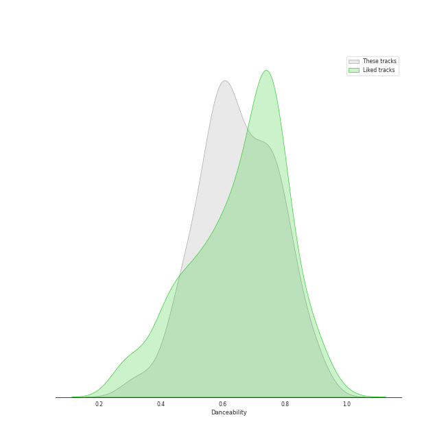
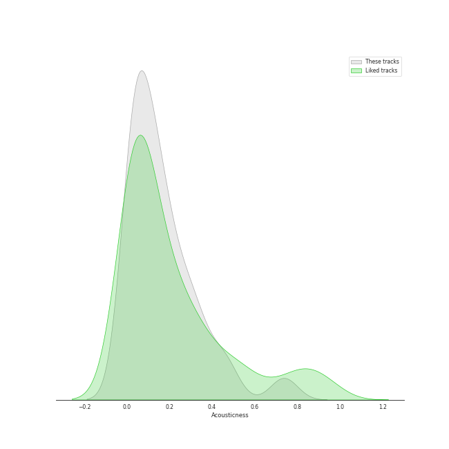
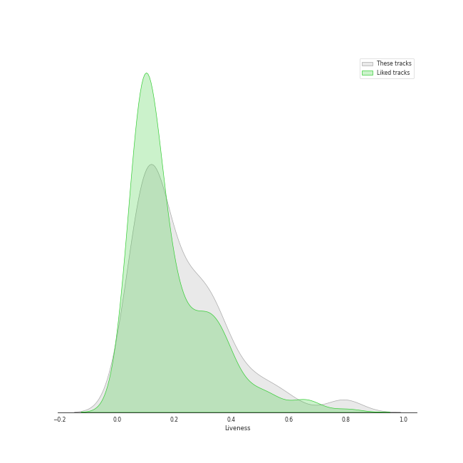
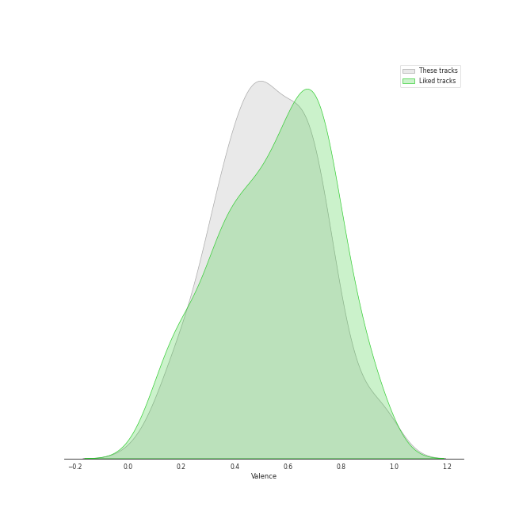
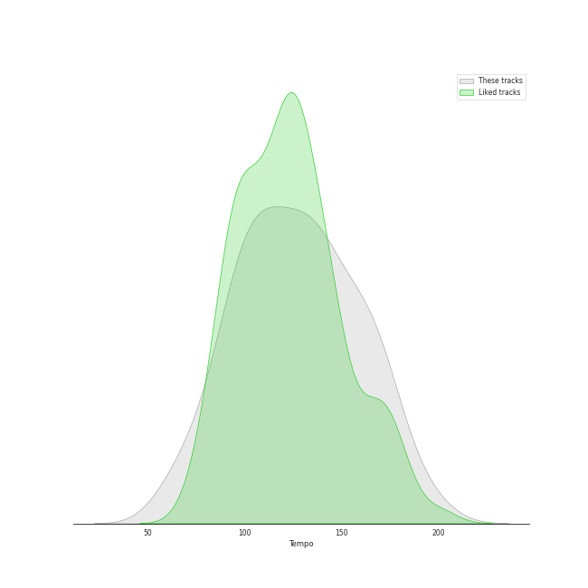

# Track Features for Halloween

## Danceability

| ​ | 10 most Danceable tracks | ​​ | 10 least Danceable tracks |
|:---|:---|:---|:---|
|  | bury a friend (0.905) |  | You Better Run (0.436) |
|  | 기기괴괴 (0.873) |  | Poison (0.442) |
|  | Peek-A-Boo (0.839) |  | Addicted (0.463) |
|  | VENOM (0.812) |  | Scary Fairy Tale (0.465) |
|  | Oh my god (0.794) |  | Devil (0.506) |
|  | Devil (0.79) |  | xanny (0.521) |
|  | Devil (0.773) |  | Fantasy (0.531) |
|  | KARMA (0.772) |  | Odd Eye (0.534) |
|  | 미행 (그림자 : Shadow) (0.768) |  | Villain (0.54) |
|  | 28 Reasons (0.766) |  | Dead Man Runnin’ (0.54) |

## Energy

| ​ | 10 most Energetic tracks | ​​ | 10 least Energetic tracks |
|:---|:---|:---|:---|
|  | RING X RING (0.987) |  | xanny (0.125) |
|  | Sleep-walking (0.962) |  | bury a friend (0.389) |
|  | Scream (0.94) |  | bad guy (0.425) |
|  | Odd Eye (0.933) |  | you should see me in a crown (0.533) |
|  | BEcause (0.932) |  | Animal Farm (0.57) |
|  | Bad Dracula (0.931) |  | Scary Fairy Tale (0.591) |
|  | Wings (0.93) |  | Devil (0.607) |
|  | KARMA (0.927) |  | Given-Taken (0.649) |
|  | Addicted (0.925) |  | 28 Reasons (0.651) |
|  | Red Sun (0.92) |  | Deja Vu (0.667) |

## Speechiness

| ​ | 10 most Speechy tracks | ​​ | 10 least Speechy tracks |
|:---|:---|:---|:---|
|  | Addicted (0.419) |  | Scary Fairy Tale (0.0263) |
|  | MANIAC (0.411) |  | Animal Farm (0.0308) |
|  | bad guy (0.375) |  | RBB (Really Bad Boy) (0.0317) |
|  | VENOM (0.339) |  | PARANOIA (0.0363) |
|  | bury a friend (0.332) |  | Given-Taken (0.0377) |
|  | You Better Run (0.326) |  | Oh my god (0.0392) |
|  | xanny (0.239) |  | Deja Vu (0.0394) |
|  | KARMA (0.233) |  | Favorite (Vampire) (0.0478) |
|  | Wings (0.223) |  | Devil (0.0479) |
|  | you should see me in a crown (0.186) |  | Monster (0.0488) |

## Acousticness

| ​ | 10 most Acoustic tracks | ​​ | 10 least Acoustic tracks |
|:---|:---|:---|:---|
|  | xanny (0.751) |  | Poison (9.27e-05) |
|  | bury a friend (0.74) |  | Favorite (Vampire) (0.000831) |
|  | you should see me in a crown (0.462) |  | Fantasy (0.00408) |
|  | Scary Fairy Tale (0.388) |  | RBB (Really Bad Boy) (0.012) |
|  | Red Sun (0.351) |  | Animal Farm (0.0178) |
|  | bad guy (0.328) |  | BEcause (0.0183) |
|  | 기괴한 이야기 : Get Out (0.254) |  | Hobgoblin (0.0194) |
|  | VILLAIN DIES (0.247) |  | Scream (0.0312) |
|  | Dead Man Runnin’ (0.216) |  | Devil (0.034) |
|  | Monster (0.212) |  | Oh my god (0.0358) |

## Instrumentalness

| ​ | 10 most Instrumental tracks | ​​ | 10 least Instrumental tracks |
|:---|:---|:---|:---|
|  | you should see me in a crown (0.219) |  | Devil (0.0) |
|  | bury a friend (0.162) |  | PARANOIA (0.0) |
|  | bad guy (0.13) |  | Odd Eye (0.0) |
|  | Poison (0.00311) |  | Addicted (0.0) |
|  | Peek-A-Boo (0.00257) |  | Hobgoblin (0.0) |
|  | xanny (0.00207) |  | Devil (0.0) |
|  | RBB (Really Bad Boy) (0.000239) |  | BEcause (0.0) |
|  | Silent Night (0.000148) |  | Bewitched (0.0) |
|  | Paradise Lost (7.16e-05) |  | Scream (0.0) |
|  | You Better Run (5.8e-05) |  | Scary Fairy Tale (0.0) |

## Liveness

| ​ | 10 most Live tracks | ​​ | 10 least Live tracks |
|:---|:---|:---|:---|
|  | You Better Run (0.803) |  | DARK (X-file) (0.0372) |
|  | 미행 (그림자 : Shadow) (0.782) |  | Wings (0.0428) |
|  | Poison (0.62) |  | Devil (0.052) |
|  | Animal Farm (0.55) |  | Villain (0.0589) |
|  | Monster (0.537) |  | Sleep-walking (0.0673) |
|  | Hobgoblin (0.488) |  | 기기괴괴 (0.0696) |
|  | RING X RING (0.418) |  | MANIAC (0.0697) |
|  | BEcause (0.344) |  | Devil (0.0783) |
|  | Given-Taken (0.321) |  | bad guy (0.1) |
|  | 기괴한 이야기 : Get Out (0.314) |  | Bewitched (0.105) |

## Valence

| ​ | 10 most Happy tracks | ​​ | 10 least Happy tracks |
|:---|:---|:---|:---|
|  | Devil (0.968) |  | xanny (0.0528) |
|  | Sleep-walking (0.954) |  | Favorite (Vampire) (0.178) |
|  | Devil (0.946) |  | bury a friend (0.196) |
|  | 미행 (그림자 : Shadow) (0.828) |  | Villain (0.296) |
|  | Run Devil Run (0.791) |  | Dead Man Runnin’ (0.299) |
|  | 기기괴괴 (0.765) |  | Scream (0.311) |
|  | KARMA (0.73) |  | you should see me in a crown (0.323) |
|  | MANIAC (0.709) |  | Fantasy (0.323) |
|  | Bad Dracula (0.668) |  | Monster (0.351) |
|  | You Better Run (0.651) |  | VILLAIN DIES (0.353) |

## Tempo

| ​ | 10 most Fast tracks | ​​ | 10 least Fast tracks |
|:---|:---|:---|:---|
|  | Villain (179.957) |  | Run Devil Run (64.927) |
|  | Sleep-walking (174.014) |  | Devil (74.898) |
|  | RING X RING (171.968) |  | VILLAIN DIES (77.008) |
|  | BEcause (170.012) |  | Red Sun (79.454) |
|  | Hobgoblin (169.91) |  | Deja Vu (89.946) |
|  | Addicted (167.515) |  | Bad Dracula (93.986) |
|  | You Better Run (167.024) |  | Fantasy (94.982) |
|  | 기괴한 이야기 : Get Out (165.988) |  | KARMA (96.014) |
|  | DARK (X-file) (165.924) |  | PARANOIA (97.03) |
|  | Poison (161.978) |  | Villain (100.023) |
