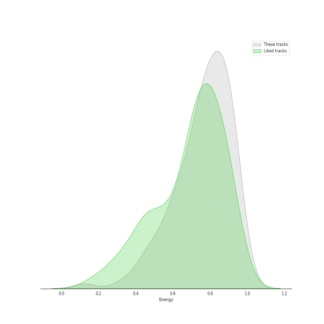
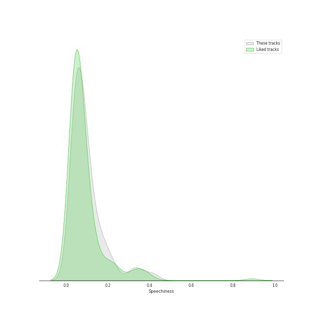
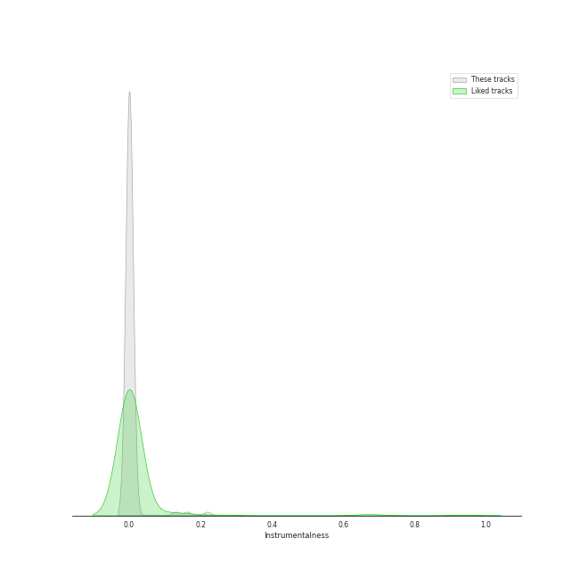

# Track Features for Halloween

## Danceability

| ​ | 10 most Danceable tracks | ​​ | 10 least Danceable tracks |
|:---|:---|:---|:---|
|  | Monster (0.913) |  | Bring Me To Life (0.331) |
|  | bury a friend (0.905) |  | Seven Devils (0.368) |
|  | 기기괴괴 (0.873) |  | No Light, No Light (0.429) |
|  | Doll (0.842) |  | You Better Run (0.436) |
|  | Peek-A-Boo (0.839) |  | watch (0.441) |
|  | VENOM (0.812) |  | Poison (0.442) |
|  | Chemistry (Prod. Czaer) (0.806) |  | Addicted (0.463) |
|  | Bite Me (0.795) |  | Scary Fairy Tale (0.465) |
|  | Oh my god (0.794) |  | Nightmare (0.466) |
|  | Devil (0.79) |  | STRANGER (0.475) |

## Energy

| ​ | 10 most Energetic tracks | ​​ | 10 least Energetic tracks |
|:---|:---|:---|:---|
|  | RING X RING (0.987) |  | xanny (0.125) |
|  | Sleep-walking (0.962) |  | bury a friend (0.389) |
|  | VOODOO DOLL (0.952) |  | bad guy (0.425) |
|  | Dracula (0.943) |  | Unholy (feat. Kim Petras) (0.472) |
|  | Bring Me To Life (0.943) |  | Wet Nightmare (0.505) |
|  | Scream (0.94) |  | vampire (0.532) |
|  | Odd Eye (0.933) |  | you should see me in a crown (0.533) |
|  | BEcause (0.932) |  | Animal Farm (0.542) |
|  | Bad Dracula (0.931) |  | Crown (0.58) |
|  | Wings (0.93) |  | STRANGER (0.581) |

## Speechiness

| ​ | 10 most Speechy tracks | ​​ | 10 least Speechy tracks |
|:---|:---|:---|:---|
|  | Addicted (0.419) |  | Scary Fairy Tale (0.0263) |
|  | MANIAC (0.411) |  | Orgel (0.0299) |
|  | bad guy (0.375) |  | Animal Farm (0.0315) |
|  | VENOM (0.339) |  | RBB (Really Bad Boy) (0.0317) |
|  | bury a friend (0.332) |  | AGASSY (0.032) |
|  | You Better Run (0.326) |  | Cold As Hell (0.0325) |
|  | Put It Straight - Nightmare Version (0.319) |  | Marionette (0.0362) |
|  | xanny (0.239) |  | PARANOIA (0.0363) |
|  | KARMA (0.233) |  | Sweet Juice (0.0372) |
|  | watch (0.225) |  | Given-Taken (0.0377) |

## Acousticness

| ​ | 10 most Acoustic tracks | ​​ | 10 least Acoustic tracks |
|:---|:---|:---|:---|
|  | xanny (0.751) |  | Poison (9.27e-05) |
|  | bury a friend (0.74) |  | Drunk-Dazed (0.000707) |
|  | Orgel (0.484) |  | Favorite (Vampire) (0.000831) |
|  | One Kiss (0.465) |  | Bring Me To Life (0.00721) |
|  | you should see me in a crown (0.462) |  | The Black Cat Nero (0.00799) |
|  | Sacrifice (Eat Me Up) (0.444) |  | Seven Devils (0.00913) |
|  | Crown (0.443) |  | VENOM (0.00966) |
|  | Scary Fairy Tale (0.388) |  | RBB (Really Bad Boy) (0.012) |
|  | Put It Straight - Nightmare Version (0.364) |  | No Light, No Light (0.0125) |
|  | Red Sun (0.351) |  | Unholy (feat. Kim Petras) (0.013) |

## Instrumentalness

| ​ | 10 most Instrumental tracks | ​​ | 10 least Instrumental tracks |
|:---|:---|:---|:---|
|  | you should see me in a crown (0.219) |  | CRIMINAL LOVE (0.0) |
|  | bury a friend (0.162) |  | Up All Night (Bang Chan, Changbin, Felix, Seungmin) (0.0) |
|  | bad guy (0.13) |  | Nightmare (0.0) |
|  | Wet Nightmare (0.00736) |  | Devil (0.0) |
|  | Poison (0.00311) |  | PARANOIA (0.0) |
|  | Peek-A-Boo (0.00257) |  | Monster (0.0) |
|  | xanny (0.00207) |  | vampire (0.0) |
|  | watch (0.00198) |  | Drunk-Dazed (0.0) |
|  | VENOM (0.000421) |  | Pretty Psycho (0.0) |
|  | Crown (0.000337) |  | Odd Eye (0.0) |

## Liveness

| ​ | 10 most Live tracks | ​​ | 10 least Live tracks |
|:---|:---|:---|:---|
|  | You Better Run (0.803) |  | DARK (X-file) (0.0372) |
|  | 미행 (그림자 : Shadow) (0.782) |  | Wings (0.0428) |
|  | Poison (0.62) |  | Seven Devils (0.0477) |
|  | Animal Farm (0.579) |  | Criminal (0.0488) |
|  | Monster (0.537) |  | Spider (0.0488) |
|  | Hobgoblin (0.488) |  | Devil (0.052) |
|  | Sweet Juice (0.48) |  | Up All Night (Bang Chan, Changbin, Felix, Seungmin) (0.0536) |
|  | No Light, No Light (0.444) |  | The Black Cat Nero (0.0578) |
|  | VOODOO DOLL (0.426) |  | Villain (0.0589) |
|  | RING X RING (0.418) |  | Sleep-walking (0.0673) |

## Valence

| ​ | 10 most Happy tracks | ​​ | 10 least Happy tracks |
|:---|:---|:---|:---|
|  | Devil (0.968) |  | xanny (0.0528) |
|  | Sleep-walking (0.954) |  | Wet Nightmare (0.121) |
|  | Devil (0.946) |  | Criminal (0.161) |
|  | WICKED LOVE (0.945) |  | No Light, No Light (0.162) |
|  | Up All Night (Bang Chan, Changbin, Felix, Seungmin) (0.916) |  | Favorite (Vampire) (0.178) |
|  | Zombie (0.831) |  | bury a friend (0.196) |
|  | 미행 (그림자 : Shadow) (0.828) |  | Seven Devils (0.211) |
|  | Pretty Psycho (0.791) |  | T4ke (0.226) |
|  | Run Devil Run (0.791) |  | Cold As Hell (0.236) |
|  | Doll (0.78) |  | Unholy (feat. Kim Petras) (0.238) |

## Tempo

| ​ | 10 most Fast tracks | ​​ | 10 least Fast tracks |
|:---|:---|:---|:---|
|  | Strawberry Cake (199.943) |  | Seven Devils (58.534) |
|  | Funny Valentine (185.968) |  | STRANGER (62.644) |
|  | One Kiss (180.058) |  | Run Devil Run (64.927) |
|  | Villain (179.957) |  | Sacrifice (Eat Me Up) (68.985) |
|  | T4ke (179.953) |  | Devil (74.898) |
|  | Sleep-walking (174.014) |  | Poison Rose (74.994) |
|  | RING X RING (171.968) |  | VILLAIN DIES (77.008) |
|  | BEcause (170.012) |  | Red Sun (79.454) |
|  | Hobgoblin (169.91) |  | Guilty (81.983) |
|  | Addicted (167.515) |  | Psycho (82.954) |
