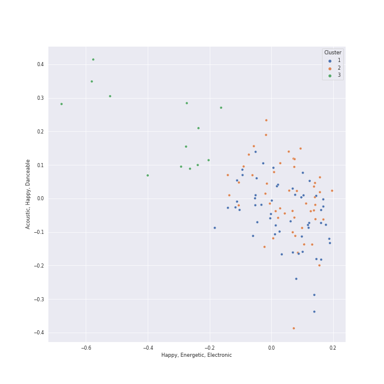

# Clusters in Halloween

## Cluster #1

21 tracks

| Art | Track | Album | Artists | Label | 💚 | 🔗 |
|:---|:---|:---|:---|:---|:---|:---|
|  | RING X RING | the Billage of perception : chapter one | [Billlie](../../../../artists/billlie/overview.md) | [MYSTIC STORY](../../../../labels/mystic_story) | 💚 | [🔗](https://open.spotify.com/track/4hfF0FOFcaiOtwY3NP5hnv) |
|  | Hobgoblin | CRYSTYLE | [CLC](../../../../artists/clc/overview.md) | [CUBE ENTERTAINMENT](../../../../labels/cube_entertainment) | 💚 | [🔗](https://open.spotify.com/track/2pSOUHBQXkN3fS2TAJHhfR) |
|  | BEcause | [Summer Holiday] | [Dreamcatcher](../../../../artists/dreamcatcher/overview.md) | [DREAMCATCHER COMPANY](../../../../labels/dreamcatcher_company) | 💚 | [🔗](https://open.spotify.com/track/3L74uwShK0JqEUZ5Y2JoDW) |
|  | CRIMINAL LOVE | CRIMINAL LOVE | [ENHYPEN](../../../../artists/enhypen/overview.md) | [BELIFT LAB](../../../../labels/belift_lab) | 💚 | [🔗](https://open.spotify.com/track/0Eglu3fErlG196PtTwCUPM) |
|  | PARANOIA | PARANOIA | KANGDANIEL | KONNECT Ent. | 💚 | [🔗](https://open.spotify.com/track/1Q6lzzQHM5dvtTCwcfeKDy) |
|  | Villain | REBORN | PIXY | ALLART ENTERTAINMENT, HAPPYTRIBE ENTERTAINMENT | 💚 | [🔗](https://open.spotify.com/track/5Doeu3aSa5tBHayCx0EbHa) |
|  | Peek-A-Boo | Perfect Velvet - The 2nd Album | [Red Velvet](../../../../artists/red_velvet/overview.md) | [SM Entertainment](../../../../labels/sm_entertainment) | 💚 | [🔗](https://open.spotify.com/track/42tFTth2jcF7iSo0RBjfJF) |
|  | VOODOO DOLL | VOODOO | VIXX | JELLYFISH ENTERTAINMENT | | [🔗](https://open.spotify.com/track/7AIiscePFRKJwfQhGOryGA) |
|  | Illusion | Girls - The 2nd Mini Album | [aespa](../../../../artists/aespa/overview.md) | [Warner Records](../../../../labels/warner_records) | 💚 | [🔗](https://open.spotify.com/track/396FqjKmViUZ92Wmm4rx3i) |
|  | Dracula | Red Light - The 3rd Album | f(x) | [SM Entertainment](../../../../labels/sm_entertainment) | 💚 | [🔗](https://open.spotify.com/track/5vClivCCQDK6sxmL6MhMFc) |
## Cluster #2

35 tracks

| Art | Track | Album | Artists | Label | 💚 | 🔗 |
|:---|:---|:---|:---|:---|:---|:---|
|  | DARK (X-file) | I love | [(G)I-DLE](../../../../artists/_g_i_dle/overview.md) | [Cube Entertainment](../../../../labels/cube_entertainment) | 💚 | [🔗](https://open.spotify.com/track/4xc3JpkI8kxLwk1SJafjzh) |
|  | Back To Black | Back To Black | Amy Winehouse | [Universal-Island Records Ltd.](../../../../labels/universal_island_records_ltd_) | 💚 | [🔗](https://open.spotify.com/track/30FURVTCpbKyykjSEQzGkH) |
|  | Villain | FOREVER 1 - The 7th Album | [Girls' Generation](../../../../artists/girls__generation/overview.md) | [SM Entertainment](../../../../labels/sm_entertainment) | 💚 | [🔗](https://open.spotify.com/track/3FuL8QGYM7NWj9YWFCEc5W) |
|  | VILLAIN | ALL OUT | K/DA, Madison Beer, Kim Petras, League of Legends | Riot Games | 💚 | [🔗](https://open.spotify.com/track/3QSjVPObHxuAJc3E5nrjRn) |
|  | vampire | GUTS | Olivia Rodrigo | Olivia Rodrigo PS | 💚 | [🔗](https://open.spotify.com/track/1kuGVB7EU95pJObxwvfwKS) |
|  | RBB (Really Bad Boy) | RBB - The 5th Mini Album | [Red Velvet](../../../../artists/red_velvet/overview.md) | [SM Entertainment](../../../../labels/sm_entertainment) | 💚 | [🔗](https://open.spotify.com/track/4xjVP2Vogo0C72o6Nevq0W) |
|  | Marionette | Bloom | [Red Velvet](../../../../artists/red_velvet/overview.md) | avex trax | 💚 | [🔗](https://open.spotify.com/track/3KvMgB5V1FvQTCvvHz5aiO) |
|  | Dead Man Runnin’ | 28 Reasons - The 1st Mini Album | [SEULGI](../../../../artists/seulgi/overview.md) | [SM Entertainment](../../../../labels/sm_entertainment) | 💚 | [🔗](https://open.spotify.com/track/5eFGkCXi83auDi0bcDBEKD) |
|  | STRANGER | STRANGER | [SUNMI](../../../../artists/sunmi/overview.md) | Abyss Company | 💚 | [🔗](https://open.spotify.com/track/3SifPlW12FRs8OQP2VkXSi) |
|  | Cold As Hell | INVU - The 3rd Album | [TAEYEON](../../../../artists/taeyeon/overview.md) | [SM Entertainment](../../../../labels/sm_entertainment) | 💚 | [🔗](https://open.spotify.com/track/7gosH4fL73GpiJBd5GK2rC) |
## Cluster #3

27 tracks

| Art | Track | Album | Artists | Label | 💚 | 🔗 |
|:---|:---|:---|:---|:---|:---|:---|
|  | Bite Me | DARK BLOOD | [ENHYPEN](../../../../artists/enhypen/overview.md) | [BELIFT LAB](../../../../labels/belift_lab) | 💚 | [🔗](https://open.spotify.com/track/7mpdNiaQvygj2rHoxkzMfa) |
|  | The Monster | The Marshall Mathers LP2 | Eminem, [Rihanna](../../../../artists/rihanna/overview.md) | Aftermath | 💚 | [🔗](https://open.spotify.com/track/48RrDBpOSSl1aLVCalGl5C) |
|  | Funny Valentine | Masterpiece | MISAMO | [WM Japan](../../../../labels/wm_japan) | 💚 | [🔗](https://open.spotify.com/track/4xtgQGbQnII1buKgl5fguT) |
|  | Addicted | Fairyforest : Temptation | PIXY | 올라트엔터테인먼트, 해피트라이브엔터테인먼트 | | [🔗](https://open.spotify.com/track/2ffVhWaUuu5IRaoogJOGFz) |
|  | KARMA | CHOSEN KARMA | PIXY | ALLART ENTERTAINMENT | 💚 | [🔗](https://open.spotify.com/track/32Yza17xuVSKayVyPcG79I) |
|  | 기기괴괴 | 기기괴괴 | PinkFantasy | 마이돌엔터테인먼트 | 💚 | [🔗](https://open.spotify.com/track/6ZERrx4VYGplqKlydGcLMi) |
|  | Bad Dracula | Russian Roulette - The 3rd Mini Album | [Red Velvet](../../../../artists/red_velvet/overview.md) | [SM Entertainment](../../../../labels/sm_entertainment) | 💚 | [🔗](https://open.spotify.com/track/4z5aqQOYYsvjXuXjjhKVJ2) |
|  | Disturbia | Good Girl Gone Bad: Reloaded | [Rihanna](../../../../artists/rihanna/overview.md) | [Def Jam Recordings](../../../../labels/def_jam_recordings) | 💚 | [🔗](https://open.spotify.com/track/2VOomzT6VavJOGBeySqaMc) |
|  | MANIAC | ODDINARY | [Stray Kids](../../../../artists/stray_kids/overview.md) | [Republic Records](../../../../labels/republic_records) | 💚 | [🔗](https://open.spotify.com/track/63irPUP3xB74fHdw1Aw9zR) |
|  | Devil by the Window | The Name Chapter: TEMPTATION | [TOMORROW X TOGETHER](../../../../artists/tomorrow_x_together/overview.md) | [Republic Records](../../../../labels/republic_records) | 💚 | [🔗](https://open.spotify.com/track/53H3sGmqiXWO4MwuZAJfyn) |