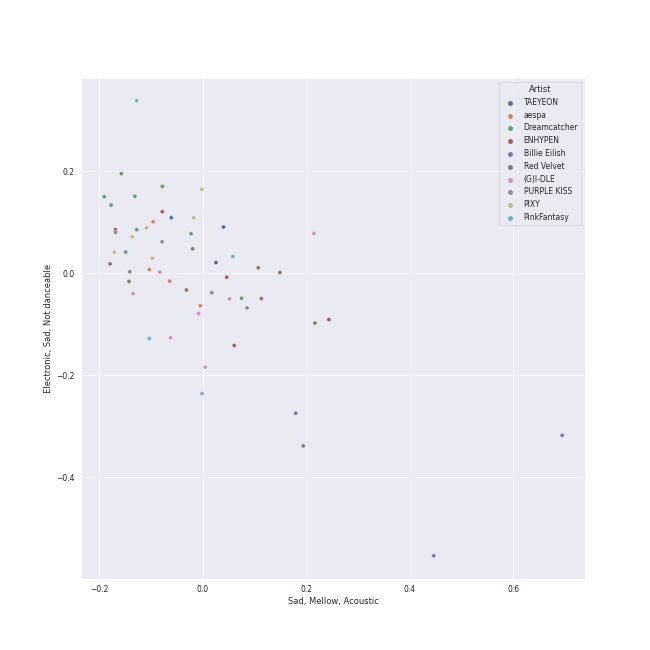
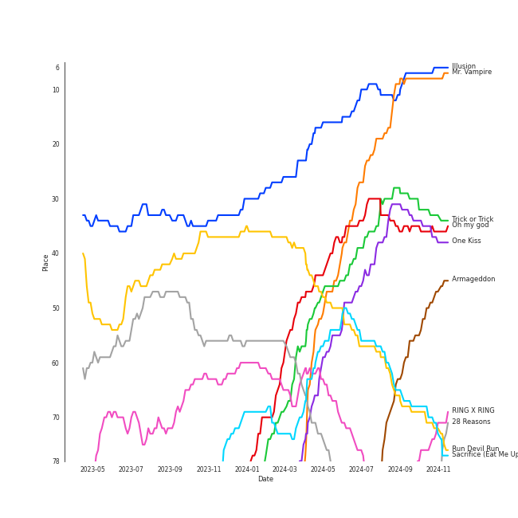
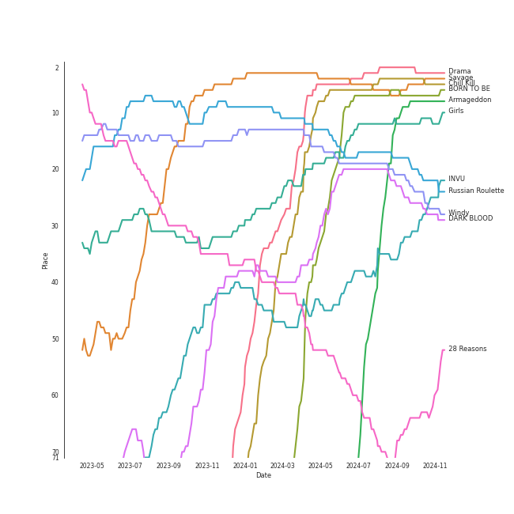
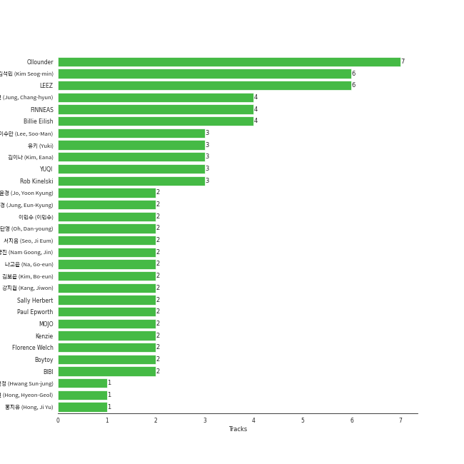
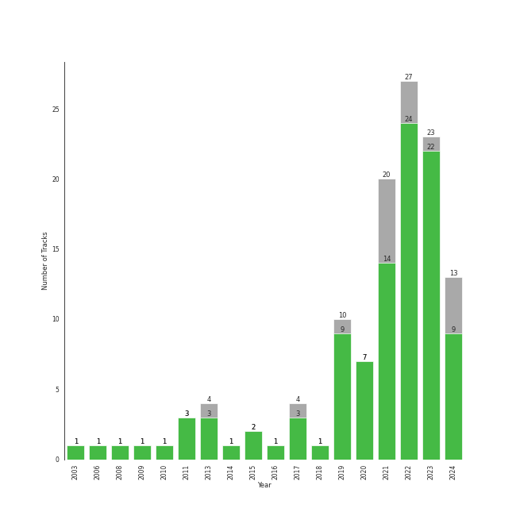

# Halloween

[121 tracks (105 liked) 🔗](https://open.spotify.com/playlist/6Kh7qnaefCcgcBdJJryJKp)

[See Track Features](audio_features.md)

[See Clusters](clusters/overview.md)

## Top Artists

| Art | Rank | Tracks | 💚 | Artist | 🔗 |
|:---|---:|---:|---:|:---|:---|
|  | 2 | 8 | 8 | [Red Velvet](../../artists/red_velvet/overview.md) | [🔗](https://open.spotify.com/artist/1z4g3DjTBBZKhvAroFlhOM) |
|  | 29 | 9 | 7 | [Dreamcatcher](../../artists/dreamcatcher/overview.md) | [🔗](https://open.spotify.com/artist/5V1qsQHdXNm4ZEZHWvFnqQ) |
|  | 6 | 7 | 6 | [(G)I-DLE](../../artists/(g)i-dle/overview.md) | [🔗](https://open.spotify.com/artist/2AfmfGFbe0A0WsTYm0SDTx) |
|  | 45 | 5 | 5 | [Billie Eilish](../../artists/billie_eilish/overview.md) | [🔗](https://open.spotify.com/artist/6qqNVTkY8uBg9cP3Jd7DAH) |
|  | 7 | 5 | 5 | [ENHYPEN](../../artists/enhypen/overview.md) | [🔗](https://open.spotify.com/artist/5t5FqBwTcgKTaWmfEbwQY9) |
|  | 133 | 6 | 4 | PIXY | [🔗](https://open.spotify.com/artist/0CJkEzffVZLgav03xXeC9s) |
|  | 1 | 4 | 4 | [aespa](../../artists/aespa/overview.md) | [🔗](https://open.spotify.com/artist/6YVMFz59CuY7ngCxTxjpxE) |
|  | 214 | 4 | 4 | PinkFantasy | [🔗](https://open.spotify.com/artist/5syu5kN4a5f4rgMCRGlnZp) |
|  | 52 | 5 | 3 | [PURPLE KISS](../../artists/purple_kiss/overview.md) | [🔗](https://open.spotify.com/artist/62T5PGHWJ9sxP2SJq20IHq) |
|  | 8 | 3 | 3 | [TAEYEON](../../artists/taeyeon/overview.md) | [🔗](https://open.spotify.com/artist/3qNVuliS40BLgXGxhdBdqu) |

See all 64 artists

| Art | Rank | Tracks | 💚 | Artist | 🔗 |
|:---|---:|---:|---:|:---|:---|
|  | 10 | 3 | 3 | [Stray Kids](../../artists/stray_kids/overview.md) | [🔗](https://open.spotify.com/artist/2dIgFjalVxs4ThymZ67YCE) |
|  | 37 | 3 | 3 | [SEULGI](../../artists/seulgi/overview.md) | [🔗](https://open.spotify.com/artist/2QM5S4yO6xHgnNvF0nbZZq) |
|  | 21 | 3 | 3 | [Girls' Generation](../../artists/girls__generation/overview.md) | [🔗](https://open.spotify.com/artist/0Sadg1vgvaPqGTOjxu0N6c) |
|  | 72 | 2 | 2 | [BIBI](../../artists/bibi/overview.md) | [🔗](https://open.spotify.com/artist/6UbmqUEgjLA6jAcXwbM1Z9) |
|  | 62 | 2 | 2 | [CLC](../../artists/clc/overview.md) | [🔗](https://open.spotify.com/artist/6QyO41KctzGc70mVaVnXQO) |
|  | 131 | 2 | 2 | [Rihanna](../../artists/rihanna/overview.md) | [🔗](https://open.spotify.com/artist/5pKCCKE2ajJHZ9KAiaK11H) |
|  | 161 | 2 | 2 | [YENA](../../artists/yena/overview.md) | [🔗](https://open.spotify.com/artist/49muoiIu4uea4PO8vueUNN) |
|  | 163 | 2 | 2 | [f(x)](../../artists/f(x)/overview.md) | [🔗](https://open.spotify.com/artist/3wRA5UYoo08BBKJnzyKkpF) |
|  | 126 | 2 | 2 | Kim Petras | [🔗](https://open.spotify.com/artist/3Xt3RrJMFv5SZkCfUE8C1J) |
|  | 22 | 2 | 2 | [Billlie](../../artists/billlie/overview.md) | [🔗](https://open.spotify.com/artist/2GQxKDojobwBjZMPf7aoh0) |
|  | 79 | 2 | 2 | [Florence + The Machine](../../artists/florence_+_the_machine/overview.md) | [🔗](https://open.spotify.com/artist/1moxjboGR7GNWYIMWsRjgG) |
|  | 59 | 2 | 2 | [TAEMIN](../../artists/taemin/overview.md) | [🔗](https://open.spotify.com/artist/13rF01aOogvnkuQXOlgTW8) |
|  | 35 | 2 | 1 | [TEN](../../artists/ten/overview.md) | [🔗](https://open.spotify.com/artist/3Q5Qep7ytrjVleNnMnntgQ) |
|  | 12 | 1 | 1 | [SEVENTEEN](../../artists/seventeen/overview.md) | [🔗](https://open.spotify.com/artist/7nqOGRxlXj7N2JYbgNEjYH) |
|  | 30 | 1 | 1 | [NCT 127](../../artists/nct_127/overview.md) | [🔗](https://open.spotify.com/artist/7f4ignuCJhLXfZ9giKT7rH) |
|  | 325 | 1 | 1 | [Eminem](../../artists/eminem/overview.md) | [🔗](https://open.spotify.com/artist/7dGJo4pcD2V6oG8kP0tJRR) |
|  | 92 | 1 | 1 | MAX CHANGMIN | [🔗](https://open.spotify.com/artist/7FiAkNWMb6ZBYI8tbQLuIS) |
|  | 308 | 1 | 1 | HYOLYN | [🔗](https://open.spotify.com/artist/78sJswwVn4P8aEhkF4K6fQ) |
|  | 85 | 1 | 1 | [SUPER JUNIOR](../../artists/super_junior/overview.md) | [🔗](https://open.spotify.com/artist/6gzXCdfYfFe5XKhPKkYqxV) |
|  | 98 | 1 | 1 | Red Velvet - IRENE & SEULGI | [🔗](https://open.spotify.com/artist/6bwp9ObI8FWvMPCIWVBmhl) |
|  | 28 | 1 | 1 | [JEON SOYEON](../../artists/jeon_soyeon/overview.md) | [🔗](https://open.spotify.com/artist/6Xg22wJOAcnvPUfk5WvODH) |
|  | 430 | 1 | 1 | [Imogen Heap](../../artists/imogen_heap/overview.md) | [🔗](https://open.spotify.com/artist/6Xb4ezwoAQC4516kI89nWz) |
|  | 406 | 1 | 1 | Amy Winehouse | [🔗](https://open.spotify.com/artist/6Q192DXotxtaysaqNPy5yR) |
|  | 43 | 1 | 1 | [SUNMI](../../artists/sunmi/overview.md) | [🔗](https://open.spotify.com/artist/6MoXcK2GyGg7FIyxPU5yW6) |
|  | 204 | 1 | 1 | PiXXiE | [🔗](https://open.spotify.com/artist/6HlUN1Md7UT62mNJHOYRsK) |
|  | 275 | 1 | 1 | TRI.BE | [🔗](https://open.spotify.com/artist/6BgYuNomEs12UIrnxhWE9a) |
|  | 303 | 1 | 1 | KANGDANIEL | [🔗](https://open.spotify.com/artist/5vGoWnZO65NBgiZYBmi3iW) |
|  | 205 | 1 | 1 | Evanescence | [🔗](https://open.spotify.com/artist/5nGIFgo0shDenQYSE0Sn7c) |
|  | 430 | 1 | 1 | GWSN | [🔗](https://open.spotify.com/artist/5fI4xffqGRGQvICSlJreMF) |
|  | 123 | 1 | 1 | K/DA | [🔗](https://open.spotify.com/artist/4gOc8TsQed9eqnqJct2c5v) |
|  | 140 | 1 | 1 | [Gain](../../artists/gain/overview.md) | [🔗](https://open.spotify.com/artist/4R60A85t9mTZzCqJlVswuo) |
|  | 124 | 1 | 1 | League of Legends | [🔗](https://open.spotify.com/artist/47mIJdHORyRerp4os813jD) |
|  | 42 | 1 | 1 | [EVERGLOW](../../artists/everglow/overview.md) | [🔗](https://open.spotify.com/artist/3ZZzT0naD25RhY2uZvIKkJ) |
|  | 56 | 1 | 1 | HYO | [🔗](https://open.spotify.com/artist/3U7bOaJLuFkrmDQ1C1OqKl) |
|  | 3 | 1 | 1 | [IU](../../artists/iu/overview.md) | [🔗](https://open.spotify.com/artist/3HqSLMAZ3g3d5poNaI7GOU) |
|  | 430 | 1 | 1 | CRAXY | [🔗](https://open.spotify.com/artist/3C13AlJZ4QWHSruAWe9VPI) |
|  | 430 | 1 | 1 | Sam Smith | [🔗](https://open.spotify.com/artist/2wY79sveU1sp5g7SokKOiI) |
|  | 125 | 1 | 1 | Madison Beer | [🔗](https://open.spotify.com/artist/2kRfqPViCqYdSGhYSM9R0Q) |
|  | 99 | 1 | 1 | [SHINee](../../artists/shinee/overview.md) | [🔗](https://open.spotify.com/artist/2hRQKC0gqlZGPrmUKbcchR) |
|  | 415 | 1 | 1 | Seori | [🔗](https://open.spotify.com/artist/2bWTIIQP9zaVc55RaMGu7e) |
|  | 117 | 1 | 1 | BADVILLAIN | [🔗](https://open.spotify.com/artist/2Y7fY3aflbCTxp6h5hw0CV) |
|  | 5 | 1 | 1 | [ITZY](../../artists/itzy/overview.md) | [🔗](https://open.spotify.com/artist/2KC9Qb60EaY0kW4eH68vr3) |
|  | 281 | 1 | 1 | Xdinary Heroes | [🔗](https://open.spotify.com/artist/1khChLj7REGqjM043PlYyn) |
|  | 291 | 1 | 1 | [Olivia Rodrigo](../../artists/olivia_rodrigo/overview.md) | [🔗](https://open.spotify.com/artist/1McMsnEElThX1knmY4oliG) |
|  | 159 | 1 | 1 | [TOMORROW X TOGETHER](../../artists/tomorrow_x_together/overview.md) | [🔗](https://open.spotify.com/artist/0ghlgldX5Dd6720Q3qFyQB) |
|  | 41 | 1 | 1 | MISAMO | [🔗](https://open.spotify.com/artist/0IwZVmMMGE7nNXS7vN9SIo) |
|  | 430 | 1 | 0 | HOSHI | [🔗](https://open.spotify.com/artist/6nWKAdMv1BDq1zHfZzkdbR) |
|  | 46 | 1 | 0 | [ATEEZ](../../artists/ateez/overview.md) | [🔗](https://open.spotify.com/artist/68KmkJeZGfwe1OUaivBa2L) |
|  | 430 | 1 | 0 | BVNDIT | [🔗](https://open.spotify.com/artist/5dEBuZjTtE68uDgCs23Kuv) |
|  | 430 | 1 | 0 | VIXX | [🔗](https://open.spotify.com/artist/5BkB3rXc0qIdUtuEnhbK0A) |
|  | 344 | 1 | 0 | YooA | [🔗](https://open.spotify.com/artist/4ur1jCwyNlhgd0viJkOtcQ) |
|  | 174 | 1 | 0 | Moon Byul | [🔗](https://open.spotify.com/artist/1eTft3tXynrKdo6XD7QHLL) |
|  | 430 | 1 | 0 | SOOJIN | [🔗](https://open.spotify.com/artist/0kB3Vlf3xDNZQz6NjAPJV8) |
|  | 430 | 1 | 0 | E'LAST | [🔗](https://open.spotify.com/artist/0NztgA9b1KEJLjLVqMwd9y) |

## Top Tracks

Most and least listened tracks

| Rank | ​ | Most listened tracks | Rank | ​​ | Least listened tracks |
|---:|:---|:---|---:|:---|:---|
| 7 |  | [Illusion](../../artists/aespa/overview.md) | 996 |  | [watch](../../artists/billie_eilish/overview.md) |
| 8 |  | [Mr. Vampire](../../artists/itzy/overview.md) | 996 |  | [Scream](../../artists/dreamcatcher/overview.md) |
| 33 |  | [Trick or Trick](../../artists/aespa/overview.md) | 996 |  | [You Better Run](../../artists/girls__generation/overview.md) |
| 35 |  | [One Kiss](../../artists/red_velvet/overview.md) | 996 |  | VOODOO DOLL |
| 36 |  | [Oh my god](../../artists/(g)i-dle/overview.md) | 996 |  | 기기괴괴 |
| 49 |  | [Armageddon](../../artists/aespa/overview.md) | 996 |  | I Can't Breathe |
| 70 |  | [Sacrifice (Eat Me Up)](../../artists/enhypen/overview.md) | 996 |  | Dark Dream |
| 71 |  | [Run Devil Run](../../artists/girls__generation/overview.md) | 996 |  | Chemistry (Prod. Czaer) |
| 75 |  | [RING X RING](../../artists/billlie/overview.md) | 996 |  | [Zombie](../../artists/purple_kiss/overview.md) |
| 83 |  | [Nightmare](../../artists/red_velvet/overview.md) | 996 |  | [No Light, No Light](../../artists/florence_+_the_machine/overview.md) |

## Top Albums

| Art | Rank | Tracks | 💚 | Album | Release Date | 🔗 |
|:---|---:|---:|---:|:---|:---|:---|
|  | 216 | 4 | 4 | WHEN WE ALL FALL ASLEEP, WHERE DO WE GO? | 2019-03-29 | [🔗](https://open.spotify.com/album/0S0KGZnfBGSIssfF54WSJh) |
|  | 5 | 4 | 4 | Chill Kill - The 3rd Album | 2023-11-13 | [🔗](https://open.spotify.com/album/4UUICitfodUVCNhzmDFbrO) |
|  | 63 | 3 | 3 | 28 Reasons - The 1st Mini Album | 2022-10-04 | [🔗](https://open.spotify.com/album/1t5a29WYbJj83iy3RNICHw) |
|  | 245 | 3 | 2 | Raid of Dream | 2019-09-18 | [🔗](https://open.spotify.com/album/7jvAjSM0NOSwJYsLzHQ9KZ) |
|  | 70 | 2 | 2 | the Billage of perception : chapter one | 2021-11-10 | [🔗](https://open.spotify.com/album/1kp4txZsSpDNR4EoDFi2LD) |
|  | 372 | 2 | 2 | ODDINARY | 2022-03-18 | [🔗](https://open.spotify.com/album/0Gmf4pfe0POEQq2FgGAj2q) |
|  | 104 | 2 | 2 | Lowlife Princess: Noir | 2022-11-18 | [🔗](https://open.spotify.com/album/0AwCgoJKJUOgLp1imhnxuH) |
|  | 652 | 2 | 2 | FOREVER 1 - The 7th Album | 2022-08-05 | [🔗](https://open.spotify.com/album/3CcgnUkTrUaPTt4Ms1MkoP) |
|  | 28 | 2 | 2 | DARK BLOOD | 2023-05-22 | [🔗](https://open.spotify.com/album/7q65W5gVANjh1j1KXLeU0f) |
|  | 169 | 2 | 2 | Ceremonials - Deluxe Edition | 2011-01-01 | [🔗](https://open.spotify.com/album/5SxudoALxEAVh9l83kSebx) |

See all 99 albums

| Art | Rank | Tracks | 💚 | Album | Release Date | 🔗 |
|:---|---:|---:|---:|:---|:---|:---|
|  | 144 | 2 | 2 | Cabin Fever | 2023-02-15 | [🔗](https://open.spotify.com/album/4uIqXyViDoMKFuuw12kYMO) |
|  | 275 | 2 | 2 | 1st Album [Dystopia : The Tree of Language] | 2020-02-18 | [🔗](https://open.spotify.com/album/6m5pDOafdvIKxNRxx5hVbr) |
|  | 49 | 2 | 1 | TEN - The 1st Mini Album | 2024-02-13 | [🔗](https://open.spotify.com/album/50Zo1vf3YCQtXLUZr2oBiQ) |
|  | 652 | 2 | 1 | REBORN | 2022-06-15 | [🔗](https://open.spotify.com/album/6kp9dsLnll5WEiBlBUwBME) |
|  | 226 | 2 | 1 | Fairyforest : Temptation | 2021-10-07 | [🔗](https://open.spotify.com/album/3999VmQrZOafu4NjYkc0rj) |
|  | 54 | 2 | 1 | 2 | 2024-01-29 | [🔗](https://open.spotify.com/album/0mC9MXPddkzggVsOXh5gd3) |
|  | 652 | 1 | 1 | 기기괴괴 | 2021-10-31 | [🔗](https://open.spotify.com/album/296fyWl3wGRk4pB7sbaAwx) |
|  | 652 | 1 | 1 | dont smile at me | 2017-12-22 | [🔗](https://open.spotify.com/album/7fRrTyKvE4Skh93v97gtcU) |
|  | 391 | 1 | 1 | [Summer Holiday] | 2021-07-30 | [🔗](https://open.spotify.com/album/3dD0qCBPe7eYeaftyIKwa5) |
|  | 434 | 1 | 1 | [Dystopia : Road to Utopia] | 2021-01-26 | [🔗](https://open.spotify.com/album/1EyLcB9R1KfUV45AxtRR3V) |
|  | 500 | 1 | 1 | ZOMBIE | 2024-06-10 | [🔗](https://open.spotify.com/album/6vGrWJmYXU9VqiqpOwPJ2r) |
|  | 652 | 1 | 1 | Wings | 2021-02-24 | [🔗](https://open.spotify.com/album/4knaQg3CtzHlA2m99NS7xW) |
|  | 26 | 1 | 1 | Windy | 2021-07-05 | [🔗](https://open.spotify.com/album/1lv92CIVZbB2BsHmIx7qJf) |
|  | 350 | 1 | 1 | W.A.Y | 2023-02-14 | [🔗](https://open.spotify.com/album/7iidKsHRHGmJ1tAMz8tvZo) |
|  | 652 | 1 | 1 | Unholy (feat. Kim Petras) | 2022-09-22 | [🔗](https://open.spotify.com/album/0gX9tkL5njRax8ymWcXARi) |
|  | 374 | 1 | 1 | The Name Chapter: TEMPTATION | 2023-01-27 | [🔗](https://open.spotify.com/album/7gkb4MxKe9rnoR3wxbJXJg) |
|  | 467 | 1 | 1 | The Marshall Mathers LP2 | 2013-11-05 | [🔗](https://open.spotify.com/album/3vOgbDjgsZBAPwV2M3bNOj) |
|  | 652 | 1 | 1 | Tales of the Unusual | 2022-04-08 | [🔗](https://open.spotify.com/album/3xvUAslKb1sSJBf0gmszPc) |
|  | 652 | 1 | 1 | THE OTHER SIDE OF THE MOON | 2021-05-26 | [🔗](https://open.spotify.com/album/4W9vkO9c1K2oVvLTNsjWv7) |
|  | 520 | 1 | 1 | Street Woman Fighter2 (SWF2) Crew Songs | 2023-08-22 | [🔗](https://open.spotify.com/album/5oXPwd7Cn2q3bJ3pdmtiWY) |
|  | 4 | 1 | 1 | Savage - The 1st Mini Album | 2021-10-05 | [🔗](https://open.spotify.com/album/3vyyDkvYWC36DwgZCYd3Wu) |
|  | 347 | 1 | 1 | STRANGER | 2023-10-17 | [🔗](https://open.spotify.com/album/5QUzffclUFjjFFZ1HmaB6X) |
|  | 172 | 1 | 1 | SKZ-REPLAY | 2022-12-21 | [🔗](https://open.spotify.com/album/3UXrliH0JUQvcaLnBD8Txz) |
|  | 322 | 1 | 1 | SHINee The 3rd Album 'The Misconceptions Of Us' | 2013-08-08 | [🔗](https://open.spotify.com/album/0f0brenHcU2NmUANeix9rN) |
|  | 471 | 1 | 1 | SEVENTEEN 11th Mini Album 'SEVENTEENTH HEAVEN' | 2023-10-23 | [🔗](https://open.spotify.com/album/1rE0Gy69MFUh4GuXafWd0f) |
|  | 22 | 1 | 1 | Russian Roulette - The 3rd Mini Album | 2016-09-07 | [🔗](https://open.spotify.com/album/6MNlcai3skKLKv5syzFwC3) |
|  | 67 | 1 | 1 | Run Devil Run - The 2nd Album Repackage | 2010-03-22 | [🔗](https://open.spotify.com/album/2b4JQKXl0gwf3bnAfhZwLA) |
|  | 627 | 1 | 1 | Remarriage and Desires (Original Soundtrack from The Netflix Series) | 2022-07-15 | [🔗](https://open.spotify.com/album/2YM9Oahck5kVuWGiFQK1dg) |
|  | 609 | 1 | 1 | Red Light - The 3rd Album | 2014-07-11 | [🔗](https://open.spotify.com/album/6T9SFwLGHVU75jRAjUJn3W) |
|  | 424 | 1 | 1 | REAL+ | 2011-02-17 | [🔗](https://open.spotify.com/album/79725WrSou2C9RrEUxClUf) |
|  | 80 | 1 | 1 | RBB - The 5th Mini Album | 2018-11-30 | [🔗](https://open.spotify.com/album/7rNIvLwIpB2mwOzk20iqIl) |
|  | 485 | 1 | 1 | Queendom < Box of Pandora > Pt. 1 | 2019-10-18 | [🔗](https://open.spotify.com/album/75ii7SGF9jbD1ireJ0CeNI) |
|  | 149 | 1 | 1 | Purpose - The 2nd Album | 2019-10-28 | [🔗](https://open.spotify.com/album/0h6wCpdgpSOAbYDDYJVuwr) |
|  | 597 | 1 | 1 | Prequel | 2017-07-27 | [🔗](https://open.spotify.com/album/7dwF0tRN3awkAyYEdLJic3) |
|  | 652 | 1 | 1 | Poison Rose | 2022-11-10 | [🔗](https://open.spotify.com/album/7MfxSqUuOU0JfoafaA2L3H) |
|  | 244 | 1 | 1 | Pink Tape - The 2nd Album | 2013-07-29 | [🔗](https://open.spotify.com/album/62tuEHFtjk3L6Xjdkzyt4z) |
|  | 219 | 1 | 1 | Perfect Velvet - The 2nd Album | 2017-11-17 | [🔗](https://open.spotify.com/album/0rvrbZvaDX5S9ZBhwOwFfH) |
|  | 393 | 1 | 1 | PARANOIA | 2021-02-16 | [🔗](https://open.spotify.com/album/6vxwhImvm7xkbIMk0e1LVv) |
|  | 145 | 1 | 1 | OVERSTEP | 2024-06-03 | [🔗](https://open.spotify.com/album/15rdrWfjFtnMnzdZIemvoQ) |
|  | 343 | 1 | 1 | Never Gonna Dance Again : Act 1 - The 3rd Album | 2020-09-07 | [🔗](https://open.spotify.com/album/6YfGgOaUnhs0A9brMqjpHf) |
|  | 130 | 1 | 1 | Monster - The 1st Mini Album | 2020-07-06 | [🔗](https://open.spotify.com/album/4DFheSBXhfewjz7SSe4Kyc) |
|  | 33 | 1 | 1 | Masterpiece | 2023-07-26 | [🔗](https://open.spotify.com/album/3qmO83vO1SsdmP1Y0ljhSQ) |
|  | 27 | 1 | 1 | INVU - The 3rd Album | 2022-02-14 | [🔗](https://open.spotify.com/album/7i2YLTVQ0dyngRuUqtGmr9) |
|  | 40 | 1 | 1 | I trust | 2020-04-06 | [🔗](https://open.spotify.com/album/57sl8AvqVqm4Fadre0z8FQ) |
|  | 97 | 1 | 1 | I love | 2022-10-17 | [🔗](https://open.spotify.com/album/2Hyuin3i1cSZ1FlQFeCPZH) |
|  | 93 | 1 | 1 | I feel | 2023-05-15 | [🔗](https://open.spotify.com/album/3PQZnr5gf699uYEaGH93uG) |
|  | 167 | 1 | 1 | I NEVER DIE | 2022-03-14 | [🔗](https://open.spotify.com/album/1T2W9vDajFreUuycPDjUXk) |
|  | 363 | 1 | 1 | Hello, world! | 2022-07-20 | [🔗](https://open.spotify.com/album/5zjnlpEemkmaN6iv16vmDm) |
|  | 118 | 1 | 1 | Heaven | 2024-07-08 | [🔗](https://open.spotify.com/album/68taLckvPxHRtNa8QjQJ5e) |
|  | 214 | 1 | 1 | Hawwah | 2015-03-12 | [🔗](https://open.spotify.com/album/1fghVqJ812j2fqPYrSFd0Q) |
|  | 313 | 1 | 1 | HATE XX | 2023-06-27 | [🔗](https://open.spotify.com/album/3aYLtPSWEqmcLTCfM0ZYl7) |
|  | 542 | 1 | 1 | Guilty - The 4th Mini Album | 2023-10-30 | [🔗](https://open.spotify.com/album/1lnDLQ5nH1V3ST8MuVGmQW) |
|  | 652 | 1 | 1 | Good Girl Gone Bad: Reloaded | 2008-06-02 | [🔗](https://open.spotify.com/album/3JSWZWeTHF4HDGt5Eozdy7) |
|  | 11 | 1 | 1 | Girls - The 2nd Mini Album | 2022-07-08 | [🔗](https://open.spotify.com/album/4w1dbvUy1crv0knXQvcSeY) |
|  | 373 | 1 | 1 | GUTS | 2023-09-08 | [🔗](https://open.spotify.com/album/1xJHno7SmdVtZAtXbdbDZp) |
|  | 530 | 1 | 1 | GOOD MORNING | 2024-01-15 | [🔗](https://open.spotify.com/album/1kfvY0GjQJhhDNjTpy7xOs) |
|  | 652 | 1 | 1 | Favorite - The 3rd Album Repackage | 2021-10-25 | [🔗](https://open.spotify.com/album/5LbnQtyHBfJUCigA08llHX) |
|  | 250 | 1 | 1 | Fallen | 2003-03-04 | [🔗](https://open.spotify.com/album/02w1xMzzdF2OJxTeh1basm) |
|  | 652 | 1 | 1 | Ellipse | 2009-08-25 | [🔗](https://open.spotify.com/album/5AYKGPzPBJNHeKehCxMaq0) |
|  | 3 | 1 | 1 | Drama - The 4th Mini Album | 2023-11-10 | [🔗](https://open.spotify.com/album/5NMtxQJy4wq3mpo3ERVnLs) |
|  | 180 | 1 | 1 | Devil - The 2nd Mini Album | 2022-01-13 | [🔗](https://open.spotify.com/album/6bG2rY8NzT7dIzUNADDNCR) |
|  | 327 | 1 | 1 | Devil | 2019-09-06 | [🔗](https://open.spotify.com/album/1HpLXN8RRy1lHO3jckCTkN) |
|  | 173 | 1 | 1 | DEVIL - SUPER JUNIOR SPECIAL ALBUM | 2015-07-16 | [🔗](https://open.spotify.com/album/4YdR3Qy3eZXsLGIXaEAw8o) |
|  | 652 | 1 | 1 | DEJAYOU | 2023-07-17 | [🔗](https://open.spotify.com/album/6DYhEl80WKxsFyl9sTQMzi) |
|  | 652 | 1 | 1 | DEEP - The 1st Mini Album | 2022-05-16 | [🔗](https://open.spotify.com/album/2qa6E3bEJ5OqwVgbfWOeF4) |
|  | 384 | 1 | 1 | CRYSTYLE | 2017-01-17 | [🔗](https://open.spotify.com/album/74VP5VvY2CISEqfEkH9Wuc) |
|  | 115 | 1 | 1 | CRIMINAL LOVE | 2023-07-31 | [🔗](https://open.spotify.com/album/6S8BCiVrtzm5TEOnjyyCfJ) |
|  | 442 | 1 | 1 | CHOSEN KARMA | 2023-03-10 | [🔗](https://open.spotify.com/album/0S6Yq3EcpbHhj1r0cuYChA) |
|  | 371 | 1 | 1 | Bloom | 2022-04-06 | [🔗](https://open.spotify.com/album/4ualu7nMAcmoAqp47YaA95) |
|  | 426 | 1 | 1 | Bizarre Story | 2022-10-24 | [🔗](https://open.spotify.com/album/2a63YUr9pcvyfxxNKtw5HO) |
|  | 605 | 1 | 1 | Back To Black | 2006-10-27 | [🔗](https://open.spotify.com/album/097eYvf9NKjFnv4xA9s2oV) |
|  | 310 | 1 | 1 | BXX | 2024-03-19 | [🔗](https://open.spotify.com/album/3xX7eBfa5HTqDZXepyvjfw) |
|  | 7 | 1 | 1 | BORN TO BE | 2024-01-08 | [🔗](https://open.spotify.com/album/3cm3EkNQLpKu58btSJT7fz) |
|  | 481 | 1 | 1 | BORDER : DAY ONE | 2020-11-30 | [🔗](https://open.spotify.com/album/3YxF7jTnpdNepWbO42f8lH) |
|  | 170 | 1 | 1 | BORDER : CARNIVAL | 2021-04-26 | [🔗](https://open.spotify.com/album/4LGYBcRsteiXjcPD4QQvxv) |
|  | 8 | 1 | 1 | Armageddon - The 1st Album | 2024-05-26 | [🔗](https://open.spotify.com/album/4SboBpuYojDm02qS4iFeJC) |
|  | 652 | 1 | 1 | Alice in Wonderland | 2021-06-21 | [🔗](https://open.spotify.com/album/0KFsCn3mxiaKMpobo3BRQM) |
|  | 155 | 1 | 1 | ALL OUT | 2020-11-06 | [🔗](https://open.spotify.com/album/26IdRjba8f8DNa7c0FwfQb) |
|  | 652 | 1 | 0 | 악몽 | 2017-01-13 | [🔗](https://open.spotify.com/album/0H35i31IzpWMrLXSV6h2YN) |
|  | 369 | 1 | 0 | memeM | 2022-03-29 | [🔗](https://open.spotify.com/album/4nhtnBY8owIQnOsnGQGqW9) |
|  | 652 | 1 | 0 | VOODOO | 2013-11-25 | [🔗](https://open.spotify.com/album/6GzfnuzRzQOWuFLD9ulcJR) |
|  | 534 | 1 | 0 | Starlit of Muse | 2024-02-20 | [🔗](https://open.spotify.com/album/1YtCxUGiarZVukgAm2x5RZ) |
|  | 652 | 1 | 0 | Spider | 2021-04-02 | [🔗](https://open.spotify.com/album/3PtE3yizKf8e2MzCtXU8K9) |
|  | 652 | 1 | 0 | Season Songs | 2021-08-16 | [🔗](https://open.spotify.com/album/7o5jeWeyGW3Nb77WhmVPwJ) |
|  | 652 | 1 | 0 | Re-Original | 2022-05-25 | [🔗](https://open.spotify.com/album/4vb8wQPnaNgnmUrrmnISOU) |
|  | 652 | 1 | 0 | HIDE & SEEK | 2021-09-08 | [🔗](https://open.spotify.com/album/1Oh6STLhW6dxRAkvOUBHl8) |
|  | 652 | 1 | 0 | Dark Dream | 2021-09-29 | [🔗](https://open.spotify.com/album/3cBmKpT5vAFoND3DZidjIT) |
|  | 459 | 1 | 0 | Borderline | 2024-03-14 | [🔗](https://open.spotify.com/album/3oKhPahFFjuFVbZfWprIkB) |
|  | 652 | 1 | 0 | AGASSY | 2023-11-08 | [🔗](https://open.spotify.com/album/5FzkGrCoC8PIz1yz6oy8RK) |

## Top Record Labels

| Tracks | 💚 | Label |
|---:|---:|:---|
| 32 | 31 | [SM Entertainment](../../labels/sm_entertainment/overview.md) |
| 9 | 7 | [Genie Music Corporation](../../labels/genie_music_corporation/overview.md) |
| 8 | 6 | [DREAMCATCHER COMPANY](../../labels/dreamcatcher_company/overview.md) |
| 6 | 6 | [Republic Records](../../labels/republic_records/overview.md) |
| 7 | 5 | [Stone Music Entertainment](../../labels/stone_music_entertainment/overview.md) |
| 6 | 5 | [CUBE ENTERTAINMENT](../../labels/cube_entertainment/overview.md) |
| 5 | 5 | [Darkroom](../../labels/darkroom/overview.md) |
| 5 | 5 | [BELIFT LAB](../../labels/belift_lab/overview.md) |
| 4 | 4 | [Universal Music LLC](../../labels/universal_music_llc/overview.md) |
| 4 | 4 | [Interscope Records](../../labels/interscope_records/overview.md) |

See all 48 labels

| Tracks | 💚 | Label |
|---:|---:|:---|
| 6 | 3 | [RBW Inc.](../../labels/rbw_inc_/overview.md) |
| 3 | 3 | 마이돌엔터테인먼트 |
| 3 | 3 | [Universal-Island Records Ltd.](../../labels/universal-island_records_ltd_/overview.md) |
| 3 | 2 | ALLART ENTERTAINMENT |
| 2 | 2 | [Warner Records](../../labels/warner_records/overview.md) |
| 2 | 2 | [MYSTIC STORY](../../labels/mystic_story/overview.md) |
| 2 | 2 | Feel Ghood Music |
| 2 | 2 | [88rising Music](../../labels/88rising_music/overview.md) |
| 2 | 1 | 해피트라이브엔터테인먼트 |
| 2 | 1 | 올라트엔터테인먼트 |
| 2 | 1 | [PLEDIS Entertainment](../../labels/pledis_entertainment/overview.md) |
| 2 | 1 | HAPPYTRIBE ENTERTAINMENT |
| 1 | 1 | 해피페이스 엔터테인먼트 |
| 1 | 1 | [avex trax](../../labels/avex_trax/overview.md) |
| 1 | 1 | [WM Japan](../../labels/wm_japan/overview.md) |
| 1 | 1 | The WAVE MUSIC |
| 1 | 1 | The Bicycle Music Company |
| 1 | 1 | SAI-Ent. |
| 1 | 1 | Riot Games |
| 1 | 1 | [RCA Records Label](../../labels/rca_records_label/overview.md) |
| 1 | 1 | Olivia Rodrigo PS |
| 1 | 1 | Mydoll Ent. |
| 1 | 1 | MYSTIC Entertainment |
| 1 | 1 | LIT ENTERTAINMENT |
| 1 | 1 | [Kakao Entertainment](../../labels/kakao_entertainment/overview.md) |
| 1 | 1 | KONNECT Ent. |
| 1 | 1 | [EMI](../../labels/emi/overview.md) |
| 1 | 1 | [Def Jam Recordings](../../labels/def_jam_recordings/overview.md) |
| 1 | 1 | Capitol Records UK |
| 1 | 1 | BIGPLANETMADE |
| 1 | 1 | [Aftermath](../../labels/aftermath/overview.md) |
| 1 | 1 | Abyss Company |
| 1 | 1 | APOP Entertainment |
| 1 | 0 | [WM Entertainment](../../labels/wm_entertainment/overview.md) |
| 1 | 0 | TURBO JK Company |
| 1 | 0 | Quarter Music |
| 1 | 0 | [KQ Entertainment](../../labels/kq_entertainment/overview.md) |
| 1 | 0 | JELLYFISH ENTERTAINMENT |

## Genres

| Tracks | 💚 | Genre |
|---:|---:|:---|
| 68 | 58 | [k-pop](../../genres/k-pop/overview.md) |
| 52 | 46 | [k-pop girl group](../../genres/k-pop_girl_group/overview.md) |
| 17 | 14 | [k-pop boy group](../../genres/k-pop_boy_group/overview.md) |
| 12 | 12 | [pop](../../genres/pop/overview.md) |
| 5 | 5 | [art pop](../../genres/art_pop/overview.md) |
| 5 | 5 | [anime](../../genres/anime/overview.md) |
| 4 | 4 | [korean r&b](../../genres/korean_r_b/overview.md) |
| 5 | 3 | [5th gen k-pop](../../genres/5th_gen_k-pop/overview.md) |
| 2 | 2 | [uk alternative pop](../../genres/uk_alternative_pop/overview.md) |
| 2 | 2 | [neo mellow](../../genres/neo_mellow/overview.md) |

See all 26 genres

| Tracks | 💚 | Genre |
|---:|---:|:---|
| 2 | 2 | [modern rock](../../genres/modern_rock/overview.md) |
| 2 | 2 | korean city pop |
| 2 | 2 | baroque pop |
| 1 | 1 | [urban contemporary](../../genres/urban_contemporary/overview.md) |
| 1 | 1 | [uk pop](../../genres/uk_pop/overview.md) |
| 1 | 1 | t-pop girl group |
| 1 | 1 | t-pop |
| 1 | 1 | [rap](../../genres/rap/overview.md) |
| 1 | 1 | [neo soul](../../genres/neo_soul/overview.md) |
| 1 | 1 | [metropopolis](../../genres/metropopolis/overview.md) |
| 1 | 1 | [hip hop](../../genres/hip_hop/overview.md) |
| 1 | 1 | etherpop |
| 1 | 1 | detroit hip hop |
| 1 | 1 | british soul |
| 1 | 1 | barbadian pop |
| 1 | 1 | alternative metal |

## Top Producers

| Art | Producer | Tracks | Credit Types |
|:---|:---|---:|:---|
| | [Ollounder](../../producers/ollounder/overview.md) | 7 | Arranger, Lyricist, Songwriter |
| | 김석민 (Kim Seog-min) | 6 | Producer |
| | [LEEZ](../../producers/leez/overview.md) | 6 | Arranger, Lyricist, Songwriter, Producer |
| | [FINNEAS](../../producers/finneas/overview.md) | 5 | Lyricist, Producer, Songwriter, Arranger |
| | [Rob Kinelski](../../producers/rob_kinelski/overview.md) | 4 | Producer |
|  | [Billie Eilish](../../artists/billie_eilish/overview.md) | 4 | Songwriter |
| | 정창현 (Jung, Chang-hyun) | 4 | Producer |
| | [이수만 (Lee, Soo-Man)](../../producers/이수만_(lee,_soo-man)/overview.md) | 3 | Producer |
| | 유키 (Yuki) | 3 | Lyricist |
| | [김이나 (Kim, Eana)](../../producers/김이나_(kim,_eana)/overview.md) | 3 | Lyricist |

View all

| Art | Producer | Tracks | Credit Types |
|:---|:---|---:|:---|
|  | [YUQI](../../artists/yuqi/overview.md) | 3 | Lyricist, Songwriter |
| | [Paul Epworth](../../producers/paul_epworth/overview.md) | 2 | Lyricist, Producer, Songwriter |
| | MOJO | 2 | Lyricist, Songwriter, Arranger |
| | 남궁진 (Nam Goong, Jin) | 2 | Producer |
| | [Kenzie](../../producers/kenzie/overview.md) | 2 | Lyricist, Songwriter |
|  | [BIBI](../../artists/bibi/overview.md) | 2 | Lyricist, Songwriter |
| | [이민수 (이민수)](../../producers/이민수_(이민수)/overview.md) | 2 | Arranger, Songwriter |
| | [Florence Welch](../../producers/florence_welch/overview.md) | 2 | Lyricist, Songwriter |
| | [강지원 (Kang, Jiwon)](../../producers/강지원_(kang,_jiwon)/overview.md) | 2 | Producer, Arranger, Lyricist, Songwriter |
| | Boytoy | 2 | Lyricist, Songwriter, Arranger |
| | [조윤경 (Jo, Yoon Kyung)](../../producers/조윤경_(jo,_yoon_kyung)/overview.md) | 2 | Lyricist |
| | Sally Herbert | 2 | Arranger |
| | 오단영 (Oh, Dan-young) | 2 | Producer |
| | 김보은 (Kim, Bo-eun) | 2 | Lyricist |
| | 나고은 (Na, Go-eun) | 2 | Lyricist |
| | [정은경 (Jung, Eun-Kyung)](../../producers/정은경_(jung,_eun-kyung)/overview.md) | 2 | Producer |
| | [Daniel Nigro](../../producers/daniel_nigro/overview.md) | 1 | Producer, Songwriter |
| | Cathy Dennis | 1 | Arranger |
| | twlv | 1 | Songwriter |
| | 손영진 (Son, Young-jin) | 1 | Arranger, Lyricist, Songwriter |
| | Alexander Holmgren | 1 | Arranger, Songwriter |
| | 서재우 (Seo, Jae-woo) | 1 | Arranger, Lyricist, Songwriter |
| | Annalise Morelli | 1 | Songwriter |
| | 김준혁 (Kim Joonhyuk) | 1 | Lyricist, Producer, Songwriter |
| | Jimmy Napes | 1 | Songwriter |
|  | [Eminem](../../artists/eminem/overview.md) | 1 | Songwriter |
| | 이성호 (Lee, Sung-ho) | 1 | Producer |
| | Michael Harris | 1 | Producer |
| | Yuth | 1 | Arranger, Songwriter |
| | Andre Merritt | 1 | Songwriter |
| | Sebastien Najand | 1 | Lyricist, Producer, Songwriter |
| | 황선정 (Hwang Sun-jung) | 1 | Lyricist |
| | [ILYA](../../producers/ilya/overview.md) | 1 | Songwriter |
| | Chris Kasych | 1 | Producer |
| | Joachim Vermeulen Windsant | 1 | Arranger |
| | 이승훈 (Lee, Seunghoon) | 1 | Arranger, Songwriter |
| | Kirsten Collins | 1 | Songwriter |
|  | Bekuh Boom | 1 | Lyricist, Songwriter |
| | 유상호 (Yoo, Sang-ho) | 1 | Producer |
| | [서지음 (Seo, Ji Eum)](../../producers/서지음_(seo,_ji_eum)/overview.md) | 1 | Lyricist |
| | 노민지 (Noh, Min-ji) | 1 | Producer |
|  | MAX CHANGMIN | 1 | Lyricist |
| | Courtney Woolsey | 1 | Songwriter |
| | Aaron Joseph Aguilar | 1 | Arranger |
| | Isabella Summers | 1 | Lyricist, Songwriter |
| | Robert Allen | 1 | Songwriter |
| | Frequency | 1 | Producer, Songwriter |
|  | Chris Brown | 1 | Songwriter |
| | Cazzi Opeia | 1 | Lyricist, Songwriter |
| | Craig Silvey | 1 | Producer |
| | 서은일 (Seo, Eun-il) | 1 | Producer |
| | Dan Viafore | 1 | Producer |
| | 김일호 (Kim, Il-Ho) | 1 | Producer |
| | [정의석 (Jung, Euisuk)](../../producers/정의석_(jung,_euisuk)/overview.md) | 1 | Producer |
| | 최예지 (Choi, Ye-ji) | 1 | Producer |
| | IMLAY | 1 | Arranger |
| | Tomas Smagesjo | 1 | Songwriter |
| | 주선교 (주선교) | 1 | Producer |
| | 이민규 (Lee, Min-kyu) | 1 | Producer |
| | 신재빈 (Shin, Jae Bin) | 1 | Producer |
| | 김정미 (Kim Jung-mi) | 1 | Lyricist |
| | 정소리 (Jeong, So-ri) | 1 | Arranger |
| | Rob Fusari | 1 | Arranger |
| | 고현정 (Go, Hyeon-Jeong) | 1 | Producer |
| | 윤영준 (Yun, Yeongjun) | 1 | Arranger |
|  | Amy Winehouse | 1 | Songwriter |
| | Omer Fedi | 1 | Songwriter |
|  | Mark Ronson | 1 | Songwriter |
| | Sophie Ellis-Bextor | 1 | Arranger |
| | Ellen Berg Tollbom | 1 | Lyricist, Songwriter |
| | LYRE | 1 | Arranger |
| | EZIT | 1 | Arranger, Songwriter |
| | 권석홍 (Kwon, Seok-hong) | 1 | Arranger |
| | Brandon Green | 1 | Arranger, Songwriter |
| | Hautboi Rich | 1 | Songwriter |
| | Brendon Williams | 1 | Lyricist, Songwriter |
| | busbee | 1 | Arranger, Producer |
| | Alexander "Scherzophrenia" Temple | 1 | Lyricist, Songwriter |
| | [Serban Ghenea](../../producers/serban_ghenea/overview.md) | 1 | Producer |
|  | Bebe Rexha | 1 | Songwriter |
| | Nermin Harambašić (Harambašić, Nermin) | 1 | Songwriter |
|  | [JEON SOYEON](../../artists/jeon_soyeon/overview.md) | 1 | Lyricist |
| | 전간디 (Jun, Gan Di) | 1 | Lyricist |
| | David Hodges | 1 | Producer, Songwriter |
| | Evelynn | 1 | Producer |
| | Jon Bellion | 1 | Songwriter |
| | Max Levin | 1 | Arranger, Songwriter |
| | 목지민 (Mok, Ji-min) | 1 | Lyricist |
| | Ludvig Carl Evers | 1 | Lyricist, Songwriter |
|  | [Imogen Heap](../../artists/imogen_heap/overview.md) | 1 | Lyricist, Producer, Songwriter |

## Years

View all years

| Year | Number of Tracks |
|:---|---:|
| 2024 | 13 |
| [2023](2023/overview.md) | 23 |
| [2022](2022/overview.md) | 27 |
| 2021 | 19 |
| 2020 | 7 |
| 2019 | 10 |
| 2018 | 1 |
| 2017 | 5 |
| 2016 | 1 |
| 2015 | 2 |
| 2014 | 1 |
| 2013 | 4 |
| 2011 | 3 |
| 2010 | 1 |
| 2009 | 1 |
| 2008 | 1 |
| 2006 | 1 |
| 2003 | 1 |

| ​ | 10 newest albums | ​​ | 10 oldest albums |
|:---|:---|:---|:---|
|  | Heaven (2024-07-08) |  | Fallen (2003-03-04) |
|  | ZOMBIE (2024-06-10) |  | Back To Black (2006-10-27) |
|  | OVERSTEP (2024-06-03) |  | Good Girl Gone Bad: Reloaded (2008-06-02) |
|  | Armageddon - The 1st Album (2024-05-26) |  | Ellipse (2009-08-25) |
|  | BXX (2024-03-19) |  | Run Devil Run - The 2nd Album Repackage (2010-03-22) |
|  | Borderline (2024-03-14) |  | Ceremonials - Deluxe Edition (2011-01-01) |
|  | Starlit of Muse (2024-02-20) |  | REAL+ (2011-02-17) |
|  | TEN - The 1st Mini Album (2024-02-13) |  | Pink Tape - The 2nd Album (2013-07-29) |
|  | 2 (2024-01-29) |  | SHINee The 3rd Album 'The Misconceptions Of Us' (2013-08-08) |
|  | GOOD MORNING (2024-01-15) |  | The Marshall Mathers LP2 (2013-11-05) |