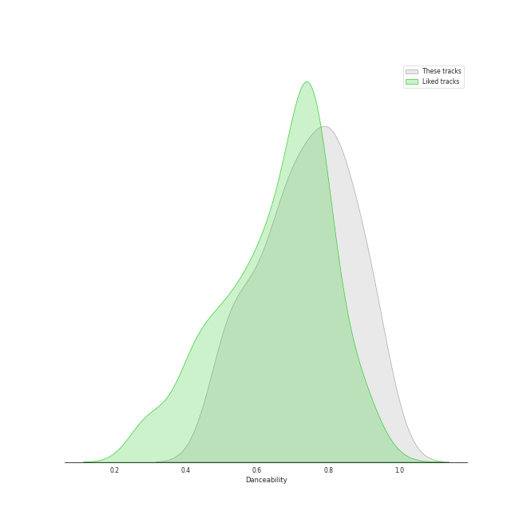
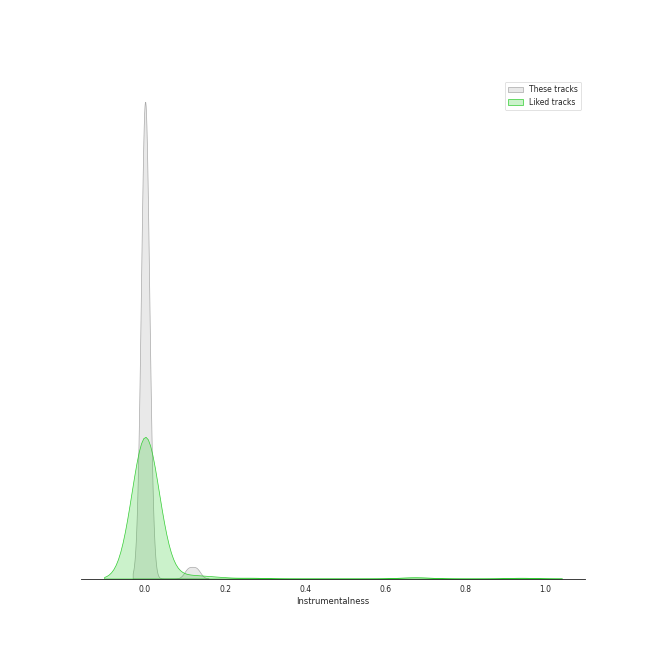
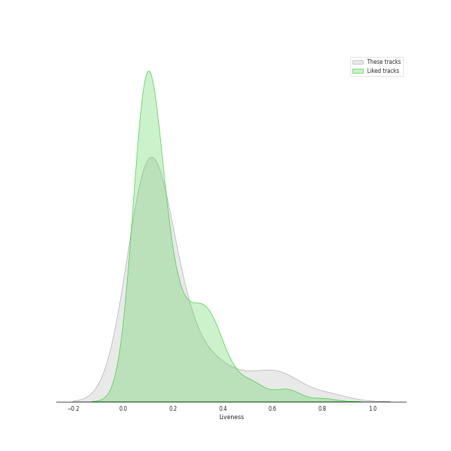
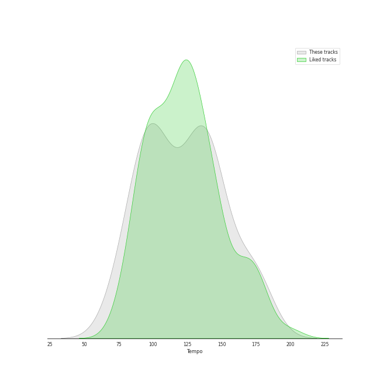

# Track Features for Hip Hop

## Danceability

| ​ | 10 most Danceable tracks | ​​ | 10 least Danceable tracks |
|:---|:---|:---|:---|
|  | Anaconda (0.964) |  | Empire State Of Mind (0.491) |
|  | WAP (feat. Megan Thee Stallion) (0.935) |  | Sucker for Pain (with Wiz Khalifa, Imagine Dragons, Logic & Ty Dolla $ign feat. X Ambassadors) (0.502) |
|  | Baby Got Back (0.926) |  | Get Low (0.521) |
|  | We Made You (0.924) |  | Go DJ (0.525) |
|  | Clout (feat. Cardi B) (0.919) |  | United In Grief (0.529) |
|  | HUMBLE. (0.908) |  | All Of The Lights (0.531) |
|  | Sally Walker (0.905) |  | Dior (0.548) |
|  | Don't Cha (0.877) |  | Can't Tell Me Nothing (0.596) |
|  | Paint The Town Red (0.868) |  | Hello Good Morning (0.616) |
|  | Where Is The Love? (0.834) |  | 1-800-273-8255 (0.62) |

## Energy

| ​ | 10 most Energetic tracks | ​​ | 10 least Energetic tracks |
|:---|:---|:---|:---|
|  | Empire State Of Mind (0.956) |  | Area Codes (0.388) |
|  | Boss Bitch (0.955) |  | Work Out (0.427) |
|  | Hello Good Morning (0.954) |  | Count Me Out (0.431) |
|  | Love The Way You Lie (0.925) |  | WAP (feat. Megan Thee Stallion) (0.454) |
|  | Super Bass (0.861) |  | Momma I Hit A Lick (feat. Kendrick Lamar) (0.467) |
|  | Ni**as In Paris (0.858) |  | Sally Walker (0.492) |
|  | We Made You (0.853) |  | It's A Vibe (0.502) |
|  | The Monster (0.853) |  | Paint The Town Red (0.538) |
|  | United In Grief (0.845) |  | 1-800-273-8255 (0.574) |
|  | Jesus Walks (0.834) |  | No Hands (feat. Roscoe Dash & Wale) (0.595) |

## Speechiness

| ​ | 10 most Speechy tracks | ​​ | 10 least Speechy tracks |
|:---|:---|:---|:---|
|  | Area Codes (0.491) |  | Everyday (0.0378) |
|  | Go DJ (0.404) |  | Can't Tell Me Nothing (0.039) |
|  | United In Grief (0.404) |  | No Hands (feat. Roscoe Dash & Wale) (0.0391) |
|  | Homicide (feat. Eminem) (0.398) |  | 1-800-273-8255 (0.0479) |
|  | Empire State Of Mind (0.392) |  | Get Low (0.067) |
|  | American Boy (0.378) |  | INDUSTRY BABY (feat. Jack Harlow) (0.0672) |
|  | WAP (feat. Megan Thee Stallion) (0.375) |  | The Monster (0.0715) |
|  | Dior (0.351) |  | All Of The Lights (0.0717) |
|  | Gold Digger (0.348) |  | Crank That (Soulja Boy) (0.0786) |
|  | Momma I Hit A Lick (feat. Kendrick Lamar) (0.34) |  | We Made You (0.0792) |

## Acousticness

| ​ | 10 most Acoustic tracks | ​​ | 10 least Acoustic tracks |
|:---|:---|:---|:---|
|  | Count Me Out (0.671) |  | HUMBLE. (0.000282) |
|  | Jesus Walks (0.614) |  | Turn Down for What (0.00107) |
|  | 1-800-273-8255 (0.569) |  | Baby Got Back (0.0051) |
|  | on the street (with J. Cole) (0.532) |  | Don't Cha (0.00516) |
|  | Crank That (Soulja Boy) (0.515) |  | No Hands (feat. Roscoe Dash & Wale) (0.00544) |
|  | Break Ya Neck (0.443) |  | Lose Yourself (0.00922) |
|  | Super Bass (0.269) |  | Can't Tell Me Nothing (0.0122) |
|  | Paint The Town Red (0.269) |  | Sally Walker (0.0177) |
|  | Sucker for Pain (with Wiz Khalifa, Imagine Dragons, Logic & Ty Dolla $ign feat. X Ambassadors) (0.255) |  | Area Codes (0.0187) |
|  | United In Grief (0.244) |  | WAP (feat. Megan Thee Stallion) (0.0194) |

## Instrumentalness

| ​ | 10 most Instrumental tracks | ​​ | 10 least Instrumental tracks |
|:---|:---|:---|:---|
|  | Turn Down for What (0.128) |  | No Hands (feat. Roscoe Dash & Wale) (0.0) |
|  | Break Ya Neck (0.00175) |  | Can't Tell Me Nothing (0.0) |
|  | on the street (with J. Cole) (0.00111) |  | Get Low (0.0) |
|  | It's A Vibe (0.000887) |  | Where Is The Love? (0.0) |
|  | Lose Yourself (0.00072) |  | Love The Way You Lie (0.0) |
|  | Dior (0.000389) |  | Gold Digger (0.0) |
|  | HUMBLE. (5.39e-05) |  | Baby Got Back (0.0) |
|  | Momma I Hit A Lick (feat. Kendrick Lamar) (3.32e-05) |  | Sally Walker (0.0) |
|  | All Of The Lights (1.71e-05) |  | Empire State Of Mind (0.0) |
|  | Anaconda (7.78e-06) |  | Work Out (0.0) |

## Liveness

| ​ | 10 most Live tracks | ​​ | 10 least Live tracks |
|:---|:---|:---|:---|
|  | Can't Tell Me Nothing (0.82) |  | Crank That (Soulja Boy) (0.0468) |
|  | Hello Good Morning (0.669) |  | INDUSTRY BABY (feat. Jack Harlow) (0.0476) |
|  | Sucker for Pain (with Wiz Khalifa, Imagine Dragons, Logic & Ty Dolla $ign feat. X Ambassadors) (0.65) |  | Gold Digger (0.0554) |
|  | Super Bass (0.601) |  | Turn Down for What (0.057) |
|  | Numb / Encore (0.582) |  | Break Ya Neck (0.0613) |
|  | Love The Way You Lie (0.52) |  | American Boy (0.07) |
|  | Empire State Of Mind (0.46) |  | Everyday (0.0761) |
|  | Dior (0.408) |  | WAP (feat. Megan Thee Stallion) (0.0824) |
|  | Lose Yourself (0.365) |  | Alright (0.0827) |
|  | Ni**as In Paris (0.349) |  | Area Codes (0.0876) |

## Valence

| ​ | 10 most Happy tracks | ​​ | 10 least Happy tracks |
|:---|:---|:---|:---|
|  | INDUSTRY BABY (feat. Jack Harlow) (0.892) |  | Lose Yourself (0.059) |
|  | on the street (with J. Cole) (0.813) |  | Turn Down for What (0.0815) |
|  | Empire State Of Mind (0.811) |  | Can't Tell Me Nothing (0.102) |
|  | Where Is The Love? (0.809) |  | Get Low (0.136) |
|  | Crank That (Soulja Boy) (0.803) |  | Work Out (0.216) |
|  | Ni**as In Paris (0.775) |  | All Of The Lights (0.221) |
|  | Homicide (feat. Eminem) (0.77) |  | United In Grief (0.331) |
|  | Numb / Encore (0.751) |  | WAP (feat. Megan Thee Stallion) (0.357) |
|  | Sucker for Pain (with Wiz Khalifa, Imagine Dragons, Logic & Ty Dolla $ign feat. X Ambassadors) (0.739) |  | 1-800-273-8255 (0.357) |
|  | Break Ya Neck (0.737) |  | No Hands (feat. Roscoe Dash & Wale) (0.361) |

## Tempo

| ​ | 10 most Fast tracks | ​​ | 10 least Fast tracks |
|:---|:---|:---|:---|
|  | Momma I Hit A Lick (feat. Kendrick Lamar) (179.974) |  | It's A Vibe (73.003) |
|  | Empire State Of Mind (173.585) |  | Can't Tell Me Nothing (80.029) |
|  | Lose Yourself (171.403) |  | Break Ya Neck (83.011) |
|  | Sucker for Pain (with Wiz Khalifa, Imagine Dragons, Logic & Ty Dolla $ign feat. X Ambassadors) (169.021) |  | United In Grief (85.63) |
|  | Area Codes (154.569) |  | Love The Way You Lie (86.989) |
|  | INDUSTRY BABY (feat. Jack Harlow) (150.087) |  | Jesus Walks (87.312) |
|  | HUMBLE. (150.011) |  | Work Out (93.004) |
|  | Everyday (149.908) |  | Gold Digger (93.034) |
|  | All Of The Lights (142.113) |  | on the street (with J. Cole) (94.074) |
|  | Dior (142.094) |  | Where Is The Love? (94.086) |
