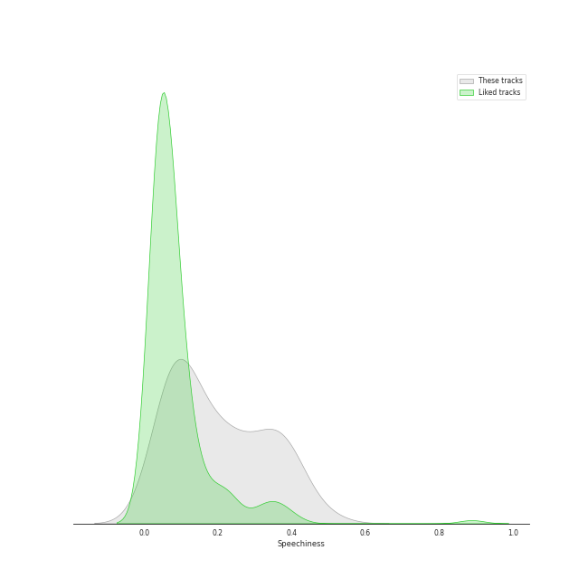
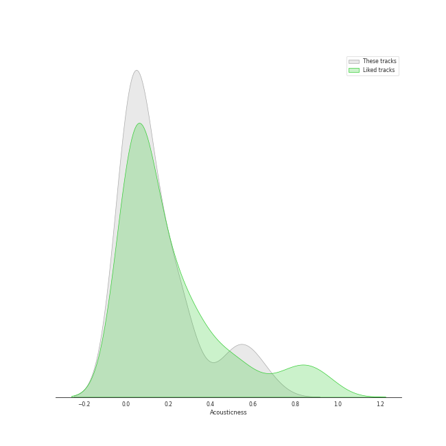
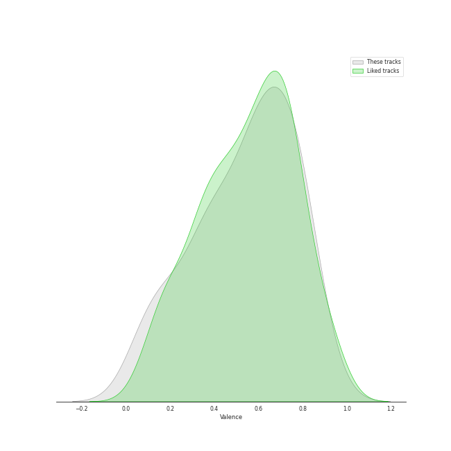

# Audio Features for Hip Hop

## Danceability

| 10 most Danceable tracks | 10 least Danceable tracks |
|:---|:---|
| Anaconda (0.964) | Empire State Of Mind (0.491) |
| WAP (feat. Megan Thee Stallion) (0.935) | Sucker for Pain (with Wiz Khalifa, Imagine Dragons, Logic & Ty Dolla $ign feat. X Ambassadors) (0.502) |
| Baby Got Back (0.926) | Get Low (0.521) |
| We Made You (0.924) | United In Grief (0.529) |
| HUMBLE. (0.908) | All Of The Lights (0.531) |
| Sally Walker (0.905) | Dior (0.548) |
| Don't Cha (0.877) | Can't Tell Me Nothing (0.596) |
| Where Is The Love? (0.834) | Hello Good Morning (0.616) |
| Work Out (0.831) | 1-800-273-8255 (0.62) |
| It's A Vibe (0.822) | Gold Digger (0.629) |

## Energy

| 10 most Energetic tracks | 10 least Energetic tracks |
|:---|:---|
| Empire State Of Mind (0.956) | Work Out (0.427) |
| Boss Bitch (0.955) | Count Me Out (0.431) |
| Hello Good Morning (0.954) | WAP (feat. Megan Thee Stallion) (0.454) |
| Love The Way You Lie (0.925) | Momma I Hit A Lick (feat. Kendrick Lamar) (0.467) |
| Super Bass (0.861) | Sally Walker (0.492) |
| Ni**as In Paris (0.858) | It's A Vibe (0.502) |
| We Made You (0.853) | 1-800-273-8255 (0.574) |
| The Monster (0.853) | No Hands (feat. Roscoe Dash & Wale) (0.595) |
| United In Grief (0.845) | Anaconda (0.605) |
| Jesus Walks (0.834) | Can't Tell Me Nothing (0.62) |

## Speechiness

| 10 most Speechy tracks | 10 least Speechy tracks |
|:---|:---|
| United In Grief (0.404) | Everyday (0.0378) |
| Homicide (feat. Eminem) (0.398) | Can't Tell Me Nothing (0.039) |
| Empire State Of Mind (0.392) | No Hands (feat. Roscoe Dash & Wale) (0.0391) |
| American Boy (0.378) | 1-800-273-8255 (0.0479) |
| WAP (feat. Megan Thee Stallion) (0.375) | Get Low (0.067) |
| Dior (0.351) | INDUSTRY BABY (feat. Jack Harlow) (0.0672) |
| Gold Digger (0.348) | The Monster (0.0715) |
| Momma I Hit A Lick (feat. Kendrick Lamar) (0.34) | All Of The Lights (0.0717) |
| Jesus Walks (0.323) | Crank That (Soulja Boy) (0.0786) |
| Sucker for Pain (with Wiz Khalifa, Imagine Dragons, Logic & Ty Dolla $ign feat. X Ambassadors) (0.317) | We Made You (0.0792) |

## Acousticness

| 10 most Acoustic tracks | 10 least Acoustic tracks |
|:---|:---|
| Count Me Out (0.671) | HUMBLE. (0.000282) |
| Jesus Walks (0.614) | Baby Got Back (0.0051) |
| 1-800-273-8255 (0.569) | Don't Cha (0.00516) |
| on the street (with J. Cole) (0.532) | No Hands (feat. Roscoe Dash & Wale) (0.00544) |
| Crank That (Soulja Boy) (0.515) | Lose Yourself (0.00922) |
| Break Ya Neck (0.443) | Can't Tell Me Nothing (0.0122) |
| Super Bass (0.269) | Sally Walker (0.0177) |
| Sucker for Pain (with Wiz Khalifa, Imagine Dragons, Logic & Ty Dolla $ign feat. X Ambassadors) (0.255) | WAP (feat. Megan Thee Stallion) (0.0194) |
| United In Grief (0.244) | Gold Digger (0.0195) |
| Love The Way You Lie (0.241) | INDUSTRY BABY (feat. Jack Harlow) (0.0221) |

## Instrumentalness

| 10 most Instrumental tracks | 10 least Instrumental tracks |
|:---|:---|
| Break Ya Neck (0.00175) | No Hands (feat. Roscoe Dash & Wale) (0.0) |
| on the street (with J. Cole) (0.00111) | Can't Tell Me Nothing (0.0) |
| It's A Vibe (0.000887) | Get Low (0.0) |
| Lose Yourself (0.00072) | Where Is The Love? (0.0) |
| Dior (0.000389) | Love The Way You Lie (0.0) |
| HUMBLE. (5.39e-05) | Gold Digger (0.0) |
| Momma I Hit A Lick (feat. Kendrick Lamar) (3.32e-05) | Baby Got Back (0.0) |
| All Of The Lights (1.71e-05) | Sally Walker (0.0) |
| Anaconda (7.78e-06) | Empire State Of Mind (0.0) |
| Super Bass (5.11e-06) | Work Out (0.0) |

## Liveness

| 10 most Live tracks | 10 least Live tracks |
|:---|:---|
| Can't Tell Me Nothing (0.82) | Crank That (Soulja Boy) (0.0468) |
| Hello Good Morning (0.669) | INDUSTRY BABY (feat. Jack Harlow) (0.0476) |
| Sucker for Pain (with Wiz Khalifa, Imagine Dragons, Logic & Ty Dolla $ign feat. X Ambassadors) (0.65) | Gold Digger (0.0554) |
| Super Bass (0.601) | Break Ya Neck (0.0613) |
| Numb / Encore (0.582) | American Boy (0.07) |
| Love The Way You Lie (0.52) | Everyday (0.0761) |
| Empire State Of Mind (0.46) | WAP (feat. Megan Thee Stallion) (0.0824) |
| Dior (0.408) | Alright (0.0827) |
| Lose Yourself (0.365) | Baby Got Back (0.0887) |
| Ni**as In Paris (0.349) | on the street (with J. Cole) (0.0921) |

## Valence

| 10 most Happy tracks | 10 least Happy tracks |
|:---|:---|
| INDUSTRY BABY (feat. Jack Harlow) (0.892) | Lose Yourself (0.059) |
| on the street (with J. Cole) (0.813) | Can't Tell Me Nothing (0.102) |
| Empire State Of Mind (0.811) | Get Low (0.136) |
| Where Is The Love? (0.809) | Work Out (0.216) |
| Crank That (Soulja Boy) (0.803) | All Of The Lights (0.221) |
| Ni**as In Paris (0.775) | United In Grief (0.331) |
| Homicide (feat. Eminem) (0.77) | WAP (feat. Megan Thee Stallion) (0.357) |
| Numb / Encore (0.751) | 1-800-273-8255 (0.357) |
| Sucker for Pain (with Wiz Khalifa, Imagine Dragons, Logic & Ty Dolla $ign feat. X Ambassadors) (0.739) | No Hands (feat. Roscoe Dash & Wale) (0.361) |
| Break Ya Neck (0.737) | Momma I Hit A Lick (feat. Kendrick Lamar) (0.4) |

## Tempo

| 10 most Fast tracks | 10 least Fast tracks |
|:---|:---|
| Momma I Hit A Lick (feat. Kendrick Lamar) (179.974) | It's A Vibe (73.003) |
| Empire State Of Mind (173.585) | Can't Tell Me Nothing (80.029) |
| Lose Yourself (171.403) | Break Ya Neck (83.011) |
| Sucker for Pain (with Wiz Khalifa, Imagine Dragons, Logic & Ty Dolla $ign feat. X Ambassadors) (169.021) | United In Grief (85.63) |
| INDUSTRY BABY (feat. Jack Harlow) (150.087) | Love The Way You Lie (86.989) |
| HUMBLE. (150.011) | Jesus Walks (87.312) |
| Everyday (149.908) | Work Out (93.004) |
| All Of The Lights (142.113) | Gold Digger (93.034) |
| Dior (142.094) | on the street (with J. Cole) (94.074) |
| Crank That (Soulja Boy) (140.141) | Where Is The Love? (94.086) |
