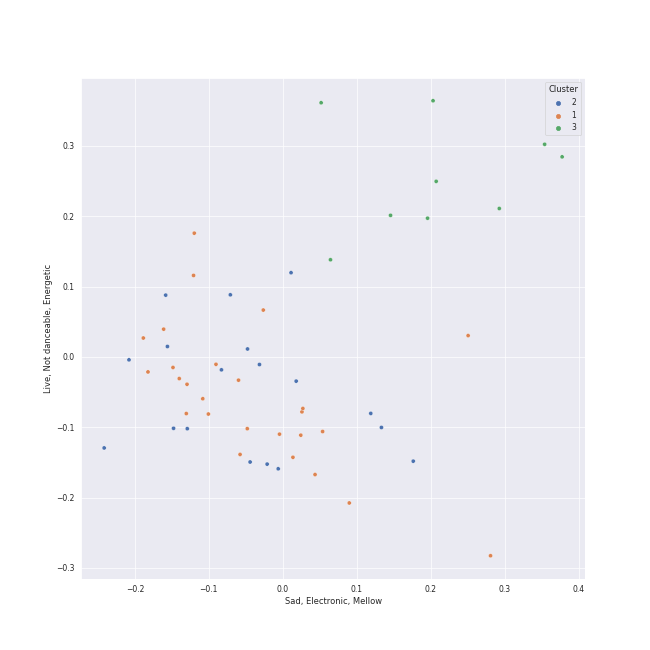

# Clusters in Hip Hop

## Cluster #1

14 tracks

| Art | Track | Album | Artists | Label | Score | 💚 | 🔗 |
|:---|:---|:---|:---|:---|---:|:---|:---|
|  | Paint The Town Red | Paint The Town Red | [Doja Cat](../../../../artists/doja_cat/overview.md) | [Kemosabe Records/RCA Records](../../../../labels/rca_records_label) | 0 | 💚 | [🔗](https://open.spotify.com/track/2IGMVunIBsBLtEQyoI1Mu7) |
|  | Boss Bitch | Boss Bitch | [Doja Cat](../../../../artists/doja_cat/overview.md) | [Atlantic Records](../../../../labels/atlantic_records) | 0 | 💚 | [🔗](https://open.spotify.com/track/78qd8dvwea0Gosb6Fe6j3k) |
|  | Where Is The Love? | Elephunk | Black Eyed Peas | A&M | 0 | 💚 | [🔗](https://open.spotify.com/track/0xmjwnQ3FNE6HuWCt2nHdZ) |
|  | The Monster | The Marshall Mathers LP2 | [Eminem](../../../../artists/eminem/overview.md), [Rihanna](../../../../artists/rihanna/overview.md) | [Aftermath](../../../../labels/aftermath) | 80 | 💚 | [🔗](https://open.spotify.com/track/48RrDBpOSSl1aLVCalGl5C) |
|  | We Made You | Relapse: Refill | [Eminem](../../../../artists/eminem/overview.md) | [Aftermath](../../../../labels/aftermath) | 28 | 💚 | [🔗](https://open.spotify.com/track/4UMTp91LHhvW33ol9ZQH0Q) |
|  | Count Me Out | Mr. Morale & The Big Steppers | [Kendrick Lamar](../../../../artists/kendrick_lamar/overview.md) | Top Dawg Entertainment, [Aftermath](../../../../labels/aftermath), [Interscope Records](../../../../labels/interscope_records), pgLang | 0 | 💚 | [🔗](https://open.spotify.com/track/6BU1RZexmvJcBjgagVVt3M) |
|  | Homicide (feat. Eminem) | Confessions of a Dangerous Mind | Logic, [Eminem](../../../../artists/eminem/overview.md) | [Def Jam Recordings](../../../../labels/def_jam_recordings) | 0 | | [🔗](https://open.spotify.com/track/7M2tXmeS15NAzEn7ABFeBg) |
|  | Go DJ (feat. SiR) | BUBBA | KAYTRANADA, SiR | [KAYTRANADA/RCA Records](../../../../labels/rca_records_label) | 3 | | [🔗](https://open.spotify.com/track/5goFCtUGQHU4kQuwIupc5D) |
|  | Crank That (Soulja Boy) | souljaboytellem.com | Soulja Boy | [Collipark / Interscope](../../../../labels/interscope_records) | 0 | | [🔗](https://open.spotify.com/track/66TRwr5uJwPt15mfFkzhbi) |
|  | Break Ya Neck | Genesis | Busta Rhymes | [J Records/Legacy](../../../../labels/legacy) | 0 | | [🔗](https://open.spotify.com/track/7gKgd0P3dAAePiSQQBqrlf) |
## Cluster #2

23 tracks

| Art | Track | Album | Artists | Label | Score | 💚 | 🔗 |
|:---|:---|:---|:---|:---|---:|:---|:---|
|  | No Hands (feat. Roscoe Dash & Wale) | Flockaveli | Waka Flocka Flame, Roscoe Dash, Wale | [Asylum/Warner Records](../../../../labels/warner_records) | 0 | 💚 | [🔗](https://open.spotify.com/track/03tqyYWC9Um2ZqU0ZN849H) |
|  | Don't Cha | PCD | The Pussycat Dolls, Busta Rhymes | Pussycat Dolls | 0 | 💚 | [🔗](https://open.spotify.com/track/1gZ7i4qxXkHZb1r6eioaAP) |
|  | WAP (feat. Megan Thee Stallion) | WAP (feat. Megan Thee Stallion) | Cardi B, Megan Thee Stallion | [Atlantic/KSR](../../../../labels/atlantic_records) | 0 | 💚 | [🔗](https://open.spotify.com/track/4Oun2ylbjFKMPTiaSbbCih) |
|  | Alright | To Pimp A Butterfly | [Kendrick Lamar](../../../../artists/kendrick_lamar/overview.md) | [Aftermath](../../../../labels/aftermath) | 0 | | [🔗](https://open.spotify.com/track/3iVcZ5G6tvkXZkZKlMpIUs) |
|  | DNA. | DAMN. | [Kendrick Lamar](../../../../artists/kendrick_lamar/overview.md) | [Aftermath](../../../../labels/aftermath) | 0 | 💚 | [🔗](https://open.spotify.com/track/6HZILIRieu8S0iqY8kIKhj) |
|  | HUMBLE. | DAMN. | [Kendrick Lamar](../../../../artists/kendrick_lamar/overview.md) | [Aftermath](../../../../labels/aftermath) | 0 | | [🔗](https://open.spotify.com/track/7KXjTSCq5nL1LoYtL7XAwS) |
|  | Everyday | Bobby Tarantino II | Logic, Marshmello | [Def Jam Recordings](../../../../labels/def_jam_recordings) | 0 | | [🔗](https://open.spotify.com/track/4EAV2cKiqKP5UPZmY6dejk) |
|  | Clout (feat. Cardi B) | FATHER OF 4 | Offset, Cardi B | [Quality Control Music/Motown Records](../../../../labels/motown) | 0 | 💚 | [🔗](https://open.spotify.com/track/59ywHNwwchG4nZJMLyxSzd) |
|  | It's A Vibe | Pretty Girls Like Trap Music | 2 Chainz, Ty Dolla $ign, Trey Songz, Jhené Aiko | 2Chainz PS/Def Jam | 0 | | [🔗](https://open.spotify.com/track/6H0AwSQ20mo62jGlPGB8S6) |
|  | Momma I Hit A Lick (feat. Kendrick Lamar) | Rap Or Go To The League | 2 Chainz, [Kendrick Lamar](../../../../artists/kendrick_lamar/overview.md) | [Gamebread, LLC / Def Jam Recordings](../../../../labels/def_jam_recordings) | 0 | | [🔗](https://open.spotify.com/track/7jKUnzzOGhAlPjr7LkIUlE) |
## Cluster #3

10 tracks

| Art | Track | Album | Artists | Label | Score | 💚 | 🔗 |
|:---|:---|:---|:---|:---|---:|:---|:---|
|  | Can't Tell Me Nothing | Graduation | Kanye West | Roc-A-Fella | 0 | 💚 | [🔗](https://open.spotify.com/track/0mEdbdeRFQwBhN4xfyIeUM) |
|  | Love The Way You Lie | Recovery | [Eminem](../../../../artists/eminem/overview.md), [Rihanna](../../../../artists/rihanna/overview.md) | [Aftermath](../../../../labels/aftermath) | 0 | 💚 | [🔗](https://open.spotify.com/track/15JINEqzVMv3SvJTAXAKED) |
|  | Ni**as In Paris | Watch The Throne | JAY-Z, Kanye West | Roc Nation/RocAFella/IDJ | 0 | | [🔗](https://open.spotify.com/track/1auxYwYrFRqZP7t3s7w4um) |
|  | Empire State Of Mind | The Blueprint 3 | JAY-Z, Alicia Keys | Roc Nation / Jay-Z | 0 | | [🔗](https://open.spotify.com/track/2igwFfvr1OAGX9SKDCPBwO) |
|  | Ni**as In Paris | Watch The Throne (Deluxe) | JAY-Z, Kanye West | Roc Nation/RocAFella/IDJ | 0 | | [🔗](https://open.spotify.com/track/4Li2WHPkuyCdtmokzW2007) |
|  | Numb / Encore | Numb / Encore: MTV Ultimate Mash-Ups Presents Collision Course | JAY-Z, Linkin Park | [Warner Records/Roc-A-Fella](../../../../labels/warner_records) | 0 | | [🔗](https://open.spotify.com/track/5sNESr6pQfIhL3krM8CtZn) |
|  | Super Bass | Pink Friday | Nicki Minaj | Nicki Minaj/Cash Money | 0 | 💚 | [🔗](https://open.spotify.com/track/2jSwKQBouf0brIcxGfA9CZ) |
|  | Sucker for Pain (with Wiz Khalifa, Imagine Dragons, Logic & Ty Dolla $ign feat. X Ambassadors) | Sucker for Pain (with Logic & Ty Dolla $ign feat. X Ambassadors) | Lil Wayne, Wiz Khalifa, Imagine Dragons, X Ambassadors, Logic, Ty Dolla $ign | [Atlantic Records](../../../../labels/atlantic_records) | 0 | | [🔗](https://open.spotify.com/track/4dASQiO1Eoo3RJvt74FtXB) |
|  | Dior | Meet The Woo | Pop Smoke | [Victor Victor Worldwide/Republic Records](../../../../labels/republic_records) | 0 | | [🔗](https://open.spotify.com/track/79s5XnCN4TJKTVMSmOx8Ep) |
|  | Hello Good Morning | Last Train To Paris | Diddy - Dirty Money, T.I. | [Bad Boy](../../../../labels/bad_boy), [Interscope Records](../../../../labels/interscope_records) | 0 | 💚 | [🔗](https://open.spotify.com/track/7yzSijmAyOMBcHrK6Tfsoe) |