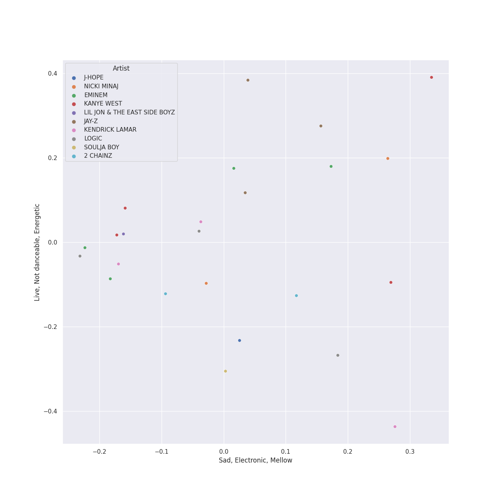
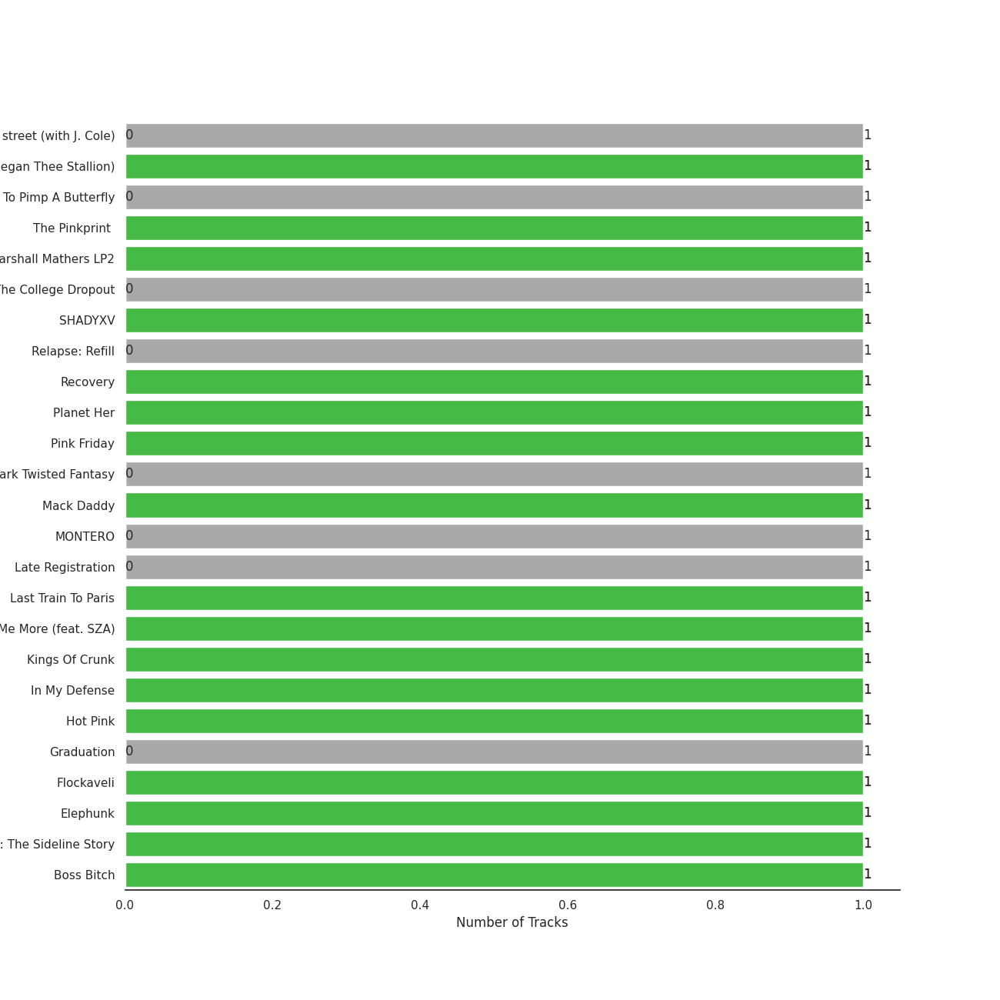
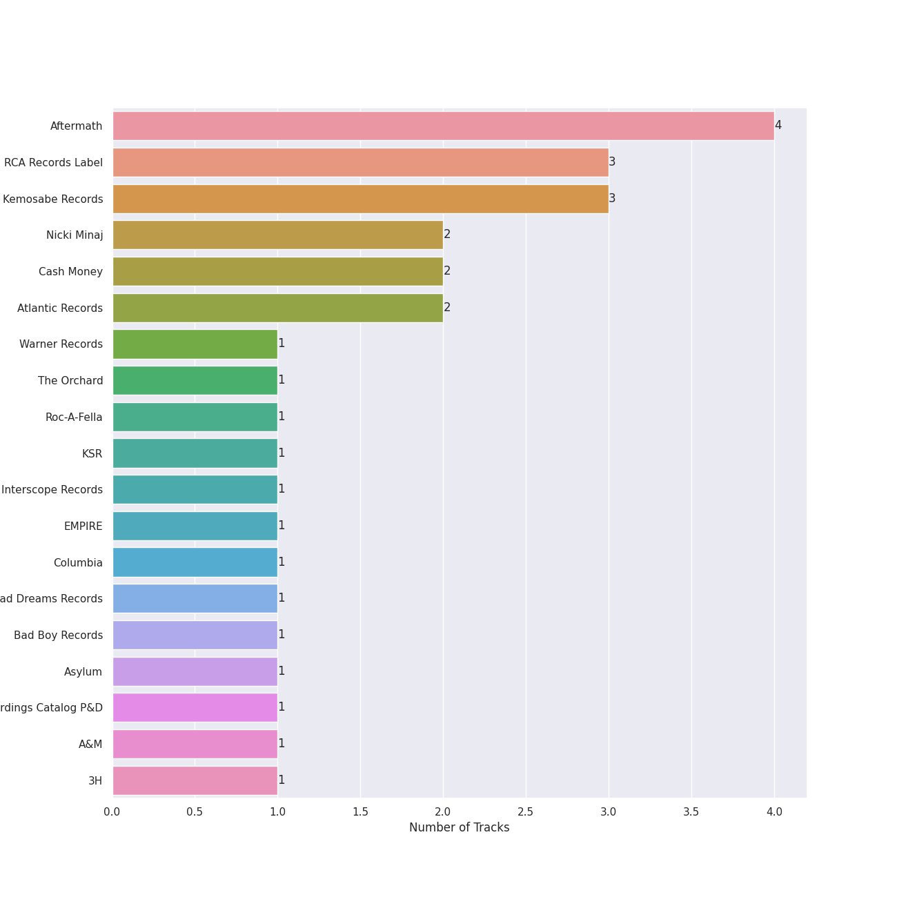
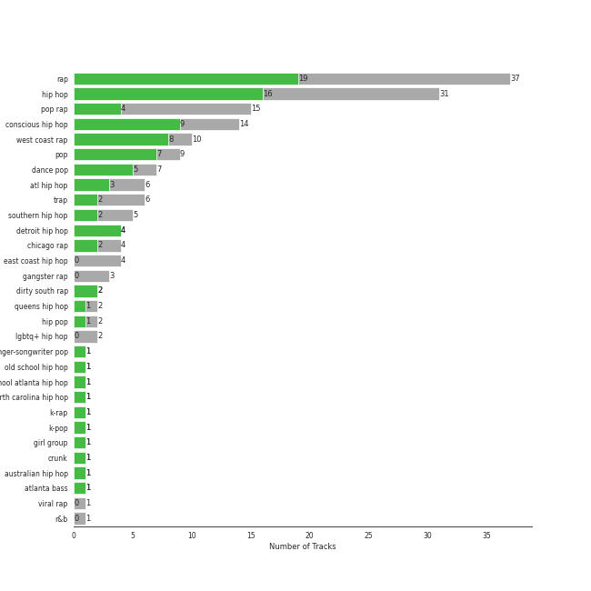
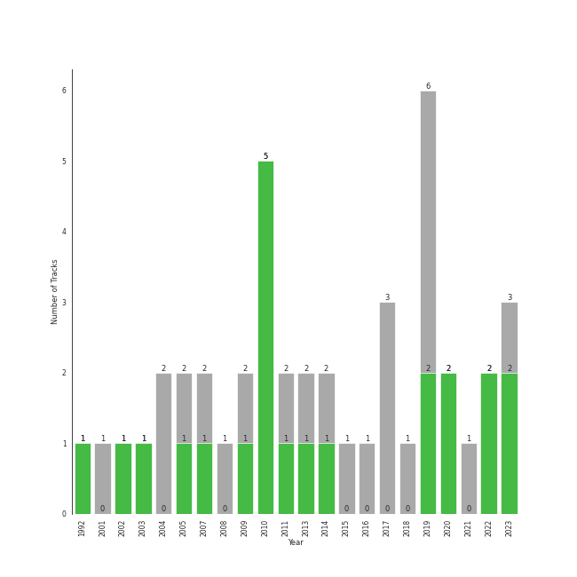

# Hip Hop

[34 songs (16 liked)](tracks.md)

## Top Artists

See all 41 artists

| Art | Tracks | 💚 | Artist | 🔗 |
|:---|---:|---:|:---|:---|
|  | 5 | 3 | Eminem | [🔗](https://open.spotify.com/artist/7dGJo4pcD2V6oG8kP0tJRR) |
|  | 5 | 2 | Kanye West | [🔗](https://open.spotify.com/artist/5K4W6rqBFWDnAN6FQUkS6x) |
|  | 4 | 0 | Logic | [🔗](https://open.spotify.com/artist/4xRYI6VqpkE3UwrDrAZL8L) |
|  | 3 | 0 | JAY-Z | [🔗](https://open.spotify.com/artist/3nFkdlSjzX9mRTtwJOzDYB) |
|  | 2 | 2 | [Rihanna](../../artists/rihanna) | [🔗](https://open.spotify.com/artist/5pKCCKE2ajJHZ9KAiaK11H) |
|  | 2 | 2 | Nicki Minaj | [🔗](https://open.spotify.com/artist/0hCNtLu0JehylgoiP8L4Gh) |
|  | 2 | 1 | J. Cole | [🔗](https://open.spotify.com/artist/6l3HvQ5sa6mXTsMTB19rO5) |
|  | 2 | 0 | Ty Dolla $ign | [🔗](https://open.spotify.com/artist/7c0XG5cIJTrrAgEC3ULPiq) |
|  | 2 | 0 | Kendrick Lamar | [🔗](https://open.spotify.com/artist/2YZyLoL8N0Wb9xBt1NhZWg) |
|  | 2 | 0 | Busta Rhymes | [🔗](https://open.spotify.com/artist/1YfEcTuGvBQ8xSD1f53UnK) |
|  | 2 | 0 | 2 Chainz | [🔗](https://open.spotify.com/artist/17lzZA2AlOHwCwFALHttmp) |
|  | 1 | 1 | Waka Flocka Flame | [🔗](https://open.spotify.com/artist/6f4XkbvYlXMH0QgVRzW0sM) |
|  | 1 | 1 | Wale | [🔗](https://open.spotify.com/artist/67nwj3Y5sZQLl72VNUHEYE) |
|  | 1 | 1 | Iggy Azalea | [🔗](https://open.spotify.com/artist/5yG7ZAZafVaAlMTeBybKAL) |
|  | 1 | 1 | Doja Cat | [🔗](https://open.spotify.com/artist/5cj0lLjcoR7YOSnhnX0Po5) |
|  | 1 | 1 | Cardi B | [🔗](https://open.spotify.com/artist/4kYSro6naA4h99UJvo89HB) |
|  | 1 | 1 | T.I. | [🔗](https://open.spotify.com/artist/4OBJLual30L7gRl5UkeRcT) |
|  | 1 | 1 | Ying Yang Twins | [🔗](https://open.spotify.com/artist/44PA0rCQXikgOWbfY7Fq7m) |
|  | 1 | 1 | Lil Jon & The East Side Boyz | [🔗](https://open.spotify.com/artist/3ciRvbBIVz9fBoPbtSYq4x) |
|  | 1 | 1 | Sir Mix-A-Lot | [🔗](https://open.spotify.com/artist/3TQ9JTBI2n2hfo7aRONEYV) |
|  | 1 | 1 | Diddy - Dirty Money | [🔗](https://open.spotify.com/artist/2QYEvpsWUOjqaYuxDPTCmV) |
|  | 1 | 1 | Black Eyed Peas | [🔗](https://open.spotify.com/artist/1yxSLGMDHlW21z4YXirZDS) |
|  | 1 | 1 | Megan Thee Stallion | [🔗](https://open.spotify.com/artist/181bsRPaVXVlUKXrxwZfHK) |
|  | 1 | 1 | Roscoe Dash | [🔗](https://open.spotify.com/artist/0bfX8pF8kuHNCs57Ms4jZb) |
|  | 1 | 0 | Lil Nas X | [🔗](https://open.spotify.com/artist/7jVv8c5Fj3E9VhNjxT4snq) |
|  | 1 | 0 | Jamie Foxx | [🔗](https://open.spotify.com/artist/7LnaAXbDVIL75IVPnndf7w) |
|  | 1 | 0 | The Pussycat Dolls | [🔗](https://open.spotify.com/artist/6wPhSqRtPu1UhRCDX5yaDJ) |
|  | 1 | 0 | Linkin Park | [🔗](https://open.spotify.com/artist/6XyY86QOPPrYVGvF9ch6wz) |
|  | 1 | 0 | Khalid | [🔗](https://open.spotify.com/artist/6LuN9FCkKOj5PcnpouEgny) |
|  | 1 | 0 | Soulja Boy | [🔗](https://open.spotify.com/artist/6GMYJwaziB4ekv1Y6wCDWS) |
|  | 1 | 0 | Marshmello | [🔗](https://open.spotify.com/artist/64KEffDW9EtZ1y2vBYgq8T) |
|  | 1 | 0 | Jhené Aiko | [🔗](https://open.spotify.com/artist/5ZS223C6JyBfXasXxrRqOk) |
|  | 1 | 0 | Lil Wayne | [🔗](https://open.spotify.com/artist/55Aa2cqylxrFIXC767Z865) |
|  | 1 | 0 | Imagine Dragons | [🔗](https://open.spotify.com/artist/53XhwfbYqKCa1cC15pYq2q) |
|  | 1 | 0 | X Ambassadors | [🔗](https://open.spotify.com/artist/3NPpFNZtSTHheNBaWC82rB) |
|  | 1 | 0 | Alicia Keys | [🔗](https://open.spotify.com/artist/3DiDSECUqqY1AuBP8qtaIa) |
|  | 1 | 0 | Alessia Cara | [🔗](https://open.spotify.com/artist/2wUjUUtkb5lvLKcGKsKqsR) |
|  | 1 | 0 | Trey Songz | [🔗](https://open.spotify.com/artist/2iojnBLj0qIMiKPvVhLnsH) |
|  | 1 | 0 | Jack Harlow | [🔗](https://open.spotify.com/artist/2LIk90788K0zvyj2JJVwkJ) |
|  | 1 | 0 | Wiz Khalifa | [🔗](https://open.spotify.com/artist/137W8MRPWKqSmrBGDBFSop) |
|  | 1 | 0 | j-hope | [🔗](https://open.spotify.com/artist/0b1sIQumIAsNbqAoIClSpy) |

## Top Albums

See all 34 albums

| Art | Tracks | 💚 | Album | Release Date | 🔗 |
|:---|---:|---:|:---|:---|:---|
|  | 1 | 1 | WAP (feat. Megan Thee Stallion) | 2020-08-07 | [🔗](https://open.spotify.com/album/2ogiazbrNEx0kQHGl5ZBTQ) |
|  | 1 | 1 | The Pinkprint (Deluxe) | 2014-12-15 | [🔗](https://open.spotify.com/album/5ooCuPIk58IwSo6DRr1JCu) |
|  | 1 | 1 | The Marshall Mathers LP2 | 2013-11-05 | [🔗](https://open.spotify.com/album/3vOgbDjgsZBAPwV2M3bNOj) |
|  | 1 | 1 | SHADYXV | 2014-11-24 | [🔗](https://open.spotify.com/album/6wdSf72duVewXTqhYU3Z87) |
|  | 1 | 1 | Recovery | 2010-06-18 | [🔗](https://open.spotify.com/album/47BiFcV59TQi2s9SkBo2pb) |
|  | 1 | 1 | Pink Friday | 2010-01-01 | [🔗](https://open.spotify.com/album/5jem47f4IRH6UaxNAWO6vD) |
|  | 1 | 1 | My Beautiful Dark Twisted Fantasy | 2010-11-22 | [🔗](https://open.spotify.com/album/20r762YmB5HeofjMCiPMLv) |
|  | 1 | 1 | Mack Daddy | 1992-01-01 | [🔗](https://open.spotify.com/album/6c62jxWCe2aisIudaDRcaP) |
|  | 1 | 1 | Last Train To Paris | 2010-01-01 | [🔗](https://open.spotify.com/album/2psjRixnoePs8ZqE8cuU5Z) |
|  | 1 | 1 | Kings Of Crunk | 2002-10-29 | [🔗](https://open.spotify.com/album/4htcOW08TqINNLbcSf9esI) |
|  | 1 | 1 | In My Defense | 2019-07-19 | [🔗](https://open.spotify.com/album/3kQvfhjfU6Mleis6k6vpmw) |
|  | 1 | 1 | Graduation | 2007-09-11 | [🔗](https://open.spotify.com/album/4SZko61aMnmgvNhfhgTuD3) |
|  | 1 | 1 | Flockaveli | 2010-10-01 | [🔗](https://open.spotify.com/album/6MQtWELG7aRX7CkAzQ6nLM) |
|  | 1 | 1 | Elephunk | 2003-06-24 | [🔗](https://open.spotify.com/album/3eqkfT9f1XyM8GME1gVDrD) |
|  | 1 | 1 | Cole World: The Sideline Story | 2011-09-27 | [🔗](https://open.spotify.com/album/0fhmJYVhW0e4i33pCLPA5i) |
|  | 1 | 1 | Boss Bitch | 2020-01-23 | [🔗](https://open.spotify.com/album/4pmyFpGicLLIgNPc1TQXKc) |
|  | 1 | 0 | souljaboytellem.com | 2007-01-01 | [🔗](https://open.spotify.com/album/5wFQi4xOTXILQSKQr0Ft8s) |
|  | 1 | 0 | on the street (with J. Cole) | 2023-03-03 | [🔗](https://open.spotify.com/album/70xdtgH5XuYTqBNdNbUwGO) |
|  | 1 | 0 | Watch The Throne (Deluxe) | 2011-08-08 | [🔗](https://open.spotify.com/album/2P2Xwvh2xWXIZ1OWY9S9o5) |
|  | 1 | 0 | To Pimp A Butterfly | 2015-03-16 | [🔗](https://open.spotify.com/album/7ycBtnsMtyVbbwTfJwRjSP) |
|  | 1 | 0 | The College Dropout | 2004-02-10 | [🔗](https://open.spotify.com/album/4Uv86qWpGTxf7fU7lG5X6F) |
|  | 1 | 0 | The Blueprint 3 | 2009-09-08 | [🔗](https://open.spotify.com/album/2CUT0104gySOIvqwtXeFsX) |
|  | 1 | 0 | Sucker for Pain (with Logic & Ty Dolla $ign feat. X Ambassadors) | 2016-06-24 | [🔗](https://open.spotify.com/album/704GHNtZhEe9TBgleCNNGv) |
|  | 1 | 0 | Relapse: Refill | 2009-05-15 | [🔗](https://open.spotify.com/album/7MZzYkbHL9Tk3O6WeD4Z0Z) |
|  | 1 | 0 | Rap Or Go To The League | 2019-03-01 | [🔗](https://open.spotify.com/album/1BR69wIifGZUSimcuTjWVg) |
|  | 1 | 0 | Pretty Girls Like Trap Music | 2017-06-16 | [🔗](https://open.spotify.com/album/5vvvo79z68vWj9yimoygfS) |
|  | 1 | 0 | PCD | 2005-01-01 | [🔗](https://open.spotify.com/album/5x8e8UcCeOgrOzSnDGuPye) |
|  | 1 | 0 | Numb / Encore: MTV Ultimate Mash-Ups Presents Collision Course | 2004-11-30 | [🔗](https://open.spotify.com/album/4lhyg7YGQagE8FT8cZBqyw) |
|  | 1 | 0 | MONTERO | 2021-09-17 | [🔗](https://open.spotify.com/album/6pOiDiuDQqrmo5DbG0ZubR) |
|  | 1 | 0 | Late Registration | 2005-08-30 | [🔗](https://open.spotify.com/album/5ll74bqtkcXlKE7wwkMq4g) |
|  | 1 | 0 | Genesis | 2001-11-07 | [🔗](https://open.spotify.com/album/6cj1gdwhr2MVJr9YnWghUd) |
|  | 1 | 0 | Everybody | 2017-05-05 | [🔗](https://open.spotify.com/album/1HiN2YXZcc3EjmVZ4WjfBk) |
|  | 1 | 0 | Confessions of a Dangerous Mind | 2019-05-10 | [🔗](https://open.spotify.com/album/0XLwImzaZEtqHE4NHAepDz) |
|  | 1 | 0 | Bobby Tarantino II | 2018-03-09 | [🔗](https://open.spotify.com/album/4F87p1aiFwHeU4uu65MaPV) |

## Top Record Labels

See all 30 labels

| Tracks | 💚 | Label |
|---:|---:|:---|
| 5 | 2 | Roc-A-Fella |
| 4 | 2 | Aftermath |
| 4 | 0 | [Def Jam Recordings](../../labels/def_jam_recordings) |
| 3 | 2 | [Atlantic Records](../../labels/atlantic_records) |
| 3 | 1 | Roc Nation |
| 2 | 2 | Nicki Minaj |
| 2 | 2 | Cash Money |
| 2 | 1 | [Warner Records](../../labels/warner_records) |
| 2 | 1 | [Interscope Records](../../labels/interscope_records) |
| 1 | 1 | The Orchard |
| 1 | 1 | KSR |
| 1 | 1 | EMPIRE |
| 1 | 1 | Bad Dreams Records |
| 1 | 1 | Bad Boy |
| 1 | 1 | Asylum |
| 1 | 1 | American Recordings Catalog P&D |
| 1 | 1 | A&M |
| 1 | 1 | 3H |
| 1 | 0 | RocAFella |
| 1 | 0 | Pussycat Dolls |
| 1 | 0 | [Legacy](../../labels/legacy) |
| 1 | 0 | Jay-Z |
| 1 | 0 | J Records |
| 1 | 0 | IDJ |
| 1 | 0 | Gamebread |
| 1 | 0 | Def Jam |
| 1 | 0 | [Columbia](../../labels/columbia) |
| 1 | 0 | Collipark |
| 1 | 0 | [BIGHIT MUSIC](../../labels/bighit_music) |
| 1 | 0 | 2Chainz PS |

## Genres

See all 34 genres

| Tracks | 💚 | Genre |
|---:|---:|:---|
| 28 | 13 | rap |
| 18 | 6 | hip hop |
| 12 | 4 | pop rap |
| 8 | 6 | [pop](../../genres/pop) |
| 8 | 6 | [dance pop](../../genres/dance_pop) |
| 6 | 2 | trap |
| 5 | 4 | hip pop |
| 5 | 3 | gangster rap |
| 5 | 2 | southern hip hop |
| 5 | 2 | atl hip hop |
| 5 | 1 | conscious hip hop |
| 4 | 3 | detroit hip hop |
| 4 | 2 | chicago rap |
| 4 | 0 | east coast hip hop |
| 3 | 2 | dirty south rap |
| 3 | 0 | dmv rap |
| 2 | 2 | queens hip hop |
| 2 | 1 | [post-teen pop](../../genres/post_teen_pop) |
| 1 | 1 | old school hip hop |
| 1 | 1 | old school atlanta hip hop |
| 1 | 1 | north carolina hip hop |
| 1 | 1 | electro |
| 1 | 1 | crunk |
| 1 | 1 | australian hip hop |
| 1 | 1 | atlanta bass |
| 1 | 0 | west coast rap |
| 1 | 0 | urban contemporary |
| 1 | 0 | new orleans rap |
| 1 | 0 | lgbtq+ hip hop |
| 1 | 0 | k-rap |
| 1 | 0 | [k-pop](../../genres/k_pop) |
| 1 | 0 | hardcore hip hop |
| 1 | 0 | girl group |
| 1 | 0 | chicago bop |

## Years

| 10 newest albums | 10 oldest albums |
|:---|:---|
| 
 on the street (with J. Cole) (2023-03-03)
 | 
 Mack Daddy (1992-01-01)
 |
| 
 MONTERO (2021-09-17)
 | 
 Genesis (2001-11-07)
 |
| 
 WAP (feat. Megan Thee Stallion) (2020-08-07)
 | 
 Kings Of Crunk (2002-10-29)
 |
| 
 Boss Bitch (2020-01-23)
 | 
 Elephunk (2003-06-24)
 |
| 
 In My Defense (2019-07-19)
 | 
 The College Dropout (2004-02-10)
 |
| 
 Confessions of a Dangerous Mind (2019-05-10)
 | 
 Numb / Encore: MTV Ultimate Mash-Ups Presents Collision Course (2004-11-30)
 |
| 
 Rap Or Go To The League (2019-03-01)
 | 
 PCD (2005-01-01)
 |
| 
 Bobby Tarantino II (2018-03-09)
 | 
 Late Registration (2005-08-30)
 |
| 
 Pretty Girls Like Trap Music (2017-06-16)
 | 
 souljaboytellem.com (2007-01-01)
 |
| 
 Everybody (2017-05-05)
 | 
 Graduation (2007-09-11)
 |
## Audio Features

| 10 most Danceable tracks | 10 least Danceable tracks |
|:---|:---|
| Anaconda (0.964) | Empire State Of Mind (0.491) |
| WAP (feat. Megan Thee Stallion) (0.935) | Sucker for Pain (with Wiz Khalifa, Imagine Dragons, Logic & Ty Dolla $ign feat. X Ambassadors) (0.502) |
| Baby Got Back (0.926) | Get Low (0.521) |
| We Made You (0.924) | All Of The Lights (0.531) |
| Sally Walker (0.905) | Can't Tell Me Nothing (0.596) |
| Don't Cha (0.877) | Hello Good Morning (0.616) |
| Where Is The Love? (0.834) | 1-800-273-8255 (0.62) |
| Work Out (0.831) | Gold Digger (0.629) |
| It's A Vibe (0.822) | Jesus Walks (0.637) |
| Break Ya Neck (0.82) | Everyday (0.667) |

| 10 most Energetic tracks | 10 least Energetic tracks |
|:---|:---|
| Empire State Of Mind (0.956) | Work Out (0.427) |
| Boss Bitch (0.955) | WAP (feat. Megan Thee Stallion) (0.454) |
| Hello Good Morning (0.954) | Momma I Hit A Lick (feat. Kendrick Lamar) (0.467) |
| Love The Way You Lie (0.925) | Sally Walker (0.492) |
| Super Bass (0.861) | It's A Vibe (0.502) |
| Ni**as In Paris (0.858) | 1-800-273-8255 (0.574) |
| We Made You (0.853) | No Hands (feat. Roscoe Dash & Wale) (0.595) |
| The Monster (0.853) | Anaconda (0.605) |
| Jesus Walks (0.834) | Can't Tell Me Nothing (0.62) |
| on the street (with J. Cole) (0.821) | Get Low (0.625) |

| 10 most Speechy tracks | 10 least Speechy tracks |
|:---|:---|
| Homicide (feat. Eminem) (0.398) | Everyday (0.0378) |
| Empire State Of Mind (0.392) | Can't Tell Me Nothing (0.039) |
| WAP (feat. Megan Thee Stallion) (0.375) | No Hands (feat. Roscoe Dash & Wale) (0.0391) |
| Gold Digger (0.348) | 1-800-273-8255 (0.0479) |
| Momma I Hit A Lick (feat. Kendrick Lamar) (0.34) | Get Low (0.067) |
| Jesus Walks (0.323) | INDUSTRY BABY (feat. Jack Harlow) (0.0672) |
| Sucker for Pain (with Wiz Khalifa, Imagine Dragons, Logic & Ty Dolla $ign feat. X Ambassadors) (0.317) | The Monster (0.0715) |
| Ni**as In Paris (0.311) | All Of The Lights (0.0717) |
| Baby Got Back (0.301) | Crank That (Soulja Boy) (0.0786) |
| Lose Yourself (0.267) | We Made You (0.0792) |

| 10 most Acoustic tracks | 10 least Acoustic tracks |
|:---|:---|
| Jesus Walks (0.614) | Baby Got Back (0.0051) |
| 1-800-273-8255 (0.569) | Don't Cha (0.00516) |
| on the street (with J. Cole) (0.532) | No Hands (feat. Roscoe Dash & Wale) (0.00544) |
| Crank That (Soulja Boy) (0.515) | Lose Yourself (0.00922) |
| Break Ya Neck (0.443) | Can't Tell Me Nothing (0.0122) |
| Super Bass (0.269) | Sally Walker (0.0177) |
| Sucker for Pain (with Wiz Khalifa, Imagine Dragons, Logic & Ty Dolla $ign feat. X Ambassadors) (0.255) | WAP (feat. Megan Thee Stallion) (0.0194) |
| Love The Way You Lie (0.241) | Gold Digger (0.0195) |
| Momma I Hit A Lick (feat. Kendrick Lamar) (0.202) | INDUSTRY BABY (feat. Jack Harlow) (0.0221) |
| Homicide (feat. Eminem) (0.137) | Empire State Of Mind (0.0295) |

| 10 most Instrumental tracks | 10 least Instrumental tracks |
|:---|:---|
| Break Ya Neck (0.00175) | No Hands (feat. Roscoe Dash & Wale) (0.0) |
| on the street (with J. Cole) (0.00111) | Can't Tell Me Nothing (0.0) |
| It's A Vibe (0.000887) | Get Low (0.0) |
| Lose Yourself (0.00072) | Where Is The Love? (0.0) |
| Momma I Hit A Lick (feat. Kendrick Lamar) (3.32e-05) | Love The Way You Lie (0.0) |
| All Of The Lights (1.71e-05) | Gold Digger (0.0) |
| Anaconda (7.78e-06) | Baby Got Back (0.0) |
| Super Bass (5.11e-06) | Sally Walker (0.0) |
| Don't Cha (2.5e-06) | Empire State Of Mind (0.0) |
| We Made You (1.45e-06) | Work Out (0.0) |

| 10 most Live tracks | 10 least Live tracks |
|:---|:---|
| Can't Tell Me Nothing (0.82) | Crank That (Soulja Boy) (0.0468) |
| Hello Good Morning (0.669) | INDUSTRY BABY (feat. Jack Harlow) (0.0476) |
| Sucker for Pain (with Wiz Khalifa, Imagine Dragons, Logic & Ty Dolla $ign feat. X Ambassadors) (0.65) | Gold Digger (0.0554) |
| Super Bass (0.601) | Break Ya Neck (0.0613) |
| Numb / Encore (0.582) | Everyday (0.0761) |
| Love The Way You Lie (0.52) | WAP (feat. Megan Thee Stallion) (0.0824) |
| Empire State Of Mind (0.46) | Alright (0.0827) |
| Lose Yourself (0.365) | Baby Got Back (0.0887) |
| Ni**as In Paris (0.349) | on the street (with J. Cole) (0.0921) |
| Jesus Walks (0.317) | Don't Cha (0.0959) |

| 10 most Happy tracks | 10 least Happy tracks |
|:---|:---|
| INDUSTRY BABY (feat. Jack Harlow) (0.892) | Lose Yourself (0.059) |
| on the street (with J. Cole) (0.813) | Can't Tell Me Nothing (0.102) |
| Empire State Of Mind (0.811) | Get Low (0.136) |
| Where Is The Love? (0.809) | Work Out (0.216) |
| Crank That (Soulja Boy) (0.803) | All Of The Lights (0.221) |
| Ni**as In Paris (0.775) | WAP (feat. Megan Thee Stallion) (0.357) |
| Homicide (feat. Eminem) (0.77) | 1-800-273-8255 (0.357) |
| Numb / Encore (0.751) | No Hands (feat. Roscoe Dash & Wale) (0.361) |
| Sucker for Pain (with Wiz Khalifa, Imagine Dragons, Logic & Ty Dolla $ign feat. X Ambassadors) (0.739) | Momma I Hit A Lick (feat. Kendrick Lamar) (0.4) |
| Break Ya Neck (0.737) | Everyday (0.422) |
