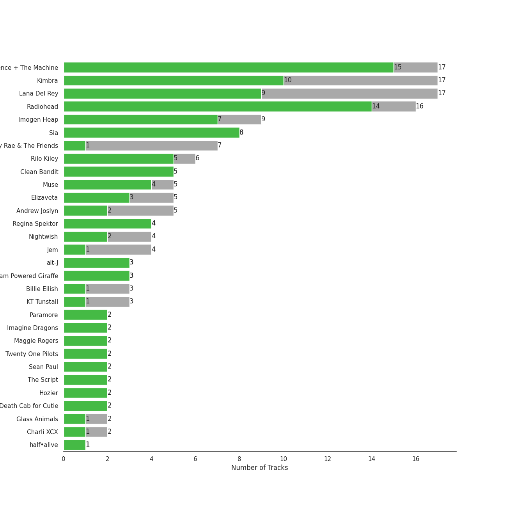
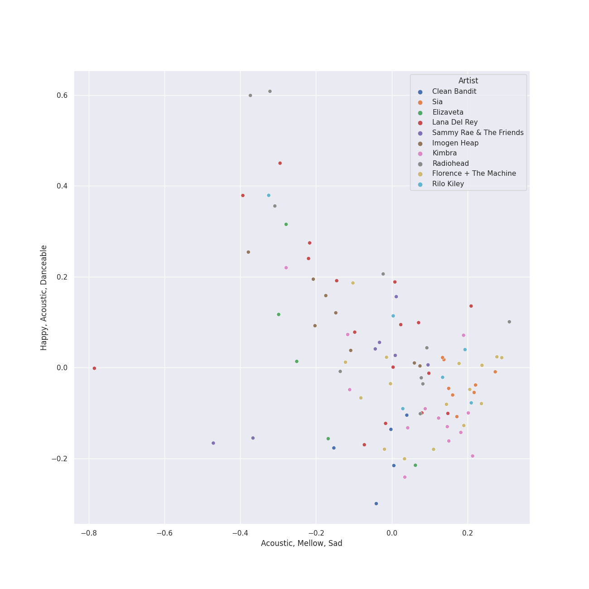
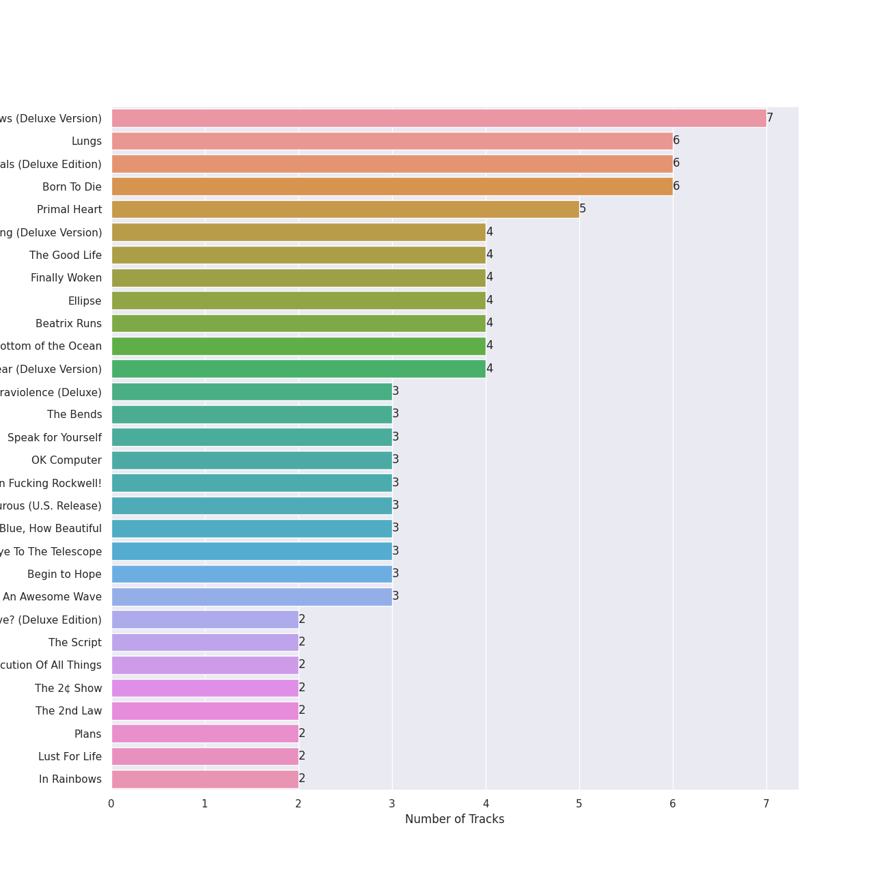
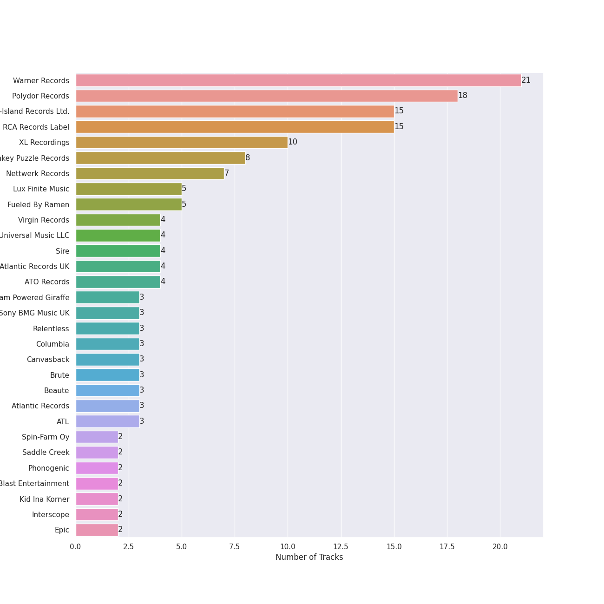
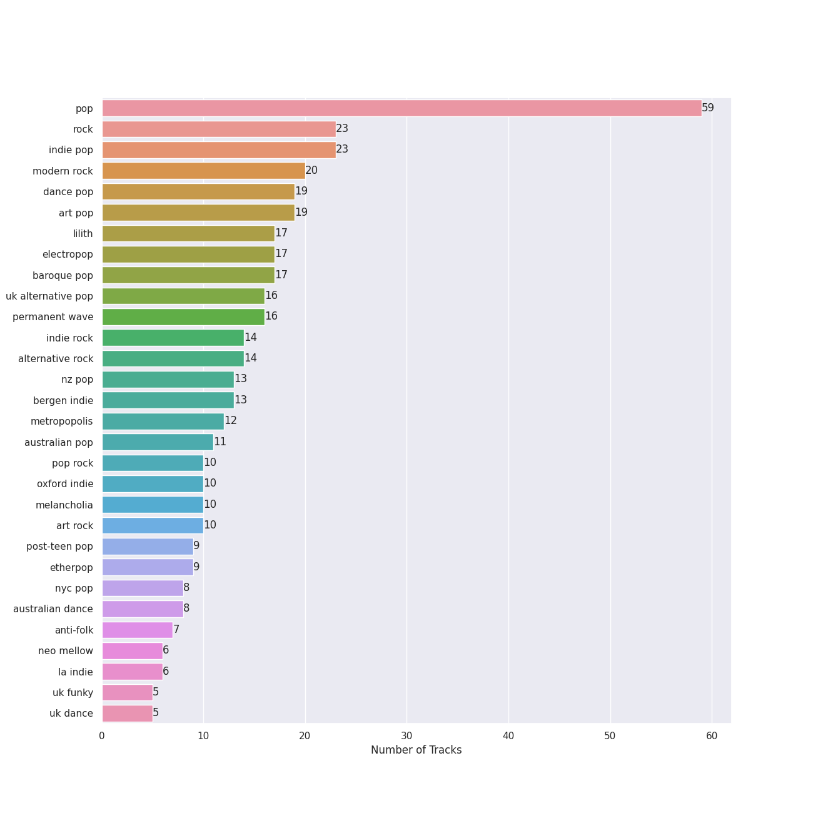
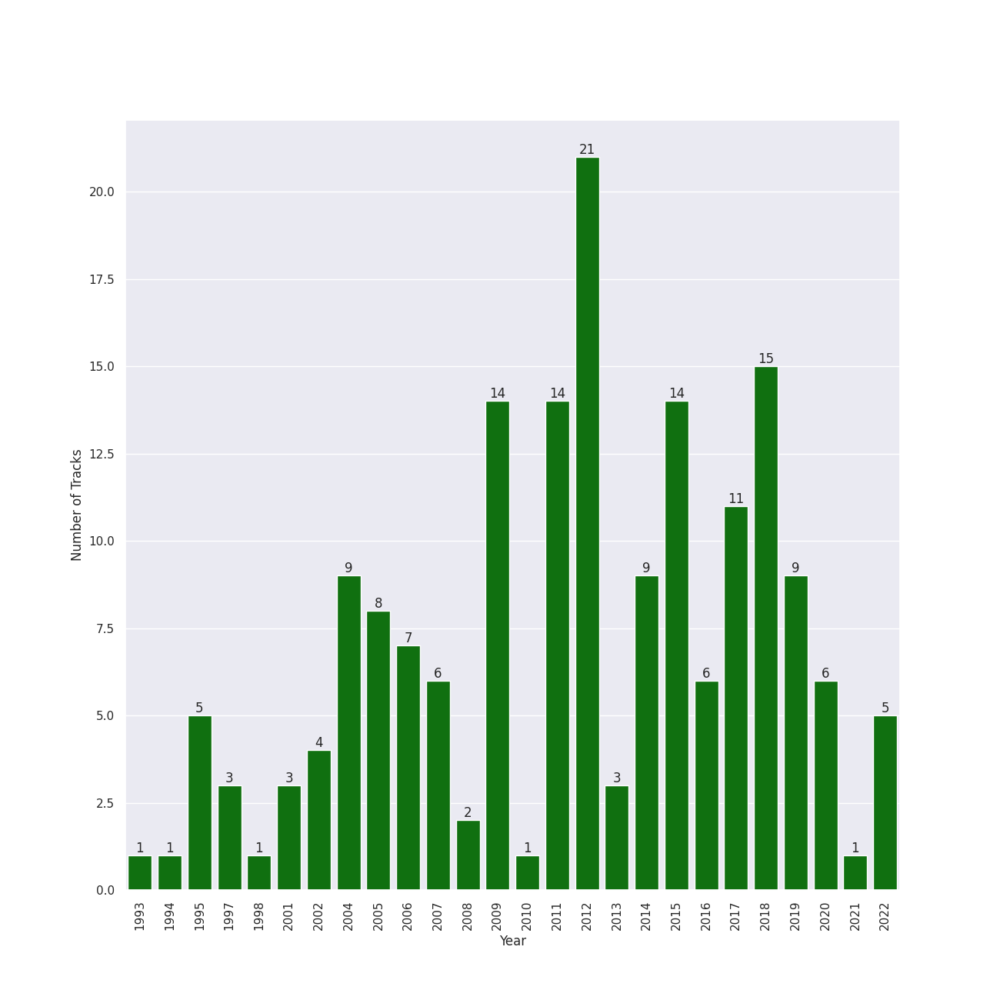

# Indie/Alternative

[179 songs](tracks.md)

## Top Artists

See all 82 artists

| Number of Tracks | Art | Artist | 🔗 |
|---:|:---|:---|:---|
| 17 |  | [Lana Del Rey](../../artists/lana_del_rey.md) | [🔗](https://open.spotify.com/artist/00FQb4jTyendYWaN8pK0wa) |
| 16 |  | [Florence + The Machine](../../artists/florence___the_machine.md) | [🔗](https://open.spotify.com/artist/1moxjboGR7GNWYIMWsRjgG) |
| 14 |  | [Kimbra](../../artists/kimbra.md) | [🔗](https://open.spotify.com/artist/6hk7Yq1DU9QcCCrz9uc0Ti) |
| 10 |  | [Radiohead](../../artists/radiohead.md) | [🔗](https://open.spotify.com/artist/4Z8W4fKeB5YxbusRsdQVPb) |
| 9 |  | Imogen Heap | [🔗](https://open.spotify.com/artist/6Xb4ezwoAQC4516kI89nWz) |
| 8 |  | Sia | [🔗](https://open.spotify.com/artist/5WUlDfRSoLAfcVSX1WnrxN) |
| 7 |  | Sammy Rae & The Friends | [🔗](https://open.spotify.com/artist/3lFDsTyYNPQc8WzJExnQWn) |
| 6 |  | Rilo Kiley | [🔗](https://open.spotify.com/artist/2cevwbv7ISD92VMNLYLHZA) |
| 5 |  | Clean Bandit | [🔗](https://open.spotify.com/artist/6MDME20pz9RveH9rEXvrOM) |
| 5 |  | Andrew Joslyn | [🔗](https://open.spotify.com/artist/5dSCgfYs71v0zjg2AwUq9n) |
| 5 |  | Elizaveta | [🔗](https://open.spotify.com/artist/2a9bCkqCkLvXM0s3uPvR7M) |
| 5 |  | Muse | [🔗](https://open.spotify.com/artist/12Chz98pHFMPJEknJQMWvI) |
| 4 |  | Jem | [🔗](https://open.spotify.com/artist/4v4xuH9VypORYabMnhPLt1) |
| 4 |  | Regina Spektor | [🔗](https://open.spotify.com/artist/3z6Gk257P9jNcZbBXJNX5i) |
| 4 |  | Nightwish | [🔗](https://open.spotify.com/artist/2NPduAUeLVsfIauhRwuft1) |
| 3 |  | KT Tunstall | [🔗](https://open.spotify.com/artist/5zzrJD2jXrE9dZ1AklRFcL) |
| 3 |  | alt-J | [🔗](https://open.spotify.com/artist/3XHO7cRUPCLOr6jwp8vsx5) |
| 3 |  | Steam Powered Giraffe | [🔗](https://open.spotify.com/artist/1yqs45BSh7457Flyhmdv7f) |
| 2 |  | Paramore | [🔗](https://open.spotify.com/artist/74XFHRwlV6OrjEM0A2NCMF) |
| 2 |  | Imagine Dragons | [🔗](https://open.spotify.com/artist/53XhwfbYqKCa1cC15pYq2q) |
| 2 |  | Glass Animals | [🔗](https://open.spotify.com/artist/4yvcSjfu4PC0CYQyLy4wSq) |
| 2 |  | Maggie Rogers | [🔗](https://open.spotify.com/artist/4NZvixzsSefsNiIqXn0NDe) |
| 2 |  | Twenty One Pilots | [🔗](https://open.spotify.com/artist/3YQKmKGau1PzlVlkL1iodx) |
| 2 |  | Sean Paul | [🔗](https://open.spotify.com/artist/3Isy6kedDrgPYoTS1dazA9) |
| 2 |  | The Script | [🔗](https://open.spotify.com/artist/3AQRLZ9PuTAozP28Skbq8V) |
| 2 |  | Hozier | [🔗](https://open.spotify.com/artist/2FXC3k01G6Gw61bmprjgqS) |
| 2 |  | Charli XCX | [🔗](https://open.spotify.com/artist/25uiPmTg16RbhZWAqwLBy5) |
| 2 |  | Death Cab for Cutie | [🔗](https://open.spotify.com/artist/0YrtvWJMgSdVrk3SfNjTbx) |
| 1 |  | half•alive | [🔗](https://open.spotify.com/artist/7sOR7gk6XUlGnxj3p9F54k) |
| 1 |  | ONE OK ROCK | [🔗](https://open.spotify.com/artist/7k73EtZwoPs516ZxE72KsO) |
| 1 |  | Wyvern Lingo | [🔗](https://open.spotify.com/artist/7etzKNDxaZ1LefgbGrexsN) |
| 1 |  | Thirdstory | [🔗](https://open.spotify.com/artist/7GJbWH8vhhuW22707B8HsW) |
| 1 |  | The Neighbourhood | [🔗](https://open.spotify.com/artist/77SW9BnxLY8rJ0RciFqkHh) |
| 1 |  | Peter Bjorn and John | [🔗](https://open.spotify.com/artist/6u11Qbko2N2hP4lTBYjX86) |
| 1 |  | Alanis Morissette | [🔗](https://open.spotify.com/artist/6ogn9necmbUdCppmNnGOdi) |
| 1 |  | Lord Huron | [🔗](https://open.spotify.com/artist/6ltzsmQQbmdoHHbLZ4ZN25) |
| 1 |  | Destiny Rogers | [🔗](https://open.spotify.com/artist/6gezkje7GoJlQbHBgLXHuu) |
| 1 |  | 24kGoldn | [🔗](https://open.spotify.com/artist/6fWVd57NKTalqvmjRd2t8Z) |
| 1 |  | Sheppard | [🔗](https://open.spotify.com/artist/6VxCmtR7S3yz4vnzsJqhSV) |
| 1 |  | Demi Lovato | [🔗](https://open.spotify.com/artist/6S2OmqARrzebs0tKUEyXyp) |
| 1 |  | Shelby Earl | [🔗](https://open.spotify.com/artist/6PIo5nhCQJbR0NfxPdGnGC) |
| 1 |  | Frou Frou | [🔗](https://open.spotify.com/artist/6MUyqmIQ35inLjch0YzIEG) |
| 1 |  | Feist | [🔗](https://open.spotify.com/artist/6CWTBjOJK75cTE8Xv8u1kj) |
| 1 |  | The Womack Sisters | [🔗](https://open.spotify.com/artist/6BjLHAiun9TeqC55KB3L6s) |
| 1 |  | Gary Jules | [🔗](https://open.spotify.com/artist/5oRnbmgqvvq7fVlgk4vcEa) |
| 1 |  | Young the Giant | [🔗](https://open.spotify.com/artist/4j56EQDQu5XnL7R3E9iFJT) |
| 1 |  | K/DA | [🔗](https://open.spotify.com/artist/4gOc8TsQed9eqnqJct2c5v) |
| 1 |  | Conan Gray | [🔗](https://open.spotify.com/artist/4Uc8Dsxct0oMqx0P6i60ea) |
| 1 |  | Jess Glynne | [🔗](https://open.spotify.com/artist/4ScCswdRlyA23odg9thgIO) |
| 1 |  | Caroline Polachek | [🔗](https://open.spotify.com/artist/4Ge8xMJNwt6EEXOzVXju9a) |
| 1 |  | Anjulie | [🔗](https://open.spotify.com/artist/4DTbdShHu2RPYEEMUp2XWV) |
| 1 |  | Caro Emerald | [🔗](https://open.spotify.com/artist/492hDmhPyuIjP3MgTcIqgm) |
| 1 |  | League of Legends | [🔗](https://open.spotify.com/artist/47mIJdHORyRerp4os813jD) |
| 1 |  | The Smashing Pumpkins | [🔗](https://open.spotify.com/artist/40Yq4vzPs9VNUrIBG5Jr2i) |
| 1 |  | Christopher | [🔗](https://open.spotify.com/artist/3zDRCqOhJXJfS2YWOEwGMC) |
| 1 |  | Huxlee | [🔗](https://open.spotify.com/artist/3yb7HrGPG0WpWgdO4XFwBf) |
| 1 |  | Kim Petras | [🔗](https://open.spotify.com/artist/3Xt3RrJMFv5SZkCfUE8C1J) |
| 1 |  | Troye Sivan | [🔗](https://open.spotify.com/artist/3WGpXCj9YhhfX11TToZcXP) |
| 1 |  | Will Jordan | [🔗](https://open.spotify.com/artist/3Is3ehDoBlnTKQtCHdEvpd) |
| 1 |  | A. G. Cook | [🔗](https://open.spotify.com/artist/335TWGWGFan4vaacJzSiU8) |
| 1 |  | Neutral Milk Hotel | [🔗](https://open.spotify.com/artist/2ooIqOf4X2uz4mMptXCtie) |
| 1 |  | Madison Beer | [🔗](https://open.spotify.com/artist/2kRfqPViCqYdSGhYSM9R0Q) |
| 1 |  | VERNON | [🔗](https://open.spotify.com/artist/2Y34b9AOK30zXgL7cAH4NG) |
| 1 |  | Tove Styrke | [🔗](https://open.spotify.com/artist/2QSPrJfYeRXaltEEiriXN9) |
| 1 |  | Rina Sawayama | [🔗](https://open.spotify.com/artist/2KEqzdPS7M5YwGmiuPTdr5) |
| 1 |  | Gotye | [🔗](https://open.spotify.com/artist/2AsusXITU8P25dlRNhcAbG) |
| 1 |  | Anne-Marie | [🔗](https://open.spotify.com/artist/1zNqDE7qDGCsyzJwohVaoX) |
| 1 |  | YB | [🔗](https://open.spotify.com/artist/1rpgxJZxZMLnFNc1Jmyov5) |
| 1 |  | Metric | [🔗](https://open.spotify.com/artist/1rCIEwPp5OnXW0ornlSsRl) |
| 1 |  | Zara Larsson | [🔗](https://open.spotify.com/artist/1Xylc3o4UrD53lo9CvFvVg) |
| 1 |  | Lerin Herzer | [🔗](https://open.spotify.com/artist/1O3tPNfosJcQQNI6wmR5Xt) |
| 1 |  | Mabel | [🔗](https://open.spotify.com/artist/1MIVXf74SZHmTIp4V4paH4) |
| 1 |  | Guy Sigsworth | [🔗](https://open.spotify.com/artist/0uQWT7X0I9Y7zM7WWexpAj) |
| 1 |  | Avril Lavigne | [🔗](https://open.spotify.com/artist/0p4nmQO2msCgU4IF37Wi3j) |
| 1 |  | Måneskin | [🔗](https://open.spotify.com/artist/0lAWpj5szCSwM4rUMHYmrr) |
| 1 |  | Rixton | [🔗](https://open.spotify.com/artist/0kkxsdcaWmWU2yWAqclDh4) |
| 1 |  | Adra Boo | [🔗](https://open.spotify.com/artist/0YahlVgicneX5hdN8XyIpp) |
| 1 |  | Nine Inch Nails | [🔗](https://open.spotify.com/artist/0X380XXQSNBYuleKzav5UO) |
| 1 |  | Neon Trees | [🔗](https://open.spotify.com/artist/0RpddSzUHfncUWNJXKOsjy) |
| 1 |  | Michael Andrews | [🔗](https://open.spotify.com/artist/0RkqytrwoGyXGvDiZwT6i2) |
| 1 |  | Jacob Banks | [🔗](https://open.spotify.com/artist/0AepkoQhYvkjEzzwIcGxdV) |
| 1 |  | Billy McCarthy | [🔗](https://open.spotify.com/artist/02v2poO7JL5ixVE5GGfwkn) |

## Top Albums

See top 100 albums

| Number of Tracks | Art | Album | Release Date | 🔗 |
|---:|:---|:---|:---|:---|
| 7 |  | Vows (Deluxe Version) | 2011 | [🔗](https://open.spotify.com/album/6V9rvW05Um5bIHePPfeI8p) |
| 6 |  | Lungs | 2009-01-01 | [🔗](https://open.spotify.com/album/2KAK58PimXHF4lSoKO3RxA) |
| 6 |  | Ceremonials (Deluxe Edition) | 2011-01-01 | [🔗](https://open.spotify.com/album/5SxudoALxEAVh9l83kSebx) |
| 6 |  | Born To Die | 2012-01-30 | [🔗](https://open.spotify.com/album/4X8hAqIWpQyQks2yRhyqs4) |
| 5 |  | Primal Heart | 2018-04-20 | [🔗](https://open.spotify.com/album/4pj0BkJ7u39i009oqe8V79) |
| 4 |  | This Is Acting (Deluxe Version) | 2016-10-21 | [🔗](https://open.spotify.com/album/2eV6DIPDnGl1idcjww6xyX) |
| 4 |  | The Good Life | 2018-07-10 | [🔗](https://open.spotify.com/album/2xCZSSa0kfIJFDhQR8bYar) |
| 4 |  | Finally Woken | 2004-03-23 | [🔗](https://open.spotify.com/album/3RkjNfqqlhWyLrRp0ZCARU) |
| 4 |  | Ellipse | 2009-08-25 | [🔗](https://open.spotify.com/album/5AYKGPzPBJNHeKehCxMaq0) |
| 4 |  | Beatrix Runs | 2012 | [🔗](https://open.spotify.com/album/7HsPaYQbCYnxosF5WiSlEA) |
| 4 |  | Awake at the Bottom of the Ocean | 2017-02-10 | [🔗](https://open.spotify.com/album/7G36cnLPx9CuqnmZXYna4a) |
| 4 |  | 1000 Forms Of Fear (Deluxe Version) | 2015-05-04 | [🔗](https://open.spotify.com/album/6FdNvoO5sF4EKwCX9je1MH) |
| 3 |  | Ultraviolence (Deluxe) | 2014-01-01 | [🔗](https://open.spotify.com/album/1ORxRsK3MrSLvh7VQTF01F) |
| 3 |  | The Bends | 1995-03-28 | [🔗](https://open.spotify.com/album/500FEaUzn8lN9zWFyZG5C2) |
| 3 |  | Speak for Yourself | 2005-07-18 | [🔗](https://open.spotify.com/album/0t0Cr8jA63wlm8nWj7qfvJ) |
| 3 |  | OK Computer | 1997-05-28 | [🔗](https://open.spotify.com/album/7dxKtc08dYeRVHt3p9CZJn) |
| 3 |  | Norman Fucking Rockwell! | 2019-08-30 | [🔗](https://open.spotify.com/album/5XpEKORZ4y6OrCZSKsi46A) |
| 3 |  | More Adventurous (U.S. Release) | 2004-07-27 | [🔗](https://open.spotify.com/album/4n36X2GMJ84BKh9D9zMRVI) |
| 3 |  | How Big, How Blue, How Beautiful | 2015-06-01 | [🔗](https://open.spotify.com/album/2btszoya78vyT8fwelmVnz) |
| 3 |  | Eye To The Telescope | 2005-01-01 | [🔗](https://open.spotify.com/album/3j70PDKieTWQAwas3bPHRZ) |
| 3 |  | Begin to Hope | 2006-06-13 | [🔗](https://open.spotify.com/album/4L4tcx3itXbtx5kuchKhFE) |
| 3 |  | An Awesome Wave | 2012-09-18 | [🔗](https://open.spotify.com/album/6k3vC8nep1BfqAIJ81L6OL) |
| 2 |  | What Is Love? (Deluxe Edition) | 2018-11-30 | [🔗](https://open.spotify.com/album/1MvF4ulZKH7SaDQs9rE5nc) |
| 2 |  | The Script | 2008-07-14 | [🔗](https://open.spotify.com/album/1r5J0N6Ep181K0i8YuTYgO) |
| 2 |  | The Execution Of All Things | 2002-10-01 | [🔗](https://open.spotify.com/album/23EqcK0ZR1ravQaEsGpQyH) |
| 2 |  | The 2¢ Show | 2012-05-23 | [🔗](https://open.spotify.com/album/4DECRyKlhKJgjZLLuvfAI6) |
| 2 |  | The 2nd Law | 2012-09-24 | [🔗](https://open.spotify.com/album/3KuXEGcqLcnEYWnn3OEGy0) |
| 2 |  | Plans | 2005-08-29 | [🔗](https://open.spotify.com/album/1NFGnxmeIEBakre4DvLaJq) |
| 2 |  | Lust For Life | 2017-07-21 | [🔗](https://open.spotify.com/album/7xYiTrbTL57QO0bb4hXIKo) |
| 2 |  | In Rainbows | 2007-12-28 | [🔗](https://open.spotify.com/album/5vkqYmiPBYLaalcmjujWxK) |
| 2 |  | Hozier (Expanded Edition) | 2014-09-19 | [🔗](https://open.spotify.com/album/4Pv7m8D82A1Xun7xNCKZjJ) |
| 2 |  | Century Child | 2002 | [🔗](https://open.spotify.com/album/4FFDudC4xBVF6MYJUynRsN) |
| 2 |  | Blurryface | 2015-05-15 | [🔗](https://open.spotify.com/album/3cQO7jp5S9qLBoIVtbkSM1) |
| 2 |  | Black Holes and Revelations | 2006-06-19 | [🔗](https://open.spotify.com/album/0lw68yx3MhKflWFqCsGkIs) |
| 1 |  | Young The Giant (Special Edition) | 2011 | [🔗](https://open.spotify.com/album/2ww7MYrkExsljnKhcINDse) |
| 1 |  | Young And Beautiful | 2013-01-01 | [🔗](https://open.spotify.com/album/1D92WOHWUI2AGQCCdplcXL) |
| 1 |  | Writer's Block | 2006-01-01 | [🔗](https://open.spotify.com/album/5g4E06cxsFEMFE9hSekAt2) |
| 1 |  | Whatever We Feel | 2020-04-03 | [🔗](https://open.spotify.com/album/5Lg9bnBTPSu0Xg7MRERveZ) |
| 1 |  | Village | 2018-11-02 | [🔗](https://open.spotify.com/album/2KxC2M0bVm5hrK3GgGMuV9) |
| 1 |  | Under the Surface | 2019-02-22 | [🔗](https://open.spotify.com/album/6ISIdF1gCK9X8pn4FaObHE) |
| 1 |  | Under The Blacklight (Standard Version) | 2007-08-20 | [🔗](https://open.spotify.com/album/2f9RsTZpsYMLRVZBtW7En8) |
| 1 |  | Under My Skin | 2004 | [🔗](https://open.spotify.com/album/7851Vsjv3apS52sXUik6iF) |
| 1 |  | Trading Snakeoil for Wolftickets | 2001-01-01 | [🔗](https://open.spotify.com/album/1OydCrx4m7fguwcX4stR9z) |
| 1 |  | Tomboy | 2019-02-28 | [🔗](https://open.spotify.com/album/2uDZBeyyQ7mfwF9mUJeYUG) |
| 1 |  | Tick Tock (feat. 24kGoldn) | 2020-08-21 | [🔗](https://open.spotify.com/album/3tuAs968COA2vxKjiLvmxr) |
| 1 |  | The Widow Knows E.P. | 2014-08-14 | [🔗](https://open.spotify.com/album/548WnictHrfJKj2u6tXqFe) |
| 1 |  | The Reminder | 2007-01-01 | [🔗](https://open.spotify.com/album/7bTdGfczXffzzNE9ssJj4Z) |
| 1 |  | The Golden Echo | 2014-08-15 | [🔗](https://open.spotify.com/album/66hoUkjxM7tVQwu7bZocwP) |
| 1 |  | The Girl and the Ghost | 2012-09-18 | [🔗](https://open.spotify.com/album/1e1qx3O2gLpmLuVE7OEfxp) |
| 1 |  | The Downward Spiral | 1994-03-08 | [🔗](https://open.spotify.com/album/3nJnyDV8fwFpffo0EyHQto) |
| 1 |  | Taxidriver OST Part.1 | 2021-04-16 | [🔗](https://open.spotify.com/album/3PNXlS9tggXmCm1hrlHDcQ) |
| 1 |  | Sway | 2018-05-04 | [🔗](https://open.spotify.com/album/3fSRbKgYW6kcR1ZFMaaNV4) |
| 1 |  | Surrender | 2022-07-29 | [🔗](https://open.spotify.com/album/2VeOtQQAJxR8VyvmoXqIbI) |
| 1 |  | SuperRock (All Folked Up) | 2017-07-19 | [🔗](https://open.spotify.com/album/4PEc1CBBlhpGzswmWjLyFK) |
| 1 |  | Strange Trails | 2015-04-07 | [🔗](https://open.spotify.com/album/3yoNZlqerJnsnMN5EDwwBS) |
| 1 |  | Solo (feat. Demi Lovato) | 2018-05-17 | [🔗](https://open.spotify.com/album/1q7a5wZeti0neU2jDn8Dz3) |
| 1 |  | Searching | 2016-05-06 | [🔗](https://open.spotify.com/album/7pjWbCevZabqDKwm26ggKd) |
| 1 |  | Saw It Coming | 2019-05-10 | [🔗](https://open.spotify.com/album/0SPZ4equvZdVOPzOYrS8pJ) |
| 1 |  | Riot! | 2007-06-11 | [🔗](https://open.spotify.com/album/71rziY9eLo1tA2dBMxrwhc) |
| 1 |  | Picture Show | 2012-01-01 | [🔗](https://open.spotify.com/album/0uRFz92JmjwDbZbB7hEBIr) |
| 1 |  | Paramore | 2013-04-05 | [🔗](https://open.spotify.com/album/4sgYpkIASM1jVlNC8Wp9oF) |
| 1 |  | Paradise | 2012-11-09 | [🔗](https://open.spotify.com/album/1JnjcAIKQ9TSJFVFierTB8) |
| 1 |  | Pablo Honey | 1993-02-22 | [🔗](https://open.spotify.com/album/6400dnyeDyD2mIFHfkwHXN) |
| 1 |  | Origin of Symmetry | 2001 | [🔗](https://open.spotify.com/album/1AP6uGYHdakRgwuWQsP5pK) |
| 1 |  | Once | 2004-01-04 | [🔗](https://open.spotify.com/album/0aDCpYtFdQ0S8C3oAtOonk) |
| 1 |  | Now, Not Yet | 2019-08-09 | [🔗](https://open.spotify.com/album/2KSWrd22LGc0Hmqs2Z5i7z) |
| 1 |  | Night Visions | 2012-09-04 | [🔗](https://open.spotify.com/album/6htgf3qv7vGcsdxLCDxKp8) |
| 1 |  | New Eyes | 2014-06-02 | [🔗](https://open.spotify.com/album/4a6DxkhmMvvEdPXxm4ergN) |
| 1 |  | Messenger | 2015-06-29 | [🔗](https://open.spotify.com/album/3yQJY0tg0M2rQwWYUgkVQp) |
| 1 |  | Mellon Collie And The Infinite Sadness (Deluxe Edition) | 1995 | [🔗](https://open.spotify.com/album/55RhFRyQFihIyGf61MgcfV) |
| 1 |  | Let The Road | 2014-01-01 | [🔗](https://open.spotify.com/album/02ae5i5UAoFrt2peVox9Xd) |
| 1 |  | Kid Krow | 2020-03-20 | [🔗](https://open.spotify.com/album/2CMlkzFI2oDAy5MbyV7OV5) |
| 1 |  | Jagged Little Pill | 1995-06-09 | [🔗](https://open.spotify.com/album/09AwlP99cHfKVNKv4FC8VW) |
| 1 |  | Jackie Onassis | 2020-06-05 | [🔗](https://open.spotify.com/album/3RaVt6xWjSVMFrMdLqoDrN) |
| 1 |  | In the Aeroplane Over the Sea | 1998-02-20 | [🔗](https://open.spotify.com/album/0vVekV45lOaVKs6RZQQNob) |
| 1 |  | I Love You. | 2013-04-19 | [🔗](https://open.spotify.com/album/4xkM0BwLM9H2IUcbYzpcBI) |
| 1 |  | How To Be A Human Being | 2016-08-26 | [🔗](https://open.spotify.com/album/6qb9MDR0lfsN9a2pw77uJy) |
| 1 |  | Honeymoon | 2015-09-18 | [🔗](https://open.spotify.com/album/2DpEBrjCur1ythIZ10gJWw) |
| 1 |  | High As Hope | 2018-06-29 | [🔗](https://open.spotify.com/album/0pKZJj9GzcKPCS8r4IaksA) |
| 1 |  | Heard It In A Past Life | 2019-01-18 | [🔗](https://open.spotify.com/album/5AHWNPo3gllDmixgAoFru4) |
| 1 |  | Goodnight And Go | 2006-05-02 | [🔗](https://open.spotify.com/album/3JYjYjUAoBjxXr1W8eDVLV) |
| 1 |  | Far | 2009-06-09 | [🔗](https://open.spotify.com/album/5t0lQDPLF22wmWCtSZkIVv) |
| 1 |  | Fantasies | 2009-04-14 | [🔗](https://open.spotify.com/album/3Oj8FdHcV6kAiOVWfkqRaA) |
| 1 |  | Evolve | 2017-06-23 | [🔗](https://open.spotify.com/album/33pt9HBdGlAbRGBHQgsZsU) |
| 1 |  | Dreamland (+ Bonus Levels) | 2020-08-06 | [🔗](https://open.spotify.com/album/0KTj6k94XZh0c6IEMfxeWV) |
| 1 |  | Deleted Scenes From The Cutting Room Floor | 2010-01-29 | [🔗](https://open.spotify.com/album/1D8grnftAaivpmBkayUgMR) |
| 1 |  | Darling | 2017-02-03 | [🔗](https://open.spotify.com/album/7pDkPCnYRapjr8dXcwkNIB) |
| 1 |  | Dark Passion Play | 2007 | [🔗](https://open.spotify.com/album/4oOfQhhbHBfIcIDwuJjwTy) |
| 1 |  | Chosen | 2017-12-08 | [🔗](https://open.spotify.com/album/2qJw6w5XwQO0PQlSWPu7Tw) |
| 1 |  | CRASH | 2022-03-18 | [🔗](https://open.spotify.com/album/1QqipMXWzJhr6yfcNKTp8B) |
| 1 |  | Bombs Away | 2015-03-10 | [🔗](https://open.spotify.com/album/2Yi29VOccHCwktsZNqtxbt) |
| 1 |  | Blue Neighbourhood (Deluxe) | 2015-12-04 | [🔗](https://open.spotify.com/album/5ouTDazE4LF9bVJPx1nlgW) |
| 1 |  | Billions | 2022-02-09 | [🔗](https://open.spotify.com/album/4DpAPqdJ1jVhoWZrxWLRH5) |
| 1 |  | Beg For You (A. G. Cook & VERNON OF SEVENTEEN Remix) [feat. Rina Sawayama] | 2022-02-25 | [🔗](https://open.spotify.com/album/6snPKZGUbpydW2XJu9ievq) |
| 1 |  | Aussie Legends | 2019-11-22 | [🔗](https://open.spotify.com/album/3IGRFGa4ErR0CU8aMMrRql) |
| 1 |  | Anjulie | 2009-01-01 | [🔗](https://open.spotify.com/album/13ablPhINDfXMbbvgX7eLw) |
| 1 |  | Amnesiac | 2001-03-12 | [🔗](https://open.spotify.com/album/6V9YnBmFjWmXCBaUVRCVXP) |
| 1 |  | Ambitions | 2017-01-13 | [🔗](https://open.spotify.com/album/0p1YL9nzIuKTonZH6Gq58i) |
| 1 |  | Album One | 2009-10-30 | [🔗](https://open.spotify.com/album/60nJMMPYjHWNjli6APs40v) |
| 1 |  | ALL OUT | 2020-11-06 | [🔗](https://open.spotify.com/album/26IdRjba8f8DNa7c0FwfQb) |

## Top Record Labels

See all 68 labels

| Number of Tracks | Label |
|---:|:---|
| 22 | [Warner Records](../../labels/warner_records.md) |
| 18 | [Polydor Records](../../labels/polydor_records.md) |
| 15 | [Universal-Island Records Ltd.](../../labels/universal_island_records_ltd_.md) |
| 15 | [RCA Records Label](../../labels/rca_records_label.md) |
| 10 | [XL Recordings](../../labels/xl_recordings.md) |
| 8 | Monkey Puzzle Records |
| 7 | Nettwerk Records |
| 5 | Lux Finite Music |
| 5 | Fueled By Ramen |
| 5 | Atlantic Records UK |
| 4 | [Virgin Records](../../labels/virgin_records.md) |
| 4 | [Universal Music LLC](../../labels/universal_music_llc.md) |
| 4 | Sire |
| 4 | [Atlantic Records](../../labels/atlantic_records.md) |
| 4 | ATO Records |
| 3 | Steam Powered Giraffe |
| 3 | Sony BMG Music UK |
| 3 | Relentless |
| 3 | [Columbia](../../labels/columbia.md) |
| 3 | Canvasback |
| 3 | Brute |
| 3 | Beaute |
| 3 | ATL |
| 2 | Spin-Farm Oy |
| 2 | Saddle Creek |
| 2 | Phonogenic |
| 2 | Nuclear Blast Entertainment |
| 2 | Kid Ina Korner |
| 2 | [Interscope Records](../../labels/interscope_records.md) |
| 2 | [Epic](../../labels/epic.md) |
| 2 | [Capitol Records](../../labels/capitol_records.md) |
| 1 | half·alive |
| 1 | ZAR |
| 1 | Wyvern Lingo |
| 1 | Wolf Tone |
| 1 | Verve |
| 1 | Universal Music Division Polydor |
| 1 | Universal Music AB |
| 1 | UMGRI Interscope |
| 1 | UMG Recordings |
| 1 | TVT Records |
| 1 | Superpop.Co |
| 1 | Silent Records |
| 1 | SBS Contents Hub Co. |
| 1 | Roadrunner Records |
| 1 | Riot Games |
| 1 | [Republic Records](../../labels/republic_records.md) |
| 1 | RCA Victor |
| 1 | Perpetual Novice |
| 1 | Parlophone Denmark |
| 1 | Not specified |
| 1 | Music Recipe |
| 1 | Metric Music International |
| 1 | Merge Records |
| 1 | Mercury Records |
| 1 | Megaphonic |
| 1 | Maverick |
| 1 | IAMSOUND |
| 1 | Hear Music |
| 1 | Grandmono Records |
| 1 | Giant Little Man |
| 1 | Flower Army Records |
| 1 | EMI Recorded Music Australia Pty Ltd |
| 1 | EMI |
| 1 | Down Up Down Music |
| 1 | [Decca (UMO)](../../labels/decca__umo_.md) |
| 1 | Big Beat Records |
| 1 | Arista |

## Genres

See top 100 genres

| Number of Tracks | Genre |
|---:|:---|
| 61 | [pop](../../genres/pop.md) |
| 25 | indie pop |
| 23 | [rock](../../genres/rock.md) |
| 20 | modern rock |
| 20 | [art pop](../../genres/art_pop.md) |
| 18 | [electropop](../../genres/electropop.md) |
| 17 | [lilith](../../genres/lilith.md) |
| 17 | baroque pop |
| 16 | uk alternative pop |
| 16 | permanent wave |
| 14 | indie rock |
| 14 | [dance pop](../../genres/dance_pop.md) |
| 13 | nz pop |
| 13 | bergen indie |
| 13 | alternative rock |
| 12 | metropopolis |
| 11 | australian pop |
| 10 | [pop rock](../../genres/pop_rock.md) |
| 10 | oxford indie |
| 10 | melancholia |
| 10 | art rock |
| 9 | [post-teen pop](../../genres/post_teen_pop.md) |
| 9 | etherpop |
| 8 | nyc pop |
| 8 | australian dance |
| 7 | anti-folk |
| 6 | [neo mellow](../../genres/neo_mellow.md) |
| 6 | la indie |
| 5 | uk funky |
| 5 | uk dance |
| 5 | tropical house |
| 5 | pop rap |
| 5 | pop dance |
| 5 | edm |
| 5 | deep indie singer-songwriter |
| 5 | candy pop |
| 4 | symphonic metal |
| 4 | power metal |
| 4 | piano rock |
| 4 | opera metal |
| 4 | modern alternative rock |
| 4 | gothic symphonic metal |
| 4 | gothic metal |
| 4 | finnish power metal |
| 4 | finnish metal |
| 4 | canadian pop |
| 3 | stomp and holler |
| 3 | steampunk |
| 3 | scottish singer-songwriter |
| 3 | indietronica |
| 3 | comic |
| 2 | washington indie |
| 2 | uk pop |
| 2 | shiver pop |
| 2 | pop punk |
| 2 | pop emo |
| 2 | pixie |
| 2 | irish singer-songwriter |
| 2 | gauze pop |
| 2 | chamber pop |
| 2 | celtic rock |
| 2 | canadian indie |
| 2 | alternative metal |
| 2 | alternative dance |
| 1 | visual kei |
| 1 | viral pop |
| 1 | uk contemporary r&b |
| 1 | swedish synthpop |
| 1 | swedish pop |
| 1 | swedish indie pop |
| 1 | swedish electropop |
| 1 | swedish alternative rock |
| 1 | spacegrunge |
| 1 | [singer-songwriter](../../genres/singer_songwriter.md) |
| 1 | shimmer pop |
| 1 | nu metal |
| 1 | nu jazz |
| 1 | new rave |
| 1 | neo-synthpop |
| 1 | lo-fi |
| 1 | korean indie rock |
| 1 | [k-pop girl group](../../genres/k_pop_girl_group.md) |
| 1 | japanese emo |
| 1 | j-rock |
| 1 | j-poprock |
| 1 | j-pop |
| 1 | italian pop |
| 1 | irish pop |
| 1 | industrial rock |
| 1 | industrial metal |
| 1 | industrial |
| 1 | indie rock italiano |
| 1 | indie poptimism |
| 1 | grunge |
| 1 | folk-pop |
| 1 | escape room |
| 1 | elephant 6 |
| 1 | electronic rock |
| 1 | dutch pop |
| 1 | downtempo |

## Years

View all years

| Year | Number of Tracks |
|:---|---:|
| 2022 | 5 |
| 2021 | 1 |
| 2020 | 6 |
| 2019 | 9 |
| 2018 | 15 |
| 2017 | 11 |
| 2016 | 6 |
| 2015 | 14 |
| 2014 | 9 |
| 2013 | 3 |
| [2012](2012.md) | 21 |
| 2011 | 14 |
| 2010 | 1 |
| 2009 | 14 |
| 2008 | 2 |
| 2007 | 6 |
| 2006 | 7 |
| 2005 | 8 |
| 2004 | 9 |
| 2002 | 4 |
| 2001 | 3 |
| 1998 | 1 |
| 1997 | 3 |
| 1995 | 5 |
| 1994 | 1 |
| 1993 | 1 |

| 10 newest albums | 10 oldest albums |
|:---|:---|
| 
 Surrender (2022-07-29)
 | 
 Pablo Honey (1993-02-22)
 |
| 
 A New Kind Of Love (Demo) (2022-04-08)
 | 
 The Downward Spiral (1994-03-08)
 |
| 
 CRASH (2022-03-18)
 | 
 Mellon Collie And The Infinite Sadness (Deluxe Edition) (1995)
 |
| 
 Beg For You (A. G. Cook & VERNON OF SEVENTEEN Remix) [feat. Rina Sawayama] (2022-02-25)
 | 
 The Bends (1995-03-28)
 |
| 
 Billions (2022-02-09)
 | 
 Jagged Little Pill (1995-06-09)
 |
| 
 Taxidriver OST Part.1 (2021-04-16)
 | 
 OK Computer (1997-05-28)
 |
| 
 ALL OUT (2020-11-06)
 | 
 In the Aeroplane Over the Sea (1998-02-20)
 |
| 
 Tick Tock (feat. 24kGoldn) (2020-08-21)
 | 
 Origin of Symmetry (2001)
 |
| 
 Dreamland (+ Bonus Levels) (2020-08-06)
 | 
 Trading Snakeoil for Wolftickets (2001-01-01)
 |
| 
 Jackie Onassis (2020-06-05)
 | 
 Amnesiac (2001-03-12)
 |
## Audio Features

| 10 most Danceable tracks | 10 least Danceable tracks |
|:---|:---|
| Fidelity (0.923) | Pyramid Song (0.127) |
| On the Radio (0.88) | Born To Die (0.18) |
| Somebody That I Used To Know (0.864) | Norman fucking Rockwell (0.215) |
| Good Intent (0.851) | Paranoid Android (0.252) |
| Dreamer (0.802) | No Surprises (0.255) |
| Rather Be (feat. Jess Glynne) (0.799) | Shades Of Cool (0.262) |
| still feel. (0.779) | That's Where I Am (0.269) |
| Tick Tock (feat. 24kGoldn) (0.779) | In the Aeroplane Over the Sea (0.271) |
| Believer (0.776) | Radio (0.312) |
| 1979 - Remastered 2012 (0.767) | What Kind Of Man (0.313) |

| 10 most Energetic tracks | 10 least Energetic tracks |
|:---|:---|
| Knights of Cydonia (0.963) | Mad World (0.0585) |
| End Of All Hope (0.946) | Used (0.0938) |
| My Happy Ending (0.936) | Hurt (0.158) |
| Everybody Talks (0.924) | Hide and Seek (0.166) |
| Cameo Lover (0.922) | Honeybee (0.186) |
| Supermassive Black Hole (0.921) | Samson (0.193) |
| Like They Do on the TV (0.911) | Norman fucking Rockwell (0.203) |
| Misery Business (0.906) | I Will Follow You into the Dark (0.206) |
| Ain't It Fun (0.893) | Dreamer (0.223) |
| Gimme Sympathy (0.886) | Icarus (0.225) |

| 10 most Speechy tracks | 10 least Speechy tracks |
|:---|:---|
| Cheap Thrills (feat. Sean Paul) (0.201) | Breakeven (0.0242) |
| G Train (0.192) | Speeding Cars (0.0247) |
| Eye of the Needle (0.144) | Come On Closer (0.025) |
| Knights of Cydonia (0.142) | High And Dry (0.0257) |
| Stressed Out (0.141) | Karma Police (0.026) |
| That Man (0.138) | Reckoner (0.0262) |
| Like They Do on the TV (0.134) | Meant (0.0267) |
| Believer (0.128) | What Sarah Said (0.0268) |
| Say My Name (0.125) | Odi Et Amo (0.0275) |
| Accidntel Deth (0.123) | Love (0.0277) |

| 10 most Acoustic tracks | 10 least Acoustic tracks |
|:---|:---|
| Mad World (0.976) | The Phantom Of The Opera (7.33e-06) |
| The Night We Met (0.969) | End Of All Hope (6.14e-05) |
| Norman fucking Rockwell (0.968) | Nemo (0.000185) |
| Meant to Move (0.959) | Knights of Cydonia (0.000273) |
| Used (0.938) | Portions for Foxes (0.000938) |
| Icarus (0.931) | My Happy Ending (0.00136) |
| I Will Follow You into the Dark (0.924) | Maniac (0.00162) |
| Hide and Seek (0.909) | Kiss With A Fist (0.00254) |
| Plain Gold Ring (0.9) | SILENCE (0.00271) |
| Fuck it I love you (0.895) | Misery Business (0.00272) |

| 10 most Instrumental tracks | 10 least Instrumental tracks |
|:---|:---|
| A Better Son/Daughter (0.91) | You Oughta Know (0.0) |
| Animals (0.796) | You've Got The Love (0.0) |
| Weird Fishes/ Arpeggi (0.756) | Flesh & Bone (0.0) |
| Street Spirit (Fade Out) (0.691) | Believer (0.0) |
| 1979 - Remastered 2012 (0.583) | Black Horse And The Cherry Tree (0.0) |
| Coal Miners (0.487) | Dark Paradise (0.0) |
| Pyramid Song (0.427) | G Train (0.0) |
| Swan Song (0.421) | Take Me to Church (0.0) |
| The Night We Met (0.267) | Come On Closer (0.0) |
| Mantra for a Struggling Artist (0.216) | The Feeling (0.0) |

| 10 most Live tracks | 10 least Live tracks |
|:---|:---|
| Bel Air (0.901) | Ain't It Fun (0.021) |
| Whatever We Feel (0.75) | Seven Devils (0.0477) |
| You Oughta Know (0.736) | still feel. (0.0492) |
| Animals (0.696) | 1979 - Remastered 2012 (0.0513) |
| Radioactive (0.668) | Paranoid Android (0.0545) |
| The Night We Met (0.641) | Icarus (0.0582) |
| Saw It Coming (0.456) | Beg For You (A. G. Cook & VERNON OF SEVENTEEN Remix) [feat. Rina Sawayama] (0.0585) |
| No Light, No Light (0.444) | Say My Name (0.0596) |
| Darling (0.441) | Stressed Out (0.0602) |
| Off To The Races (0.4) | The Other Side Of Paradise (0.0649) |

| 10 most Happy tracks | 10 least Happy tracks |
|:---|:---|
| 1979 - Remastered 2012 (0.964) | Swan Song (0.0392) |
| Tick Tock (feat. 24kGoldn) (0.946) | What Sarah Said (0.0401) |
| Earth (0.938) | A Better Son/Daughter (0.0473) |
| Come On Closer (0.928) | Pyramid Song (0.0686) |
| Black Horse And The Cherry Tree (0.917) | Waltz Me to the Grave (0.0748) |
| That Man (0.903) | How Big, How Blue, How Beautiful (0.0825) |
| Good Intent (0.834) | Hurt (0.0826) |
| Beg For You (A. G. Cook & VERNON OF SEVENTEEN Remix) [feat. Rina Sawayama] (0.824) | Shades Of Cool (0.0878) |
| Flesh & Bone (0.824) | Hide and Seek (0.0901) |
| Kick It to Me (0.82) | The Good War (0.0928) |
