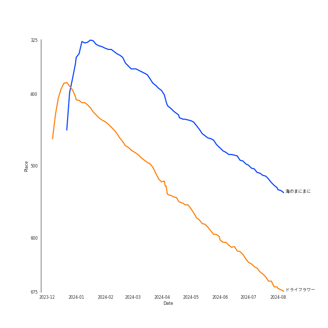

# Tracks in International Pop from 2022

## Artists

| Art | Rank | Tracks | 💚 | Artist | 🔗 |
|:---|---:|---:|---:|:---|:---|
|  | 180 | 2 | 1 | Fujii Kaze | [🔗](https://open.spotify.com/artist/6bDWAcdtVR3WHz2xtiIPUi) |
|  | 186 | 2 | 1 | Faouzia | [🔗](https://open.spotify.com/artist/5NhgsV7qPWHZqYEMKzbYvo) |
|  | 428 | 2 | 1 | Anna Zak | [🔗](https://open.spotify.com/artist/3lVXtKsFTJM8ecY8gqdoCo) |
|  | 318 | 2 | 1 | Yuuri | [🔗](https://open.spotify.com/artist/0ixzjrK1wkN2zWBXt3VW3W) |
|  | 428 | 1 | 1 | DARA | [🔗](https://open.spotify.com/artist/6WRl7KUrzOq7GpY97KrYxi) |
|  | 75 | 1 | 1 | [YOASOBI](../../../artists/yoasobi/overview.md) | [🔗](https://open.spotify.com/artist/64tJ2EAv1R6UaZqc4iOCyj) |
|  | 428 | 1 | 1 | Hoàng Thùy Linh | [🔗](https://open.spotify.com/artist/0r63ReVRjxrS4ATbLrdcrL) |
|  | 428 | 1 | 0 | Lothika | [🔗](https://open.spotify.com/artist/7yZDrVInKssNCaZkAkQGTX) |
|  | 428 | 1 | 0 | הפשוטע | [🔗](https://open.spotify.com/artist/7m92aMieltH5ZpodCEHfnb) |
|  | 428 | 1 | 0 | SEKAI NO OWARI | [🔗](https://open.spotify.com/artist/7HwzlRPa9Ad0I8rK0FPzzK) |

View all

| Art | Rank | Tracks | 💚 | Artist | 🔗 |
|:---|---:|---:|---:|:---|:---|
|  | 428 | 1 | 0 | Eden Hason | [🔗](https://open.spotify.com/artist/6uQl3gu1AIXyvqCAxnc2q4) |
|  | 294 | 1 | 0 | Hatsune Miku | [🔗](https://open.spotify.com/artist/6pNgnvzBa6Bthsv8SrZJYl) |
|  | 428 | 1 | 0 | Jimbo J | [🔗](https://open.spotify.com/artist/6ltKIf1bortd0DQbpgKdQu) |
|  | 428 | 1 | 0 | John Legend | [🔗](https://open.spotify.com/artist/5y2Xq6xcjJb2jVM54GHK3t) |
|  | 428 | 1 | 0 | Lowsheen | [🔗](https://open.spotify.com/artist/5lnxhnW7SIbxkkFVmVYEhU) |
|  | 428 | 1 | 0 | Synne Vo | [🔗](https://open.spotify.com/artist/5WDOXIkjKNjEzlXmLgZVz9) |
|  | 428 | 1 | 0 | Master KG | [🔗](https://open.spotify.com/artist/523y9KSneKh6APd1hKxLuF) |
|  | 428 | 1 | 0 | Nkosazana Daughter | [🔗](https://open.spotify.com/artist/4AnNB3lPD0Sv7ziKVHqI66) |
|  | 428 | 1 | 0 | Kawaguchi Yurina | [🔗](https://open.spotify.com/artist/3snqW31jInsZwoYRZTaixr) |
|  | 428 | 1 | 0 | Shae Gill | [🔗](https://open.spotify.com/artist/3bWIy9AUrQdiNeS62Bp3OP) |
|  | 428 | 1 | 0 | Ali Sethi | [🔗](https://open.spotify.com/artist/3NegWDGp038A3FIi3gSYzl) |
|  | 428 | 1 | 0 | Agam Buhbut | [🔗](https://open.spotify.com/artist/3JPKPnzWJGjccn8SnjwA5i) |
|  | 428 | 1 | 0 | Kausar Munir | [🔗](https://open.spotify.com/artist/3GBSge8pq7mpezUQl0GAOA) |
|  | 428 | 1 | 0 | Savera | [🔗](https://open.spotify.com/artist/3CVXA5TAWpmfGPqyMqXpPb) |
|  | 428 | 1 | 0 | OAFF | [🔗](https://open.spotify.com/artist/2k66ibJfgMigF5QWqUgLyR) |
|  | 428 | 1 | 0 | Wanitwa Mos | [🔗](https://open.spotify.com/artist/2iN5MhOgkenO5FtkPtEVAF) |
|  | 428 | 1 | 0 | Rauw Alejandro | [🔗](https://open.spotify.com/artist/1mcTU81TzQhprhouKaTkpq) |
|  | 428 | 1 | 0 | Full Trunk | [🔗](https://open.spotify.com/artist/1CD5WWtF6AFUq6BTY20I4k) |
|  | 156 | 1 | 0 | Shakira | [🔗](https://open.spotify.com/artist/0EmeFodog0BfCgMzAIvKQp) |
|  | 428 | 1 | 0 | Set It Off | [🔗](https://open.spotify.com/artist/06bDwgCHeMAwhgI8il4Y5k) |

## Albums

| Art | Rank | Tracks | 💚 | Album | Release Date | 🔗 |
|:---|---:|---:|---:|:---|:---|:---|
|  | 479 | 2 | 1 | 壱 | 2022-01-12 | [🔗](https://open.spotify.com/album/1YWoHzj5wHnG7m6gLlwBQd) |
|  | 640 | 2 | 1 | CITIZENS | 2022-05-19 | [🔗](https://open.spotify.com/album/3nh4uK04eRkHyrxIDWEfkp) |
|  | 392 | 1 | 1 | 海のまにまに | 2022-11-18 | [🔗](https://open.spotify.com/album/6M4p4S5t8PuRZiq7zvMEPB) |
|  | 640 | 1 | 1 | מי זאת | 2022-05-22 | [🔗](https://open.spotify.com/album/3vAQYVlLZrzs7lrjisl5VC) |
|  | 640 | 1 | 1 | See Tình | 2022-02-20 | [🔗](https://open.spotify.com/album/1AttOIOFrGkOPNSq5mB4pd) |
|  | 640 | 1 | 1 | Mr. Rover | 2022-07-15 | [🔗](https://open.spotify.com/album/0mkxSResK0c4KS5VFcQPhH) |
|  | 640 | 1 | 1 | Kirari Remixes (Asia Edition) | 2022-01-14 | [🔗](https://open.spotify.com/album/2OXwORzPU4tm1Skiv6l9KT) |
|  | 640 | 1 | 0 | עושה לי צרות | 2022-05-22 | [🔗](https://open.spotify.com/album/2FHZElS1XugIYG10xE80aR) |
|  | 640 | 1 | 0 | ממותה | 2022-02-11 | [🔗](https://open.spotify.com/album/0F59OTwMP1IRvvX3CzeO9G) |
|  | 640 | 1 | 0 | לך לישון | 2022-01-02 | [🔗](https://open.spotify.com/album/6Wh0It79i26j0IWWzm3axe) |

View all

| Art | Rank | Tracks | 💚 | Album | Release Date | 🔗 |
|:---|---:|---:|---:|:---|:---|:---|
|  | 640 | 1 | 0 | בשורות טובות | 2022-06-06 | [🔗](https://open.spotify.com/album/1oBfvjTLPPfUEO4R6FqzRl) |
|  | 640 | 1 | 0 | Why Do I (with Hatsune Miku) | 2022-10-21 | [🔗](https://open.spotify.com/album/2HT2HYRf4LC7CZ4OcBHunz) |
|  | 640 | 1 | 0 | Te Felicito | 2022-04-21 | [🔗](https://open.spotify.com/album/6gQKAYf3TJM9sppw3AtbHH) |
|  | 640 | 1 | 0 | Sofa Silahlane | 2022-05-13 | [🔗](https://open.spotify.com/album/03FGhGM3Lv2TmbUdpoPPip) |
|  | 640 | 1 | 0 | Pasoori | 2022-02-07 | [🔗](https://open.spotify.com/album/7wgrW5XyZdtk0K8PkW5A7h) |
|  | 640 | 1 | 0 | Lykke te | 2022-05-27 | [🔗](https://open.spotify.com/album/39ktLXlXx02WGz3mUZTxXS) |
|  | 640 | 1 | 0 | Look At Me | 2022-03-21 | [🔗](https://open.spotify.com/album/3mp41Up4LNhAVLGxl7BAUR) |
|  | 640 | 1 | 0 | LOVE ALL SERVE ALL | 2022-03-23 | [🔗](https://open.spotify.com/album/7Ip9X7pnkhJ4cwDoBnvneD) |
|  | 640 | 1 | 0 | Habit | 2022-04-28 | [🔗](https://open.spotify.com/album/690rpRAbQW5LNPrbP27M9U) |
|  | 640 | 1 | 0 | Doobey (From "Gehraiyaan") | 2022-01-24 | [🔗](https://open.spotify.com/album/48VomBCSqAsYmxI3C3TNSC) |

## Tracks

| Art | Track | Album | Artists | Label | Rank | 💚 | 🔗 |
|:---|:---|:---|:---|:---|---:|:---|:---|
|  | 海のまにまに | 海のまにまに | [YOASOBI](../../../artists/yoasobi/overview.md) | [YOASOBI](../../../labels/yoasobi) | 573 | 💚 | [🔗](https://open.spotify.com/track/0loZ1KfQSLJxYR0Y7dImKN) |
|  | ドライフラワー | 壱 | Yuuri | [Sony Music Labels Inc.](../../../labels/sony_music_labels_inc_) | 712 | 💚 | [🔗](https://open.spotify.com/track/4kPlQKwtPrnqLgrmmKFSlA) |
|  | לך לישון | לך לישון | Anna Zak | ITModels under exclusive license to D-Music | 969 | | [🔗](https://open.spotify.com/track/3fCS3m3uWUgAFm3purs15C) |
|  | ベテルギウス | 壱 | Yuuri | [Sony Music Labels Inc.](../../../labels/sony_music_labels_inc_) | 969 | | [🔗](https://open.spotify.com/track/4JK1kDUdH9RTBQrrSO1QfR) |
|  | きらり | Kirari Remixes (Asia Edition) | Fujii Kaze | [Universal Music LLC](../../../labels/universal_music_llc) | 969 | 💚 | [🔗](https://open.spotify.com/track/51oc6MEsXTpnPn6GOw5VuP) |
|  | Doobey (From "Gehraiyaan") | Doobey (From "Gehraiyaan") | OAFF, Savera, Lothika, Kausar Munir | Sony Music Entertainment India Pvt. Ltd. | 969 | | [🔗](https://open.spotify.com/track/7MBqVOzb8C3f0FXr2LBLiq) |
|  | Pasoori | Pasoori | Shae Gill, Ali Sethi | Giraffe Pakistan | 969 | | [🔗](https://open.spotify.com/track/7lvDsmTRXFE3dK4OjvRiWB) |
|  | סתלבט בקיבוץ | ממותה | Full Trunk, Jimbo J | NaNa Disc | 969 | | [🔗](https://open.spotify.com/track/2G1o9Mq8KpamOwJPZLuJc7) |
|  | See Tình | See Tình | Hoàng Thùy Linh | The Leader Entertainment | 969 | 💚 | [🔗](https://open.spotify.com/track/3bZGGKrMQLDGg18y2QqKFF) |
|  | Look At Me | Look At Me | Kawaguchi Yurina | [Universal Music LLC](../../../labels/universal_music_llc) | 969 | | [🔗](https://open.spotify.com/track/7F38cYOAZBuCjf3YoAmIZn) |

View all

| Art | Track | Album | Artists | Label | Rank | 💚 | 🔗 |
|:---|:---|:---|:---|:---|---:|:---|:---|
|  | Matsuri | LOVE ALL SERVE ALL | Fujii Kaze | [Universal Music LLC](../../../labels/universal_music_llc) | 969 | | [🔗](https://open.spotify.com/track/7AMGgAPFczs3wJgMqu6Eqi) |
|  | Te Felicito | Te Felicito | Shakira, Rauw Alejandro | Sony Music Latin | 969 | | [🔗](https://open.spotify.com/track/2rurDawMfoKP4uHyb2kJBt) |
|  | Habit | Habit | SEKAI NO OWARI | [Universal Music LLC](../../../labels/universal_music_llc) | 969 | | [🔗](https://open.spotify.com/track/2uMNMcjjUz8oNIxjIu20qE) |
|  | Sofa Silahlane | Sofa Silahlane | Wanitwa Mos, Master KG, Lowsheen, Nkosazana Daughter | Wanitwa Mos Entertainment | 969 | | [🔗](https://open.spotify.com/track/67SKXlAbYNG5nAtadBfPm0) |
|  | Minefields | CITIZENS | Faouzia, John Legend | [Atlantic Records](../../../labels/atlantic_records) | 969 | | [🔗](https://open.spotify.com/track/0vH52Icuf6LzOFrkHE8mZG) |
|  | RIP, Love | CITIZENS | Faouzia | [Atlantic Records](../../../labels/atlantic_records) | 969 | 💚 | [🔗](https://open.spotify.com/track/4pDenOoD01LCPgkzJgu437) |
|  | מי זאת | מי זאת | Anna Zak | ITModels under exclusive license to D-Music | 969 | 💚 | [🔗](https://open.spotify.com/track/3iJQ54fGO6CyP374UzvDJu) |
|  | עושה לי צרות | עושה לי צרות | Eden Hason | Mobile1 Music | 969 | | [🔗](https://open.spotify.com/track/4I9NVCnjIRVriXfNE7VhE0) |
|  | Lykke te | Lykke te | Synne Vo | WM Norway | 969 | | [🔗](https://open.spotify.com/track/4vXBW2z1uXXyMvCkDG6c5Z) |
|  | בשורות טובות | בשורות טובות | Agam Buhbut, הפשוטע | 2022 Z.I. Productions BY PIL LTD | 969 | | [🔗](https://open.spotify.com/track/5dUG9RrLElsi2sxJAhVUZJ) |
|  | Mr. Rover | Mr. Rover | DARA | Virginia Records | 969 | 💚 | [🔗](https://open.spotify.com/track/2fV8wXxMmdeulUgAarbWJU) |
|  | Why Do I (with Hatsune Miku) | Why Do I (with Hatsune Miku) | Set It Off, Hatsune Miku | Fearless Records | 969 | | [🔗](https://open.spotify.com/track/5FH2ZZZDxuaDV4IoVlmjzX) |

