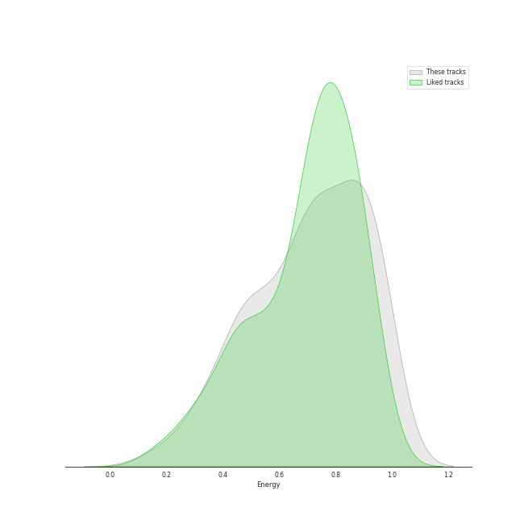
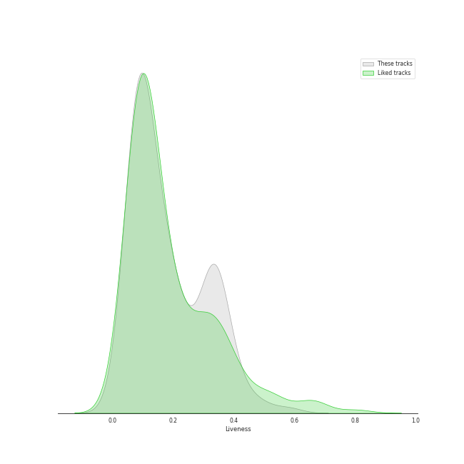
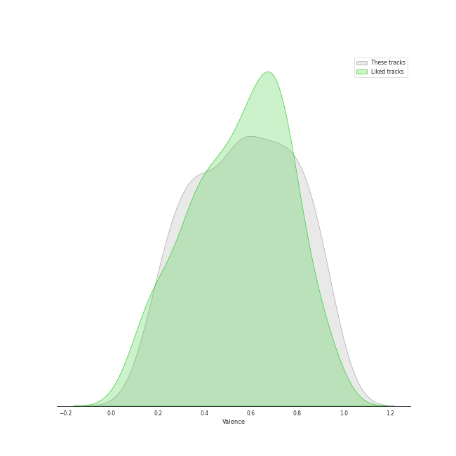

# Audio Features for International Pop

## Danceability

| ​ | 10 most Danceable tracks | ​​ | 10 least Danceable tracks |
|:---|:---|:---|:---|
|  | Bando (0.97) |  | Amore (0.167) |
|  | Ne reviens pas (0.932) |  | Awadama Fever (0.211) |
|  | Tippy Toes (0.913) |  | 永不失聯的愛 (0.289) |
|  | MALAMENTE - Cap.1: Augurio (0.893) |  | 落葉歸根 (0.29) |
|  | מי זאת (0.88) |  | No Rain, No Rainbow (0.323) |
|  | Think About Things (0.871) |  | 你要的愛 (0.328) |
|  | Gagnamagnið (0.869) |  | untuk hati yang terluka. (0.337) |
|  | Endurtaka Mig (0.847) |  | Cry Baby (0.346) |
|  | Sofa Silahlane (0.837) |  | ベテルギウス (0.367) |
|  | Jai Jai Shivshankar (From "War") (0.825) |  | Headbangeeeeerrrrr!!!!! (0.371) |

## Energy

| ​ | 10 most Energetic tracks | ​​ | 10 least Energetic tracks |
|:---|:---|:---|:---|
|  | チョコレイト・ディスコ (0.99) |  | 刻在我心底的名字 (Your Name Engraved Herein) - 電影<刻在你心底的名字>主題曲 (0.201) |
|  | Shanti Shanti Shanti (0.988) |  | 落葉歸根 (0.23) |
|  | Headbangeeeeerrrrr!!!!! (0.985) |  | Heaven (0.285) |
|  | Gimme Chocolate!! (0.985) |  | Gagnamagnið (0.303) |
|  | Boys & Girls (0.985) |  | untuk hati yang terluka. (0.312) |
|  | KARATE (0.982) |  | 你要的愛 (0.32) |
|  | だいじょばない (0.982) |  | Think About Things (0.341) |
|  | Awadama Fever (0.981) |  | Melawan Restu (0.344) |
|  | 404 not found (0.967) |  | 醒不来的梦 (0.362) |
|  | 恋をすると馬鹿を見る(Team B) (0.955) |  | Sofa Silahlane (0.38) |

## Speechiness

| ​ | 10 most Speechy tracks | ​​ | 10 least Speechy tracks |
|:---|:---|:---|:---|
|  | Te Felicito (0.317) |  | 情非得已 (0.0241) |
|  | Bando (0.295) |  | 就是愛妳 (0.0251) |
|  | 11 PM (0.277) |  | Pretender (0.0275) |
|  | KARATE (0.271) |  | ドライフラワー (0.0276) |
|  | Pleasure (0.258) |  | 悪ノ娘 (0.0278) |
|  | Leyendas (0.245) |  | Tetap Dalam Jiwa (0.0279) |
|  | Tout oublier (0.197) |  | 如果的事 (0.0293) |
|  | Shanti Shanti Shanti (0.196) |  | 醒不来的梦 (0.0297) |
|  | Awadama Fever (0.182) |  | Sisa Rasa (0.0302) |
|  | Djadja (0.165) |  | Melawan Restu (0.0318) |

## Acousticness

| ​ | 10 most Acoustic tracks | ​​ | 10 least Acoustic tracks |
|:---|:---|:---|:---|
|  | 刻在我心底的名字 (Your Name Engraved Herein) - 電影<刻在你心底的名字>主題曲 (0.873) |  | abnormalize (7.51e-06) |
|  | 落葉歸根 (0.862) |  | Kagerou (3.1e-05) |
|  | untuk hati yang terluka. (0.859) |  | Headbangeeeeerrrrr!!!!! (7.67e-05) |
|  | 如果的事 (0.828) |  | Gimme Chocolate!! (0.000282) |
|  | Melawan Restu (0.808) |  | Amore (0.000328) |
|  | עושה לי צרות (0.777) |  | Boys & Girls (0.000388) |
|  | 醒不来的梦 (0.756) |  | Awadama Fever (0.000405) |
|  | Heaven (0.741) |  | KARATE (0.00071) |
|  | Tetap Dalam Jiwa (0.722) |  | Koi (0.00081) |
|  | 永不失聯的愛 (0.624) |  | UN DIA (ONE DAY) (Feat. Tainy) (0.00536) |

## Instrumentalness

| ​ | 10 most Instrumental tracks | ​​ | 10 least Instrumental tracks |
|:---|:---|:---|:---|
|  | だいじょばない (0.844) |  | Meleğim (0.0) |
|  | Awadama Fever (0.555) |  | UN DIA (ONE DAY) (Feat. Tainy) (0.0) |
|  | Sofa Silahlane (0.531) |  | Wherever you are (0.0) |
|  | Shanti Shanti Shanti (0.318) |  | 炎 (0.0) |
|  | בשורות טובות (0.211) |  | Ne reviens pas (0.0) |
|  | KARATE (0.172) |  | Bando (0.0) |
|  | abnormalize (0.151) |  | Daisy 2.0 (feat. Hatsune Miku) (0.0) |
|  | Tippy Toes (0.106) |  | Pretender (0.0) |
|  | Headbangeeeeerrrrr!!!!! (0.0611) |  | 白日 (0.0) |
|  | JA ARA E (0.0267) |  | Papaoutai (0.0) |

## Liveness

| ​ | 10 most Live tracks | ​​ | 10 least Live tracks |
|:---|:---|:---|:---|
|  | Mercy (0.579) |  | Sofa Silahlane (0.0418) |
|  | ベテルギウス (0.494) |  | קוביות (0.0453) |
|  | סתלבט בקיבוץ (0.47) |  | チョコレイト・ディスコ (0.0519) |
|  | Kagerou (0.409) |  | Con Calma (0.0574) |
|  | 脳裏上のクラッカー (0.384) |  | Lo Malo (0.0613) |
|  | KARATE (0.36) |  | Look At Me (0.0623) |
|  | Cry Baby (0.358) |  | Pasoori (0.0625) |
|  | Endurtaka Mig (0.358) |  | No title (0.0638) |
|  | Shanti Shanti Shanti (0.355) |  | Papaoutai (0.0642) |
|  | 404 not found (0.338) |  | Despacito (0.067) |

## Valence

| ​ | 10 most Happy tracks | ​​ | 10 least Happy tracks |
|:---|:---|:---|:---|
|  | チョコレイト・ディスコ (0.963) |  | Sisa Rasa (0.152) |
|  | Me Enamoré (0.948) |  | Mercy (0.169) |
|  | סתלבט בקיבוץ (0.941) |  | Tetap Dalam Jiwa (0.179) |
|  | Ne reviens pas (0.931) |  | 你要的愛 (0.2) |
|  | 恋するフォーチュンクッキー (0.924) |  | 白月光与朱砂痣 (0.218) |
|  | 砂の惑星 ( + 初音ミク ) (0.917) |  | untuk hati yang terluka. (0.225) |
|  | Habit (0.912) |  | No Rain, No Rainbow (0.225) |
|  | No title (0.884) |  | KARATE (0.23) |
|  | Koi (0.878) |  | 醒不来的梦 (0.238) |
|  | The Ketchup Song (Aserejé) - Spanglish Version (0.868) |  | 落葉歸根 (0.253) |

## Tempo

| ​ | 10 most Fast tracks | ​​ | 10 least Fast tracks |
|:---|:---|:---|:---|
|  | Cry Baby (199.934) |  | 恋人じゃなくなった日 (74.996) |
|  | No title (199.751) |  | abnormalize (87.477) |
|  | Amore (191.854) |  | Heaven (87.789) |
|  | Headbangeeeeerrrrr!!!!! (185.009) |  | עושה לי צרות (89.329) |
|  | The Ketchup Song (Aserejé) - Spanglish Version (184.819) |  | Non mi avete fatto niente (90.025) |
|  | KARATE (179.924) |  | 白月光与朱砂痣 (90.033) |
|  | ベテルギウス (179.833) |  | Awadama Fever (91.088) |
|  | Despacito (177.928) |  | Pretender (91.972) |
|  | Te Felicito (174.14) |  | JA ARA E (91.991) |
|  | Wherever you are (173.716) |  | Pasoori (91.991) |
