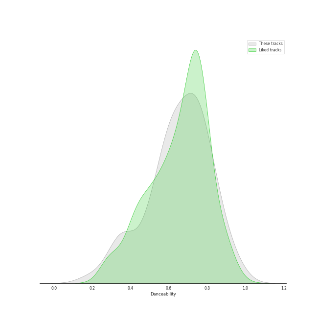
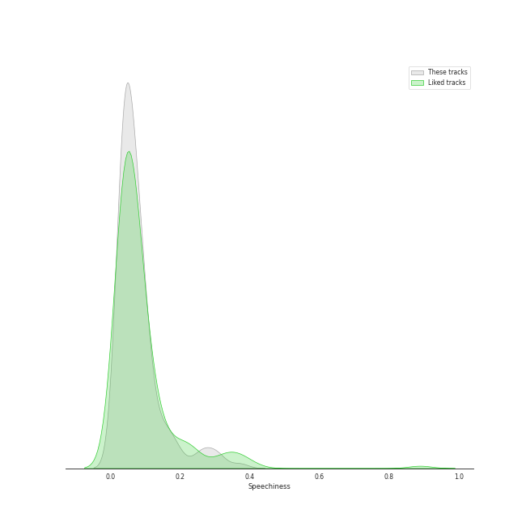
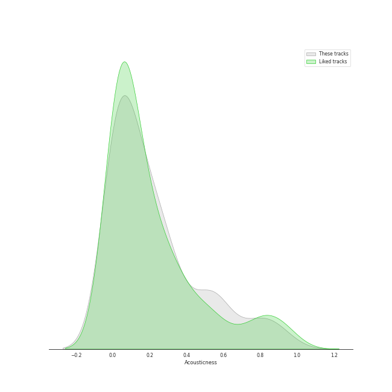
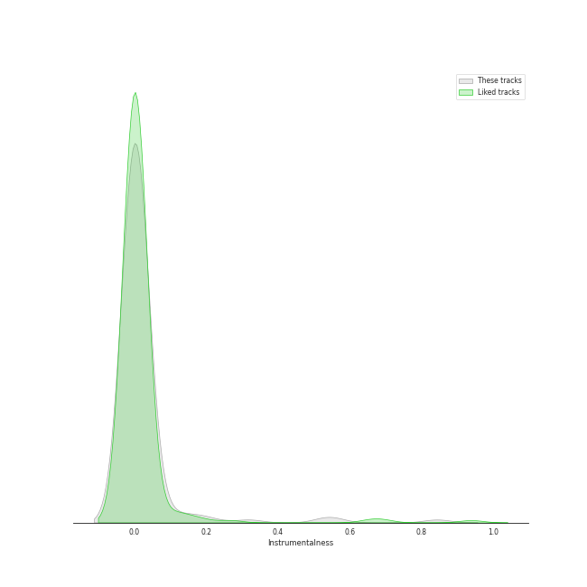
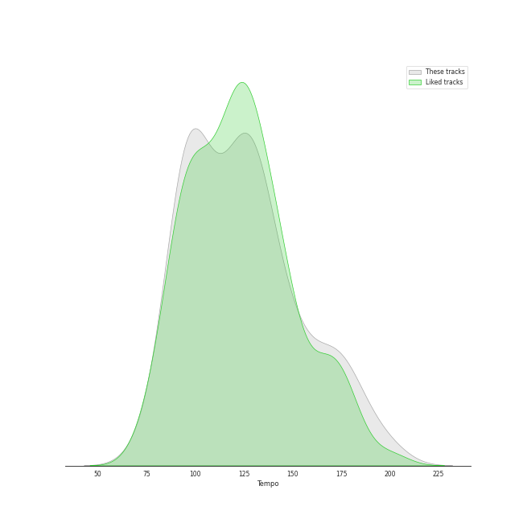

# Audio Features for International Pop

## Danceability

| 10 most Danceable tracks | 10 least Danceable tracks |
|:---|:---|
| Bando (0.97) | Amore (0.167) |
| Ne reviens pas (0.932) | Awadama Fever (0.211) |
| Tippy Toes (0.913) | 永不失聯的愛 (0.289) |
| MALAMENTE - Cap.1: Augurio (0.893) | 落葉歸根 (0.29) |
| מי זאת (0.88) | No Rain, No Rainbow (0.323) |
| Think About Things (0.871) | 你要的愛 (0.328) |
| Gagnamagnið (0.869) | untuk hati yang terluka. (0.337) |
| Endurtaka Mig (0.847) | Cry Baby (0.346) |
| Sofa Silahlane (0.837) | ベテルギウス (0.367) |
| Jai Jai Shivshankar (From "War") (0.825) | Headbangeeeeerrrrr!!!!! (0.371) |

## Energy

| 10 most Energetic tracks | 10 least Energetic tracks |
|:---|:---|
| チョコレイト・ディスコ (0.99) | 刻在我心底的名字 (Your Name Engraved Herein) - 電影<刻在你心底的名字>主題曲 (0.201) |
| Shanti Shanti Shanti (0.988) | 落葉歸根 (0.23) |
| Headbangeeeeerrrrr!!!!! (0.985) | Heaven (0.285) |
| Gimme Chocolate!! (0.985) | Gagnamagnið (0.303) |
| Boys & Girls (0.985) | untuk hati yang terluka. (0.312) |
| KARATE (0.982) | 你要的愛 (0.32) |
| だいじょばない (0.982) | Think About Things (0.341) |
| Awadama Fever (0.981) | Melawan Restu (0.344) |
| 404 not found (0.967) | 醒不来的梦 (0.362) |
| 恋をすると馬鹿を見る(Team B) (0.955) | Sofa Silahlane (0.38) |

## Speechiness

| 10 most Speechy tracks | 10 least Speechy tracks |
|:---|:---|
| Te Felicito (0.317) | 情非得已 (0.0241) |
| Bando (0.295) | 就是愛妳 (0.0251) |
| 11 PM (0.277) | Pretender (0.0275) |
| KARATE (0.271) | ドライフラワー (0.0276) |
| Pleasure (0.258) | 悪ノ娘 (0.0278) |
| Leyendas (0.245) | Tetap Dalam Jiwa (0.0279) |
| Tout oublier (0.197) | 如果的事 (0.0293) |
| Shanti Shanti Shanti (0.196) | 醒不来的梦 (0.0297) |
| Awadama Fever (0.182) | Sisa Rasa (0.0302) |
| Djadja (0.165) | Melawan Restu (0.0318) |

## Acousticness

| 10 most Acoustic tracks | 10 least Acoustic tracks |
|:---|:---|
| 刻在我心底的名字 (Your Name Engraved Herein) - 電影<刻在你心底的名字>主題曲 (0.873) | abnormalize (7.51e-06) |
| 落葉歸根 (0.862) | Kagerou (3.1e-05) |
| untuk hati yang terluka. (0.859) | Headbangeeeeerrrrr!!!!! (7.67e-05) |
| 如果的事 (0.828) | Gimme Chocolate!! (0.000282) |
| Melawan Restu (0.808) | Amore (0.000328) |
| עושה לי צרות (0.777) | Boys & Girls (0.000388) |
| 醒不来的梦 (0.756) | Awadama Fever (0.000405) |
| Heaven (0.741) | KARATE (0.00071) |
| Tetap Dalam Jiwa (0.722) | Koi (0.00081) |
| 永不失聯的愛 (0.624) | UN DIA (ONE DAY) (Feat. Tainy) (0.00536) |

## Instrumentalness

| 10 most Instrumental tracks | 10 least Instrumental tracks |
|:---|:---|
| だいじょばない (0.844) | Meleğim (0.0) |
| Awadama Fever (0.555) | UN DIA (ONE DAY) (Feat. Tainy) (0.0) |
| Sofa Silahlane (0.531) | Wherever you are (0.0) |
| Shanti Shanti Shanti (0.318) | 炎 (0.0) |
| בשורות טובות (0.211) | Ne reviens pas (0.0) |
| KARATE (0.172) | Bando (0.0) |
| abnormalize (0.151) | Daisy 2.0 (feat. Hatsune Miku) (0.0) |
| Tippy Toes (0.106) | Pretender (0.0) |
| Headbangeeeeerrrrr!!!!! (0.0611) | 白日 (0.0) |
| JA ARA E (0.0267) | Papaoutai (0.0) |

## Liveness

| 10 most Live tracks | 10 least Live tracks |
|:---|:---|
| Mercy (0.579) | Sofa Silahlane (0.0418) |
| ベテルギウス (0.494) | קוביות (0.0453) |
| סתלבט בקיבוץ (0.47) | チョコレイト・ディスコ (0.0519) |
| Kagerou (0.409) | Con Calma (0.0574) |
| 脳裏上のクラッカー (0.384) | Lo Malo (0.0613) |
| KARATE (0.36) | Look At Me (0.0623) |
| Cry Baby (0.358) | Pasoori (0.0625) |
| Endurtaka Mig (0.358) | No title (0.0638) |
| Shanti Shanti Shanti (0.355) | Papaoutai (0.0642) |
| 404 not found (0.338) | Despacito (0.067) |

## Valence

| 10 most Happy tracks | 10 least Happy tracks |
|:---|:---|
| チョコレイト・ディスコ (0.963) | Sisa Rasa (0.152) |
| Me Enamoré (0.948) | Mercy (0.169) |
| סתלבט בקיבוץ (0.941) | Tetap Dalam Jiwa (0.179) |
| Ne reviens pas (0.931) | 你要的愛 (0.2) |
| 恋するフォーチュンクッキー (0.924) | 白月光与朱砂痣 (0.218) |
| 砂の惑星 ( + 初音ミク ) (0.917) | untuk hati yang terluka. (0.225) |
| Habit (0.912) | No Rain, No Rainbow (0.225) |
| No title (0.884) | KARATE (0.23) |
| Koi (0.878) | 醒不来的梦 (0.238) |
| The Ketchup Song (Aserejé) - Spanglish Version (0.868) | 落葉歸根 (0.253) |

## Tempo

| 10 most Fast tracks | 10 least Fast tracks |
|:---|:---|
| Cry Baby (199.934) | 恋人じゃなくなった日 (74.996) |
| No title (199.751) | abnormalize (87.477) |
| Amore (191.854) | Heaven (87.789) |
| Headbangeeeeerrrrr!!!!! (185.009) | עושה לי צרות (89.329) |
| The Ketchup Song (Aserejé) - Spanglish Version (184.819) | Non mi avete fatto niente (90.025) |
| KARATE (179.924) | 白月光与朱砂痣 (90.033) |
| ベテルギウス (179.833) | Awadama Fever (91.088) |
| Despacito (177.928) | Pretender (91.972) |
| Te Felicito (174.14) | JA ARA E (91.991) |
| Wherever you are (173.716) | Pasoori (91.991) |
