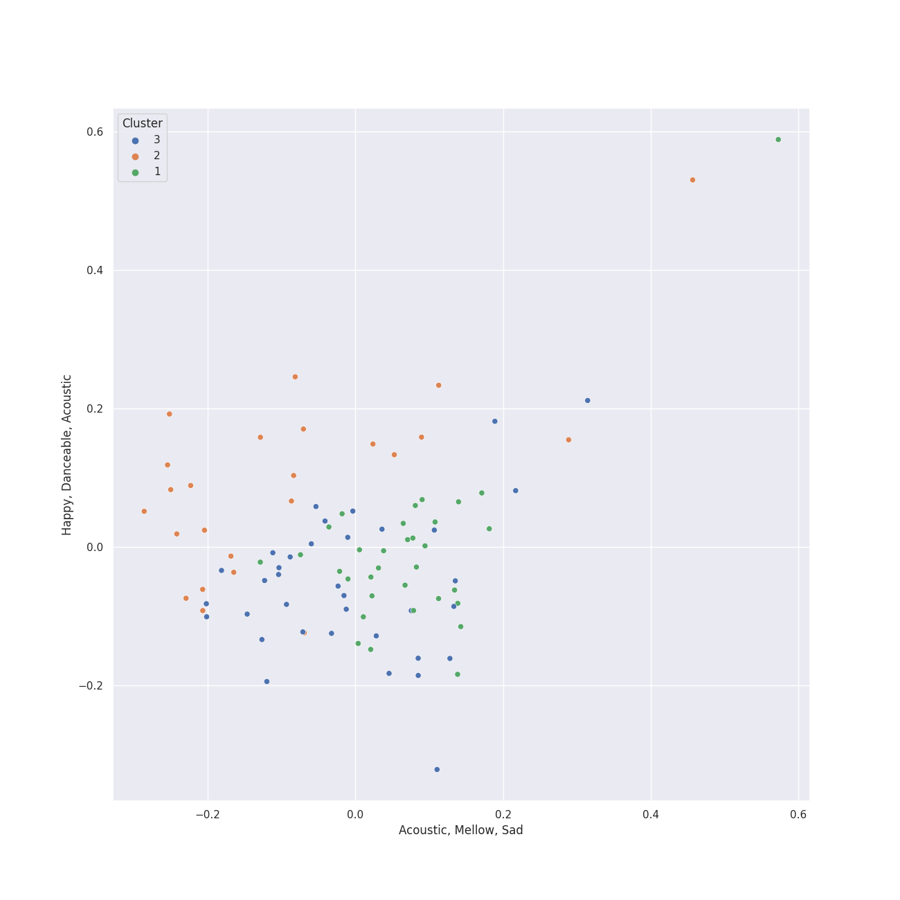

# Clusters in International Pop

## Cluster #1

46 tracks

| Art | Track | Album | Artists | Label | Rank | 💚 | 🔗 |
|:---|:---|:---|:---|:---|---:|:---|:---|
|  | Shinunoga E-Wa | HELP EVER HURT NEVER | Fujii Kaze | [Universal Music LLC](../../../../labels/universal_music_llc) | 468 | 💚 | [🔗](https://open.spotify.com/track/0o9zmvc5f3EFApU52PPIyW) |
|  | Matsuri | LOVE ALL SERVE ALL | Fujii Kaze | [Universal Music LLC](../../../../labels/universal_music_llc) | nan | | [🔗](https://open.spotify.com/track/7AMGgAPFczs3wJgMqu6Eqi) |
|  | Daisy 2.0 (feat. Hatsune Miku) | Daisy 2.0 (feat. Hatsune Miku) | Ashnikko, Hatsune Miku | [Parlophone UK](../../../../labels/parlophone_uk) | 378 | 💚 | [🔗](https://open.spotify.com/track/0s8RXkQW9lwGEV6WlG8KDq) |
|  | RIP, Love | CITIZENS | Faouzia | [Atlantic Records](../../../../labels/atlantic_records) | nan | 💚 | [🔗](https://open.spotify.com/track/4pDenOoD01LCPgkzJgu437) |
|  | Amigos (with Becky G) | Amigos (with Becky G) | [BIBI](../../../../artists/bibi/overview.md), Becky G | [Feel Ghood Music/88rising Music](../../../../labels/88rising_music) | nan | 💚 | [🔗](https://open.spotify.com/track/60DPrTJRHzpGPSJXLiSdDX) |
|  | DEJAYOU | DEJAYOU | PiXXiE | LIT ENTERTAINMENT | nan | 💚 | [🔗](https://open.spotify.com/track/1bgLH9NEAFkwnMwDmD8ScN) |
|  | Miku | Miku | Anamanaguchi, Hatsune Miku | Polyvinyl Records | nan | | [🔗](https://open.spotify.com/track/2wxeIeofgy4AHaOhtePamJ) |
|  | לך לישון | לך לישון | Anna Zak | ITModels under exclusive license to D-Music | nan | | [🔗](https://open.spotify.com/track/3fCS3m3uWUgAFm3purs15C) |
|  | 青春修炼手册 | 青春修炼手册 | TFBOYS | WM Taiwan | nan | | [🔗](https://open.spotify.com/track/7FrSronLW3WJJEVMvyRcdX) |
|  | Doobey (From "Gehraiyaan") | Doobey (From "Gehraiyaan") | OAFF, Savera, Lothika, Kausar Munir | Sony Music Entertainment India Pvt. Ltd. | nan | | [🔗](https://open.spotify.com/track/7MBqVOzb8C3f0FXr2LBLiq) |
## Cluster #2

49 tracks

| Art | Track | Album | Artists | Label | Rank | 💚 | 🔗 |
|:---|:---|:---|:---|:---|---:|:---|:---|
|  | 怪物 | 怪物 | YOASOBI | YOASOBI | 663 | 💚 | [🔗](https://open.spotify.com/track/06XQvnJb53SUYmlWIhUXUi) |
|  | 海のまにまに | 海のまにまに | YOASOBI | YOASOBI | 401 | 💚 | [🔗](https://open.spotify.com/track/0loZ1KfQSLJxYR0Y7dImKN) |
|  | 群青 | THE BOOK | YOASOBI | YOASOBI | 557 | | [🔗](https://open.spotify.com/track/1zd35Y44Blc1CwwVbW3Qnk) |
|  | 夜に駆ける | THE BOOK | YOASOBI | YOASOBI | nan | | [🔗](https://open.spotify.com/track/6MCjmGYlw6mQVWRFVgBRvB) |
|  | Bad | Under the Surface | Christopher | Parlophone Denmark | nan | 💚 | [🔗](https://open.spotify.com/track/66zdGutAO6NJmMjH8ejBIq) |
|  | 404 not found | Σ | Reol | TOY'S FACTORY | nan | 💚 | [🔗](https://open.spotify.com/track/2BY5fNHmpjV797ByjLX4I7) |
|  | Sin Pijama | Sin Pijama | Becky G, NATTI NATASHA | Sony Music Latin | nan | 💚 | [🔗](https://open.spotify.com/track/2ijef6ni2amuunRoKTlgww) |
|  | Koi | POP VIRUS | Gen Hoshino | Speedstar | nan | 💚 | [🔗](https://open.spotify.com/track/4nmjL1mUKOAfAbo9QG9tSE) |
|  | Lo Malo | Lo Malo | Aitana, Ana Guerra | Universal Music Spain S.L. | nan | 💚 | [🔗](https://open.spotify.com/track/5bhDL4GgUvr5LBrpjqyrte) |
|  | Toy | Toy | Netta | S-Curve Records | nan | 💚 | [🔗](https://open.spotify.com/track/6n2eIfLj0wOOUkUfNmYzlh) |
## Cluster #3

26 tracks

| Art | Track | Album | Artists | Label | Rank | 💚 | 🔗 |
|:---|:---|:---|:---|:---|---:|:---|:---|
|  | A Rock Somewhere (feat. Anoushka Shankar & Varijashree Venugopal) | Djesse Vol. 4 | [Jacob Collier](../../../../artists/jacob_collier/overview.md), Anoushka Shankar, Varijashree Venugopal | [Decca (UMO)](../../../../labels/decca_(umo)) | nan | 💚 | [🔗](https://open.spotify.com/track/0PZU2E5P51ZJOQDW1k5U8F) |
|  | Tetap Dalam Jiwa | EXPLORE! | Isyana Sarasvati | Sony Music Entertainment | 718 | 💚 | [🔗](https://open.spotify.com/track/1cKm6kQLMhc7N3mHS238fk) |
|  | Heaven | Heaven | Isyana Sarasvati, Afgan, Rendy Pandugo | Sony Music Entertainment Indonesia/Trinity Optima Production | nan | | [🔗](https://open.spotify.com/track/3gBFAvpAVSNohs3ESRMYHi) |
|  | Melawan Restu | fábula | Mahalini | Hits records | nan | 💚 | [🔗](https://open.spotify.com/track/3PP6leq3XCLDzi32Fb35Nw) |
|  | Sisa Rasa | fábula | Mahalini | Hits records | nan | 💚 | [🔗](https://open.spotify.com/track/6Iq3sgLVrqqZfRitLaeHkn) |
|  | עושה לי צרות | עושה לי צרות | Eden Hason | Mobile1 Music | nan | | [🔗](https://open.spotify.com/track/4I9NVCnjIRVriXfNE7VhE0) |
|  | ドライフラワー | 壱 | Yuuri | [Sony Music Labels Inc.](../../../../labels/sony_music_labels_inc_) | 520 | 💚 | [🔗](https://open.spotify.com/track/4kPlQKwtPrnqLgrmmKFSlA) |
|  | 恋人じゃなくなった日 | 恋人じゃなくなった日 | Yuuri | [Sony Music Labels Inc.](../../../../labels/sony_music_labels_inc_) | nan | | [🔗](https://open.spotify.com/track/7fQYRdNX6y8BpfmHvWVPm8) |
|  | 醒不来的梦 | 醒不来的梦 | 拾贰 | 一寸光年 | nan | 💚 | [🔗](https://open.spotify.com/track/5EGJ1vMllT1cYXbpymPdyf) |
|  | 就是愛妳 | 太平盛世 | David Tao | Gold Typhoon Taiwan | nan | | [🔗](https://open.spotify.com/track/73eCSQ1DxQbaOnzy8PhKx3) |