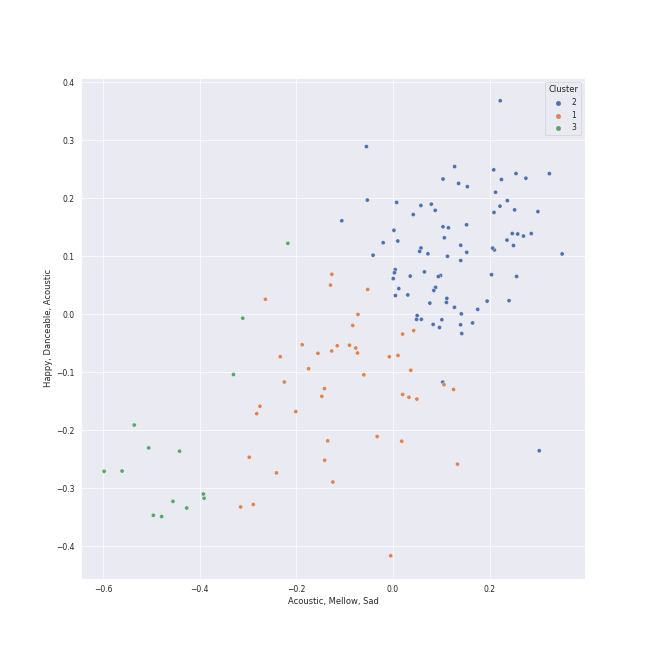

# Clusters in International Pop

## Cluster #1

43 tracks

| Art | Track | Album | Artists | Label | Rank | 💚 | 🔗 |
|:---|:---|:---|:---|:---|---:|:---|:---|
|  | Mi Corazón (feat. Camilo) | Djesse Vol. 4 | [Jacob Collier](../../../../artists/jacob_collier/overview.md), Camilo | [Decca (UMO)](../../../../labels/decca_(umo)) | 1031 | 💚 | [🔗](https://open.spotify.com/track/5Rg0oIXL40HY5CsUWD3IAJ) |
|  | 海のまにまに | 海のまにまに | [YOASOBI](../../../../artists/yoasobi/overview.md) | [YOASOBI](../../../../labels/yoasobi) | 612 | 💚 | [🔗](https://open.spotify.com/track/0loZ1KfQSLJxYR0Y7dImKN) |
|  | 群青 | THE BOOK | [YOASOBI](../../../../artists/yoasobi/overview.md) | [YOASOBI](../../../../labels/yoasobi) | 804 | | [🔗](https://open.spotify.com/track/1zd35Y44Blc1CwwVbW3Qnk) |
|  | My Heart | Under the Surface | Christopher | Parlophone Denmark | 1031 | 💚 | [🔗](https://open.spotify.com/track/1zVfFnkHv8ubJRXT30d4T3) |
|  | Miku | Miku | Anamanaguchi, Hatsune Miku | Polyvinyl Records | 1031 | | [🔗](https://open.spotify.com/track/2wxeIeofgy4AHaOhtePamJ) |
|  | PINK BLOOD | PINK BLOOD | Hikaru Utada | [Sony Music Labels Inc.](../../../../labels/sony_music_labels_inc_) | 1031 | | [🔗](https://open.spotify.com/track/39lq5gU4lPc0rYVaRo0stH) |
|  | Hässlich | Schwarzes Herz | AYLIVA | Whiteheart Records/WM Germany | 445 | 💚 | [🔗](https://open.spotify.com/track/3an1JVi8OsE0aG6dMS4Pes) |
|  | Cara Italia | Cara Italia | Ghali | WMI Italy | 993 | 💚 | [🔗](https://open.spotify.com/track/3atDsUhlUgDlQQrI0XFh7I) |
|  | מי זאת | מי זאת | Anna Zak | ITModels under exclusive license to D-Music | 1031 | 💚 | [🔗](https://open.spotify.com/track/3iJQ54fGO6CyP374UzvDJu) |
|  | בשורות טובות | בשורות טובות | Agam Buhbut, הפשוטע | 2022 Z.I. Productions BY PIL LTD | 1031 | | [🔗](https://open.spotify.com/track/5dUG9RrLElsi2sxJAhVUZJ) |
## Cluster #2

81 tracks

| Art | Track | Album | Artists | Label | Rank | 💚 | 🔗 |
|:---|:---|:---|:---|:---|---:|:---|:---|
|  | Meleğim | Vintage | Soolking, Dadju | Universal Music Division Capitol Music France | 1031 | | [🔗](https://open.spotify.com/track/0BD9boQC7jUTWkAoib4Z0d) |
|  | Shinunoga E-Wa | HELP EVER HURT NEVER | Fujii Kaze | [Universal Music LLC](../../../../labels/universal_music_llc) | 693 | 💚 | [🔗](https://open.spotify.com/track/0o9zmvc5f3EFApU52PPIyW) |
|  | Daisy 2.0 (feat. Hatsune Miku) | Daisy 2.0 (feat. Hatsune Miku) | Ashnikko, Hatsune Miku | [Parlophone UK](../../../../labels/parlophone_uk) | 587 | 💚 | [🔗](https://open.spotify.com/track/0s8RXkQW9lwGEV6WlG8KDq) |
|  | Tears of Gold | Tears of Gold | Faouzia | Faouzia 2019 | 1031 | 💚 | [🔗](https://open.spotify.com/track/2YyLNljkMy2viVcXoFGTDY) |
|  | Born Without a Heart | Born Without a Heart | Faouzia | Faouzia 2019 | 1031 | 💚 | [🔗](https://open.spotify.com/track/6i5jBmnB22alUpJ7hpznuj) |
|  | Bad | Under the Surface | Christopher | Parlophone Denmark | 1031 | 💚 | [🔗](https://open.spotify.com/track/66zdGutAO6NJmMjH8ejBIq) |
|  | Beggin' | Chosen | Måneskin | [RCA Records Label](../../../../labels/rca_records_label) | 686 | 💚 | [🔗](https://open.spotify.com/track/3Wrjm47oTz2sjIgck11l5e) |
|  | לך לישון | לך לישון | Anna Zak | ITModels under exclusive license to D-Music | 1031 | | [🔗](https://open.spotify.com/track/3fCS3m3uWUgAFm3purs15C) |
|  | W / X / Y | Memories | Tani Yuuki | Valley Records | 1031 | | [🔗](https://open.spotify.com/track/4IfrM44LofE9bSs6TDZS49) |
|  | 青春修炼手册 | 青春修炼手册 | TFBOYS | WM Taiwan | 1031 | | [🔗](https://open.spotify.com/track/7FrSronLW3WJJEVMvyRcdX) |
## Cluster #3

14 tracks

| Art | Track | Album | Artists | Label | Rank | 💚 | 🔗 |
|:---|:---|:---|:---|:---|---:|:---|:---|
|  | A Rock Somewhere (feat. Anoushka Shankar & Varijashree Venugopal) | Djesse Vol. 4 | [Jacob Collier](../../../../artists/jacob_collier/overview.md), Anoushka Shankar, Varijashree Venugopal | [Decca (UMO)](../../../../labels/decca_(umo)) | 1031 | 💚 | [🔗](https://open.spotify.com/track/0PZU2E5P51ZJOQDW1k5U8F) |
|  | Tetap Dalam Jiwa | EXPLORE! | Isyana Sarasvati | Sony Music Entertainment | 1010 | 💚 | [🔗](https://open.spotify.com/track/1cKm6kQLMhc7N3mHS238fk) |
|  | untuk hati yang terluka. | LEXICON | Isyana Sarasvati | Sony Music Entertainment | 1031 | | [🔗](https://open.spotify.com/track/28r2ClCmnKAclZZYqE0LTg) |
|  | Heaven | Heaven | Isyana Sarasvati, Afgan, Rendy Pandugo | Sony Music Entertainment Indonesia/Trinity Optima Production | 1031 | | [🔗](https://open.spotify.com/track/3gBFAvpAVSNohs3ESRMYHi) |
|  | L’Amour, Les Baguettes, Paris | Stairs | Stella Jang | GLG | 1031 | 💚 | [🔗](https://open.spotify.com/track/2g6FVCA4sQZOv9LXIABsgr) |
|  | 刻在我心底的名字 (Your Name Engraved Herein) - 電影<刻在你心底的名字>主題曲 | 刻在我心底的名字 (Your Name Engraved Herein) | Crowd Lu | Team Ear Music | 1031 | | [🔗](https://open.spotify.com/track/3OC84eKMxRJ4x0Hcwl9i4i) |
|  | Melawan Restu | fábula | Mahalini | Hits records | 1031 | 💚 | [🔗](https://open.spotify.com/track/3PP6leq3XCLDzi32Fb35Nw) |
|  | עושה לי צרות | עושה לי צרות | Eden Hason | Mobile1 Music | 1031 | | [🔗](https://open.spotify.com/track/4I9NVCnjIRVriXfNE7VhE0) |
|  | 醒不来的梦 | 醒不来的梦 | 拾贰 | 一寸光年 | 1031 | 💚 | [🔗](https://open.spotify.com/track/5EGJ1vMllT1cYXbpymPdyf) |
|  | 落葉歸根 | 改變自己 | Leehom Wang | Homeboy music, Ltd | 1031 | | [🔗](https://open.spotify.com/track/6jQxLsqg2ybACXp7sYsvyZ) |