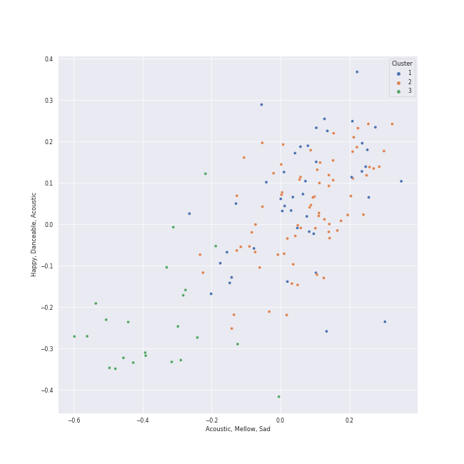

# Clusters in International Pop

## Cluster #1

25 tracks

| Art | Track | Album | Artists | Label | Score | 💚 | 🔗 |
|:---|:---|:---|:---|:---|---:|:---|:---|
|  | Tetap Dalam Jiwa | EXPLORE! | Isyana Sarasvati | Sony Music Entertainment | 2 | 💚 | [🔗](https://open.spotify.com/track/1cKm6kQLMhc7N3mHS238fk) |
|  | Heaven | Heaven | Isyana Sarasvati, Afgan, Rendy Pandugo | Sony Music Entertainment Indonesia/Trinity Optima Production | 0 | | [🔗](https://open.spotify.com/track/3gBFAvpAVSNohs3ESRMYHi) |
|  | Melawan Restu | fábula | Mahalini | Hits records | 0 | 💚 | [🔗](https://open.spotify.com/track/3PP6leq3XCLDzi32Fb35Nw) |
|  | 如果的事 | 一比一 | Christine Fan, Angela Chang | Linfair | 0 | | [🔗](https://open.spotify.com/track/47qkmo2smLRBNlbzDEwZHS) |
|  | עושה לי צרות | עושה לי צרות | Eden Hason | Mobile1 Music | 0 | | [🔗](https://open.spotify.com/track/4I9NVCnjIRVriXfNE7VhE0) |
|  | ドライフラワー | 壱 | Yuuri | [Sony Music Labels Inc.](../../../../labels/sony_music_labels_inc_) | 62 | 💚 | [🔗](https://open.spotify.com/track/4kPlQKwtPrnqLgrmmKFSlA) |
|  | 恋人じゃなくなった日 | 恋人じゃなくなった日 | Yuuri | [Sony Music Labels Inc.](../../../../labels/sony_music_labels_inc_) | 0 | | [🔗](https://open.spotify.com/track/7fQYRdNX6y8BpfmHvWVPm8) |
|  | ก่อนฤดูฝน | SUN | THE TOYS | What The Duck | 0 | | [🔗](https://open.spotify.com/track/5BS4lRz13ztnSaBy8spQ7W) |
|  | 醒不来的梦 | 醒不来的梦 | 拾贰 | 一寸光年 | 0 | 💚 | [🔗](https://open.spotify.com/track/5EGJ1vMllT1cYXbpymPdyf) |
|  | 就是愛妳 | 太平盛世 | David Tao | Gold Typhoon Taiwan | 0 | | [🔗](https://open.spotify.com/track/73eCSQ1DxQbaOnzy8PhKx3) |
## Cluster #2

67 tracks

| Art | Track | Album | Artists | Label | Score | 💚 | 🔗 |
|:---|:---|:---|:---|:---|---:|:---|:---|
|  | セブンティーン | セブンティーン | YOASOBI | YOASOBI | 37 | 💚 | [🔗](https://open.spotify.com/track/1TXhBe3DnaOFc7onTbEoiB) |
|  | Waka Waka (This Time for Africa) [The Official 2010 FIFA World Cup (TM) Song] (feat. Freshlyground) | Waka Waka (This Time for Africa) [The Official 2010 FIFA World Cup (TM) Song] (feat. Freshlyground) | Shakira, Freshlyground | [Epic](../../../../labels/epic) | 0 | 💚 | [🔗](https://open.spotify.com/track/2Cd9iWfcOpGDHLz6tVA3G4) |
|  | La Tortura (feat. Alejandro Sanz) | Fijación Oral, Vol. 1 | Shakira, Alejandro Sanz | [Epic](../../../../labels/epic) | 0 | | [🔗](https://open.spotify.com/track/5BSclXJTa9B0iURhUjZo50) |
|  | Échame La Culpa | Échame La Culpa | Luis Fonsi, Demi Lovato | Echame La Culpa PS | 0 | | [🔗](https://open.spotify.com/track/2hl6q70unbviGo3g1R7uFx) |
|  | W / X / Y | Memories | Tani Yuuki | Valley Records | 0 | | [🔗](https://open.spotify.com/track/4IfrM44LofE9bSs6TDZS49) |
|  | Lykke te | Lykke te | Synne Vo | WM Norway | 0 | | [🔗](https://open.spotify.com/track/4vXBW2z1uXXyMvCkDG6c5Z) |
|  | Cha Cha Cha | Cha Cha Cha | Käärijä | WM Finland | 0 | | [🔗](https://open.spotify.com/track/5RX8T3EoTuXcybAxe6oPAw) |
|  | Con Calma | Con Calma | Daddy Yankee, Snow | El Cartel Records (EC3) | 0 | 💚 | [🔗](https://open.spotify.com/track/5w9c2J52mkdntKOmRLeM2m) |
|  | Toy | Toy | Netta | S-Curve Records | 0 | 💚 | [🔗](https://open.spotify.com/track/6n2eIfLj0wOOUkUfNmYzlh) |
|  | Pasoori | Pasoori | Shae Gill, Ali Sethi | Giraffe Pakistan | 0 | | [🔗](https://open.spotify.com/track/7lvDsmTRXFE3dK4OjvRiWB) |
## Cluster #3

28 tracks

| Art | Track | Album | Artists | Label | Score | 💚 | 🔗 |
|:---|:---|:---|:---|:---|---:|:---|:---|
|  | abnormalize | i'mperfect | Ling tosite sigure | [Sony Music Labels Inc.](../../../../labels/sony_music_labels_inc_) | 0 | | [🔗](https://open.spotify.com/track/00nmZvZRyzQiYe2tAcDDUb) |
|  | Boys & Girls | A BEST | Ayumi Hamasaki | [avex trax](../../../../labels/avex_trax) | 0 | | [🔗](https://open.spotify.com/track/0QcVKhVp9iHGZ1pj04yTbO) |
|  | Wherever you are | Niche Syndrome | ONE OK ROCK | Aer-born | 0 | | [🔗](https://open.spotify.com/track/0YAMQSmHk6BSUGTYpaoqTJ) |
|  | Matsuri | LOVE ALL SERVE ALL | Fujii Kaze | [Universal Music LLC](../../../../labels/universal_music_llc) | 0 | | [🔗](https://open.spotify.com/track/7AMGgAPFczs3wJgMqu6Eqi) |
|  | RIP, Love | CITIZENS | Faouzia | [Atlantic Records](../../../../labels/atlantic_records) | 0 | 💚 | [🔗](https://open.spotify.com/track/4pDenOoD01LCPgkzJgu437) |
|  | Pretender | Traveler | OFFICIAL HIGE DANDISM | PONY CANYON INC. | 0 | | [🔗](https://open.spotify.com/track/15HNdxGKNCIO9pgaY4n7FU) |
|  | I Love... | Editorial | OFFICIAL HIGE DANDISM | IRORI Records | 0 | | [🔗](https://open.spotify.com/track/2hwcYq85TVuj6GhBBTuWdg) |
|  | Cry Baby | Editorial | OFFICIAL HIGE DANDISM | IRORI Records | 0 | | [🔗](https://open.spotify.com/track/7nF9c1EmRF3BNAtKDCwUAK) |
|  | Headbangeeeeerrrrr!!!!! | BABYMETAL | [BABYMETAL](../../../../artists/babymetal/overview.md) | Cooking Vinyl Limited | 75 | 💚 | [🔗](https://open.spotify.com/track/7zuuWZo0MyOdG3VHg1Mgml) |
|  | Like A Lady | Cheater | Pom Poko | Bella Union | 0 | 💚 | [🔗](https://open.spotify.com/track/1YfdZkKYJKGSyzJ5LMtEcW) |