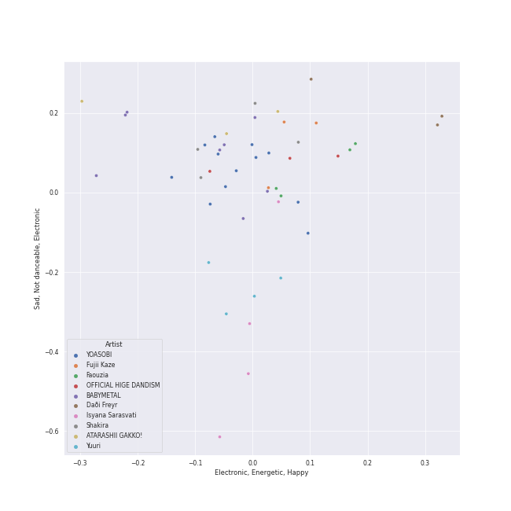
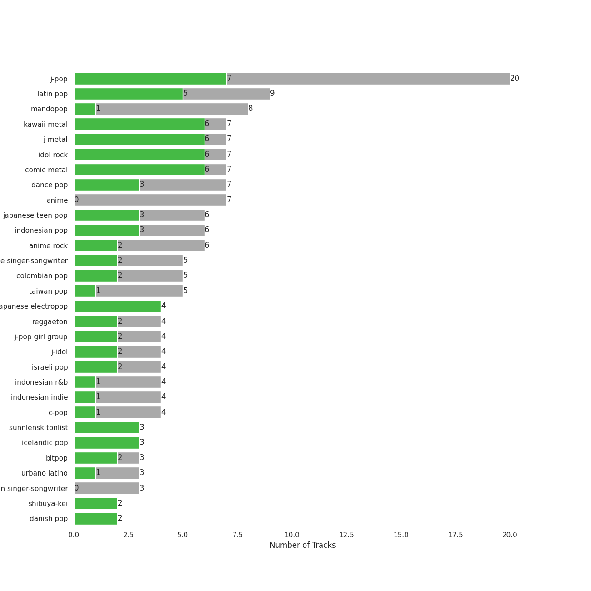

# International Pop

[105 tracks (50 liked) 🔗](https://open.spotify.com/playlist/36OHPiYrLGYMfVa0zcHgLf)

[See Track Features](audio_features.md)

[See Clusters](clusters/overview.md)

## Top Artists

| Art | Tracks | 💚 | Artist | 🔗 |
|:---|---:|---:|:---|:---|
|  | 8 | 6 | [BABYMETAL](../../artists/babymetal/overview.md) | [🔗](https://open.spotify.com/artist/630wzNP2OL7fl4Xl0GnMWq) |
|  | 3 | 3 | Daði Freyr | [🔗](https://open.spotify.com/artist/3Hb64DQZIhDCgyHKrzBXOL) |
|  | 5 | 2 | Shakira | [🔗](https://open.spotify.com/artist/0EmeFodog0BfCgMzAIvKQp) |
|  | 3 | 2 | Fujii Kaze | [🔗](https://open.spotify.com/artist/6bDWAcdtVR3WHz2xtiIPUi) |
|  | 2 | 2 | Reol | [🔗](https://open.spotify.com/artist/7rpKUJ0AnklJ8q9nIPVSpZ) |
|  | 2 | 2 | Daddy Yankee | [🔗](https://open.spotify.com/artist/4VMYDCV2IEDYJArk749S6m) |
|  | 2 | 2 | Christopher | [🔗](https://open.spotify.com/artist/3zDRCqOhJXJfS2YWOEwGMC) |
|  | 2 | 2 | Mahalini | [🔗](https://open.spotify.com/artist/3wOsYKZM0zcKNasi3I7fP4) |
|  | 2 | 2 | Perfume | [🔗](https://open.spotify.com/artist/2XMxWKPKCxoLkSdpCViCnr) |
|  | 4 | 1 | Isyana Sarasvati | [🔗](https://open.spotify.com/artist/05CRzFTp7TouOXPuH6Tapu) |

See top 100 artists

| Art | Tracks | 💚 | Artist | 🔗 |
|:---|---:|---:|:---|:---|
|  | 3 | 1 | Anna Zak | [🔗](https://open.spotify.com/artist/3lVXtKsFTJM8ecY8gqdoCo) |
|  | 3 | 1 | Yuuri | [🔗](https://open.spotify.com/artist/0ixzjrK1wkN2zWBXt3VW3W) |
|  | 2 | 1 | Luis Fonsi | [🔗](https://open.spotify.com/artist/4V8Sr092TqfHkfAA5fXXqG) |
|  | 1 | 1 | ROSALÍA | [🔗](https://open.spotify.com/artist/7ltDVBr6mKbRvohxheJ9h1) |
|  | 1 | 1 | Aitana | [🔗](https://open.spotify.com/artist/7eLcDZDYHXZCebtQmVFL25) |
|  | 1 | 1 | ANNA | [🔗](https://open.spotify.com/artist/7K80yOTC0Id95gRaOxDG5u) |
|  | 1 | 1 | Aya Nakamura | [🔗](https://open.spotify.com/artist/7IlRNXHjoOCgEAWN5qYksg) |
|  | 1 | 1 | Freshlyground | [🔗](https://open.spotify.com/artist/7AcV1lk8Zrgo1691PDWEle) |
|  | 1 | 1 | DARA | [🔗](https://open.spotify.com/artist/6WRl7KUrzOq7GpY97KrYxi) |
|  | 1 | 1 | Harlem Yu | [🔗](https://open.spotify.com/artist/6VbRanWSU3pdDhJnhSfGmY) |
|  | 1 | 1 | Vishal Dadlani | [🔗](https://open.spotify.com/artist/6CXEwIaXYfVJ84biCxqc9k) |
|  | 1 | 1 | YOASOBI | [🔗](https://open.spotify.com/artist/64tJ2EAv1R6UaZqc4iOCyj) |
|  | 1 | 1 | Benny Dayal | [🔗](https://open.spotify.com/artist/61if35zz1W11GejEkxTLEQ) |
|  | 1 | 1 | Stromae | [🔗](https://open.spotify.com/artist/5j4HeCoUlzhfWtjAfM1acR) |
|  | 1 | 1 | Blær | [🔗](https://open.spotify.com/artist/5W6FVpHHiRfqUU4d9FfXWZ) |
|  | 1 | 1 | 張楚寒 | [🔗](https://open.spotify.com/artist/4zzzvh8xX7laDArf8Gt7iw) |
|  | 1 | 1 | Becky G | [🔗](https://open.spotify.com/artist/4obzFoKoKRHIphyHzJ35G3) |
|  | 1 | 1 | Netta | [🔗](https://open.spotify.com/artist/4Z4afeDmHFxPmJorIwupbZ) |
|  | 1 | 1 | Ermal Meta | [🔗](https://open.spotify.com/artist/4XWTdNlsP8jqo5BDn5hgmd) |
|  | 1 | 1 | Burna Boy | [🔗](https://open.spotify.com/artist/3wcj11K77LjEY1PkEazffa) |
|  | 1 | 1 | Snow | [🔗](https://open.spotify.com/artist/3uZFBSsMiooimnprFL9jD1) |
|  | 1 | 1 | Ghali | [🔗](https://open.spotify.com/artist/3egWSWp7Y4FyCKIyvXbw7L) |
|  | 1 | 1 | Fabrizio Moro | [🔗](https://open.spotify.com/artist/3ebOqZZsLCDAkLS6QdI8cc) |
|  | 1 | 1 | Angèle | [🔗](https://open.spotify.com/artist/3QVolfxko2UyCOtexhVTli) |
|  | 1 | 1 | Ana Guerra | [🔗](https://open.spotify.com/artist/3MRynBsyLGzv3IQ9Fip6hO) |
|  | 1 | 1 | ZUTOMAYO | [🔗](https://open.spotify.com/artist/38WbKH6oKAZskBhqDFA8Uj) |
|  | 1 | 1 | 拾贰 | [🔗](https://open.spotify.com/artist/30YrwNoKzUtyVQsIrwtMdr) |
|  | 1 | 1 | Roméo Elvis | [🔗](https://open.spotify.com/artist/2pHk4wAmL7ofTAuvCIUWtv) |
|  | 1 | 1 | 大籽 | [🔗](https://open.spotify.com/artist/2NJLAUSe3Ifk9MiHbddRAi) |
|  | 1 | 1 | Madame Monsieur | [🔗](https://open.spotify.com/artist/1tQn5gWbo3ee6n2Z52ogY5) |
|  | 1 | 1 | Gen Hoshino | [🔗](https://open.spotify.com/artist/1S2S00lgLYLGHWA44qGEUs) |
|  | 1 | 1 | NATTI NATASHA | [🔗](https://open.spotify.com/artist/1GDbiv3spRmZ1XdM1jQbT7) |
|  | 1 | 1 | Hoàng Thùy Linh | [🔗](https://open.spotify.com/artist/0r63ReVRjxrS4ATbLrdcrL) |
|  | 1 | 1 | XG | [🔗](https://open.spotify.com/artist/0LOK81e9H5lr61HlGGHqwA) |
|  | 1 | 1 | Lu-Ni | [🔗](https://open.spotify.com/artist/0AythHu8oDXnRGp8qviBPj) |
|  | 3 | 0 | Hatsune Miku | [🔗](https://open.spotify.com/artist/6pNgnvzBa6Bthsv8SrZJYl) |
|  | 3 | 0 | OFFICIAL HIGE DANDISM | [🔗](https://open.spotify.com/artist/5Vo1hnCRmCM6M4thZCInCj) |
|  | 2 | 0 | AKB48 | [🔗](https://open.spotify.com/artist/01wau5CL3Z1vfJJWkzBkqg) |
|  | 1 | 0 | Lothika | [🔗](https://open.spotify.com/artist/7yZDrVInKssNCaZkAkQGTX) |
|  | 1 | 0 | הפשוטע | [🔗](https://open.spotify.com/artist/7m92aMieltH5ZpodCEHfnb) |
|  | 1 | 0 | Hikaru Utada | [🔗](https://open.spotify.com/artist/7lbSsjYACZHn1MSDXPxNF2) |
|  | 1 | 0 | ONE OK ROCK | [🔗](https://open.spotify.com/artist/7k73EtZwoPs516ZxE72KsO) |
|  | 1 | 0 | mothy | [🔗](https://open.spotify.com/artist/7LOYTIZlvOwx83g2iBL3eM) |
|  | 1 | 0 | SEKAI NO OWARI | [🔗](https://open.spotify.com/artist/7HwzlRPa9Ad0I8rK0FPzzK) |
|  | 1 | 0 | King Gnu | [🔗](https://open.spotify.com/artist/6wxfx1yhyqjCPYwwxJktR2) |
|  | 1 | 0 | Eden Hason | [🔗](https://open.spotify.com/artist/6uQl3gu1AIXyvqCAxnc2q4) |
|  | 1 | 0 | Jimbo J | [🔗](https://open.spotify.com/artist/6ltKIf1bortd0DQbpgKdQu) |
|  | 1 | 0 | WARPs UP | [🔗](https://open.spotify.com/artist/6ZhCKGX2nkK7s8vdUvaocx) |
|  | 1 | 0 | Demi Lovato | [🔗](https://open.spotify.com/artist/6S2OmqARrzebs0tKUEyXyp) |
|  | 1 | 0 | [Dua Lipa](../../artists/dua_lipa/overview.md) | [🔗](https://open.spotify.com/artist/6M2wZ9GZgrQXHCFfjv46we) |
|  | 1 | 0 | Käärijä | [🔗](https://open.spotify.com/artist/6LkMGN0t3HDNL8hIvma70r) |
|  | 1 | 0 | Alejandro Sanz | [🔗](https://open.spotify.com/artist/5sUrlPAHlS9NEirDB8SEbF) |
|  | 1 | 0 | THE TOYS | [🔗](https://open.spotify.com/artist/5pokGZ1K9Hr6etaKPDxSG8) |
|  | 1 | 0 | Lowsheen | [🔗](https://open.spotify.com/artist/5lnxhnW7SIbxkkFVmVYEhU) |
|  | 1 | 0 | Eric Chou | [🔗](https://open.spotify.com/artist/5fEQLwq1BWWQNR8GzhOIvi) |
|  | 1 | 0 | Synne Vo | [🔗](https://open.spotify.com/artist/5WDOXIkjKNjEzlXmLgZVz9) |
|  | 1 | 0 | Master KG | [🔗](https://open.spotify.com/artist/523y9KSneKh6APd1hKxLuF) |
|  | 1 | 0 | Angela Chang | [🔗](https://open.spotify.com/artist/4txug0T3vYc9p20tuhfCUa) |
|  | 1 | 0 | Dadju | [🔗](https://open.spotify.com/artist/4sbXXFzEWJY2zsZjelerjX) |
|  | 1 | 0 | Bad Bunny | [🔗](https://open.spotify.com/artist/4q3ewBCX7sLwd24euuV69X) |
|  | 1 | 0 | Afgan | [🔗](https://open.spotify.com/artist/4cgBCGxtlfap2g6jveB7du) |
|  | 1 | 0 | Nkosazana Daughter | [🔗](https://open.spotify.com/artist/4AnNB3lPD0Sv7ziKVHqI66) |
|  | 1 | 0 | David Tao | [🔗](https://open.spotify.com/artist/40tNK2YedBV2jRFAHxpifB) |
|  | 1 | 0 | Kawaguchi Yurina | [🔗](https://open.spotify.com/artist/3snqW31jInsZwoYRZTaixr) |
|  | 1 | 0 | Shae Gill | [🔗](https://open.spotify.com/artist/3bWIy9AUrQdiNeS62Bp3OP) |
|  | 1 | 0 | Heuss L'enfoiré | [🔗](https://open.spotify.com/artist/3YwqjMyrRfuixi2pbgTGCE) |
|  | 1 | 0 | Ashnikko | [🔗](https://open.spotify.com/artist/3PyJHH2wyfQK3WZrk9rpmP) |
|  | 1 | 0 | Ali Sethi | [🔗](https://open.spotify.com/artist/3NegWDGp038A3FIi3gSYzl) |
|  | 1 | 0 | Ayumi Hamasaki | [🔗](https://open.spotify.com/artist/3Mvc8kRgr8LRYYgvFmlZqn) |
|  | 1 | 0 | Agam Buhbut | [🔗](https://open.spotify.com/artist/3JPKPnzWJGjccn8SnjwA5i) |
|  | 1 | 0 | Kausar Munir | [🔗](https://open.spotify.com/artist/3GBSge8pq7mpezUQl0GAOA) |
|  | 1 | 0 | Rayi Putra | [🔗](https://open.spotify.com/artist/3FduEXHFSq8Hboekc8JMUR) |
|  | 1 | 0 | Savera | [🔗](https://open.spotify.com/artist/3CVXA5TAWpmfGPqyMqXpPb) |
|  | 1 | 0 | MAXIMUM THE HORMONE | [🔗](https://open.spotify.com/artist/3AMut7lAb1JjINkn8Fmkhu) |
|  | 1 | 0 | Gradur | [🔗](https://open.spotify.com/artist/2tcoLkA9Hexz70Kuc1NTUl) |
|  | 1 | 0 | OAFF | [🔗](https://open.spotify.com/artist/2k66ibJfgMigF5QWqUgLyR) |
|  | 1 | 0 | Wanitwa Mos | [🔗](https://open.spotify.com/artist/2iN5MhOgkenO5FtkPtEVAF) |
|  | 1 | 0 | Anamanaguchi | [🔗](https://open.spotify.com/artist/2UwJRAgSOi1zcLkvUNc8XL) |
|  | 1 | 0 | Anuel AA | [🔗](https://open.spotify.com/artist/2R21vXR83lH98kGeO99Y66) |
|  | 1 | 0 | Crowd Lu | [🔗](https://open.spotify.com/artist/2JBUyLiFvpFPWdZGqIGYLD) |
|  | 1 | 0 | Leehom Wang | [🔗](https://open.spotify.com/artist/2F5W6Rsxwzg0plQ0w8dSyt) |
|  | 1 | 0 | J Balvin | [🔗](https://open.spotify.com/artist/1vyhD5VmyZ7KMfW5gqLgo5) |
|  | 1 | 0 | Kenshi Yonezu | [🔗](https://open.spotify.com/artist/1snhtMLeb2DYoMOcVbb8iB) |
|  | 1 | 0 | Maluma | [🔗](https://open.spotify.com/artist/1r4hJ1h58CWwUQe3MxPuau) |
|  | 1 | 0 | Christine Fan | [🔗](https://open.spotify.com/artist/1q7sCl0vg0EcaFdRz0XDGg) |
|  | 1 | 0 | Rauw Alejandro | [🔗](https://open.spotify.com/artist/1mcTU81TzQhprhouKaTkpq) |
|  | 1 | 0 | Las Ketchup | [🔗](https://open.spotify.com/artist/1e8GEl48ktvfDpruMKB6Oe) |
|  | 1 | 0 | TFBOYS | [🔗](https://open.spotify.com/artist/1dywcVTpMrP7VmQUhngSce) |
|  | 1 | 0 | Full Trunk | [🔗](https://open.spotify.com/artist/1CD5WWtF6AFUq6BTY20I4k) |
|  | 1 | 0 | Static & Ben El | [🔗](https://open.spotify.com/artist/0xHa28taiElkcQf9o3z76g) |

## Top Albums

| Art | Tracks | 💚 | Album | Release Date | 🔗 |
|:---|---:|---:|:---|:---|:---|
|  | 4 | 2 | METAL RESISTANCE | 2016-04-01 | [🔗](https://open.spotify.com/album/2vIRdYffs93ca7L0Eh4mTm) |
|  | 2 | 2 | fábula | 2023-01-23 | [🔗](https://open.spotify.com/album/6iBh7T1cUR8MPrtly5xugU) |
|  | 2 | 2 | Under the Surface | 2019-02-22 | [🔗](https://open.spotify.com/album/6ISIdF1gCK9X8pn4FaObHE) |
|  | 2 | 2 | METAL GALAXY | 2019-10-11 | [🔗](https://open.spotify.com/album/6rxRhft7JZtXavzHP2g2el) |
|  | 2 | 2 | BABYMETAL | 2015-05-11 | [🔗](https://open.spotify.com/album/6Eepi724OOt38pTaUrZErI) |
|  | 2 | 1 | 壱 | 2022-01-12 | [🔗](https://open.spotify.com/album/1YWoHzj5wHnG7m6gLlwBQd) |
|  | 2 | 1 | EXPLORE! | 2015-11-25 | [🔗](https://open.spotify.com/album/6TXaOwBLoyJrD6vem7L8Ba) |
|  | 2 | 0 | Editorial | 2021-08-18 | [🔗](https://open.spotify.com/album/22nXr9DqkTAp1Y0GT1ialu) |
|  | 1 | 1 | 醒不来的梦 | 2020-12-15 | [🔗](https://open.spotify.com/album/6C9V6icEpoNhYtd75PM3OS) |
|  | 1 | 1 | 白月光与朱砂痣 | 2021-01-01 | [🔗](https://open.spotify.com/album/22QqokF4etKGtDv3BrNvXK) |

See all 95 albums

| Art | Tracks | 💚 | Album | Release Date | 🔗 |
|:---|---:|---:|:---|:---|:---|
|  | 1 | 1 | 潜潜話 | 2019-10-29 | [🔗](https://open.spotify.com/album/4myzXA54fPm89hpW41YkOS) |
|  | 1 | 1 | 海嘯 | 2001-05-10 | [🔗](https://open.spotify.com/album/06yEqpc6KFxUZ5BxE7V7TN) |
|  | 1 | 1 | 怪物 | 2021-01-06 | [🔗](https://open.spotify.com/album/41HUxKwnbrg8IdelmMibj9) |
|  | 1 | 1 | מי זאת | 2022-05-22 | [🔗](https://open.spotify.com/album/3vAQYVlLZrzs7lrjisl5VC) |
|  | 1 | 1 | Σ | 2016-10-19 | [🔗](https://open.spotify.com/album/5MruJPW5X4cal6bpN7llrF) |
|  | 1 | 1 | Waka Waka (This Time for Africa) [The Official 2010 FIFA World Cup (TM) Song] (feat. Freshlyground) | 2010-05-07 | [🔗](https://open.spotify.com/album/3pzQF7YgU1f66pBayA8uHv) |
|  | 1 | 1 | VIDA | 2019-02-01 | [🔗](https://open.spotify.com/album/5C0YLr4OoRGFDaqdMQmkeH) |
|  | 1 | 1 | Toy | 2018-05-23 | [🔗](https://open.spotify.com/album/21YEfZ84TzdjNvOWEdwjeF) |
|  | 1 | 1 | Tippy Toes | 2022-03-18 | [🔗](https://open.spotify.com/album/6P9erpHs7hgJlca7Tj3F0w) |
|  | 1 | 1 | Think About Things | 2020-04-09 | [🔗](https://open.spotify.com/album/5gEUjiNfaVse6oloI0c6Vt) |
|  | 1 | 1 | The Lion King: The Gift | 2019-07-19 | [🔗](https://open.spotify.com/album/552zi1M53PQAX5OH4FIdTx) |
|  | 1 | 1 | Söngvakeppnin 2020 | 2020-01-18 | [🔗](https://open.spotify.com/album/32ypMgv8eQ7ACVd2uBaPG7) |
|  | 1 | 1 | Sin Pijama | 2018-04-20 | [🔗](https://open.spotify.com/album/6hAxqfWO3xDGzjs8yad1pB) |
|  | 1 | 1 | See Tình | 2022-02-20 | [🔗](https://open.spotify.com/album/1AttOIOFrGkOPNSq5mB4pd) |
|  | 1 | 1 | Racine Carrée (Standard US Version) | 2013-01-01 | [🔗](https://open.spotify.com/album/22yd3bcffqUO7Pn5nsDaoj) |
|  | 1 | 1 | POP VIRUS | 2018-12-19 | [🔗](https://open.spotify.com/album/7oFLY1YL5bBI32UHsmQO6q) |
|  | 1 | 1 | Non mi avete fatto niente | 2018-02-07 | [🔗](https://open.spotify.com/album/3Qs5bBmUVXpZBcEkw4uxJ8) |
|  | 1 | 1 | No title- | 2016-03-18 | [🔗](https://open.spotify.com/album/5qPZrSLh2oecfujdUZqgmy) |
|  | 1 | 1 | Mr. Rover | 2022-07-15 | [🔗](https://open.spotify.com/album/0mkxSResK0c4KS5VFcQPhH) |
|  | 1 | 1 | Mercy | 2018-01-20 | [🔗](https://open.spotify.com/album/1uuuqBmA5Xklb3htp7Akke) |
|  | 1 | 1 | Lo Malo | 2018-04-06 | [🔗](https://open.spotify.com/album/0BtpL9HEIaBg95FefsA3Hn) |
|  | 1 | 1 | LEVEL3 | 2013-10-16 | [🔗](https://open.spotify.com/album/2DdXcewGp8Akqutak3yLDg) |
|  | 1 | 1 | Kirari Remixes (Asia Edition) | 2022-01-14 | [🔗](https://open.spotify.com/album/2OXwORzPU4tm1Skiv6l9KT) |
|  | 1 | 1 | Jai Jai Shivshankar (From "War") | 2019-09-21 | [🔗](https://open.spotify.com/album/5GvIKf7yN7gjZfYohbvHmj) |
|  | 1 | 1 | HELP EVER HURT NEVER | 2020-05-20 | [🔗](https://open.spotify.com/album/1OojCidx0eoPKch2M0Kz31) |
|  | 1 | 1 | GAME | 2008 | [🔗](https://open.spotify.com/album/6kzdxF5o6XpDNTLVVdjoMj) |
|  | 1 | 1 | Farra | 2019-06-28 | [🔗](https://open.spotify.com/album/1FXVq4BLk6Vl6Kr7TeSoYF) |
|  | 1 | 1 | El Mal Querer | 2018-11-02 | [🔗](https://open.spotify.com/album/355bjCHzRJztCzaG5Za4gq) |
|  | 1 | 1 | El Dorado | 2017-05-26 | [🔗](https://open.spotify.com/album/6bUxh58rYTL67FS8dyTKMN) |
|  | 1 | 1 | Djadja | 2018-04-06 | [🔗](https://open.spotify.com/album/76VGIFOKrF1rba6Xznep45) |
|  | 1 | 1 | Con Calma | 2019-01-24 | [🔗](https://open.spotify.com/album/1otwHKoQ5KPaiekpYk4tWh) |
|  | 1 | 1 | Cara Italia | 2018-05-02 | [🔗](https://open.spotify.com/album/3E3S8FQudapOj9Mpxc5v3N) |
|  | 1 | 1 | Bunny | 2020-11-25 | [🔗](https://open.spotify.com/album/7KJoNDndoJuxoFVl57NaVk) |
|  | 1 | 1 | Brol | 2018-10-05 | [🔗](https://open.spotify.com/album/6KSvWFf4g4PrIldtchJsTC) |
|  | 1 | 1 | Bando | 2020-01-31 | [🔗](https://open.spotify.com/album/3UtdQcbHhNlEi79pS3282l) |
|  | 1 | 1 | & Co. | 2019-06-12 | [🔗](https://open.spotify.com/album/4pS7NXSZNbvREVxKkOge3I) |
|  | 1 | 0 | 青春修炼手册 | 2017-01-01 | [🔗](https://open.spotify.com/album/5sJB1R7udfChkgp5VRfY07) |
|  | 1 | 0 | 翼はいらない<Type A>(通常盤) | 2016-06-01 | [🔗](https://open.spotify.com/album/5fTeBDOk2HaA6MwHSspPIx) |
|  | 1 | 0 | 炎 | 2020-10-12 | [🔗](https://open.spotify.com/album/1KmL1EZ0Pg9Vj3rPYMDqHY) |
|  | 1 | 0 | 次の足跡 Type A <初回限定盤> | 2014-01-22 | [🔗](https://open.spotify.com/album/4Mz79lV4qxaywmthkarIf7) |
|  | 1 | 0 | 改變自己 | 2007-07-13 | [🔗](https://open.spotify.com/album/7yjS4CBFK0f9oQsVrcdNNW) |
|  | 1 | 0 | 恋人じゃなくなった日 | 2023-02-14 | [🔗](https://open.spotify.com/album/0E6KtMRFXw2LDyV38I3nNQ) |
|  | 1 | 0 | 怎樣 | 2001-01-18 | [🔗](https://open.spotify.com/album/5wBnaUSaYmG7PH39bRIr1H) |
|  | 1 | 0 | 如果雨之後 | 2017-12-15 | [🔗](https://open.spotify.com/album/63lCCebNDe20nxyCvFWk8g) |
|  | 1 | 0 | 太平盛世 | 2005-08-01 | [🔗](https://open.spotify.com/album/1XnDRFsNxG12nZPRXNcPkU) |
|  | 1 | 0 | 刻在我心底的名字 (Your Name Engraved Herein) | 2020-08-25 | [🔗](https://open.spotify.com/album/5RG4bEVKGMdLaEIv1dofR2) |
|  | 1 | 0 | 一比一 | 2005-06-03 | [🔗](https://open.spotify.com/album/3Om643lyJZiG4AYBr7TwDc) |
|  | 1 | 0 | קוביות | 2020-08-16 | [🔗](https://open.spotify.com/album/78V1vURpHgBC2SaU6ZbIYF) |
|  | 1 | 0 | עושה לי צרות | 2022-05-22 | [🔗](https://open.spotify.com/album/2FHZElS1XugIYG10xE80aR) |
|  | 1 | 0 | ממותה | 2022-02-11 | [🔗](https://open.spotify.com/album/0F59OTwMP1IRvvX3CzeO9G) |
|  | 1 | 0 | לך לישון | 2022-01-02 | [🔗](https://open.spotify.com/album/6Wh0It79i26j0IWWzm3axe) |
|  | 1 | 0 | בשורות טובות | 2022-06-06 | [🔗](https://open.spotify.com/album/1oBfvjTLPPfUEO4R6FqzRl) |
|  | 1 | 0 | Échame La Culpa | 2017-11-17 | [🔗](https://open.spotify.com/album/2Tt0EzXpempSOIHFXVX42v) |
|  | 1 | 0 | i'mperfect | 2013-04-10 | [🔗](https://open.spotify.com/album/04ygc7Z2gcGtt7m8pnVUwf) |
|  | 1 | 0 | Vintage | 2020-03-19 | [🔗](https://open.spotify.com/album/6tGI9MGbLjbxyzcxYkMXPJ) |
|  | 1 | 0 | UN DIA (ONE DAY) (Feat. Tainy) | 2020-07-24 | [🔗](https://open.spotify.com/album/6aqSlutLYNpzSsK4dV5jTr) |
|  | 1 | 0 | Traveler | 2019-08-31 | [🔗](https://open.spotify.com/album/17gzvH2FPpVhpuqalLFi9j) |
|  | 1 | 0 | Te Felicito | 2022-04-21 | [🔗](https://open.spotify.com/album/6gQKAYf3TJM9sppw3AtbHH) |
|  | 1 | 0 | Sofa Silahlane | 2022-05-13 | [🔗](https://open.spotify.com/album/03FGhGM3Lv2TmbUdpoPPip) |
|  | 1 | 0 | SUN | 2018-10-25 | [🔗](https://open.spotify.com/album/1hWhflOpUh3IS1UeYHIW8V) |
|  | 1 | 0 | Pleasure | 2021-04-23 | [🔗](https://open.spotify.com/album/2O40oGNRh8jJTCfutKMRkl) |
|  | 1 | 0 | Pasoori | 2022-02-07 | [🔗](https://open.spotify.com/album/7wgrW5XyZdtk0K8PkW5A7h) |
|  | 1 | 0 | PINK BLOOD | 2021-06-02 | [🔗](https://open.spotify.com/album/4eQs3mcSejRAVTWmaYXNYl) |
|  | 1 | 0 | Niche Syndrome | 2010-06-09 | [🔗](https://open.spotify.com/album/4OKBuE9F8MTCV7nnsBRcsK) |
|  | 1 | 0 | Ne reviens pas | 2019-11-21 | [🔗](https://open.spotify.com/album/0w6UtV9Rd14AqjqcwD3j3l) |
|  | 1 | 0 | Miku | 2016-05-24 | [🔗](https://open.spotify.com/album/45jD7ltxM60Arhm5FWF49p) |
|  | 1 | 0 | Memories | 2021-12-08 | [🔗](https://open.spotify.com/album/4tp4dyeVhcG7kM2jUi3Yj5) |
|  | 1 | 0 | Me Gusta | 2020-01-13 | [🔗](https://open.spotify.com/album/4IcQ1ni07PmlOenqwf6MgG) |
|  | 1 | 0 | Lykke te | 2022-05-27 | [🔗](https://open.spotify.com/album/39ktLXlXx02WGz3mUZTxXS) |
|  | 1 | 0 | Look At Me | 2022-03-21 | [🔗](https://open.spotify.com/album/3mp41Up4LNhAVLGxl7BAUR) |
|  | 1 | 0 | LOVE ALL SERVE ALL | 2022-03-23 | [🔗](https://open.spotify.com/album/7Ip9X7pnkhJ4cwDoBnvneD) |
|  | 1 | 0 | LEXICON | 2019-11-29 | [🔗](https://open.spotify.com/album/089QU9ZClm6mksCrXCDBSi) |
|  | 1 | 0 | Hijas del Tomate | 2002 | [🔗](https://open.spotify.com/album/5Fs94v1xXPl8Q1mTMWMTLO) |
|  | 1 | 0 | Heaven | 2018-02-14 | [🔗](https://open.spotify.com/album/3GJjPtV0iPKM3fLPvqdURX) |
|  | 1 | 0 | Habit | 2022-04-28 | [🔗](https://open.spotify.com/album/690rpRAbQW5LNPrbP27M9U) |
|  | 1 | 0 | Fijación Oral, Vol. 1 | 2005-06-03 | [🔗](https://open.spotify.com/album/3zHPYwiMJqa3hTBgk695Ae) |
|  | 1 | 0 | Evils Theater | 2009-06-17 | [🔗](https://open.spotify.com/album/1UkodLwja64ZFXbehIWnEN) |
|  | 1 | 0 | Doobey (From "Gehraiyaan") | 2022-01-24 | [🔗](https://open.spotify.com/album/48VomBCSqAsYmxI3C3TNSC) |
|  | 1 | 0 | Daisy 2.0 (feat. Hatsune Miku) | 2020-12-11 | [🔗](https://open.spotify.com/album/6JZYS7UElSfjyTgFgE1ApG) |
|  | 1 | 0 | Cha Cha Cha | 2023-01-17 | [🔗](https://open.spotify.com/album/5rBqeRlrrzR77MAkbgAmS6) |
|  | 1 | 0 | CEREMONY | 2020-01-15 | [🔗](https://open.spotify.com/album/1IYJeRjWNruxAKls5cBtqm) |
|  | 1 | 0 | Bu-ikikaesu | 2007-03-14 | [🔗](https://open.spotify.com/album/6dxTTn3tLurox31zSM0X1K) |
|  | 1 | 0 | BOOTLEG | 2017-11-01 | [🔗](https://open.spotify.com/album/1mvoieMR8Dwiy7S052ihoC) |
|  | 1 | 0 | A BEST | 2001-03-28 | [🔗](https://open.spotify.com/album/2B7L6R25vI22f1sIgV9k2F) |
|  | 1 | 0 | 11:11 | 2019-05-17 | [🔗](https://open.spotify.com/album/3YIUNL7qFE8NP3X3zaYSND) |

## Top Record Labels

| Tracks | 💚 | Label |
|---:|---:|:---|
| 8 | 6 | Cooking Vinyl Limited |
| 8 | 5 | [Universal Music LLC](../../labels/universal_music_llc/overview.md) |
| 3 | 3 | [Columbia](../../labels/columbia/overview.md) |
| 5 | 2 | Sony Music Latin |
| 2 | 2 | TOY'S FACTORY |
| 2 | 2 | Samlist |
| 2 | 2 | Parlophone Denmark |
| 2 | 2 | Hits records |
| 8 | 1 | [Sony Music Labels Inc.](../../labels/sony_music_labels_inc_/overview.md) |
| 4 | 1 | Sony Music Entertainment |

See all 70 labels

| Tracks | 💚 | Label |
|---:|---:|:---|
| 2 | 1 | Linfair |
| 2 | 1 | ITModels under exclusive license to D-Music |
| 2 | 1 | [Epic](../../labels/epic/overview.md) |
| 1 | 1 | 鲸鱼向海 |
| 1 | 1 | 一寸光年 |
| 1 | 1 | YRF Music |
| 1 | 1 | YOASOBI |
| 1 | 1 | XGALX |
| 1 | 1 | WMI Italy |
| 1 | 1 | Virginia Records |
| 1 | 1 | Universal Music Spain S.L. |
| 1 | 1 | Universal Music Italia srL. |
| 1 | 1 | Universal Music Distributed Labels |
| 1 | 1 | UMLE - Latino |
| 1 | 1 | Speedstar |
| 1 | 1 | S-Curve Records |
| 1 | 1 | Ríkisútvarpið - Exclusively distributed by Alda Music |
| 1 | 1 | Rec. 118 |
| 1 | 1 | Play Two |
| 1 | 1 | Parkwood Entertainment |
| 1 | 1 | Mescal |
| 1 | 1 | Hoang Thuy Linh |
| 1 | 1 | Epidemic Sound |
| 1 | 1 | El Cartel Records (EC3) |
| 1 | 1 | Angèle VL Records |
| 2 | 0 | Universal Music Division Capitol Music France |
| 2 | 0 | KING RECORDS |
| 2 | 0 | IRORI Records |
| 2 | 0 | Gold Typhoon Taiwan |
| 1 | 0 | avex trax |
| 1 | 0 | a Saban Music Group Joint Venture |
| 1 | 0 | What The Duck |
| 1 | 0 | Wanitwa Mos Entertainment |
| 1 | 0 | WM Taiwan |
| 1 | 0 | WM Norway |
| 1 | 0 | WM Finland |
| 1 | 0 | Valley Records |
| 1 | 0 | VAP |
| 1 | 0 | Universal Music Latino |
| 1 | 0 | Trinity Optima Production |
| 1 | 0 | Team Ear Music |
| 1 | 0 | Sony Music Entertainment Indonesia |
| 1 | 0 | Sony Music Entertainment India Pvt. Ltd. |
| 1 | 0 | SHAKETOWN MUSIC |
| 1 | 0 | S.L. |
| 1 | 0 | S&B Entertainment Ventures LLC |
| 1 | 0 | Rhythm REPUBLIC |
| 1 | 0 | Polyvinyl Records |
| 1 | 0 | Parlophone UK |
| 1 | 0 | PONY CANYON INC. |
| 1 | 0 | NaNa Disc |
| 1 | 0 | NEON16 |
| 1 | 0 | Mobile1 Music |
| 1 | 0 | KarenT |
| 1 | 0 | Homeboy music |
| 1 | 0 | Giraffe Pakistan |
| 1 | 0 | Echame La Culpa PS |
| 1 | 0 | Aer-born |
| 1 | 0 | 33cjl. |
| 1 | 0 | 2022 Z.I. Productions BY PIL LTD |

## Genres

| Tracks | 💚 | Genre |
|---:|---:|:---|
| 21 | 6 | j-pop |
| 9 | 6 | j-metal |
| 8 | 6 | kawaii metal |
| 8 | 6 | idol rock |
| 9 | 4 | latin pop |
| 8 | 4 | japanese teen pop |
| 4 | 4 | japanese electropop |
| 6 | 3 | [pop](../../genres/pop/overview.md) |
| 6 | 3 | indonesian pop |
| 3 | 3 | sunnlensk tonlist |

See all 94 genres

| Tracks | 💚 | Genre |
|---:|---:|:---|
| 3 | 3 | icelandic pop |
| 6 | 2 | anime rock |
| 5 | 2 | japanese singer-songwriter |
| 5 | 2 | [dance pop](../../genres/dance_pop/overview.md) |
| 5 | 2 | colombian pop |
| 4 | 2 | urbano latino |
| 4 | 2 | trap latino |
| 4 | 2 | reggaeton |
| 4 | 2 | j-pop girl group |
| 4 | 2 | j-idol |
| 4 | 2 | israeli pop |
| 3 | 2 | bitpop |
| 2 | 2 | shibuya-kei |
| 2 | 2 | italian pop |
| 2 | 2 | italian hip hop |
| 2 | 2 | french pop |
| 2 | 2 | danish pop |
| 2 | 2 | belgian pop |
| 8 | 1 | mandopop |
| 4 | 1 | indonesian r&b |
| 3 | 1 | r&b francais |
| 3 | 1 | pop urbaine |
| 2 | 1 | puerto rican pop |
| 1 | 1 | variete francaise |
| 1 | 1 | v-pop |
| 1 | 1 | spanish pop |
| 1 | 1 | rap latina |
| 1 | 1 | r&b en espanol |
| 1 | 1 | nigerian pop |
| 1 | 1 | nigerian hip hop |
| 1 | 1 | modern bollywood |
| 1 | 1 | milan indie |
| 1 | 1 | latin viral pop |
| 1 | 1 | latin talent show |
| 1 | 1 | latin hip hop |
| 1 | 1 | [k-pop girl group](../../genres/k_pop_girl_group/overview.md) |
| 1 | 1 | j-acoustic |
| 1 | 1 | italian adult pop |
| 1 | 1 | g-house |
| 1 | 1 | filmi |
| 1 | 1 | dancehall |
| 1 | 1 | classic mandopop |
| 1 | 1 | chinese viral pop |
| 1 | 1 | bulgarian pop |
| 1 | 1 | bulgarian hip hop |
| 1 | 1 | basshall |
| 1 | 1 | afrobeats |
| 7 | 0 | [anime](../../genres/anime/overview.md) |
| 3 | 0 | taiwan singer-songwriter |
| 3 | 0 | j-rock |
| 2 | 0 | taiwan pop |
| 2 | 0 | reggaeton colombiano |
| 2 | 0 | japanese emo |
| 2 | 0 | israeli mediterranean |
| 2 | 0 | french hip hop |
| 2 | 0 | classic j-pop |
| 2 | 0 | chinese idol pop |
| 2 | 0 | 48g |
| 1 | 0 | vocaloid |
| 1 | 0 | thai pop |
| 1 | 0 | taiwan indie |
| 1 | 0 | rap francais |
| 1 | 0 | rap algerien |
| 1 | 0 | pakistani pop |
| 1 | 0 | norwegian pop |
| 1 | 0 | nintendocore |
| 1 | 0 | malaysian mandopop |
| 1 | 0 | mainland chinese pop |
| 1 | 0 | jewish pop |
| 1 | 0 | japanese post-hardcore |
| 1 | 0 | japanese metalcore |
| 1 | 0 | japanese math rock |
| 1 | 0 | j-pixie |
| 1 | 0 | israeli rock |
| 1 | 0 | indie game soundtrack |
| 1 | 0 | indian indie |
| 1 | 0 | finnish pop |
| 1 | 0 | eurobeat |
| 1 | 0 | escape room |
| 1 | 0 | desi pop |
| 1 | 0 | chiptune |
| 1 | 0 | chinese r&b |
| 1 | 0 | amapiano |
| 1 | 0 | alt z |

## Years

| ​ | 10 newest albums | ​​ | 10 oldest albums |
|:---|:---|:---|:---|
|  | 恋人じゃなくなった日 (2023-02-14) |  | 怎樣 (2001-01-18) |
|  | fábula (2023-01-23) |  | A BEST (2001-03-28) |
|  | Cha Cha Cha (2023-01-17) |  | 海嘯 (2001-05-10) |
|  | Mr. Rover (2022-07-15) |  | Hijas del Tomate (2002) |
|  | בשורות טובות (2022-06-06) |  | Fijación Oral, Vol. 1 (2005-06-03) |
|  | Lykke te (2022-05-27) |  | 一比一 (2005-06-03) |
|  | עושה לי צרות (2022-05-22) |  | 太平盛世 (2005-08-01) |
|  | מי זאת (2022-05-22) |  | Bu-ikikaesu (2007-03-14) |
|  | Sofa Silahlane (2022-05-13) |  | 改變自己 (2007-07-13) |
|  | Habit (2022-04-28) |  | GAME (2008) |