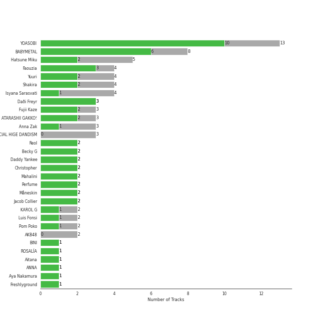
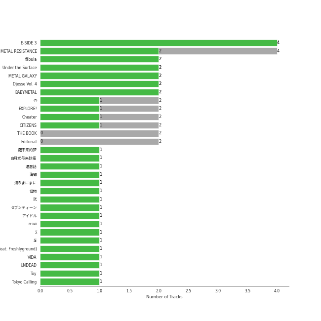
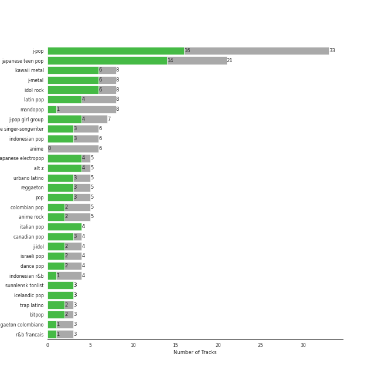
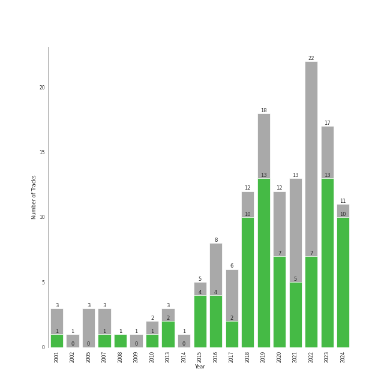

# International Pop

[93 songs](tracks.md)

## Top Artists

See top 100 artists

|   Number of Tracks | Art                                                                                              | Artist                                | 🔗                                                           |
|-------------------:|:-------------------------------------------------------------------------------------------------|:--------------------------------------|:------------------------------------------------------------|
|                  7 |  | BABYMETAL                             | [🔗](https://open.spotify.com/artist/630wzNP2OL7fl4Xl0GnMWq) |
|                  5 |  | Shakira                               | [🔗](https://open.spotify.com/artist/0EmeFodog0BfCgMzAIvKQp) |
|                  4 |  | Isyana Sarasvati                      | [🔗](https://open.spotify.com/artist/05CRzFTp7TouOXPuH6Tapu) |
|                  3 |  | Hatsune Miku                          | [🔗](https://open.spotify.com/artist/6pNgnvzBa6Bthsv8SrZJYl) |
|                  3 |  | OFFICIAL HIGE DANDISM                 | [🔗](https://open.spotify.com/artist/5Vo1hnCRmCM6M4thZCInCj) |
|                  3 |  | Anna Zak                              | [🔗](https://open.spotify.com/artist/3lVXtKsFTJM8ecY8gqdoCo) |
|                  3 |  | Daði Freyr                            | [🔗](https://open.spotify.com/artist/3Hb64DQZIhDCgyHKrzBXOL) |
|                  2 |  | Reol                                  | [🔗](https://open.spotify.com/artist/7rpKUJ0AnklJ8q9nIPVSpZ) |
|                  2 |  | Daddy Yankee                          | [🔗](https://open.spotify.com/artist/4VMYDCV2IEDYJArk749S6m) |
|                  2 |  | Luis Fonsi                            | [🔗](https://open.spotify.com/artist/4V8Sr092TqfHkfAA5fXXqG) |
|                  2 |  | Christopher                           | [🔗](https://open.spotify.com/artist/3zDRCqOhJXJfS2YWOEwGMC) |
|                  2 |  | Perfume                               | [🔗](https://open.spotify.com/artist/2XMxWKPKCxoLkSdpCViCnr) |
|                  2 |  | AKB48                                 | [🔗](https://open.spotify.com/artist/01wau5CL3Z1vfJJWkzBkqg) |
|                  1 |  | Lothika                               | [🔗](https://open.spotify.com/artist/7yZDrVInKssNCaZkAkQGTX) |
|                  1 |  | הפשוטע                                | [🔗](https://open.spotify.com/artist/7m92aMieltH5ZpodCEHfnb) |
|                  1 |  | ROSALÍA                               | [🔗](https://open.spotify.com/artist/7ltDVBr6mKbRvohxheJ9h1) |
|                  1 |  | Hikaru Utada                          | [🔗](https://open.spotify.com/artist/7lbSsjYACZHn1MSDXPxNF2) |
|                  1 |  | ONE OK ROCK                           | [🔗](https://open.spotify.com/artist/7k73EtZwoPs516ZxE72KsO) |
|                  1 |  | Aitana                                | [🔗](https://open.spotify.com/artist/7eLcDZDYHXZCebtQmVFL25) |
|                  1 |  | mothy                                 | [🔗](https://open.spotify.com/artist/7LOYTIZlvOwx83g2iBL3eM) |
|                  1 |  | ANNA                                  | [🔗](https://open.spotify.com/artist/7K80yOTC0Id95gRaOxDG5u) |
|                  1 |  | Aya Nakamura                          | [🔗](https://open.spotify.com/artist/7IlRNXHjoOCgEAWN5qYksg) |
|                  1 |  | SEKAI NO OWARI                        | [🔗](https://open.spotify.com/artist/7HwzlRPa9Ad0I8rK0FPzzK) |
|                  1 |  | Freshlyground                         | [🔗](https://open.spotify.com/artist/7AcV1lk8Zrgo1691PDWEle) |
|                  1 |  | King Gnu                              | [🔗](https://open.spotify.com/artist/6wxfx1yhyqjCPYwwxJktR2) |
|                  1 |  | Eden Hason                            | [🔗](https://open.spotify.com/artist/6uQl3gu1AIXyvqCAxnc2q4) |
|                  1 |  | Jimbo J                               | [🔗](https://open.spotify.com/artist/6ltKIf1bortd0DQbpgKdQu) |
|                  1 |  | Fujii Kaze                            | [🔗](https://open.spotify.com/artist/6bDWAcdtVR3WHz2xtiIPUi) |
|                  1 |  | WARPs UP                              | [🔗](https://open.spotify.com/artist/6ZhCKGX2nkK7s8vdUvaocx) |
|                  1 |  | Harlem Yu                             | [🔗](https://open.spotify.com/artist/6VbRanWSU3pdDhJnhSfGmY) |
|                  1 |  | Demi Lovato                           | [🔗](https://open.spotify.com/artist/6S2OmqARrzebs0tKUEyXyp) |
|                  1 |  | [Dua Lipa](../../artists/dua_lipa.md) | [🔗](https://open.spotify.com/artist/6M2wZ9GZgrQXHCFfjv46we) |
|                  1 |  | Vishal Dadlani                        | [🔗](https://open.spotify.com/artist/6CXEwIaXYfVJ84biCxqc9k) |
|                  1 |  | YOASOBI                               | [🔗](https://open.spotify.com/artist/64tJ2EAv1R6UaZqc4iOCyj) |
|                  1 |  | Benny Dayal                           | [🔗](https://open.spotify.com/artist/61if35zz1W11GejEkxTLEQ) |
|                  1 |  | Alejandro Sanz                        | [🔗](https://open.spotify.com/artist/5sUrlPAHlS9NEirDB8SEbF) |
|                  1 |  | THE TOYS                              | [🔗](https://open.spotify.com/artist/5pokGZ1K9Hr6etaKPDxSG8) |
|                  1 |  | Lowsheen                              | [🔗](https://open.spotify.com/artist/5lnxhnW7SIbxkkFVmVYEhU) |
|                  1 |  | Stromae                               | [🔗](https://open.spotify.com/artist/5j4HeCoUlzhfWtjAfM1acR) |
|                  1 |  | Eric Chou                             | [🔗](https://open.spotify.com/artist/5fEQLwq1BWWQNR8GzhOIvi) |
|                  1 |  | Synne Vo                              | [🔗](https://open.spotify.com/artist/5WDOXIkjKNjEzlXmLgZVz9) |
|                  1 |                                                               | Blær                                  | [🔗](https://open.spotify.com/artist/5W6FVpHHiRfqUU4d9FfXWZ) |
|                  1 |  | Master KG                             | [🔗](https://open.spotify.com/artist/523y9KSneKh6APd1hKxLuF) |
|                  1 |  | 張楚寒                                   | [🔗](https://open.spotify.com/artist/4zzzvh8xX7laDArf8Gt7iw) |
|                  1 |  | Angela Chang                          | [🔗](https://open.spotify.com/artist/4txug0T3vYc9p20tuhfCUa) |
|                  1 |  | Dadju                                 | [🔗](https://open.spotify.com/artist/4sbXXFzEWJY2zsZjelerjX) |
|                  1 |  | Bad Bunny                             | [🔗](https://open.spotify.com/artist/4q3ewBCX7sLwd24euuV69X) |
|                  1 |  | Becky G                               | [🔗](https://open.spotify.com/artist/4obzFoKoKRHIphyHzJ35G3) |
|                  1 |  | Afgan                                 | [🔗](https://open.spotify.com/artist/4cgBCGxtlfap2g6jveB7du) |
|                  1 |  | Netta                                 | [🔗](https://open.spotify.com/artist/4Z4afeDmHFxPmJorIwupbZ) |
|                  1 |  | Ermal Meta                            | [🔗](https://open.spotify.com/artist/4XWTdNlsP8jqo5BDn5hgmd) |
|                  1 |  | Nkosazana Daughter                    | [🔗](https://open.spotify.com/artist/4AnNB3lPD0Sv7ziKVHqI66) |
|                  1 |  | David Tao                             | [🔗](https://open.spotify.com/artist/40tNK2YedBV2jRFAHxpifB) |
|                  1 |  | Burna Boy                             | [🔗](https://open.spotify.com/artist/3wcj11K77LjEY1PkEazffa) |
|                  1 |  | Snow                                  | [🔗](https://open.spotify.com/artist/3uZFBSsMiooimnprFL9jD1) |
|                  1 |  | Kawaguchi Yurina                      | [🔗](https://open.spotify.com/artist/3snqW31jInsZwoYRZTaixr) |
|                  1 |  | Ghali                                 | [🔗](https://open.spotify.com/artist/3egWSWp7Y4FyCKIyvXbw7L) |
|                  1 |  | Fabrizio Moro                         | [🔗](https://open.spotify.com/artist/3ebOqZZsLCDAkLS6QdI8cc) |
|                  1 |  | Shae Gill                             | [🔗](https://open.spotify.com/artist/3bWIy9AUrQdiNeS62Bp3OP) |
|                  1 |  | Heuss L'enfoiré                       | [🔗](https://open.spotify.com/artist/3YwqjMyrRfuixi2pbgTGCE) |
|                  1 |  | Angèle                                | [🔗](https://open.spotify.com/artist/3QVolfxko2UyCOtexhVTli) |
|                  1 |  | Ashnikko                              | [🔗](https://open.spotify.com/artist/3PyJHH2wyfQK3WZrk9rpmP) |
|                  1 |  | Ali Sethi                             | [🔗](https://open.spotify.com/artist/3NegWDGp038A3FIi3gSYzl) |
|                  1 |  | Ayumi Hamasaki                        | [🔗](https://open.spotify.com/artist/3Mvc8kRgr8LRYYgvFmlZqn) |
|                  1 |  | Ana Guerra                            | [🔗](https://open.spotify.com/artist/3MRynBsyLGzv3IQ9Fip6hO) |
|                  1 |  | Agam Buhbut                           | [🔗](https://open.spotify.com/artist/3JPKPnzWJGjccn8SnjwA5i) |
|                  1 |  | Kausar Munir                          | [🔗](https://open.spotify.com/artist/3GBSge8pq7mpezUQl0GAOA) |
|                  1 |  | Rayi Putra                            | [🔗](https://open.spotify.com/artist/3FduEXHFSq8Hboekc8JMUR) |
|                  1 |  | Savera                                | [🔗](https://open.spotify.com/artist/3CVXA5TAWpmfGPqyMqXpPb) |
|                  1 |  | ZUTOMAYO                              | [🔗](https://open.spotify.com/artist/38WbKH6oKAZskBhqDFA8Uj) |
|                  1 |  | 拾贰                                    | [🔗](https://open.spotify.com/artist/30YrwNoKzUtyVQsIrwtMdr) |
|                  1 |  | Gradur                                | [🔗](https://open.spotify.com/artist/2tcoLkA9Hexz70Kuc1NTUl) |
|                  1 |  | Roméo Elvis                           | [🔗](https://open.spotify.com/artist/2pHk4wAmL7ofTAuvCIUWtv) |
|                  1 |  | OAFF                                  | [🔗](https://open.spotify.com/artist/2k66ibJfgMigF5QWqUgLyR) |
|                  1 |  | Wanitwa Mos                           | [🔗](https://open.spotify.com/artist/2iN5MhOgkenO5FtkPtEVAF) |
|                  1 |  | Anamanaguchi                          | [🔗](https://open.spotify.com/artist/2UwJRAgSOi1zcLkvUNc8XL) |
|                  1 |  | Anuel AA                              | [🔗](https://open.spotify.com/artist/2R21vXR83lH98kGeO99Y66) |
|                  1 |  | 大籽                                    | [🔗](https://open.spotify.com/artist/2NJLAUSe3Ifk9MiHbddRAi) |
|                  1 |  | Crowd Lu                              | [🔗](https://open.spotify.com/artist/2JBUyLiFvpFPWdZGqIGYLD) |
|                  1 |  | Leehom Wang                           | [🔗](https://open.spotify.com/artist/2F5W6Rsxwzg0plQ0w8dSyt) |
|                  1 |  | J Balvin                              | [🔗](https://open.spotify.com/artist/1vyhD5VmyZ7KMfW5gqLgo5) |
|                  1 |  | Madame Monsieur                       | [🔗](https://open.spotify.com/artist/1tQn5gWbo3ee6n2Z52ogY5) |
|                  1 |  | Kenshi Yonezu                         | [🔗](https://open.spotify.com/artist/1snhtMLeb2DYoMOcVbb8iB) |
|                  1 |  | Maluma                                | [🔗](https://open.spotify.com/artist/1r4hJ1h58CWwUQe3MxPuau) |
|                  1 |  | Christine Fan                         | [🔗](https://open.spotify.com/artist/1q7sCl0vg0EcaFdRz0XDGg) |
|                  1 |  | Rauw Alejandro                        | [🔗](https://open.spotify.com/artist/1mcTU81TzQhprhouKaTkpq) |
|                  1 |  | Las Ketchup                           | [🔗](https://open.spotify.com/artist/1e8GEl48ktvfDpruMKB6Oe) |
|                  1 |  | TFBOYS                                | [🔗](https://open.spotify.com/artist/1dywcVTpMrP7VmQUhngSce) |
|                  1 |  | Gen Hoshino                           | [🔗](https://open.spotify.com/artist/1S2S00lgLYLGHWA44qGEUs) |
|                  1 |  | Natti Natasha                         | [🔗](https://open.spotify.com/artist/1GDbiv3spRmZ1XdM1jQbT7) |
|                  1 |  | Full Trunk                            | [🔗](https://open.spotify.com/artist/1CD5WWtF6AFUq6BTY20I4k) |
|                  1 |  | Static & Ben El                       | [🔗](https://open.spotify.com/artist/0xHa28taiElkcQf9o3z76g) |
|                  1 |  | Penny Tai                             | [🔗](https://open.spotify.com/artist/0qmPs7q4bykvrS8NMZk7ud) |
|                  1 |  | LiSA                                  | [🔗](https://open.spotify.com/artist/0blbVefuxOGltDBa00dspv) |
|                  1 |  | XG                                    | [🔗](https://open.spotify.com/artist/0LOK81e9H5lr61HlGGHqwA) |
|                  1 |  | Soolking                              | [🔗](https://open.spotify.com/artist/0GgY7hjMoGDsX8ZDe2mwds) |
|                  1 |  | Tainy                                 | [🔗](https://open.spotify.com/artist/0GM7qgcRCORpGnfcN2tCiB) |
|                  1 |  | Tani Yuuki                            | [🔗](https://open.spotify.com/artist/0B1ce3uNrzkdm76NXI4mhX) |
|                  1 |  | Lu-Ni                                 | [🔗](https://open.spotify.com/artist/0AythHu8oDXnRGp8qviBPj) |
|                  1 |  | Rendy Pandugo                         | [🔗](https://open.spotify.com/artist/04u3fc37nHFKN7GJTSIwI8) |

## Top Albums

See all 86 albums

|   Number of Tracks | Art                                                                                              | Album                                                                                               | Release Date   | 🔗                                                          |
|-------------------:|:-------------------------------------------------------------------------------------------------|:----------------------------------------------------------------------------------------------------|:---------------|:-----------------------------------------------------------|
|                  3 |  | METAL RESISTANCE                                                                                    | 2016-04-01     | [🔗](https://open.spotify.com/album/2vIRdYffs93ca7L0Eh4mTm) |
|                  2 |  | Under the Surface                                                                                   | 2019-02-22     | [🔗](https://open.spotify.com/album/6ISIdF1gCK9X8pn4FaObHE) |
|                  2 |  | METAL GALAXY                                                                                        | 2019-10-11     | [🔗](https://open.spotify.com/album/6rxRhft7JZtXavzHP2g2el) |
|                  2 |  | Editorial                                                                                           | 2021-08-18     | [🔗](https://open.spotify.com/album/22nXr9DqkTAp1Y0GT1ialu) |
|                  2 |  | EXPLORE!                                                                                            | 2015-11-25     | [🔗](https://open.spotify.com/album/6TXaOwBLoyJrD6vem7L8Ba) |
|                  2 |  | BABYMETAL                                                                                           | 2015-05-11     | [🔗](https://open.spotify.com/album/6Eepi724OOt38pTaUrZErI) |
|                  1 |  | 青春修炼手册                                                                                              | 2017-01-01     | [🔗](https://open.spotify.com/album/5sJB1R7udfChkgp5VRfY07) |
|                  1 |  | 醒不来的梦                                                                                               | 2020-12-15     | [🔗](https://open.spotify.com/album/6C9V6icEpoNhYtd75PM3OS) |
|                  1 |  | 翼はいらない<Type A>(通常盤)                                                                                 | 2016-06-01     | [🔗](https://open.spotify.com/album/5fTeBDOk2HaA6MwHSspPIx) |
|                  1 |  | 白月光与朱砂痣                                                                                             | 2021-01-01     | [🔗](https://open.spotify.com/album/22QqokF4etKGtDv3BrNvXK) |
|                  1 |  | 炎                                                                                                   | 2020-10-12     | [🔗](https://open.spotify.com/album/1KmL1EZ0Pg9Vj3rPYMDqHY) |
|                  1 |  | 潜潜話                                                                                                 | 2019-10-29     | [🔗](https://open.spotify.com/album/4myzXA54fPm89hpW41YkOS) |
|                  1 |  | 海嘯                                                                                                  | 2001-05-10     | [🔗](https://open.spotify.com/album/06yEqpc6KFxUZ5BxE7V7TN) |
|                  1 |  | 次の足跡 Type A <初回限定盤>                                                                                 | 2014-01-22     | [🔗](https://open.spotify.com/album/4Mz79lV4qxaywmthkarIf7) |
|                  1 |  | 改變自己                                                                                                | 2007-07-13     | [🔗](https://open.spotify.com/album/7yjS4CBFK0f9oQsVrcdNNW) |
|                  1 |  | 怪物                                                                                                  | 2021-01-06     | [🔗](https://open.spotify.com/album/41HUxKwnbrg8IdelmMibj9) |
|                  1 |  | 怎樣                                                                                                  | 2001-01-18     | [🔗](https://open.spotify.com/album/5wBnaUSaYmG7PH39bRIr1H) |
|                  1 |  | 如果雨之後                                                                                               | 2017-12-15     | [🔗](https://open.spotify.com/album/63lCCebNDe20nxyCvFWk8g) |
|                  1 |  | 太平盛世                                                                                                | 2005-08-01     | [🔗](https://open.spotify.com/album/1XnDRFsNxG12nZPRXNcPkU) |
|                  1 |  | 刻在我心底的名字 (Your Name Engraved Herein)                                                                | 2020-08-25     | [🔗](https://open.spotify.com/album/5RG4bEVKGMdLaEIv1dofR2) |
|                  1 |  | 一比一                                                                                                 | 2005-06-03     | [🔗](https://open.spotify.com/album/3Om643lyJZiG4AYBr7TwDc) |
|                  1 |  | קוביות                                                                                              | 2020-08-16     | [🔗](https://open.spotify.com/album/78V1vURpHgBC2SaU6ZbIYF) |
|                  1 |  | עושה לי צרות                                                                                        | 2022-05-22     | [🔗](https://open.spotify.com/album/2FHZElS1XugIYG10xE80aR) |
|                  1 |  | ממותה                                                                                               | 2022-02-11     | [🔗](https://open.spotify.com/album/0F59OTwMP1IRvvX3CzeO9G) |
|                  1 |  | מי זאת                                                                                              | 2022-05-22     | [🔗](https://open.spotify.com/album/3vAQYVlLZrzs7lrjisl5VC) |
|                  1 |  | לך לישון                                                                                            | 2022-01-02     | [🔗](https://open.spotify.com/album/6Wh0It79i26j0IWWzm3axe) |
|                  1 |  | בשורות טובות                                                                                        | 2022-06-06     | [🔗](https://open.spotify.com/album/1oBfvjTLPPfUEO4R6FqzRl) |
|                  1 |  | Σ                                                                                                   | 2016-10-19     | [🔗](https://open.spotify.com/album/5MruJPW5X4cal6bpN7llrF) |
|                  1 |  | Échame La Culpa                                                                                     | 2017-11-17     | [🔗](https://open.spotify.com/album/2Tt0EzXpempSOIHFXVX42v) |
|                  1 |  | i'mperfect                                                                                          | 2013-04-10     | [🔗](https://open.spotify.com/album/04ygc7Z2gcGtt7m8pnVUwf) |
|                  1 |  | Waka Waka (This Time for Africa) [The Official 2010 FIFA World Cup (TM) Song] (feat. Freshlyground) | 2010-05-07     | [🔗](https://open.spotify.com/album/3pzQF7YgU1f66pBayA8uHv) |
|                  1 |  | Vintage                                                                                             | 2020-03-19     | [🔗](https://open.spotify.com/album/6tGI9MGbLjbxyzcxYkMXPJ) |
|                  1 |  | VIDA                                                                                                | 2019-02-01     | [🔗](https://open.spotify.com/album/5C0YLr4OoRGFDaqdMQmkeH) |
|                  1 |  | UN DIA (ONE DAY) (Feat. Tainy)                                                                      | 2020-07-24     | [🔗](https://open.spotify.com/album/6aqSlutLYNpzSsK4dV5jTr) |
|                  1 |  | Traveler                                                                                            | 2019-08-31     | [🔗](https://open.spotify.com/album/17gzvH2FPpVhpuqalLFi9j) |
|                  1 |  | Toy                                                                                                 | 2018-05-23     | [🔗](https://open.spotify.com/album/21YEfZ84TzdjNvOWEdwjeF) |
|                  1 |  | Tippy Toes                                                                                          | 2022-03-18     | [🔗](https://open.spotify.com/album/6P9erpHs7hgJlca7Tj3F0w) |
|                  1 |  | Think About Things                                                                                  | 2020-04-09     | [🔗](https://open.spotify.com/album/5gEUjiNfaVse6oloI0c6Vt) |
|                  1 |  | The Lion King: The Gift                                                                             | 2019-07-19     | [🔗](https://open.spotify.com/album/552zi1M53PQAX5OH4FIdTx) |
|                  1 |  | Te Felicito                                                                                         | 2022-04-21     | [🔗](https://open.spotify.com/album/6gQKAYf3TJM9sppw3AtbHH) |
|                  1 |  | Söngvakeppnin 2020                                                                                  | 2020-01-18     | [🔗](https://open.spotify.com/album/32ypMgv8eQ7ACVd2uBaPG7) |
|                  1 |  | Sofa Silahlane                                                                                      | 2022-05-13     | [🔗](https://open.spotify.com/album/03FGhGM3Lv2TmbUdpoPPip) |
|                  1 |  | Sin Pijama                                                                                          | 2018-04-20     | [🔗](https://open.spotify.com/album/6hAxqfWO3xDGzjs8yad1pB) |
|                  1 |  | SUN                                                                                                 | 2018-10-25     | [🔗](https://open.spotify.com/album/1hWhflOpUh3IS1UeYHIW8V) |
|                  1 |  | Racine Carrée (Standard US Version)                                                                 | 2013-01-01     | [🔗](https://open.spotify.com/album/22yd3bcffqUO7Pn5nsDaoj) |
|                  1 |  | Pleasure                                                                                            | 2021-04-23     | [🔗](https://open.spotify.com/album/2O40oGNRh8jJTCfutKMRkl) |
|                  1 |  | Pasoori                                                                                             | 2022-02-07     | [🔗](https://open.spotify.com/album/7wgrW5XyZdtk0K8PkW5A7h) |
|                  1 |  | POP VIRUS                                                                                           | 2018-12-19     | [🔗](https://open.spotify.com/album/7oFLY1YL5bBI32UHsmQO6q) |
|                  1 |  | PINK BLOOD                                                                                          | 2021-06-02     | [🔗](https://open.spotify.com/album/4eQs3mcSejRAVTWmaYXNYl) |
|                  1 |  | Non mi avete fatto niente                                                                           | 2018-02-07     | [🔗](https://open.spotify.com/album/3Qs5bBmUVXpZBcEkw4uxJ8) |
|                  1 |  | No title-                                                                                           | 2016-03-18     | [🔗](https://open.spotify.com/album/5qPZrSLh2oecfujdUZqgmy) |
|                  1 |  | Niche Syndrome                                                                                      | 2010-06-09     | [🔗](https://open.spotify.com/album/4OKBuE9F8MTCV7nnsBRcsK) |
|                  1 |  | Ne reviens pas                                                                                      | 2019-11-21     | [🔗](https://open.spotify.com/album/0w6UtV9Rd14AqjqcwD3j3l) |
|                  1 |  | Miku                                                                                                | 2016-05-24     | [🔗](https://open.spotify.com/album/45jD7ltxM60Arhm5FWF49p) |
|                  1 |  | Mercy                                                                                               | 2018-01-20     | [🔗](https://open.spotify.com/album/1uuuqBmA5Xklb3htp7Akke) |
|                  1 |  | Memories                                                                                            | 2021-12-08     | [🔗](https://open.spotify.com/album/4tp4dyeVhcG7kM2jUi3Yj5) |
|                  1 |  | Me Gusta                                                                                            | 2020-01-13     | [🔗](https://open.spotify.com/album/4IcQ1ni07PmlOenqwf6MgG) |
|                  1 |  | Lykke te                                                                                            | 2022-05-27     | [🔗](https://open.spotify.com/album/39ktLXlXx02WGz3mUZTxXS) |
|                  1 |  | Look At Me                                                                                          | 2022-03-21     | [🔗](https://open.spotify.com/album/3mp41Up4LNhAVLGxl7BAUR) |
|                  1 |  | Lo Malo                                                                                             | 2018-04-06     | [🔗](https://open.spotify.com/album/0BtpL9HEIaBg95FefsA3Hn) |
|                  1 |  | LEXICON                                                                                             | 2019-11-29     | [🔗](https://open.spotify.com/album/089QU9ZClm6mksCrXCDBSi) |
|                  1 |  | LEVEL3                                                                                              | 2013-10-16     | [🔗](https://open.spotify.com/album/2DdXcewGp8Akqutak3yLDg) |
|                  1 |  | Jai Jai Shivshankar (From "War")                                                                    | 2019-09-21     | [🔗](https://open.spotify.com/album/5GvIKf7yN7gjZfYohbvHmj) |
|                  1 |  | Hijas del Tomate                                                                                    | 2002           | [🔗](https://open.spotify.com/album/5Fs94v1xXPl8Q1mTMWMTLO) |
|                  1 |  | Heaven                                                                                              | 2018-02-14     | [🔗](https://open.spotify.com/album/3GJjPtV0iPKM3fLPvqdURX) |
|                  1 |  | Habit                                                                                               | 2022-04-28     | [🔗](https://open.spotify.com/album/690rpRAbQW5LNPrbP27M9U) |
|                  1 |  | HELP EVER HURT NEVER                                                                                | 2020-05-20     | [🔗](https://open.spotify.com/album/03QiFOKDh6xMiSTkOnsmMG) |
|                  1 |  | GAME                                                                                                | 2008           | [🔗](https://open.spotify.com/album/6kzdxF5o6XpDNTLVVdjoMj) |
|                  1 |  | Fijación Oral, Vol. 1                                                                               | 2005-06-03     | [🔗](https://open.spotify.com/album/3zHPYwiMJqa3hTBgk695Ae) |
|                  1 |  | Farra                                                                                               | 2019-06-28     | [🔗](https://open.spotify.com/album/1FXVq4BLk6Vl6Kr7TeSoYF) |
|                  1 |  | Evils Theater                                                                                       | 2009-06-17     | [🔗](https://open.spotify.com/album/1UkodLwja64ZFXbehIWnEN) |
|                  1 |  | El Mal Querer                                                                                       | 2018-11-02     | [🔗](https://open.spotify.com/album/355bjCHzRJztCzaG5Za4gq) |
|                  1 |  | El Dorado                                                                                           | 2017-05-26     | [🔗](https://open.spotify.com/album/6bUxh58rYTL67FS8dyTKMN) |
|                  1 |  | Doobey (From "Gehraiyaan")                                                                          | 2022-01-24     | [🔗](https://open.spotify.com/album/48VomBCSqAsYmxI3C3TNSC) |
|                  1 |  | Djadja                                                                                              | 2018-04-06     | [🔗](https://open.spotify.com/album/76VGIFOKrF1rba6Xznep45) |
|                  1 |  | Daisy 2.0 (feat. Hatsune Miku)                                                                      | 2020-12-11     | [🔗](https://open.spotify.com/album/6JZYS7UElSfjyTgFgE1ApG) |
|                  1 |  | Con Calma                                                                                           | 2019-01-24     | [🔗](https://open.spotify.com/album/1otwHKoQ5KPaiekpYk4tWh) |
|                  1 |  | Cara Italia                                                                                         | 2018-05-02     | [🔗](https://open.spotify.com/album/3E3S8FQudapOj9Mpxc5v3N) |
|                  1 |  | CEREMONY                                                                                            | 2020-01-15     | [🔗](https://open.spotify.com/album/1IYJeRjWNruxAKls5cBtqm) |
|                  1 |  | Bunny                                                                                               | 2020-11-25     | [🔗](https://open.spotify.com/album/7KJoNDndoJuxoFVl57NaVk) |
|                  1 |  | Brol                                                                                                | 2018-10-05     | [🔗](https://open.spotify.com/album/6KSvWFf4g4PrIldtchJsTC) |
|                  1 |  | Bando                                                                                               | 2020-01-31     | [🔗](https://open.spotify.com/album/3UtdQcbHhNlEi79pS3282l) |
|                  1 |  | BOOTLEG                                                                                             | 2017-11-01     | [🔗](https://open.spotify.com/album/1mvoieMR8Dwiy7S052ihoC) |
|                  1 |  | A BEST                                                                                              | 2001-03-28     | [🔗](https://open.spotify.com/album/2B7L6R25vI22f1sIgV9k2F) |
|                  1 |  | 11:11                                                                                               | 2019-05-17     | [🔗](https://open.spotify.com/album/3YIUNL7qFE8NP3X3zaYSND) |
|                  1 |  | & Co.                                                                                               | 2019-06-12     | [🔗](https://open.spotify.com/album/4pS7NXSZNbvREVxKkOge3I) |

## Top Record Labels

See all 64 labels

|   Number of Tracks | Label                                                            |
|-------------------:|:-----------------------------------------------------------------|
|                  7 | Cooking Vinyl Limited                                            |
|                  6 | [Universal Music LLC](../../labels/universal_music_llc.md)       |
|                  5 | Sony Music Latin                                                 |
|                  5 | [Sony Music Labels Inc.](../../labels/sony_music_labels_inc_.md) |
|                  4 | Sony Music Entertainment                                         |
|                  3 | [Columbia](../../labels/columbia.md)                             |
|                  2 | Universal Music Division Capitol Music France                    |
|                  2 | TOY'S FACTORY                                                    |
|                  2 | Samlist                                                          |
|                  2 | Parlophone Denmark                                               |
|                  2 | Linfair                                                          |
|                  2 | KING RECORDS                                                     |
|                  2 | ITModels under exclusive license to D-Music                      |
|                  2 | IRORI Records                                                    |
|                  2 | Gold Typhoon Taiwan                                              |
|                  2 | [Epic](../../labels/epic.md)                                     |
|                  1 | 鲸鱼向海                                                             |
|                  1 | 一寸光年                                                             |
|                  1 | avex trax                                                        |
|                  1 | a Saban Music Group Joint Venture                                |
|                  1 | YRF Music                                                        |
|                  1 | YOASOBI                                                          |
|                  1 | XGALX                                                            |
|                  1 | What The Duck                                                    |
|                  1 | Wanitwa Mos Entertainment                                        |
|                  1 | WMI Italy                                                        |
|                  1 | WM Taiwan                                                        |
|                  1 | WM Norway                                                        |
|                  1 | Valley Records                                                   |
|                  1 | Universal Music Spain S.L.                                       |
|                  1 | Universal Music Latino                                           |
|                  1 | Universal Music Italia srL.                                      |
|                  1 | Universal Music Distributed Labels                               |
|                  1 | UMLE - Latino                                                    |
|                  1 | Trinity Optima Production                                        |
|                  1 | Team Ear Music                                                   |
|                  1 | Speedstar                                                        |
|                  1 | Sony Music Entertainment Indonesia                               |
|                  1 | Sony Music Entertainment India Pvt. Ltd.                         |
|                  1 | SHAKETOWN MUSIC                                                  |
|                  1 | S.L.                                                             |
|                  1 | S-Curve Records                                                  |
|                  1 | S&B Entertainment Ventures LLC                                   |
|                  1 | Ríkisútvarpið - Exclusively distributed by Alda Music            |
|                  1 | Rhythm REPUBLIC                                                  |
|                  1 | Rec. 118                                                         |
|                  1 | Polyvinyl Records                                                |
|                  1 | Play Two                                                         |
|                  1 | Parlophone UK                                                    |
|                  1 | Parkwood Entertainment                                           |
|                  1 | PONY CANYON INC.                                                 |
|                  1 | NaNa Disc                                                        |
|                  1 | NEON16                                                           |
|                  1 | Mobile1 Music                                                    |
|                  1 | Mescal                                                           |
|                  1 | KarenT                                                           |
|                  1 | Homeboy music                                                    |
|                  1 | Giraffe Pakistan                                                 |
|                  1 | Epidemic Sound                                                   |
|                  1 | El Cartel Records (EC3)                                          |
|                  1 | Echame La Culpa PS                                               |
|                  1 | Angèle VL Records                                                |
|                  1 | Aer-born                                                         |
|                  1 | 2022 Z.I. Productions BY PIL LTD                                 |

## Genres

See all 95 genres

|   Number of Tracks | Genre                                    |
|-------------------:|:-----------------------------------------|
|                 17 | j-pop                                    |
|                  9 | latin pop                                |
|                  8 | mandopop                                 |
|                  7 | kawaii metal                             |
|                  7 | j-metal                                  |
|                  7 | idol rock                                |
|                  7 | [dance pop](../../genres/dance_pop.md)   |
|                  7 | comic metal                              |
|                  7 | anime                                    |
|                  6 | anime rock                               |
|                  5 | taiwan pop                               |
|                  5 | colombian pop                            |
|                  4 | reggaeton                                |
|                  4 | japanese electropop                      |
|                  4 | j-pop girl group                         |
|                  4 | j-idol                                   |
|                  4 | israeli pop                              |
|                  4 | indonesian r&b                           |
|                  4 | indonesian pop                           |
|                  4 | indonesian indie                         |
|                  4 | c-pop                                    |
|                  3 | urbano latino                            |
|                  3 | taiwan singer-songwriter                 |
|                  3 | sunnlensk tonlist                        |
|                  3 | pop urbaine                              |
|                  3 | japanese teen pop                        |
|                  3 | j-poprock                                |
|                  3 | icelandic pop                            |
|                  3 | francoton                                |
|                  3 | bitpop                                   |
|                  2 | shibuya-kei                              |
|                  2 | reggaeton colombiano                     |
|                  2 | rap tunisien                             |
|                  2 | puerto rican pop                         |
|                  2 | [pop](../../genres/pop.md)               |
|                  2 | modern bollywood                         |
|                  2 | japanese singer-songwriter               |
|                  2 | japanese emo                             |
|                  2 | j-rock                                   |
|                  2 | italian hip hop                          |
|                  2 | israeli mediterranean                    |
|                  2 | french hip hop                           |
|                  2 | desi pop                                 |
|                  2 | danish pop                               |
|                  2 | classic j-pop                            |
|                  2 | chinese indie                            |
|                  2 | chinese idol pop                         |
|                  2 | belgian pop                              |
|                  2 | 48g                                      |
|                  1 | vocaloid                                 |
|                  1 | visual kei                               |
|                  1 | variete francaise                        |
|                  1 | thai pop                                 |
|                  1 | taiwan indie                             |
|                  1 | spanish pop                              |
|                  1 | south african pop                        |
|                  1 | rap latina                               |
|                  1 | rap francais                             |
|                  1 | rap algerien                             |
|                  1 | r&b en espanol                           |
|                  1 | nouvelle chanson francaise               |
|                  1 | norwegian pop                            |
|                  1 | nintendocore                             |
|                  1 | nigerian pop                             |
|                  1 | nigerian hip hop                         |
|                  1 | milan indie                              |
|                  1 | malaysian mandopop                       |
|                  1 | mainland chinese pop                     |
|                  1 | latin viral pop                          |
|                  1 | latin talent show                        |
|                  1 | latin hip hop                            |
|                  1 | jewish pop                               |
|                  1 | japanese post-hardcore                   |
|                  1 | japanese math rock                       |
|                  1 | j-pixie                                  |
|                  1 | j-acoustic                               |
|                  1 | italian pop                              |
|                  1 | italian adult pop                        |
|                  1 | israeli rock                             |
|                  1 | indie game soundtrack                    |
|                  1 | indian indie                             |
|                  1 | g-house                                  |
|                  1 | french pop                               |
|                  1 | filmi                                    |
|                  1 | eurobeat                                 |
|                  1 | escape room                              |
|                  1 | [electropop](../../genres/electropop.md) |
|                  1 | dancehall                                |
|                  1 | classic mandopop                         |
|                  1 | chiptune                                 |
|                  1 | chinese viral pop                        |
|                  1 | chinese r&b                              |
|                  1 | basshall                                 |
|                  1 | afro soul                                |
|                  1 | afro dancehall                           |

## Years

| 10 newest albums                                                                                                                                                                                                                        | 10 oldest albums                                                                                                                                                                                                                                      |
|:----------------------------------------------------------------------------------------------------------------------------------------------------------------------------------------------------------------------------------------|:------------------------------------------------------------------------------------------------------------------------------------------------------------------------------------------------------------------------------------------------------|
| 
 בשורות טובות (2022-06-06)
     | 
 怎樣 (2001-01-18)
                                       |
| 
 Lykke te (2022-05-27)
             | 
 A BEST (2001-03-28)
                               |
| 
 מי זאת (2022-05-22)
                 | 
 海嘯 (2001-05-10)
                                       |
| 
 עושה לי צרות (2022-05-22)
     | 
 Hijas del Tomate (2002)
                 |
| 
 Sofa Silahlane (2022-05-13)
 | 
 一比一 (2005-06-03)
                                     |
| 
 Habit (2022-04-28)
                   | 
 Fijación Oral, Vol. 1 (2005-06-03)
 |
| 
 Te Felicito (2022-04-21)
       | 
 太平盛世 (2005-08-01)
                                   |
| 
 Look At Me (2022-03-21)
         | 
 改變自己 (2007-07-13)
                                   |
| 
 Tippy Toes (2022-03-18)
         | 
 GAME (2008)
                                         |
| 
 ממותה (2022-02-11)
                   | 
 Evils Theater (2009-06-17)
                 |
## Audio Features

| 10 most Danceable tracks         | 10 least Danceable tracks   |
|:---------------------------------|:----------------------------|
| Bando                            | Amore                       |
| Ne reviens pas                   | 永不失聯的愛                      |
| Tippy Toes                       | 落葉歸根                        |
| MALAMENTE - Cap.1: Augurio       | No Rain, No Rainbow         |
| מי זאת                           | 你要的愛                        |
| Think About Things               | untuk hati yang terluka.    |
| Gagnamagnið                      | Cry Baby                    |
| Endurtaka Mig                    | Headbangeeeeerrrrr!!!!!     |
| Sofa Silahlane                   | abnormalize                 |
| Jai Jai Shivshankar (From "War") | Wherever you are            |

| 10 most Energetic tracks   | 10 least Energetic tracks                              |
|:---------------------------|:-------------------------------------------------------|
| チョコレイト・ディスコ                | 刻在我心底的名字 (Your Name Engraved Herein) - 電影<刻在你心底的名字>主題曲 |
| Shanti Shanti Shanti       | 落葉歸根                                                   |
| Gimme Chocolate!!          | Heaven                                                 |
| Boys & Girls               | Gagnamagnið                                            |
| Headbangeeeeerrrrr!!!!!    | untuk hati yang terluka.                               |
| だいじょばない                    | 你要的愛                                                   |
| KARATE                     | Think About Things                                     |
| 404 not found              | 醒不来的梦                                                  |
| 恋をすると馬鹿を見る(Team B)         | Sofa Silahlane                                         |
| Kagerou                    | 永不失聯的愛                                                 |

| 10 most Speechy tracks   | 10 least Speechy tracks   |
|:-------------------------|:--------------------------|
| Te Felicito              | 情非得已                      |
| Bando                    | 就是愛妳                      |
| 11 PM                    | Pretender                 |
| KARATE                   | 悪ノ娘                       |
| Pleasure                 | Tetap Dalam Jiwa          |
| Leyendas                 | 如果的事                      |
| Tout oublier             | 醒不来的梦                     |
| Shanti Shanti Shanti     | 炎                         |
| Djadja                   | ก่อนฤดูฝน                 |
| 青春修炼手册                   | 永不失聯的愛                    |

| 10 most Acoustic tracks                                | 10 least Acoustic tracks                                                                            |
|:-------------------------------------------------------|:----------------------------------------------------------------------------------------------------|
| 刻在我心底的名字 (Your Name Engraved Herein) - 電影<刻在你心底的名字>主題曲 | abnormalize                                                                                         |
| 落葉歸根                                                   | Kagerou                                                                                             |
| untuk hati yang terluka.                               | Headbangeeeeerrrrr!!!!!                                                                             |
| 如果的事                                                   | Gimme Chocolate!!                                                                                   |
| עושה לי צרות                                           | Amore                                                                                               |
| 醒不来的梦                                                  | Boys & Girls                                                                                        |
| Heaven                                                 | KARATE                                                                                              |
| Tetap Dalam Jiwa                                       | Koi                                                                                                 |
| 永不失聯的愛                                                 | UN DIA (ONE DAY) (Feat. Tainy)                                                                      |
| סתלבט בקיבוץ                                           | Waka Waka (This Time for Africa) [The Official 2010 FIFA World Cup (TM) Song] (feat. Freshlyground) |

| 10 most Instrumental tracks   | 10 least Instrumental tracks                           |
|:------------------------------|:-------------------------------------------------------|
| だいじょばない                       | Pleasure                                               |
| Sofa Silahlane                | Échame La Culpa                                        |
| Shanti Shanti Shanti          | I Love...                                              |
| בשורות טובות                  | Te Felicito                                            |
| KARATE                        | Habit                                                  |
| abnormalize                   | 刻在我心底的名字 (Your Name Engraved Herein) - 電影<刻在你心底的名字>主題曲 |
| Tippy Toes                    | Leyendas                                               |
| Headbangeeeeerrrrr!!!!!       | Cry Baby                                               |
| JA ARA E                      | Djadja                                                 |
| Kagerou                       | 砂の惑星 ( + 初音ミク )                                        |

| 10 most Live tracks   | 10 least Live tracks   |
|:----------------------|:-----------------------|
| Mercy                 | Sofa Silahlane         |
| סתלבט בקיבוץ          | קוביות                 |
| Kagerou               | チョコレイト・ディスコ            |
| 脳裏上のクラッカー             | Con Calma              |
| KARATE                | Lo Malo                |
| Cry Baby              | Look At Me             |
| Endurtaka Mig         | Pasoori                |
| Shanti Shanti Shanti  | No title               |
| 404 not found         | Papaoutai              |
| Wherever you are      | Despacito              |

| 10 most Happy tracks                           | 10 least Happy tracks    |
|:-----------------------------------------------|:-------------------------|
| チョコレイト・ディスコ                                    | Mercy                    |
| Me Enamoré                                     | Tetap Dalam Jiwa         |
| סתלבט בקיבוץ                                   | 你要的愛                     |
| Ne reviens pas                                 | 白月光与朱砂痣                  |
| 恋するフォーチュンクッキー                                  | untuk hati yang terluka. |
| 砂の惑星 ( + 初音ミク )                                | No Rain, No Rainbow      |
| Habit                                          | KARATE                   |
| No title                                       | 醒不来的梦                    |
| Koi                                            | 落葉歸根                     |
| The Ketchup Song (Aserejé) - Spanglish Version | Papaoutai                |
