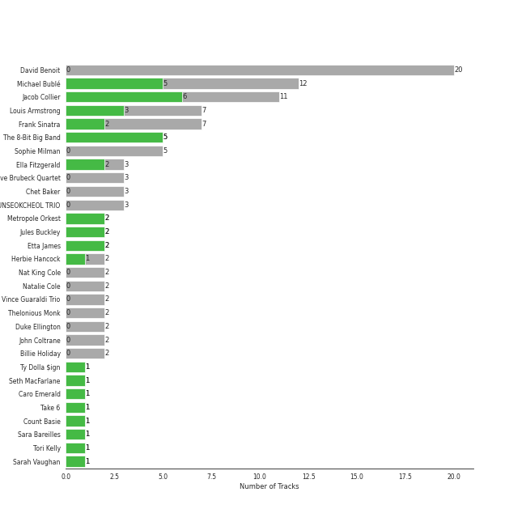

# Jazz

## Top Artists

See all artists

|   Number of Tracks | Artist                 |
|-------------------:|:-----------------------|
|                 12 | Michael Bublé          |
|                  7 | Frank Sinatra          |
|                  5 | Sophie Milman          |
|                  2 | Nat King Cole          |
|                  2 | Natalie Cole           |
|                  1 | Seth MacFarlane        |
|                  1 | Cécile McLorin Salvant |
|                  1 | Meghan Trainor         |
|                  1 | Bonnie Raitt           |
|                  1 | Duke Ellington         |
|                  1 | Caro Emerald           |
|                  1 | Count Basie            |
|                  1 | Sara Bareilles         |
|                  1 | YUNSEOKCHEOL TRIO      |
|                  1 | Stacey Kent            |

## Tracks

| Track                                         | Album                                                              | Artists                                                              | Liked   |
|:----------------------------------------------|:-------------------------------------------------------------------|:---------------------------------------------------------------------|:--------|
| I Can't Make You Love Me                      | Luck Of The Draw                                                   | Bonnie Raitt                                                         |         |
| That Man                                      | Deleted Scenes From The Cutting Room Floor                         | Caro Emerald                                                         | 💚       |
| Come Fly With Me - Remastered 1998            | Come Fly With Me (Remastered)                                      | Frank Sinatra                                                        |         |
| The Way You Look Tonight                      | Days Of Wine And Roses, Moon River And Other Academy Award Winners | Frank Sinatra                                                        | 💚       |
| I've Got You Under My Skin - Remastered 1998  | Songs For Swingin' Lovers! (Remastered)                            | Frank Sinatra                                                        |         |
| Strangers In The Night                        | Strangers In The Night (Expanded Edition)                          | Frank Sinatra                                                        |         |
| That's Life                                   | That's Life                                                        | Frank Sinatra                                                        |         |
| Fly Me To The Moon (In Other Words)           | Sinatra/Basie: The Complete Reprise Studio Recordings              | Frank Sinatra, Count Basie                                           | 💚       |
| Sunny                                         | Francis A. & Edward K.                                             | Frank Sinatra, Duke Ellington                                        |         |
| Call Me Irresponsible                         | Call Me Irresponsible                                              | [Michael Bublé](../artists/michael_bubl_.md)                         |         |
| Everything                                    | Call Me Irresponsible                                              | [Michael Bublé](../artists/michael_bubl_.md)                         | 💚       |
| The Best Is yet to Come                       | Call Me Irresponsible                                              | [Michael Bublé](../artists/michael_bubl_.md)                         |         |
| Can't Help Falling in Love                    | Come Fly with Me                                                   | [Michael Bublé](../artists/michael_bubl_.md)                         |         |
| Cry Me a River                                | Crazy Love                                                         | [Michael Bublé](../artists/michael_bubl_.md)                         |         |
| Haven't Met You Yet                           | Crazy Love                                                         | [Michael Bublé](../artists/michael_bubl_.md)                         | 💚       |
| Feeling Good                                  | It's Time                                                          | [Michael Bublé](../artists/michael_bubl_.md)                         | 💚       |
| Home                                          | It's Time                                                          | [Michael Bublé](../artists/michael_bubl_.md)                         | 💚       |
| Moondance                                     | Michael Bublé                                                      | [Michael Bublé](../artists/michael_bubl_.md)                         | 💚       |
| The Way You Look Tonight                      | Michael Bublé                                                      | [Michael Bublé](../artists/michael_bubl_.md)                         |         |
| La vie en rose (feat. Cécile McLorin Salvant) | love (Deluxe Edition)                                              | [Michael Bublé](../artists/michael_bubl_.md), Cécile McLorin Salvant |         |
| Someday (feat. Meghan Trainor)                | Nobody but Me                                                      | [Michael Bublé](../artists/michael_bubl_.md), Meghan Trainor         |         |
| L-O-V-E - Remastered                          | Romance                                                            | Nat King Cole                                                        |         |
| Unforgettable                                 | Unforgettable: With Love                                           | Nat King Cole, Natalie Cole                                          |         |
| L-O-V-E                                       | Unforgettable: With Love                                           | Natalie Cole                                                         |         |
| Love Won't Let You Get Away                   | Music Is Better Than Words                                         | [Sara Bareilles](../artists/sara_bareilles.md), Seth MacFarlane      | 💚       |
| Something In The Air Between Us               | Make Someone Happy                                                 | Sophie Milman                                                        |         |
| Agua De Beber                                 | Sophie Milman                                                      | Sophie Milman                                                        | 💚       |
| La Vie En Rose                                | Sophie Milman                                                      | Sophie Milman                                                        | 💚       |
| Beautiful Love                                | Take Love Easy                                                     | Sophie Milman                                                        |         |
| I Can't Make You Love Me                      | Take Love Easy                                                     | Sophie Milman                                                        |         |
| Breakfast on the Morning Tram                 | Breakfast on the Morning Tram                                      | Stacey Kent                                                          | 💚       |
| Fake Monologue                                | Db in April                                                        | YUNSEOKCHEOL TRIO                                                    |         |
