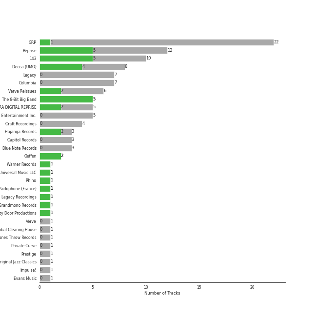

# Jazz

## Top Artists

See all artists

|   Number of Tracks | Art                                                                                              | Artist                                         | 🔗                                                           |
|-------------------:|:-------------------------------------------------------------------------------------------------|:-----------------------------------------------|:------------------------------------------------------------|
|                 12 |  | [Michael Bublé](../artists/michael_bubl_.md)   | [🔗](https://open.spotify.com/artist/1GxkXlMwML1oSg5eLPiAz3) |
|                  7 |  | Frank Sinatra                                  | [🔗](https://open.spotify.com/artist/1Mxqyy3pSjf8kZZL4QVxS0) |
|                  5 |  | Sophie Milman                                  | [🔗](https://open.spotify.com/artist/19GI8I4UhSpBl8Y9XpKyT4) |
|                  2 |  | Nat King Cole                                  | [🔗](https://open.spotify.com/artist/7v4imS0moSyGdXyLgVTIV7) |
|                  2 |  | Natalie Cole                                   | [🔗](https://open.spotify.com/artist/5tTsrGPwQRWUsHR2Xf7Ke9) |
|                  1 |  | Seth MacFarlane                                | [🔗](https://open.spotify.com/artist/79D4dipwR6scV8AN3dm7gW) |
|                  1 |  | Cécile McLorin Salvant                         | [🔗](https://open.spotify.com/artist/6PkSULcbxFKkxdgrmPGAvn) |
|                  1 |  | Meghan Trainor                                 | [🔗](https://open.spotify.com/artist/6JL8zeS1NmiOftqZTRgdTz) |
|                  1 |  | Bonnie Raitt                                   | [🔗](https://open.spotify.com/artist/4KDyYWR7IpxZ7xrdYbKrqY) |
|                  1 |  | Duke Ellington                                 | [🔗](https://open.spotify.com/artist/4F7Q5NV6h5TSwCainz8S5A) |
|                  1 |  | Caro Emerald                                   | [🔗](https://open.spotify.com/artist/492hDmhPyuIjP3MgTcIqgm) |
|                  1 |  | Count Basie                                    | [🔗](https://open.spotify.com/artist/2jFZlvIea42ZvcCw4OeEdA) |
|                  1 |  | [Sara Bareilles](../artists/sara_bareilles.md) | [🔗](https://open.spotify.com/artist/2Sqr0DXoaYABbjBo9HaMkM) |
|                  1 |  | YUNSEOKCHEOL TRIO                              | [🔗](https://open.spotify.com/artist/09fZOcPYim8MvvQieKkv5t) |
|                  1 |  | Stacey Kent                                    | [🔗](https://open.spotify.com/artist/03EYBMnqSchCMp5D9qmFXi) |

## Top Albums

See all albums

|   Number of Tracks | Art                                                                                              | Album                                                              | 🔗                                                          |
|-------------------:|:-------------------------------------------------------------------------------------------------|:-------------------------------------------------------------------|:-----------------------------------------------------------|
|                  3 |  | Call Me Irresponsible                                              | [🔗](https://open.spotify.com/album/3h4pyWRJIB9ZyRKXChbX22) |
|                  2 |  | Unforgettable: With Love                                           | [🔗](https://open.spotify.com/album/4ilUfGGQXin7hr1srDDXF0) |
|                  2 |  | Take Love Easy                                                     | [🔗](https://open.spotify.com/album/0a7Ut6OPSs8SvPDhFXL4ar) |
|                  2 |  | Sophie Milman                                                      | [🔗](https://open.spotify.com/album/2g5alWoreAp8i1Jjz2XHr4) |
|                  2 |  | Michael Bublé                                                      | [🔗](https://open.spotify.com/album/3rpSksJSFdNFqk5vne8at2) |
|                  2 |  | It's Time                                                          | [🔗](https://open.spotify.com/album/457fktVFXVwjQTl9wOLlfg) |
|                  2 |  | Crazy Love                                                         | [🔗](https://open.spotify.com/album/3MXDonOIzrIrCh0HvlACyj) |
|                  1 |  | love (Deluxe Edition)                                              | [🔗](https://open.spotify.com/album/68xKnVblFsSQ48CtgZT0oY) |
|                  1 |  | That's Life                                                        | [🔗](https://open.spotify.com/album/3gNsjaUsu9cRckgUFx5NsY) |
|                  1 |  | Strangers In The Night (Expanded Edition)                          | [🔗](https://open.spotify.com/album/1kyb5tomEXcA106V57puFW) |
|                  1 |  | Songs For Swingin' Lovers! (Remastered)                            | [🔗](https://open.spotify.com/album/4kca7vXd1Wo5GE2DMafvMc) |
|                  1 |  | Sinatra/Basie: The Complete Reprise Studio Recordings              | [🔗](https://open.spotify.com/album/2NCtCObbmJoJnplsR5mLAl) |
|                  1 |  | Romance                                                            | [🔗](https://open.spotify.com/album/5MuNxtOyex8o77Qdjaqeng) |
|                  1 |  | Nobody but Me                                                      | [🔗](https://open.spotify.com/album/5wN1OizIFEHDUkRwzIK3wL) |
|                  1 |  | Music Is Better Than Words                                         | [🔗](https://open.spotify.com/album/6VojJdbXviFkMuemAQ2Ivo) |
|                  1 |  | Make Someone Happy                                                 | [🔗](https://open.spotify.com/album/2oGYlZ7vte6lJ1MuwKKCeW) |
|                  1 |  | Luck Of The Draw                                                   | [🔗](https://open.spotify.com/album/6blrkOZ0VmkhYPjfoD7eqf) |
|                  1 |  | Francis A. & Edward K.                                             | [🔗](https://open.spotify.com/album/5GFkm37IrMR9a4rc6JABkw) |
|                  1 |  | Deleted Scenes From The Cutting Room Floor                         | [🔗](https://open.spotify.com/album/1D8grnftAaivpmBkayUgMR) |
|                  1 |  | Db in April                                                        | [🔗](https://open.spotify.com/album/2SUUafWH8ZchpD7eNBzXJy) |
|                  1 |  | Days Of Wine And Roses, Moon River And Other Academy Award Winners | [🔗](https://open.spotify.com/album/7FAo3wmrJNNzz2W5Z5ZG80) |
|                  1 |  | Come Fly with Me                                                   | [🔗](https://open.spotify.com/album/0UhvDeKmtgegXeELEVgGRh) |
|                  1 |  | Come Fly With Me (Remastered)                                      | [🔗](https://open.spotify.com/album/66v9QmjAj0Wwhh2OpbU4BE) |
|                  1 |  | Breakfast on the Morning Tram                                      | [🔗](https://open.spotify.com/album/5RwBI4pEinXbIiUhWzAMbX) |

## Top Record Labels

See all labels

|   Number of Tracks | Label                            |
|-------------------:|:---------------------------------|
|                 10 | 143/Reprise                      |
|                  5 | FRANK SINATRA DIGITAL REPRISE    |
|                  3 | Linus Entertainment Inc.         |
|                  3 | Capitol Records                  |
|                  2 | Reprise                          |
|                  2 | Linus Entertainment              |
|                  2 | Craft Recordings                 |
|                  1 | UME - Global Clearing House      |
|                  1 | Private Curve                    |
|                  1 | Parlophone (France)              |
|                  1 | Grandmono Records                |
|                  1 | Fuzzy Door Productions/Universal |

## Tracks

| Art                                                                                              | Track                                         | Album                                                              | Artists                                                              | Label                            | 💚   | 🔗                                                          |
|:-------------------------------------------------------------------------------------------------|:----------------------------------------------|:-------------------------------------------------------------------|:---------------------------------------------------------------------|:---------------------------------|:----|:-----------------------------------------------------------|
|  | I Can't Make You Love Me                      | Luck Of The Draw                                                   | Bonnie Raitt                                                         | Capitol Records                  |     | [🔗](https://open.spotify.com/track/69uJi5QsBtqlYkGURTBli8) |
|  | That Man                                      | Deleted Scenes From The Cutting Room Floor                         | Caro Emerald                                                         | Grandmono Records                | 💚   | [🔗](https://open.spotify.com/track/1tSpZHA49KemUzdfra0QTh) |
|  | I've Got You Under My Skin - Remastered 1998  | Songs For Swingin' Lovers! (Remastered)                            | Frank Sinatra                                                        | Capitol Records                  |     | [🔗](https://open.spotify.com/track/3aEJMh1cXKEjgh52claxQp) |
|  | Come Fly With Me - Remastered 1998            | Come Fly With Me (Remastered)                                      | Frank Sinatra                                                        | Capitol Records                  |     | [🔗](https://open.spotify.com/track/4hHbeIIKO5Y5uLyIEbY9Gn) |
|  | The Way You Look Tonight                      | Days Of Wine And Roses, Moon River And Other Academy Award Winners | Frank Sinatra                                                        | FRANK SINATRA DIGITAL REPRISE    | 💚   | [🔗](https://open.spotify.com/track/0elmUoU7eMPwZX1Mw1MnQo) |
|  | Strangers In The Night                        | Strangers In The Night (Expanded Edition)                          | Frank Sinatra                                                        | FRANK SINATRA DIGITAL REPRISE    |     | [🔗](https://open.spotify.com/track/74VR3AkGPhbYXnxcOYa16x) |
|  | That's Life                                   | That's Life                                                        | Frank Sinatra                                                        | FRANK SINATRA DIGITAL REPRISE    |     | [🔗](https://open.spotify.com/track/4FmCUATNIarCQh72JYdvnm) |
|  | Fly Me To The Moon (In Other Words)           | Sinatra/Basie: The Complete Reprise Studio Recordings              | Frank Sinatra, Count Basie                                           | FRANK SINATRA DIGITAL REPRISE    | 💚   | [🔗](https://open.spotify.com/track/5b7OgznPJJr1vHNYGyvxau) |
|  | Sunny                                         | Francis A. & Edward K.                                             | Frank Sinatra, Duke Ellington                                        | FRANK SINATRA DIGITAL REPRISE    |     | [🔗](https://open.spotify.com/track/6F3nsVon7E81tvTr2TsUrN) |
|  | Moondance                                     | Michael Bublé                                                      | [Michael Bublé](../artists/michael_bubl_.md)                         | 143/Reprise                      | 💚   | [🔗](https://open.spotify.com/track/25Yzff59UGjz7wNWmjM39h) |
|  | The Way You Look Tonight                      | Michael Bublé                                                      | [Michael Bublé](../artists/michael_bubl_.md)                         | 143/Reprise                      |     | [🔗](https://open.spotify.com/track/4YGlRLe6TeBRiXFByBqldf) |
|  | Can't Help Falling in Love                    | Come Fly with Me                                                   | [Michael Bublé](../artists/michael_bubl_.md)                         | 143/Reprise                      |     | [🔗](https://open.spotify.com/track/7igk58Vs9uM2B0aaTUwv6F) |
|  | Feeling Good                                  | It's Time                                                          | [Michael Bublé](../artists/michael_bubl_.md)                         | 143/Reprise                      | 💚   | [🔗](https://open.spotify.com/track/72PwtNhRrZXNnYeRg5xQ46) |
|  | Home                                          | It's Time                                                          | [Michael Bublé](../artists/michael_bubl_.md)                         | 143/Reprise                      | 💚   | [🔗](https://open.spotify.com/track/3ISaSNZCxIzTGwQuBq6Xrr) |
|  | Call Me Irresponsible                         | Call Me Irresponsible                                              | [Michael Bublé](../artists/michael_bubl_.md)                         | 143/Reprise                      |     | [🔗](https://open.spotify.com/track/25RxZw46RfYpVWMIrIeZDS) |
|  | Everything                                    | Call Me Irresponsible                                              | [Michael Bublé](../artists/michael_bubl_.md)                         | 143/Reprise                      | 💚   | [🔗](https://open.spotify.com/track/4T6HLdP6OcAtqC6tGnQelG) |
|  | The Best Is yet to Come                       | Call Me Irresponsible                                              | [Michael Bublé](../artists/michael_bubl_.md)                         | 143/Reprise                      |     | [🔗](https://open.spotify.com/track/56t3m0lqE6zU1EfgFOPqst) |
|  | Cry Me a River                                | Crazy Love                                                         | [Michael Bublé](../artists/michael_bubl_.md)                         | 143/Reprise                      |     | [🔗](https://open.spotify.com/track/5i04Jy87RLxoZszJqY3QAN) |
|  | Haven't Met You Yet                           | Crazy Love                                                         | [Michael Bublé](../artists/michael_bubl_.md)                         | 143/Reprise                      | 💚   | [🔗](https://open.spotify.com/track/4fIWvT19w9PR0VVBuPYpWA) |
|  | La vie en rose (feat. Cécile McLorin Salvant) | love (Deluxe Edition)                                              | [Michael Bublé](../artists/michael_bubl_.md), Cécile McLorin Salvant | Reprise                          |     | [🔗](https://open.spotify.com/track/1QELw50Dl95LusF6uOkDqk) |
|  | Someday (feat. Meghan Trainor)                | Nobody but Me                                                      | [Michael Bublé](../artists/michael_bubl_.md), Meghan Trainor         | Reprise                          |     | [🔗](https://open.spotify.com/track/0nsF6B4avArxVgAwgMg4ag) |
|  | L-O-V-E - Remastered                          | Romance                                                            | Nat King Cole                                                        | UME - Global Clearing House      |     | [🔗](https://open.spotify.com/track/6OHPdG4tYiHRPUHwf68nRU) |
|  | Unforgettable                                 | Unforgettable: With Love                                           | Nat King Cole, Natalie Cole                                          | Craft Recordings                 |     | [🔗](https://open.spotify.com/track/2MVQbDuhVs2muWFURtIdNb) |
|  | L-O-V-E                                       | Unforgettable: With Love                                           | Natalie Cole                                                         | Craft Recordings                 |     | [🔗](https://open.spotify.com/track/637xWjdmJY7CAQJsnsT7Fs) |
|  | Love Won't Let You Get Away                   | Music Is Better Than Words                                         | [Sara Bareilles](../artists/sara_bareilles.md), Seth MacFarlane      | Fuzzy Door Productions/Universal | 💚   | [🔗](https://open.spotify.com/track/5xNdKpcKqES50j78ac9woY) |
|  | Agua De Beber                                 | Sophie Milman                                                      | Sophie Milman                                                        | Linus Entertainment Inc.         |     | [🔗](https://open.spotify.com/track/4ic2XfSYoMch7DrdNf2T3N) |
|  | La Vie En Rose                                | Sophie Milman                                                      | Sophie Milman                                                        | Linus Entertainment Inc.         |     | [🔗](https://open.spotify.com/track/12kmgivtb8dyhxnko2doFt) |
|  | Something In The Air Between Us               | Make Someone Happy                                                 | Sophie Milman                                                        | Linus Entertainment Inc.         |     | [🔗](https://open.spotify.com/track/6GBqHQAW0Z16wsQQzN65i4) |
|  | Beautiful Love                                | Take Love Easy                                                     | Sophie Milman                                                        | Linus Entertainment              |     | [🔗](https://open.spotify.com/track/2wIHqsfA7ozyjbU4EoHOv3) |
|  | I Can't Make You Love Me                      | Take Love Easy                                                     | Sophie Milman                                                        | Linus Entertainment              |     | [🔗](https://open.spotify.com/track/4G5kuEKnYw2PFdLdYcZFWz) |
|  | Breakfast on the Morning Tram                 | Breakfast on the Morning Tram                                      | Stacey Kent                                                          | Parlophone (France)              | 💚   | [🔗](https://open.spotify.com/track/0mcs5XA4bwgCVYLUxvJ9sg) |
|  | Fake Monologue                                | Db in April                                                        | YUNSEOKCHEOL TRIO                                                    | Private Curve                    |     | [🔗](https://open.spotify.com/track/1zSrNhQxRvn6Bjl6yzwPR6) |
