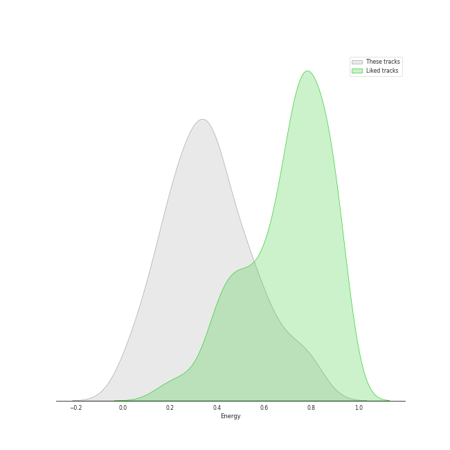
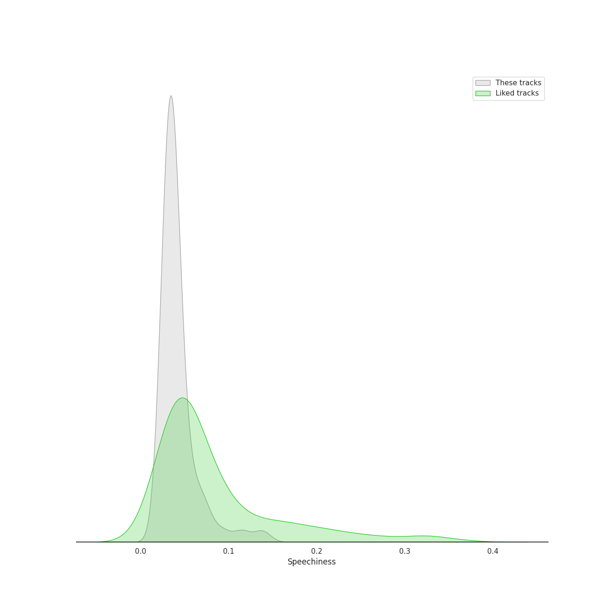
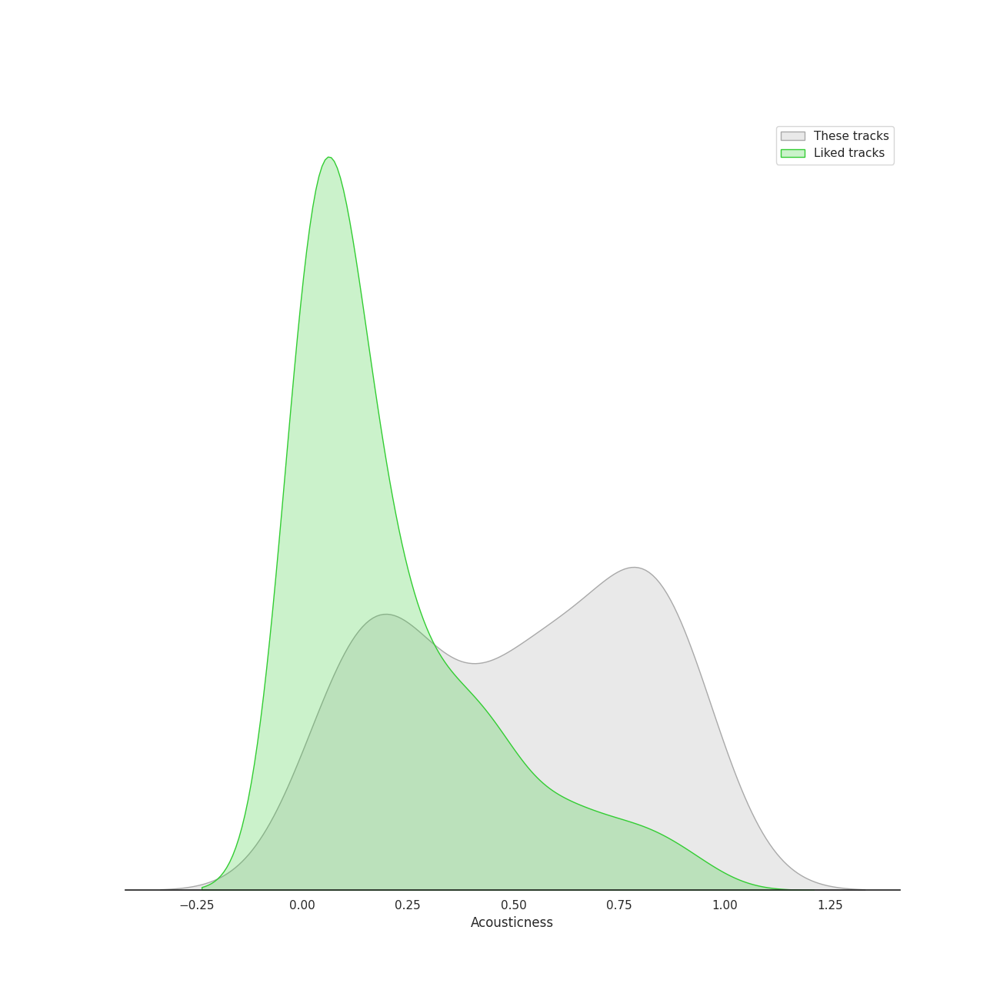
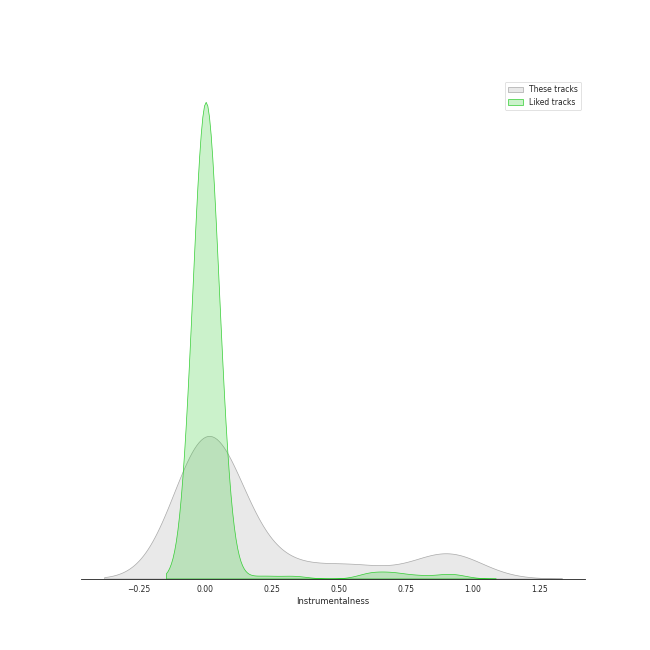
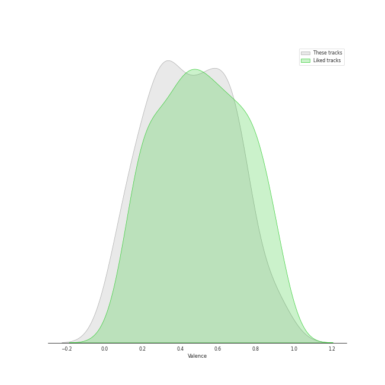
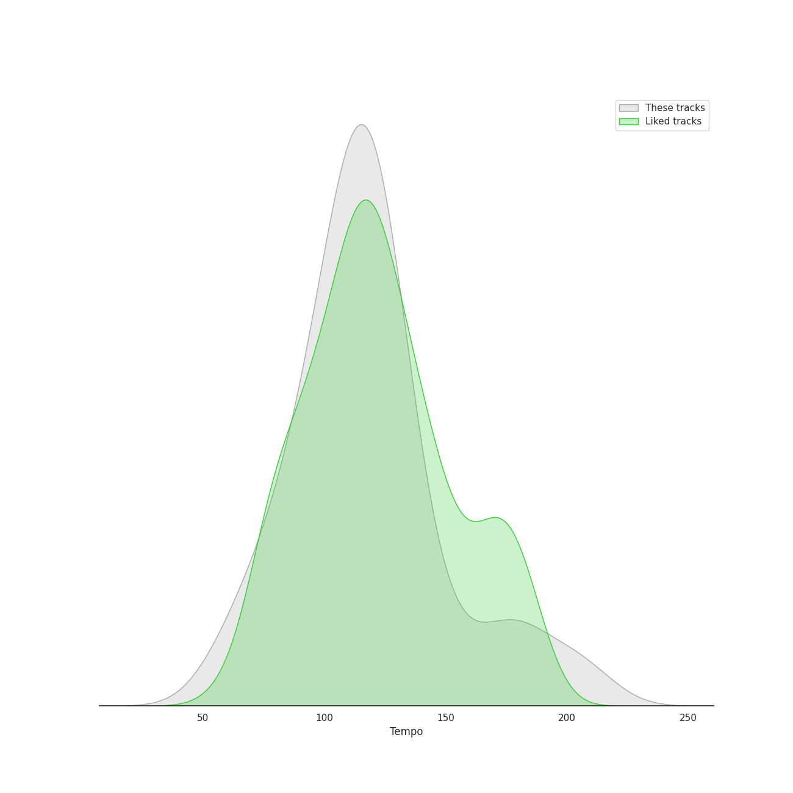

# Track Features for Jazz

## Danceability

| ​ | 10 most Danceable tracks | ​​ | 10 least Danceable tracks |
|:---|:---|:---|:---|
|  | Freedom At Midnight (0.78) |  | A Last Request (0.224) |
|  | That Man (0.734) |  | Can't Help Falling in Love (0.234) |
|  | Houston (0.726) |  | Strangers In The Night (0.259) |
|  | Fake Monologue (0.706) |  | Unforgettable (0.286) |
|  | Passion Walk (0.698) |  | Kei's Song (0.299) |
|  | The Man With The Panama Hat (0.694) |  | Pieces Of Time (0.333) |
|  | Everything (0.686) |  | The Last Goodbye (0.346) |
|  | Someday (feat. Meghan Trainor) (0.671) |  | Deep Light (0.408) |
|  | Fly Me To The Moon (In Other Words) (0.668) |  | Del Sasser (0.418) |
|  | Every Corner Of The World (0.66) |  | Beautiful Love (0.435) |

## Energy

| ​ | 10 most Energetic tracks | ​​ | 10 least Energetic tracks |
|:---|:---|:---|:---|
|  | That Man (0.812) |  | Pieces Of Time (0.0496) |
|  | Agua De Beber (0.759) |  | The Last Goodbye (0.0741) |
|  | Haven't Met You Yet (0.733) |  | I Can't Make You Love Me (0.149) |
|  | Everything (0.688) |  | Deep Light (0.15) |
|  | El Camino Real (0.639) |  | Fake Monologue (0.185) |
|  | South East Quarter (0.628) |  | L-O-V-E - 2000 Remaster (0.187) |
|  | Moondance (0.614) |  | Kei's Song (0.219) |
|  | M.W.A. (Musicians With Attitude) (0.594) |  | 6-String Poet (0.23) |
|  | Freedom At Midnight (0.584) |  | La Vie En Rose (0.236) |
|  | Feeling Good (0.548) |  | The Way You Look Tonight (0.24) |

## Speechiness

| ​ | 10 most Speechy tracks | ​​ | 10 least Speechy tracks |
|:---|:---|:---|:---|
|  | That Man (0.138) |  | Everything (0.0254) |
|  | Unsquare Dance (0.115) |  | I Can't Make You Love Me (0.0273) |
|  | L-O-V-E - 2000 Remaster (0.0928) |  | Unforgettable (0.028) |
|  | Moondance (0.0737) |  | The Way You Look Tonight (0.028) |
|  | That's Life (0.0729) |  | Call Me Irresponsible (0.0292) |
|  | The Best Is yet to Come (0.0691) |  | Can't Help Falling in Love (0.0293) |
|  | Fake Monologue (0.0604) |  | La vie en rose (feat. Cécile McLorin Salvant) (0.0294) |
|  | Love Won't Let You Get Away (0.0584) |  | Something In The Air Between Us (0.0295) |
|  | M.W.A. (Musicians With Attitude) (0.0554) |  | Strangers In The Night (0.0295) |
|  | Fly Me To The Moon (In Other Words) (0.0523) |  | Coconut Roads (0.0299) |

## Acousticness

| ​ | 10 most Acoustic tracks | ​​ | 10 least Acoustic tracks |
|:---|:---|:---|:---|
|  | I Can't Make You Love Me (0.941) |  | Del Sasser (0.054) |
|  | The Last Goodbye (0.939) |  | Unsquare Dance (0.0723) |
|  | Something In The Air Between Us (0.925) |  | Freedom At Midnight (0.074) |
|  | Beautiful Love (0.875) |  | El Camino Real (0.0804) |
|  | Home (0.853) |  | The Man With The Panama Hat (0.104) |
|  | Blue Rondo à la Turk (0.851) |  | Every Step Of The Way (0.104) |
|  | Pieces Of Time (0.851) |  | Coconut Roads (0.136) |
|  | Unforgettable (0.85) |  | Haven't Met You Yet (0.152) |
|  | Deep Light (0.847) |  | Along The Milky Way (0.153) |
|  | I Can't Make You Love Me (0.846) |  | Houston (0.159) |

## Instrumentalness

| ​ | 10 most Instrumental tracks | ​​ | 10 least Instrumental tracks |
|:---|:---|:---|:---|
|  | Deep Light (0.956) |  | The Way You Look Tonight (0.0) |
|  | Freedom At Midnight (0.937) |  | Someday (feat. Meghan Trainor) (0.0) |
|  | Fake Monologue (0.898) |  | La Vie En Rose (0.0) |
|  | The Last Goodbye (0.881) |  | La vie en rose (feat. Cécile McLorin Salvant) (0.0) |
|  | Unsquare Dance (0.88) |  | Moondance (0.0) |
|  | 6-String Poet (0.841) |  | That's Life (0.0) |
|  | M.W.A. (Musicians With Attitude) (0.638) |  | Haven't Met You Yet (0.0) |
|  | A Last Request (0.563) |  | Come Fly With Me - Remastered 1998 (0.0) |
|  | Houston (0.554) |  | The Best Is yet to Come (0.0) |
|  | Every Step Of The Way (0.545) |  | Every Corner Of The World (0.0) |

## Liveness

| ​ | 10 most Live tracks | ​​ | 10 least Live tracks |
|:---|:---|:---|:---|
|  | Moondance (0.401) |  | Freedom At Midnight (0.0168) |
|  | Sunny (0.37) |  | Coconut Roads (0.0357) |
|  | That's Life (0.346) |  | Every Corner Of The World (0.0482) |
|  | The Best Is yet to Come (0.296) |  | The Man With The Panama Hat (0.0568) |
|  | South East Quarter (0.278) |  | Passion Walk (0.0581) |
|  | The Way You Look Tonight (0.251) |  | Fly Me To The Moon (In Other Words) (0.0621) |
|  | I Can't Make You Love Me (0.236) |  | Along The Milky Way (0.0635) |
|  | M.W.A. (Musicians With Attitude) (0.224) |  | Take Five (0.0675) |
|  | Houston (0.211) |  | El Camino Real (0.0714) |
|  | Strangers In The Night (0.201) |  | Someday (feat. Meghan Trainor) (0.0748) |

## Valence

| ​ | 10 most Happy tracks | ​​ | 10 least Happy tracks |
|:---|:---|:---|:---|
|  | Someday (feat. Meghan Trainor) (0.934) |  | Deep Light (0.0517) |
|  | That Man (0.903) |  | The Last Goodbye (0.0726) |
|  | Haven't Met You Yet (0.796) |  | Pieces Of Time (0.0776) |
|  | Freedom At Midnight (0.743) |  | Can't Help Falling in Love (0.0969) |
|  | L-O-V-E - 2000 Remaster (0.728) |  | I Can't Make You Love Me (0.113) |
|  | The Man With The Panama Hat (0.722) |  | Unforgettable (0.142) |
|  | Fake Monologue (0.704) |  | A Last Request (0.153) |
|  | Agua De Beber (0.7) |  | 6-String Poet (0.187) |
|  | Del Sasser (0.692) |  | La Vie En Rose (0.194) |
|  | Passion Walk (0.674) |  | Something In The Air Between Us (0.199) |

## Tempo

| ​ | 10 most Fast tracks | ​​ | 10 least Fast tracks |
|:---|:---|:---|:---|
|  | That Man (207.029) |  | 6-String Poet (60.757) |
|  | M.W.A. (Musicians With Attitude) (203.958) |  | La vie en rose (feat. Cécile McLorin Salvant) (63.378) |
|  | Fake Monologue (185.953) |  | Come Fly With Me - Remastered 1998 (67.008) |
|  | A Last Request (179.86) |  | Pieces Of Time (76.03) |
|  | Take Five (174.322) |  | L-O-V-E (78.884) |
|  | Can't Help Falling in Love (174.036) |  | Along The Milky Way (82.022) |
|  | L-O-V-E - 2000 Remaster (157.47) |  | Unforgettable (85.691) |
|  | Kei's Song (144.886) |  | The Last Goodbye (89.055) |
|  | Moondance (140.736) |  | Along Love's Highway (90.068) |
|  | La Vie En Rose (133.985) |  | Strangers In The Night (90.348) |
