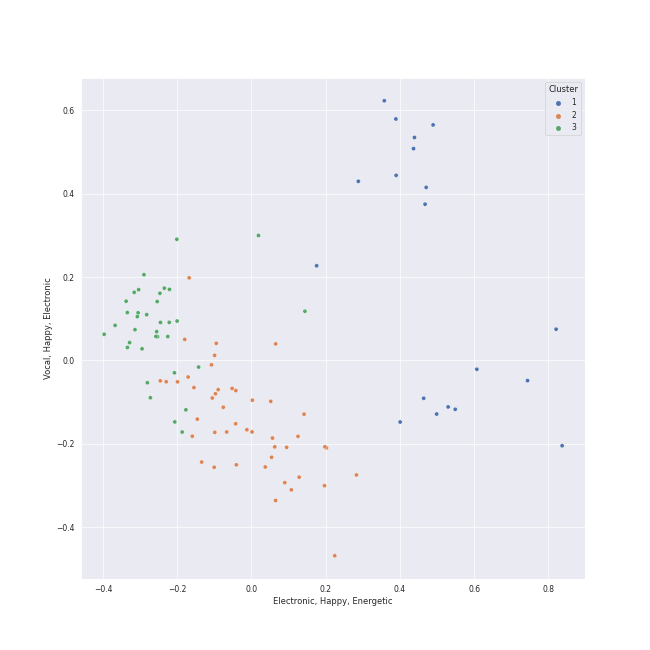

# Clusters in Jazz

## Cluster #1

19 tracks

| Art | Track | Album | Artists | Label | Rank | 💚 | 🔗 |
|:---|:---|:---|:---|:---|---:|:---|:---|
|  | South East Quarter | Inner Motion | David Benoit | [GRP](../../../../labels/grp) | 1018 | | [🔗](https://open.spotify.com/track/04IcSgYzMaGKJsfYJ6cs8s) |
|  | Coconut Roads | Inner Motion | David Benoit | [GRP](../../../../labels/grp) | 1018 | | [🔗](https://open.spotify.com/track/0YXj7thzE6znoniGd662fi) |
|  | M.W.A. (Musicians With Attitude) | Inner Motion | David Benoit | [GRP](../../../../labels/grp) | 1018 | | [🔗](https://open.spotify.com/track/1dE0PS08MJrUkdtrG5hjpk) |
|  | Houston | Inner Motion | David Benoit | [GRP](../../../../labels/grp) | 1018 | | [🔗](https://open.spotify.com/track/2hFD5732Sz3FJ4ohjhKLG5) |
|  | 6-String Poet | Inner Motion | David Benoit | [GRP](../../../../labels/grp) | 1018 | | [🔗](https://open.spotify.com/track/2vp4iFA59viHbdNLCbQKtz) |
|  | Every Step Of The Way | Every Step Of The Way | David Benoit, Randy Waldman | [GRP](../../../../labels/grp) | 1018 | | [🔗](https://open.spotify.com/track/5yhNKJlMmop5uhaHvL0RfU) |
|  | Merrily Music | Merrily Music | YUNSEOKCHEOL TRIO | Evans Music | 854 | | [🔗](https://open.spotify.com/track/6pRNRlI9z4fHI4CQfYHsWv) |
|  | Tell Me a Bedtime Story | Fat Albert Rotunda | Herbie Hancock | [Rhino](../../../../labels/rhino), [Warner Records](../../../../labels/warner_records) | 1018 | 💚 | [🔗](https://open.spotify.com/track/6eimz6jvlZaPwtflDWCTa0) |
|  | Skating | A Charlie Brown Christmas [2012 Remastered & Expanded Edition] | Vince Guaraldi Trio | [Craft Recordings](../../../../labels/craft_recordings) | 1018 | | [🔗](https://open.spotify.com/track/4Gu4Z1RQ68h8fQnSDQxfKr) |
|  | Linus And Lucy | A Charlie Brown Christmas [2012 Remastered & Expanded Edition] | Vince Guaraldi Trio | [Craft Recordings](../../../../labels/craft_recordings) | 1018 | | [🔗](https://open.spotify.com/track/5N96qwzTDhbf2y6FWAVz4c) |
## Cluster #2

45 tracks

| Art | Track | Album | Artists | Label | Rank | 💚 | 🔗 |
|:---|:---|:---|:---|:---|---:|:---|:---|
|  | Along Love's Highway | Inner Motion | David Benoit | [GRP](../../../../labels/grp) | 1018 | | [🔗](https://open.spotify.com/track/6QfdOlWT7J1b8y2EBLkV8M) |
|  | Passion Walk | Freedom At Midnight | David Benoit | [GRP](../../../../labels/grp) | 1018 | | [🔗](https://open.spotify.com/track/4tSRlUqyaYYVGbPgw7PyY1) |
|  | All Night Long (feat. Take 6) | Djesse Vol. 1 | [Jacob Collier](../../../../artists/jacob_collier/overview.md), Metropole Orkest, Jules Buckley, Take 6 | [Decca (UMO)](../../../../labels/decca_(umo)) | 1018 | 💚 | [🔗](https://open.spotify.com/track/6TN4FrJvMdYrLDF2Lz7ArI) |
|  | Mack the Knife | The Great American Songbook | Louis Armstrong | [Columbia](../../../../labels/columbia), [Legacy](../../../../labels/legacy) | 566 | | [🔗](https://open.spotify.com/track/0RNxWy0PC3AyH4ThH3aGK6) |
|  | Still Alive (From "Portal") | Choose Your Character! | [The 8-Bit Big Band](../../../../artists/the_8-bit_big_band/overview.md) | The 8-Bit Big Band | 1018 | 💚 | [🔗](https://open.spotify.com/track/0RrhwwIqnfCDPZD7DfWAVj) |
|  | That's Life | That's Life | [Frank Sinatra](../../../../artists/frank_sinatra/overview.md) | FRANK SINATRA DIGITAL REPRISE | 1018 | | [🔗](https://open.spotify.com/track/4FmCUATNIarCQh72JYdvnm) |
|  | The Way You Look Tonight | Michael Bublé | [Michael Bublé](../../../../artists/michael_bublé/overview.md) | [143](../../../../labels/143), [Reprise](../../../../labels/reprise) | 1018 | | [🔗](https://open.spotify.com/track/4YGlRLe6TeBRiXFByBqldf) |
|  | Feeling Good | It's Time | [Michael Bublé](../../../../artists/michael_bublé/overview.md) | [143](../../../../labels/143), [Reprise](../../../../labels/reprise) | 873 | 💚 | [🔗](https://open.spotify.com/track/72PwtNhRrZXNnYeRg5xQ46) |
|  | L-O-V-E | Unforgettable: With Love | Natalie Cole | [Craft Recordings](../../../../labels/craft_recordings) | 1018 | | [🔗](https://open.spotify.com/track/637xWjdmJY7CAQJsnsT7Fs) |
|  | It Could Happen To You | Relaxin' With The Miles Davis Quintet | Miles Davis Quintet | Prestige | 1018 | | [🔗](https://open.spotify.com/track/34xixFi5y3I5FIOH1ZWisx) |
## Cluster #3

35 tracks

| Art | Track | Album | Artists | Label | Rank | 💚 | 🔗 |
|:---|:---|:---|:---|:---|---:|:---|:---|
|  | In A Sentimental Mood | Duke Ellington & John Coltrane | Duke Ellington, John Coltrane | Impulse! | 1018 | | [🔗](https://open.spotify.com/track/0E8q2Fx2XuzXCO2NSAppkR) |
|  | Everything Happens to Me | Chet Baker Sings: It Could Happen To You [Original Jazz Classics Remasters] (OJC Remaster) | Chet Baker | Original Jazz Classics | 1018 | | [🔗](https://open.spotify.com/track/4Y5fyQ5fBysC32Na5sZT3J) |
|  | Dream A Little Dream Of Me | Ella: The Legendary Decca Recordings | Ella Fitzgerald, Louis Armstrong | Verve Reissues | 1018 | 💚 | [🔗](https://open.spotify.com/track/0KBvapFwuz8gPKu6Gw23WN) |
|  | Dream A Little Dream Of Me - Single Version | Love, Ella | Ella Fitzgerald, Louis Armstrong | Verve Reissues | 1018 | 💚 | [🔗](https://open.spotify.com/track/78MI7mu1LV1k4IA2HzKmHe) |
|  | Breakfast on the Morning Tram | Breakfast on the Morning Tram | Stacey Kent | Parlophone (France) | 1018 | 💚 | [🔗](https://open.spotify.com/track/0mcs5XA4bwgCVYLUxvJ9sg) |
|  | La vie en rose (feat. Cécile McLorin Salvant) | love (Deluxe Edition) | [Michael Bublé](../../../../artists/michael_bublé/overview.md), Cécile McLorin Salvant | [Reprise](../../../../labels/reprise) | 1018 | | [🔗](https://open.spotify.com/track/1QELw50Dl95LusF6uOkDqk) |
|  | La Vie En Rose | Sophie Milman | Sophie Milman | Linus Entertainment Inc. | 1018 | | [🔗](https://open.spotify.com/track/12kmgivtb8dyhxnko2doFt) |
|  | Beautiful Love | Take Love Easy | Sophie Milman | Linus Entertainment | 1018 | | [🔗](https://open.spotify.com/track/2wIHqsfA7ozyjbU4EoHOv3) |
|  | I Can't Make You Love Me | Take Love Easy | Sophie Milman | Linus Entertainment | 1018 | | [🔗](https://open.spotify.com/track/4G5kuEKnYw2PFdLdYcZFWz) |
|  | Something In The Air Between Us | Make Someone Happy | Sophie Milman | Linus Entertainment Inc. | 1018 | | [🔗](https://open.spotify.com/track/6GBqHQAW0Z16wsQQzN65i4) |