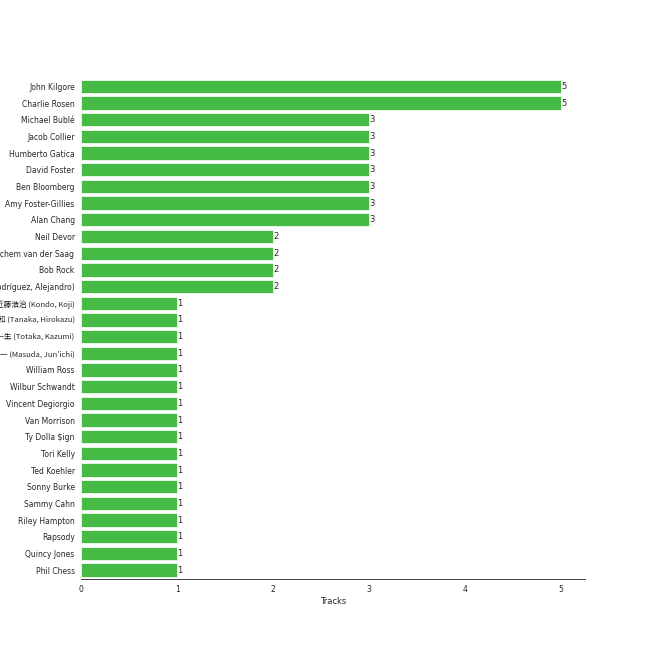
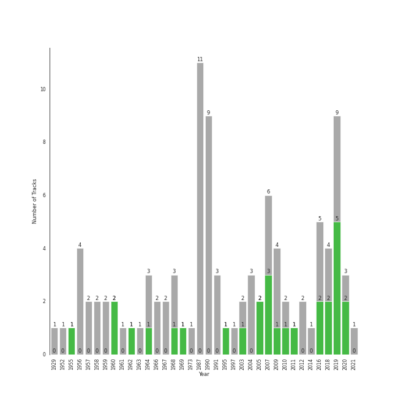

# Jazz

[80 tracks (20 liked) 🔗](https://open.spotify.com/playlist/58yLhLYn4iDQPCN53MfiDI)

[See Track Features](audio_features.md)

[See Clusters](clusters/overview.md)

## Top Artists

| Art | Tracks | 💚 | Artist | 🔗 |
|:---|---:|---:|:---|:---|
|  | 12 | 5 | [Michael Bublé](../../artists/michael_bublé/overview.md) | [🔗](https://open.spotify.com/artist/1GxkXlMwML1oSg5eLPiAz3) |
|  | 6 | 3 | Louis Armstrong | [🔗](https://open.spotify.com/artist/19eLuQmk9aCobbVDHc6eek) |
|  | 4 | 3 | [Jacob Collier](../../artists/jacob_collier/overview.md) | [🔗](https://open.spotify.com/artist/0QWrMNukfcVOmgEU0FEDyD) |
|  | 7 | 2 | [Frank Sinatra](../../artists/frank_sinatra/overview.md) | [🔗](https://open.spotify.com/artist/1Mxqyy3pSjf8kZZL4QVxS0) |
|  | 3 | 2 | Ella Fitzgerald | [🔗](https://open.spotify.com/artist/5V0MlUE1Bft0mbLlND7FJz) |
|  | 2 | 2 | Etta James | [🔗](https://open.spotify.com/artist/0iOVhN3tnSvgDbcg25JoJb) |
|  | 2 | 1 | Herbie Hancock | [🔗](https://open.spotify.com/artist/2ZvrvbQNrHKwjT7qfGFFUW) |
|  | 1 | 1 | Seth MacFarlane | [🔗](https://open.spotify.com/artist/79D4dipwR6scV8AN3dm7gW) |
|  | 1 | 1 | Rapsody | [🔗](https://open.spotify.com/artist/6NL31G53xThQXkFs7lDpL5) |
|  | 1 | 1 | Caro Emerald | [🔗](https://open.spotify.com/artist/492hDmhPyuIjP3MgTcIqgm) |

See all 31 artists

| Art | Tracks | 💚 | Artist | 🔗 |
|:---|---:|---:|:---|:---|
|  | 1 | 1 | Count Basie | [🔗](https://open.spotify.com/artist/2jFZlvIea42ZvcCw4OeEdA) |
|  | 1 | 1 | [Sara Bareilles](../../artists/sara_bareilles/overview.md) | [🔗](https://open.spotify.com/artist/2Sqr0DXoaYABbjBo9HaMkM) |
|  | 1 | 1 | Sarah Vaughan | [🔗](https://open.spotify.com/artist/1bgyxtWjZwA5PQlDsvs9b8) |
|  | 1 | 1 | Stacey Kent | [🔗](https://open.spotify.com/artist/03EYBMnqSchCMp5D9qmFXi) |
|  | 21 | 0 | David Benoit | [🔗](https://open.spotify.com/artist/1OLWM7nUNcTjZ9ct4DEPZu) |
|  | 5 | 0 | Sophie Milman | [🔗](https://open.spotify.com/artist/19GI8I4UhSpBl8Y9XpKyT4) |
|  | 3 | 0 | The Dave Brubeck Quartet | [🔗](https://open.spotify.com/artist/4iRZAbYvBqnxrbs6K25aJ7) |
|  | 3 | 0 | Chet Baker | [🔗](https://open.spotify.com/artist/3rxeQlsv0Sc2nyYaZ5W71T) |
|  | 2 | 0 | Nat King Cole | [🔗](https://open.spotify.com/artist/7v4imS0moSyGdXyLgVTIV7) |
|  | 2 | 0 | Natalie Cole | [🔗](https://open.spotify.com/artist/5tTsrGPwQRWUsHR2Xf7Ke9) |
|  | 2 | 0 | Vince Guaraldi Trio | [🔗](https://open.spotify.com/artist/4ytkhMSAnrDP8XzRNlw9FS) |
|  | 2 | 0 | Duke Ellington | [🔗](https://open.spotify.com/artist/4F7Q5NV6h5TSwCainz8S5A) |
|  | 1 | 0 | Miles Davis Quintet | [🔗](https://open.spotify.com/artist/71Ur25Abq58vksqJINpGdx) |
|  | 1 | 0 | Cécile McLorin Salvant | [🔗](https://open.spotify.com/artist/6PkSULcbxFKkxdgrmPGAvn) |
|  | 1 | 0 | Meghan Trainor | [🔗](https://open.spotify.com/artist/6JL8zeS1NmiOftqZTRgdTz) |
|  | 1 | 0 | Bonnie Raitt | [🔗](https://open.spotify.com/artist/4KDyYWR7IpxZ7xrdYbKrqY) |
|  | 1 | 0 | Randy Waldman | [🔗](https://open.spotify.com/artist/4DoFQoqKcSPw8CSzyh7trt) |
|  | 1 | 0 | John Coltrane | [🔗](https://open.spotify.com/artist/2hGh5VOeeqimQFxqXvfCUf) |
|  | 1 | 0 | Stan Getz | [🔗](https://open.spotify.com/artist/0FMucZsEnCxs5pqBjHjIc8) |
|  | 1 | 0 | YUNSEOKCHEOL TRIO | [🔗](https://open.spotify.com/artist/09fZOcPYim8MvvQieKkv5t) |
|  | 1 | 0 | Wes Montgomery | [🔗](https://open.spotify.com/artist/03YhcM6fxypfwckPCQV8pQ) |

## Top Albums

| Art | Tracks | 💚 | Album | Release Date | 🔗 |
|:---|---:|---:|:---|:---|:---|
|  | 10 | 0 | Inner Motion | 1990-01-01 | [🔗](https://open.spotify.com/album/6azX9ZDZzVLjpQy6ytifne) |
|  | 10 | 0 | Freedom At Midnight | 1987-01-01 | [🔗](https://open.spotify.com/album/404TYwH2T33GbA9LdIT9fR) |
|  | 3 | 1 | Call Me Irresponsible | 2007-04-30 | [🔗](https://open.spotify.com/album/3h4pyWRJIB9ZyRKXChbX22) |
|  | 2 | 2 | It's Time | 2005-02-08 | [🔗](https://open.spotify.com/album/457fktVFXVwjQTl9wOLlfg) |
|  | 2 | 2 | At Last! | 1960 | [🔗](https://open.spotify.com/album/7rd4PorIOPjPTy7qdUeeCt) |
|  | 2 | 1 | What A Wonderful World | 1968-01-01 | [🔗](https://open.spotify.com/album/6mmv0gwumlFGWDGJXF4yEv) |
|  | 2 | 1 | Michael Bublé | 2003 | [🔗](https://open.spotify.com/album/3rpSksJSFdNFqk5vne8at2) |
|  | 2 | 1 | In My Room | 2016-07-01 | [🔗](https://open.spotify.com/album/70N5l7CBZmAMCh1WfnM6in) |
|  | 2 | 1 | Crazy Love | 2009-10-06 | [🔗](https://open.spotify.com/album/3MXDonOIzrIrCh0HvlACyj) |
|  | 2 | 0 | Unforgettable: With Love | 1991-06-11 | [🔗](https://open.spotify.com/album/4ilUfGGQXin7hr1srDDXF0) |

See all 48 albums

| Art | Tracks | 💚 | Album | Release Date | 🔗 |
|:---|---:|---:|:---|:---|:---|
|  | 2 | 0 | Time Out | 1959-12-14 | [🔗](https://open.spotify.com/album/0nTTEAhCZsbbeplyDMIFuA) |
|  | 2 | 0 | Take Love Easy | 2009-05-05 | [🔗](https://open.spotify.com/album/0a7Ut6OPSs8SvPDhFXL4ar) |
|  | 2 | 0 | Sophie Milman | 2004-01-01 | [🔗](https://open.spotify.com/album/2g5alWoreAp8i1Jjz2XHr4) |
|  | 2 | 0 | Chet Baker Sings | 1956 | [🔗](https://open.spotify.com/album/5JJ779nrbHx0KB2lBrMMa4) |
|  | 2 | 0 | A Charlie Brown Christmas [2012 Remastered & Expanded Edition] | 2012-01-01 | [🔗](https://open.spotify.com/album/2XnNY3GEkbWHor5kyvXLu4) |
|  | 1 | 1 | Sinatra/Basie: The Complete Reprise Studio Recordings | 1962-12-10 | [🔗](https://open.spotify.com/album/2NCtCObbmJoJnplsR5mLAl) |
|  | 1 | 1 | Music Is Better Than Words | 2011-01-01 | [🔗](https://open.spotify.com/album/6VojJdbXviFkMuemAQ2Ivo) |
|  | 1 | 1 | Love, Ella | 2007-05-03 | [🔗](https://open.spotify.com/album/1y5KGkUKO0NG32MhIIagCA) |
|  | 1 | 1 | Fat Albert Rotunda | 1969-12-08 | [🔗](https://open.spotify.com/album/0EfpGDmzg4uuqLW7ucWCyE) |
|  | 1 | 1 | Ella: The Legendary Decca Recordings | 1995-08-29 | [🔗](https://open.spotify.com/album/0G5ZHFj5VmvIWEAuF8NEIT) |
|  | 1 | 1 | Djesse Vol. 3 | 2020-08-14 | [🔗](https://open.spotify.com/album/33cj3kzLqVOg9zvy69Wrc8) |
|  | 1 | 1 | Djesse Vol. 2 | 2019-07-19 | [🔗](https://open.spotify.com/album/3zNi5dCpkbm4zv7h1vGOMy) |
|  | 1 | 1 | Deleted Scenes From The Cutting Room Floor | 2010-01-29 | [🔗](https://open.spotify.com/album/1D8grnftAaivpmBkayUgMR) |
|  | 1 | 1 | Days Of Wine And Roses, Moon River And Other Academy Award Winners | 1964 | [🔗](https://open.spotify.com/album/7FAo3wmrJNNzz2W5Z5ZG80) |
|  | 1 | 1 | Breakfast on the Morning Tram | 2007-09-03 | [🔗](https://open.spotify.com/album/5RwBI4pEinXbIiUhWzAMbX) |
|  | 1 | 1 | After Hours | 1955-04-12 | [🔗](https://open.spotify.com/album/3F0Q6zKxvJJbxWR4hZWcef) |
|  | 1 | 0 | love (Deluxe Edition) | 2018-11-16 | [🔗](https://open.spotify.com/album/68xKnVblFsSQ48CtgZT0oY) |
|  | 1 | 0 | Time Further Out | 1961 | [🔗](https://open.spotify.com/album/0eMXd1VtCXCkuGWn9JjRDT) |
|  | 1 | 0 | The Complete Ella And Louis On Verve | 1997-05-20 | [🔗](https://open.spotify.com/album/2uqlkJu6vckJahCsp6Hfcn) |
|  | 1 | 0 | That's Life | 1966-11 | [🔗](https://open.spotify.com/album/3gNsjaUsu9cRckgUFx5NsY) |
|  | 1 | 0 | Strangers In The Night (Expanded Edition) | 1966-05 | [🔗](https://open.spotify.com/album/1kyb5tomEXcA106V57puFW) |
|  | 1 | 0 | Songs For Swingin' Lovers! (Remastered) | 1956-03 | [🔗](https://open.spotify.com/album/4kca7vXd1Wo5GE2DMafvMc) |
|  | 1 | 0 | Satchmo Serenades | 1952-04-01 | [🔗](https://open.spotify.com/album/17fcllu2aPjrx4ZCm05jMc) |
|  | 1 | 0 | Romance | 2021-02-12 | [🔗](https://open.spotify.com/album/5MuNxtOyex8o77Qdjaqeng) |
|  | 1 | 0 | Relaxin' With The Miles Davis Quintet | 1958 | [🔗](https://open.spotify.com/album/0dyIXPKoUBt1vFJHX57dqt) |
|  | 1 | 0 | Nobody but Me | 2016-10-21 | [🔗](https://open.spotify.com/album/5wN1OizIFEHDUkRwzIK3wL) |
|  | 1 | 0 | Make Someone Happy | 2007-01-01 | [🔗](https://open.spotify.com/album/2oGYlZ7vte6lJ1MuwKKCeW) |
|  | 1 | 0 | Luck Of The Draw | 1991-01-01 | [🔗](https://open.spotify.com/album/6blrkOZ0VmkhYPjfoD7eqf) |
|  | 1 | 0 | Head Hunters | 1973-10-26 | [🔗](https://open.spotify.com/album/5fmIolILp5NAtNYiRPjhzA) |
|  | 1 | 0 | Getz/Gilberto (Expanded Edition) | 1964 | [🔗](https://open.spotify.com/album/2W6Hvrtg2Zpc9dW4aBDbdP) |
|  | 1 | 0 | Francis A. & Edward K. | 1968-01 | [🔗](https://open.spotify.com/album/5GFkm37IrMR9a4rc6JABkw) |
|  | 1 | 0 | Every Step Of The Way | 1987 | [🔗](https://open.spotify.com/album/50HH21YU6PDn8XZXYGxWkg) |
|  | 1 | 0 | Duke Ellington & John Coltrane | 1963-02 | [🔗](https://open.spotify.com/album/1OvmilWKtrabJGEpPRlgK5) |
|  | 1 | 0 | Db in April | 2018-04-24 | [🔗](https://open.spotify.com/album/2SUUafWH8ZchpD7eNBzXJy) |
|  | 1 | 0 | Come Fly with Me | 2004-03-30 | [🔗](https://open.spotify.com/album/0UhvDeKmtgegXeELEVgGRh) |
|  | 1 | 0 | Come Fly With Me (Expanded Edition) | 1958 | [🔗](https://open.spotify.com/album/66v9QmjAj0Wwhh2OpbU4BE) |
|  | 1 | 0 | Chet Baker Sings: It Could Happen To You [Original Jazz Classics Remasters] (OJC Remaster) | 2010-01-01 | [🔗](https://open.spotify.com/album/05GsIfSvuy3bSY5EodA0Cc) |
|  | 1 | 0 | A Day In The Life | 1967-01-01 | [🔗](https://open.spotify.com/album/5Z6DQMOjrC5DK1pQ3RBdZ5) |

## Top Record Labels

| Tracks | 💚 | Label |
|---:|---:|:---|
| 12 | 5 | [Reprise](../../labels/reprise/overview.md) |
| 10 | 5 | [143](../../labels/143/overview.md) |
| 5 | 2 | FRANK SINATRA DIGITAL REPRISE |
| 4 | 2 | Verve Reissues |
| 2 | 2 | [Geffen](../../labels/geffen/overview.md) |
| 2 | 2 | [Decca (UMO)](../../labels/decca_(umo)/overview.md) |
| 23 | 1 | [GRP](../../labels/grp/overview.md) |
| 2 | 1 | Hajanga Records |
| 1 | 1 | [Warner Records](../../labels/warner_records/overview.md) |
| 1 | 1 | [Universal Music LLC](../../labels/universal_music_llc/overview.md) |

See all 28 labels

| Tracks | 💚 | Label |
|---:|---:|:---|
| 1 | 1 | [Rhino](../../labels/rhino/overview.md) |
| 1 | 1 | Parlophone (France) |
| 1 | 1 | Legacy Recordings |
| 1 | 1 | Grandmono Records |
| 1 | 1 | Fuzzy Door Productions |
| 5 | 0 | Linus Entertainment Inc. |
| 4 | 0 | [Legacy](../../labels/legacy/overview.md) |
| 4 | 0 | Craft Recordings |
| 4 | 0 | [Columbia](../../labels/columbia/overview.md) |
| 3 | 0 | [Capitol Records](../../labels/capitol_records/overview.md) |
| 2 | 0 | Blue Note Records |
| 1 | 0 | Verve |
| 1 | 0 | [UME - Global Clearing House](../../labels/ume_-_global_clearing_house/overview.md) |
| 1 | 0 | Private Curve |
| 1 | 0 | Prestige |
| 1 | 0 | Original Jazz Classics |
| 1 | 0 | Impulse! |
| 1 | 0 | A&M |

## Genres

| Tracks | 💚 | Genre |
|---:|---:|:---|
| 28 | 10 | [adult standards](../../genres/adult_standards/overview.md) |
| 23 | 7 | [vocal jazz](../../genres/vocal_jazz/overview.md) |
| 20 | 7 | [lounge](../../genres/lounge/overview.md) |
| 12 | 5 | jazz pop |
| 12 | 5 | [canadian pop](../../genres/canadian_pop/overview.md) |
| 11 | 5 | [soul](../../genres/soul/overview.md) |
| 16 | 4 | jazz |
| 5 | 4 | jazz blues |
| 8 | 3 | swing |
| 4 | 3 | [uk alternative pop](../../genres/uk_alternative_pop/overview.md) |

See all 48 genres

| Tracks | 💚 | Genre |
|---:|---:|:---|
| 3 | 3 | torch song |
| 7 | 2 | easy listening |
| 2 | 2 | soul blues |
| 6 | 1 | jazz trumpet |
| 6 | 1 | contemporary vocal jazz |
| 4 | 1 | harlem renaissance |
| 3 | 1 | new orleans jazz |
| 3 | 1 | jazz piano |
| 3 | 1 | dixieland |
| 3 | 1 | contemporary post-bop |
| 2 | 1 | jazz fusion |
| 2 | 1 | jazz funk |
| 2 | 1 | instrumental funk |
| 1 | 1 | electro swing |
| 1 | 1 | dutch pop |
| 21 | 0 | smooth jazz |
| 5 | 0 | cool jazz |
| 5 | 0 | bebop |
| 3 | 0 | jazz quartet |
| 2 | 0 | quiet storm |
| 2 | 0 | jazz trio |
| 2 | 0 | disco |
| 1 | 0 | [soft rock](../../genres/soft_rock/overview.md) |
| 1 | 0 | [singer-songwriter](../../genres/singer-songwriter/overview.md) |
| 1 | 0 | samba-jazz |
| 1 | 0 | [mellow gold](../../genres/mellow_gold/overview.md) |
| 1 | 0 | latin jazz |
| 1 | 0 | korean jazz |
| 1 | 0 | jazz saxophone |
| 1 | 0 | jazz guitar |
| 1 | 0 | [heartland rock](../../genres/heartland_rock/overview.md) |
| 1 | 0 | hard bop |
| 1 | 0 | folk rock |
| 1 | 0 | folk |
| 1 | 0 | electric blues |
| 1 | 0 | country rock |
| 1 | 0 | bossa nova |
| 1 | 0 | african-american classical |

## Top Producers

| Art | Producer | Tracks | Credit Types |
|:---|:---|---:|:---|
| | David Foster | 3 | Producer, Arranger |
| | Amy Foster-Gillies | 3 | Songwriter |
|  | [Michael Bublé](../../artists/michael_bublé/overview.md) | 3 | Songwriter, Arranger |
| | Humberto Gatica | 3 | Producer |
| | Alan Chang | 3 | Songwriter, Arranger |
| | Jochem van der Saag | 2 | Producer |
| | Bob Rock | 2 | Producer, Arranger |
| | Neil Devor | 2 | Producer |
| | Alejandro Rodríguez (Rodríguez, Alejandro) | 2 | Producer |
| | Jimmy Van Heusen | 1 | Songwriter |

View all

| Art | Producer | Tracks | Credit Types |
|:---|:---|---:|:---|
| | George David Weiss | 1 | Songwriter |
| | David Schreurs | 1 | Songwriter |
| | Lou Pomanti | 1 | Arranger |
| | Anthony Newley | 1 | Songwriter |
| | Fabian André (André, Fabian) | 1 | Songwriter |
|  | Van Morrison | 1 | Lyricist, Songwriter |
|  | Rapsody | 1 | Producer, Songwriter |
| | Johnny Mercer | 1 | Lyricist |
| | Leonard Chess | 1 | Producer |
| | Eddie Brackett | 1 | Producer |
| | Wilbur Schwandt | 1 | Songwriter |
| | William Ross | 1 | Arranger |
| | Henry Mancini | 1 | Songwriter |
| | Bob Simpson | 1 | Producer |
| | Jim Tomlinson | 1 | Songwriter |
| | Bob Thiele | 1 | Producer, Songwriter |
| | Leslie Bricusse | 1 | Songwriter |
|  | [Jacob Collier](../../artists/jacob_collier/overview.md) | 1 | Arranger, Producer, Songwriter |
|  | Herbie Hancock | 1 | Lyricist, Songwriter |
| | Riley Hampton | 1 | Arranger |
| | Leonard & Phil Chess | 1 | Producer |
| | Harold Arlen | 1 | Songwriter |
| | Ben Bloomberg | 1 | Producer |
| | Gus Kahn | 1 | Lyricist |
| | Kazuo Ishiguro | 1 | Songwriter |
| | Ted Koehler | 1 | Lyricist |
| | Sammy Cahn | 1 | Lyricist |
| | Don Sebesky | 1 | Arranger |
| | Phil Chess | 1 | Producer |
| | Vincent Degiorgio | 1 | Songwriter |

## Years

| ​ | 10 newest albums | ​​ | 10 oldest albums |
|:---|:---|:---|:---|
|  | Romance (2021-02-12) |  | Satchmo Serenades (1952-04-01) |
|  | Djesse Vol. 3 (2020-08-14) |  | After Hours (1955-04-12) |
|  | Djesse Vol. 2 (2019-07-19) |  | Chet Baker Sings (1956) |
|  | love (Deluxe Edition) (2018-11-16) |  | Songs For Swingin' Lovers! (Remastered) (1956-03) |
|  | Db in April (2018-04-24) |  | Come Fly With Me (Expanded Edition) (1958) |
|  | Nobody but Me (2016-10-21) |  | Relaxin' With The Miles Davis Quintet (1958) |
|  | In My Room (2016-07-01) |  | Time Out (1959-12-14) |
|  | A Charlie Brown Christmas [2012 Remastered & Expanded Edition] (2012-01-01) |  | At Last! (1960) |
|  | Music Is Better Than Words (2011-01-01) |  | Time Further Out (1961) |
|  | Deleted Scenes From The Cutting Room Floor (2010-01-29) |  | Sinatra/Basie: The Complete Reprise Studio Recordings (1962-12-10) |