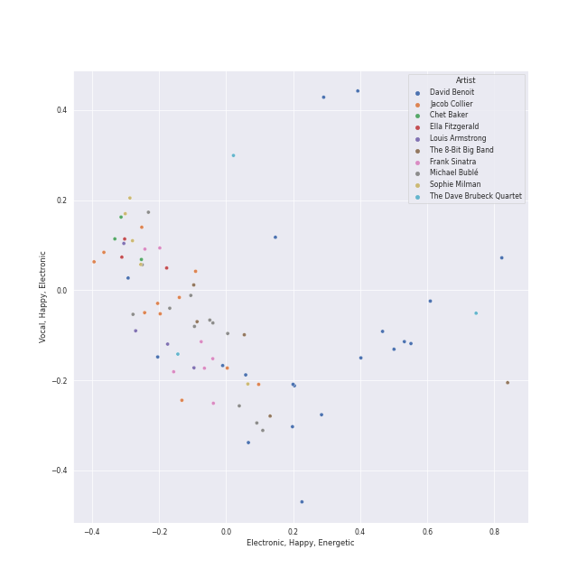
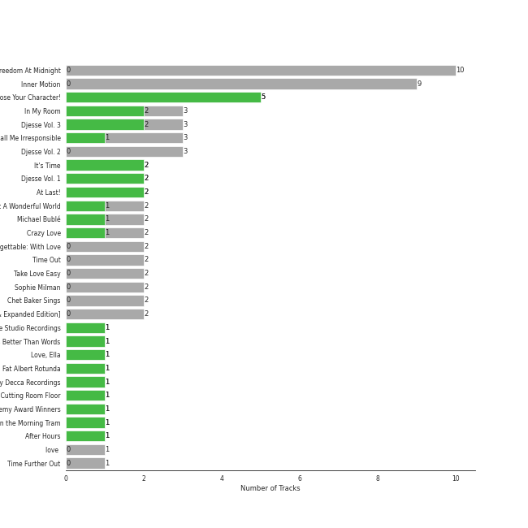

# Jazz

[56 songs](tracks.md)

## Top Artists

See all 18 artists

|   Number of Tracks | Art                                                                                              | Artist                                            | 🔗                                                           |
|-------------------:|:-------------------------------------------------------------------------------------------------|:--------------------------------------------------|:------------------------------------------------------------|
|                 21 |  | [David Benoit](../../artists/david_benoit.md)     | [🔗](https://open.spotify.com/artist/1OLWM7nUNcTjZ9ct4DEPZu) |
|                 12 |  | [Michael Bublé](../../artists/michael_bubl_.md)   | [🔗](https://open.spotify.com/artist/1GxkXlMwML1oSg5eLPiAz3) |
|                  7 |  | Frank Sinatra                                     | [🔗](https://open.spotify.com/artist/1Mxqyy3pSjf8kZZL4QVxS0) |
|                  5 |  | Sophie Milman                                     | [🔗](https://open.spotify.com/artist/19GI8I4UhSpBl8Y9XpKyT4) |
|                  3 |  | The Dave Brubeck Quartet                          | [🔗](https://open.spotify.com/artist/4iRZAbYvBqnxrbs6K25aJ7) |
|                  2 |  | Nat King Cole                                     | [🔗](https://open.spotify.com/artist/7v4imS0moSyGdXyLgVTIV7) |
|                  2 |  | Natalie Cole                                      | [🔗](https://open.spotify.com/artist/5tTsrGPwQRWUsHR2Xf7Ke9) |
|                  1 |  | Seth MacFarlane                                   | [🔗](https://open.spotify.com/artist/79D4dipwR6scV8AN3dm7gW) |
|                  1 |  | Cécile McLorin Salvant                            | [🔗](https://open.spotify.com/artist/6PkSULcbxFKkxdgrmPGAvn) |
|                  1 |  | Meghan Trainor                                    | [🔗](https://open.spotify.com/artist/6JL8zeS1NmiOftqZTRgdTz) |
|                  1 |  | Bonnie Raitt                                      | [🔗](https://open.spotify.com/artist/4KDyYWR7IpxZ7xrdYbKrqY) |
|                  1 |  | Duke Ellington                                    | [🔗](https://open.spotify.com/artist/4F7Q5NV6h5TSwCainz8S5A) |
|                  1 |  | Randy Waldman                                     | [🔗](https://open.spotify.com/artist/4DoFQoqKcSPw8CSzyh7trt) |
|                  1 |  | Caro Emerald                                      | [🔗](https://open.spotify.com/artist/492hDmhPyuIjP3MgTcIqgm) |
|                  1 |  | Count Basie                                       | [🔗](https://open.spotify.com/artist/2jFZlvIea42ZvcCw4OeEdA) |
|                  1 |  | [Sara Bareilles](../../artists/sara_bareilles.md) | [🔗](https://open.spotify.com/artist/2Sqr0DXoaYABbjBo9HaMkM) |
|                  1 |  | YUNSEOKCHEOL TRIO                                 | [🔗](https://open.spotify.com/artist/09fZOcPYim8MvvQieKkv5t) |
|                  1 |  | Stacey Kent                                       | [🔗](https://open.spotify.com/artist/03EYBMnqSchCMp5D9qmFXi) |

## Top Albums

See all 29 albums

|   Number of Tracks | Art                                                                                              | Album                                                              | 🔗                                                          |
|-------------------:|:-------------------------------------------------------------------------------------------------|:-------------------------------------------------------------------|:-----------------------------------------------------------|
|                 10 |  | Inner Motion                                                       | [🔗](https://open.spotify.com/album/6azX9ZDZzVLjpQy6ytifne) |
|                 10 |  | Freedom At Midnight                                                | [🔗](https://open.spotify.com/album/404TYwH2T33GbA9LdIT9fR) |
|                  3 |  | Call Me Irresponsible                                              | [🔗](https://open.spotify.com/album/3h4pyWRJIB9ZyRKXChbX22) |
|                  2 |  | Unforgettable: With Love                                           | [🔗](https://open.spotify.com/album/4ilUfGGQXin7hr1srDDXF0) |
|                  2 |  | Time Out                                                           | [🔗](https://open.spotify.com/album/0nTTEAhCZsbbeplyDMIFuA) |
|                  2 |  | Take Love Easy                                                     | [🔗](https://open.spotify.com/album/0a7Ut6OPSs8SvPDhFXL4ar) |
|                  2 |  | Sophie Milman                                                      | [🔗](https://open.spotify.com/album/2g5alWoreAp8i1Jjz2XHr4) |
|                  2 |  | Michael Bublé                                                      | [🔗](https://open.spotify.com/album/3rpSksJSFdNFqk5vne8at2) |
|                  2 |  | It's Time                                                          | [🔗](https://open.spotify.com/album/457fktVFXVwjQTl9wOLlfg) |
|                  2 |  | Crazy Love                                                         | [🔗](https://open.spotify.com/album/3MXDonOIzrIrCh0HvlACyj) |
|                  1 |  | love (Deluxe Edition)                                              | [🔗](https://open.spotify.com/album/68xKnVblFsSQ48CtgZT0oY) |
|                  1 |  | Time Further Out                                                   | [🔗](https://open.spotify.com/album/0eMXd1VtCXCkuGWn9JjRDT) |
|                  1 |  | That's Life                                                        | [🔗](https://open.spotify.com/album/3gNsjaUsu9cRckgUFx5NsY) |
|                  1 |  | Strangers In The Night (Expanded Edition)                          | [🔗](https://open.spotify.com/album/1kyb5tomEXcA106V57puFW) |
|                  1 |  | Songs For Swingin' Lovers! (Remastered)                            | [🔗](https://open.spotify.com/album/4kca7vXd1Wo5GE2DMafvMc) |
|                  1 |  | Sinatra/Basie: The Complete Reprise Studio Recordings              | [🔗](https://open.spotify.com/album/2NCtCObbmJoJnplsR5mLAl) |
|                  1 |  | Romance                                                            | [🔗](https://open.spotify.com/album/5MuNxtOyex8o77Qdjaqeng) |
|                  1 |  | Nobody but Me                                                      | [🔗](https://open.spotify.com/album/5wN1OizIFEHDUkRwzIK3wL) |
|                  1 |  | Music Is Better Than Words                                         | [🔗](https://open.spotify.com/album/6VojJdbXviFkMuemAQ2Ivo) |
|                  1 |  | Make Someone Happy                                                 | [🔗](https://open.spotify.com/album/2oGYlZ7vte6lJ1MuwKKCeW) |
|                  1 |  | Luck Of The Draw                                                   | [🔗](https://open.spotify.com/album/6blrkOZ0VmkhYPjfoD7eqf) |
|                  1 |  | Francis A. & Edward K.                                             | [🔗](https://open.spotify.com/album/5GFkm37IrMR9a4rc6JABkw) |
|                  1 |  | Every Step Of The Way                                              | [🔗](https://open.spotify.com/album/50HH21YU6PDn8XZXYGxWkg) |
|                  1 |  | Deleted Scenes From The Cutting Room Floor                         | [🔗](https://open.spotify.com/album/1D8grnftAaivpmBkayUgMR) |
|                  1 |  | Db in April                                                        | [🔗](https://open.spotify.com/album/2SUUafWH8ZchpD7eNBzXJy) |
|                  1 |  | Days Of Wine And Roses, Moon River And Other Academy Award Winners | [🔗](https://open.spotify.com/album/7FAo3wmrJNNzz2W5Z5ZG80) |
|                  1 |  | Come Fly with Me                                                   | [🔗](https://open.spotify.com/album/0UhvDeKmtgegXeELEVgGRh) |
|                  1 |  | Come Fly With Me (Remastered)                                      | [🔗](https://open.spotify.com/album/66v9QmjAj0Wwhh2OpbU4BE) |
|                  1 |  | Breakfast on the Morning Tram                                      | [🔗](https://open.spotify.com/album/5RwBI4pEinXbIiUhWzAMbX) |

## Top Record Labels

See all 15 labels

|   Number of Tracks | Label                                                                      |
|-------------------:|:---------------------------------------------------------------------------|
|                 21 | [GRP](../../labels/grp.md)                                                 |
|                 12 | [Reprise](../../labels/reprise.md)                                         |
|                 10 | [143](../../labels/143.md)                                                 |
|                  5 | Linus Entertainment Inc.                                                   |
|                  5 | FRANK SINATRA DIGITAL REPRISE                                              |
|                  3 | [Legacy](../../labels/legacy.md)                                           |
|                  3 | [Columbia](../../labels/columbia.md)                                       |
|                  3 | [Capitol Records](../../labels/capitol_records.md)                         |
|                  2 | Craft Recordings                                                           |
|                  1 | [Universal Music LLC](../../labels/universal_music_llc.md)                 |
|                  1 | [UME - Global Clearing House](../../labels/ume___global_clearing_house.md) |
|                  1 | Private Curve                                                              |
|                  1 | Parlophone (France)                                                        |
|                  1 | Grandmono Records                                                          |
|                  1 | Fuzzy Door Productions                                                     |

## Genres

See all 25 genres

|   Number of Tracks | Genre                                                  |
|-------------------:|:-------------------------------------------------------|
|                 29 | [adult standards](../../genres/adult_standards.md)     |
|                 28 | lounge                                                 |
|                 21 | smooth jazz                                            |
|                 12 | jazz pop                                               |
|                 12 | canadian pop                                           |
|                  8 | vocal jazz                                             |
|                  7 | easy listening                                         |
|                  6 | contemporary vocal jazz                                |
|                  3 | jazz quartet                                           |
|                  3 | jazz                                                   |
|                  3 | bebop                                                  |
|                  2 | quiet storm                                            |
|                  1 | [soft rock](../../genres/soft_rock.md)                 |
|                  1 | [singer-songwriter](../../genres/singer_songwriter.md) |
|                  1 | roots rock                                             |
|                  1 | nu jazz                                                |
|                  1 | [mellow gold](../../genres/mellow_gold.md)             |
|                  1 | [lilith](../../genres/lilith.md)                       |
|                  1 | korean jazz                                            |
|                  1 | [folk rock](../../genres/folk_rock.md)                 |
|                  1 | folk                                                   |
|                  1 | electric blues                                         |
|                  1 | dutch pop                                              |
|                  1 | country rock                                           |
|                  1 | [classic rock](../../genres/classic_rock.md)           |

## Audio Features

| 10 most Danceable tracks            | 10 least Danceable tracks   |
|:------------------------------------|:----------------------------|
| Freedom At Midnight                 | Beautiful Love              |
| That Man                            | Del Sasser                  |
| Houston                             | Deep Light                  |
| Fake Monologue                      | The Last Goodbye            |
| Passion Walk                        | Pieces Of Time              |
| The Man With The Panama Hat         | Kei's Song                  |
| Everything                          | Unforgettable               |
| Someday (feat. Meghan Trainor)      | Strangers In The Night      |
| Fly Me To The Moon (In Other Words) | Can't Help Falling in Love  |
| Agua De Beber                       | A Last Request              |

| 10 most Energetic tracks         | 10 least Energetic tracks   |
|:---------------------------------|:----------------------------|
| That Man                         | The Way You Look Tonight    |
| Agua De Beber                    | La Vie En Rose              |
| Haven't Met You Yet              | 6-String Poet               |
| Everything                       | Kei's Song                  |
| El Camino Real                   | L-O-V-E - 2000 Remaster     |
| South East Quarter               | Fake Monologue              |
| Moondance                        | Deep Light                  |
| M.W.A. (Musicians With Attitude) | I Can't Make You Love Me    |
| Freedom At Midnight              | The Last Goodbye            |
| Feeling Good                     | Pieces Of Time              |

| 10 most Speechy tracks              | 10 least Speechy tracks                       |
|:------------------------------------|:----------------------------------------------|
| That Man                            | Coconut Roads                                 |
| Unsquare Dance                      | Something In The Air Between Us               |
| L-O-V-E - 2000 Remaster             | Strangers In The Night                        |
| Moondance                           | La vie en rose (feat. Cécile McLorin Salvant) |
| That's Life                         | Can't Help Falling in Love                    |
| The Best Is yet to Come             | Call Me Irresponsible                         |
| Fake Monologue                      | Unforgettable                                 |
| Love Won't Let You Get Away         | The Way You Look Tonight                      |
| M.W.A. (Musicians With Attitude)    | I Can't Make You Love Me                      |
| Fly Me To The Moon (In Other Words) | Everything                                    |

| 10 most Acoustic tracks         | 10 least Acoustic tracks    |
|:--------------------------------|:----------------------------|
| I Can't Make You Love Me        | Houston                     |
| The Last Goodbye                | Along The Milky Way         |
| Something In The Air Between Us | Haven't Met You Yet         |
| Beautiful Love                  | Coconut Roads               |
| Home                            | Every Step Of The Way       |
| Pieces Of Time                  | The Man With The Panama Hat |
| Blue Rondo à la Turk            | El Camino Real              |
| Unforgettable                   | Freedom At Midnight         |
| Deep Light                      | Unsquare Dance              |
| I Can't Make You Love Me        | Del Sasser                  |

| 10 most Instrumental tracks      | 10 least Instrumental tracks                  |
|:---------------------------------|:----------------------------------------------|
| Deep Light                       | The Way You Look Tonight                      |
| Freedom At Midnight              | Someday (feat. Meghan Trainor)                |
| Fake Monologue                   | L-O-V-E                                       |
| The Last Goodbye                 | La Vie En Rose                                |
| Unsquare Dance                   | La vie en rose (feat. Cécile McLorin Salvant) |
| 6-String Poet                    | Fly Me To The Moon (In Other Words)           |
| M.W.A. (Musicians With Attitude) | L-O-V-E - 2000 Remaster                       |
| A Last Request                   | Love Won't Let You Get Away                   |
| Houston                          | Sunny                                         |
| Every Step Of The Way            | Come Fly With Me - Remastered 1998            |

| 10 most Live tracks              | 10 least Live tracks                |
|:---------------------------------|:------------------------------------|
| Moondance                        | Someday (feat. Meghan Trainor)      |
| Sunny                            | El Camino Real                      |
| That's Life                      | Take Five                           |
| The Best Is yet to Come          | Along The Milky Way                 |
| South East Quarter               | Fly Me To The Moon (In Other Words) |
| The Way You Look Tonight         | Passion Walk                        |
| I Can't Make You Love Me         | The Man With The Panama Hat         |
| M.W.A. (Musicians With Attitude) | Every Corner Of The World           |
| Houston                          | Coconut Roads                       |
| Strangers In The Night           | Freedom At Midnight                 |

| 10 most Happy tracks           | 10 least Happy tracks           |
|:-------------------------------|:--------------------------------|
| Someday (feat. Meghan Trainor) | Something In The Air Between Us |
| That Man                       | La Vie En Rose                  |
| Haven't Met You Yet            | 6-String Poet                   |
| Freedom At Midnight            | A Last Request                  |
| L-O-V-E - 2000 Remaster        | Unforgettable                   |
| The Man With The Panama Hat    | I Can't Make You Love Me        |
| Fake Monologue                 | Can't Help Falling in Love      |
| Agua De Beber                  | Pieces Of Time                  |
| Del Sasser                     | The Last Goodbye                |
| Passion Walk                   | Deep Light                      |
