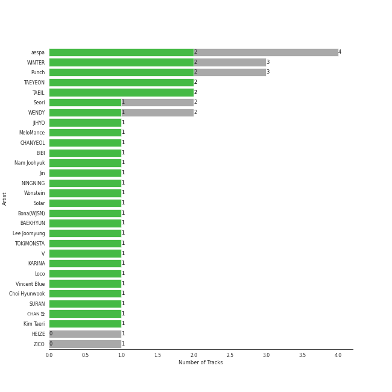
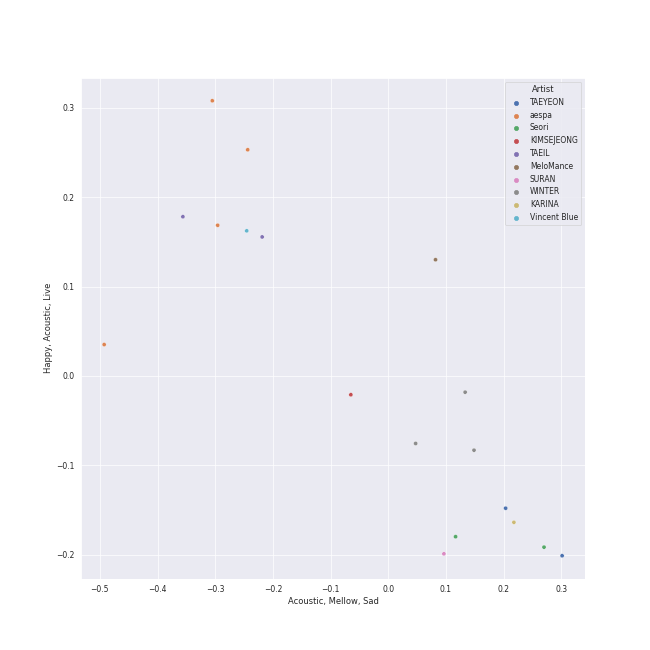
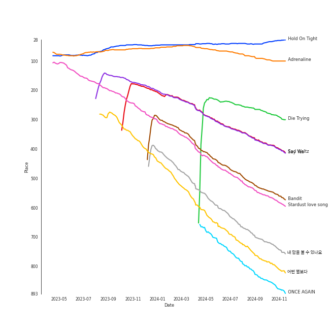
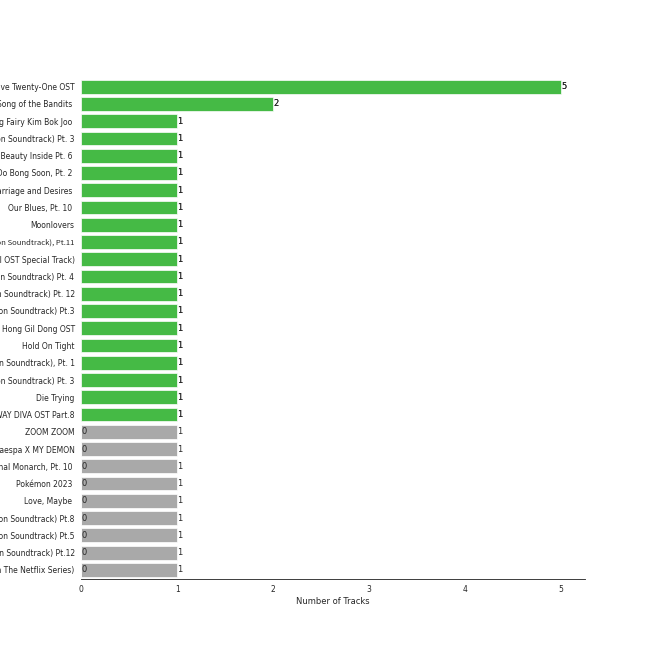
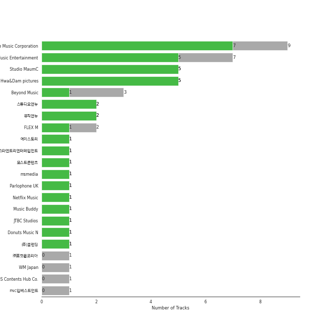
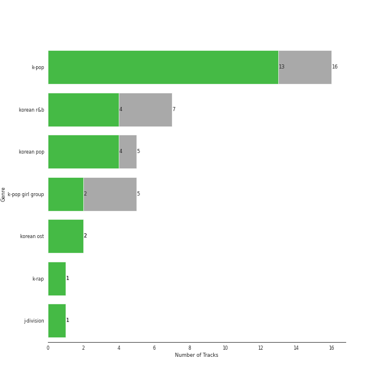
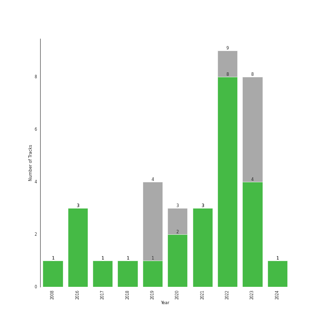

# K-OST

[34 tracks (25 liked) 🔗](https://open.spotify.com/playlist/6rOVckcfZ6oCN6seCH4GWr)

[See Track Features](audio_features.md)

[See Clusters](clusters/overview.md)

## Top Artists

| Art | Tracks | 💚 | Artist | 🔗 |
|:---|---:|---:|:---|:---|
|  | 4 | 2 | [aespa](../../artists/aespa/overview.md) | [🔗](https://open.spotify.com/artist/6YVMFz59CuY7ngCxTxjpxE) |
|  | 3 | 2 | [WINTER](../../artists/winter/overview.md) | [🔗](https://open.spotify.com/artist/3mPquBmMu97Iq9TpzQ6ayI) |
|  | 3 | 2 | Punch | [🔗](https://open.spotify.com/artist/2FgZrgTMX6Sk0VNcOsEPmm) |
|  | 2 | 2 | [TAEYEON](../../artists/taeyeon/overview.md) | [🔗](https://open.spotify.com/artist/3qNVuliS40BLgXGxhdBdqu) |
|  | 2 | 2 | TAEIL | [🔗](https://open.spotify.com/artist/1z0Hi3myYw4x32xCq0H3aq) |
|  | 2 | 1 | Seori | [🔗](https://open.spotify.com/artist/2bWTIIQP9zaVc55RaMGu7e) |
|  | 2 | 1 | [WENDY](../../artists/wendy/overview.md) | [🔗](https://open.spotify.com/artist/0FRUZvZNPzM3YJMABJxf2K) |
|  | 1 | 1 | JIHYO | [🔗](https://open.spotify.com/artist/7F1iAHRYxR3MY7yAEuFqgL) |
|  | 1 | 1 | MeloMance | [🔗](https://open.spotify.com/artist/6k4r73Wq8nhkCDoUsECL1e) |
|  | 1 | 1 | CHANYEOL | [🔗](https://open.spotify.com/artist/6jV25rzTKQ2zMgrqHha1V5) |

See all 32 artists

| Art | Tracks | 💚 | Artist | 🔗 |
|:---|---:|---:|:---|:---|
|  | 1 | 1 | [BIBI](../../artists/bibi/overview.md) | [🔗](https://open.spotify.com/artist/6UbmqUEgjLA6jAcXwbM1Z9) |
| | 1 | 1 | Nam Joohyuk | [🔗](https://open.spotify.com/artist/69ybhMoBUPmIcH4MyDARDv) |
|  | 1 | 1 | JIN | [🔗](https://open.spotify.com/artist/5vV3bFXnN6D6N3Nj4xRvaV) |
|  | 1 | 1 | NINGNING | [🔗](https://open.spotify.com/artist/5t1uryofgueHrjrryqX8vM) |
|  | 1 | 1 | Wonstein | [🔗](https://open.spotify.com/artist/5o615XColiSVMPDWlslKSk) |
|  | 1 | 1 | [Solar](../../artists/solar/overview.md) | [🔗](https://open.spotify.com/artist/5cYcI546S8Lf97m4mNdYLD) |
| | 1 | 1 | Bona(WJSN) | [🔗](https://open.spotify.com/artist/5EHm62VI2botfXyNvboLlL) |
|  | 1 | 1 | [BAEKHYUN](../../artists/baekhyun/overview.md) | [🔗](https://open.spotify.com/artist/4ufh0WuMZh6y4Dmdnklvdl) |
| | 1 | 1 | Lee Joomyung | [🔗](https://open.spotify.com/artist/4dN1DsKUXV6xugiarFBAa6) |
|  | 1 | 1 | TOKiMONSTA | [🔗](https://open.spotify.com/artist/3VwKSHAfgzV1DOHV0aANCI) |
|  | 1 | 1 | V | [🔗](https://open.spotify.com/artist/3JsHnjpbhX4SnySpvpa9DK) |
|  | 1 | 1 | KARINA | [🔗](https://open.spotify.com/artist/2qwDjeSYANOOBFU8jwtBXx) |
|  | 1 | 1 | Loco | [🔗](https://open.spotify.com/artist/2e4G04F77jxVuDYo44TCSm) |
|  | 1 | 1 | Vincent Blue | [🔗](https://open.spotify.com/artist/2AZgVjkPB4a4ULepFyPPgZ) |
| | 1 | 1 | Choi Hyunwook | [🔗](https://open.spotify.com/artist/1z2J8XtoQxczs0U1lMWEiZ) |
|  | 1 | 1 | SURAN | [🔗](https://open.spotify.com/artist/1mORehSVEd7lcaT2d7Sl2K) |
| | 1 | 1 | CHAN 찬 | [🔗](https://open.spotify.com/artist/0nxWeW71DDYHY26V4LzMz9) |
| | 1 | 1 | Kim Taeri | [🔗](https://open.spotify.com/artist/0bBDQ4QeizwResorw0iD7X) |
|  | 1 | 0 | [HEIZE](../../artists/heize/overview.md) | [🔗](https://open.spotify.com/artist/5dCvSnVduaFleCnyy98JMo) |
|  | 1 | 0 | ZICO | [🔗](https://open.spotify.com/artist/4XpUIb8uuNlIWVKmgKZXC0) |
|  | 1 | 0 | [Red Velvet](../../artists/red_velvet/overview.md) | [🔗](https://open.spotify.com/artist/1z4g3DjTBBZKhvAroFlhOM) |
|  | 1 | 0 | KIMSEJEONG | [🔗](https://open.spotify.com/artist/1lFLniFTaPjYCtQZvDXpqu) |

## Top Tracks

Most and least listened tracks

| ​ | Most listened tracks | Rank | ​​ | Least listened tracks | Rank |
|:---|:---|---:|:---|:---|---:|
|  | [Hold On Tight](../../artists/aespa/overview.md) | 36 |  | Your Existence | 2599 |
|  | [Adrenaline](../../artists/solar/overview.md) | 105 |  | Show Your Heart 너를 보여줘 | 2599 |
|  | [어떤 별보다](../../artists/red_velvet/overview.md) | 155 |  | Starlight | 2599 |
|  | [Die Trying](../../artists/aespa/overview.md) | 182 |  | With | 2599 |
|  | [내 맘을 볼 수 있나요](../../artists/heize/overview.md) | 447 |  | From now on | 2599 |
|  | Stardust love song | 568 |  | Love, Maybe (Acoustic Ver.) | 2599 |
|  | [U](../../artists/baekhyun/overview.md) | 608 |  | Heartbeat | 2599 |
|  | [ONCE AGAIN](../../artists/winter/overview.md) | 644 |  | Sweet Night | 2599 |
|  | Say Yes | 721 |  | Love, Maybe | 2599 |
|  | Wicked | 750 |  | Stay With Me | 2599 |

## Top Albums

| Art | Tracks | 💚 | Album | Release Date | 🔗 |
|:---|---:|---:|:---|:---|:---|
|  | 5 | 5 | Twenty-Five Twenty-One OST | 2022-04-03 | [🔗](https://open.spotify.com/album/77NPr874WU941XZhjO43dR) |
|  | 2 | 2 | Song of the Bandits (Original Soundtrack from the Netflix Series) | 2023-09-22 | [🔗](https://open.spotify.com/album/1TXOVlZGrd3KbphTcXN8vw) |
|  | 1 | 1 | Weightlifting Fairy Kim Bok Joo (Original Television Soundtrack, Pt. 2) | 2016-11-23 | [🔗](https://open.spotify.com/album/1T8J131uP2pI7VuxSF2zp3) |
|  | 1 | 1 | VINCENZO (Original Television Soundtrack) Pt. 3 | 2021-03-14 | [🔗](https://open.spotify.com/album/47ulDGfVUWUcUSWRQCzxr3) |
|  | 1 | 1 | The Beauty Inside Pt. 6 (Original Television Soundtrack) | 2018-11-06 | [🔗](https://open.spotify.com/album/6w3jg4xGMI5LLr5DEL3zWY) |
|  | 1 | 1 | Strong Woman Do Bong Soon, Pt. 2 (Original Television Soundtrack) | 2017-03-04 | [🔗](https://open.spotify.com/album/21jYCYSrxo7IEO67xH6XeN) |
|  | 1 | 1 | Remarriage and Desires (Original Soundtrack from The Netflix Series) | 2022-07-15 | [🔗](https://open.spotify.com/album/2YM9Oahck5kVuWGiFQK1dg) |
|  | 1 | 1 | Our Blues, Pt. 10 (Original Television Soundtrack) | 2022-05-22 | [🔗](https://open.spotify.com/album/0mP330aRyX4P4ZjarRKnXO) |
|  | 1 | 1 | Moonlovers - Scarlet Heart Ryeo (Original Television Soundtrack), Pt. 2 | 2016-08-29 | [🔗](https://open.spotify.com/album/68xTLBWjoRADRf86WYmTmy) |
|  | 1 | 1 | Meow the secret boy 어서와 (Original Television Soundtrack), Pt.11 | 2020-04-23 | [🔗](https://open.spotify.com/album/0ZqZDky3PSbzKgHJzvSRuJ) |

See all 29 albums

| Art | Tracks | 💚 | Album | Release Date | 🔗 |
|:---|---:|---:|:---|:---|:---|
|  | 1 | 1 | Love, Maybe (A Business Proposal OST Special Track) | 2022-02-18 | [🔗](https://open.spotify.com/album/5lKdnY9bGYUyfaJhcRnHgk) |
|  | 1 | 1 | Jirisan (Original Television Soundtrack) Pt. 4 | 2021-11-07 | [🔗](https://open.spotify.com/album/2FUiBNFWz47sBPEf3Dcma4) |
|  | 1 | 1 | ITAEWON CLASS (Original Television Soundtrack) Pt. 12 | 2020-03-13 | [🔗](https://open.spotify.com/album/1q3j12Y1sp2eqqffSnyA93) |
|  | 1 | 1 | Hotel del Luna (Original Television Soundtrack) Pt.3 | 2019-07-21 | [🔗](https://open.spotify.com/album/6nddI94g7zC5bbyNzRBO0Y) |
|  | 1 | 1 | Hong Gil Dong OST | 2008-01-23 | [🔗](https://open.spotify.com/album/5Efud8Wmo7vBQjSJI1WcJ7) |
|  | 1 | 1 | Hold On Tight | 2023-03-30 | [🔗](https://open.spotify.com/album/4bWGRs1SqNwFXaRDXRAANN) |
|  | 1 | 1 | Guardian (Original Television Soundtrack), Pt. 1 | 2016-12-03 | [🔗](https://open.spotify.com/album/6Pr1DaOWfT6hEewhZMRyqg) |
|  | 1 | 1 | Doom at Your Service (Original Television Soundtrack) Pt. 3 | 2021-05-31 | [🔗](https://open.spotify.com/album/2fy01jwC0GrnBGQ4Crcnve) |
|  | 1 | 1 | Die Trying | 2024-04-04 | [🔗](https://open.spotify.com/album/2Ov7bn3HyDgvAxtYPLosUR) |
|  | 1 | 1 | CASTAWAY DIVA OST Part.8 | 2023-11-19 | [🔗](https://open.spotify.com/album/5nV389t1fA2IIlIxflp4EK) |
|  | 1 | 0 | ZOOM ZOOM | 2023-10-06 | [🔗](https://open.spotify.com/album/1A6g2ZDdb7ggiiTXUbEuMP) |
|  | 1 | 0 | WINTER of aespa X MY DEMON | 2023-12-08 | [🔗](https://open.spotify.com/album/7EXrNMKKkkE3hRBpeZcT6y) |
|  | 1 | 0 | The King : Eternal Monarch, Pt. 10 (Original Television Soundtrack) | 2020-05-16 | [🔗](https://open.spotify.com/album/02zl7wdcgbI0URRfMbzmF5) |
|  | 1 | 0 | Pokémon 2023 (Original TV Series Soundtrack, Korea) | 2023-08-23 | [🔗](https://open.spotify.com/album/2rTc5TdRP7hr7gE4h4lUR1) |
|  | 1 | 0 | Love, Maybe (A Business Proposal OST Bonus Track) | 2022-04-05 | [🔗](https://open.spotify.com/album/7I3EMy3n72e6ABSq4Ubhoz) |
|  | 1 | 0 | Hotel del Luna (Original Television Soundtrack) Pt.8 | 2019-08-10 | [🔗](https://open.spotify.com/album/2orJu019JvK7H621GwcIhr) |
|  | 1 | 0 | Hotel del Luna (Original Television Soundtrack) Pt.5 | 2019-07-28 | [🔗](https://open.spotify.com/album/2PdRNAz6mDmy9OR7hDCrH5) |
|  | 1 | 0 | Hotel del Luna (Original Television Soundtrack) Pt.12 | 2019-08-18 | [🔗](https://open.spotify.com/album/6iNbnT79OJu9C5j5ZZLQvZ) |
|  | 1 | 0 | Doona! (Music from The Netflix Series) | 2023-10-20 | [🔗](https://open.spotify.com/album/351LvQJsNt4fvYdnvhzF9D) |

## Top Record Labels

| Tracks | 💚 | Label |
|---:|---:|:---|
| 9 | 7 | [Genie Music Corporation](../../labels/genie_music_corporation/overview.md) |
| 7 | 5 | [Stone Music Entertainment](../../labels/stone_music_entertainment/overview.md) |
| 5 | 5 | Studio MaumC |
| 5 | 5 | Hwa&Dam pictures |
| 2 | 2 | 스튜디오앤뉴 |
| 2 | 2 | 뮤직앤뉴 |
| 3 | 1 | Beyond Music |
| 2 | 1 | FLEX M |
| 1 | 1 | 에이스토리 |
| 1 | 1 | 스타엔트리엔터테인먼트 |

See all 22 labels

| Tracks | 💚 | Label |
|---:|---:|:---|
| 1 | 1 | 모스트콘텐츠 |
| 1 | 1 | msmedia |
| 1 | 1 | [Parlophone UK](../../labels/parlophone_uk/overview.md) |
| 1 | 1 | Netflix Music |
| 1 | 1 | Music Buddy |
| 1 | 1 | JTBC Studios |
| 1 | 1 | Donuts Music N |
| 1 | 1 | (주)블렌딩 |
| 1 | 0 | ㈜포켓몬코리아 |
| 1 | 0 | [WM Japan](../../labels/wm_japan/overview.md) |
| 1 | 0 | SBS Contents Hub Co. |
| 1 | 0 | FNC인베스트먼트 |

## Genres

| Tracks | 💚 | Genre |
|---:|---:|:---|
| 16 | 13 | [k-pop](../../genres/k-pop/overview.md) |
| 7 | 4 | [korean r&b](../../genres/korean_r_b/overview.md) |
| 5 | 4 | [korean pop](../../genres/korean_pop/overview.md) |
| 5 | 2 | [k-pop girl group](../../genres/k-pop_girl_group/overview.md) |
| 2 | 2 | korean ost |
| 1 | 1 | [k-rap](../../genres/k-rap/overview.md) |
| 1 | 1 | j-division |

## Years

| ​ | 10 newest albums | ​​ | 10 oldest albums |
|:---|:---|:---|:---|
|  | Die Trying (2024-04-04) |  | Hong Gil Dong OST (2008-01-23) |
|  | WINTER of aespa X MY DEMON (2023-12-08) |  | Moonlovers - Scarlet Heart Ryeo (Original Television Soundtrack), Pt. 2 (2016-08-29) |
|  | CASTAWAY DIVA OST Part.8 (2023-11-19) |  | Weightlifting Fairy Kim Bok Joo (Original Television Soundtrack, Pt. 2) (2016-11-23) |
|  | Doona! (Music from The Netflix Series) (2023-10-20) |  | Guardian (Original Television Soundtrack), Pt. 1 (2016-12-03) |
|  | ZOOM ZOOM (2023-10-06) |  | Strong Woman Do Bong Soon, Pt. 2 (Original Television Soundtrack) (2017-03-04) |
|  | Song of the Bandits (Original Soundtrack from the Netflix Series) (2023-09-22) |  | The Beauty Inside Pt. 6 (Original Television Soundtrack) (2018-11-06) |
|  | Pokémon 2023 (Original TV Series Soundtrack, Korea) (2023-08-23) |  | Hotel del Luna (Original Television Soundtrack) Pt.3 (2019-07-21) |
|  | Hold On Tight (2023-03-30) |  | Hotel del Luna (Original Television Soundtrack) Pt.5 (2019-07-28) |
|  | Remarriage and Desires (Original Soundtrack from The Netflix Series) (2022-07-15) |  | Hotel del Luna (Original Television Soundtrack) Pt.8 (2019-08-10) |
|  | Our Blues, Pt. 10 (Original Television Soundtrack) (2022-05-22) |  | Hotel del Luna (Original Television Soundtrack) Pt.12 (2019-08-18) |