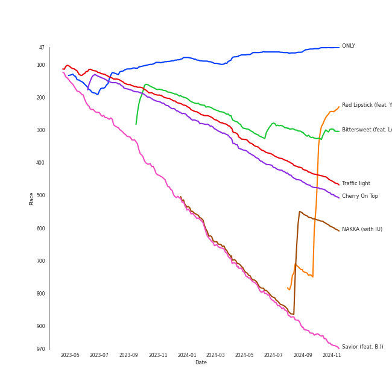

# Tracks in K-Pop-Adjacent from 2021

## Artists

| Art | Rank | Tracks | 💚 | Artist | 🔗 |
|:---|---:|---:|---:|:---|:---|
|  | 11 | 7 | 7 | [LeeHi](../../../artists/leehi/overview.md) | [🔗](https://open.spotify.com/artist/7cVZApDoQZpS447nHTsNqu) |
|  | 431 | 3 | 2 | WOODZ | [🔗](https://open.spotify.com/artist/6y9nlaoynxSvoTGY09Vdcy) |
|  | 249 | 3 | 1 | Lee Mujin | [🔗](https://open.spotify.com/artist/4Xj0peBt3EZHbdF20JmdWC) |
|  | 38 | 2 | 1 | [HEIZE](../../../artists/heize/overview.md) | [🔗](https://open.spotify.com/artist/5dCvSnVduaFleCnyy98JMo) |
|  | 431 | 2 | 1 | The Volunteers | [🔗](https://open.spotify.com/artist/2jLHrOkh1M5rLJgnrgfQf1) |
|  | 71 | 1 | 1 | [AKMU](../../../artists/akmu/overview.md) | [🔗](https://open.spotify.com/artist/6OwKE9Ez6ALxpTaKcT5ayv) |
|  | 431 | 1 | 1 | Wonstein | [🔗](https://open.spotify.com/artist/5o615XColiSVMPDWlslKSk) |
|  | 193 | 1 | 1 | MINGYU | [🔗](https://open.spotify.com/artist/5gUpo0BRmo6EOTbyU3z5Ay) |
|  | 431 | 1 | 1 | YUKIKA | [🔗](https://open.spotify.com/artist/4RfI1z9u2xIc5Qnqac4JbO) |
|  | 196 | 1 | 1 | WONWOO | [🔗](https://open.spotify.com/artist/3rHcBT06Vb1XGVUWhDALZt) |

View all

| Art | Rank | Tracks | 💚 | Artist | 🔗 |
|:---|---:|---:|---:|:---|:---|
|  | 3 | 1 | 1 | [IU](../../../artists/iu/overview.md) | [🔗](https://open.spotify.com/artist/3HqSLMAZ3g3d5poNaI7GOU) |
|  | 118 | 1 | 1 | YOUHA | [🔗](https://open.spotify.com/artist/2lZFlNiQMLa2fuX3pkXcan) |
|  | 417 | 1 | 1 | Seori | [🔗](https://open.spotify.com/artist/2bWTIIQP9zaVc55RaMGu7e) |
|  | 197 | 1 | 1 | Stella Jang | [🔗](https://open.spotify.com/artist/2Y9AUayH5pyZpVfkDYDfJV) |
|  | 431 | 1 | 1 | D.O. | [🔗](https://open.spotify.com/artist/2CQZr2RPZmrcvDnaod1ldC) |
|  | 173 | 1 | 1 | Moon Byul | [🔗](https://open.spotify.com/artist/1eTft3tXynrKdo6XD7QHLL) |
|  | 151 | 1 | 1 | YOON MIRAE | [🔗](https://open.spotify.com/artist/1Do4bSzfUl0KWL9r1fITu0) |
|  | 414 | 1 | 1 | B.I | [🔗](https://open.spotify.com/artist/0UntV1Bw2hk3fbRrm9eMP6) |
|  | 431 | 1 | 0 | GSoul | [🔗](https://open.spotify.com/artist/4oEXworvhegyK83rZwVyWL) |

## Albums

| Art | Rank | Tracks | 💚 | Album | Release Date | 🔗 |
|:---|---:|---:|---:|:---|:---|:---|
|  | 48 | 6 | 6 | 4 ONLY | 2021-09-09 | [🔗](https://open.spotify.com/album/1DKgZeAYrjslAPZVMe6EFt) |
|  | 650 | 2 | 2 | ONLY LOVERS LEFT | 2021-10-05 | [🔗](https://open.spotify.com/album/1u9nYBB0Qw5jyjkexe9Xk6) |
|  | 650 | 2 | 1 | The Volunteers | 2021-05-27 | [🔗](https://open.spotify.com/album/0hwXFwuvVfZwn6asTargTD) |
|  | 650 | 1 | 1 | 공감 (Empathy) - The 1st Mini Album | 2021-07-26 | [🔗](https://open.spotify.com/album/4dqWy2Soq1Z1rqgKfXOATk) |
|  | 650 | 1 | 1 | timeabout, | 2021-04-07 | [🔗](https://open.spotify.com/album/1cBAfX0otvkoIOI6HtOrAc) |
|  | 650 | 1 | 1 | When Night Is Falling | 2021-07-07 | [🔗](https://open.spotify.com/album/3nOIsILeko2meMblKEGYZw) |
|  | 310 | 1 | 1 | Traffic light | 2021-05-14 | [🔗](https://open.spotify.com/album/4lHGpxL8peLQSZRgl1Lssm) |
|  | 650 | 1 | 1 | Stairs | 2021-10-15 | [🔗](https://open.spotify.com/album/0s3ME19b7uNfrBvKXBFwM7) |
|  | 650 | 1 | 1 | Shutdown (Feat. Seori) | 2021-12-30 | [🔗](https://open.spotify.com/album/3qGgRGX3KHbwph4AzWVko1) |
|  | 394 | 1 | 1 | NEXT EPISODE | 2021-07-26 | [🔗](https://open.spotify.com/album/0Pt0eGpyNO5dDN8PORypSy) |

View all

| Art | Rank | Tracks | 💚 | Album | Release Date | 🔗 |
|:---|---:|---:|---:|:---|:---|:---|
|  | 650 | 1 | 1 | HAPPEN | 2021-05-20 | [🔗](https://open.spotify.com/album/4xOOB79WcZuOoVwK06No1s) |
|  | 339 | 1 | 1 | Cherry On Top | 2021-08-10 | [🔗](https://open.spotify.com/album/7sEDri9xLbg6a27CPoD1v2) |
|  | 235 | 1 | 1 | Bittersweet (feat. LeeHi) | 2021-05-28 | [🔗](https://open.spotify.com/album/6qVk855QPCh57noNeeHMXQ) |
|  | 650 | 1 | 0 | When it snows(Feat.Heize) | 2021-12-03 | [🔗](https://open.spotify.com/album/1d2YKQ02RQA97EyrB55ZcK) |
|  | 650 | 1 | 0 | Natural | 2021-12-02 | [🔗](https://open.spotify.com/album/2yOqQbBoXX0nNPBqts1dmZ) |
|  | 650 | 1 | 0 | LULLABY | 2021-08-27 | [🔗](https://open.spotify.com/album/7knAHnDVbgtX05qgU0ZcgT) |
|  | 650 | 1 | 0 | HOSPITAL PLAYLIST Season2, Pt. 1 (Original Television Soundtrack) | 2021-06-18 | [🔗](https://open.spotify.com/album/2pJhtrlZZvxFi818EMvKAY) |

## Tracks

| Art | Track | Album | Artists | Label | Rank | 💚 | 🔗 |
|:---|:---|:---|:---|:---|---:|:---|:---|
|  | ONLY | 4 ONLY | [LeeHi](../../../artists/leehi/overview.md) | [Genie Music Corporation](../../../labels/genie_music_corporation), [Stone Music Entertainment](../../../labels/stone_music_entertainment) | 48 | 💚 | [🔗](https://open.spotify.com/track/6TBJkXHPhu3EsMk1bshwuI) |
|  | Red Lipstick (feat. Yoonmirae) | 4 ONLY | [LeeHi](../../../artists/leehi/overview.md), YOON MIRAE | [Genie Music Corporation](../../../labels/genie_music_corporation), [Stone Music Entertainment](../../../labels/stone_music_entertainment) | 289 | 💚 | [🔗](https://open.spotify.com/track/7nJc2Oxfn7xRX3eF4hltyl) |
|  | Bittersweet (feat. LeeHi) | Bittersweet (feat. LeeHi) | WONWOO, MINGYU, [LeeHi](../../../artists/leehi/overview.md) | [PLEDIS Entertainment](../../../labels/pledis_entertainment) | 328 | 💚 | [🔗](https://open.spotify.com/track/347PJwH4XqRbeaKaIW9sX3) |
|  | Traffic light | Traffic light | Lee Mujin | ShowPLAY ENTERTAINMENT | 441 | 💚 | [🔗](https://open.spotify.com/track/03qu1u4hDyepQQi2lNxCka) |
|  | Cherry On Top | Cherry On Top | YOUHA | [Universal Music Ltd.](../../../labels/universal_music_llc) | 480 | 💚 | [🔗](https://open.spotify.com/track/6S2vJU8eHt7WpZJE3SWpTa) |
|  | NAKKA (with IU) | NEXT EPISODE | [AKMU](../../../artists/akmu/overview.md), [IU](../../../artists/iu/overview.md) | [YG Entertainment](../../../labels/yg_entertainment) | 578 | 💚 | [🔗](https://open.spotify.com/track/4t2FIqZJORKZGSKg30SShr) |
|  | Savior (feat. B.I) | 4 ONLY | [LeeHi](../../../artists/leehi/overview.md), B.I | [Genie Music Corporation](../../../labels/genie_music_corporation), [Stone Music Entertainment](../../../labels/stone_music_entertainment) | 939 | 💚 | [🔗](https://open.spotify.com/track/0DYvTdqBqW6erA1a7pFzVo) |
|  | Insomnia | timeabout, | YUKIKA | UBUNTU ENT | 984 | 💚 | [🔗](https://open.spotify.com/track/0AAEFC3RGirgzRFhi44Y79) |
|  | HAPPEN | HAPPEN | [HEIZE](../../../artists/heize/overview.md) | [Genie Music Corporation](../../../labels/genie_music_corporation), [Stone Music Entertainment](../../../labels/stone_music_entertainment) | 984 | 💚 | [🔗](https://open.spotify.com/track/1MtCOuTy3B6fU72LQPvg16) |
|  | Radio | The Volunteers | The Volunteers | Blue Vinyl | 984 | 💚 | [🔗](https://open.spotify.com/track/3cLwHcFj7IFH6RfvErMwom) |

View all

| Art | Track | Album | Artists | Label | Rank | 💚 | 🔗 |
|:---|:---|:---|:---|:---|---:|:---|:---|
|  | Summer | The Volunteers | The Volunteers | Blue Vinyl | 984 | | [🔗](https://open.spotify.com/track/3aeZV1y0ck9CMIUIdeOjBj) |
|  | Rain and You | HOSPITAL PLAYLIST Season2, Pt. 1 (Original Television Soundtrack) | Lee Mujin | [Genie Music Corporation](../../../labels/genie_music_corporation), [Stone Music Entertainment](../../../labels/stone_music_entertainment) | 984 | | [🔗](https://open.spotify.com/track/4ribiWWnI451QMRdOgByIP) |
|  | When Night Is Falling | When Night Is Falling | Wonstein | [Genie Music Corporation](../../../labels/genie_music_corporation), [Stone Music Entertainment](../../../labels/stone_music_entertainment) | 984 | 💚 | [🔗](https://open.spotify.com/track/3skyeuj2qNbbIuAP3Gv2dz) |
|  | Rose | 공감 (Empathy) - The 1st Mini Album | D.O. | [SM Entertainment](../../../labels/sm_entertainment) | 984 | 💚 | [🔗](https://open.spotify.com/track/2bk43y1inDfHx8fFdXar3l) |
|  | LULLABY | LULLABY | WOODZ | [Genie Music Corporation](../../../labels/genie_music_corporation), [Stone Music Entertainment](../../../labels/stone_music_entertainment) | 984 | | [🔗](https://open.spotify.com/track/4XqyWlYiTFZ627CuUzMOJP) |
|  | Bye | 4 ONLY | [LeeHi](../../../artists/leehi/overview.md) | [Genie Music Corporation](../../../labels/genie_music_corporation), [Stone Music Entertainment](../../../labels/stone_music_entertainment) | 984 | 💚 | [🔗](https://open.spotify.com/track/6ye2BBTpOipvPNjSPxgmRC) |
|  | Intentions | 4 ONLY | [LeeHi](../../../artists/leehi/overview.md) | [Genie Music Corporation](../../../labels/genie_music_corporation), [Stone Music Entertainment](../../../labels/stone_music_entertainment) | 984 | 💚 | [🔗](https://open.spotify.com/track/7IN84szmayzO68enmVmKYv) |
|  | Waterride | 4 ONLY | [LeeHi](../../../artists/leehi/overview.md) | [Genie Music Corporation](../../../labels/genie_music_corporation), [Stone Music Entertainment](../../../labels/stone_music_entertainment) | 984 | 💚 | [🔗](https://open.spotify.com/track/7JXNH2xnA23vsGasejVfWr) |
|  | Sour candy | ONLY LOVERS LEFT | WOODZ | [Genie Music Corporation](../../../labels/genie_music_corporation), [Stone Music Entertainment](../../../labels/stone_music_entertainment) | 984 | 💚 | [🔗](https://open.spotify.com/track/2NM9WpMqPcIHPsV4EEyJJW) |
|  | WAITING | ONLY LOVERS LEFT | WOODZ | [Genie Music Corporation](../../../labels/genie_music_corporation), [Stone Music Entertainment](../../../labels/stone_music_entertainment) | 984 | 💚 | [🔗](https://open.spotify.com/track/4TMVuENexY9u0083CqMphE) |
|  | L’Amour, Les Baguettes, Paris | Stairs | Stella Jang | GLG | 984 | 💚 | [🔗](https://open.spotify.com/track/2g6FVCA4sQZOv9LXIABsgr) |
|  | Natural | Natural | GSoul | [WM Korea](../../../labels/wm_korea) | 984 | | [🔗](https://open.spotify.com/track/0ACt3PP22HyKfpFIV6AQUW) |
|  | When it snows(Feat.Heize) | When it snows(Feat.Heize) | Lee Mujin, [HEIZE](../../../artists/heize/overview.md) | ShowPLAY ENTERTAINMENT | 984 | | [🔗](https://open.spotify.com/track/2vA5M8uXee4amGQajyUMFR) |
|  | Shutdown (Feat.Seori) | Shutdown (Feat. Seori) | Moon Byul, Seori | [RBW Inc.](../../../labels/rbw_inc_) | 984 | 💚 | [🔗](https://open.spotify.com/track/69790X4RDQIKwcxltIMHvU) |

