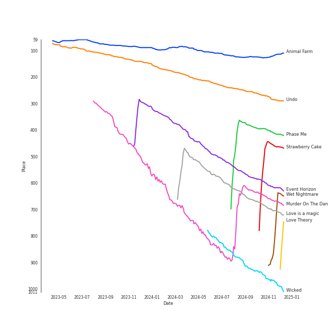

# Tracks in K-Pop-Adjacent from 2022

## Artists

| Art | Rank | Tracks | 💚 | Artist | 🔗 |
|:---|---:|---:|---:|:---|:---|
|  | 70 | 3 | 3 | [BIBI](../../../artists/bibi/overview.md) | [🔗](https://open.spotify.com/artist/6UbmqUEgjLA6jAcXwbM1Z9) |
|  | 206 | 3 | 2 | keshi | [🔗](https://open.spotify.com/artist/3pc0bOVB5whxmD50W79wwO) |
|  | 328 | 2 | 2 | Wonstein | [🔗](https://open.spotify.com/artist/5o615XColiSVMPDWlslKSk) |
|  | 151 | 2 | 2 | MRCH | [🔗](https://open.spotify.com/artist/4S0q5n7ZzNzeiW0dAUnYHl) |
|  | 433 | 2 | 2 | Seori | [🔗](https://open.spotify.com/artist/2bWTIIQP9zaVc55RaMGu7e) |
|  | 154 | 1 | 1 | TAEYONG | [🔗](https://open.spotify.com/artist/6SKusTjOAPsTZ6kareKQdm) |
|  | 167 | 1 | 1 | Younha | [🔗](https://open.spotify.com/artist/6GwM5CHqhWXzG3l5kzRSAS) |
|  | 448 | 1 | 1 | [The Rose](../../../artists/the_rose/overview.md) | [🔗](https://open.spotify.com/artist/5na1LmEmK2VzNLje9snJYW) |
|  | 38 | 1 | 1 | [Heize](../../../artists/heize/overview.md) | [🔗](https://open.spotify.com/artist/5dCvSnVduaFleCnyy98JMo) |
|  | 228 | 1 | 1 | WOOSUNG | [🔗](https://open.spotify.com/artist/5LHu1iF8m0XtRBEJbbwSoo) |

View all

| Art | Rank | Tracks | 💚 | Artist | 🔗 |
|:---|---:|---:|---:|:---|:---|
|  | 204 | 1 | 1 | Jay Park | [🔗](https://open.spotify.com/artist/4XDi67ZENZcbfKnvMnTYsI) |
|  | 84 | 1 | 1 | AILEE | [🔗](https://open.spotify.com/artist/3uGFTJ7JMllvhgGpumieHF) |
|  | 448 | 1 | 1 | Colde | [🔗](https://open.spotify.com/artist/3VQDqjQ4wJyw8PzpGdlZpB) |
|  | 3 | 1 | 1 | [IU](../../../artists/iu/overview.md) | [🔗](https://open.spotify.com/artist/3HqSLMAZ3g3d5poNaI7GOU) |
|  | 220 | 1 | 1 | pH-1 | [🔗](https://open.spotify.com/artist/2u7CP5T30c8ctenzXgEV1W) |
|  | 291 | 1 | 1 | SAAY | [🔗](https://open.spotify.com/artist/2pvCf5g7XBReiPIvcq7W18) |
|  | 252 | 1 | 1 | Xdinary Heroes | [🔗](https://open.spotify.com/artist/1khChLj7REGqjM043PlYyn) |
|  | 448 | 1 | 1 | MAX | [🔗](https://open.spotify.com/artist/1bqxdqvUtPWZri43cKHac8) |
|  | 67 | 1 | 1 | Lee Young Ji | [🔗](https://open.spotify.com/artist/0Y2AcMPMpeuPXtPQGVvRBq) |
|  | 128 | 2 | 0 | YOUHA | [🔗](https://open.spotify.com/artist/2lZFlNiQMLa2fuX3pkXcan) |
|  | 54 | 1 | 0 | [HWASA](../../../artists/hwasa/overview.md) | [🔗](https://open.spotify.com/artist/7bmYpVgQub656uNTu6qGNQ) |
|  | 448 | 1 | 0 | Onestar | [🔗](https://open.spotify.com/artist/6EmgTIhhXGtfAmYYTfdtlz) |
|  | 255 | 1 | 0 | Lee Mujin | [🔗](https://open.spotify.com/artist/4Xj0peBt3EZHbdF20JmdWC) |
|  | 448 | 1 | 0 | dori | [🔗](https://open.spotify.com/artist/4Db1gte7TUAeZyRdo4FLE7) |
|  | 229 | 1 | 0 | Loco | [🔗](https://open.spotify.com/artist/2e4G04F77jxVuDYo44TCSm) |

## Albums

| Art | Rank | Tracks | 💚 | Album | Release Date | 🔗 |
|:---|---:|---:|---:|:---|:---|:---|
|  | 94 | 3 | 3 | Lowlife Princess: Noir | 2022-11-17 | [🔗](https://open.spotify.com/album/2ZYIby6irhfnCE3uQDBCi0) |
|  | 491 | 2 | 2 | LOVE & FEAR | 2022-12-12 | [🔗](https://open.spotify.com/album/2zsnrnJPMZY56QgIdc647c) |
|  | 694 | 2 | 1 | GABRIEL | 2022-03-25 | [🔗](https://open.spotify.com/album/1WVIJaAboRSwJOe4u0n0Q7) |
|  | 694 | 2 | 0 | love you more, | 2022-08-25 | [🔗](https://open.spotify.com/album/3g2OiEeQKfggUe6ViYeLSC) |
|  | 435 | 1 | 1 | YOUNHA 6th Album Repackage 'END THEORY : Final Edition' | 2022-03-30 | [🔗](https://open.spotify.com/album/63mur6I6yCG9cOxOst3i7c) |
|  | 207 | 1 | 1 | Undo | 2022-06-30 | [🔗](https://open.spotify.com/album/2xR7YEyRweqClzs50bbW3J) |
|  | 416 | 1 | 1 | Twenty-Five Twenty-One OST | 2022-04-03 | [🔗](https://open.spotify.com/album/77NPr874WU941XZhjO43dR) |
|  | 694 | 1 | 1 | SHOW ME THE MONEY 11 Episode 3 | 2022-12-17 | [🔗](https://open.spotify.com/album/5LsGOvNXMG46qugdghRGRF) |
|  | 694 | 1 | 1 | S:INEMA | 2022-10-27 | [🔗](https://open.spotify.com/album/5eOTrxzkXgD6uMDP5kWW0j) |
|  | 668 | 1 | 1 | Remarriage and Desires (Original Soundtrack from The Netflix Series) | 2022-07-15 | [🔗](https://open.spotify.com/album/2YM9Oahck5kVuWGiFQK1dg) |

View all

| Art | Rank | Tracks | 💚 | Album | Release Date | 🔗 |
|:---|---:|---:|---:|:---|:---|:---|
|  | 302 | 1 | 1 | MOTH | 2022-05-13 | [🔗](https://open.spotify.com/album/7JdpeV87hczflCV8GXF3yV) |
|  | 439 | 1 | 1 | Love Theory - SM STATION | 2022-04-14 | [🔗](https://open.spotify.com/album/2i27IzG4jFQjX7pS5L6TIu) |
|  | 694 | 1 | 1 | IT'S YOU (feat. keshi) | 2022-09-09 | [🔗](https://open.spotify.com/album/1LtaBRxkVaAnoTSQQsWjJF) |
|  | 465 | 1 | 1 | I'M LOVIN' AMY | 2022-03-07 | [🔗](https://open.spotify.com/album/1N3ZneaWp9SVREC9JSgsia) |
|  | 333 | 1 | 1 | Hello, world! | 2022-07-20 | [🔗](https://open.spotify.com/album/5zjnlpEemkmaN6iv16vmDm) |
|  | 694 | 1 | 1 | HEAL | 2022-10-07 | [🔗](https://open.spotify.com/album/2n44vkxj8L01ma7nHfXNJW) |
|  | 694 | 1 | 1 | GANADARA | 2022-03-11 | [🔗](https://open.spotify.com/album/4cwyl5ynvYVojZRbZ3dSFH) |
|  | 694 | 1 | 1 | Can't Stop This Party | 2022-03-22 | [🔗](https://open.spotify.com/album/6nG0PLR5YgP7tHYKfwhiOI) |
|  | 694 | 1 | 0 | Sweet (A Business Proposal OST Part.1) | 2022-02-28 | [🔗](https://open.spotify.com/album/2bB29MkoBHc7vm2fr2EdiZ) |
|  | 694 | 1 | 0 | Somebody | 2022-07-25 | [🔗](https://open.spotify.com/album/40XK96MKBOb5BjAU8QAIfN) |
|  | 694 | 1 | 0 | Get Ready To Leave | 2022-10-18 | [🔗](https://open.spotify.com/album/0UY2l5txL7IjXCB9LnBZ6R) |
|  | 694 | 1 | 0 | 2 O' CLOCK | 2022-02-01 | [🔗](https://open.spotify.com/album/2VAiqG6FNssKi5vOda6kil) |

## Tracks

| Art | Track | Album | Artists | Label | Rank | 💚 | 🔗 |
|:---|:---|:---|:---|:---|---:|:---|:---|
|  | Animal Farm | Lowlife Princess: Noir | [BIBI](../../../artists/bibi/overview.md) | [Feel Ghood Music/88risingMusic](../../../labels/88rising_music) | 110 | 💚 | [🔗](https://open.spotify.com/track/2JsO5Qfw4liRPjj26HXR13) |
|  | Undo | Undo | [Heize](../../../artists/heize/overview.md) | [Genie Music Corporation](../../../labels/genie_music_corporation), [Stone Music Entertainment](../../../labels/stone_music_entertainment) | 290 | 💚 | [🔗](https://open.spotify.com/track/6z1pJ3KUmQagUpMVqL62sa) |
|  | Phase Me | MOTH | WOOSUNG | Transparent Arts | 425 | 💚 | [🔗](https://open.spotify.com/track/62DCFw57LAAX4CTrzmUCny) |
|  | Strawberry Cake | Hello, world! | Xdinary Heroes | [Republic Records](../../../labels/republic_records) | 470 | 💚 | [🔗](https://open.spotify.com/track/4Bl1Hlu6CHjYocr6TqyW5d) |
|  | Event Horizon | YOUNHA 6th Album Repackage 'END THEORY : Final Edition' | Younha | C9 Entertainment | 638 | 💚 | [🔗](https://open.spotify.com/track/6RBziRcDeiho3iTPdtEeg9) |
|  | Love Theory | Love Theory - SM STATION | TAEYONG, Wonstein | [SM Entertainment](../../../labels/sm_entertainment) | 645 | 💚 | [🔗](https://open.spotify.com/track/1dmi9lVthTKjuemmO8ucWm) |
|  | Murder On The Dance Floor | I'M LOVIN' AMY | AILEE | 더라이브레이블 | 696 | 💚 | [🔗](https://open.spotify.com/track/6nuAMaTLREca7BWlXlm52s) |
|  | Love is a magic | LOVE & FEAR | MRCH | MRCH MUSIC | 734 | 💚 | [🔗](https://open.spotify.com/track/08ANRBOA33Hfn4shVjNBwi) |
|  | Wicked | Remarriage and Desires (Original Soundtrack from The Netflix Series) | Seori | [Genie Music Corporation](../../../labels/genie_music_corporation), [Stone Music Entertainment](../../../labels/stone_music_entertainment) | 1028 | 💚 | [🔗](https://open.spotify.com/track/3B4u3uZGm7PCfhc18oTi1J) |
|  | 2 O' CLOCK | 2 O' CLOCK | dori | dori | 1071 | | [🔗](https://open.spotify.com/track/36PxJOUB8qFTcDFp2M0h6K) |

View all

| Art | Track | Album | Artists | Label | Rank | 💚 | 🔗 |
|:---|:---|:---|:---|:---|---:|:---|:---|
|  | Sweet | Sweet (A Business Proposal OST Part.1) | Lee Mujin | FLEX M | 1071 | | [🔗](https://open.spotify.com/track/5JpftUHeUzx3zWE6rZtki5) |
|  | GANADARA (Feat. IU) | GANADARA | Jay Park, [IU](../../../artists/iu/overview.md) | MORE VISION | 1071 | 💚 | [🔗](https://open.spotify.com/track/5quFr5s5PXYfUX5jV2EBZ1) |
|  | Can't Stop This Party | Can't Stop This Party | Seori | [ATISPAUS/88rising Music](../../../labels/88rising_music) | 1071 | 💚 | [🔗](https://open.spotify.com/track/1FP2jE6moLiHoNUaWTUyJc) |
|  | LIMBO | GABRIEL | keshi | [Island Records](../../../labels/island_records) | 1071 | 💚 | [🔗](https://open.spotify.com/track/2bdVgAQgosGUJoViVDNeOV) |
|  | UNDERSTAND | GABRIEL | keshi | [Island Records](../../../labels/island_records) | 1071 | | [🔗](https://open.spotify.com/track/72sfmdpuO5r8cBDgs7MqZZ) |
|  | Your Existence | Twenty-Five Twenty-One OST | Wonstein | Studio MaumC, Hwa&Dam pictures | 1071 | 💚 | [🔗](https://open.spotify.com/track/7pxEGJ7pMdl1UmvscZWiHf) |
|  | Somebody! | Somebody | Loco, [HWASA](../../../artists/hwasa/overview.md) | AOMG, ㈜RBW | 1071 | | [🔗](https://open.spotify.com/track/2FA4veLVh3jf7O8q5VhNh5) |
|  | Last Dance | love you more, | YOUHA | [Universal Music Ltd.](../../../labels/universal_music_llc) | 1071 | | [🔗](https://open.spotify.com/track/1bOS0JdXxmTWwlUxXX7gRG) |
|  | NUMB | love you more, | YOUHA | [Universal Music Ltd.](../../../labels/universal_music_llc) | 1071 | | [🔗](https://open.spotify.com/track/1yyyzZSKxNskVQqTCCE0pz) |
|  | IT'S YOU (feat. keshi) | IT'S YOU (feat. keshi) | MAX, keshi | [Warner Records](../../../labels/warner_records) | 1071 | 💚 | [🔗](https://open.spotify.com/track/5SMCxRA6hB2jEhroaYfw6N) |
|  | Sour | HEAL | [The Rose](../../../artists/the_rose/overview.md) | Transparent Arts | 1071 | 💚 | [🔗](https://open.spotify.com/track/3Jd4JERZ7EP1bdeWRh0rsD) |
|  | Get Ready To Leave | Get Ready To Leave | Onestar | Today's Playlist | 1071 | | [🔗](https://open.spotify.com/track/2HD4JdEYMkpgeu22IcOSAg) |
|  | Summer In Love | S:INEMA | SAAY, Colde | [Universal Music Ltd.](../../../labels/universal_music_llc) | 1071 | 💚 | [🔗](https://open.spotify.com/track/0SUESedv5jr4AbuQLrnrLf) |
|  | BIBI Vengeance | Lowlife Princess: Noir | [BIBI](../../../artists/bibi/overview.md) | [Feel Ghood Music/88risingMusic](../../../labels/88rising_music) | 1071 | 💚 | [🔗](https://open.spotify.com/track/0ra3bPUOj2YnY4FJHXtgHZ) |
|  | Wet Nightmare | Lowlife Princess: Noir | [BIBI](../../../artists/bibi/overview.md) | [Feel Ghood Music/88risingMusic](../../../labels/88rising_music) | 1071 | 💚 | [🔗](https://open.spotify.com/track/5IZU683fJv7nISRBmamYS1) |
|  | MRCH Mood | LOVE & FEAR | MRCH | MRCH MUSIC | 1071 | 💚 | [🔗](https://open.spotify.com/track/5HAfw6MPMoKXTnUmmVLQ71) |
|  | NOT SORRY (Feat. pH-1) (Prod. by Slom) | SHOW ME THE MONEY 11 Episode 3 | Lee Young Ji, pH-1 | [Genie Music Corporation](../../../labels/genie_music_corporation) | 1071 | 💚 | [🔗](https://open.spotify.com/track/5UOY3OZib7H4KFwTfsT66g) |

