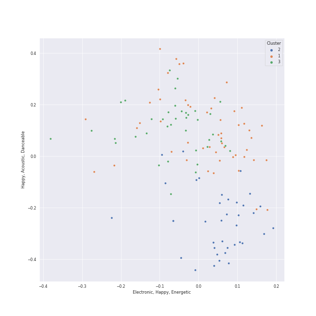

# Clusters in K-Pop-Adjacent

## Cluster #1

54 tracks

| Art | Track | Album | Artists | Label | Rank | 💚 | 🔗 |
|:---|:---|:---|:---|:---|---:|:---|:---|
|  | Bye | 4 ONLY | [LeeHi](../../../../artists/leehi/overview.md) | [Genie Music Corporation](../../../../labels/genie_music_corporation), [Stone Music Entertainment](../../../../labels/stone_music_entertainment) | 1010 | 💚 | [🔗](https://open.spotify.com/track/6ye2BBTpOipvPNjSPxgmRC) |
|  | Waterride | 4 ONLY | [LeeHi](../../../../artists/leehi/overview.md) | [Genie Music Corporation](../../../../labels/genie_music_corporation), [Stone Music Entertainment](../../../../labels/stone_music_entertainment) | 1010 | 💚 | [🔗](https://open.spotify.com/track/7JXNH2xnA23vsGasejVfWr) |
|  | Jenga (feat. Gaeko) | Wish & Wind | [HEIZE](../../../../artists/heize/overview.md), Gaeko | CJ E&M MUSIC | 1010 | 💚 | [🔗](https://open.spotify.com/track/1dA1tlzwcJ3YDYsSul1m06) |
|  | Undo | Undo | [HEIZE](../../../../artists/heize/overview.md) | [Genie Music Corporation](../../../../labels/genie_music_corporation), [Stone Music Entertainment](../../../../labels/stone_music_entertainment) | 286 | 💚 | [🔗](https://open.spotify.com/track/6z1pJ3KUmQagUpMVqL62sa) |
|  | How People Move | SPRING | [AKMU](../../../../artists/akmu/overview.md) | [YG Entertainment](../../../../labels/yg_entertainment) | 587 | 💚 | [🔗](https://open.spotify.com/track/0c2Yg75sFgD0hWhRq4voAn) |
|  | Love Theory | Love Theory - SM STATION | TAEYONG, Wonstein | [SM Entertainment](../../../../labels/sm_entertainment) | 1010 | 💚 | [🔗](https://open.spotify.com/track/1dmi9lVthTKjuemmO8ucWm) |
|  | Ya! (feat. Whee In) | Stay As You Are | Sandeul, Whee In | [WM Entertainment](../../../../labels/wm_entertainment) | 1010 | | [🔗](https://open.spotify.com/track/24HGlde2QMGAigs6bDdEhS) |
|  | Somebody! | Somebody | Loco, [HWASA](../../../../artists/hwasa/overview.md) | AOMG, ㈜RBW | 1010 | | [🔗](https://open.spotify.com/track/2FA4veLVh3jf7O8q5VhNh5) |
|  | 1+1=0 (Feat. DEAN) | Walkin' | SURAN, DEAN | Million Market,Inc | 1010 | | [🔗](https://open.spotify.com/track/3IRR7SWdHVojpCWfnwM2Vs) |
|  | NOT SORRY (Feat. pH-1) (Prod. by Slom) | SHOW ME THE MONEY 11 Episode 3 | Lee Young Ji, pH-1 | [Genie Music Corporation](../../../../labels/genie_music_corporation) | 1010 | 💚 | [🔗](https://open.spotify.com/track/5UOY3OZib7H4KFwTfsT66g) |
## Cluster #2

45 tracks

| Art | Track | Album | Artists | Label | Rank | 💚 | 🔗 |
|:---|:---|:---|:---|:---|---:|:---|:---|
|  | MISSING U | SEOULITE | [LeeHi](../../../../artists/leehi/overview.md) | [YG Entertainment](../../../../labels/yg_entertainment) | 1010 | 💚 | [🔗](https://open.spotify.com/track/4uk677I1lb0ZPSXGhL2FcA) |
|  | Shut Up & Groove | And July | [HEIZE](../../../../artists/heize/overview.md), DEAN | [Genie Music Corporation](../../../../labels/genie_music_corporation) | 1010 | | [🔗](https://open.spotify.com/track/1WT5I6vlWjYW2cnhR1UkVA) |
|  | Perhaps, Happy Ending | Last Winter | [HEIZE](../../../../artists/heize/overview.md) | [Genie Music Corporation](../../../../labels/genie_music_corporation), [Stone Music Entertainment](../../../../labels/stone_music_entertainment) | 285 | 💚 | [🔗](https://open.spotify.com/track/5VRjJvpk6xL9cxkkWhfWkY) |
|  | RED | RED | [The Rose](../../../../artists/the_rose/overview.md) | [Genie Music Corporation](../../../../labels/genie_music_corporation), [Stone Music Entertainment](../../../../labels/stone_music_entertainment) | 1010 | 💚 | [🔗](https://open.spotify.com/track/1JsBcVdlKZJmDPJWu4wJPC) |
|  | All I Wanna Do | EVERYTHING YOU WANTED | Jay Park | [Genie Music Corporation](../../../../labels/genie_music_corporation), [Stone Music Entertainment](../../../../labels/stone_music_entertainment) | 1010 | 💚 | [🔗](https://open.spotify.com/track/2PcJoVkfjcbvoqBxV1Nj7y) |
|  | KAZINO | KAZINO | [BIBI](../../../../artists/bibi/overview.md) | FeelGhoodMusic | 677 | 💚 | [🔗](https://open.spotify.com/track/245onUPHGD1DYuiacxTuW0) |
|  | Murder On The Dance Floor | I'M LOVIN' AMY | AILEE | 더라이브레이블 | 666 | 💚 | [🔗](https://open.spotify.com/track/6nuAMaTLREca7BWlXlm52s) |
|  | Last Dance | love you more, | YOUHA | [Universal Music Ltd.](../../../../labels/universal_music_llc) | 1010 | | [🔗](https://open.spotify.com/track/1bOS0JdXxmTWwlUxXX7gRG) |
|  | LULLABY | LULLABY | WOODZ | [Genie Music Corporation](../../../../labels/genie_music_corporation), [Stone Music Entertainment](../../../../labels/stone_music_entertainment) | 1010 | | [🔗](https://open.spotify.com/track/4XqyWlYiTFZ627CuUzMOJP) |
|  | WINE (Feat.Changmo) (Prod. SUGA) | WINE | SURAN, CHANGMO | Million Market,Inc | 159 | 💚 | [🔗](https://open.spotify.com/track/3eHkFA3StDR9BU7EVrUFLs) |
## Cluster #3

33 tracks

| Art | Track | Album | Artists | Label | Rank | 💚 | 🔗 |
|:---|:---|:---|:---|:---|---:|:---|:---|
|  | 봄인가 봐 Spring Love | 봄인가 봐 Spring Love - SM STATION | [WENDY](../../../../artists/wendy/overview.md), Eric Nam | [SM Entertainment](../../../../labels/sm_entertainment) | 1010 | | [🔗](https://open.spotify.com/track/6YOXdy9jShw66iOnBzQMKv) |
|  | Natural | Natural | GSoul | [WM Korea](../../../../labels/wm_korea) | 1010 | | [🔗](https://open.spotify.com/track/0ACt3PP22HyKfpFIV6AQUW) |
|  | For You | For You | [LeeHi](../../../../artists/leehi/overview.md), [Crush](../../../../artists/crush/overview.md) | AOMG | 442 | 💚 | [🔗](https://open.spotify.com/track/0JL7DoEqAUcOntWmBuOSdh) |
|  | NO WAY | 24℃ | [LeeHi](../../../../artists/leehi/overview.md), G.Soul | [YG Entertainment](../../../../labels/yg_entertainment) | 1010 | | [🔗](https://open.spotify.com/track/0jA0TihvVbPHgrIcHbW1Og) |
|  | BREATHE | SEOULITE | [LeeHi](../../../../artists/leehi/overview.md) | [YG Entertainment](../../../../labels/yg_entertainment) | 427 | 💚 | [🔗](https://open.spotify.com/track/6G4z9WbxyEeWdEQTfShACT) |
|  | Last Winter | Last Winter | [HEIZE](../../../../artists/heize/overview.md) | [Genie Music Corporation](../../../../labels/genie_music_corporation), [Stone Music Entertainment](../../../../labels/stone_music_entertainment) | 976 | | [🔗](https://open.spotify.com/track/0neVuSeb4wkhi1tLNc0t47) |
|  | How can I love the heartbreak, you're the one I love | SAILING | [AKMU](../../../../artists/akmu/overview.md) | [YG Entertainment](../../../../labels/yg_entertainment) | 1010 | 💚 | [🔗](https://open.spotify.com/track/0hqj5JBnFt1BHEz2UCFwrl) |
|  | L’Amour, Les Baguettes, Paris | Stairs | Stella Jang | GLG | 1010 | 💚 | [🔗](https://open.spotify.com/track/2g6FVCA4sQZOv9LXIABsgr) |
|  | DIE 4 YOU | DIE 4 YOU | DEAN | [Universal Music Ltd.](../../../../labels/universal_music_llc) | 1010 | 💚 | [🔗](https://open.spotify.com/track/7yZD4AVfQtAZD4cG8eRnPk) |
|  | IT'S YOU (feat. keshi) | IT'S YOU (feat. keshi) | MAX, keshi | [Warner Records](../../../../labels/warner_records) | 1010 | 💚 | [🔗](https://open.spotify.com/track/5SMCxRA6hB2jEhroaYfw6N) |