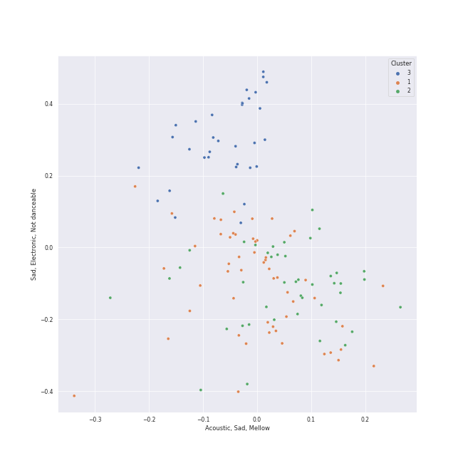

# Clusters in K-Pop-Adjacent

## Cluster #1

52 tracks

| Art | Track | Album | Artists | Label | Rank | 💚 | 🔗 |
|:---|:---|:---|:---|:---|---:|:---|:---|
|  | Bye | 4 ONLY | [LeeHi](../../../../artists/leehi/overview.md) | [Genie Music Corporation](../../../../labels/genie_music_corporation), [Stone Music Entertainment](../../../../labels/stone_music_entertainment) | 911 | 💚 | [🔗](https://open.spotify.com/track/6ye2BBTpOipvPNjSPxgmRC) |
|  | Undo | Undo | [HEIZE](../../../../artists/heize/overview.md) | [Genie Music Corporation](../../../../labels/genie_music_corporation), [Stone Music Entertainment](../../../../labels/stone_music_entertainment) | 232 | 💚 | [🔗](https://open.spotify.com/track/6z1pJ3KUmQagUpMVqL62sa) |
|  | Make Up (Feat. Crush) | Sun And Moon | Sam Kim, [Crush](../../../../artists/crush/overview.md) | Antenna | 911 | 💚 | [🔗](https://open.spotify.com/track/19zsSUEuJNzNA6eqInqyF9) |
|  | Sex Trip | MOMMAE | Jay Park | [Genie Music Corporation](../../../../labels/genie_music_corporation), [Stone Music Entertainment](../../../../labels/stone_music_entertainment) | 911 | 💚 | [🔗](https://open.spotify.com/track/6dJ4jLQMM8SXGYrM0eRCNm) |
|  | Ya! (feat. Whee In) | Stay As You Are | Sandeul, Whee In | [WM Entertainment](../../../../labels/wm_entertainment) | 911 | | [🔗](https://open.spotify.com/track/24HGlde2QMGAigs6bDdEhS) |
|  | Somebody! | Somebody | Loco, [HWASA](../../../../artists/hwasa/overview.md) | AOMG, ㈜RBW | 911 | | [🔗](https://open.spotify.com/track/2FA4veLVh3jf7O8q5VhNh5) |
|  | POOL(Feat. Sumin) | POOL[pu:l] | WOODZ, SUMIN | YUEHUA Entertainment | 911 | | [🔗](https://open.spotify.com/track/3fCZKucLEtLkTLtRUZrfkG) |
|  | Rose | 공감 (Empathy) - The 1st Mini Album | D.O. | [SM Entertainment](../../../../labels/sm_entertainment) | 911 | 💚 | [🔗](https://open.spotify.com/track/2bk43y1inDfHx8fFdXar3l) |
|  | 1+1=0 (Feat. DEAN) | Walkin' | SURAN, DEAN | Million Market,Inc | 911 | | [🔗](https://open.spotify.com/track/3IRR7SWdHVojpCWfnwM2Vs) |
|  | NOT SORRY (Feat. pH-1) (Prod. by Slom) | SHOW ME THE MONEY 11 Episode 3 | Lee Young Ji, pH-1 | [Genie Music Corporation](../../../../labels/genie_music_corporation) | 911 | 💚 | [🔗](https://open.spotify.com/track/5UOY3OZib7H4KFwTfsT66g) |
## Cluster #2

38 tracks

| Art | Track | Album | Artists | Label | Rank | 💚 | 🔗 |
|:---|:---|:---|:---|:---|---:|:---|:---|
|  | 봄인가 봐 Spring Love | 봄인가 봐 Spring Love - SM STATION | [WENDY](../../../../artists/wendy/overview.md), Eric Nam | [SM Entertainment](../../../../labels/sm_entertainment) | 911 | | [🔗](https://open.spotify.com/track/6YOXdy9jShw66iOnBzQMKv) |
|  | For You | For You | [LeeHi](../../../../artists/leehi/overview.md), [Crush](../../../../artists/crush/overview.md) | AOMG | 389 | 💚 | [🔗](https://open.spotify.com/track/0JL7DoEqAUcOntWmBuOSdh) |
|  | NO WAY | 24℃ | [LeeHi](../../../../artists/leehi/overview.md), G.Soul | [YG Entertainment](../../../../labels/yg_entertainment) | 911 | | [🔗](https://open.spotify.com/track/0jA0TihvVbPHgrIcHbW1Og) |
|  | BREATHE | SEOULITE | [LeeHi](../../../../artists/leehi/overview.md) | [YG Entertainment](../../../../labels/yg_entertainment) | 374 | 💚 | [🔗](https://open.spotify.com/track/6G4z9WbxyEeWdEQTfShACT) |
|  | Can't Stop This Party | Can't Stop This Party | Seori | [ATISPAUS/88rising Music](../../../../labels/88rising_music) | 911 | 💚 | [🔗](https://open.spotify.com/track/1FP2jE6moLiHoNUaWTUyJc) |
|  | Last Winter | Last Winter | [HEIZE](../../../../artists/heize/overview.md) | [Genie Music Corporation](../../../../labels/genie_music_corporation), [Stone Music Entertainment](../../../../labels/stone_music_entertainment) | 876 | | [🔗](https://open.spotify.com/track/0neVuSeb4wkhi1tLNc0t47) |
|  | How can I love the heartbreak, you're the one I love | SAILING | [AKMU](../../../../artists/akmu/overview.md) | [YG Entertainment](../../../../labels/yg_entertainment) | 911 | 💚 | [🔗](https://open.spotify.com/track/0hqj5JBnFt1BHEz2UCFwrl) |
|  | Bye Bye My Blue | Bye Bye My Blue | Yerin Baek | [JYP Entertainment](../../../../labels/jyp_entertainment) | 911 | 💚 | [🔗](https://open.spotify.com/track/1XslqSASDWaMZdjhWa7Jb7) |
|  | Heartbeat | Strong Woman Do Bong Soon, Pt. 2 (Original Television Soundtrack) | SURAN | JTBC Studios | 911 | 💚 | [🔗](https://open.spotify.com/track/3Mz7i60GsWWLRyDeAIuCZA) |
|  | DIE 4 YOU | DIE 4 YOU | DEAN | [Universal Music Ltd.](../../../../labels/universal_music_llc) | 911 | 💚 | [🔗](https://open.spotify.com/track/7yZD4AVfQtAZD4cG8eRnPk) |
## Cluster #3

39 tracks

| Art | Track | Album | Artists | Label | Rank | 💚 | 🔗 |
|:---|:---|:---|:---|:---|---:|:---|:---|
|  | MISSING U | SEOULITE | [LeeHi](../../../../artists/leehi/overview.md) | [YG Entertainment](../../../../labels/yg_entertainment) | 911 | 💚 | [🔗](https://open.spotify.com/track/4uk677I1lb0ZPSXGhL2FcA) |
|  | Shut Up & Groove | And July | [HEIZE](../../../../artists/heize/overview.md), DEAN | [Genie Music Corporation](../../../../labels/genie_music_corporation) | 911 | | [🔗](https://open.spotify.com/track/1WT5I6vlWjYW2cnhR1UkVA) |
|  | RED | RED | [The Rose](../../../../artists/the_rose/overview.md) | [Genie Music Corporation](../../../../labels/genie_music_corporation), [Stone Music Entertainment](../../../../labels/stone_music_entertainment) | 911 | 💚 | [🔗](https://open.spotify.com/track/1JsBcVdlKZJmDPJWu4wJPC) |
|  | All I Wanna Do | EVERYTHING YOU WANTED | Jay Park | [Genie Music Corporation](../../../../labels/genie_music_corporation), [Stone Music Entertainment](../../../../labels/stone_music_entertainment) | 911 | 💚 | [🔗](https://open.spotify.com/track/2PcJoVkfjcbvoqBxV1Nj7y) |
|  | GANADARA (Feat. IU) | GANADARA | Jay Park, [IU](../../../../artists/iu/overview.md) | MORE VISION | 911 | 💚 | [🔗](https://open.spotify.com/track/5quFr5s5PXYfUX5jV2EBZ1) |
|  | KAZINO | KAZINO | [BIBI](../../../../artists/bibi/overview.md) | FeelGhoodMusic | 606 | 💚 | [🔗](https://open.spotify.com/track/245onUPHGD1DYuiacxTuW0) |
|  | LULLABY | LULLABY | WOODZ | [Genie Music Corporation](../../../../labels/genie_music_corporation), [Stone Music Entertainment](../../../../labels/stone_music_entertainment) | 911 | | [🔗](https://open.spotify.com/track/4XqyWlYiTFZ627CuUzMOJP) |
|  | Little Things | Troubleshooting | Xdinary Heroes | [Republic Records](../../../../labels/republic_records) | 815 | 💚 | [🔗](https://open.spotify.com/track/5t8TV1U5vmKL5UIQo5pNtN) |
|  | WINE (Feat.Changmo) (Prod. SUGA) | WINE | SURAN, CHANGMO | Million Market,Inc | 140 | 💚 | [🔗](https://open.spotify.com/track/3eHkFA3StDR9BU7EVrUFLs) |
|  | Radio | The Volunteers | The Volunteers | Blue Vinyl | 911 | 💚 | [🔗](https://open.spotify.com/track/3cLwHcFj7IFH6RfvErMwom) |