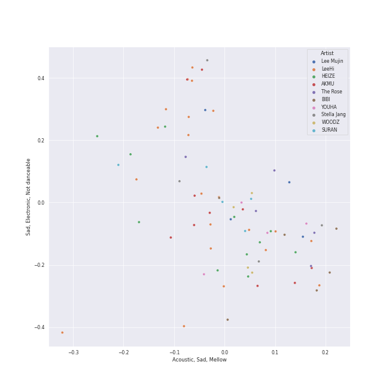
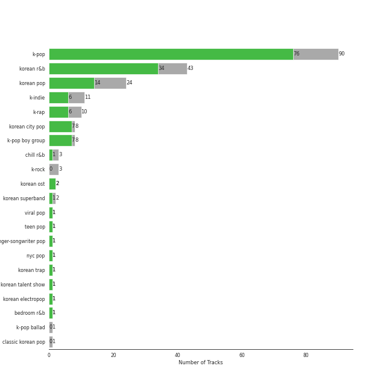
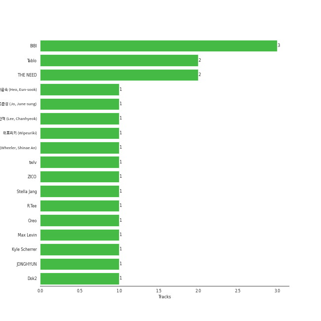
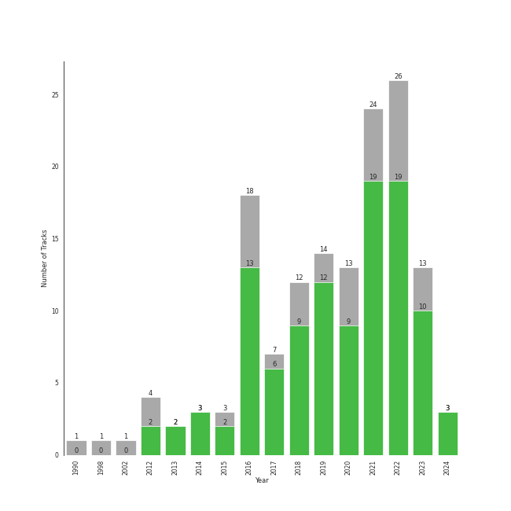

# K-Pop-Adjacent

[51 tracks (33 liked) 🔗](https://open.spotify.com/playlist/5ELtUGtTCv5PkLW7qFcEuk)

[See Track Features](audio_features.md)

[See Clusters](clusters/overview.md)

## Top Artists

| Art | Tracks | 💚 | Artist | 🔗 |
|:---|---:|---:|:---|:---|
|  | 2 | 2 | hannah bahng | [🔗](https://open.spotify.com/artist/2oTW5kYNj4eIgp68Z5W4D9) |
|  | 2 | 2 | YB | [🔗](https://open.spotify.com/artist/1rpgxJZxZMLnFNc1Jmyov5) |
|  | 2 | 1 | [Justin Bieber](../../artists/justin_bieber/overview.md) | [🔗](https://open.spotify.com/artist/1uNFoZAHBGtllmzznpCI3s) |
|  | 1 | 1 | ROSALÃA | [🔗](https://open.spotify.com/artist/7ltDVBr6mKbRvohxheJ9h1) |
|  | 1 | 1 | Loving Caliber | [🔗](https://open.spotify.com/artist/6psCCMHymYfQy6VvYRr6cs) |
|  | 1 | 1 | Destiny Rogers | [🔗](https://open.spotify.com/artist/6gezkje7GoJlQbHBgLXHuu) |
|  | 1 | 1 | Colbie Caillat | [🔗](https://open.spotify.com/artist/6aZyMrc4doVtZyKNilOmwu) |
|  | 1 | 1 | DARA | [🔗](https://open.spotify.com/artist/6WRl7KUrzOq7GpY97KrYxi) |
|  | 1 | 1 | Charlie Puth | [🔗](https://open.spotify.com/artist/6VuMaDnrHyPL1p4EHjYLi7) |
|  | 1 | 1 | Bebe Rexha | [🔗](https://open.spotify.com/artist/64M6ah0SkkRsnPGtGiRAbb) |

See all 69 artists

| Art | Tracks | 💚 | Artist | 🔗 |
|:---|---:|---:|:---|:---|
|  | 1 | 1 | Stellar | [🔗](https://open.spotify.com/artist/5yw4tA8D5uG7tT3NaDvq10) |
|  | 1 | 1 | John Legend | [🔗](https://open.spotify.com/artist/5y2Xq6xcjJb2jVM54GHK3t) |
| | 1 | 1 | 김아중 | [🔗](https://open.spotify.com/artist/5qMkh0MtptmH5XKinOnFom) |
|  | 1 | 1 | G Curtis | [🔗](https://open.spotify.com/artist/5kXFGisUTEE54i06rrXhJE) |
|  | 1 | 1 | Miley Cyrus | [🔗](https://open.spotify.com/artist/5YGY8feqx7naU7z4HrwZM6) |
|  | 1 | 1 | HONG JIN YOUNG | [🔗](https://open.spotify.com/artist/5LwiBgLTllBUiqQGNiQ7jY) |
|  | 1 | 1 | Jason Mraz | [🔗](https://open.spotify.com/artist/4phGZZrJZRo4ElhRtViYdl) |
|  | 1 | 1 | Dynamicduo | [🔗](https://open.spotify.com/artist/4nvFFLtv7ZqoTr83387uK4) |
|  | 1 | 1 | [Camila Cabello](../../artists/camila_cabello/overview.md) | [🔗](https://open.spotify.com/artist/4nDoRrQiYLoBzwC5BhVJzF) |
|  | 1 | 1 | K/DA | [🔗](https://open.spotify.com/artist/4gOc8TsQed9eqnqJct2c5v) |
|  | 1 | 1 | Travis Barker | [🔗](https://open.spotify.com/artist/4exLIFE8sISLr28sqG1qNX) |
|  | 1 | 1 | 6LACK | [🔗](https://open.spotify.com/artist/4IVAbR2w4JJNJDDRFP3E83) |
|  | 1 | 1 | League of Legends | [🔗](https://open.spotify.com/artist/47mIJdHORyRerp4os813jD) |
|  | 1 | 1 | Christopher | [🔗](https://open.spotify.com/artist/3zDRCqOhJXJfS2YWOEwGMC) |
|  | 1 | 1 | QUIN | [🔗](https://open.spotify.com/artist/3sHS70DMNgPxRqx2fUNrRA) |
|  | 1 | 1 | Little Mix | [🔗](https://open.spotify.com/artist/3e7awlrlDSwF3iM0WBjGMp) |
|  | 1 | 1 | Kim Petras | [🔗](https://open.spotify.com/artist/3Xt3RrJMFv5SZkCfUE8C1J) |
|  | 1 | 1 | Alicia Keys | [🔗](https://open.spotify.com/artist/3DiDSECUqqY1AuBP8qtaIa) |
|  | 1 | 1 | Zedd | [🔗](https://open.spotify.com/artist/2qxJFvFYMEDqd7ui6kSAcq) |
|  | 1 | 1 | george | [🔗](https://open.spotify.com/artist/2pRZp2WxvnWWiSPcSSYkNV) |
|  | 1 | 1 | Madison Beer | [🔗](https://open.spotify.com/artist/2kRfqPViCqYdSGhYSM9R0Q) |
|  | 1 | 1 | Vincent Blue | [🔗](https://open.spotify.com/artist/2AZgVjkPB4a4ULepFyPPgZ) |
|  | 1 | 1 | YUQI | [🔗](https://open.spotify.com/artist/22aCD8IrQZjcPgZw728QT6) |
|  | 1 | 1 | [Jackson Wang](../../artists/jackson_wang/overview.md) | [🔗](https://open.spotify.com/artist/1kfWoWgCugPkyxQP8lkRlY) |
|  | 1 | 1 | Pink Sweat$ | [🔗](https://open.spotify.com/artist/1W7FNibLa0O0b572tB2w7t) |
|  | 1 | 1 | 88rising | [🔗](https://open.spotify.com/artist/1AhjOkOLkbHUfcHDSErXQs) |
|  | 1 | 1 | Bishop Briggs | [🔗](https://open.spotify.com/artist/0yb46jwm7gqbZXVXZQ8Z1e) |
|  | 1 | 1 | Måneskin | [🔗](https://open.spotify.com/artist/0lAWpj5szCSwM4rUMHYmrr) |
|  | 1 | 1 | Yuuri | [🔗](https://open.spotify.com/artist/0ixzjrK1wkN2zWBXt3VW3W) |
|  | 1 | 1 | Kehlani | [🔗](https://open.spotify.com/artist/0cGUm45nv7Z6M6qdXYQGTX) |
|  | 1 | 1 | Lee Young Ji | [🔗](https://open.spotify.com/artist/0Y2AcMPMpeuPXtPQGVvRBq) |
|  | 1 | 1 | Stephanie Poetri | [🔗](https://open.spotify.com/artist/0HS00NN7MAfF59aJnfcxSO) |
|  | 1 | 1 | [WENDY](../../artists/wendy/overview.md) | [🔗](https://open.spotify.com/artist/0FRUZvZNPzM3YJMABJxf2K) |
|  | 2 | 0 | Chris Brown | [🔗](https://open.spotify.com/artist/7bXgB6jMjp9ATFy66eO08Z) |
|  | 1 | 0 | [Beyoncé](../../artists/beyoncé/overview.md) | [🔗](https://open.spotify.com/artist/6vWDO969PvNqNYHIOW5v0m) |
|  | 1 | 0 | Brendon Urie | [🔗](https://open.spotify.com/artist/6eYFryfcEu3QSq59D62wZQ) |
|  | 1 | 0 | [Dua Lipa](../../artists/dua_lipa/overview.md) | [🔗](https://open.spotify.com/artist/6M2wZ9GZgrQXHCFfjv46we) |
|  | 1 | 0 | Diplo | [🔗](https://open.spotify.com/artist/5fMUXHkw8R8eOP2RNVYEZX) |
|  | 1 | 0 | LISA | [🔗](https://open.spotify.com/artist/5L1lO4eRHmJ7a0Q6csE5cT) |
|  | 1 | 0 | DJ Snake | [🔗](https://open.spotify.com/artist/540vIaP2JwjQb9dm3aArA4) |
|  | 1 | 0 | Young Thug | [🔗](https://open.spotify.com/artist/50co4Is1HCEo8bhOyUWKpn) |
|  | 1 | 0 | Giveon | [🔗](https://open.spotify.com/artist/4fxd5Ee7UefO4CUXgwJ7IP) |
|  | 1 | 0 | Kevin MacLeod | [🔗](https://open.spotify.com/artist/4fSMtiyC6lF5BUO1tUMWMs) |
|  | 1 | 0 | A$ton Wyld | [🔗](https://open.spotify.com/artist/4MqATzsmSOuGh7de1Q4AzX) |
|  | 1 | 0 | Ludacris | [🔗](https://open.spotify.com/artist/3ipn9JLAPI5GUEo4y4jcoi) |
|  | 1 | 0 | ABIR | [🔗](https://open.spotify.com/artist/3QUOtWgmuxFyae4C0Q0thd) |
|  | 1 | 0 | RuPaul | [🔗](https://open.spotify.com/artist/2SdOKxC1sSxEyv8JYERaNe) |
|  | 1 | 0 | Post Malone | [🔗](https://open.spotify.com/artist/246dkjvS1zLTtiykXe5h60) |
|  | 1 | 0 | Panic! At The Disco | [🔗](https://open.spotify.com/artist/20JZFwl6HVl6yg8a4H3ZqK) |
|  | 1 | 0 | [Red Velvet](../../artists/red_velvet/overview.md) | [🔗](https://open.spotify.com/artist/1z4g3DjTBBZKhvAroFlhOM) |
|  | 1 | 0 | Xdinary Heroes | [🔗](https://open.spotify.com/artist/1khChLj7REGqjM043PlYyn) |
|  | 1 | 0 | Ozuna | [🔗](https://open.spotify.com/artist/1i8SpTcr7yvPOmcqrbnVXY) |
|  | 1 | 0 | [Queen](../../artists/queen/overview.md) | [🔗](https://open.spotify.com/artist/1dfeR4HaWDbWqFHLkxsg1d) |
|  | 1 | 0 | Megan Thee Stallion | [🔗](https://open.spotify.com/artist/181bsRPaVXVlUKXrxwZfHK) |
|  | 1 | 0 | Emotional Oranges | [🔗](https://open.spotify.com/artist/12trz2INGglrKMzLmg0y2C) |
|  | 1 | 0 | DaniLeigh | [🔗](https://open.spotify.com/artist/0XIKGBo9PnK1ApI5tZA60d) |
|  | 1 | 0 | Ellie Goulding | [🔗](https://open.spotify.com/artist/0X2BH1fck6amBIoJhDVmmJ) |
|  | 1 | 0 | [Taylor Swift](../../artists/taylor_swift/overview.md) | [🔗](https://open.spotify.com/artist/06HL4z0CvFAxyc27GXpf02) |
|  | 1 | 0 | G-Eazy | [🔗](https://open.spotify.com/artist/02kJSzxNuaWGqwubyUba0Z) |

## Top Albums

| Art | Tracks | 💚 | Album | Release Date | 🔗 |
|:---|---:|---:|:---|:---|:---|
|  | 2 | 2 | perfect blues | 2023-07-14 | [🔗](https://open.spotify.com/album/09JlCYQ9z7cCoFoBQMqUN7) |
|  | 1 | 1 | 미녀는 괴로워 Original Motion picture Soundtrack | 2006-12-12 | [🔗](https://open.spotify.com/album/5XUYDlbeJCIFSCekufQiZb) |
|  | 1 | 1 | 壱 | 2022-01-12 | [🔗](https://open.spotify.com/album/1YWoHzj5wHnG7m6gLlwBQd) |
|  | 1 | 1 | Written In The Stars | 2018-10-11 | [🔗](https://open.spotify.com/album/08z3DsL7P6RpBR3FgNMSvN) |
|  | 1 | 1 | Weightlifting Fairy Kim Bok Joo (Original Television Soundtrack, Pt. 2) | 2016-11-23 | [🔗](https://open.spotify.com/album/1T8J131uP2pI7VuxSF2zp3) |
|  | 1 | 1 | We Sing. We Dance. We Steal Things. | 2008-05-12 | [🔗](https://open.spotify.com/album/04G0YylSjvDQZrjOfE5jA5) |
|  | 1 | 1 | Under the Surface | 2019-02-22 | [🔗](https://open.spotify.com/album/6ISIdF1gCK9X8pn4FaObHE) |
|  | 1 | 1 | Tomboy | 2019-02-28 | [🔗](https://open.spotify.com/album/2uDZBeyyQ7mfwF9mUJeYUG) |
|  | 1 | 1 | The Prelude | 2020-07-17 | [🔗](https://open.spotify.com/album/3Qj2vsFzmaB8jcH6Q60WIG) |
|  | 1 | 1 | The Diary Of Alicia Keys | 2003-12-02 | [🔗](https://open.spotify.com/album/6TqRKHLjDu5QZuC8u5Woij) |

See all 50 albums

| Art | Tracks | 💚 | Album | Release Date | 🔗 |
|:---|---:|---:|:---|:---|:---|
|  | 1 | 1 | Taxidriver OST Part.1 | 2021-04-16 | [🔗](https://open.spotify.com/album/3PNXlS9tggXmCm1hrlHDcQ) |
|  | 1 | 1 | Street Woman Fighter2 (SWF2) Class Mission | 2023-09-05 | [🔗](https://open.spotify.com/album/3fifgTm6PcVhHE9v72nlCb) |
|  | 1 | 1 | Salute (Expanded Edition) | 2013-11-11 | [🔗](https://open.spotify.com/album/4cH9WxyfNWlfR257RitWBt) |
|  | 1 | 1 | REMIND | 2016-10-26 | [🔗](https://open.spotify.com/album/2wA8OXIv1JXX9kTY2ddfR4) |
|  | 1 | 1 | Mr. Rover | 2022-07-15 | [🔗](https://open.spotify.com/album/0mkxSResK0c4KS5VFcQPhH) |
|  | 1 | 1 | Magical | 2018-09-04 | [🔗](https://open.spotify.com/album/2rUeXUM8fCb2D26NPoy0Y3) |
|  | 1 | 1 | Love's Battery | 2009-06-19 | [🔗](https://open.spotify.com/album/03IVWQyi8lzS4t2WQKu5iI) |
|  | 1 | 1 | LUCID | 2019-11-15 | [🔗](https://open.spotify.com/album/5qQhQ1rmPjqQgv8RmfaQU3) |
|  | 1 | 1 | Justice | 2021-03-19 | [🔗](https://open.spotify.com/album/5dGWwsZ9iB2Xc3UKR0gif2) |
|  | 1 | 1 | Head In The Clouds II | 2019-10-11 | [🔗](https://open.spotify.com/album/7bOpX6Ilc9UCFmH9uGyUDy) |
|  | 1 | 1 | Good Thing (with Kehlani) | 2019-09-27 | [🔗](https://open.spotify.com/album/3wpdeV1FZfiEnelZSfAFp4) |
|  | 1 | 1 | Flowers (Cover) | 2023-03-20 | [🔗](https://open.spotify.com/album/0nTIxK2AR9QnY2nn5uxhYW) |
|  | 1 | 1 | Flowers | 2023-01-13 | [🔗](https://open.spotify.com/album/7I0tjwFtxUwBC1vgyeMAax) |
|  | 1 | 1 | El Mal Querer | 2018-11-02 | [🔗](https://open.spotify.com/album/355bjCHzRJztCzaG5Za4gq) |
|  | 1 | 1 | Cry for Me | 2019-10-04 | [🔗](https://open.spotify.com/album/2dq4ae5hiyxlFPG1s8rlq5) |
|  | 1 | 1 | Church Of Scars | 2018-04-20 | [🔗](https://open.spotify.com/album/1TTxcgs3zEngN0EB56yXzY) |
|  | 1 | 1 | Chosen | 2017-12-08 | [🔗](https://open.spotify.com/album/2qJw6w5XwQO0PQlSWPu7Tw) |
|  | 1 | 1 | CHARLIE | 2022-10-06 | [🔗](https://open.spotify.com/album/5Jk4Eg7pxYhDrWJCVVzmMt) |
|  | 1 | 1 | Boat | 2017-11-17 | [🔗](https://open.spotify.com/album/02uMD7AxTNi2Af2H4DxfPO) |
|  | 1 | 1 | Better Mistakes | 2021-05-07 | [🔗](https://open.spotify.com/album/0ypVp54cO3kexiJNu33wYp) |
|  | 1 | 1 | Ashes | 2020-05-03 | [🔗](https://open.spotify.com/album/41gMZm0ib3Je8hU0eFNUwS) |
|  | 1 | 1 | ALL OUT | 2020-11-06 | [🔗](https://open.spotify.com/album/26IdRjba8f8DNa7c0FwfQb) |
|  | 1 | 0 | The Juice: Vol. II | 2019-11-08 | [🔗](https://open.spotify.com/album/6q8BNcH6wkWwWC0fGoJwkS) |
|  | 1 | 0 | TAKE TIME | 2020-03-27 | [🔗](https://open.spotify.com/album/1zHR48K6XtWYm6bhrw4J6C) |
|  | 1 | 0 | Sneaky Snitch | 2014-12-27 | [🔗](https://open.spotify.com/album/3Rs66sqYGwhu6uFxFXoP1T) |
|  | 1 | 0 | Slime & B | 2020-05-08 | [🔗](https://open.spotify.com/album/7fZKtzZAsfH0kzeTivu5TG) |
|  | 1 | 0 | SG (with Ozuna, Megan Thee Stallion & LISA of BLACKPINK) | 2021-10-22 | [🔗](https://open.spotify.com/album/2TGtXG18s21Q1jnY2TC39M) |
|  | 1 | 0 | Purpose (Deluxe) | 2015-11-13 | [🔗](https://open.spotify.com/album/6Fr2rQkZ383FcMqFyT7yPr) |
|  | 1 | 0 | Motley Crew | 2021-07-09 | [🔗](https://open.spotify.com/album/4tokbQaFXRrq8keVGBD9vb) |
|  | 1 | 0 | MINT | 2018-10-19 | [🔗](https://open.spotify.com/album/5hUQgovUfTYN47QGQXF8k2) |
|  | 1 | 0 | Lover | 2019-08-23 | [🔗](https://open.spotify.com/album/1NAmidJlEaVgA3MpcPFYGq) |
|  | 1 | 0 | Livelock | 2023-10-11 | [🔗](https://open.spotify.com/album/6wRy2dydFytIzBlEqVa5sh) |
|  | 1 | 0 | Fast & Furious Presents: Hobbs & Shaw (Original Motion Picture Soundtrack) | 2019-07-26 | [🔗](https://open.spotify.com/album/6Y1wIHHmTIqv3mnVvQNJNH) |
|  | 1 | 0 | F.A.M.E. (Expanded Edition) | 2011-03-22 | [🔗](https://open.spotify.com/album/6df0qvkMXoyHGt9J8cujZb) |
|  | 1 | 0 | Dua Lipa | 2017-06-02 | [🔗](https://open.spotify.com/album/2vlhlrgMaXqcnhRqIEV9AP) |
|  | 1 | 0 | Cravin | 2019-10-18 | [🔗](https://open.spotify.com/album/6c66PBJdg7EWPcFUvLyFFu) |
|  | 1 | 0 | Close To Me (Red Velvet Remix) | 2019-04-05 | [🔗](https://open.spotify.com/album/7dg5iqyFYqRQH7vtAG9VNf) |
|  | 1 | 0 | BEYONCÉ [Platinum Edition] | 2014-11-24 | [🔗](https://open.spotify.com/album/2UJwKSBUz6rtW4QLK74kQu) |
|  | 1 | 0 | American | 2017-03-24 | [🔗](https://open.spotify.com/album/3WX0a9UW0ss5IOp9hSP4F2) |
|  | 1 | 0 | A Kind Of Magic | 1986-06-02 | [🔗](https://open.spotify.com/album/34xBXeJgmQrn1wQvhyVCsw) |

## Top Record Labels

| Tracks | 💚 | Label |
|---:|---:|:---|
| 3 | 3 | [Atlantic Records](../../labels/atlantic_records/overview.md) |
| 3 | 2 | [Warner Records](../../labels/warner_records/overview.md) |
| 3 | 2 | [Columbia](../../labels/columbia/overview.md) |
| 2 | 2 | [Syco Music](../../labels/syco_music/overview.md) |
| 2 | 2 | [Interscope Records](../../labels/interscope_records/overview.md) |
| 2 | 2 | BAHNG ENTERTAINMENT LLC |
| 2 | 1 | [RCA Records Label](../../labels/rca_records_label/overview.md) |
| 2 | 1 | RBMG |
| 2 | 1 | [Epic](../../labels/epic/overview.md) |
| 2 | 1 | Def Jam |

See all 49 labels

| Tracks | 💚 | Label |
|---:|---:|:---|
| 1 | 1 | 코어콘텐츠미디어 |
| 1 | 1 | 케이엠컬쳐 |
| 1 | 1 | 스타엔트리엔터테인먼트 |
| 1 | 1 | 디컴퍼니 |
| 1 | 1 | YUQI |
| 1 | 1 | Virginia Records |
| 1 | 1 | Teleport Records |
| 1 | 1 | [Sony Music Labels Inc.](../../labels/sony_music_labels_inc_/overview.md) |
| 1 | 1 | [SM Entertainment](../../labels/sm_entertainment/overview.md) |
| 1 | 1 | SBS Contents Hub Co. |
| 1 | 1 | Riot Games |
| 1 | 1 | Parlophone Denmark |
| 1 | 1 | Not specified |
| 1 | 1 | Music Recipe |
| 1 | 1 | J Records |
| 1 | 1 | [Island Records](../../labels/island_records/overview.md) |
| 1 | 1 | [Genie Music Corporation](../../labels/genie_music_corporation/overview.md) |
| 1 | 1 | Fantasy Soul |
| 1 | 1 | Epidemic Sound |
| 1 | 1 | CRAFT AND JUN |
| 1 | 1 | Arista |
| 1 | 1 | ATG |
| 1 | 1 | [88rising Music](../../labels/88rising_music/overview.md) |
| 2 | 0 | [Republic Records](../../labels/republic_records/overview.md) |
| 1 | 0 | The Other Songs |
| 1 | 0 | [Taylor Swift](../../labels/taylor_swift/overview.md) |
| 1 | 0 | RuCo |
| 1 | 0 | [Polydor Records](../../labels/polydor_records/overview.md) |
| 1 | 0 | Parkwood Entertainment |
| 1 | 0 | Not So Fast |
| 1 | 0 | [Jive](../../labels/jive/overview.md) |
| 1 | 0 | [Hollywood Records](../../labels/hollywood_records/overview.md) |
| 1 | 0 | Fez's Finest |
| 1 | 0 | [Def Jam Recordings](../../labels/def_jam_recordings/overview.md) |
| 1 | 0 | DJ Snake Music Productions Limited |
| 1 | 0 | Chris Brown Entertainment |
| 1 | 0 | Back Lot Music |
| 1 | 0 | Avant Garden PS |
| 1 | 0 | 300 Entertainment |

## Genres

| Tracks | 💚 | Genre |
|---:|---:|:---|
| 17 | 10 | [pop](../../genres/pop/overview.md) |
| 4 | 3 | [dance pop](../../genres/dance_pop/overview.md) |
| 2 | 2 | [korean pop](../../genres/korean_pop/overview.md) |
| 2 | 2 | korean indie rock |
| 2 | 2 | k-rock |
| 6 | 1 | [r&b](../../genres/r_b/overview.md) |
| 3 | 1 | [uk pop](../../genres/uk_pop/overview.md) |
| 2 | 1 | pop dance |
| 2 | 1 | indie r&b |
| 2 | 1 | edm |

See all 54 genres

| Tracks | 💚 | Genre |
|---:|---:|:---|
| 2 | 1 | [canadian pop](../../genres/canadian_pop/overview.md) |
| 1 | 1 | [viral pop](../../genres/viral_pop/overview.md) |
| 1 | 1 | trot |
| 1 | 1 | talent show |
| 1 | 1 | social media pop |
| 1 | 1 | scandipop |
| 1 | 1 | r&b en espanol |
| 1 | 1 | neo soul |
| 1 | 1 | [neo mellow](../../genres/neo_mellow/overview.md) |
| 1 | 1 | modern alternative rock |
| 1 | 1 | [korean r&b](../../genres/korean_r_b/overview.md) |
| 1 | 1 | korean city pop |
| 1 | 1 | [k-rap](../../genres/k-rap/overview.md) |
| 1 | 1 | [k-pop girl group](../../genres/k-pop_girl_group/overview.md) |
| 1 | 1 | [k-pop](../../genres/k-pop/overview.md) |
| 1 | 1 | japanese teen pop |
| 1 | 1 | japanese singer-songwriter |
| 1 | 1 | j-pop |
| 1 | 1 | italian pop |
| 1 | 1 | indie rock italiano |
| 1 | 1 | girl group |
| 1 | 1 | german techno |
| 1 | 1 | danish pop |
| 1 | 1 | complextro |
| 1 | 1 | bulgarian pop |
| 1 | 1 | bulgarian hip hop |
| 1 | 1 | bedroom soul |
| 1 | 1 | asian american hip hop |
| 1 | 1 | [acoustic pop](../../genres/acoustic_pop/overview.md) |
| 3 | 0 | [rap](../../genres/rap/overview.md) |
| 1 | 0 | strut |
| 1 | 0 | [rock](../../genres/rock/overview.md) |
| 1 | 0 | rap latina |
| 1 | 0 | pop r&b |
| 1 | 0 | metropopolis |
| 1 | 0 | meme |
| 1 | 0 | melodic rap |
| 1 | 0 | [k-pop boy group](../../genres/k-pop_boy_group/overview.md) |
| 1 | 0 | indietronica |
| 1 | 0 | [glam rock](../../genres/glam_rock/overview.md) |
| 1 | 0 | electronic trap |
| 1 | 0 | diva house |
| 1 | 0 | dfw rap |
| 1 | 0 | [classic rock](../../genres/classic_rock/overview.md) |

## Top Producers

| Art | Producer | Tracks | Credit Types |
|:---|:---|---:|:---|
| | Jaycen Joshua | 2 | Producer |
| | [Manny Marroquin](../../producers/manny_marroquin/overview.md) | 2 | Producer |
| | Jake Torrey | 2 | Producer, Songwriter |
| | Mark Jackson | 1 | Songwriter |
| | Perrie Edwards | 1 | Songwriter |
|  | Bekuh Boom | 1 | Lyricist, Songwriter |
| | Aaron Joseph Aguilar | 1 | Arranger |
| | Martin Terefe | 1 | Producer |
| | Sebastien Najand | 1 | Lyricist, Producer, Songwriter |
|  | Jason Mraz | 1 | Producer, Songwriter |

View all

| Art | Producer | Tracks | Credit Types |
|:---|:---|---:|:---|
| | Brendon Williams | 1 | Lyricist, Songwriter |
| | Ian Scott | 1 | Songwriter |
| | Daniel James | 1 | Producer, Songwriter |
|  | Miley Cyrus | 1 | Songwriter |
| | El Guincho | 1 | Arranger, Lyricist, Producer, Songwriter |
| | Leigh-Anne | 1 | Songwriter |
| | Louis Bell | 1 | Producer, Songwriter |
| | Alexander "Scherzophrenia" Temple | 1 | Lyricist, Songwriter |
| | Peter Kelleher | 1 | Songwriter |
| | Jacob Kasher | 1 | Songwriter |
| | TMS | 1 | Producer |
| | Nicky D'Silva | 1 | Producer |
| | Tia Scola | 1 | Songwriter |
|  | Bebe Rexha | 1 | Songwriter |
|  | [Justin Bieber](../../artists/justin_bieber/overview.md) | 1 | Songwriter |
| | Simon Clarke | 1 | Arranger |
| | [Josh Gudwin](../../producers/josh_gudwin/overview.md) | 1 | Producer |
| | Jesy Nelson | 1 | Songwriter |
| | Ben Collier | 1 | Producer |
| | Tyler Johnson | 1 | Producer |
|  | Bishop Briggs | 1 | Songwriter |
|  | Colbie Caillat | 1 | Songwriter |
| | Jade Thirlwall | 1 | Songwriter |
| | [Kid Harpoon](../../producers/kid_harpoon/overview.md) | 1 | Producer |
| | [Tony Maserati](../../producers/tony_maserati/overview.md) | 1 | Producer |
|  | [Camila Cabello](../../artists/camila_cabello/overview.md) | 1 | Songwriter |
| | Jussifer | 1 | Producer, Songwriter |
| | Brian Rajaratnam | 1 | Producer |
| | Riot Games Music Team | 1 | Producer |
| | [Ryan Tedder](../../producers/ryan_tedder/overview.md) | 1 | Songwriter |
| | Ben Kohn | 1 | Songwriter |
| | Kole Audio Solutions | 1 | Lyricist, Songwriter |
| | [Mark "Spike" Stent](../../producers/mark__spike__stent/overview.md) | 1 | Producer |
| | Iain Hill | 1 | Producer |
| | Jason Walsh | 1 | Lyricist, Songwriter |
| | Timothy Fagan | 1 | Songwriter |
| | Maegan Cottone | 1 | Arranger, Producer, Songwriter |
| | Thomas Barnes | 1 | Songwriter |
| | Bob Gaudio | 1 | Songwriter |
|  | ROSALÃA | 1 | Arranger, Lyricist, Producer, Songwriter |
| | Evelynn | 1 | Producer |
| | Michael Pollack | 1 | Songwriter |
| | Gregory Hein | 1 | Songwriter |
| | Justin Tranter | 1 | Songwriter |
|  | Yuuri | 1 | Lyricist, Songwriter |
| | Oscar Free | 1 | Arranger |
|  | Charlie Puth | 1 | Producer, Songwriter |
| | Leah Haywood | 1 | Songwriter |
| | Peggy Farina | 1 | Songwriter |
| | DURO | 1 | Producer |
| | Antón Álvarez Alfaro (Álvarez Alfaro, Antón) | 1 | Lyricist |
| | Chris "Tek" O'Ryan | 1 | Producer |
| | Dreamlab | 1 | Producer |
| | Mike Elizondo | 1 | Producer |
| | Dyre Gormsen | 1 | Producer |
| | Frank Dukes | 1 | Producer, Songwriter |

## Most and least listened tracks
| ​ | Most listened tracks | Score | ​​ | Least listened tracks | Score |
|:---|:---|---:|:---|:---|---:|
|  | VILLAIN | 3033 |  | [I'll Show You](../../artists/justin_bieber/overview.md) | 0 |
|  | Love's Battery | 105 |  | perfect blues | 0 |
|  | Beggin' | 97 |  | At My Worst | 0 |
|  | ドライフラワー | 62 |  | Flowers | 0 |
|  | [Off My Face](../../artists/justin_bieber/overview.md) | 28 |  | MALAMENTE - Cap.1: Augurio | 0 |
|  | Lucky | 27 |  | Maria | 0 |
|  | Next Level | 0 |  | Sneaky Snitch | 0 |
|  | [Hotter Than Hell](../../artists/dua_lipa/overview.md) | 0 |  | Blue Whale - 2016 Version | 0 |
|  | [A Kind Of Magic](../../artists/queen/overview.md) | 0 |  | Salute | 0 |
|  | From now on | 0 |  | Light Switch | 0 |

## Years

| ​ | 10 newest albums | ​​ | 10 oldest albums |
|:---|:---|:---|:---|
|  | Livelock (2023-10-11) |  | A Kind Of Magic (1986-06-02) |
|  | Street Woman Fighter2 (SWF2) Class Mission (2023-09-05) |  | The Diary Of Alicia Keys (2003-12-02) |
|  | perfect blues (2023-07-14) |  | 미녀는 괴로워 Original Motion picture Soundtrack (2006-12-12) |
|  | Flowers (Cover) (2023-03-20) |  | We Sing. We Dance. We Steal Things. (2008-05-12) |
|  | Flowers (2023-01-13) |  | Love's Battery (2009-06-19) |
|  | CHARLIE (2022-10-06) |  | F.A.M.E. (Expanded Edition) (2011-03-22) |
|  | Mr. Rover (2022-07-15) |  | Salute (Expanded Edition) (2013-11-11) |
|  | 壱 (2022-01-12) |  | BEYONCÉ [Platinum Edition] (2014-11-24) |
|  | SG (with Ozuna, Megan Thee Stallion & LISA of BLACKPINK) (2021-10-22) |  | Sneaky Snitch (2014-12-27) |
|  | Motley Crew (2021-07-09) |  | Purpose (Deluxe) (2015-11-13) |