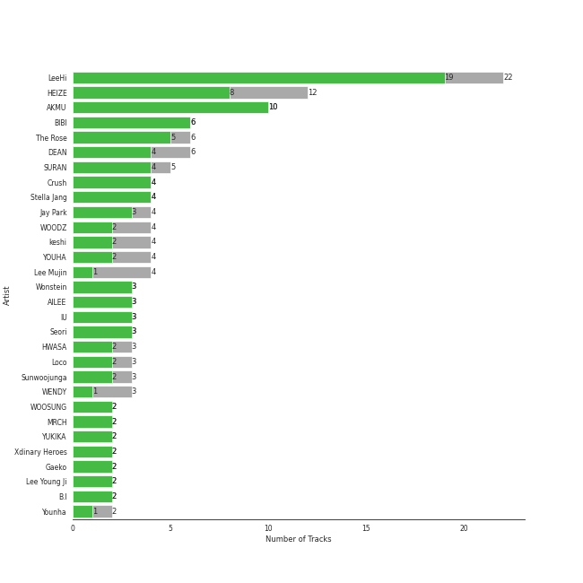
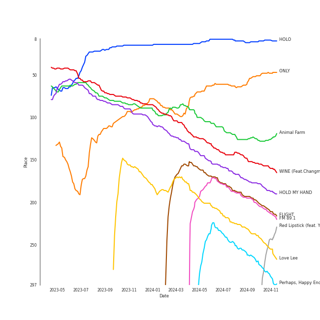
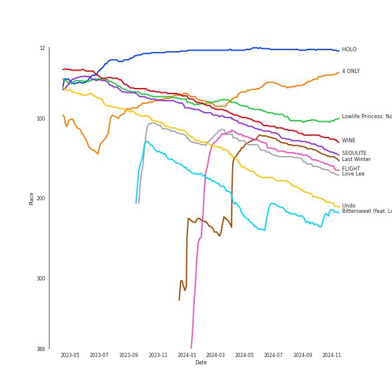
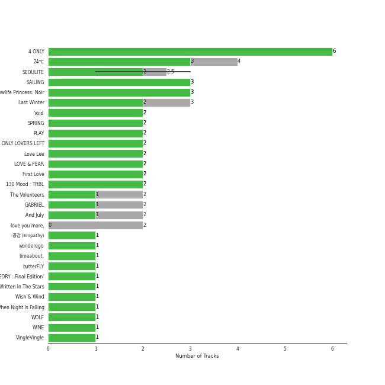
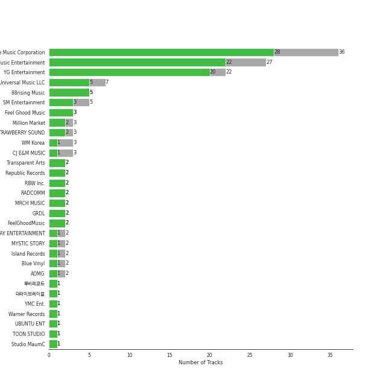

# K-Pop-Adjacent

[142 tracks (107 liked) 🔗](https://open.spotify.com/playlist/5dr8e1QSb4e5pnMwT79MGd)

[See Track Features](audio_features.md)

[See Clusters](clusters/overview.md)

## Top Artists

| Art | Rank | Tracks | 💚 | Artist | 🔗 |
|:---|---:|---:|---:|:---|:---|
|  | 11 | 22 | 19 | [LeeHi](../../artists/leehi/overview.md) | [🔗](https://open.spotify.com/artist/7cVZApDoQZpS447nHTsNqu) |
|  | 65 | 10 | 10 | [AKMU](../../artists/akmu/overview.md) | [🔗](https://open.spotify.com/artist/6OwKE9Ez6ALxpTaKcT5ayv) |
|  | 37 | 12 | 8 | [HEIZE](../../artists/heize/overview.md) | [🔗](https://open.spotify.com/artist/5dCvSnVduaFleCnyy98JMo) |
|  | 69 | 6 | 6 | [BIBI](../../artists/bibi/overview.md) | [🔗](https://open.spotify.com/artist/6UbmqUEgjLA6jAcXwbM1Z9) |
|  | 409 | 6 | 5 | [The Rose](../../artists/the_rose/overview.md) | [🔗](https://open.spotify.com/artist/5na1LmEmK2VzNLje9snJYW) |
|  | 344 | 6 | 4 | DEAN | [🔗](https://open.spotify.com/artist/3eCd0TZrBPm2n9cDG6yWfF) |
|  | 101 | 5 | 4 | SURAN | [🔗](https://open.spotify.com/artist/1mORehSVEd7lcaT2d7Sl2K) |
|  | 175 | 4 | 4 | [Crush](../../artists/crush/overview.md) | [🔗](https://open.spotify.com/artist/6aLdhHUqgdKE86xbtNmY8g) |
|  | 194 | 4 | 4 | Stella Jang | [🔗](https://open.spotify.com/artist/2Y9AUayH5pyZpVfkDYDfJV) |
|  | 311 | 4 | 3 | Jay Park | [🔗](https://open.spotify.com/artist/4XDi67ZENZcbfKnvMnTYsI) |

See all 78 artists

| Art | Rank | Tracks | 💚 | Artist | 🔗 |
|:---|---:|---:|---:|:---|:---|
|  | 409 | 3 | 3 | Wonstein | [🔗](https://open.spotify.com/artist/5o615XColiSVMPDWlslKSk) |
|  | 78 | 3 | 3 | AILEE | [🔗](https://open.spotify.com/artist/3uGFTJ7JMllvhgGpumieHF) |
|  | 4 | 3 | 3 | [IU](../../artists/iu/overview.md) | [🔗](https://open.spotify.com/artist/3HqSLMAZ3g3d5poNaI7GOU) |
|  | 395 | 3 | 3 | Seori | [🔗](https://open.spotify.com/artist/2bWTIIQP9zaVc55RaMGu7e) |
|  | 409 | 4 | 2 | WOODZ | [🔗](https://open.spotify.com/artist/6y9nlaoynxSvoTGY09Vdcy) |
|  | 197 | 4 | 2 | keshi | [🔗](https://open.spotify.com/artist/3pc0bOVB5whxmD50W79wwO) |
|  | 112 | 4 | 2 | YOUHA | [🔗](https://open.spotify.com/artist/2lZFlNiQMLa2fuX3pkXcan) |
|  | 42 | 3 | 2 | [HWASA](../../artists/hwasa/overview.md) | [🔗](https://open.spotify.com/artist/7bmYpVgQub656uNTu6qGNQ) |
|  | 220 | 3 | 2 | Loco | [🔗](https://open.spotify.com/artist/2e4G04F77jxVuDYo44TCSm) |
|  | 359 | 2 | 2 | WOOSUNG | [🔗](https://open.spotify.com/artist/5LHu1iF8m0XtRBEJbbwSoo) |
|  | 132 | 2 | 2 | MRCH | [🔗](https://open.spotify.com/artist/4S0q5n7ZzNzeiW0dAUnYHl) |
|  | 409 | 2 | 2 | YUKIKA | [🔗](https://open.spotify.com/artist/4RfI1z9u2xIc5Qnqac4JbO) |
|  | 376 | 2 | 2 | Xdinary Heroes | [🔗](https://open.spotify.com/artist/1khChLj7REGqjM043PlYyn) |
|  | 345 | 2 | 2 | Gaeko | [🔗](https://open.spotify.com/artist/0tkHE1pQ5ZCgQb8WZ0ba79) |
|  | 64 | 2 | 2 | Lee Young Ji | [🔗](https://open.spotify.com/artist/0Y2AcMPMpeuPXtPQGVvRBq) |
|  | 392 | 2 | 2 | B.I | [🔗](https://open.spotify.com/artist/0UntV1Bw2hk3fbRrm9eMP6) |
|  | 239 | 4 | 1 | Lee Mujin | [🔗](https://open.spotify.com/artist/4Xj0peBt3EZHbdF20JmdWC) |
|  | 28 | 3 | 1 | [WENDY](../../artists/wendy/overview.md) | [🔗](https://open.spotify.com/artist/0FRUZvZNPzM3YJMABJxf2K) |
|  | 165 | 2 | 1 | Younha | [🔗](https://open.spotify.com/artist/6GwM5CHqhWXzG3l5kzRSAS) |
|  | 171 | 2 | 1 | LUCY | [🔗](https://open.spotify.com/artist/4eh2JeBpQaScfHKKXZh5vO) |
|  | 409 | 2 | 1 | The Volunteers | [🔗](https://open.spotify.com/artist/2jLHrOkh1M5rLJgnrgfQf1) |
|  | 287 | 2 | 1 | Sandeul | [🔗](https://open.spotify.com/artist/2QeJBmgBdpH4i3uJns5Rdx) |
|  | 409 | 2 | 1 | Sunwoojunga | [🔗](https://open.spotify.com/artist/04L3elxyr0XFua2Ek3domW) |
| | 409 | 1 | 1 | 최현석 | [🔗](https://open.spotify.com/artist/7ywGEr53ogVxLibBcb82JV) |
|  | 383 | 1 | 1 | WOOGIE | [🔗](https://open.spotify.com/artist/7C0lSOS41UnTbnF7bMSEWN) |
|  | 409 | 1 | 1 | SHAUN | [🔗](https://open.spotify.com/artist/72nLe76yBFSlP6VBzME358) |
|  | 409 | 1 | 1 | Junggigo | [🔗](https://open.spotify.com/artist/6zTIxEXFWjoNu2VXauDITb) |
|  | 409 | 1 | 1 | Yerin Baek | [🔗](https://open.spotify.com/artist/6dhfy4ByARPJdPtMyrUYJK) |
|  | 143 | 1 | 1 | TAEYONG | [🔗](https://open.spotify.com/artist/6SKusTjOAPsTZ6kareKQdm) |
|  | 409 | 1 | 1 | John Legend | [🔗](https://open.spotify.com/artist/5y2Xq6xcjJb2jVM54GHK3t) |
|  | 409 | 1 | 1 | EyeLoveBrandon | [🔗](https://open.spotify.com/artist/5nlf0Hcw7PI00zee655ZYX) |
|  | 191 | 1 | 1 | MINGYU | [🔗](https://open.spotify.com/artist/5gUpo0BRmo6EOTbyU3z5Ay) |
|  | 409 | 1 | 1 | We Are The Night | [🔗](https://open.spotify.com/artist/5UT1mOF7JAjcc7e3wen8vw) |
|  | 409 | 1 | 1 | Dynamicduo | [🔗](https://open.spotify.com/artist/4nvFFLtv7ZqoTr83387uK4) |
|  | 409 | 1 | 1 | Sam Kim | [🔗](https://open.spotify.com/artist/4BBN286rBKyCWsSPq2cxYO) |
|  | 190 | 1 | 1 | WONWOO | [🔗](https://open.spotify.com/artist/3rHcBT06Vb1XGVUWhDALZt) |
|  | 100 | 1 | 1 | CHANGMO | [🔗](https://open.spotify.com/artist/3hvinNZRzTLoREmqFiKr1b) |
|  | 409 | 1 | 1 | SOYOU | [🔗](https://open.spotify.com/artist/3b4kLCI0ZJW47TFsNRqgCb) |
|  | 409 | 1 | 1 | pH-1 | [🔗](https://open.spotify.com/artist/2u7CP5T30c8ctenzXgEV1W) |
|  | 409 | 1 | 1 | george | [🔗](https://open.spotify.com/artist/2pRZp2WxvnWWiSPcSSYkNV) |
|  | 409 | 1 | 1 | LUNCH | [🔗](https://open.spotify.com/artist/2UVzzx3MOPYV3l6xW2lzBv) |
|  | 219 | 1 | 1 | Punch | [🔗](https://open.spotify.com/artist/2FgZrgTMX6Sk0VNcOsEPmm) |
|  | 409 | 1 | 1 | D.O. | [🔗](https://open.spotify.com/artist/2CQZr2RPZmrcvDnaod1ldC) |
|  | 409 | 1 | 1 | lIlBOI | [🔗](https://open.spotify.com/artist/25wMXkplvEHJpJHX8A6Ved) |
|  | 73 | 1 | 1 | [Jackson Wang](../../artists/jackson_wang/overview.md) | [🔗](https://open.spotify.com/artist/1kfWoWgCugPkyxQP8lkRlY) |
|  | 167 | 1 | 1 | Moon Byul | [🔗](https://open.spotify.com/artist/1eTft3tXynrKdo6XD7QHLL) |
|  | 409 | 1 | 1 | MAX | [🔗](https://open.spotify.com/artist/1bqxdqvUtPWZri43cKHac8) |
|  | 225 | 1 | 1 | YOON MIRAE | [🔗](https://open.spotify.com/artist/1Do4bSzfUl0KWL9r1fITu0) |
|  | 409 | 1 | 1 | Dok2 | [🔗](https://open.spotify.com/artist/0rW6fVd3yuW2CF2sLYWQtE) |
|  | 409 | 1 | 1 | dj friz | [🔗](https://open.spotify.com/artist/0js3wKXyi7RL11sfOykRt1) |
|  | 409 | 1 | 1 | Sarah Kang | [🔗](https://open.spotify.com/artist/0MBNzfGHTiPYag4DupDXUj) |
|  | 409 | 1 | 1 | Coogie | [🔗](https://open.spotify.com/artist/0IznZPMUyaPGdqfP4oqBja) |
|  | 400 | 2 | 0 | Whee In | [🔗](https://open.spotify.com/artist/0BqRGrwqndrtNkojXiqIzL) |
|  | 396 | 1 | 0 | Basick | [🔗](https://open.spotify.com/artist/7pXKdkQsYFCMG2omRxheJ2) |
|  | 409 | 1 | 0 | MeloMance | [🔗](https://open.spotify.com/artist/6k4r73Wq8nhkCDoUsECL1e) |
|  | 409 | 1 | 0 | Busker Busker | [🔗](https://open.spotify.com/artist/6jgrgDBt1SbtNbc25sLaTH) |
|  | 409 | 1 | 0 | Onestar | [🔗](https://open.spotify.com/artist/6EmgTIhhXGtfAmYYTfdtlz) |
|  | 409 | 1 | 0 | Rolling Quartz | [🔗](https://open.spotify.com/artist/5mVYT7sPm3xsNMrA8YWONe) |
|  | 409 | 1 | 0 | GSoul | [🔗](https://open.spotify.com/artist/4oEXworvhegyK83rZwVyWL) |
|  | 409 | 1 | 0 | YongYong | [🔗](https://open.spotify.com/artist/4lgoUoPxqxjZMtN0raCBVK) |
|  | 409 | 1 | 0 | dori | [🔗](https://open.spotify.com/artist/4Db1gte7TUAeZyRdo4FLE7) |
|  | 409 | 1 | 0 | cherryfilter | [🔗](https://open.spotify.com/artist/3uk3Jz2yT37niCo3c5GMf2) |
| | 409 | 1 | 0 | Uhm Jung Hwa | [🔗](https://open.spotify.com/artist/2ahy4G7Txxqq8WgNA913g0) |
|  | 409 | 1 | 0 | Eric Nam | [🔗](https://open.spotify.com/artist/2FLqlgckDKdmpBrvLAT5BM) |
|  | 409 | 1 | 0 | ZENE THE ZILLA | [🔗](https://open.spotify.com/artist/1MMbv4LTpwbh2APtXuwaZN) |
|  | 409 | 1 | 0 | G.Soul | [🔗](https://open.spotify.com/artist/0fLesFHNsJpalRtqzSYxnd) |
|  | 409 | 1 | 0 | Ugly Duck | [🔗](https://open.spotify.com/artist/0Qr4St9aCOLu41Nt5QZIz1) |
|  | 409 | 1 | 0 | SUMIN | [🔗](https://open.spotify.com/artist/0K4MGKGmjtdIE0W3GkGmyU) |

## Top Tracks

Most and least listened tracks

| Rank | ​ | Most listened tracks | Rank | ​​ | Least listened tracks |
|---:|:---|:---|---:|:---|:---|
| 8 |  | [HOLO](../../artists/leehi/overview.md) | 894 |  | [Sorry](../../artists/the_rose/overview.md) |
| 62 |  | [ONLY](../../artists/leehi/overview.md) | 894 |  | DIE 4 YOU |
| 120 |  | [Animal Farm](../../artists/bibi/overview.md) | 894 |  | [RE-BYE](../../artists/akmu/overview.md) |
| 140 |  | WINE (Feat.Changmo) (Prod. SUGA) | 894 |  | Your Existence |
| 161 |  | [HOLD MY HAND](../../artists/leehi/overview.md) | 894 |  | [Red Lipstick (feat. Yoonmirae)](../../artists/leehi/overview.md) |
| 176 |  | FLIGHT | 894 |  | like i need u |
| 181 |  | [FM 89.1](../../artists/heize/overview.md) | 894 |  | [Waterride](../../artists/leehi/overview.md) |
| 219 |  | [Love Lee](../../artists/akmu/overview.md) | 894 |  | [Intentions](../../artists/leehi/overview.md) |
| 230 |  | [Undo](../../artists/heize/overview.md) | 894 |  | UNDERSTAND |
| 233 |  | [Perhaps, Happy Ending](../../artists/heize/overview.md) | 894 |  | Summer Is for Falling in Love |

## Top Albums

| Art | Rank | Tracks | 💚 | Album | Release Date | 🔗 |
|:---|---:|---:|---:|:---|:---|:---|
|  | 58 | 6 | 6 | 4 ONLY | 2021-09-09 | [🔗](https://open.spotify.com/album/1DKgZeAYrjslAPZVMe6EFt) |
|  | 278 | 4 | 3 | 24℃ | 2019-05-30 | [🔗](https://open.spotify.com/album/5u9CP1NknadV33hZepVEy5) |
|  | 124 | 3 | 3 | SEOULITE | 2016-03-09 | [🔗](https://open.spotify.com/album/2c41Flo2HQgy0A9P3xuSFf) |
|  | 267 | 3 | 3 | SAILING | 2019-09-25 | [🔗](https://open.spotify.com/album/7C0Ci0alKWwwXPIFYEdVcn) |
|  | 97 | 3 | 3 | Lowlife Princess: Noir | 2022-11-18 | [🔗](https://open.spotify.com/album/0AwCgoJKJUOgLp1imhnxuH) |
|  | 128 | 3 | 2 | Last Winter | 2023-12-07 | [🔗](https://open.spotify.com/album/41vj1sO4NJFriquGszDSh5) |
|  | 599 | 2 | 2 | Void | 2018-04-16 | [🔗](https://open.spotify.com/album/6kdRAzt9oU3X9eUdeTB0Yk) |
|  | 462 | 2 | 2 | SPRING | 2016-05-04 | [🔗](https://open.spotify.com/album/0HtbFp1B1WrbUr9mcBrAhN) |
|  | 482 | 2 | 2 | PLAY | 2014-04-07 | [🔗](https://open.spotify.com/album/1eu07xRE0vQfN5et0Y3DAy) |
|  | 599 | 2 | 2 | ONLY LOVERS LEFT | 2021-10-05 | [🔗](https://open.spotify.com/album/1u9nYBB0Qw5jyjkexe9Xk6) |

See top 100 albums

| Art | Rank | Tracks | 💚 | Album | Release Date | 🔗 |
|:---|---:|---:|---:|:---|:---|:---|
|  | 148 | 2 | 2 | Love Lee | 2023-08-21 | [🔗](https://open.spotify.com/album/47xcjDSi1t6pQE2RvXKdUF) |
|  | 418 | 2 | 2 | LOVE & FEAR | 2022-12-12 | [🔗](https://open.spotify.com/album/2zsnrnJPMZY56QgIdc647c) |
|  | 599 | 2 | 2 | First Love | 2013-03-28 | [🔗](https://open.spotify.com/album/74thqvuyVQfosFffvKx2uo) |
|  | 473 | 2 | 2 | 130 Mood : TRBL | 2016-03-25 | [🔗](https://open.spotify.com/album/1MW3txTS49ZGvyLi0fziLU) |
|  | 599 | 2 | 1 | The Volunteers | 2021-05-27 | [🔗](https://open.spotify.com/album/0hwXFwuvVfZwn6asTargTD) |
|  | 599 | 2 | 1 | SEOULITE | 2016-04-20 | [🔗](https://open.spotify.com/album/3cGyWEJaQlj7kCdKBCOGeb) |
|  | 599 | 2 | 1 | GABRIEL | 2022-03-25 | [🔗](https://open.spotify.com/album/1WVIJaAboRSwJOe4u0n0Q7) |
|  | 599 | 2 | 1 | And July | 2016-07-18 | [🔗](https://open.spotify.com/album/3xUWeFeLn6m3NXKr0FlT3E) |
|  | 599 | 2 | 0 | love you more, | 2022-08-25 | [🔗](https://open.spotify.com/album/3g2OiEeQKfggUe6ViYeLSC) |
|  | 599 | 1 | 1 | 공감 (Empathy) - The 1st Mini Album | 2021-07-26 | [🔗](https://open.spotify.com/album/4dqWy2Soq1Z1rqgKfXOATk) |
|  | 265 | 1 | 1 | wonderego | 2023-11-14 | [🔗](https://open.spotify.com/album/7ikvq6MB2VhB2IPCDO6RnP) |
|  | 599 | 1 | 1 | timeabout, | 2021-04-07 | [🔗](https://open.spotify.com/album/1cBAfX0otvkoIOI6HtOrAc) |
|  | 599 | 1 | 1 | butterFLY | 2019-07-02 | [🔗](https://open.spotify.com/album/7klpmNtYwM5Q0fCRIdC21I) |
|  | 367 | 1 | 1 | YOUNHA 6th Album Repackage 'END THEORY : Final Edition' | 2022-03-30 | [🔗](https://open.spotify.com/album/63mur6I6yCG9cOxOst3i7c) |
|  | 599 | 1 | 1 | Written In The Stars | 2018-10-11 | [🔗](https://open.spotify.com/album/08z3DsL7P6RpBR3FgNMSvN) |
|  | 599 | 1 | 1 | Wish & Wind | 2018-03-08 | [🔗](https://open.spotify.com/album/5Fs2dlwUz1zkNcUPu6KaKF) |
|  | 599 | 1 | 1 | When Night Is Falling | 2021-07-07 | [🔗](https://open.spotify.com/album/3nOIsILeko2meMblKEGYZw) |
|  | 599 | 1 | 1 | WOLF | 2019-07-26 | [🔗](https://open.spotify.com/album/1V60S7FEby9fQwh5eVluj8) |
|  | 108 | 1 | 1 | WINE | 2017-04-27 | [🔗](https://open.spotify.com/album/26adxLsliyYcCfVTF6xA75) |
|  | 205 | 1 | 1 | VingleVingle | 2023-04-05 | [🔗](https://open.spotify.com/album/10Ldh1KXu0ySjpfiX6qLXQ) |
|  | 165 | 1 | 1 | Undo | 2022-06-30 | [🔗](https://open.spotify.com/album/2xR7YEyRweqClzs50bbW3J) |
|  | 599 | 1 | 1 | Under Caffeine | 2018-09-01 | [🔗](https://open.spotify.com/album/0xx0aVmnZiiqsFfKRTXOJp) |
|  | 348 | 1 | 1 | Twenty-Five Twenty-One OST | 2022-04-03 | [🔗](https://open.spotify.com/album/77NPr874WU941XZhjO43dR) |
|  | 538 | 1 | 1 | Troubleshooting | 2024-04-30 | [🔗](https://open.spotify.com/album/26ogXm7X0kUSidtoaQVBei) |
|  | 285 | 1 | 1 | Traffic light | 2021-05-14 | [🔗](https://open.spotify.com/album/4lHGpxL8peLQSZRgl1Lssm) |
|  | 599 | 1 | 1 | Tiramisu Cake | 2015-04-29 | [🔗](https://open.spotify.com/album/3eAZuza8f2Ga4IG1KUDc2j) |
|  | 599 | 1 | 1 | The Hyena on the Keyboard Pt. 4 | 2018-04-21 | [🔗](https://open.spotify.com/album/2fMMk4DD96UcAmSczUQ0kq) |
|  | 599 | 1 | 1 | Take | 2018-06-27 | [🔗](https://open.spotify.com/album/1NgwpxtZFd1x4DbC74V9bO) |
|  | 599 | 1 | 1 | Sun And Moon | 2018-11-22 | [🔗](https://open.spotify.com/album/0AsQlY5YENtlvd8SLnrSxX) |
|  | 599 | 1 | 1 | Summer Is for Falling in Love | 2020-07-31 | [🔗](https://open.spotify.com/album/1P5LIeSXzyMqjWjNtB2wG0) |
|  | 599 | 1 | 1 | Strong Woman Do Bong Soon, Pt. 2 (Original Television Soundtrack) | 2017-03-04 | [🔗](https://open.spotify.com/album/21jYCYSrxo7IEO67xH6XeN) |
|  | 599 | 1 | 1 | Street Woman Fighter2 (SWF2) Class Mission | 2023-09-05 | [🔗](https://open.spotify.com/album/3fifgTm6PcVhHE9v72nlCb) |
|  | 599 | 1 | 1 | Stairs | 2021-10-15 | [🔗](https://open.spotify.com/album/0s3ME19b7uNfrBvKXBFwM7) |
|  | 599 | 1 | 1 | Sorry | 2017-08-03 | [🔗](https://open.spotify.com/album/6D48tHXsa6LzoViDIACdkt) |
|  | 599 | 1 | 1 | Some | 2014-02-07 | [🔗](https://open.spotify.com/album/2r1oAmMSnUasXigJ2fTwk6) |
|  | 356 | 1 | 1 | Slightly Tipsy (She is My Type♡ X SANDEUL) | 2020-07-20 | [🔗](https://open.spotify.com/album/2bal48tjyi26OAxY2KxwFL) |
|  | 599 | 1 | 1 | Shutdown (Feat. Seori) | 2021-12-30 | [🔗](https://open.spotify.com/album/3qGgRGX3KHbwph4AzWVko1) |
|  | 599 | 1 | 1 | STELLA I | 2020-04-07 | [🔗](https://open.spotify.com/album/1TCX395u7CaSsCLtiwsMAN) |
|  | 599 | 1 | 1 | SHOW ME THE MONEY 11 Episode 3 | 2022-12-17 | [🔗](https://open.spotify.com/album/5LsGOvNXMG46qugdghRGRF) |
|  | 572 | 1 | 1 | Remarriage and Desires (Original Soundtrack from The Netflix Series) | 2022-07-15 | [🔗](https://open.spotify.com/album/2YM9Oahck5kVuWGiFQK1dg) |
|  | 599 | 1 | 1 | RED | 2019-08-13 | [🔗](https://open.spotify.com/album/5CrMZwZuJcDpzFmMO35vxN) |
|  | 599 | 1 | 1 | PANORAMA | 2020-08-13 | [🔗](https://open.spotify.com/album/5KCwE9Ev3dhkvQOzPCR6Yx) |
|  | 560 | 1 | 1 | NEXT EPISODE | 2021-07-26 | [🔗](https://open.spotify.com/album/0Pt0eGpyNO5dDN8PORypSy) |
|  | 599 | 1 | 1 | NEON | 2019-02-22 | [🔗](https://open.spotify.com/album/2tF9C0qTzRdaZShK4iK0UD) |
|  | 250 | 1 | 1 | Moonlovers - Scarlet Heart Ryeo (Original Television Soundtrack), Pt. 2 | 2016-08-29 | [🔗](https://open.spotify.com/album/68xTLBWjoRADRf86WYmTmy) |
|  | 599 | 1 | 1 | MOTH | 2022-05-13 | [🔗](https://open.spotify.com/album/7JdpeV87hczflCV8GXF3yV) |
|  | 599 | 1 | 1 | MOMMAE | 2015-05-22 | [🔗](https://open.spotify.com/album/1kgzGqeJbY7gwiheabVk1L) |
|  | 599 | 1 | 1 | Love Theory - SM STATION | 2022-04-14 | [🔗](https://open.spotify.com/album/2i27IzG4jFQjX7pS5L6TIu) |
|  | 599 | 1 | 1 | Love Story | 2017-11-10 | [🔗](https://open.spotify.com/album/0H9qbHCWJRmKAhERqM5X9G) |
|  | 402 | 1 | 1 | KAZINO | 2020-04-29 | [🔗](https://open.spotify.com/album/1f9cws6SZ0iKoHrcmn39ZY) |
|  | 599 | 1 | 1 | Invitation | 2012-10-16 | [🔗](https://open.spotify.com/album/61scVtZ044GUBV4rIvOcPQ) |
|  | 599 | 1 | 1 | IT'S YOU (feat. keshi) | 2022-09-09 | [🔗](https://open.spotify.com/album/1LtaBRxkVaAnoTSQQsWjJF) |
|  | 587 | 1 | 1 | I'M LOVIN' AMY | 2022-03-07 | [🔗](https://open.spotify.com/album/1N3ZneaWp9SVREC9JSgsia) |
|  | 599 | 1 | 1 | I Don't Need You | 2020-06-07 | [🔗](https://open.spotify.com/album/6W4mS8VsOi2WAkkMuh9SJ9) |
|  | 554 | 1 | 1 | Hwa:telier | 2019-10-11 | [🔗](https://open.spotify.com/album/20xEJwUlmfoSLoK5AhEucL) |
|  | 415 | 1 | 1 | Hongdae R&B | 2023-08-31 | [🔗](https://open.spotify.com/album/7v7uC2wkD1Jh95G9Y5gbJb) |
|  | 599 | 1 | 1 | Hello, world! | 2022-07-20 | [🔗](https://open.spotify.com/album/5zjnlpEemkmaN6iv16vmDm) |
|  | 14 | 1 | 1 | HOLO | 2020-07-23 | [🔗](https://open.spotify.com/album/5xq9sm0jGMMDu5LifpBBo1) |
|  | 599 | 1 | 1 | HEAL | 2022-10-07 | [🔗](https://open.spotify.com/album/2n44vkxj8L01ma7nHfXNJW) |
|  | 599 | 1 | 1 | HAPPEN | 2021-05-20 | [🔗](https://open.spotify.com/album/4xOOB79WcZuOoVwK06No1s) |
|  | 599 | 1 | 1 | GANADARA | 2022-03-11 | [🔗](https://open.spotify.com/album/4cwyl5ynvYVojZRbZ3dSFH) |
|  | 279 | 1 | 1 | For You | 2020-12-16 | [🔗](https://open.spotify.com/album/6hiwkmlOoNm8F3UkAZJcEz) |
|  | 599 | 1 | 1 | First Sight | 2018-12-14 | [🔗](https://open.spotify.com/album/5M9f9Tze7sspUDrIAjdCgV) |
|  | 503 | 1 | 1 | Feeling Lucky | 2024-04-26 | [🔗](https://open.spotify.com/album/4bc9PfPyv60qCh5S5g5eMb) |
|  | 135 | 1 | 1 | FLIGHT | 2023-10-17 | [🔗](https://open.spotify.com/album/079CeHOeWqD0AUwmPUIhXv) |
|  | 599 | 1 | 1 | EVERYTHING YOU WANTED | 2016-10-20 | [🔗](https://open.spotify.com/album/0c4LKBzh0ufU36AyuzZRc2) |
|  | 599 | 1 | 1 | DIE 4 YOU | 2023-11-18 | [🔗](https://open.spotify.com/album/0FMkdX3YNx7Ez7pv3XRGzr) |
|  | 599 | 1 | 1 | Colors | 2016-10-06 | [🔗](https://open.spotify.com/album/419WgjPNItZIDgjd1GSgrO) |
|  | 309 | 1 | 1 | Cherry On Top | 2021-08-10 | [🔗](https://open.spotify.com/album/7sEDri9xLbg6a27CPoD1v2) |
|  | 599 | 1 | 1 | Cat | 2017-12-28 | [🔗](https://open.spotify.com/album/3b8iQhtbLD0Vn4EqQzMC3N) |
|  | 599 | 1 | 1 | Can't Stop This Party | 2022-03-22 | [🔗](https://open.spotify.com/album/6nG0PLR5YgP7tHYKfwhiOI) |
|  | 599 | 1 | 1 | Bye Bye My Blue | 2016-06-20 | [🔗](https://open.spotify.com/album/22qM69DGAvUsSyQfVh8Lgm) |
|  | 599 | 1 | 1 | Boat | 2017-11-17 | [🔗](https://open.spotify.com/album/02uMD7AxTNi2Af2H4DxfPO) |
|  | 216 | 1 | 1 | Bittersweet (feat. LeeHi) | 2021-05-28 | [🔗](https://open.spotify.com/album/6qVk855QPCh57noNeeHMXQ) |
|  | 599 | 1 | 1 | Abyss (Original Television Soundtrack), Pt. 1 | 2019-05-14 | [🔗](https://open.spotify.com/album/0OLyahO2nuY0qQKoykd7Vy) |
|  | 401 | 1 | 1 | 1,2,3,4 | 2012-10-29 | [🔗](https://open.spotify.com/album/6yYc7Ag6nVB3HVXzLjF9uz) |
|  | 599 | 1 | 0 | 봄인가 봐 Spring Love - SM STATION | 2016-03-04 | [🔗](https://open.spotify.com/album/1DzMyEZcFmD72jdkp4O73D) |
|  | 599 | 1 | 0 | When it snows(Feat.Heize) | 2021-12-03 | [🔗](https://open.spotify.com/album/1d2YKQ02RQA97EyrB55ZcK) |
|  | 576 | 1 | 0 | When It Snows mmm (feat. Wheein) | 2020-12-23 | [🔗](https://open.spotify.com/album/5z8FBqt7BCXR6MB5fzy7L3) |
|  | 599 | 1 | 0 | Walkin' | 2017-06-02 | [🔗](https://open.spotify.com/album/2T09zKIYfKNHMOAkwHpEwp) |
|  | 599 | 1 | 0 | WORLDWIDE | 2015-11-05 | [🔗](https://open.spotify.com/album/5vESroqrGYDxDPAwUceQxf) |
|  | 599 | 1 | 0 | THE REAPER | 2018-11-13 | [🔗](https://open.spotify.com/album/1hM5xkleU8wr2yOaY2gCMB) |
|  | 599 | 1 | 0 | Sweet (A Business Proposal OST Part.1) | 2022-02-28 | [🔗](https://open.spotify.com/album/2bB29MkoBHc7vm2fr2EdiZ) |
|  | 599 | 1 | 0 | Supersonic | 2012-07-03 | [🔗](https://open.spotify.com/album/1n4Qyjro1E8gbqKlaZxhyM) |
|  | 599 | 1 | 0 | Stay As You Are | 2016-10-04 | [🔗](https://open.spotify.com/album/6DKfXf0BVP9R5BcOuD1mfo) |
|  | 599 | 1 | 0 | Somebody | 2022-07-25 | [🔗](https://open.spotify.com/album/40XK96MKBOb5BjAU8QAIfN) |
|  | 599 | 1 | 0 | Serenade | 2019-12-12 | [🔗](https://open.spotify.com/album/2McJE8dHLru3MgR1bcxdyF) |
|  | 599 | 1 | 0 | POOL[pu:l] | 2018-05-12 | [🔗](https://open.spotify.com/album/4qIn1bOjIOsvHOs7WGPloF) |
|  | 599 | 1 | 0 | Natural | 2021-12-02 | [🔗](https://open.spotify.com/album/2yOqQbBoXX0nNPBqts1dmZ) |
|  | 599 | 1 | 0 | Moonlovers: Scarlet Heart Ryeo (Original Television Soundtrack), Pt 10 | 2016-10-04 | [🔗](https://open.spotify.com/album/1xzKCVdDE3tIXkEGDjLQ7E) |

## Top Record Labels

| Tracks | 💚 | Label |
|---:|---:|:---|
| 36 | 28 | [Genie Music Corporation](../../labels/genie_music_corporation/overview.md) |
| 27 | 22 | [Stone Music Entertainment](../../labels/stone_music_entertainment/overview.md) |
| 22 | 20 | [YG Entertainment](../../labels/yg_entertainment/overview.md) |
| 7 | 5 | [Universal Music LLC](../../labels/universal_music_llc/overview.md) |
| 5 | 5 | [88rising Music](../../labels/88rising_music/overview.md) |
| 5 | 3 | [SM Entertainment](../../labels/sm_entertainment/overview.md) |
| 3 | 3 | Feel Ghood Music |
| 3 | 2 | Million Market |
| 2 | 2 | Transparent Arts |
| 2 | 2 | [Republic Records](../../labels/republic_records/overview.md) |

See all 58 labels

| Tracks | 💚 | Label |
|---:|---:|:---|
| 2 | 2 | [RBW Inc.](../../labels/rbw_inc_/overview.md) |
| 2 | 2 | RADCOMM |
| 2 | 2 | MRCH MUSIC |
| 2 | 2 | GRDL |
| 2 | 2 | FeelGhoodMusic |
| 3 | 1 | [WM Korea](../../labels/wm_korea/overview.md) |
| 3 | 1 | CJ E&M MUSIC |
| 2 | 1 | ShowPLAY ENTERTAINMENT |
| 2 | 1 | [MYSTIC STORY](../../labels/mystic_story/overview.md) |
| 2 | 1 | MAGIC STRAWBERRY SOUND |
| 2 | 1 | [Island Records](../../labels/island_records/overview.md) |
| 2 | 1 | Blue Vinyl |
| 2 | 1 | AOMG |
| 1 | 1 | 루비레코드 |
| 1 | 1 | 더라이브레이블 |
| 1 | 1 | YMC Ent. |
| 1 | 1 | [Warner Records](../../labels/warner_records/overview.md) |
| 1 | 1 | UBUNTU ENT |
| 1 | 1 | TOON STUDIO |
| 1 | 1 | Studio MaumC |
| 1 | 1 | Starship Ent. |
| 1 | 1 | Sarah Kang |
| 1 | 1 | [PLEDIS Entertainment](../../labels/pledis_entertainment/overview.md) |
| 1 | 1 | P NATION |
| 1 | 1 | MORE VISION |
| 1 | 1 | [JYP Entertainment](../../labels/jyp_entertainment/overview.md) |
| 1 | 1 | JTBC Studios |
| 1 | 1 | JS MUSIC |
| 1 | 1 | Hwa&Dam pictures |
| 1 | 1 | GRANDLINE |
| 1 | 1 | GLG |
| 1 | 1 | ESTIMATE |
| 1 | 1 | DCTOM |
| 1 | 1 | CRAFT AND JUN |
| 1 | 1 | C9 Entertainment |
| 1 | 1 | Antenna |
| 1 | 1 | ATISPAUS |
| 1 | 0 | ㈜RBW |
| 1 | 0 | dori |
| 1 | 0 | YUEHUA Entertainment |
| 1 | 0 | [WM Entertainment](../../labels/wm_entertainment/overview.md) |
| 1 | 0 | United Common Records |
| 1 | 0 | Today's Playlist |
| 1 | 0 | SAURUS |
| 1 | 0 | Rolling Star Ent. |
| 1 | 0 | RIAK |
| 1 | 0 | Music Farm |
| 1 | 0 | FLEX M |

## Genres

| Tracks | 💚 | Genre |
|---:|---:|:---|
| 89 | 75 | [k-pop](../../genres/k-pop/overview.md) |
| 42 | 33 | [korean r&b](../../genres/korean_r_b/overview.md) |
| 23 | 13 | [korean pop](../../genres/korean_pop/overview.md) |
| 8 | 7 | [k-pop boy group](../../genres/k-pop_boy_group/overview.md) |
| 7 | 7 | korean city pop |
| 10 | 6 | [k-rap](../../genres/k-rap/overview.md) |
| 10 | 5 | k-indie |
| 2 | 2 | korean ost |
| 3 | 1 | chill r&b |
| 2 | 1 | korean superband |

See all 19 genres

| Tracks | 💚 | Genre |
|---:|---:|:---|
| 1 | 1 | [viral pop](../../genres/viral_pop/overview.md) |
| 1 | 1 | teen pop |
| 1 | 1 | singer-songwriter pop |
| 1 | 1 | nyc pop |
| 1 | 1 | korean trap |
| 1 | 1 | korean talent show |
| 1 | 1 | korean electropop |
| 3 | 0 | k-rock |
| 1 | 0 | k-pop ballad |

## Top Producers

| Art | Producer | Tracks | Credit Types |
|:---|:---|---:|:---|
|  | [BIBI](../../artists/bibi/overview.md) | 3 | Lyricist, Songwriter |
| | Tablo | 2 | Lyricist, Songwriter |
| | THE NEED | 2 | Arranger, Songwriter |
| | Kyle Scherrer | 1 | Arranger, Songwriter |
| | Max Levin | 1 | Arranger, Songwriter |
| | JONGHYUN | 1 | Lyricist, Songwriter |
|  | Dok2 | 1 | Lyricist |
| | 안신애 (Wheeler, Shinae An) | 1 | Lyricist, Songwriter |
| | Oreo | 1 | Lyricist, Songwriter |
| | 조준성 (Jo, June-sung) | 1 | Producer |

View all

| Art | Producer | Tracks | Credit Types |
|:---|:---|---:|:---|
| | [R.Tee](../../producers/r_tee/overview.md) | 1 | Producer |
| | 이찬혁 (Lee, Chanhyeok) | 1 | Lyricist, Songwriter |
| | 위프리키 (Wipeuriki) | 1 | Songwriter |
| | twlv | 1 | Songwriter |
| | 허은숙 (Heo, Eun-sook) | 1 | Producer |
|  | Stella Jang | 1 | Arranger, Lyricist, Producer, Songwriter |

## Years

View all years

| Year | Number of Tracks |
|:---|---:|
| 2024 | 2 |
| 2023 | 13 |
| [2022](2022/overview.md) | 26 |
| [2021](2021/overview.md) | 24 |
| 2020 | 12 |
| 2019 | 14 |
| 2018 | 12 |
| 2017 | 7 |
| 2016 | 18 |
| 2015 | 3 |
| 2014 | 3 |
| 2013 | 2 |
| 2012 | 4 |
| 2002 | 1 |
| 1998 | 1 |

| ​ | 10 newest albums | ​​ | 10 oldest albums |
|:---|:---|:---|:---|
|  | Troubleshooting (2024-04-30) |  | Invitation (1998-07-01) |
|  | Feeling Lucky (2024-04-26) |  | Made In Korea? (2002-08-13) |
|  | Last Winter (2023-12-07) |  | Busker Busker 1st (2012-03-29) |
|  | DIE 4 YOU (2023-11-18) |  | Supersonic (2012-07-03) |
|  | wonderego (2023-11-14) |  | Invitation (2012-10-16) |
|  | FLIGHT (2023-10-17) |  | 1,2,3,4 (2012-10-29) |
|  | Street Woman Fighter2 (SWF2) Class Mission (2023-09-05) |  | First Love (2013-03-28) |
|  | Hongdae R&B (2023-08-31) |  | Some (2014-02-07) |
|  | Love Lee (2023-08-21) |  | PLAY (2014-04-07) |
|  | Black Diaryy (2023-04-27) |  | Tiramisu Cake (2015-04-29) |