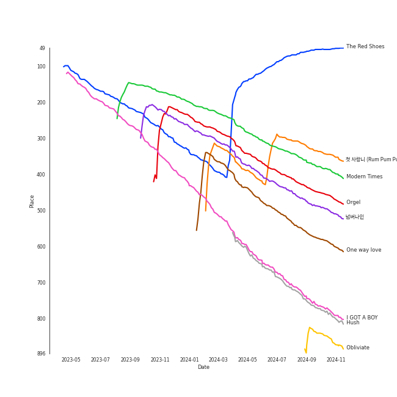

# Tracks in K-Pop from 2013

## Artists

| Art | Rank | Tracks | 💚 | Artist | 🔗 |
|:---|---:|---:|---:|:---|:---|
|  | 3 | 7 | 6 | [IU](../../../artists/iu/overview.md) | [🔗](https://open.spotify.com/artist/3HqSLMAZ3g3d5poNaI7GOU) |
|  | 165 | 2 | 2 | [f(x)](../../../artists/f(x)/overview.md) | [🔗](https://open.spotify.com/artist/3wRA5UYoo08BBKJnzyKkpF) |
|  | 21 | 2 | 1 | [Girls' Generation](../../../artists/girls__generation/overview.md) | [🔗](https://open.spotify.com/artist/0Sadg1vgvaPqGTOjxu0N6c) |
| | 434 | 1 | 1 | Jang Yi-jeong | [🔗](https://open.spotify.com/artist/7nLakaHt1koh5mP4OIVM0F) |
|  | 309 | 1 | 1 | HYOLYN | [🔗](https://open.spotify.com/artist/78sJswwVn4P8aEhkF4K6fQ) |
|  | 43 | 1 | 1 | [SUNMI](../../../artists/sunmi/overview.md) | [🔗](https://open.spotify.com/artist/6MoXcK2GyGg7FIyxPU5yW6) |
|  | 434 | 1 | 1 | Rania | [🔗](https://open.spotify.com/artist/5sUKi0QlHVxvsCzmrhJsFO) |
|  | 434 | 1 | 1 | 9MUSES | [🔗](https://open.spotify.com/artist/55tJwpPIz9BMrSLM45iEXX) |
|  | 25 | 1 | 1 | [EXO](../../../artists/exo/overview.md) | [🔗](https://open.spotify.com/artist/3cjEqqelV9zb4BYE3qDQ4O) |
|  | 61 | 1 | 1 | G-DRAGON | [🔗](https://open.spotify.com/artist/30b9WulBM8sFuBo17nNq9c) |

View all

| Art | Rank | Tracks | 💚 | Artist | 🔗 |
|:---|---:|---:|---:|:---|:---|
|  | 273 | 1 | 1 | SISTAR | [🔗](https://open.spotify.com/artist/2wTLheTmMcFCA4hdY8hZJP) |
|  | 100 | 1 | 1 | [SHINee](../../../artists/shinee/overview.md) | [🔗](https://open.spotify.com/artist/2hRQKC0gqlZGPrmUKbcchR) |
|  | 372 | 1 | 1 | miss A | [🔗](https://open.spotify.com/artist/1BEohdSWSBggmO979tzRwW) |
|  | 158 | 1 | 0 | [TVXQ!](../../../artists/tvxq!/overview.md) | [🔗](https://open.spotify.com/artist/6nVMMEywS5Y4tsHPKx1nIo) |
|  | 434 | 1 | 0 | HYUNGWOO | [🔗](https://open.spotify.com/artist/6jXDdAv7ki86GPYKb8TLto) |
|  | 434 | 1 | 0 | Zion.T | [🔗](https://open.spotify.com/artist/5HenzRvMtSrgtvU16XAoby) |
|  | 434 | 1 | 0 | Dynamicduo | [🔗](https://open.spotify.com/artist/4nvFFLtv7ZqoTr83387uK4) |
|  | 434 | 1 | 0 | Block B | [🔗](https://open.spotify.com/artist/4RnezwRV7VBJUCI1S0AE5u) |
|  | 144 | 1 | 0 | [Gain](../../../artists/gain/overview.md) | [🔗](https://open.spotify.com/artist/4R60A85t9mTZzCqJlVswuo) |
|  | 434 | 1 | 0 | Lee Hyori | [🔗](https://open.spotify.com/artist/4FjoOJAndC0s9ZJUo6VGc5) |
|  | 27 | 1 | 0 | [BTS](../../../artists/bts/overview.md) | [🔗](https://open.spotify.com/artist/3Nrfpe0tUJi4K4DXYWgMUX) |
|  | 278 | 1 | 0 | T-ARA | [🔗](https://open.spotify.com/artist/1R52cwGf75yTf7I3Q0Irf8) |

## Albums

| Art | Rank | Tracks | 💚 | Album | Release Date | 🔗 |
|:---|---:|---:|---:|:---|:---|:---|
|  | 49 | 6 | 5 | Modern Times | 2013-10-08 | [🔗](https://open.spotify.com/album/2QcuXvQBWv1ZKyQtEhLbFe) |
|  | 248 | 2 | 2 | Pink Tape - The 2nd Album | 2013-07-29 | [🔗](https://open.spotify.com/album/62tuEHFtjk3L6Xjdkzyt4z) |
|  | 529 | 2 | 1 | I GOT A BOY - The 4th Album | 2013-01-01 | [🔗](https://open.spotify.com/album/3uhihQCm9aSvdJmDXcVrvi) |
|  | 665 | 1 | 1 | The 1st Album 'XOXO' (Repackage) | 2013-08-05 | [🔗](https://open.spotify.com/album/4qduCvpyBL5hGYdBvCvcDA) |
|  | 336 | 1 | 1 | SHINee The 3rd Album 'The Misconceptions Of Us' | 2013-08-08 | [🔗](https://open.spotify.com/album/0f0brenHcU2NmUANeix9rN) |
|  | 665 | 1 | 1 | Modern Times – Epilogue | 2013-12-20 | [🔗](https://open.spotify.com/album/56MqewtCUq5bplrqEYTVL0) |
|  | 413 | 1 | 1 | LOVE & HATE | 2013-11-26 | [🔗](https://open.spotify.com/album/26FsnZOVOJDjKeWUbXuDVG) |
|  | 665 | 1 | 1 | Just go | 2013-03-08 | [🔗](https://open.spotify.com/album/4rNbLQCtgRSSCvYjk12zX3) |
|  | 540 | 1 | 1 | Hush | 2013-11-06 | [🔗](https://open.spotify.com/album/01zi2Tsa9ojYgPY5Q08aUb) |
|  | 665 | 1 | 1 | Give It To Me | 2013-06-11 | [🔗](https://open.spotify.com/album/1nErNFyYvHnuCYvfwrMyoz) |

View all

| Art | Rank | Tracks | 💚 | Album | Release Date | 🔗 |
|:---|---:|---:|---:|:---|:---|:---|
|  | 665 | 1 | 1 | DOLLS | 2013-01-24 | [🔗](https://open.spotify.com/album/3gCmOfwfMprkm469ZUyZ6m) |
|  | 665 | 1 | 1 | COUP D'ETAT | 2013-09-05 | [🔗](https://open.spotify.com/album/4msI9bSfKohOPFic15aLR4) |
|  | 665 | 1 | 1 | 24 Hours | 2013-08-26 | [🔗](https://open.spotify.com/album/4ag4tJmAksjMdxICMV83Aw) |
|  | 665 | 1 | 0 | Very Good | 2013-10-02 | [🔗](https://open.spotify.com/album/5AujjoJ3gAth9YnrIXa7Ww) |
|  | 665 | 1 | 0 | SCREAM | 2013-09-04 | [🔗](https://open.spotify.com/album/4wOSe34mYXuiF6lyE0NUDu) |
|  | 665 | 1 | 0 | Romantic Spring | 2013-04-08 | [🔗](https://open.spotify.com/album/2eMwg6w5Hq171Rfn8RakOj) |
|  | 665 | 1 | 0 | MONOCHROME | 2013-05-21 | [🔗](https://open.spotify.com/album/7Bhg7EOxBASEzLV3U6DnjK) |
|  | 665 | 1 | 0 | LUCKYNUMBERS | 2013-07-01 | [🔗](https://open.spotify.com/album/4I0RE0MF6b3Hw4Z0iWosxF) |
|  | 363 | 1 | 0 | Again | 2013-10-10 | [🔗](https://open.spotify.com/album/1BZOmY0lS9SsVQNwWqM9nQ) |
|  | 665 | 1 | 0 | 2 Cool 4 Skool | 2013-06-12 | [🔗](https://open.spotify.com/album/6egaEe9JaULuUCkihSnYlH) |

## Tracks

| Art | Track | Album | Artists | Label | Rank | 💚 | 🔗 |
|:---|:---|:---|:---|:---|---:|:---|:---|
|  | The Red Shoes | Modern Times | [IU](../../../artists/iu/overview.md) | [Kakao Entertainment](../../../labels/kakao_entertainment) | 50 | 💚 | [🔗](https://open.spotify.com/track/3atsk5EWI5fNxLMIJnfYfJ) |
|  | 첫 사랑니 (Rum Pum Pum Pum) | Pink Tape - The 2nd Album | [f(x)](../../../artists/f(x)/overview.md) | [SM Entertainment](../../../labels/sm_entertainment) | 355 | 💚 | [🔗](https://open.spotify.com/track/22sIPXiQzcPydCC6skPPPq) |
|  | Modern Times | Modern Times | [IU](../../../artists/iu/overview.md) | [Kakao Entertainment](../../../labels/kakao_entertainment) | 402 | 💚 | [🔗](https://open.spotify.com/track/38Dwg8OrUClCZl2wzUKrmi) |
|  | Orgel | SHINee The 3rd Album 'The Misconceptions Of Us' | [SHINee](../../../artists/shinee/overview.md) | [SM Entertainment](../../../labels/sm_entertainment) | 475 | 💚 | [🔗](https://open.spotify.com/track/5QW673bbf5BnFQcULXUUE5) |
|  | 넘버나인 | Again | T-ARA | BEYOND MUSIC | 513 | | [🔗](https://open.spotify.com/track/7hCQ0E8STlIC4EVgbW5x3h) |
|  | One way love | LOVE & HATE | HYOLYN | [Starship Entertainment](../../../labels/starship_entertainment) | 608 | 💚 | [🔗](https://open.spotify.com/track/2UIXAxLWIPM6ALPGCeeXfH) |
|  | I GOT A BOY | I GOT A BOY - The 4th Album | [Girls' Generation](../../../artists/girls__generation/overview.md) | [SM Entertainment](../../../labels/sm_entertainment) | 799 | 💚 | [🔗](https://open.spotify.com/track/2WkPfNd237yc0l5KewCDpp) |
|  | Hush | Hush | miss A | [Republic Records](../../../labels/republic_records) | 810 | 💚 | [🔗](https://open.spotify.com/track/3jb7gznZVfqyMQGJo4hzG2) |
|  | Obliviate | Modern Times | [IU](../../../artists/iu/overview.md) | [Kakao Entertainment](../../../labels/kakao_entertainment) | 882 | 💚 | [🔗](https://open.spotify.com/track/2RENeWPEosqVewFaHSNnjT) |
|  | 말해봐 (Talk Talk) | I GOT A BOY - The 4th Album | [Girls' Generation](../../../artists/girls__generation/overview.md) | [SM Entertainment](../../../labels/sm_entertainment) | 1015 | | [🔗](https://open.spotify.com/track/4fcMeRJFjEbvWagaEJD33A) |

View all

| Art | Track | Album | Artists | Label | Rank | 💚 | 🔗 |
|:---|:---|:---|:---|:---|---:|:---|:---|
|  | Dolls | DOLLS | 9MUSES | Star Empire | 1015 | 💚 | [🔗](https://open.spotify.com/track/1XxT5GxDa5GD8hnhTK2AD6) |
|  | Dr.feel good | Just go | Rania | [Kakao Entertainment](../../../labels/kakao_entertainment) | 1015 | 💚 | [🔗](https://open.spotify.com/track/5bHHIh8rTDH3ukXrdp7lcw) |
|  | Brunch | Romantic Spring | [Gain](../../../artists/gain/overview.md), HYUNGWOO | Kakao M Corp. | 1015 | | [🔗](https://open.spotify.com/track/5wiWryEZLvo30nopnOEbdJ) |
|  | Bad Girls | MONOCHROME | Lee Hyori | [Genie Music Corporation](../../../labels/genie_music_corporation) | 1015 | | [🔗](https://open.spotify.com/track/2IrmdHJjwBH1pFIMcTJ1xq) |
|  | Give it to me | Give It To Me | SISTAR | [Starship Entertainment](../../../labels/starship_entertainment) | 1015 | 💚 | [🔗](https://open.spotify.com/track/1t88m8JUlqn9kf0FLmVta5) |
|  | No More Dream | 2 Cool 4 Skool | [BTS](../../../artists/bts/overview.md) | [BIGHIT MUSIC](../../../labels/bighit_music) | 1015 | | [🔗](https://open.spotify.com/track/089PFeXotzDLNQz9NCk6pF) |
|  | Three Dopeboyz (Feat. Zion.T) | LUCKYNUMBERS | Dynamicduo, Zion.T | [Stone Music Entertainment](../../../labels/stone_music_entertainment) | 1015 | | [🔗](https://open.spotify.com/track/74Q5gW006ZD5iIaVYB1EhO) |
|  | 미행 (그림자 : Shadow) | Pink Tape - The 2nd Album | [f(x)](../../../artists/f(x)/overview.md) | [SM Entertainment](../../../labels/sm_entertainment) | 1015 | 💚 | [🔗](https://open.spotify.com/track/1xbJNPLSTtIWgGTt3Uu4gl) |
|  | Growl | The 1st Album 'XOXO' (Repackage) | [EXO](../../../artists/exo/overview.md) | [SM Entertainment](../../../labels/sm_entertainment) | 1015 | 💚 | [🔗](https://open.spotify.com/track/4pi0Elz7B7cLfw37J3bYm9) |
|  | 24 Hours | 24 Hours | [SUNMI](../../../artists/sunmi/overview.md) | [Republic Records](../../../labels/republic_records) | 1015 | 💚 | [🔗](https://open.spotify.com/track/4ayWErdGIvSo4o6a3lMVLt) |
|  | SCREAM | SCREAM | [TVXQ!](../../../artists/tvxq!/overview.md) | [avex trax](../../../labels/avex_trax) | 1015 | | [🔗](https://open.spotify.com/track/7BXpFBu8T1uW4dJLycAM6d) |
|  | CROOKED | COUP D'ETAT | G-DRAGON | [YG Entertainment](../../../labels/yg_entertainment) | 1015 | 💚 | [🔗](https://open.spotify.com/track/4EwNWRBWdZ6bgvxRHlZ8OO) |
|  | Very Good | Very Good | Block B | [Genie Music Corporation](../../../labels/genie_music_corporation), [Stone Music Entertainment](../../../labels/stone_music_entertainment) | 1015 | | [🔗](https://open.spotify.com/track/6svBgFCnXYst3N8OJJ1XAB) |
|  | Between the lips (50cm) | Modern Times | [IU](../../../artists/iu/overview.md) | [Kakao Entertainment](../../../labels/kakao_entertainment) | 1015 | 💚 | [🔗](https://open.spotify.com/track/5K8D8VKWxLlS9irhfGlIEi) |
|  | Havana | Modern Times | [IU](../../../artists/iu/overview.md) | [Kakao Entertainment](../../../labels/kakao_entertainment) | 1015 | | [🔗](https://open.spotify.com/track/5tW1WVLeSj61qexZmyb1il) |
|  | Love of B | Modern Times | [IU](../../../artists/iu/overview.md) | [Kakao Entertainment](../../../labels/kakao_entertainment) | 1015 | 💚 | [🔗](https://open.spotify.com/track/7b3p9nGAWa2fByucNemToA) |
|  | Friday (feat.Jang Yi-jeong) | Modern Times – Epilogue | [IU](../../../artists/iu/overview.md), Jang Yi-jeong | [Kakao Entertainment](../../../labels/kakao_entertainment) | 1015 | 💚 | [🔗](https://open.spotify.com/track/0GsRx0gPft6RmijIwMsKmG) |

