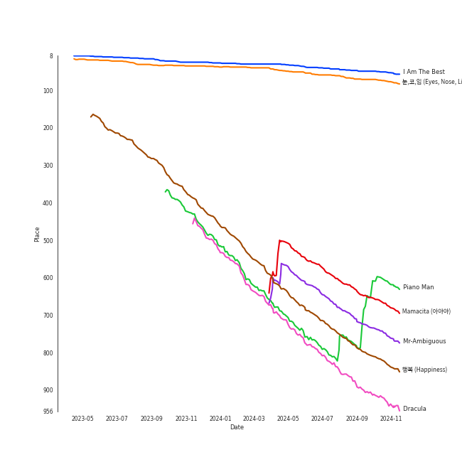

# Tracks in K-Pop from 2014

## Artists

| Art | Rank | Tracks | 💚 | Artist | 🔗 |
|:---|---:|---:|---:|:---|:---|
|  | 166 | 2 | 2 | [f(x)](../../../artists/f(x)/overview.md) | [🔗](https://open.spotify.com/artist/3wRA5UYoo08BBKJnzyKkpF) |
|  | 2 | 2 | 2 | [Red Velvet](../../../artists/red_velvet/overview.md) | [🔗](https://open.spotify.com/artist/1z4g3DjTBBZKhvAroFlhOM) |
|  | 15 | 2 | 2 | [MAMAMOO](../../../artists/mamamoo/overview.md) | [🔗](https://open.spotify.com/artist/0XATRDCYuuGhk0oE7C0o5G) |
|  | 20 | 2 | 2 | [Girls' Generation](../../../artists/girls__generation/overview.md) | [🔗](https://open.spotify.com/artist/0Sadg1vgvaPqGTOjxu0N6c) |
|  | 28 | 3 | 1 | [BTS](../../../artists/bts/overview.md) | [🔗](https://open.spotify.com/artist/3Nrfpe0tUJi4K4DXYWgMUX) |
|  | 58 | 1 | 1 | TAEYANG | [🔗](https://open.spotify.com/artist/6udveWUgX4vu75FF0DTrXV) |
|  | 86 | 1 | 1 | [SUPER JUNIOR](../../../artists/super_junior/overview.md) | [🔗](https://open.spotify.com/artist/6gzXCdfYfFe5XKhPKkYqxV) |
|  | 149 | 1 | 1 | TAEYONG | [🔗](https://open.spotify.com/artist/6SKusTjOAPsTZ6kareKQdm) |
|  | 410 | 1 | 1 | AOA | [🔗](https://open.spotify.com/artist/54gWVQFHf8IIqbjxAoOarN) |
|  | 430 | 1 | 1 | Block B | [🔗](https://open.spotify.com/artist/4RnezwRV7VBJUCI1S0AE5u) |

View all

| Art | Rank | Tracks | 💚 | Artist | 🔗 |
|:---|---:|---:|---:|:---|:---|
|  | 3 | 1 | 1 | [IU](../../../artists/iu/overview.md) | [🔗](https://open.spotify.com/artist/3HqSLMAZ3g3d5poNaI7GOU) |
|  | 269 | 1 | 1 | SISTAR | [🔗](https://open.spotify.com/artist/2wTLheTmMcFCA4hdY8hZJP) |
|  | 62 | 1 | 1 | 2NE1 | [🔗](https://open.spotify.com/artist/1l0mKo96Jh9HVYONcRl3Yp) |
|  | 430 | 1 | 1 | ToppDogg | [🔗](https://open.spotify.com/artist/03Ejz4OkKzGnTRKZE3KwRN) |
|  | 430 | 1 | 0 | Orange Caramel | [🔗](https://open.spotify.com/artist/2QHTtUsN6Q13w3QHdfRqsK) |

## Albums

| Art | Rank | Tracks | 💚 | Album | Release Date | 🔗 |
|:---|---:|---:|---:|:---|:---|:---|
|  | 603 | 2 | 2 | Red Light - The 3rd Album | 2014-07-11 | [🔗](https://open.spotify.com/album/6T9SFwLGHVU75jRAjUJn3W) |
|  | 643 | 2 | 2 | Mr. Mr. - The 4th Mini Album | 2014-02-24 | [🔗](https://open.spotify.com/album/1WyHAY8OWdfCFWTF0Ufwjj) |
|  | 643 | 2 | 0 | Dark & Wild | 2014-08-20 | [🔗](https://open.spotify.com/album/35voVqYGkotyJ945O9egDY) |
|  | 541 | 1 | 1 | 행복(Happiness) | 2014-08-01 | [🔗](https://open.spotify.com/album/6MMkaYzyM0aLZmDBce3nL6) |
|  | 643 | 1 | 1 | TOUCH N MOVE | 2014-07-21 | [🔗](https://open.spotify.com/album/0SeSM1CAqu7QUkive4jCKl) |
|  | 643 | 1 | 1 | Skool Luv Affair | 2014-02-12 | [🔗](https://open.spotify.com/album/5r35iS0uSSoQBKzQj0IeI3) |
|  | 69 | 1 | 1 | RISE | 2014-06-03 | [🔗](https://open.spotify.com/album/1Y9so4jq4t4taAHu0VdKX3) |
|  | 440 | 1 | 1 | Piano Man | 2014-11-21 | [🔗](https://open.spotify.com/album/1kdURRaOTpDCQqsVIU5CiT) |
|  | 643 | 1 | 1 | MINISKIRT | 2014-01-16 | [🔗](https://open.spotify.com/album/6esB2DBt46m38ZycDPsn8D) |
|  | 441 | 1 | 1 | MAMACITA - The 7th Album | 2014-08-29 | [🔗](https://open.spotify.com/album/53i190Z2uGOLljuS3DCvz2) |

View all

| Art | Rank | Tracks | 💚 | Album | Release Date | 🔗 |
|:---|---:|---:|---:|:---|:---|:---|
|  | 48 | 1 | 1 | I Am The Best | 2014-12-09 | [🔗](https://open.spotify.com/album/7zjLDZzHo2XgvYwpuNwEvK) |
|  | 643 | 1 | 1 | HER | 2014-07-24 | [🔗](https://open.spotify.com/album/5wHs7NGuapCYtY4wWsYMi3) |
|  | 492 | 1 | 1 | HELLO | 2014-06-18 | [🔗](https://open.spotify.com/album/3Z9cZon6ukg4rvGYu7i4NA) |
|  | 643 | 1 | 1 | Be Natural - The 2nd Single | 2014-10-13 | [🔗](https://open.spotify.com/album/4OeQ9nilS4Sy3efzt0hVFi) |
|  | 643 | 1 | 1 | Amadeus (Deluxe) | 2014-01-01 | [🔗](https://open.spotify.com/album/2lEkc4sDyukoOL28Qyw2OH) |
|  | 643 | 1 | 1 | A flower bookmark | 2014-05-16 | [🔗](https://open.spotify.com/album/460uGpon2JwPfRgDohV2bP) |
|  | 643 | 1 | 0 | THE THIRD SINGLE CATALLENA | 2014-03-12 | [🔗](https://open.spotify.com/album/3FeATTUjZWvmXW2kP9CHWY) |

## Tracks

| Art | Track | Album | Artists | Label | Rank | 💚 | 🔗 |
|:---|:---|:---|:---|:---|---:|:---|:---|
|  | I Am The Best | I Am The Best | 2NE1 | Capitol Records (CAP) | 49 | 💚 | [🔗](https://open.spotify.com/track/26EM9sZnQkLLQxixGd88KE) |
|  | 눈,코,입 (Eyes, Nose, Lips) | RISE | TAEYANG | [YG Entertainment](../../../labels/yg_entertainment) | 71 | 💚 | [🔗](https://open.spotify.com/track/0lYtIvI7bO51PZSeK22Mbz) |
|  | Piano Man | Piano Man | [MAMAMOO](../../../artists/mamamoo/overview.md) | [Genie Music Corporation](../../../labels/genie_music_corporation), [Stone Music Entertainment](../../../labels/stone_music_entertainment) | 655 | 💚 | [🔗](https://open.spotify.com/track/2CC7fLFEcJBrO82NUwi9Op) |
|  | Mamacita (아야야) | MAMACITA - The 7th Album | [SUPER JUNIOR](../../../artists/super_junior/overview.md) | [SM Entertainment](../../../labels/sm_entertainment) | 656 | 💚 | [🔗](https://open.spotify.com/track/23z7nLq4CD83EyzeeIokkt) |
|  | Mr-Ambiguous | HELLO | [MAMAMOO](../../../artists/mamamoo/overview.md) | [Genie Music Corporation](../../../labels/genie_music_corporation), [Stone Music Entertainment](../../../labels/stone_music_entertainment) | 734 | 💚 | [🔗](https://open.spotify.com/track/4VOZzJeoNhvvTaGTztogVt) |
|  | 행복 (Happiness) | 행복(Happiness) | [Red Velvet](../../../artists/red_velvet/overview.md) | [SM Entertainment](../../../labels/sm_entertainment) | 808 | 💚 | [🔗](https://open.spotify.com/track/6XP9L7di5JnOc9WaeAW8oe) |
|  | Dracula | Red Light - The 3rd Album | [f(x)](../../../artists/f(x)/overview.md) | [SM Entertainment](../../../labels/sm_entertainment) | 910 | 💚 | [🔗](https://open.spotify.com/track/5vClivCCQDK6sxmL6MhMFc) |
|  | TOPDOG | Amadeus (Deluxe) | ToppDogg | [Universal Music Ltd.](../../../labels/universal_music_llc) | 974 | 💚 | [🔗](https://open.spotify.com/track/1eAuDZ7kug0XB4FGUUEgST) |
|  | Miniskirt | MINISKIRT | AOA | [FNC ENTERTAINMENT](../../../labels/fnc_entertainment) | 974 | 💚 | [🔗](https://open.spotify.com/track/6Yj8kVuVR3UPxx9r5eFEoV) |
|  | Boy in Luv | Skool Luv Affair | [BTS](../../../artists/bts/overview.md) | [BIGHIT MUSIC](../../../labels/bighit_music) | 974 | 💚 | [🔗](https://open.spotify.com/track/3FnDv33WrrMtuEr7hNR3ev) |

View all

| Art | Track | Album | Artists | Label | Rank | 💚 | 🔗 |
|:---|:---|:---|:---|:---|---:|:---|:---|
|  | Mr.Mr. | Mr. Mr. - The 4th Mini Album | [Girls' Generation](../../../artists/girls__generation/overview.md) | [SM Entertainment](../../../labels/sm_entertainment) | 974 | 💚 | [🔗](https://open.spotify.com/track/3JaMGQXJmtbAhvgl0nBPPN) |
|  | Soul | Mr. Mr. - The 4th Mini Album | [Girls' Generation](../../../artists/girls__generation/overview.md) | [SM Entertainment](../../../labels/sm_entertainment) | 974 | 💚 | [🔗](https://open.spotify.com/track/76ssTbsB9z3eXcAfcEx19r) |
|  | Catallena | THE THIRD SINGLE CATALLENA | Orange Caramel | Pledis | 974 | | [🔗](https://open.spotify.com/track/5fWKr5p15BTazjflJ6HX5j) |
|  | Pierrot laughs at us | A flower bookmark | [IU](../../../artists/iu/overview.md) | [Kakao Entertainment](../../../labels/kakao_entertainment) | 974 | 💚 | [🔗](https://open.spotify.com/track/7rx1DA57CL4nGS3AnFGjgJ) |
|  | Red Light | Red Light - The 3rd Album | [f(x)](../../../artists/f(x)/overview.md) | [SM Entertainment](../../../labels/sm_entertainment) | 974 | 💚 | [🔗](https://open.spotify.com/track/4ML3iXqwb35FHG0SW1HVGc) |
|  | Touch my body | TOUCH N MOVE | SISTAR | [Starship Entertainment](../../../labels/starship_entertainment) | 974 | 💚 | [🔗](https://open.spotify.com/track/5crARIrvoMiMf2AdlD78WN) |
|  | JACKPOT | HER | Block B | [Genie Music Corporation](../../../labels/genie_music_corporation), [Stone Music Entertainment](../../../labels/stone_music_entertainment) | 974 | 💚 | [🔗](https://open.spotify.com/track/1T03TbRPcIMuqRLGKD5oRS) |
|  | Danger | Dark & Wild | [BTS](../../../artists/bts/overview.md) | [BIGHIT MUSIC](../../../labels/bighit_music) | 974 | | [🔗](https://open.spotify.com/track/0zzRxtfO5FGxKdqq4OKmlw) |
|  | War of Hormone | Dark & Wild | [BTS](../../../artists/bts/overview.md) | [BIGHIT MUSIC](../../../labels/bighit_music) | 974 | | [🔗](https://open.spotify.com/track/29SjtKzBoJDgyIBusHylIS) |
|  | Be Natural | Be Natural - The 2nd Single | [Red Velvet](../../../artists/red_velvet/overview.md), TAEYONG | [SM Entertainment](../../../labels/sm_entertainment) | 974 | 💚 | [🔗](https://open.spotify.com/track/41qLzxymjkp0R5vl3REb1S) |

