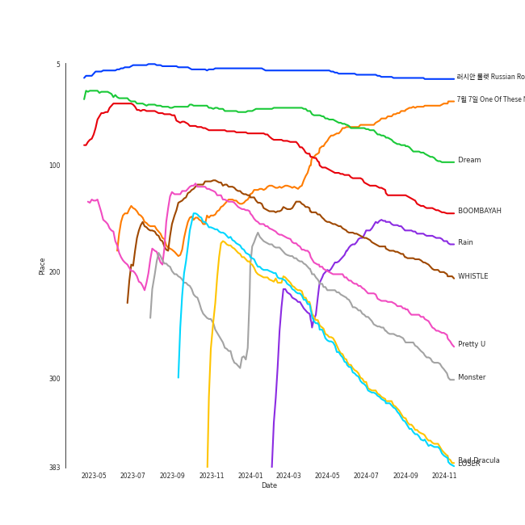

# Tracks in K-Pop from 2016

## Artists

| Art | Rank | Tracks | 💚 | Artist | 🔗 |
|:---|---:|---:|---:|:---|:---|
|  | 2 | 5 | 5 | [Red Velvet](../../../artists/red_velvet/overview.md) | [🔗](https://open.spotify.com/artist/1z4g3DjTBBZKhvAroFlhOM) |
|  | 28 | 5 | 4 | [BTS](../../../artists/bts/overview.md) | [🔗](https://open.spotify.com/artist/3Nrfpe0tUJi4K4DXYWgMUX) |
|  | 4 | 4 | 3 | [BLACKPINK](../../../artists/blackpink/overview.md) | [🔗](https://open.spotify.com/artist/41MozSoPIsD1dJM0CLPjZF) |
|  | 173 | 3 | 3 | BIGBANG | [🔗](https://open.spotify.com/artist/4Kxlr1PRlDKEB0ekOCyHgX) |
|  | 8 | 3 | 2 | [TAEYEON](../../../artists/taeyeon/overview.md) | [🔗](https://open.spotify.com/artist/3qNVuliS40BLgXGxhdBdqu) |
|  | 9 | 2 | 2 | [TWICE](../../../artists/twice/overview.md) | [🔗](https://open.spotify.com/artist/7n2Ycct7Beij7Dj7meI4X0) |
|  | 136 | 2 | 2 | [Gain](../../../artists/gain/overview.md) | [🔗](https://open.spotify.com/artist/4R60A85t9mTZzCqJlVswuo) |
|  | 15 | 2 | 2 | [MAMAMOO](../../../artists/mamamoo/overview.md) | [🔗](https://open.spotify.com/artist/0XATRDCYuuGhk0oE7C0o5G) |
|  | 12 | 2 | 1 | [SEVENTEEN](../../../artists/seventeen/overview.md) | [🔗](https://open.spotify.com/artist/7nqOGRxlXj7N2JYbgNEjYH) |
|  | 367 | 2 | 1 | GFRIEND | [🔗](https://open.spotify.com/artist/0qlWcS66ohOIi0M8JZwPft) |

View all

| Art | Rank | Tracks | 💚 | Artist | 🔗 |
|:---|---:|---:|---:|:---|:---|
|  | 30 | 1 | 1 | [NCT 127](../../../artists/nct_127/overview.md) | [🔗](https://open.spotify.com/artist/7f4ignuCJhLXfZ9giKT7rH) |
|  | 250 | 1 | 1 | [WJSN](../../../artists/wjsn/overview.md) | [🔗](https://open.spotify.com/artist/6hhqsQZhtp9hfaZhSd0VSD) |
|  | 124 | 1 | 1 | 4Minute | [🔗](https://open.spotify.com/artist/6cdC1cwqh3eJAXaxXJt2jv) |
|  | 428 | 1 | 1 | JIN | [🔗](https://open.spotify.com/artist/5vV3bFXnN6D6N3Nj4xRvaV) |
|  | 428 | 1 | 1 | WINNER | [🔗](https://open.spotify.com/artist/5DuzBeOgFwViFcv00Q5PFb) |
|  | 428 | 1 | 1 | VIXX | [🔗](https://open.spotify.com/artist/5BkB3rXc0qIdUtuEnhbK0A) |
|  | 408 | 1 | 1 | AOA | [🔗](https://open.spotify.com/artist/54gWVQFHf8IIqbjxAoOarN) |
|  | 54 | 1 | 1 | [BAEKHYUN](../../../artists/baekhyun/overview.md) | [🔗](https://open.spotify.com/artist/4ufh0WuMZh6y4Dmdnklvdl) |
|  | 428 | 1 | 1 | LADIES' CODE | [🔗](https://open.spotify.com/artist/4epPY1AW9lQeVUM1XaFiwi) |
|  | 80 | 1 | 1 | Suzy | [🔗](https://open.spotify.com/artist/4U80LJd8sG6U9YTFP5izka) |
|  | 23 | 1 | 1 | [EXO](../../../artists/exo/overview.md) | [🔗](https://open.spotify.com/artist/3cjEqqelV9zb4BYE3qDQ4O) |
|  | 428 | 1 | 1 | V | [🔗](https://open.spotify.com/artist/3JsHnjpbhX4SnySpvpa9DK) |
|  | 85 | 1 | 1 | Wonder Girls | [🔗](https://open.spotify.com/artist/3Cv2vi3WTl8VZOTdrBkKdM) |
|  | 428 | 1 | 1 | HYOYEON | [🔗](https://open.spotify.com/artist/0B3I6YgdnfXehUCpsO6oB8) |
|  | 268 | 2 | 0 | SISTAR | [🔗](https://open.spotify.com/artist/2wTLheTmMcFCA4hdY8hZJP) |
|  | 67 | 2 | 0 | [TAEMIN](../../../artists/taemin/overview.md) | [🔗](https://open.spotify.com/artist/13rF01aOogvnkuQXOlgTW8) |
|  | 428 | 1 | 0 | GOT7 | [🔗](https://open.spotify.com/artist/6nfDaffa50mKtEOwR8g4df) |
| | 428 | 1 | 0 | Banana Culture | [🔗](https://open.spotify.com/artist/59wMClFt5etFfDtI4nc81o) |
|  | 428 | 1 | 0 | KARD | [🔗](https://open.spotify.com/artist/2JhAlkmukNvarUpGhTFXUQ) |
|  | 91 | 1 | 0 | [OH MY GIRL](../../../artists/oh_my_girl/overview.md) | [🔗](https://open.spotify.com/artist/2019zR22qK2RBvCqtudBaI) |
|  | 289 | 1 | 0 | EXID | [🔗](https://open.spotify.com/artist/1xs6WFotNQSXweo0GXrS0O) |
|  | 422 | 1 | 0 | KIMSEJEONG | [🔗](https://open.spotify.com/artist/1lFLniFTaPjYCtQZvDXpqu) |
|  | 428 | 1 | 0 | HUR YOUNG JI | [🔗](https://open.spotify.com/artist/0FUmt6iMoB9sJpxZuWkOI5) |

## Albums

| Art | Rank | Tracks | 💚 | Album | Release Date | 🔗 |
|:---|---:|---:|---:|:---|:---|:---|
|  | 19 | 4 | 4 | Russian Roulette - The 3rd Mini Album | 2016-09-07 | [🔗](https://open.spotify.com/album/6MNlcai3skKLKv5syzFwC3) |
|  | 241 | 3 | 3 | MADE | 2016-12-13 | [🔗](https://open.spotify.com/album/2SPrl8C8pgSM5gXbAiyJHY) |
|  | 639 | 3 | 2 | The Most Beautiful Moment in Life: Young Forever | 2016-05-02 | [🔗](https://open.spotify.com/album/1k5bJ8l5oL5xxVBVHjil09) |
|  | 639 | 2 | 2 | Wings | 2016-10-10 | [🔗](https://open.spotify.com/album/1vhNGBTFoaSTLbHjPGFIlF) |
|  | 94 | 2 | 2 | SQUARE ONE | 2016-08-08 | [🔗](https://open.spotify.com/album/0FOOodYRlj7gzh7q7IjmNZ) |
|  | 590 | 2 | 2 | End Again | 2016-09-09 | [🔗](https://open.spotify.com/album/1Lb5NVfPBTadR5jl6Vpkdq) |
|  | 639 | 2 | 1 | Why - The 2nd Mini Album | 2016-06-28 | [🔗](https://open.spotify.com/album/1ukBQWhQwWKqTGgs0YzRzU) |
|  | 405 | 2 | 1 | SQUARE TWO | 2016-11-01 | [🔗](https://open.spotify.com/album/2Fna4Tb7fme5aHsNMJtVtp) |
|  | 639 | 2 | 0 | INSANE LOVE | 2016-06-21 | [🔗](https://open.spotify.com/album/4Yz1WY6PlJepdbnl4m72b8) |
|  | 539 | 1 | 1 | Why So Lonely | 2016-07-05 | [🔗](https://open.spotify.com/album/2TzaSJlsVyKcZ0NOf2TI9U) |

View all

| Art | Rank | Tracks | 💚 | Album | Release Date | 🔗 |
|:---|---:|---:|---:|:---|:---|:---|
|  | 639 | 1 | 1 | Twicecoaster: Lane 1 | 2016-10-24 | [🔗](https://open.spotify.com/album/5zQhaDNbiXHRqd8Y51I4vy) |
|  | 46 | 1 | 1 | The Velvet - The 2nd Mini Album | 2016-03-17 | [🔗](https://open.spotify.com/album/2qgl7dAgslqL1w2l2wQhMA) |
|  | 639 | 1 | 1 | THE SECRET | 2016-08-17 | [🔗](https://open.spotify.com/album/0usNbLkckzIo34wUPehZdh) |
|  | 173 | 1 | 1 | SEVENTEEN 1ST ALBUM [FIRST ‘LOVE&LETTER’] | 2016-04-25 | [🔗](https://open.spotify.com/album/50BrkBakrLWufmTLjCVBwn) |
|  | 127 | 1 | 1 | Rain - SM STATION | 2016-02-03 | [🔗](https://open.spotify.com/album/5MgY1E2inbDcthAQEzwz8L) |
|  | 639 | 1 | 1 | Page Two | 2016-04-25 | [🔗](https://open.spotify.com/album/6q2oUEqL9uzVXHCeKoA8JV) |
|  | 427 | 1 | 1 | NCT #127 - The 1st Mini Album | 2016-07-10 | [🔗](https://open.spotify.com/album/7xmqXxPAmkgn5HK9FcyBxR) |
|  | 639 | 1 | 1 | Melting | 2016-02-26 | [🔗](https://open.spotify.com/album/11hjJntrvmauDoga4Krr0U) |
|  | 639 | 1 | 1 | MYST3RY | 2016-02-24 | [🔗](https://open.spotify.com/album/2kOn7OTf9UGL0fyxy8yT7n) |
|  | 639 | 1 | 1 | MEMORY | 2016-11-07 | [🔗](https://open.spotify.com/album/3Q34hV5fBbMpRpADmlptr7) |
|  | 639 | 1 | 1 | Hades | 2016-08-12 | [🔗](https://open.spotify.com/album/78huKT6T1zZUJxbkGBQJZC) |
|  | 639 | 1 | 1 | HWARANG, Pt. 2 (Music from the Original TV Series) | 2016-12-20 | [🔗](https://open.spotify.com/album/0sL76PXbgRh97MTzadqEMa) |
|  | 639 | 1 | 1 | GFRIEND 3rd Mini Album 'SNOWFLAKE' | 2016-01-25 | [🔗](https://open.spotify.com/album/0COnSwFb5qOhABUyWNw6Kp) |
|  | 639 | 1 | 1 | EXIT : E | 2016-02-01 | [🔗](https://open.spotify.com/album/7D2FML3EyRJcCoiEgUbRxT) |
|  | 187 | 1 | 1 | EX'ACT | 2016-06-09 | [🔗](https://open.spotify.com/album/5Cckx6G2aRR4aZBV6eIYdc) |
|  | 78 | 1 | 1 | Dream | 2016-01-07 | [🔗](https://open.spotify.com/album/7ciJtZ2tYXhKsndQ7bf7Vw) |
|  | 639 | 1 | 1 | Act. 7 | 2016-02-01 | [🔗](https://open.spotify.com/album/2QGDdrZDuxK7VBmcJZxi1B) |
|  | 639 | 1 | 1 | AOA 4th Mini Album Good Luck | 2016-05-16 | [🔗](https://open.spotify.com/album/3D4EskjAYfo91G4BN7XcbB) |
|  | 639 | 1 | 0 | さよならひとり | 2016-07-27 | [🔗](https://open.spotify.com/album/0VOMzswFy3fFsOb1tYs1Wd) |
|  | 639 | 1 | 0 | WINDY DAY | 2016 | [🔗](https://open.spotify.com/album/7coV2krimvobeWltmNvYeC) |
|  | 639 | 1 | 0 | Street | 2016-06-01 | [🔗](https://open.spotify.com/album/2UJZYFwoSUlbMKo73IjQ9R) |
|  | 639 | 1 | 0 | Press It - The 1st Album | 2016-02-23 | [🔗](https://open.spotify.com/album/3BPjJEl3GqXKDhYZf7iFfs) |
|  | 475 | 1 | 0 | Love&Letter repackage album | 2016-07-04 | [🔗](https://open.spotify.com/album/7mP7AFehQDonPKEQiXvpvB) |
|  | 639 | 1 | 0 | K.A.R.D Project Vol.1 "Oh NaNa" | 2016-12-13 | [🔗](https://open.spotify.com/album/2HpryOOYLbnST4aCT5v4lF) |
|  | 639 | 1 | 0 | Jelly box Flower Way SEJEONG | 2016-11-23 | [🔗](https://open.spotify.com/album/32dL7nyPowMbiu8QFrAkIM) |
|  | 639 | 1 | 0 | GFRIEND The 1st Album 'LOL' | 2016-07-11 | [🔗](https://open.spotify.com/album/0PlSM2Hml1cFANnzYu6RCg) |
|  | 639 | 1 | 0 | FLIGHT LOG : TURBULENCE | 2016-09-27 | [🔗](https://open.spotify.com/album/4m7ocqdUZh1ohn3nxurMf0) |

## Tracks

| Art | Track | Album | Artists | Label | Rank | 💚 | 🔗 |
|:---|:---|:---|:---|:---|---:|:---|:---|
|  | 러시안 룰렛 Russian Roulette | Russian Roulette - The 3rd Mini Album | [Red Velvet](../../../artists/red_velvet/overview.md) | [SM Entertainment](../../../labels/sm_entertainment) | 18 | 💚 | [🔗](https://open.spotify.com/track/5HiSc2ZCGn8L3cH3qSwzBT) |
|  | 7월 7일 One Of These Nights | The Velvet - The 2nd Mini Album | [Red Velvet](../../../artists/red_velvet/overview.md) | [SM Entertainment](../../../labels/sm_entertainment) | 46 | 💚 | [🔗](https://open.spotify.com/track/6koMMQlsRWBwHZXdtWxgUk) |
|  | Dream | Dream | Suzy, [BAEKHYUN](../../../artists/baekhyun/overview.md) | ChoongangICS, MYSTIC Entertainment, [JYP Entertainment](../../../labels/jyp_entertainment), [SM Entertainment](../../../labels/sm_entertainment) | 87 | 💚 | [🔗](https://open.spotify.com/track/3JBnDOUd18QKjDqSYuOfpm) |
|  | BOOMBAYAH | SQUARE ONE | [BLACKPINK](../../../artists/blackpink/overview.md) | [YG Entertainment](../../../labels/yg_entertainment) | 132 | 💚 | [🔗](https://open.spotify.com/track/13MF2TYuyfITClL1R2ei6e) |
|  | Rain | Rain - SM STATION | [TAEYEON](../../../artists/taeyeon/overview.md) | [SM Entertainment](../../../labels/sm_entertainment) | 160 | 💚 | [🔗](https://open.spotify.com/track/1ukyvyEeSg1odSQvhlRAIU) |
|  | WHISTLE | SQUARE ONE | [BLACKPINK](../../../artists/blackpink/overview.md) | [YG Entertainment](../../../labels/yg_entertainment) | 184 | 💚 | [🔗](https://open.spotify.com/track/6NEoeBLQbOMw92qMeLfI40) |
|  | Pretty U | SEVENTEEN 1ST ALBUM [FIRST ‘LOVE&LETTER’] | [SEVENTEEN](../../../artists/seventeen/overview.md) | [PLEDIS ENTERTAINMENT](../../../labels/pledis_entertainment) | 235 | 💚 | [🔗](https://open.spotify.com/track/1117juaaAkSIUsQxTmmcKM) |
|  | Monster | EX'ACT | [EXO](../../../artists/exo/overview.md) | [SM Entertainment](../../../labels/sm_entertainment) | 254 | 💚 | [🔗](https://open.spotify.com/track/7GbUWl6qLW1gdngbEV2WDJ) |
|  | Bad Dracula | Russian Roulette - The 3rd Mini Album | [Red Velvet](../../../artists/red_velvet/overview.md) | [SM Entertainment](../../../labels/sm_entertainment) | 347 | 💚 | [🔗](https://open.spotify.com/track/4z5aqQOYYsvjXuXjjhKVJ2) |
|  | LOSER | MADE | BIGBANG | [YG Entertainment](../../../labels/yg_entertainment) | 354 | 💚 | [🔗](https://open.spotify.com/track/2vzn8usBcuNL93DnTjEK0z) |

View all

| Art | Track | Album | Artists | Label | Rank | 💚 | 🔗 |
|:---|:---|:---|:---|:---|---:|:---|:---|
|  | Fool | Russian Roulette - The 3rd Mini Album | [Red Velvet](../../../artists/red_velvet/overview.md) | [SM Entertainment](../../../labels/sm_entertainment) | 448 | 💚 | [🔗](https://open.spotify.com/track/21C7B7PWYDW00czamOjleO) |
|  | PLAYING WITH FIRE | SQUARE TWO | [BLACKPINK](../../../artists/blackpink/overview.md) | [YG Entertainment](../../../labels/yg_entertainment) | 603 | 💚 | [🔗](https://open.spotify.com/track/7qmvLmX9tyaTiBAVNI6YEn) |
|  | Lucky Girl | Russian Roulette - The 3rd Mini Album | [Red Velvet](../../../artists/red_velvet/overview.md) | [SM Entertainment](../../../labels/sm_entertainment) | 610 | 💚 | [🔗](https://open.spotify.com/track/22v5j98MRwc6p5KgwHvpBZ) |
|  | 소방차 Fire Truck | NCT #127 - The 1st Mini Album | [NCT 127](../../../artists/nct_127/overview.md) | [SM Entertainment](../../../labels/sm_entertainment) | 633 | 💚 | [🔗](https://open.spotify.com/track/5hHlmrSV6d9LFMsDA1lamE) |
|  | VERY NICE | Love&Letter repackage album | [SEVENTEEN](../../../artists/seventeen/overview.md) | [PLEDIS ENTERTAINMENT](../../../labels/pledis_entertainment) | 707 | | [🔗](https://open.spotify.com/track/1Rrj7KyS2R6SP9CQMDJW1w) |
|  | LET'S NOT FALL IN LOVE | MADE | BIGBANG | [YG Entertainment](../../../labels/yg_entertainment) | 786 | 💚 | [🔗](https://open.spotify.com/track/6UgkB0xM45TR3Zjqm3GQ6T) |
|  | Why So Lonely | Why So Lonely | Wonder Girls | [Republic Records](../../../labels/republic_records) | 805 | 💚 | [🔗](https://open.spotify.com/track/2FBNkgK3GbF2tVWxKNFRjX) |
|  | Carrie (The First Day) | End Again | [Gain](../../../artists/gain/overview.md) | APOP Entertainment, MYSTIC Entertainment | 887 | 💚 | [🔗](https://open.spotify.com/track/5n2Z6Z4Tw6hkbMqY4lT24u) |
|  | WINDY DAY | WINDY DAY | [OH MY GIRL](../../../artists/oh_my_girl/overview.md) | [WM Entertainment](../../../labels/wm_entertainment) | 966 | | [🔗](https://open.spotify.com/track/7prrcyZc48tO9hGzdnU9aD) |
|  | Rough | GFRIEND 3rd Mini Album 'SNOWFLAKE' | GFRIEND | [SOURCE MUSIC](../../../labels/source_music) | 966 | 💚 | [🔗](https://open.spotify.com/track/3CVeGXpoPKJQ9JuhPp3mpL) |
|  | Hate | Act. 7 | 4Minute | [CUBE ENTERTAINMENT](../../../labels/cube_entertainment) | 966 | 💚 | [🔗](https://open.spotify.com/track/3Hd6zm1J4bVeu4VXwaDQL3) |
|  | BABY BABY | EXIT : E | WINNER | [YG Entertainment](../../../labels/yg_entertainment) | 966 | 💚 | [🔗](https://open.spotify.com/track/2zLRE8rUhH2i7maIU5sWVI) |
|  | Drip Drop | Press It - The 1st Album | [TAEMIN](../../../artists/taemin/overview.md) | [SM Entertainment](../../../labels/sm_entertainment) | 966 | | [🔗](https://open.spotify.com/track/7EYDRfuloB4kG28ECZkPZB) |
|  | Galaxy | MYST3RY | LADIES' CODE | 폴라리스엔터테인먼트, BlockBerryCreative | 966 | 💚 | [🔗](https://open.spotify.com/track/5rd00qaUJugfI8nhPcxA3o) |
|  | You’re the Best | Melting | [MAMAMOO](../../../artists/mamamoo/overview.md) | [Genie Music Corporation](../../../labels/genie_music_corporation), [Stone Music Entertainment](../../../labels/stone_music_entertainment) | 966 | 💚 | [🔗](https://open.spotify.com/track/3BUZUCu1uHaTvroizwqLHt) |
|  | CHEER UP | Page Two | [TWICE](../../../artists/twice/overview.md) | [Republic Records](../../../labels/republic_records) | 966 | 💚 | [🔗](https://open.spotify.com/track/7lB4rxNVc7vm33ZSZXVRAQ) |
|  | Butterfly | The Most Beautiful Moment in Life: Young Forever | [BTS](../../../artists/bts/overview.md) | [BIGHIT MUSIC](../../../labels/bighit_music) | 966 | 💚 | [🔗](https://open.spotify.com/track/2QP1vvLPtAVOVAFabpqypA) |
|  | Dope | The Most Beautiful Moment in Life: Young Forever | [BTS](../../../artists/bts/overview.md) | [BIGHIT MUSIC](../../../labels/bighit_music) | 966 | 💚 | [🔗](https://open.spotify.com/track/4o3Ao6wY5fbJR32fQKabfQ) |
|  | Save Me | The Most Beautiful Moment in Life: Young Forever | [BTS](../../../artists/bts/overview.md) | [BIGHIT MUSIC](../../../labels/bighit_music) | 966 | | [🔗](https://open.spotify.com/track/7bxGcILuAjkZzaveU28ZJS) |
|  | Good Luck | AOA 4th Mini Album Good Luck | AOA | [FNC ENTERTAINMENT](../../../labels/fnc_entertainment) | 966 | 💚 | [🔗](https://open.spotify.com/track/577ckDBuyYNGeqetUhbv7d) |
|  | L.I.E | Street | EXID, Banana Culture | BANANA CULTURE | 966 | | [🔗](https://open.spotify.com/track/4c1cUu1PFDX1YB6JDvG8vf) |
|  | I Like That | INSANE LOVE | SISTAR | [Starship Entertainment](../../../labels/starship_entertainment) | 966 | | [🔗](https://open.spotify.com/track/4wAjmojVxc6Wbeca9XvnDo) |
|  | Say! Yes | INSANE LOVE | SISTAR | [Starship Entertainment](../../../labels/starship_entertainment) | 966 | | [🔗](https://open.spotify.com/track/5gDxhjgpRoClBFrOcNGiEQ) |
|  | Good Thing | Why - The 2nd Mini Album | [TAEYEON](../../../artists/taeyeon/overview.md) | [SM Entertainment](../../../labels/sm_entertainment) | 966 | | [🔗](https://open.spotify.com/track/30CAqzLOdc8LbPRzchYaAt) |
|  | Up & Down | Why - The 2nd Mini Album | [TAEYEON](../../../artists/taeyeon/overview.md), HYOYEON | [SM Entertainment](../../../labels/sm_entertainment) | 966 | 💚 | [🔗](https://open.spotify.com/track/2T20Nb7QlVK8K6pRSiDl8N) |
|  | NAVILLERA | GFRIEND The 1st Album 'LOL' | GFRIEND | [SOURCE MUSIC](../../../labels/source_music) | 966 | | [🔗](https://open.spotify.com/track/2Oi0IO8K4BEbhPUdWcjNmv) |
|  | さよならひとり | さよならひとり | [TAEMIN](../../../artists/taemin/overview.md) | [Universal Music LLC](../../../labels/universal_music_llc) | 966 | | [🔗](https://open.spotify.com/track/4ltAvuYuC8PNKAStXiWouZ) |
|  | Fantasy | Hades | VIXX | JELLYFISH ENTERTAINMENT | 966 | 💚 | [🔗](https://open.spotify.com/track/3GuJYdmgBXo6Add2CPTRw4) |
|  | Secret | THE SECRET | [WJSN](../../../artists/wjsn/overview.md) | [Starship Entertainment](../../../labels/starship_entertainment) | 966 | 💚 | [🔗](https://open.spotify.com/track/1OIb1AalkGikhzCRbWgchd) |
|  | Carnival (The Last Day) | End Again | [Gain](../../../artists/gain/overview.md) | APOP Entertainment, MYSTIC Entertainment | 966 | 💚 | [🔗](https://open.spotify.com/track/1wFwU41aWXC5wb7ycY9q61) |
|  | Hard Carry | FLIGHT LOG : TURBULENCE | GOT7 | [JYP Entertainment](../../../labels/jyp_entertainment) | 966 | | [🔗](https://open.spotify.com/track/1xzCUpXSMnAbckUXDwBTlW) |
|  | Blood Sweat & Tears | Wings | [BTS](../../../artists/bts/overview.md) | [BIGHIT MUSIC](../../../labels/bighit_music) | 966 | 💚 | [🔗](https://open.spotify.com/track/2u54HNQamwFuOMLSuhSRom) |
|  | Lie | Wings | [BTS](../../../artists/bts/overview.md) | [BIGHIT MUSIC](../../../labels/bighit_music) | 966 | 💚 | [🔗](https://open.spotify.com/track/1nWB8isqs2tviWk20G5pow) |
|  | TT | Twicecoaster: Lane 1 | [TWICE](../../../artists/twice/overview.md) | [Republic Records](../../../labels/republic_records) | 966 | 💚 | [🔗](https://open.spotify.com/track/60jFaQV7Z4boGC4ob5B5c6) |
|  | STAY | SQUARE TWO | [BLACKPINK](../../../artists/blackpink/overview.md) | [YG Entertainment](../../../labels/yg_entertainment) | 966 | | [🔗](https://open.spotify.com/track/3tP6QKbXvtrxiDI7QwKyUf) |
|  | Décalcomanie | MEMORY | [MAMAMOO](../../../artists/mamamoo/overview.md) | [Genie Music Corporation](../../../labels/genie_music_corporation), [Stone Music Entertainment](../../../labels/stone_music_entertainment) | 966 | 💚 | [🔗](https://open.spotify.com/track/5WitNasXEIRptoLIQUcXMx) |
|  | Flower Way (Prod. By ZICO) | Jelly box Flower Way SEJEONG | KIMSEJEONG | JELLYFISH ENTERTAINMENT | 966 | | [🔗](https://open.spotify.com/track/1dOD5F2hX5TBtKdQlEseR7) |
|  | Oh NaNa (Hidden. HUR YOUNG JI) | K.A.R.D Project Vol.1 "Oh NaNa" | KARD, HUR YOUNG JI | DSP Media | 966 | | [🔗](https://open.spotify.com/track/1ZgfAxHQCXLt8o1VXEHHAt) |
|  | BANG BANG BANG | MADE | BIGBANG | [YG Entertainment](../../../labels/yg_entertainment) | 966 | 💚 | [🔗](https://open.spotify.com/track/3dI59jLoFMjMAyUAyRZnkE) |
|  | It's Definitely You | HWARANG, Pt. 2 (Music from the Original TV Series) | V, JIN | OH!BOY PROJECT | 966 | 💚 | [🔗](https://open.spotify.com/track/2LowwiemmGMzzNSH1PJprK) |

