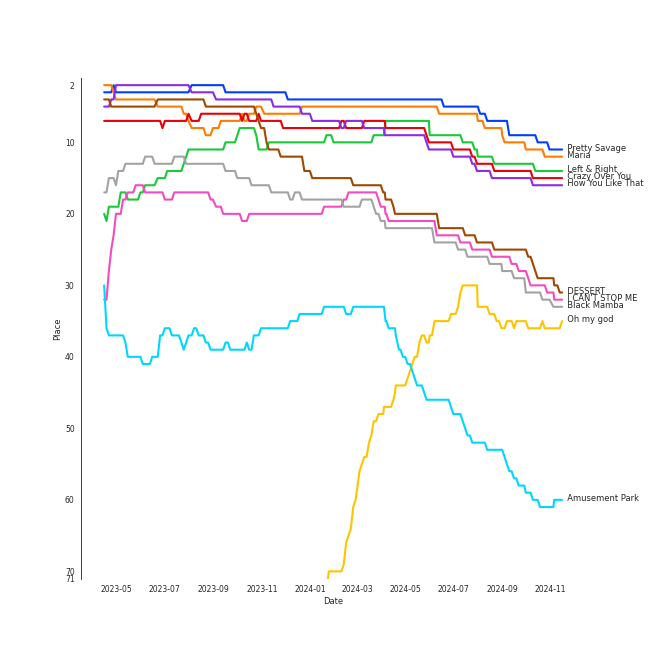

# Tracks in K-Pop from 2020

## Artists

| Art | Rank | Tracks | 💚 | Artist | 🔗 |
|:---|---:|---:|---:|:---|:---|
|  | 4 | 8 | 7 | [BLACKPINK](../../../artists/blackpink/overview.md) | [🔗](https://open.spotify.com/artist/41MozSoPIsD1dJM0CLPjZF) |
|  | 27 | 8 | 6 | [BTS](../../../artists/bts/overview.md) | [🔗](https://open.spotify.com/artist/3Nrfpe0tUJi4K4DXYWgMUX) |
|  | 6 | 7 | 4 | [(G)I-DLE](../../../artists/(g)i-dle/overview.md) | [🔗](https://open.spotify.com/artist/2AfmfGFbe0A0WsTYm0SDTx) |
|  | 9 | 6 | 4 | [TWICE](../../../artists/twice/overview.md) | [🔗](https://open.spotify.com/artist/7n2Ycct7Beij7Dj7meI4X0) |
|  | 28 | 4 | 4 | [Dreamcatcher](../../../artists/dreamcatcher/overview.md) | [🔗](https://open.spotify.com/artist/5V1qsQHdXNm4ZEZHWvFnqQ) |
|  | 10 | 7 | 3 | [Stray Kids](../../../artists/stray_kids/overview.md) | [🔗](https://open.spotify.com/artist/2dIgFjalVxs4ThymZ67YCE) |
|  | 90 | 5 | 3 | [Agust D](../../../artists/agust_d/overview.md) | [🔗](https://open.spotify.com/artist/5RmQ8k4l3HZ8JoPb4mNsML) |
|  | 7 | 4 | 3 | [ENHYPEN](../../../artists/enhypen/overview.md) | [🔗](https://open.spotify.com/artist/5t5FqBwTcgKTaWmfEbwQY9) |
|  | 53 | 4 | 3 | [BAEKHYUN](../../../artists/baekhyun/overview.md) | [🔗](https://open.spotify.com/artist/4ufh0WuMZh6y4Dmdnklvdl) |
|  | 376 | 3 | 3 | IZ*ONE | [🔗](https://open.spotify.com/artist/5r1tUTxVSgvBHnoDuDODPH) |

View all

| Art | Rank | Tracks | 💚 | Artist | 🔗 |
|:---|---:|---:|---:|:---|:---|
|  | 8 | 3 | 3 | [TAEYEON](../../../artists/taeyeon/overview.md) | [🔗](https://open.spotify.com/artist/3qNVuliS40BLgXGxhdBdqu) |
|  | 5 | 3 | 3 | [ITZY](../../../artists/itzy/overview.md) | [🔗](https://open.spotify.com/artist/2KC9Qb60EaY0kW4eH68vr3) |
|  | 12 | 4 | 2 | [SEVENTEEN](../../../artists/seventeen/overview.md) | [🔗](https://open.spotify.com/artist/7nqOGRxlXj7N2JYbgNEjYH) |
|  | 97 | 3 | 2 | [LOONA](../../../artists/loona/overview.md) | [🔗](https://open.spotify.com/artist/52zMTJCKluDlFwMQWmccY7) |
|  | 127 | 3 | 2 | K/DA | [🔗](https://open.spotify.com/artist/4gOc8TsQed9eqnqJct2c5v) |
|  | 128 | 3 | 2 | League of Legends | [🔗](https://open.spotify.com/artist/47mIJdHORyRerp4os813jD) |
|  | 252 | 3 | 2 | [NCT U](../../../artists/nct_u/overview.md) | [🔗](https://open.spotify.com/artist/3paGCCtX1Xr4Gx53mSeZuQ) |
|  | 16 | 3 | 2 | [MAMAMOO](../../../artists/mamamoo/overview.md) | [🔗](https://open.spotify.com/artist/0XATRDCYuuGhk0oE7C0o5G) |
|  | 51 | 2 | 2 | [HWASA](../../../artists/hwasa/overview.md) | [🔗](https://open.spotify.com/artist/7bmYpVgQub656uNTu6qGNQ) |
|  | 100 | 2 | 2 | Red Velvet - IRENE & SEULGI | [🔗](https://open.spotify.com/artist/6bwp9ObI8FWvMPCIWVBmhl) |
|  | 44 | 2 | 2 | [SUNMI](../../../artists/sunmi/overview.md) | [🔗](https://open.spotify.com/artist/6MoXcK2GyGg7FIyxPU5yW6) |
|  | 42 | 2 | 2 | [EVERGLOW](../../../artists/everglow/overview.md) | [🔗](https://open.spotify.com/artist/3ZZzT0naD25RhY2uZvIKkJ) |
|  | 89 | 2 | 2 | [OH MY GIRL](../../../artists/oh_my_girl/overview.md) | [🔗](https://open.spotify.com/artist/2019zR22qK2RBvCqtudBaI) |
|  | 435 | 2 | 2 | MAX | [🔗](https://open.spotify.com/artist/1bqxdqvUtPWZri43cKHac8) |
|  | 338 | 2 | 2 | SUGA | [🔗](https://open.spotify.com/artist/0ebNdVaOfp6N0oZ1guIxM8) |
|  | 55 | 3 | 1 | [TAEMIN](../../../artists/taemin/overview.md) | [🔗](https://open.spotify.com/artist/13rF01aOogvnkuQXOlgTW8) |
|  | 61 | 2 | 1 | [PENTAGON](../../../artists/pentagon/overview.md) | [🔗](https://open.spotify.com/artist/1wKpMkucynaTfG8lyPprYV) |
|  | 399 | 1 | 1 | Wolftyla | [🔗](https://open.spotify.com/artist/7qd6KGoABHifvXKeFNe2Yb) |
|  | 30 | 1 | 1 | [NCT 127](../../../artists/nct_127/overview.md) | [🔗](https://open.spotify.com/artist/7f4ignuCJhLXfZ9giKT7rH) |
|  | 113 | 1 | 1 | KAI | [🔗](https://open.spotify.com/artist/6iVo62B0bdTknRcrktCmak) |
|  | 258 | 1 | 1 | [WJSN](../../../artists/wjsn/overview.md) | [🔗](https://open.spotify.com/artist/6hhqsQZhtp9hfaZhSd0VSD) |
|  | 95 | 1 | 1 | Lexie Liu | [🔗](https://open.spotify.com/artist/6fs2or0cKLEM2xohWq8SoX) |
|  | 1 | 1 | 1 | [aespa](../../../artists/aespa/overview.md) | [🔗](https://open.spotify.com/artist/6YVMFz59CuY7ngCxTxjpxE) |
|  | 29 | 1 | 1 | [JEON SOYEON](../../../artists/jeon_soyeon/overview.md) | [🔗](https://open.spotify.com/artist/6Xg22wJOAcnvPUfk5WvODH) |
|  | 72 | 1 | 1 | [BIBI](../../../artists/bibi/overview.md) | [🔗](https://open.spotify.com/artist/6UbmqUEgjLA6jAcXwbM1Z9) |
|  | 63 | 1 | 1 | [CLC](../../../artists/clc/overview.md) | [🔗](https://open.spotify.com/artist/6QyO41KctzGc70mVaVnXQO) |
|  | 88 | 1 | 1 | [Dua Lipa](../../../artists/dua_lipa/overview.md) | [🔗](https://open.spotify.com/artist/6M2wZ9GZgrQXHCFfjv46we) |
|  | 146 | 1 | 1 | Jung Kook | [🔗](https://open.spotify.com/artist/6HaGTQPmzraVmaVxvz6EUc) |
|  | 45 | 1 | 1 | [ATEEZ](../../../artists/ateez/overview.md) | [🔗](https://open.spotify.com/artist/68KmkJeZGfwe1OUaivBa2L) |
|  | 435 | 1 | 1 | Jessi | [🔗](https://open.spotify.com/artist/64k5e9kV9MdukXjFrR5R37) |
|  | 260 | 1 | 1 | SuperM | [🔗](https://open.spotify.com/artist/5BHFSMEjfLVx1JwRWjAOsE) |
|  | 345 | 1 | 1 | YooA | [🔗](https://open.spotify.com/artist/4ur1jCwyNlhgd0viJkOtcQ) |
|  | 435 | 1 | 1 | Seraphine | [🔗](https://open.spotify.com/artist/4TqlcgMFDryY96KWcvrhTv) |
|  | 59 | 1 | 1 | Loopy | [🔗](https://open.spotify.com/artist/3l9s67pOK4Stw9yW1wr0Bg) |
|  | 57 | 1 | 1 | HYO | [🔗](https://open.spotify.com/artist/3U7bOaJLuFkrmDQ1C1OqKl) |
|  | 314 | 1 | 1 | Cherry Bullet | [🔗](https://open.spotify.com/artist/3IJCdgkBZbieocLZ4e94GZ) |
|  | 3 | 1 | 1 | [IU](../../../artists/iu/overview.md) | [🔗](https://open.spotify.com/artist/3HqSLMAZ3g3d5poNaI7GOU) |
|  | 435 | 1 | 1 | DKZ | [🔗](https://open.spotify.com/artist/31eyTcfjAke5hFX3az3nRE) |
|  | 435 | 1 | 1 | Apink | [🔗](https://open.spotify.com/artist/2uWcrwgWmZcQc3IPBs3tfU) |
|  | 129 | 1 | 1 | Madison Beer | [🔗](https://open.spotify.com/artist/2kRfqPViCqYdSGhYSM9R0Q) |
|  | 400 | 1 | 1 | Bea Miller | [🔗](https://open.spotify.com/artist/1o2NpYGqHiCq7FoiYdyd1x) |
|  | 435 | 1 | 1 | CIX | [🔗](https://open.spotify.com/artist/1lHfzEkKmmvdVDDDLKkcsd) |
|  | 24 | 1 | 1 | [NCT DREAM](../../../artists/nct_dream/overview.md) | [🔗](https://open.spotify.com/artist/1gBUSTR3TyDdTVFIaQnc02) |
|  | 435 | 1 | 1 | VERIVERY | [🔗](https://open.spotify.com/artist/1fWUcRSok57yRm8gPKj1Fc) |
|  | 435 | 1 | 1 | J.Y. Park | [🔗](https://open.spotify.com/artist/1TTx0YcbKUtJIZY1HEnh9B) |
|  | 140 | 1 | 1 | [Lady Gaga](../../../artists/lady_gaga/overview.md) | [🔗](https://open.spotify.com/artist/1HY2Jd0NmPuamShAr6KMms) |
|  | 435 | 1 | 1 | Jaira Burns | [🔗](https://open.spotify.com/artist/0tRFWXqKBBQcu5oFVOgVzX) |
|  | 374 | 1 | 1 | GFRIEND | [🔗](https://open.spotify.com/artist/0qlWcS66ohOIi0M8JZwPft) |
|  | 15 | 1 | 1 | [STAYC](../../../artists/stayc/overview.md) | [🔗](https://open.spotify.com/artist/01XYiBYaoMJcNhPokrg0l0) |
|  | 162 | 2 | 0 | [TOMORROW X TOGETHER](../../../artists/tomorrow_x_together/overview.md) | [🔗](https://open.spotify.com/artist/0ghlgldX5Dd6720Q3qFyQB) |
|  | 435 | 1 | 0 | CHEETAH | [🔗](https://open.spotify.com/artist/6ftZYkensUYXNiMM7nFwhE) |
|  | 60 | 1 | 0 | [Solar](../../../artists/solar/overview.md) | [🔗](https://open.spotify.com/artist/5cYcI546S8Lf97m4mNdYLD) |
| | 435 | 1 | 0 | Jeon Ji Woo | [🔗](https://open.spotify.com/artist/5A0sx2B7umJPdXgpfghJDJ) |
|  | 216 | 1 | 0 | JOOHONEY | [🔗](https://open.spotify.com/artist/4rpOWirhzqN7NPgRX76l1k) |
|  | 32 | 1 | 0 | [BoA](../../../artists/boa/overview.md) | [🔗](https://open.spotify.com/artist/4muJrGMndyYWqZtfk8OWy4) |
|  | 435 | 1 | 0 | KIM WOO SEOK | [🔗](https://open.spotify.com/artist/4k2MyP64uZ78mvjKd1Ciq2) |
|  | 435 | 1 | 0 | Yeeun | [🔗](https://open.spotify.com/artist/4hMhbcPHd2nsZFhY1TNp8Y) |
|  | 105 | 1 | 0 | Christopher | [🔗](https://open.spotify.com/artist/3zDRCqOhJXJfS2YWOEwGMC) |
|  | 435 | 1 | 0 | NiziU | [🔗](https://open.spotify.com/artist/3z8diLlUCkN1j9N9ZdnfBJ) |
|  | 287 | 1 | 0 | PSY | [🔗](https://open.spotify.com/artist/2dd5mrQZvg6SmahdgVKDzh) |
|  | 435 | 1 | 0 | RM | [🔗](https://open.spotify.com/artist/2auC28zjQyVTsiZKNgPRGs) |
|  | 313 | 1 | 0 | JAMIE | [🔗](https://open.spotify.com/artist/2YXlVLKq3X3soXd2aXUtIT) |
|  | 14 | 1 | 0 | [CHUNG HA](../../../artists/chung_ha/overview.md) | [🔗](https://open.spotify.com/artist/2PSJ6YriU7JsFucxACpU7Y) |
|  | 435 | 1 | 0 | Bekuh Boom | [🔗](https://open.spotify.com/artist/260LldmHBR0r2wtWtjzNxL) |
|  | 2 | 1 | 0 | [Red Velvet](../../../artists/red_velvet/overview.md) | [🔗](https://open.spotify.com/artist/1z4g3DjTBBZKhvAroFlhOM) |
|  | 435 | 1 | 0 | Annika Wells | [🔗](https://open.spotify.com/artist/0kErUwb6xgWfkdn0RyZWHZ) |
|  | 132 | 1 | 0 | [THE BOYZ](../../../artists/the_boyz/overview.md) | [🔗](https://open.spotify.com/artist/0CmvFWTX9zmMNCUi6fHtAx) |
|  | 435 | 1 | 0 | Selena Gomez | [🔗](https://open.spotify.com/artist/0C8ZW7ezQVs4URX5aX7Kqx) |
|  | 435 | 1 | 0 | HYOYEON | [🔗](https://open.spotify.com/artist/0B3I6YgdnfXehUCpsO6oB8) |

## Albums

| Art | Rank | Tracks | 💚 | Album | Release Date | 🔗 |
|:---|---:|---:|---:|:---|:---|:---|
|  | 1 | 7 | 6 | THE ALBUM | 2020-10-02 | [🔗](https://open.spotify.com/album/71O60S5gIJSIAhdnrDIh3N) |
|  | 667 | 5 | 3 | D-2 | 2020-05-22 | [🔗](https://open.spotify.com/album/1Pp8t7yn2E3rz3R7ZqPn1O) |
|  | 381 | 4 | 3 | MAP OF THE SOUL : 7 | 2020-02-21 | [🔗](https://open.spotify.com/album/5W1XY5ucNATjTULERvXx9j) |
|  | 493 | 4 | 3 | BORDER : DAY ONE | 2020-11-30 | [🔗](https://open.spotify.com/album/3YxF7jTnpdNepWbO42f8lH) |
|  | 38 | 3 | 3 | Eyes Wide Open | 2020-10-26 | [🔗](https://open.spotify.com/album/33jypnU7WULxPaVrjj4RXH) |
|  | 667 | 3 | 3 | BE | 2020-11-20 | [🔗](https://open.spotify.com/album/6nYfHQnvkvOTNHnOhDT3sr) |
|  | 291 | 3 | 3 | 1st Album [Dystopia : The Tree of Language] | 2020-02-18 | [🔗](https://open.spotify.com/album/6m5pDOafdvIKxNRxx5hVbr) |
|  | 667 | 3 | 2 | Delight - The 2nd Mini Album | 2020-05-25 | [🔗](https://open.spotify.com/album/75sPv82oaDKYjtuuS4l3Vc) |
|  | 40 | 3 | 1 | I trust | 2020-04-06 | [🔗](https://open.spotify.com/album/57sl8AvqVqm4Fadre0z8FQ) |
|  | 667 | 3 | 1 | GO LIVE | 2020-06-17 | [🔗](https://open.spotify.com/album/6DWLIzvmiLPAuDWYZqrLQo) |

View all

| Art | Rank | Tracks | 💚 | Album | Release Date | 🔗 |
|:---|---:|---:|---:|:---|:---|:---|
|  | 95 | 2 | 2 | What Do I Call You - The 4th Mini Album | 2020-12-15 | [🔗](https://open.spotify.com/album/70XJeDlFe1LmZo1lyFKyq3) |
|  | 667 | 2 | 2 | One-reeler / Act IV | 2020-12-07 | [🔗](https://open.spotify.com/album/3gfl9D7cMW3K87YiMbqsWK) |
|  | 262 | 2 | 2 | Not Shy | 2020-08-17 | [🔗](https://open.spotify.com/album/5NN55LKbjzX16a7Uf8u7Os) |
|  | 158 | 2 | 2 | NONSTOP | 2020-04-27 | [🔗](https://open.spotify.com/album/7J8Kp48L7RdLkpjSVrO5PY) |
|  | 148 | 2 | 2 | IN LIFE | 2020-09-14 | [🔗](https://open.spotify.com/album/0aERWcI2KYSCM4biUihB9X) |
|  | 667 | 2 | 1 | [12:00] | 2020-10-19 | [🔗](https://open.spotify.com/album/3obToaukLcPbCLPPmWFzQi) |
|  | 241 | 2 | 1 | Never Gonna Dance Again : Act 1 - The 3rd Album | 2020-09-07 | [🔗](https://open.spotify.com/album/6YfGgOaUnhs0A9brMqjpHf) |
|  | 378 | 2 | 1 | NCT RESONANCE Pt. 1 - The 2nd Album | 2020-10-12 | [🔗](https://open.spotify.com/album/6kudlOyCqSQfsBVSdPZEu4) |
|  | 21 | 2 | 1 | Heng:garæ | 2020-06-22 | [🔗](https://open.spotify.com/album/3q6lN3kfsDgGaQUC7kVASH) |
|  | 164 | 2 | 1 | ALL OUT | 2020-11-06 | [🔗](https://open.spotify.com/album/26IdRjba8f8DNa7c0FwfQb) |
|  | 667 | 2 | 0 | SKZ2020 | 2020-03-18 | [🔗](https://open.spotify.com/album/6QIWJVJPPgAA5c4aIb1zCA) |
|  | 543 | 1 | 1 | 回:Walpurgis Night | 2020-11-09 | [🔗](https://open.spotify.com/album/6keRNtq7CnhNrD2EIKOA6h) |
|  | 613 | 1 | 1 | reminiscence | 2020-02-03 | [🔗](https://open.spotify.com/album/0zH0C0fkzAjhSnGKLOuxwX) |
|  | 667 | 1 | 1 | pporappippam | 2020-06-29 | [🔗](https://open.spotify.com/album/5IKVYCIhY5SyMhj1cYovz3) |
|  | 664 | 1 | 1 | eight | 2020-05-06 | [🔗](https://open.spotify.com/album/5vJNAlQeTf9lsulO1YlmSt) |
|  | 667 | 1 | 1 | [Dystopia : Lose Myself] | 2020-08-17 | [🔗](https://open.spotify.com/album/0cDPkovaIsxLcIghyT9LKz) |
|  | 220 | 1 | 1 | [#] | 2020-02-05 | [🔗](https://open.spotify.com/album/3OOqAsk58Xv8DHu1gRGtaC) |
|  | 667 | 1 | 1 | When We Disco | 2020-08-12 | [🔗](https://open.spotify.com/album/1PllJjUqafNlQ23eBqs511) |
|  | 154 | 1 | 1 | WE:TH | 2020-10-12 | [🔗](https://open.spotify.com/album/1ASYbBYBwV6Rcfc2ycqmlK) |
|  | 468 | 1 | 1 | TREASURE EPILOGUE : Action To Answer | 2020-01-06 | [🔗](https://open.spotify.com/album/3TTkDOcSzRQCvGMT7VmmPE) |
|  | 162 | 1 | 1 | TRAVEL | 2020-11-03 | [🔗](https://open.spotify.com/album/3xje7wSW2xwQx2GNJ5cfNu) |
|  | 601 | 1 | 1 | THE BADDEST | 2020-08-27 | [🔗](https://open.spotify.com/album/7C8nskYbHG7N0LDrNVvt7x) |
|  | 530 | 1 | 1 | Super One -The 1st Album | 2020-09-25 | [🔗](https://open.spotify.com/album/10fdwvVIpa0raPkZUTILAt) |
|  | 667 | 1 | 1 | Still With You | 2020-06-05 | [🔗](https://open.spotify.com/album/0i3baFZqWSrjjgTWrhKunB) |
|  | 122 | 1 | 1 | Star To A Young Culture | 2020-11-12 | [🔗](https://open.spotify.com/album/4PrRd0lIunUEiiE5rbZklR) |
|  | 667 | 1 | 1 | Reload | 2020-04-29 | [🔗](https://open.spotify.com/album/1V5ilz8ghPl1PZJA1hbw3r) |
|  | 667 | 1 | 1 | Physical (feat. Hwa Sa) | 2020-01-28 | [🔗](https://open.spotify.com/album/6apIJi4hf7U6cBOFwIqq1b) |
|  | 667 | 1 | 1 | Neverland | 2020-06-09 | [🔗](https://open.spotify.com/album/5DHseF14USVgIZ6AzsX9bi) |
|  | 187 | 1 | 1 | Naughty | 2020-07-20 | [🔗](https://open.spotify.com/album/2lkUE2gkw5sX0fGzZZCs0N) |
|  | 667 | 1 | 1 | NUNA | 2020-07-30 | [🔗](https://open.spotify.com/album/6XBIkDFhDgc3PQOUEcO2fd) |
|  | 667 | 1 | 1 | NCT RESONANCE Pt. 2 - The 2nd Album | 2020-11-23 | [🔗](https://open.spotify.com/album/5Dq6jkYO5H7KzxXSazhLxs) |
|  | 667 | 1 | 1 | NCT #127 Neo Zone - The 2nd Album | 2020-03-06 | [🔗](https://open.spotify.com/album/5YOvg682zFOleCiSndLnZr) |
|  | 135 | 1 | 1 | Monster - The 1st Mini Album | 2020-07-06 | [🔗](https://open.spotify.com/album/4DFheSBXhfewjz7SSe4Kyc) |
|  | 17 | 1 | 1 | María | 2020-06-29 | [🔗](https://open.spotify.com/album/5YYY7QCkq3pSw4Hoc1m0D3) |
|  | 667 | 1 | 1 | LUPIN | 2020-03-15 | [🔗](https://open.spotify.com/album/361AnnYEYLl0Z7zF7Xo0Dq) |
|  | 667 | 1 | 1 | LOOK | 2020-04-13 | [🔗](https://open.spotify.com/album/49NKBZDb92AQlMFypkZRTF) |
|  | 460 | 1 | 1 | KAZINO | 2020-04-29 | [🔗](https://open.spotify.com/album/1f9cws6SZ0iKoHrcmn39ZY) |
|  | 208 | 1 | 1 | KAI - The 1st Mini Album | 2020-11-30 | [🔗](https://open.spotify.com/album/6xpxMAUhk8hiDTa5zT7F86) |
|  | 582 | 1 | 1 | IT'z ME | 2020-03-09 | [🔗](https://open.spotify.com/album/7ynKAohxfwPUZzvU8f1p1U) |
|  | 667 | 1 | 1 | Happy | 2020-05-04 | [🔗](https://open.spotify.com/album/1nPB6o7EjGvUORXlnioEPk) |
|  | 667 | 1 | 1 | Hands Up | 2020-02-11 | [🔗](https://open.spotify.com/album/5HyrUteikoFGu38bAf7zYc) |
|  | 667 | 1 | 1 | HELLO Chapter 3: Hello, Strange Time | 2020-10-27 | [🔗](https://open.spotify.com/album/6w3QkgYGtf6LfiWb5iCYc1) |
|  | 82 | 1 | 1 | HELICOPTER | 2020-09-02 | [🔗](https://open.spotify.com/album/1uwfxRAhW1hxclCVkzku8d) |
|  | 667 | 1 | 1 | FACE ME | 2020-01-07 | [🔗](https://open.spotify.com/album/4i3Q8eTqefwISi3WltwzAW) |
|  | 667 | 1 | 1 | Dingga | 2020-10-20 | [🔗](https://open.spotify.com/album/4xzsBcZaK04c8IE5iVyMNK) |
|  | 240 | 1 | 1 | DUMDi DUMDi | 2020-08-03 | [🔗](https://open.spotify.com/album/0NC6QFvAc9H9r5iov9QwjK) |
|  | 37 | 1 | 1 | DESSERT | 2020-07-22 | [🔗](https://open.spotify.com/album/5brSFD1knAOSM7j6083naD) |
|  | 518 | 1 | 1 | Chromatica | 2020-05-29 | [🔗](https://open.spotify.com/album/05c49JgPmL4Uz2ZeqRx5SP) |
|  | 232 | 1 | 1 | CRY FOR ME | 2020-12-18 | [🔗](https://open.spotify.com/album/2aRAPmBCEdo9pWimsI5l87) |
|  | 667 | 1 | 1 | Bon Voyage | 2020-09-07 | [🔗](https://open.spotify.com/album/2dFsfVOAwvmRV8hOBdssiI) |
|  | 667 | 1 | 1 | Blueberry Eyes (feat. SUGA of BTS) | 2020-09-15 | [🔗](https://open.spotify.com/album/2dEJHnsuxIij7YeBbt0sVm) |
|  | 39 | 1 | 1 | Black Mamba | 2020-11-17 | [🔗](https://open.spotify.com/album/3syEYrKIsgxaZMB5t1dVG7) |
|  | 667 | 1 | 1 | BLOOM*IZ | 2020-02-17 | [🔗](https://open.spotify.com/album/5dm3PMCHxTSOdDFZ1hlfMm) |
|  | 62 | 1 | 1 | Amusement Park | 2020-12-21 | [🔗](https://open.spotify.com/album/1azcqabc4kDgRNMWFA02wZ) |
|  | 97 | 1 | 1 | ; [Semicolon] | 2020-10-19 | [🔗](https://open.spotify.com/album/1EMYSiKKTSKLZrOC2nTStL) |
|  | 591 | 1 | 1 | -77.82x-78.29 | 2020-09-21 | [🔗](https://open.spotify.com/album/4kMID9cggWEko9mOb1zisI) |
|  | 667 | 1 | 0 | minisode1 : Blue Hour | 2020-10-26 | [🔗](https://open.spotify.com/album/2DDNDdePEx9R0bBwRqahdr) |
|  | 667 | 1 | 0 | i'M THE TREND | 2020-07-07 | [🔗](https://open.spotify.com/album/03TbZLPSRsHWX11umzK4qf) |
|  | 667 | 1 | 0 | WANNA BE MYSELF | 2020-09-10 | [🔗](https://open.spotify.com/album/0n62copUsWrST9M6AsYfZI) |
|  | 667 | 1 | 0 | Universe : The Black Hall | 2020-02-12 | [🔗](https://open.spotify.com/album/7KrRT3DMomHHFtRCdK6sPs) |
|  | 667 | 1 | 0 | Tik Tock Hits 2020 | 2020-06-12 | [🔗](https://open.spotify.com/album/4Da9F5PAFILkjmNmm81NZ3) |
|  | 667 | 1 | 0 | The Dream Chapter: ETERNITY | 2020-05-18 | [🔗](https://open.spotify.com/album/4jTVGyo4fSSFniFPbfr0bW) |
|  | 667 | 1 | 0 | THE BOYZ 5th MINI ALBUM [CHASE] | 2020-09-21 | [🔗](https://open.spotify.com/album/6HwY3FwprtqsmMuoLnXWhT) |
|  | 667 | 1 | 0 | SPIT IT OUT | 2020-04-23 | [🔗](https://open.spotify.com/album/1pLSlOXtHKPoSoB6ovnIAK) |
|  | 667 | 1 | 0 | Our Beloved BoA #4 - SM STATION | 2020-08-21 | [🔗](https://open.spotify.com/album/0MYodAzFX64jToQpE5jWNW) |
|  | 667 | 1 | 0 | Never Gonna Dance Again : Act 2 - The 3rd Album | 2020-11-09 | [🔗](https://open.spotify.com/album/3xgFGYUOVxGp7pZywdf7AC) |
|  | 667 | 1 | 0 | Make you happy | 2020-06-30 | [🔗](https://open.spotify.com/album/1wIIu2i7A56TlMD99CVNQD) |
|  | 667 | 1 | 0 | MORE & MORE | 2020-06-01 | [🔗](https://open.spotify.com/album/5KsduuDNWzt65TaHzmtciv) |
|  | 667 | 1 | 0 | MIXTAPE [ PSYCHE ] | 2020-10-09 | [🔗](https://open.spotify.com/album/3UxCU4YihXm1ghv3hKqfnz) |
|  | 667 | 1 | 0 | MAP OF THE SOUL : 7 ~ THE JOURNEY ~ | 2020-07-14 | [🔗](https://open.spotify.com/album/1nScVw87kRJiT2bg2Kswhp) |
|  | 667 | 1 | 0 | GOOD GIRL Episode 3 | 2020-06-19 | [🔗](https://open.spotify.com/album/2iY5eEAH23aCB9JGCNZO5k) |
|  | 667 | 1 | 0 | Bad Boy | 2020-09-23 | [🔗](https://open.spotify.com/album/4IRuxkSbw7iZZmnr6Rly2Q) |
|  | 315 | 1 | 0 | BETTER - The 10th Album | 2020-12-01 | [🔗](https://open.spotify.com/album/3YXfuI3E6OxcrtXnjAgNkM) |
|  | 667 | 1 | 0 | 24H | 2020-08-24 | [🔗](https://open.spotify.com/album/24Uj6VdVytaReqt1KJWxfc) |
|  | 667 | 1 | 0 | 1ST DESIRE [GREED] | 2020-05-25 | [🔗](https://open.spotify.com/album/2yWth82E8BQiDL2JgDmVT9) |

## Tracks

| Art | Track | Album | Artists | Label | Rank | 💚 | 🔗 |
|:---|:---|:---|:---|:---|---:|:---|:---|
|  | Pretty Savage | THE ALBUM | [BLACKPINK](../../../artists/blackpink/overview.md) | [Interscope Records](../../../labels/interscope_records), [YG Entertainment](../../../labels/yg_entertainment) | 11 | 💚 | [🔗](https://open.spotify.com/track/1XnpzbOGptRwfJhZgLbmSr) |
|  | Maria | María | [HWASA](../../../artists/hwasa/overview.md) | [RBW, Inc](../../../labels/rbw_inc_) | 12 | 💚 | [🔗](https://open.spotify.com/track/0ZeGfEAL5Rl4pd5LZBGuEK) |
|  | Left & Right | Heng:garæ | [SEVENTEEN](../../../artists/seventeen/overview.md) | [PLEDIS Entertainment](../../../labels/pledis_entertainment) | 14 | 💚 | [🔗](https://open.spotify.com/track/5QGooKayQPVZMUDc8Qt3Dm) |
|  | Crazy Over You | THE ALBUM | [BLACKPINK](../../../artists/blackpink/overview.md) | [Interscope Records](../../../labels/interscope_records), [YG Entertainment](../../../labels/yg_entertainment) | 15 | 💚 | [🔗](https://open.spotify.com/track/7qq0EOPW4RRlqdvMBmdd73) |
|  | How You Like That | THE ALBUM | [BLACKPINK](../../../artists/blackpink/overview.md) | [Interscope Records](../../../labels/interscope_records), [YG Entertainment](../../../labels/yg_entertainment) | 16 | 💚 | [🔗](https://open.spotify.com/track/4SFknyjLcyTLJFPKD2m96o) |
|  | DESSERT | DESSERT | HYO, Loopy, [JEON SOYEON](../../../artists/jeon_soyeon/overview.md) | [SM Entertainment](../../../labels/sm_entertainment) | 31 | 💚 | [🔗](https://open.spotify.com/track/6u0pZe0Uv7GBR0iKptfWRf) |
|  | I CAN'T STOP ME | Eyes Wide Open | [TWICE](../../../artists/twice/overview.md) | [Republic Records](../../../labels/republic_records) | 32 | 💚 | [🔗](https://open.spotify.com/track/37ZtpRBkHcaq6hHy0X98zn) |
|  | Black Mamba | Black Mamba | [aespa](../../../artists/aespa/overview.md) | [SM Entertainment](../../../labels/sm_entertainment) | 33 | 💚 | [🔗](https://open.spotify.com/track/1t2qYCAjUAoGfeFeoBlK51) |
|  | Oh my god | I trust | [(G)I-DLE](../../../artists/(g)i-dle/overview.md) | [Universal Music LLC](../../../labels/universal_music_llc) | 35 | 💚 | [🔗](https://open.spotify.com/track/2DmRXiyn03tOqKgEJXlaiJ) |
|  | Amusement Park | Amusement Park | [BAEKHYUN](../../../artists/baekhyun/overview.md) | [SM Entertainment](../../../labels/sm_entertainment) | 60 | 💚 | [🔗](https://open.spotify.com/track/1TUkEXQrskATO9SoB4QMUN) |

View all

| Art | Track | Album | Artists | Label | Rank | 💚 | 🔗 |
|:---|:---|:---|:---|:---|---:|:---|:---|
|  | HELICOPTER | HELICOPTER | [CLC](../../../artists/clc/overview.md) | [Universal Music LLC](../../../labels/universal_music_llc) | 90 | 💚 | [🔗](https://open.spotify.com/track/2hJS7BdEaH9Jo8MeJujsHT) |
|  | What Do I Call You | What Do I Call You - The 4th Mini Album | [TAEYEON](../../../artists/taeyeon/overview.md) | [SM Entertainment](../../../labels/sm_entertainment) | 113 | 💚 | [🔗](https://open.spotify.com/track/3Wu4lFjkhcXxB6WWaX9gtr) |
|  | HOME;RUN | ; [Semicolon] | [SEVENTEEN](../../../artists/seventeen/overview.md) | [PLEDIS Entertainment](../../../labels/pledis_entertainment) | 116 | 💚 | [🔗](https://open.spotify.com/track/2iW0q5jJJT5HKlIs25AAgv) |
|  | SO BAD | Star To A Young Culture | [STAYC](../../../artists/stayc/overview.md) | [High Up Entertainment](../../../labels/high_up_entertainment) | 154 | 💚 | [🔗](https://open.spotify.com/track/13KR2yNRDrbKwR3dOKCDl4) |
|  | Monster | Monster - The 1st Mini Album | Red Velvet - IRENE & SEULGI | [SM Entertainment](../../../labels/sm_entertainment) | 169 | 💚 | [🔗](https://open.spotify.com/track/6c1QaQHdDhtFMfUkhueuXK) |
|  | Back Door | IN LIFE | [Stray Kids](../../../artists/stray_kids/overview.md) | [Republic Records](../../../labels/republic_records) | 184 | 💚 | [🔗](https://open.spotify.com/track/0XuepwFJUcKN8T5zTqoP0F) |
|  | Daisy | WE:TH | [PENTAGON](../../../artists/pentagon/overview.md) | [Universal Music LLC](../../../labels/universal_music_llc) | 193 | 💚 | [🔗](https://open.spotify.com/track/14pjnaIqkpReO5D0tHofAS) |
|  | Dolphin | NONSTOP | [OH MY GIRL](../../../artists/oh_my_girl/overview.md) | [WM Entertainment](../../../labels/wm_entertainment) | 205 | 💚 | [🔗](https://open.spotify.com/track/3NfgdU9mbIVhcJF3XvC0c9) |
|  | AYA | TRAVEL | [MAMAMOO](../../../artists/mamamoo/overview.md) | [RBW Inc.](../../../labels/rbw_inc_) | 211 | 💚 | [🔗](https://open.spotify.com/track/4BZXVFYCb76Q0Klojq4piV) |
|  | Naughty | Naughty | Red Velvet - IRENE & SEULGI | [SM Entertainment](../../../labels/sm_entertainment) | 261 | 💚 | [🔗](https://open.spotify.com/track/0P8lbWigAHXPKxUG60xh79) |
|  | Mmmh | KAI - The 1st Mini Album | KAI | [SM Entertainment](../../../labels/sm_entertainment) | 295 | 💚 | [🔗](https://open.spotify.com/track/5dntGTbUtmUO239wQ0k3yM) |
|  | So What | [#] | [LOONA](../../../artists/loona/overview.md) | BlockBerryCreative | 308 | 💚 | [🔗](https://open.spotify.com/track/1ry2mTVmAJHbNLzl5qww5v) |
|  | CRY FOR ME | CRY FOR ME | [TWICE](../../../artists/twice/overview.md) | [Republic Records](../../../labels/republic_records) | 323 | 💚 | [🔗](https://open.spotify.com/track/2xtP8RNbo2BEMzLX7tK7aq) |
|  | DUMDi DUMDi | DUMDi DUMDi | [(G)I-DLE](../../../artists/(g)i-dle/overview.md) | [Universal Music LLC](../../../labels/universal_music_llc) | 336 | 💚 | [🔗](https://open.spotify.com/track/2fJ70dRX7J4jiVxKUQQp7C) |
|  | Criminal | Never Gonna Dance Again : Act 1 - The 3rd Album | [TAEMIN](../../../artists/taemin/overview.md) | [SM Entertainment](../../../labels/sm_entertainment) | 337 | 💚 | [🔗](https://open.spotify.com/track/2KXEE2MsPZLmT38XiyAOpH) |
|  | Be In Love | Not Shy | [ITZY](../../../artists/itzy/overview.md) | [Republic Records](../../../labels/republic_records) | 398 | 💚 | [🔗](https://open.spotify.com/track/0FGeJSm4Iix7OdvjvENrwx) |
|  | Better | BETTER - The 10th Album | [BoA](../../../artists/boa/overview.md) | [SM Entertainment](../../../labels/sm_entertainment) | 445 | | [🔗](https://open.spotify.com/track/2k44rKotfi2k55hwwiCImN) |
|  | Jazz Bar | 1st Album [Dystopia : The Tree of Language] | [Dreamcatcher](../../../artists/dreamcatcher/overview.md) | [Dreamcatcher Company](../../../labels/dreamcatcher_company) | 546 | 💚 | [🔗](https://open.spotify.com/track/5XVjj6hJTWgYiDx72Wo5QS) |
|  | Make A Wish (Birthday Song) | NCT RESONANCE Pt. 1 - The 2nd Album | [NCT U](../../../artists/nct_u/overview.md) | [SM Entertainment](../../../labels/sm_entertainment) | 548 | 💚 | [🔗](https://open.spotify.com/track/6FdShjf7nA2cqEnpv1tIia) |
|  | Black Swan | MAP OF THE SOUL : 7 | [BTS](../../../artists/bts/overview.md) | [BIGHIT MUSIC](../../../labels/bighit_music) | 551 | 💚 | [🔗](https://open.spotify.com/track/2EmcTFQ1rM11wp2ztsXTHa) |
|  | Red Sun | 1st Album [Dystopia : The Tree of Language] | [Dreamcatcher](../../../artists/dreamcatcher/overview.md) | [Dreamcatcher Company](../../../labels/dreamcatcher_company) | 629 | 💚 | [🔗](https://open.spotify.com/track/0WXmPCkeeLjpTddcBI98GV) |
|  | KAZINO | KAZINO | [BIBI](../../../artists/bibi/overview.md) | FeelGhoodMusic | 690 | 💚 | [🔗](https://open.spotify.com/track/245onUPHGD1DYuiacxTuW0) |
|  | Answer | TREASURE EPILOGUE : Action To Answer | [ATEEZ](../../../artists/ateez/overview.md) | [KQ Entertainment](../../../labels/kq_entertainment) | 702 | 💚 | [🔗](https://open.spotify.com/track/3IdPtyJHB1WVPM4eCiCAKM) |
|  | Given-Taken | BORDER : DAY ONE | [ENHYPEN](../../../artists/enhypen/overview.md) | [BELIFT LAB](../../../labels/belift_lab) | 737 | 💚 | [🔗](https://open.spotify.com/track/69WpV0U7OMNFGyq8I63dcC) |
|  | Sour Candy (with BLACKPINK) | Chromatica | [Lady Gaga](../../../artists/lady_gaga/overview.md), [BLACKPINK](../../../artists/blackpink/overview.md) | [Interscope](../../../labels/interscope_records) | 785 | 💚 | [🔗](https://open.spotify.com/track/1IWNylpZ477gIVUDpJL66u) |
|  | Not Shy | Not Shy | [ITZY](../../../artists/itzy/overview.md) | [Republic Records](../../../labels/republic_records) | 789 | 💚 | [🔗](https://open.spotify.com/track/1ehags7lQMM1qX94VJkoaf) |
|  | Tiger Inside | Super One -The 1st Album | SuperM | [Capitol Records](../../../labels/capitol_records), [SM Entertainment](../../../labels/sm_entertainment) | 800 | 💚 | [🔗](https://open.spotify.com/track/1ADlTU9mFc3oDdD9Vla2Yw) |
|  | MAGO | 回:Walpurgis Night | GFRIEND | [SOURCE MUSIC](../../../labels/source_music) | 820 | 💚 | [🔗](https://open.spotify.com/track/46WaBBaEHzgbN88Ew0nh50) |
|  | WANNABE | IT'z ME | [ITZY](../../../artists/itzy/overview.md) | [Republic Records](../../../labels/republic_records) | 885 | 💚 | [🔗](https://open.spotify.com/track/4pspYVQGFHLPEFgQPD1J7e) |
|  | LA DI DA | -77.82x-78.29 | [EVERGLOW](../../../artists/everglow/overview.md) | YUEHUA ENTERTAINMENT KOREA | 901 | 💚 | [🔗](https://open.spotify.com/track/6mIjJONoUMvGPT9Kzrab3L) |
|  | THE BADDEST | THE BADDEST | K/DA, [(G)I-DLE](../../../artists/(g)i-dle/overview.md), Wolftyla, Bea Miller, League of Legends | Riot Games | 914 | 💚 | [🔗](https://open.spotify.com/track/2V4Fx72svQRxrFvNT1eq5f) |
|  | DUN DUN | reminiscence | [EVERGLOW](../../../artists/everglow/overview.md) | [Genie Music Corporation](../../../labels/genie_music_corporation), [Stone Music Entertainment](../../../labels/stone_music_entertainment) | 937 | 💚 | [🔗](https://open.spotify.com/track/3ejAkJLWQSEJDqDXxK3efB) |
|  | eight(Prod.&Feat. SUGA of BTS) | eight | [IU](../../../artists/iu/overview.md), SUGA | [EDAM Entertainment](../../../labels/edam_entertainment) | 1007 | 💚 | [🔗](https://open.spotify.com/track/0pYacDCZuRhcrwGUA5nTBe) |
|  | PHOTO | FACE ME | VERIVERY | [Genie Music Corporation](../../../labels/genie_music_corporation), [Stone Music Entertainment](../../../labels/stone_music_entertainment) | 1018 | 💚 | [🔗](https://open.spotify.com/track/0GG5yUUUwoyV7I4qx54mmC) |
|  | Physical (feat. Hwa Sa) | Physical (feat. Hwa Sa) | [Dua Lipa](../../../artists/dua_lipa/overview.md), [HWASA](../../../artists/hwasa/overview.md) | [Warner Records](../../../labels/warner_records) | 1018 | 💚 | [🔗](https://open.spotify.com/track/23jEeXRyrjFbfs2Q8tBwdI) |
|  | Hands Up | Hands Up | Cherry Bullet | [FNC Entertainment](../../../labels/fnc_entertainment) | 1018 | 💚 | [🔗](https://open.spotify.com/track/6KxACudfT4vVXnDUkjU6lN) |
|  | Dr. BeBe | Universe : The Black Hall | [PENTAGON](../../../artists/pentagon/overview.md) | [Universal Music LLC](../../../labels/universal_music_llc) | 1018 | | [🔗](https://open.spotify.com/track/2z0LVG9G2SpFaT5bHyWwjK) |
|  | FIESTA | BLOOM*IZ | IZ*ONE | [Genie Music Corporation](../../../labels/genie_music_corporation), [Stone Music Entertainment](../../../labels/stone_music_entertainment) | 1018 | 💚 | [🔗](https://open.spotify.com/track/6Ihdn6wW2UBhfTKWbP29KA) |
|  | Scream | 1st Album [Dystopia : The Tree of Language] | [Dreamcatcher](../../../artists/dreamcatcher/overview.md) | [Dreamcatcher Company](../../../labels/dreamcatcher_company) | 1018 | 💚 | [🔗](https://open.spotify.com/track/7FxshQAsTWmogWU959hz3T) |
|  | Filter | MAP OF THE SOUL : 7 | [BTS](../../../artists/bts/overview.md) | [BIGHIT MUSIC](../../../labels/bighit_music) | 1018 | 💚 | [🔗](https://open.spotify.com/track/4bZZVcgWWMWPBwzTTp642w) |
|  | ON | MAP OF THE SOUL : 7 | [BTS](../../../artists/bts/overview.md) | [BIGHIT MUSIC](../../../labels/bighit_music) | 1018 | 💚 | [🔗](https://open.spotify.com/track/0fZRNhPJ4AGmwY7rkpdbqK) |
|  | UGH! | MAP OF THE SOUL : 7 | [BTS](../../../artists/bts/overview.md) | [BIGHIT MUSIC](../../../labels/bighit_music) | 1018 | | [🔗](https://open.spotify.com/track/2QZe2H1f03t5PJWEMg2Mbe) |
|  | Kick It | NCT #127 Neo Zone - The 2nd Album | [NCT 127](../../../artists/nct_127/overview.md) | [SM Entertainment](../../../labels/sm_entertainment) | 1018 | 💚 | [🔗](https://open.spotify.com/track/1ayaOin9hxCtyhg4UsBTpg) |
|  | LUPIN | LUPIN | DKZ | ㈜ 동요엔터테인먼트 | 1018 | 💚 | [🔗](https://open.spotify.com/track/4wWXrCe0z1rrNbgjOBxHvF) |
|  | Chronosaurus | SKZ2020 | [Stray Kids](../../../artists/stray_kids/overview.md) | [Republic Records](../../../labels/republic_records) | 1018 | | [🔗](https://open.spotify.com/track/58epKNTOOt4RDWObkR9e43) |
|  | Voices | SKZ2020 | [Stray Kids](../../../artists/stray_kids/overview.md) | [Republic Records](../../../labels/republic_records) | 1018 | | [🔗](https://open.spotify.com/track/3zutAkkwy9Ucd9l4H4EReH) |
|  | LION | I trust | [(G)I-DLE](../../../artists/(g)i-dle/overview.md) | [Universal Music LLC](../../../labels/universal_music_llc) | 1018 | | [🔗](https://open.spotify.com/track/40OyiVO9NtBg9R2Gpwxs3u) |
|  | Luv U | I trust | [(G)I-DLE](../../../artists/(g)i-dle/overview.md) | [Universal Music LLC](../../../labels/universal_music_llc) | 1018 | | [🔗](https://open.spotify.com/track/2Mvdcda3pVMDASD7oZWPr4) |
|  | Dumhdurum | LOOK | Apink | PLAY M ENTERTAINMENT CORP. | 1018 | 💚 | [🔗](https://open.spotify.com/track/55kuHkT2CWhWKF6CoRDnJq) |
|  | Spit it out | SPIT IT OUT | [Solar](../../../artists/solar/overview.md) | [RBW, INC.](../../../labels/rbw_inc_) | 1018 | | [🔗](https://open.spotify.com/track/5F6RrFgt1yvRhNCdAEumM6) |
|  | Nonstop | NONSTOP | [OH MY GIRL](../../../artists/oh_my_girl/overview.md) | [WM Entertainment](../../../labels/wm_entertainment) | 1018 | 💚 | [🔗](https://open.spotify.com/track/5joNJn9LUvYcamWwa2iYCL) |
|  | Ridin' | Reload | [NCT DREAM](../../../artists/nct_dream/overview.md) | [SM Entertainment](../../../labels/sm_entertainment) | 1018 | 💚 | [🔗](https://open.spotify.com/track/0EMD15EVNwDlgGH2CH6ZEL) |
|  | Happy | Happy | [TAEYEON](../../../artists/taeyeon/overview.md) | [SM Entertainment](../../../labels/sm_entertainment) | 1018 | 💚 | [🔗](https://open.spotify.com/track/459mRPsscVLMvVL59gr7EM) |
|  | Fairy of Shampoo | The Dream Chapter: ETERNITY | [TOMORROW X TOGETHER](../../../artists/tomorrow_x_together/overview.md) | [Republic Records](../../../labels/republic_records) | 1018 | | [🔗](https://open.spotify.com/track/5JXpZcc3CeQaC6vAF1iaV5) |
|  | Burn It (feat. MAX) | D-2 | [Agust D](../../../artists/agust_d/overview.md), MAX | [BIGHIT MUSIC](../../../labels/bighit_music) | 1018 | 💚 | [🔗](https://open.spotify.com/track/38iufYNK4hUzS649Oe2kZy) |
|  | Daechwita | D-2 | [Agust D](../../../artists/agust_d/overview.md) | [BIGHIT MUSIC](../../../labels/bighit_music) | 1018 | 💚 | [🔗](https://open.spotify.com/track/1Y7AZ3akqDipAyo6mmOQTy) |
|  | Moonlight | D-2 | [Agust D](../../../artists/agust_d/overview.md) | [BIGHIT MUSIC](../../../labels/bighit_music) | 1018 | | [🔗](https://open.spotify.com/track/057xGYST5exVyNevufrioZ) |
|  | People | D-2 | [Agust D](../../../artists/agust_d/overview.md) | [BIGHIT MUSIC](../../../labels/bighit_music) | 1018 | 💚 | [🔗](https://open.spotify.com/track/4wDSEE082RPcnhXzPzFhCp) |
|  | Strange (feat. RM) | D-2 | [Agust D](../../../artists/agust_d/overview.md), RM | [BIGHIT MUSIC](../../../labels/bighit_music) | 1018 | | [🔗](https://open.spotify.com/track/6x2arhzc99oGlqM82V0mnd) |
|  | Red Moon | 1ST DESIRE [GREED] | KIM WOO SEOK | TOP MEDIA | 1018 | | [🔗](https://open.spotify.com/track/5DQc3NBa9FQfvtnUyciXsd) |
|  | Bungee | Delight - The 2nd Mini Album | [BAEKHYUN](../../../artists/baekhyun/overview.md) | [SM Entertainment](../../../labels/sm_entertainment) | 1018 | 💚 | [🔗](https://open.spotify.com/track/6wwmbBoBaFxptJwuvF2QdM) |
|  | Candy | Delight - The 2nd Mini Album | [BAEKHYUN](../../../artists/baekhyun/overview.md) | [SM Entertainment](../../../labels/sm_entertainment) | 1018 | 💚 | [🔗](https://open.spotify.com/track/6kKC35sKUh2FUx4M0qAL44) |
|  | Ghost | Delight - The 2nd Mini Album | [BAEKHYUN](../../../artists/baekhyun/overview.md) | [SM Entertainment](../../../labels/sm_entertainment) | 1018 | | [🔗](https://open.spotify.com/track/4pulHxja8nTUiojRtfwgTv) |
|  | MORE & MORE | MORE & MORE | [TWICE](../../../artists/twice/overview.md) | [Republic Records](../../../labels/republic_records) | 1018 | | [🔗](https://open.spotify.com/track/3omvXShuRPM3zbDpWYqf5g) |
|  | Still With You | Still With You | Jung Kook | [BIGHIT MUSIC](../../../labels/bighit_music) | 1018 | 💚 | [🔗](https://open.spotify.com/track/0eFMbKCRw8KByXyWBw8WO7) |
|  | Pantomime | Neverland | [WJSN](../../../artists/wjsn/overview.md) | [STARSHIP ENTERTAINMENT](../../../labels/starship_entertainment) | 1018 | 💚 | [🔗](https://open.spotify.com/track/4lPsBlof2cjAIArw0nOGvQ) |
|  | Gentleman | Tik Tock Hits 2020 | PSY | [UME - Global Clearing House](../../../labels/ume_-_global_clearing_house) | 1018 | | [🔗](https://open.spotify.com/track/26spalP6x2gUAab8rwB8dQ) |
|  | Blueprint | GO LIVE | [Stray Kids](../../../artists/stray_kids/overview.md) | [Republic Records](../../../labels/republic_records) | 1018 | | [🔗](https://open.spotify.com/track/2JzOF5Ex1BfufuZ6DgvOPe) |
|  | Easy | GO LIVE | [Stray Kids](../../../artists/stray_kids/overview.md) | [Republic Records](../../../labels/republic_records) | 1018 | | [🔗](https://open.spotify.com/track/4s9diT9GXpI7QiysMkoANG) |
|  | God’s Menu | GO LIVE | [Stray Kids](../../../artists/stray_kids/overview.md) | [Republic Records](../../../labels/republic_records) | 1018 | 💚 | [🔗](https://open.spotify.com/track/4XPXrcpyNr30Km6aPiflJy) |
|  | WITCH | GOOD GIRL Episode 3 | Yeeun, Jeon Ji Woo, JAMIE, CHEETAH, HYOYEON | [Genie Music Corporation](../../../labels/genie_music_corporation) | 1018 | | [🔗](https://open.spotify.com/track/2NAJnW4wgLcmyplAPHqCRE) |
|  | Fearless | Heng:garæ | [SEVENTEEN](../../../artists/seventeen/overview.md) | [PLEDIS Entertainment](../../../labels/pledis_entertainment) | 1018 | | [🔗](https://open.spotify.com/track/1bhuTWST1TYIVdrsEaQDKa) |
|  | pporappippam | pporappippam | [SUNMI](../../../artists/sunmi/overview.md) | Makeus Entertainment | 1018 | 💚 | [🔗](https://open.spotify.com/track/7oQh96s9YemWG3A4zkIbrU) |
|  | Make you happy | Make you happy | NiziU | [Sony Music Labels Inc.](../../../labels/sony_music_labels_inc_) | 1018 | | [🔗](https://open.spotify.com/track/1LnJVIG1BaHTRznuOgR0yc) |
|  | i'M THE TREND | i'M THE TREND | [(G)I-DLE](../../../artists/(g)i-dle/overview.md) | [Universal Music LLC](../../../labels/universal_music_llc) | 1018 | | [🔗](https://open.spotify.com/track/5Fkkhd5Sy1dCBkKdXLQl4U) |
|  | Stay Gold | MAP OF THE SOUL : 7 ~ THE JOURNEY ~ | [BTS](../../../artists/bts/overview.md) | [Universal Music LLC](../../../labels/universal_music_llc) | 1018 | | [🔗](https://open.spotify.com/track/3Ys2PYl1wyPKQIwyqhP9cQ) |
|  | NUNU NANA | NUNA | Jessi | P NATION | 1018 | 💚 | [🔗](https://open.spotify.com/track/2cUzIBGMvx2BZ2Q1fzjdl1) |
|  | When We Disco | When We Disco | J.Y. Park, [SUNMI](../../../artists/sunmi/overview.md) | [JYP Entertainment](../../../labels/jyp_entertainment) | 1018 | 💚 | [🔗](https://open.spotify.com/track/6t9nnPyEZfjcn1aLJ4l9AK) |
|  | BOCA | [Dystopia : Lose Myself] | [Dreamcatcher](../../../artists/dreamcatcher/overview.md) | [DREAMCATCHER COMPANY](../../../labels/dreamcatcher_company) | 1018 | 💚 | [🔗](https://open.spotify.com/track/2u7p3Bzkv8h0Yx7w7R370n) |
|  | Milky Way | Our Beloved BoA #4 - SM STATION | [Red Velvet](../../../artists/red_velvet/overview.md) | [SM Entertainment](../../../labels/sm_entertainment) | 1018 | | [🔗](https://open.spotify.com/track/2Oj5hRhkJH00VGzjBdQNq3) |
|  | 24H | 24H | [SEVENTEEN](../../../artists/seventeen/overview.md) | [PLEDIS ENTERTAINMENT](../../../labels/pledis_entertainment) | 1018 | | [🔗](https://open.spotify.com/track/3gAR6cBifLqbW8kOrMqZPr) |
|  | Bon voyage | Bon Voyage | YooA | [WM Entertainment](../../../labels/wm_entertainment) | 1018 | 💚 | [🔗](https://open.spotify.com/track/4X95Ecd1elHxTccGOko02c) |
|  | Clockwork | Never Gonna Dance Again : Act 1 - The 3rd Album | [TAEMIN](../../../artists/taemin/overview.md) | [SM Entertainment](../../../labels/sm_entertainment) | 1018 | | [🔗](https://open.spotify.com/track/09SIbdUVr34sBd7Uwwt63J) |
|  | WANNA BE MYSELF | WANNA BE MYSELF | [MAMAMOO](../../../artists/mamamoo/overview.md) | [RBW, Inc](../../../labels/rbw_inc_) | 1018 | | [🔗](https://open.spotify.com/track/0VPBuXtEG16NtN5ZGYJ7lV) |
|  | Any | IN LIFE | [Stray Kids](../../../artists/stray_kids/overview.md) | [Republic Records](../../../labels/republic_records) | 1018 | 💚 | [🔗](https://open.spotify.com/track/5S7kMbtEikXwCAHMu3R3jw) |
|  | Blueberry Eyes (feat. SUGA of BTS) | Blueberry Eyes (feat. SUGA of BTS) | MAX, SUGA | Colour Vision Records/Sony Music Entertainment | 1018 | 💚 | [🔗](https://open.spotify.com/track/5dn6QANKbf76pANGjMBida) |
|  | The Stealer | THE BOYZ 5th MINI ALBUM [CHASE] | [THE BOYZ](../../../artists/the_boyz/overview.md) | Cre.ker Entertainment | 1018 | | [🔗](https://open.spotify.com/track/2DQgD8rAJLKNptQFK70ndO) |
|  | Bad Boy | Bad Boy | [CHUNG HA](../../../artists/chung_ha/overview.md), Christopher | Parlophone Denmark | 1018 | | [🔗](https://open.spotify.com/track/1WCOna34eEMPgjfOOZkGQc) |
|  | Ice Cream (with Selena Gomez) | THE ALBUM | [BLACKPINK](../../../artists/blackpink/overview.md), Selena Gomez | [Interscope Records](../../../labels/interscope_records), [YG Entertainment](../../../labels/yg_entertainment) | 1018 | | [🔗](https://open.spotify.com/track/4JUPEh2DVSXFGExu4Uxevz) |
|  | Love To Hate Me | THE ALBUM | [BLACKPINK](../../../artists/blackpink/overview.md) | [Interscope Records](../../../labels/interscope_records), [YG Entertainment](../../../labels/yg_entertainment) | 1018 | 💚 | [🔗](https://open.spotify.com/track/7iKDsPfLT0d5mu2htfMKBZ) |
|  | Lovesick Girls | THE ALBUM | [BLACKPINK](../../../artists/blackpink/overview.md) | [Interscope Records](../../../labels/interscope_records), [YG Entertainment](../../../labels/yg_entertainment) | 1018 | 💚 | [🔗](https://open.spotify.com/track/4Ws314Ylb27BVsvlZOy30C) |
|  | You Never Know | THE ALBUM | [BLACKPINK](../../../artists/blackpink/overview.md) | [Interscope Records](../../../labels/interscope_records), [YG Entertainment](../../../labels/yg_entertainment) | 1018 | 💚 | [🔗](https://open.spotify.com/track/39kzWAiVPpycdMpr745oPj) |
|  | SMOKY | MIXTAPE [ PSYCHE ] | JOOHONEY | [Starship Entertainment](../../../labels/starship_entertainment) | 1018 | | [🔗](https://open.spotify.com/track/2RdsTI9mfgdrNBIoShmI99) |
|  | Misfit | NCT RESONANCE Pt. 1 - The 2nd Album | [NCT U](../../../artists/nct_u/overview.md) | [SM Entertainment](../../../labels/sm_entertainment) | 1018 | | [🔗](https://open.spotify.com/track/4W8cwOcrcDzbWQSWqtKG3g) |
|  | Star | [12:00] | [LOONA](../../../artists/loona/overview.md) | BlockBerryCreative | 1018 | | [🔗](https://open.spotify.com/track/4wGt2KmqMQ7LC5bqPi51sf) |
|  | Why Not? | [12:00] | [LOONA](../../../artists/loona/overview.md) | BlockBerryCreative | 1018 | 💚 | [🔗](https://open.spotify.com/track/6yGQ86UppYULzTCxAWgwVN) |
|  | Dingga | Dingga | [MAMAMOO](../../../artists/mamamoo/overview.md) | [RBW, Inc](../../../labels/rbw_inc_) | 1018 | 💚 | [🔗](https://open.spotify.com/track/0bDYceyQd1jnJO4sK47YxU) |
|  | HELL IN HEAVEN | Eyes Wide Open | [TWICE](../../../artists/twice/overview.md) | [Republic Records](../../../labels/republic_records) | 1018 | 💚 | [🔗](https://open.spotify.com/track/3KCreWc88InXH3XuL54C5a) |
|  | SAY SOMETHING | Eyes Wide Open | [TWICE](../../../artists/twice/overview.md) | [Republic Records](../../../labels/republic_records) | 1018 | 💚 | [🔗](https://open.spotify.com/track/2gagYYY4R8QimbnFqd96ST) |
|  | Blue Hour | minisode1 : Blue Hour | [TOMORROW X TOGETHER](../../../artists/tomorrow_x_together/overview.md) | [Republic Records](../../../labels/republic_records) | 1018 | | [🔗](https://open.spotify.com/track/3ObPkJQAgjAhTwYvDhPrAW) |
|  | Jungle | HELLO Chapter 3: Hello, Strange Time | CIX | [WM Korea](../../../labels/wm_korea) | 1018 | 💚 | [🔗](https://open.spotify.com/track/0QyLYuhCdzwVk9OkmvwAjh) |
|  | I'LL SHOW YOU | ALL OUT | K/DA, [TWICE](../../../artists/twice/overview.md), Bekuh Boom, Annika Wells, League of Legends | Riot Games | 1018 | | [🔗](https://open.spotify.com/track/6LDIVpVNBRy7LCw7jIdci6) |
|  | MORE | ALL OUT | K/DA, Madison Beer, [(G)I-DLE](../../../artists/(g)i-dle/overview.md), Lexie Liu, Jaira Burns, Seraphine, League of Legends | Riot Games | 1018 | 💚 | [🔗](https://open.spotify.com/track/6ZlvEI2HQC6R5TahN9Ffm4) |
|  | Heaven | Never Gonna Dance Again : Act 2 - The 3rd Album | [TAEMIN](../../../artists/taemin/overview.md) | [SM Entertainment](../../../labels/sm_entertainment) | 1018 | | [🔗](https://open.spotify.com/track/2hjaiDsLLBlY68XrgjZk7F) |
|  | Dynamite | BE | [BTS](../../../artists/bts/overview.md) | [BIGHIT MUSIC](../../../labels/bighit_music) | 1018 | 💚 | [🔗](https://open.spotify.com/track/5QDLhrAOJJdNAmCTJ8xMyW) |
|  | Life Goes On | BE | [BTS](../../../artists/bts/overview.md) | [BIGHIT MUSIC](../../../labels/bighit_music) | 1018 | 💚 | [🔗](https://open.spotify.com/track/5FVbvttjEvQ8r2BgUcJgNg) |
|  | Telepathy | BE | [BTS](../../../artists/bts/overview.md) | [BIGHIT MUSIC](../../../labels/bighit_music) | 1018 | 💚 | [🔗](https://open.spotify.com/track/6Fnvi5QnVkTskSzeRvvQds) |
|  | 90's Love | NCT RESONANCE Pt. 2 - The 2nd Album | [NCT U](../../../artists/nct_u/overview.md) | [SM Entertainment](../../../labels/sm_entertainment) | 1018 | 💚 | [🔗](https://open.spotify.com/track/64EDGnUytmCV7TfOo67810) |
|  | 10 Months | BORDER : DAY ONE | [ENHYPEN](../../../artists/enhypen/overview.md) | [BELIFT LAB](../../../labels/belift_lab) | 1018 | 💚 | [🔗](https://open.spotify.com/track/3LcFQsZw01tRvjCNLgSmTv) |
|  | Flicker | BORDER : DAY ONE | [ENHYPEN](../../../artists/enhypen/overview.md) | [BELIFT LAB](../../../labels/belift_lab) | 1018 | | [🔗](https://open.spotify.com/track/3TgPwLFXV6GEIsDZANHktY) |
|  | Let Me In (20 CUBE) | BORDER : DAY ONE | [ENHYPEN](../../../artists/enhypen/overview.md) | [BELIFT LAB](../../../labels/belift_lab) | 1018 | 💚 | [🔗](https://open.spotify.com/track/4eOcd47wPU3ixxYw0spREl) |
|  | Panorama | One-reeler / Act IV | IZ*ONE | OFF THE RECORD Entertainment, SWING Entertainment | 1018 | 💚 | [🔗](https://open.spotify.com/track/0CnpSTdL9l5vQM4YnzXtyo) |
|  | Sequence | One-reeler / Act IV | IZ*ONE | OFF THE RECORD Entertainment, SWING Entertainment | 1018 | 💚 | [🔗](https://open.spotify.com/track/4Wa3kUtGTeuPuC9qF9wF0g) |
|  | To the moon | What Do I Call You - The 4th Mini Album | [TAEYEON](../../../artists/taeyeon/overview.md) | [SM Entertainment](../../../labels/sm_entertainment) | 1018 | 💚 | [🔗](https://open.spotify.com/track/06v5p9PbGF6R0fbxGwMdlX) |

